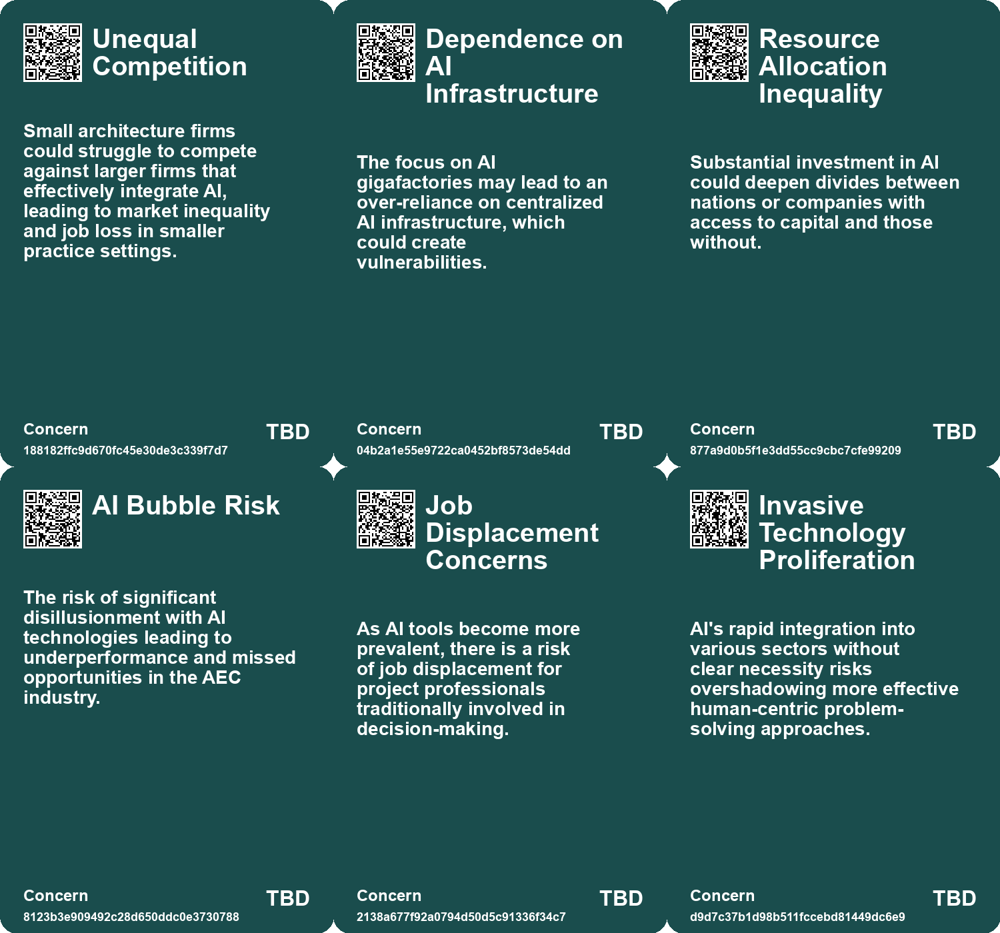

# *Topic*: AI in infrastructure companies

# Summary

The rapid advancement of artificial intelligence (AI) is reshaping various sectors, from national security to architecture, and is prompting significant changes in organizational structures and job markets. Governments and corporations are increasingly recognizing the need for Strategic Fact Reserves to secure reliable training data for AI development. This is seen as essential for maintaining national security and competitive advantage, especially as AI becomes integral to infrastructure and decision-making processes.

In the realm of national security, agencies like the NSA are leveraging AI to detect and counteract cyber threats, particularly from foreign adversaries. The use of AI tools to identify anomalous behavior highlights the technology's role in safeguarding critical infrastructure. However, the potential for AI to disrupt job markets is also a pressing concern. As AI automates routine tasks, organizations are shifting towards flatter hierarchies and hybrid teams, necessitating workforce reskilling and the creation of dedicated AI leadership roles.

The architecture industry faces a dual challenge: while AI can enhance design capabilities and efficiency, it also poses a risk of reducing the demand for human architects. AI's ability to generate designs autonomously raises questions about the future of the profession and the need for architects to adapt to these technological advancements. Similarly, the construction sector is experiencing a transformation through AI-driven project management tools that optimize workflows and enhance safety protocols.

The ethical implications of AI are increasingly under scrutiny. Critics argue that AI often reinforces existing power structures and lacks the necessary ethical considerations in its design. New models, such as Public Diffusion, aim to promote responsible AI use by emphasizing ethical data sourcing and encouraging meaningful engagement from artists and creators. This reflects a broader call for conscious design choices that respect cultural and social values.

AI's potential to drive social good is also a significant theme. Applications of AI are being explored in areas such as health, education, and environmental protection, aligning with the UN Sustainable Development Goals. However, challenges such as funding disparities and biases in AI systems remain. Collaboration among stakeholders is essential to harness AI's capabilities for positive societal impact.

The integration of AI into government operations is another area of focus. Agencies are adopting AI technologies to improve efficiency and productivity, as seen with the IRS's implementation of AI for fraud detection and process streamlining. Despite the promise of AI to enhance government performance, challenges persist in scaling applications and addressing the talent shortage in the public sector.

Finally, the discourse surrounding AI often includes concerns about its environmental impact and the need for responsible management. Critics argue that AI's proliferation, driven by commercial interests, can lead to excessive energy consumption and a lack of genuine necessity for many applications. This calls for a more measured approach to AI development, balancing innovation with sustainability and ethical considerations.

# Seeds

|    | name                                  | description                                                                                           | change                                                                                       | 10-year                                                                                        | driving-force                                                                                     |
|---:|:--------------------------------------|:------------------------------------------------------------------------------------------------------|:---------------------------------------------------------------------------------------------|:-----------------------------------------------------------------------------------------------|:--------------------------------------------------------------------------------------------------|
|  0 | AI as Fundamental Infrastructure      | AI is increasingly recognized as vital as traditional infrastructures like energy and food.           | From AI seen as optional to being classified as critical infrastructure.                     | AI will be a core part of national infrastructure, akin to energy or transportation.           | The integration of AI into everyday productivity and governance will necessitate this change.     |
|  1 | Job Transformation in Creative Fields | AI's role is changing the job landscape for architects and designers.                                 | From traditional roles to new collaborative roles with AI tools.                             | Creative jobs will evolve, with AI as a common collaborator rather than a replacement.         | The integration of AI into design practices necessitating new skill sets.                         |
|  2 | AI-Driven Project Management          | AI tools are streamlining project management processes in construction.                               | From manual project management to AI-enhanced systems that optimize operations.              | Project management will be fully automated, with AI making real-time decisions for efficiency. | The need for increased productivity and cost-effectiveness in construction.                       |
|  3 | Materials Optimization with AI        | AI is helping select sustainable and cost-effective construction materials.                           | From traditional material selection to data-driven, optimized choices.                       | Construction will rely on AI for sustainable material sourcing and waste reduction.            | The push towards sustainability and environmental responsibility in construction.                 |
|  4 | Future of Construction Robotics       | AI integration with robotics offers new possibilities in construction.                                | From human labor-intensive tasks to automated, efficient robotic assistance.                 | Robots will handle most construction tasks, increasing speed and precision.                    | The need for efficiency and innovation in the construction workforce.                             |
|  5 | AI-Driven Quality Control             | AI systems enhance quality control in construction projects.                                          | From manual oversight to continuous AI-powered quality monitoring.                           | Quality assurance will be radically improved, with fewer errors and rework.                    | The demand for higher standards and reduced human error in construction.                          |
|  6 | AI as a Design Prosthesis             | AI is seen as a tool that can augment an architect's capabilities.                                    | Shift from traditional design methods to AI-assisted design processes.                       | The design process may be entirely redefined through AI collaboration.                         | The desire for greater efficiency and innovation in architectural design.                         |
|  7 | AI in Climate Action                  | AI's role in addressing climate change and environmental issues.                                      | From reactive measures to proactive AI-driven solutions for climate resilience.              | AI will play a crucial role in developing strategies for sustainable practices worldwide.      | The urgent need to combat climate change and its disproportionate effects on the poor.            |
|  8 | New Business Models Around AI         | Emerging business models are focusing on AI applications in various sectors, transforming industries. | Shift from traditional business models to ones centered around AI capabilities and services. | Industries may fully evolve to integrate AI as a core component of business strategies.        | The demand for innovative solutions and efficiency is encouraging new AI-centric business models. |
|  9 | AI in Climate Action                  | AI's role in addressing climate change and environmental issues.                                      | From reactive measures to proactive AI-driven solutions for climate resilience.              | AI will play a crucial role in developing strategies for sustainable practices worldwide.      | The urgent need to combat climate change and its disproportionate effects on the poor.            |

# Concerns

|    | name                                 | description                                                                                                                                                                    |
|---:|:-------------------------------------|:-------------------------------------------------------------------------------------------------------------------------------------------------------------------------------|
|  0 | Unequal Competition                  | Small architecture firms could struggle to compete against larger firms that effectively integrate AI, leading to market inequality and job loss in smaller practice settings. |
|  1 | Dependence on AI Infrastructure      | The focus on AI gigafactories may lead to an over-reliance on centralized AI infrastructure, which could create vulnerabilities.                                               |
|  2 | Resource Allocation Inequality       | Substantial investment in AI could deepen divides between nations or companies with access to capital and those without.                                                       |
|  3 | AI Bubble Risk                       | The risk of significant disillusionment with AI technologies leading to underperformance and missed opportunities in the AEC industry.                                         |
|  4 | Job Displacement Concerns            | As AI tools become more prevalent, there is a risk of job displacement for project professionals traditionally involved in decision-making.                                    |
|  5 | Invasive Technology Proliferation    | AI's rapid integration into various sectors without clear necessity risks overshadowing more effective human-centric problem-solving approaches.                               |
|  6 | AI-as-a-Service Business Model Shift | Emergence of AI-as-a-service might transform traditional business models, creating challenges in worker adaptation and new job categories.                                     |
|  7 | Need for Workforce Retraining        | As AI automates certain tasks, there will be increased demand for retraining workers for new roles in AI management and maintenance.                                           |
|  8 | Accessibility of AI Technologies     | If AI platforms become more service-oriented, there could be disparities in access between larger and smaller businesses, affecting competition.                               |
|  9 | Bias and Misinformation in AI        | AI systems may perpetuate or exacerbate issues related to bias and misinformation, impacting decision-making and company reputation.                                           |

# Behaviors

|    | name                                           | description                                                                                                                                |
|---:|:-----------------------------------------------|:-------------------------------------------------------------------------------------------------------------------------------------------|
|  0 | Commercial and National Security Intersections | AI advancements becoming crucial for both corporate competitiveness and national security considerations.                                  |
|  1 | AI as a Competitive Tool                       | Architects are urged to embrace AI tools to enhance their competitiveness in the industry.                                                 |
|  2 | Investment in AI Infrastructure                | Significant investments are being made in AI infrastructure, including cloud computing capabilities, to support generative AI initiatives. |
|  3 | Access to Large-Scale Computing for SMEs       | Efforts to ensure smaller companies can utilize advanced AI computing resources.                                                           |
|  4 | AI as a productivity enhancer                  | AI is being integrated into workplaces to assist with tasks, thereby improving overall productivity and efficiency.                        |
|  5 | AI's role in decision-making                   | AI systems are being designed to assist in decision-making processes across various sectors.                                               |
|  6 | AI-Enhanced Productivity                       | AI tools will drastically reduce project completion times, enhancing productivity across various sectors.                                  |
|  7 | AI as a Commodity                              | AI technology may become a common ingredient, leading smaller companies to gain competitive advantages over larger ones.                   |
|  8 | AI as a Project Companion                      | AI is becoming a companion in project management, assisting with routine tasks and improving overall workflow.                             |
|  9 | AI for Predictive Capabilities                 | AI tools are being used to predict project success and mitigate potential failures, allowing for proactive management.                     |

# Issues

|    | name                               | description                                                                                                                                 |
|---:|:-----------------------------------|:--------------------------------------------------------------------------------------------------------------------------------------------|
|  0 | AI as Cognitive Infrastructure     | AI to be viewed as essential infrastructure, potentially on par with GPS, transforming decision-making and productivity.                    |
|  1 | Evolution of Architectural Design  | AI's influence on architectural design processes may redefine traditional roles and workflows in the industry.                              |
|  2 | AI in Construction                 | The increasing integration of AI technologies in construction, transforming project management, safety, and efficiency.                     |
|  3 | Sustainable Materials Optimization | AI's role in selecting durable and sustainable materials aims to reduce waste and environmental impact in construction projects.            |
|  4 | AI-Driven Quality Control          | AI systems in quality control promise to reduce human error and ensure construction projects meet high standards.                           |
|  5 | AI in Design Processes             | AI's ability to assist in the entire design process could redefine the role of architects, leading to a need for adaptation and new skills. |
|  6 | Investment in AI Infrastructure    | Europe is mobilizing significant funds for AI development, indicating a growing emphasis on AI infrastructure and capabilities.             |
|  7 | Access to AI Computing Power       | The focus on providing smaller companies access to large-scale computing resources may democratize AI development.                          |
|  8 | Data-Driven Decision Making        | AI's capability to process large data sets for better predictions is becoming crucial in project planning and execution.                    |
|  9 | New Business Models in AI          | Potential for new business models focused on AI services, similar to fabless semiconductor companies, may emerge.                           |

# Technologies

|    | name                                         | description                                                                                                                          |
|---:|:---------------------------------------------|:-------------------------------------------------------------------------------------------------------------------------------------|
|  0 | AI as Cognitive Infrastructure               | AI is becoming an essential infrastructure comparable to energy and education systems, facilitating automation in various sectors.   |
|  1 | Artificial Intelligence (AI)                 | AI's rapid advancements enable large-scale deployment across various sectors to promote social good and address challenges.          |
|  2 | Artificial Intelligence (AI) in Construction | AI is transforming project management, predictive maintenance, and quality control in construction, enhancing efficiency and safety. |
|  3 | AI-Driven Project Management Tools           | AI tools streamline project management by optimizing planning, scheduling, and resource allocation through data analysis.            |
|  4 | AI-driven Startups                           | Emerging companies utilizing AI technologies to innovate in various fields, including life sciences and safety research.             |
|  5 | Cloud Computing Resources for Research       | Utilization of cloud services from major tech companies to support AI research and public initiatives.                               |
|  6 | AI in Computer Vision                        | AI's role in automating tasks involving vision, with a focus on economic viability for workplace integration.                        |
|  7 | AI-as-a-Service                              | Platforms providing AI solutions as a service, democratizing access for smaller businesses and enabling new business models.         |
|  8 | Chief AI Officer (CAIO) Role                 | Emergence of leadership roles dedicated to overseeing AI integration in businesses.                                                  |
|  9 | Smart City Initiatives                       | AI integration in urban services for improved operational efficiency and customer satisfaction.                                      |

# Cards

## Concerns

## Behaviors

## Issue

## Technology

# Links

* [Public-Private Partnerships in AI: Risks and Societal Implications](https://futures.kghosh.me/6264095641147fe54800b8f03723f381)
* [European Commission Unveils €200 Billion AI Investment Plan with Focus on Gigafactories](https://futures.kghosh.me/32b15503bb9a88d3cb10661b71c47eb4)
* [Harnessing AI for Social Good: Opportunities and Challenges in Achieving the UN SDGs](https://futures.kghosh.me/0d88d49818819d335d12f792275fde97)
* [Transforming Project Management: The Impact of AI and Machine Learning on Delivery Success](https://futures.kghosh.me/9b8c9e1c07779589f3ecf3d75fb375ba)
* [MIT Study Challenges AI Job Displacement Fears with Economic Viability Insights](https://futures.kghosh.me/89ee61cc0d9fa77ecb1eb4100622a53f)
* [The Necessity of Strategic Fact Reserves for AI Development in Nations and Corporations](https://futures.kghosh.me/05e89c4773a48ddeceedf5e1e0e1d4fe)
* [U.S. Intelligence Community's Integration of Generative AI for Enhanced Operations](https://futures.kghosh.me/dc6864119c8835a3637517b2a4fe9fbb)
* [Global Government Reforms: Advancements in Efficiency through Digital Transformation and AI](https://futures.kghosh.me/3f295c6c0c9af1ecd24bfa22b6ef6b47)
* [The Impact of AI on Architecture and Design: A New Era of Creativity and Collaboration](https://futures.kghosh.me/1f02642f54cf28611a00e4c83c1d428f)
* [A Comprehensive Taxonomy for Artificial General Intelligence Development Over 25 Years](https://futures.kghosh.me/848ae6771411e76eb554d6d4d2c8f07f)
* [Adapting Organizational Structures to Embrace AI: Lessons from History and Future Directions](https://futures.kghosh.me/fd0f3b7a6783ba6a0fcd3a18c8241be5)
* [The Threat of Authoritarian Intelligence: A Call for Responsible AI Development](https://futures.kghosh.me/0ba4fa557cd2aae4760bd7a2abca844e)
* [The Transformative Impact of AI on Organizational Structures and Culture](https://futures.kghosh.me/fe6a32f4a3def00b40a187cec64fec72)
* [The Existential Threat of AI to the Architecture Profession: A Call to Action for Architects](https://futures.kghosh.me/bf4505c73a7c8cd0d84f15d3384b0433)
* [The Transformative Impact of AI on the Construction Industry: Innovations and Future Prospects](https://futures.kghosh.me/4c573871ba10e6b696264391285cc955)
* [The Invasive Nature of AI: Impacts on Ecosystems and Decision-Making](https://futures.kghosh.me/40905d50f6ec5c6edbd1a6e1d9659218)
* [The Transformative Impact of AI on Productivity and Entrepreneurship in 2023](https://futures.kghosh.me/a40580730388900810b4496ff9891dc9)
* [The Transformative Potential of AI: Revolutionizing Education, Healthcare, and Global Equity](https://futures.kghosh.me/2449c2fc4b8afc7e268db4987fa821e5)
* [AI Enhances U.S. Cybersecurity Against Chinese Hacking Threats to Critical Infrastructure](https://futures.kghosh.me/cea16dfec561c12861cfadf0455880f1)
* [Rethinking the Role of AI: From Political Tool to Ethical Design Options](https://futures.kghosh.me/c25cae2b8d72e7634d591247d9ac96d2)
* [Exploring the Top Five Digital Trends Transforming the AEC Industry by 2025](https://futures.kghosh.me/4fa95d956537d2dbb69564d1fce9ab67)
* [AI's Impact on Society: Job Displacement and the Need for Retraining](https://futures.kghosh.me/cf119665e47c7434e3e3c54dbbc585e3)
* [Summary of Algorithmic Impact Assessments for Automated Immigration Tools in Canada](https://futures.kghosh.me/f4c4b44832de983ad30047e9b2632bc1)
* [The Transformative Potential of AI: Revolutionizing Education, Healthcare, and Global Equity](https://futures.kghosh.me/8acafe1fbe51c2de3cd689956b25b39f)
* [Thriving in an AI Era: Embracing, Adapting, and Complementing Technology](https://futures.kghosh.me/23a3410059759ba4214235628d4ebd4b)