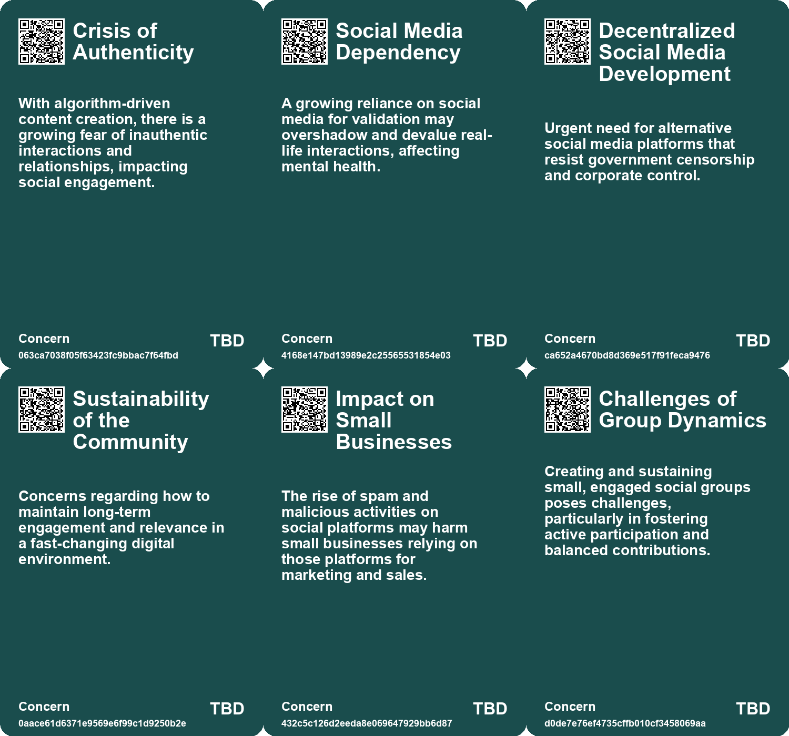
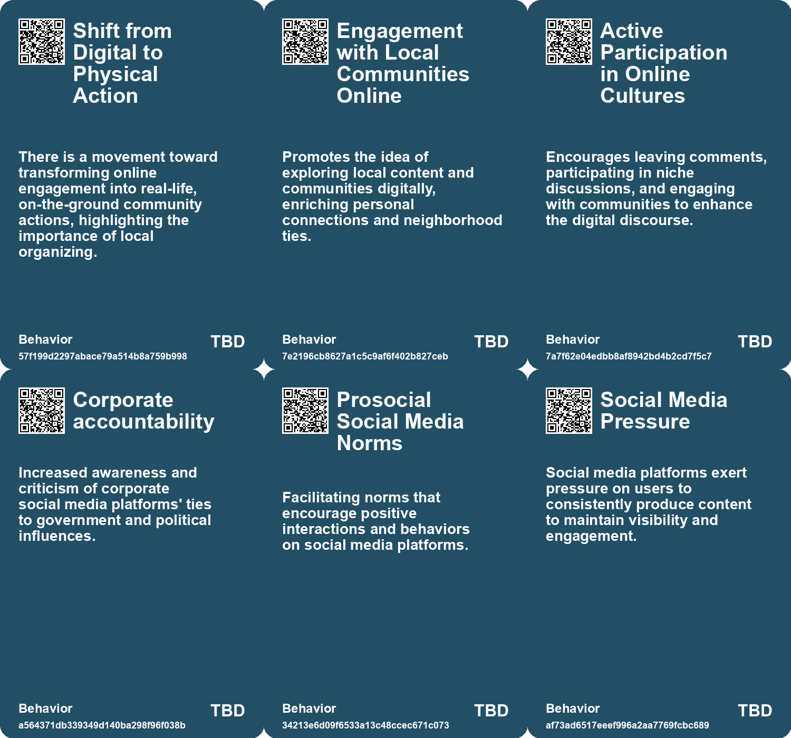
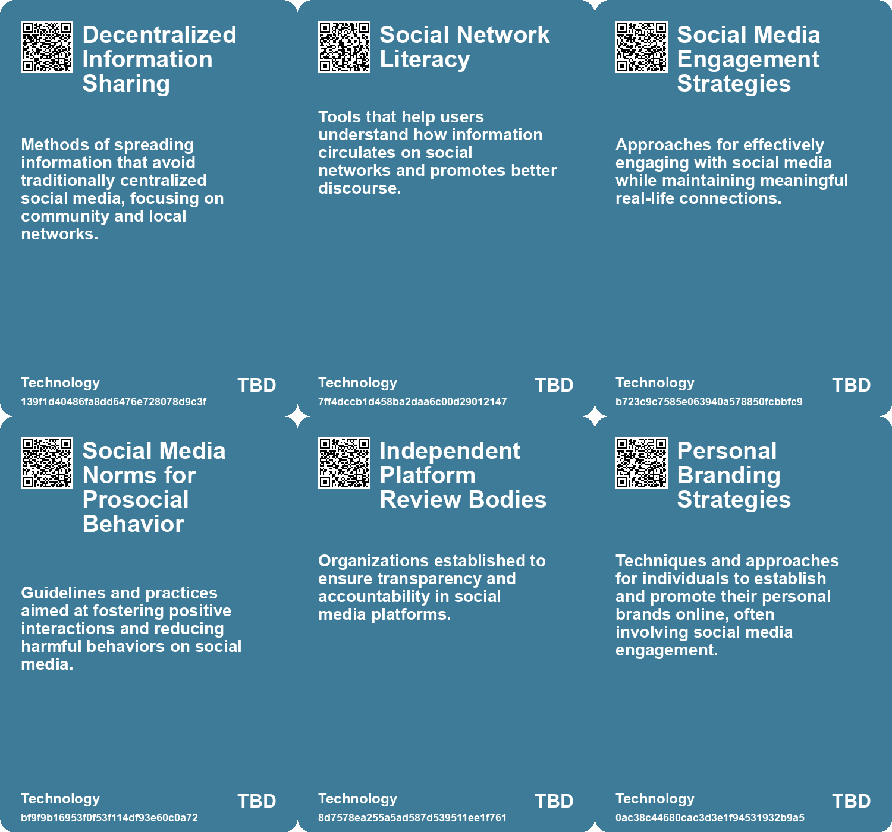

# *Topic*: Active Participation in Social Media

# Summary

The current state of democracy is under threat from groups adept at spreading misinformation through social media. These groups manipulate structures and exploit cognitive biases, making it essential to develop immunity activators like media literacy strategies and independent review bodies. Such measures aim to enhance transparency and promote pro-social online behaviors.

Transparency and openness in creative processes are increasingly valued. The metaphor of "working with their garage door up" encourages individuals to share their struggles and successes publicly, fostering deeper community connections. This contrasts with traditional marketing strategies that often prioritize polished presentations over authentic engagement.

Social media platforms, particularly Instagram, have shifted from spaces for genuine sharing to curated environments dominated by professional content. Users are increasingly frustrated and are seeking private posting options to escape the pressure of public scrutiny. This trend has led to the emergence of new apps that cater to niche communities, signaling a move towards more authentic online interactions.

Loneliness has emerged as a significant public health crisis, with a notable percentage of Americans reporting feelings of isolation. The U.S. Surgeon General's report emphasizes the importance of social connections for mental well-being and calls for technology companies to create apps that promote social health metrics. Businesses are also encouraged to adopt community-centric strategies to foster meaningful relationships.

The need for decentralized social media platforms is becoming more urgent as concerns about government censorship and corporate control grow. Recent controversies surrounding TikTok and the actions of political figures have highlighted the risks associated with corporate social media. This has sparked discussions about the necessity for alternatives that can mitigate censorship and hate speech.

The hidden economy of spam on social media platforms reveals a thriving business model that complicates efforts to combat misinformation. Infiltrating communities of spammers has shown the challenges platforms face in addressing this issue, underscoring the need for integrated solutions that consider the actors behind spam.

The rise of manufactured sentiment through bot farms is distorting online perceptions and complicating brand health assessments. Anonymity allows artificial accounts to skew realities, making it difficult for companies to make informed decisions. Proposed solutions include digital identity verification to ensure authentic interactions in an increasingly unreliable social media landscape.

Continuous partial attention in our hyper-connected world hampers relationship-building efforts. The desire to stay connected online during in-person events dilutes the quality of interactions. It is crucial to recognize when to focus on face-to-face connections and limit digital distractions.

The concept of "digital liveness" explores how user interactions on digital platforms create a sense of presence. Markers like message indicators and verified accounts influence engagement, while declining organic reach emphasizes the need for effective content and community strategies.

Event marketers are increasingly focusing on brand communities, integrating events as a means to foster connections. Successful examples from major companies illustrate how community-driven strategies enhance customer relationships and engagement.

Studies indicate that heavy chatbot usage may lead to increased loneliness and diminished real-world socialization. While most users maintain neutral relationships with chatbots, power users show concerning signs of emotional dependence. Responsible design and regulation are necessary to address these mental health implications.

Finland's approach to combatting misinformation through digital literacy in schools serves as a model for integrating fact-checking skills into education. This initiative encourages critical thinking and equips students to navigate online media competently.

The digital landscape is filled with choice architectures that prioritize commercial interests, posing risks to autonomy and civility. Strategies to boost cognitive competences and improve digital environments are essential for promoting truth and democratic discourse.

Meta's shift from human moderation to AI-driven content management raises concerns about user agency and privacy. This transition may lead to a manipulated user experience, overshadowing genuine human interactions with algorithm-driven content.

Utah's new legislation regulating teenagers' access to social media aims to enhance online safety and protect privacy. The law requires age verification and parental consent for minors, reflecting growing concerns about the impact of social media on youth.

# Seeds

|    | name                                      | description                                                                                        | change                                                                                     | 10-year                                                                                                                    | driving-force                                                                                     |
|---:|:------------------------------------------|:---------------------------------------------------------------------------------------------------|:-------------------------------------------------------------------------------------------|:---------------------------------------------------------------------------------------------------------------------------|:--------------------------------------------------------------------------------------------------|
|  0 | Community-Centric Internet Navigation     | Increasing emphasis on local and community-based online interactions.                              | From global, impersonal internet usage to a more localized, community-focused approach.    | In 10 years, social interactions may center around local digital spaces and communities, enhancing real-world connections. | A reaction against social media's generality, fostering local community engagement.               |
|  1 | Social Network Literacy                   | Developing skills to understand information flows and dynamics on social media.                    | Evolving from naive participation in social networks to informed and strategic engagement. | In 10 years, users will navigate social networks with a clear understanding of how information propagates.                 | The need for responsible social media use amid growing misinformation and polarization.           |
|  2 | Social Media Before Personal Interactions | People increasingly engage with social media before personal interactions in their daily routines. | Changing priorities from personal relationships to virtual interactions.                   | Daily routines may further prioritize online engagement over face-to-face connections.                                     | The ingrained habit of checking social media as a first action in the morning drives this change. |
|  3 | Rise of Decentralized Social Media        | Urgency for alternative social media resistant to censorship and corporate control.                | Transitioning from centralized platforms to decentralized alternatives for user autonomy.  | In ten years, decentralized platforms may dominate, prioritizing user privacy and control over data.                       | Growing dissatisfaction with current social media's censorship and corporate ownership.           |
|  4 | Political Influence on Social Media       | Social media platforms increasingly influenced by political figures and decisions.                 | From independent platforms to ones shaped by political affiliations and agendas.           | In ten years, social media could be heavily regulated or biased towards specific political ideologies.                     | Political interests seeking to control narratives and platform policies.                          |
|  5 | Focus on inclusivity                      | There is a growing emphasis on building inclusive online communities.                              | From exclusive, top-down community structures to more inclusive, participatory designs.    | In 10 years, inclusivity may be a fundamental aspect of all community practices.                                           | The demand for diverse representation and equitable participation in community frameworks.        |
|  6 | Promotion of prosocial online behaviors   | New norms to encourage positive interactions on social media.                                      | Shift from toxic online environments to supportive and constructive interactions.          | Healthier online communities may foster better civic engagement and trust.                                                 | Desire for safer and more inclusive digital spaces.                                               |
|  7 | Emergence of Thoughtful Social Media      | A design concept for social media focused on deep writing and community engagement.                | Shift from superficial social media interactions to meaningful, long-form communication.   | Social media platforms may evolve to prioritize quality interactions over mere quantity of content.                        | Growing dissatisfaction with current social media's lack of depth and meaningful connections.     |
|  8 | Automated Community Management            | Automation in managing online groups to maintain active participation.                             | From manual member management to automated systems that maintain engagement and quality.   | Online communities may utilize advanced automation to ensure vibrant and active member participation.                      | Need for efficient management tools in increasingly large and complex online communities.         |
|  9 | Focus on Quality Over Quantity            | A shift towards prioritizing quality content and interactions in social groups.                    | Moving away from vanity metrics to measures of meaningful engagement and contribution.     | Online platforms may emphasize quality interactions, reshaping content creation and consumption.                           | Frustration with current metrics that do not reflect genuine engagement or community health.      |

# Concerns

|    | name                                     | description                                                                                                                                       |
|---:|:-----------------------------------------|:--------------------------------------------------------------------------------------------------------------------------------------------------|
|  0 | Crisis of Authenticity                   | With algorithm-driven content creation, there is a growing fear of inauthentic interactions and relationships, impacting social engagement.       |
|  1 | Social Media Dependency                  | A growing reliance on social media for validation may overshadow and devalue real-life interactions, affecting mental health.                     |
|  2 | Decentralized Social Media Development   | Urgent need for alternative social media platforms that resist government censorship and corporate control.                                       |
|  3 | Sustainability of the Community          | Concerns regarding how to maintain long-term engagement and relevance in a fast-changing digital environment.                                     |
|  4 | Impact on Small Businesses               | The rise of spam and malicious activities on social platforms may harm small businesses relying on those platforms for marketing and sales.       |
|  5 | Challenges of Group Dynamics             | Creating and sustaining small, engaged social groups poses challenges, particularly in fostering active participation and balanced contributions. |
|  6 | Emergence of New Social Media Dynamics   | Niche communities are rising, which can both enhance connections and create challenges for influencers and marketers to engage effectively.       |
|  7 | Digital Fatigue and Burnout              | An overwhelming amount of content consumption leads to fatigue, causing users to detach from social media engagement altogether.                  |
|  8 | Nostalgia for Simplicity                 | There is a growing sentiment that the past simplicity of social interactions and media consumption was more fulfilling and less stressful.        |
|  9 | Need for Innovative Community Engagement | Companies must explore innovative ways to foster community interactions and mitigate social isolation.                                            |

# Cards

## Concerns

## Behaviors

## Issue

## Technology

# Links

* [Meta Halts Political Ads in EU to Avoid New Transparency Regulations](https://futures.kghosh.me/014ce3100d6fcc7d160362d608f5c6fe)
* [Addressing Threats to Democracy: Strategies for Resilience Against Misinformation and Manipulation](https://futures.kghosh.me/56d1a28746cd95ebaa3d62a4e1f91c3a)
* [Finland's Innovative Approach to Combating Fake News Through Education](https://futures.kghosh.me/ad15fbe04bbe50ec3436c61403d19fca)
* [Oma's Soep Launches Campaign to Combat Loneliness Through Grocery Store Interactions](https://futures.kghosh.me/d73cef2dc5d458ba6b4a61dff2997181)
* [The Burden of Self-Promotion: Navigating Art in the Age of Personal Branding](https://futures.kghosh.me/2306b74e2c380b5208c7752bd78c4e12)
* [The Value of Publicly Sharing Creative Processes Over Finished Products](https://futures.kghosh.me/2f48103338d2c48e804e6878d7019e0b)
* [Designing Thoughtful Social Media: The Concept of Letter Circles for Meaningful Engagement](https://futures.kghosh.me/e0dd77b135a529ee920c59b0fc1e1059)
* [The Rise of Industrialized Sentiment Manipulation and the Need for Digital Identity Verification](https://futures.kghosh.me/344ece8d21b6241ead5160fe9a38742f)
* [EU Study Reveals X (Twitter) Leads in Disinformation Among Social Media Platforms](https://futures.kghosh.me/5793d28b92e90a64b918cfaefad509db)
* [Addressing the Social Fitness Crisis: The Need for Connection in Modern Society](https://futures.kghosh.me/9aeeedec876dadd7664c8ac15af0b90e)
* [The Impact of Continuous Partial Attention on Networking and Relationships in a Digital World](https://futures.kghosh.me/417df5448432cb603f40dec77f469b87)
* [The Impact of Supersharers on Vaccine Hesitancy and Fake News Spread on Social Media](https://futures.kghosh.me/091c0c86efbac50bd1354fbc72324198)
* [Embracing RSS: A Solution for a Better Internet Experience](https://futures.kghosh.me/1dbd39b8ce1a1c86ca4df7ec83cef470)
* [Exploring the Modern Entertainment Landscape and Its Societal Implications](https://futures.kghosh.me/c5c2c794f1426e6e307a9df3f9ff61f6)
* [Exploring the Complex Underground Economy of Spam on Social Media Platforms](https://futures.kghosh.me/624824a70a2ff3ab1c5aaafdfbf293e7)
* [Enhancing Digital Competences: Strategies for Navigating Online Challenges](https://futures.kghosh.me/0770afeb444e4bbb336cdc72c07d6688)
* [Rediscovering the Internet: Exploring Alternative Paths and Local Connections in Digital Spaces](https://futures.kghosh.me/6f8a5d927973f7315eafe2e8f7207e36)
* [Nostalgia for Simplicity: The Burden of Infinite Choice in Modern Life](https://futures.kghosh.me/7b316ebe449187b79e519a8c6d12a2cd)
* [Meta's Shift to AI: A New Era of Engagement or Manipulation?](https://futures.kghosh.me/00fc141d850089c669b0fbd1de4cdb80)
* [The Fourth Era of Brand Communities: Integrating Events with Marketing Strategies](https://futures.kghosh.me/c179345a7154fb8f3f2f4209ed487406)
* [Exploring the Risks of Heavy Chatbot Use on Mental Health and Social Interactions](https://futures.kghosh.me/424dd84488f34cb7d735777fe34b584e)
* [Utah Enacts Strict Social Media Regulations for Teenagers to Enhance Online Safety](https://futures.kghosh.me/3f7f68f94d44849513156aae48ee013f)
* [Creating a Minimum Viable Community of Practice Through Co-Design Workshops](https://futures.kghosh.me/62917f945a037530e2691fe05a2600ea)
* [Understanding Digital Liveness: Key Indicators and User Engagement on Social Media](https://futures.kghosh.me/4d99da5c2a48b37588b98182eb31478a)
* [The Urgent Need for Decentralized Social Media Amidst Political Turmoil](https://futures.kghosh.me/b8ae24e6d0683d0069e0ee250a9d21f0)
* [The Shift from Public Instagram to Private Community Sharing: A New Era in Social Media](https://futures.kghosh.me/73a2bffc6e94204086528949ae1205e7)