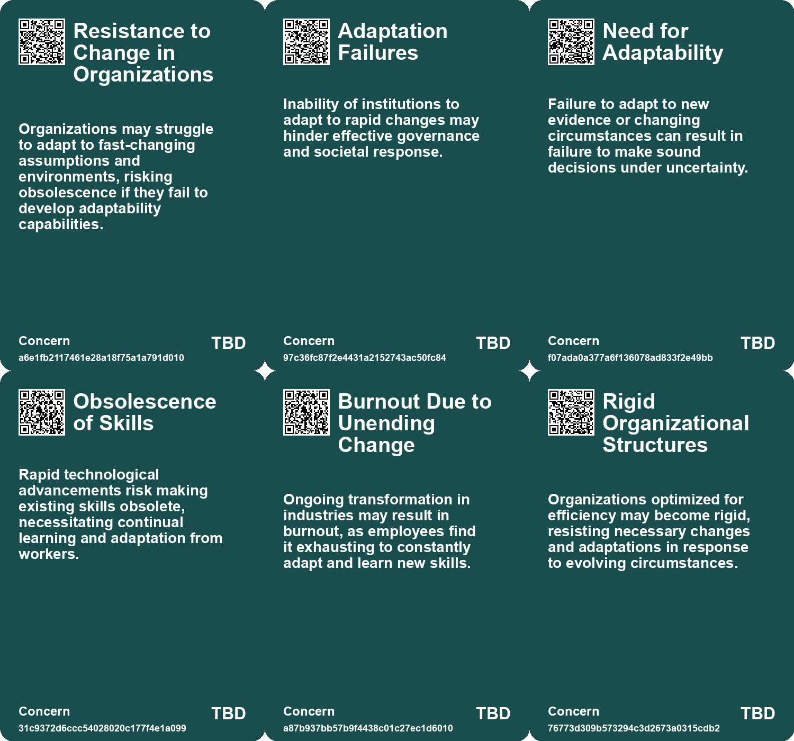
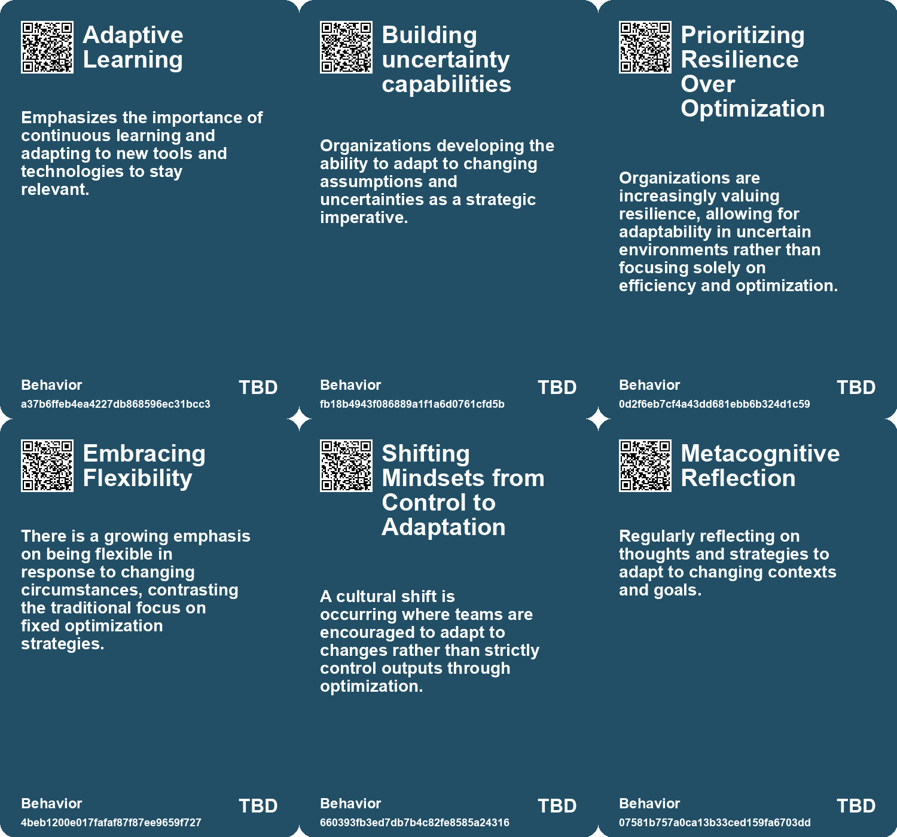
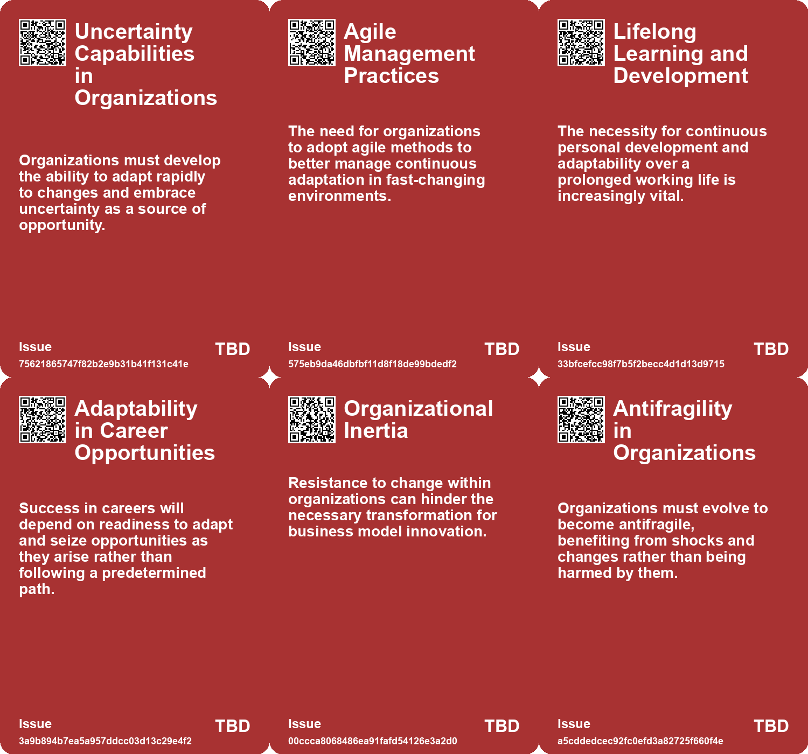
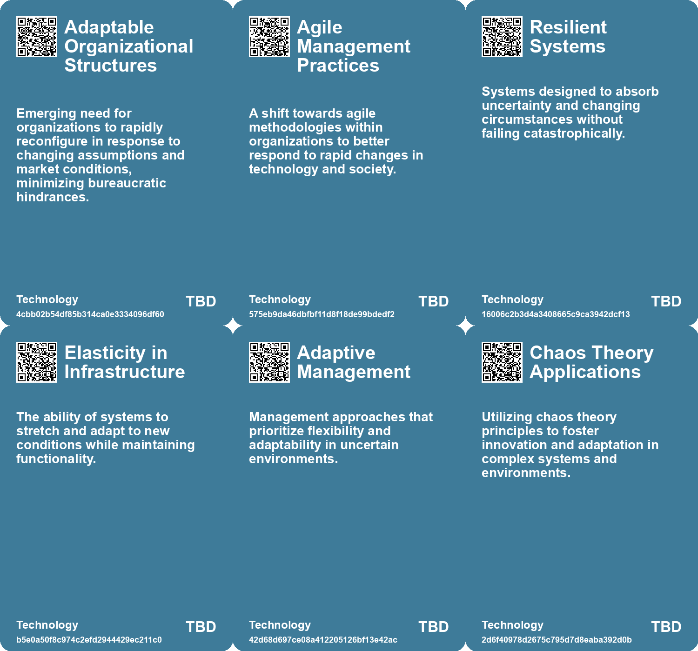

# *Topic*: Adaptation to Change

# Summary

Chaos and Innovation

Chaos is often perceived as a threat to stability, yet it is essential for life and innovation. The concept of the "edge of chaos" highlights how self-organization and adaptation thrive in environments that balance order and disorder. Embracing chaos can lead to growth, and individuals can navigate it by establishing rituals, practicing metacognition, and collaborating with others.

Change Management in the AI Era

As organizations adapt to the age of artificial intelligence, effective change management becomes crucial. A balanced approach between automation and human insight is necessary to prevent over-reliance on AI. Employees must understand the rationale behind AI integration, viewing it as a partner rather than a replacement. Upskilling in resilience, agility, and continuous learning is vital, as is fostering a culture of collaboration and shared goals.

Adapting Business Models

Organizations face the imperative to reinvent their business models in response to rapid technological disruption and shifting customer needs. CEOs must proactively adapt their strategies, focusing on understanding customer demands and leveraging ecosystems. Embracing experimentation through minimum viable products can help organizations stay relevant in a competitive landscape.

Resilience Over Optimization

The limitations of optimization in unpredictable environments are becoming increasingly clear. While optimization works under stable conditions, resilience is essential for systems to adapt to change. This principle extends to personal and team management, where flexibility and preparedness for uncertainty are crucial for success.

Workforce Transformation

The PwC Global Workforce Hopes and Fears Survey reveals a disconnect between business leaders' transformation goals and their company cultures. Many employees are eager to learn new skills and embrace AI, yet companies often lack an environment that encourages debate and dissent. As a result, a significant number of workers are considering leaving their jobs. Leaders must prioritize workforce engagement and skills development to foster a culture of reinvention.

Navigating Uncertainty

In a world characterized by rapid change, the ability to navigate uncertainty is paramount. Embracing a 'red-team mindset' allows individuals and organizations to visualize potential futures and make informed decisions. Critical thinking and adaptability are essential traits for effectively managing the unknown, as luck plays a role in outcomes but can be complemented by proactive decision-making.

Evolving Leadership and Organizational Structures

The nature of leadership is shifting from traditional management to mentorship and coaching. This evolution is driven by technological advancements and changing workforce dynamics. Organizations must transition to more flexible structures that prioritize talent and customer needs over rigid processes. A modern approach to leadership emphasizes continuous learning and the acceptance of diverse perspectives, ensuring relevance in a rapidly changing environment.

# Seeds

|    | name                                               | description                                                                                              | change                                                                                                | 10-year                                                                                                           | driving-force                                                                                       |
|---:|:---------------------------------------------------|:---------------------------------------------------------------------------------------------------------|:------------------------------------------------------------------------------------------------------|:------------------------------------------------------------------------------------------------------------------|:----------------------------------------------------------------------------------------------------|
|  0 | Importance of continuous learning                  | The necessity to learn new skills in a rapidly changing work environment.                                | A transition from static education to ongoing self-education and adaptability.                        | In the future, lifelong learning will be normal, shaping career trajectories and choices.                         | The increasing pace of technological change and its impact on job security and relevance.           |
|  1 | Emergence of Agile Management Practices            | Organizations are slowly adopting agile practices to cope with rapid changes.                            | Traditional organizational structures are transitioning to more adaptive, agile management practices. | In a decade, agile management may become standard in organizations, enhancing adaptability to change.             | The need for rapid decision-making and local responsiveness drives the adoption of agile practices. |
|  2 | Lifelong Learning Emphasis                         | There is an increasing emphasis on continuous learning and adaptation throughout one's career.           | Shift from fixed skill sets to a model where continuous learning and unlearning are expected.         | Continuous learning may become a standard expectation in all industries, impacting training and development.      | Rapid technological advancements and market changes necessitate ongoing skill development.          |
|  3 | Emergence of Flexible Work Environments            | Workplaces are evolving to become more adaptable to change rather than strictly efficient.               | Transforming rigid work environments into flexible and responsive systems.                            | Future workplaces may emphasize employee well-being and adaptability over strict performance metrics.             | The need for organizations to respond quickly to market or environmental changes.                   |
|  4 | Recognition of Unpredictable Environments          | Leaders are acknowledging that business environments are increasingly unpredictable.                     | Shifting mindset from certainty and predictability to embracing uncertainty.                          | Organizations may develop strategies specifically designed to thrive in uncertain conditions.                     | Growing awareness of the volatility in global markets and environments.                             |
|  5 | Cultural Shift in Management Practices             | Management practices are evolving to support resilience and adaptability.                                | Transitioning from command-and-control management to more flexible approaches.                        | Future management may focus on empowering teams to respond creatively to change.                                  | The need for organizations to remain competitive in fast-changing environments.                     |
|  6 | Embracing Chaos for Growth                         | People are learning to embrace chaotic environments as opportunities for innovation and adaptation.      | Shifting from resisting chaos to actively seeking growth and innovation through it.                   | In 10 years, organizations may prioritize flexible structures that thrive in chaos rather than rigid hierarchies. | The increasing complexity of global challenges demands adaptive and innovative solutions.           |
|  7 | Shift in Education Priorities                      | A call to transform the education system to prioritize creativity and adaptability.                      | Education is moving from rote learning to fostering curiosity and experimentation.                    | By 2033, education systems may fully embrace experiential learning, reducing standardized testing.                | The need for adaptability in a rapidly changing, complex world.                                     |
|  8 | Organic and Flexible Organizational Structures     | Organizations are moving towards organic structures that adapt to changes rather than rigid hierarchies. | From static, rigid structures to dynamic, organic organizational frameworks that adapt to change.     | Future organizations will have fluid structures that rapidly adjust to market conditions and opportunities.       | The volatility of global markets and technological changes necessitates flexibility.                |
|  9 | Employee Reinvention Readiness vs. Company Culture | Workers are more prepared for change than their companies are.                                           | Shift from a passive workforce to an active, engaged one ready for transformation.                    | Companies will increasingly align their cultures with the evolving needs of skilled workers.                      | The push for innovation and skills development amidst economic pressures.                           |

# Concerns

|    | name                                    | description                                                                                                                                                |
|---:|:----------------------------------------|:-----------------------------------------------------------------------------------------------------------------------------------------------------------|
|  0 | Resistance to Change in Organizations   | Organizations may struggle to adapt to fast-changing assumptions and environments, risking obsolescence if they fail to develop adaptability capabilities. |
|  1 | Adaptation Failures                     | Inability of institutions to adapt to rapid changes may hinder effective governance and societal response.                                                 |
|  2 | Need for Adaptability                   | Failure to adapt to new evidence or changing circumstances can result in failure to make sound decisions under uncertainty.                                |
|  3 | Obsolescence of Skills                  | Rapid technological advancements risk making existing skills obsolete, necessitating continual learning and adaptation from workers.                       |
|  4 | Burnout Due to Unending Change          | Ongoing transformation in industries may result in burnout, as employees find it exhausting to constantly adapt and learn new skills.                      |
|  5 | Rigid Organizational Structures         | Organizations optimized for efficiency may become rigid, resisting necessary changes and adaptations in response to evolving circumstances.                |
|  6 | Misapplication of Traditional Solutions | Applying traditional solutions to adaptive problems during chaotic times may lead to failure and exacerbate crises.                                        |
|  7 | Technological Disruption                | Rapid technological advancements are reshaping industries, requiring companies to adapt quickly or risk obsolescence.                                      |
|  8 | Emerging Customer Needs                 | Changing consumer preferences and demands require companies to continually reassess their value propositions and business models.                          |
|  9 | Inflexibility of Traditional Structures | Organizations may struggle to adapt to rapidly changing market dynamics, resulting in loss of competitiveness.                                             |

# Cards

## Concerns

## Behaviors

## Issue

## Technology

# Links

* [Effective Change Management Strategies for AI Integration in Organizations](https://futures.kghosh.me/7eff1fa6b2dda89fa9c1470272891080)
* [Adapting Organizational Structures to Embrace AI: Lessons from History and Future Directions](https://futures.kghosh.me/fd0f3b7a6783ba6a0fcd3a18c8241be5)
* [Understanding Employee Sentiment: Key Findings from PwC's Global Workforce Survey](https://futures.kghosh.me/b865313fdf172979b9c852573395fab1)
* [Thriving in an AI Era: Embracing, Adapting, and Complementing Technology](https://futures.kghosh.me/23a3410059759ba4214235628d4ebd4b)
* [Exploring Goal Flexibility and AI's Impact on Creativity and Connection](https://futures.kghosh.me/94d31e760d2d34d7355ef3ee6bf47ffe)
* [The Cascading Consequences of Climate Change: A Call for Awareness and Resilience](https://futures.kghosh.me/7f30f2f7549b14f00211791717a8a342)
* [Embracing Change: The Imperative of Learning in a Transformative Technological Landscape](https://futures.kghosh.me/5943d4f4a67ae08d193b8921d848ea88)
* [Navigating Decision-Making Challenges in an AI-Driven World: The Need for AAA Traits](https://futures.kghosh.me/c474eac8117547a89cac2c805652df9c)
* [The Conflict Between Optimization and Resilience in Organizational Systems](https://futures.kghosh.me/0362ad6b5f22e9f1a7f14a4b08987bc0)
* [Navigating Business Model Reinvention Amidst Technological and Environmental Challenges](https://futures.kghosh.me/5b306738838609725fba5dfdcbdff28b)
* [The Shift from Traditional Bosses to Modern Leadership: Embracing Growth and Change](https://futures.kghosh.me/74d6cb3000734dab48879c07a53c6632)
* [Embracing Uncertainty: Strategies for Navigating Life's Unknowns](https://futures.kghosh.me/b6a1403e12fe78cbb944ee7233c6d1f4)
* [Redesigning Organizational Structures for a Rapidly Changing Future](https://futures.kghosh.me/a6112c31b538ae6e0d92d0e186d5c5f0)
* [Five Emerging Trends Transforming Business in the Coming Year](https://futures.kghosh.me/55bac03899915f25bf0b47fa4342472c)
* [The Importance of Self-Management in Modern Careers: Insights from Peter Drucker](https://futures.kghosh.me/b76d6d3f8d4be2311caae40cce7b39a3)
* [Navigating the Uneven Impact of AI Advancements on Organizations and Society](https://futures.kghosh.me/9778e77f4b1aec6ab3d8763f2257c34f)
* [Evolving Perspectives on Risk Management in the Context of Modern Disasters](https://futures.kghosh.me/cd4f6f65b2486d56699138cd2270044d)
* [Navigating Workforce Transformation: Insights from PwC's Global Survey on Employee Aspirations and Company Culture](https://futures.kghosh.me/4c886ce0e70f066b9f2199abe1d7bd1c)
* [The Four Shifts: Transforming Society and Business in a Rapidly Changing World](https://futures.kghosh.me/0506cba04945d4f8cf25bf2399d36a46)
* [Embracing Chaos: Strategies for Thriving in Uncertain Times](https://futures.kghosh.me/7456d661e6f006d09a3f10e8790588d0)
* [Essential Career Lessons for Success Across Decades in Today’s Workforce](https://futures.kghosh.me/a06d27f1dd5a2328ba6aa8854abc5318)
* [Navigating Future Shock: Toffler's Insights on Technology, Governance, and Democracy in a Rapidly Changing World](https://futures.kghosh.me/14a8b49f5342c0428f8f03db633c57d5)