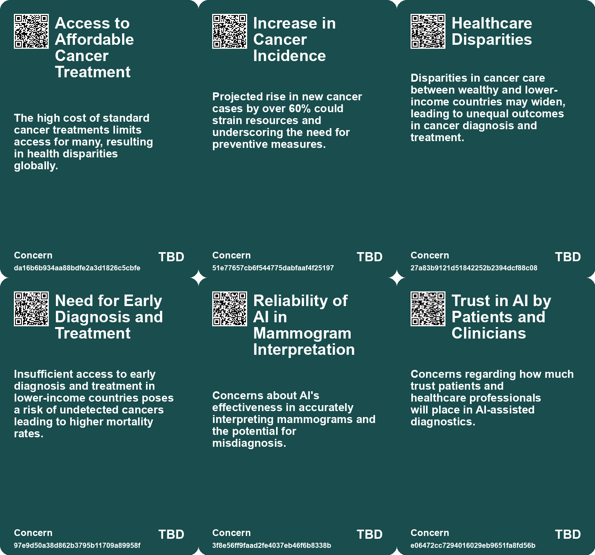
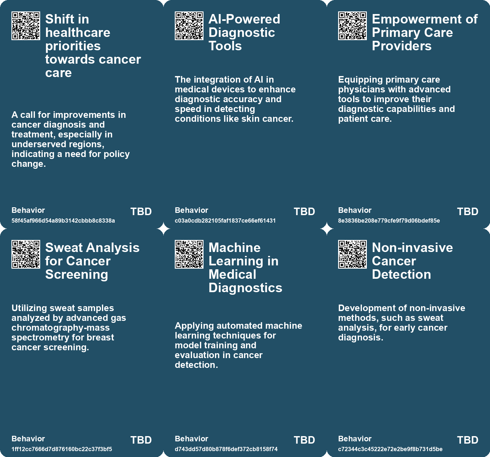
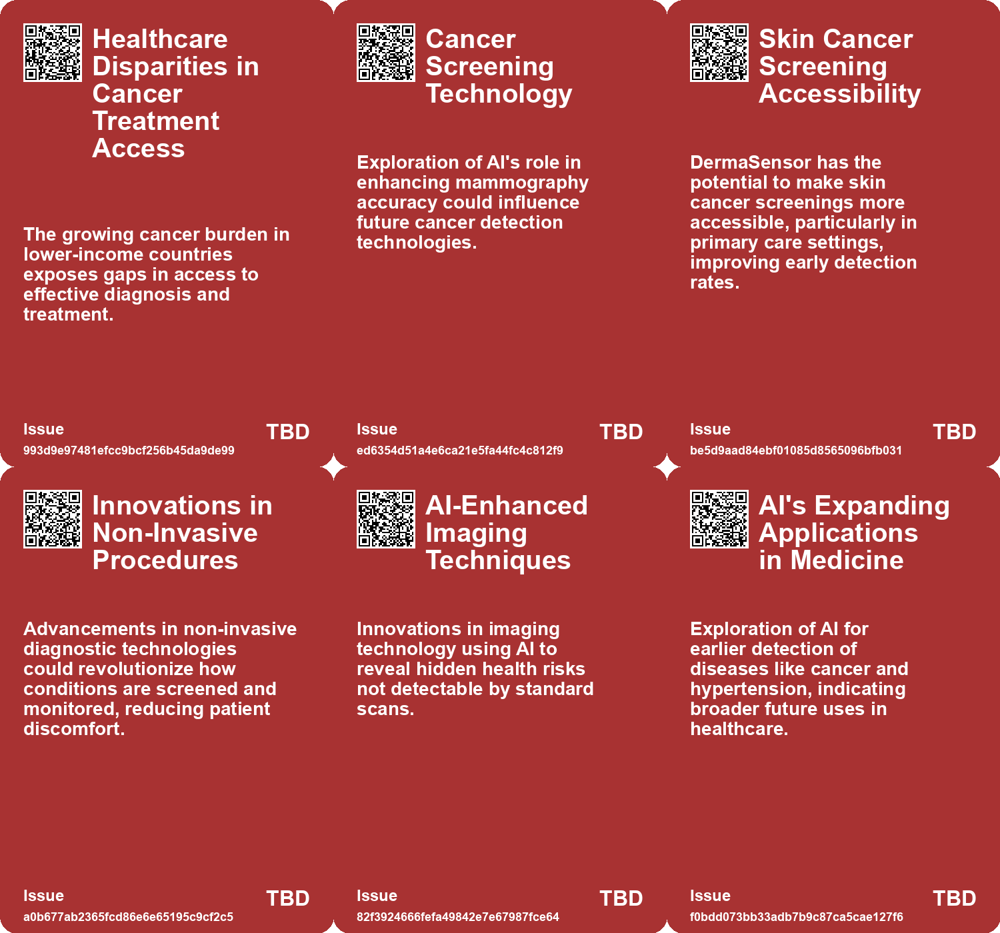
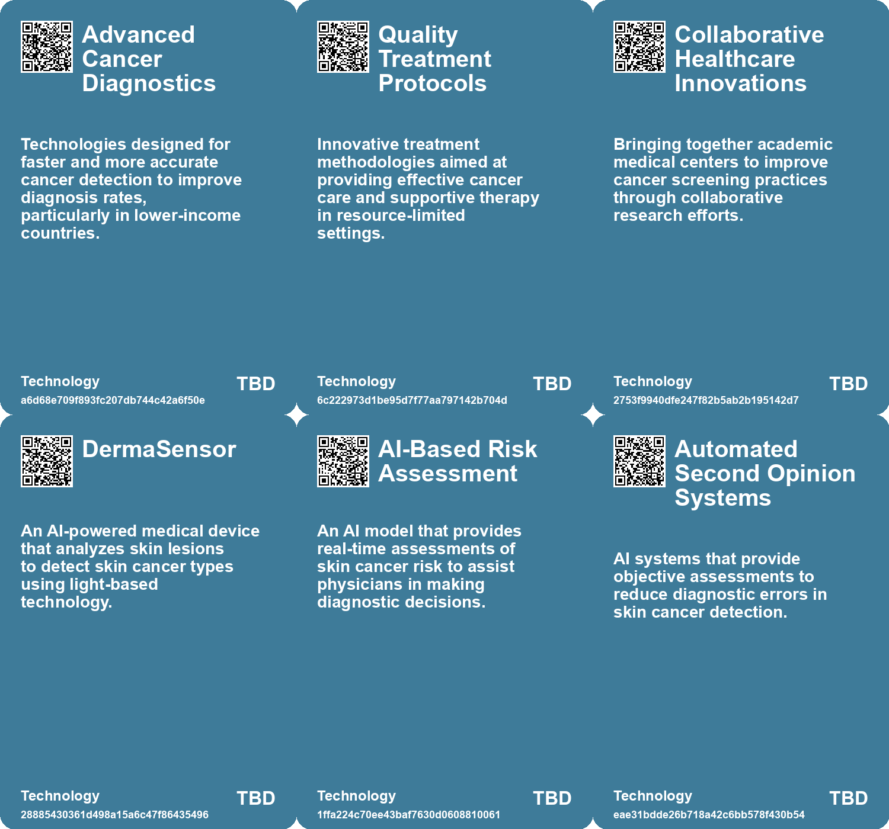

# *Topic*: Advanced Cancer Diagnostics

# Summary

Advancements in cancer detection and treatment are at the forefront of recent medical innovations. A national study, the PRISM trial, is exploring the effectiveness of artificial intelligence in interpreting mammograms to improve breast cancer detection and reduce patient anxiety. This trial aims to enhance the accuracy of diagnoses while ensuring that radiologists remain integral to the process. Similarly, DermaSensor, an FDA-approved AI device, analyzes skin lesions to provide real-time cancer risk assessments, potentially revolutionizing skin cancer screening and expanding access to care.

The global cancer landscape is facing a significant challenge, with predictions indicating a dramatic rise in cases and deaths, particularly in lower-income countries. Modifiable risk factors such as smoking and unhealthy diets contribute to this crisis, underscoring the urgent need for improved diagnosis and treatment in these regions. In a related effort, researchers are investigating the use of sweat samples for breast cancer screening, employing advanced techniques to identify potential biomarkers non-invasively.

Innovative approaches to cancer diagnostics are also emerging from unexpected sources. Researchers have trained pigeons to distinguish between cancerous and healthy breast tissue samples, demonstrating their potential to assist in developing new imaging technologies. Meanwhile, a 14-year-old innovator has created an affordable soap that delivers a cancer-fighting drug, significantly reducing treatment costs and aiming to improve access to care.

The integration of artificial intelligence in healthcare continues to expand. An AI system is being tested in the NHS to identify individuals at risk of heart attacks and strokes, showing promise in enhancing diagnostic accuracy. In Canada, an AI-based early warning system has demonstrated a reduction in unexpected patient deaths, highlighting the potential of AI to improve patient outcomes without replacing healthcare professionals.

Technological advancements are also reshaping surgical procedures. A groundbreaking ultrasound method allows for 3D printing of biocompatible structures inside the body, potentially transforming invasive surgeries into safer, minimally invasive options. Additionally, researchers have developed nanorobots capable of targeting cancer cells specifically, sparing healthy tissue and showing significant tumor growth reduction in animal models.

The push for accessibility in medical imaging is exemplified by the Open Source Imaging Initiative, which aims to create affordable MRI devices through open-source designs. This initiative seeks to democratize access to crucial diagnostic tools, particularly in underserved regions.

As healthcare technology evolves, concerns about the ethical implications of AI and software in medical settings are rising. Reports highlight instances of genetic discrimination in insurance, where individuals face coverage denials based on genetic information. The need for competent regulation and reform in the use of AI in healthcare is becoming increasingly urgent, as misapplications can jeopardize patient care.

In the realm of agricultural technology, farmers in Nigeria are utilizing private satellite data to enhance crop yields, showcasing a shift towards data-driven practices in response to climate challenges. This trend reflects a broader movement towards leveraging technology to improve outcomes across various sectors, including healthcare and agriculture.

# Seeds

|    | name                                            | description                                                                                                           | change                                                                                                             | 10-year                                                                                                                         | driving-force                                                                                                           |
|---:|:------------------------------------------------|:----------------------------------------------------------------------------------------------------------------------|:-------------------------------------------------------------------------------------------------------------------|:--------------------------------------------------------------------------------------------------------------------------------|:------------------------------------------------------------------------------------------------------------------------|
|  0 | Affordable Cancer Treatment Solutions           | Development of low-cost alternatives to expensive cancer treatments.                                                  | Transitioning from high-cost healthcare barriers to more affordable, accessible options.                           | More patients, especially in low-income regions, can afford cancer treatments.                                                  | Global disparities in healthcare access prompting innovation for affordability.                                         |
|  1 | AI in Mammogram Interpretation                  | AI aiding radiologists in reading mammograms for better accuracy.                                                     | Shifting from traditional mammogram interpretation to AI-assisted methods.                                         | AI could lead to standardized and enhanced mammogram readings across healthcare settings.                                       | The need for improved accuracy in breast cancer detection and reduced anxiety for patients.                             |
|  2 | Improving Cancer Therapies                      | Visualization of cancer cell receptor proteins helps tailor effective therapies for treatment.                        | Shifting from generalized treatment methods to personalized medicine approaches based on molecular visualization.  | Personalized cancer treatments will be refined, improving patient outcomes through specific targeting of cancer cell receptors. | The need for personalized, effective cancer therapies is pushing innovations in protein visualization and targeting.    |
|  3 | AI-Powered Medical Devices                      | Emergence of AI-driven tools in healthcare for diagnostics and patient care.                                          | Shift from traditional diagnostic methods to AI-assisted evaluations.                                              | AI tools could become standard in routine medical assessments across various specialties.                                       | Need for quicker, more accurate diagnostics to improve patient outcomes.                                                |
|  4 | Integration of AI in Primary Care               | AI tools enhancing capabilities of primary care physicians in diagnostics.                                            | Increase in reliance on AI for diagnostic support in primary care settings.                                        | Primary care may evolve to include integrated AI systems for real-time health assessments.                                      | Need to improve diagnostic accuracy and efficiency in primary care environments.                                        |
|  5 | Breast Cancer Detection via Sweat Analysis      | Utilizing sweat samples for breast cancer screening through advanced gas chromatography-mass spectrometry.            | Transitioning from traditional screening methods to non-invasive sweat analysis for early breast cancer detection. | In a decade, sweat analysis could become a routine, non-invasive method for early breast cancer diagnosis.                      | The growing demand for less invasive medical testing methods that reduce patient discomfort and increase accessibility. |
|  6 | Shift Towards Non-Invasive Cancer Screening     | Increased interest in non-invasive methods for cancer detection, including sweat analysis.                            | Moving away from invasive procedures to more patient-friendly screening options.                                   | By 2033, non-invasive screening could become standard practice, improving patient compliance and outcomes.                      | Patient preferences and advancements in technology are driving the shift towards non-invasive diagnostic methods.       |
|  7 | Increased Research on Human Olfactory Detection | Exploring the potential of olfactory detection methods for identifying cancer and other diseases.                     | From limited research to expanded studies on the use of olfactory cues in medical diagnostics.                     | In ten years, olfactory detection could be a complementary approach in diagnosing various diseases, including cancers.          | The unique capabilities of animals and technology in scent detection are being recognized for medical applications.     |
|  8 | Increased Use of Technology in Medicine         | The integration of advanced technology, like ultrasound, into medical practices is enhancing diagnostic capabilities. | From traditional methods to embracing advanced imaging technology in trauma care.                                  | Healthcare will increasingly rely on advanced imaging technologies for faster, more accurate diagnoses.                         | The need for improved patient outcomes and efficiency in emergency care is pushing this technological shift.            |
|  9 | Pigeons in Medical Diagnosis                    | Pigeons show potential in distinguishing cancerous tissue, matching human diagnostic abilities.                       | Shift from solely human-based diagnostics to including animal-assisted methods in pathology.                       | Pigeons could be integrated into diagnostic processes, improving speed and potentially reducing costs.                          | The need for innovative and cost-effective solutions in medical diagnostics.                                            |

# Concerns

|    | name                                          | description                                                                                                                                                            |
|---:|:----------------------------------------------|:-----------------------------------------------------------------------------------------------------------------------------------------------------------------------|
|  0 | Access to Affordable Cancer Treatment         | The high cost of standard cancer treatments limits access for many, resulting in health disparities globally.                                                          |
|  1 | Increase in Cancer Incidence                  | Projected rise in new cancer cases by over 60% could strain resources and underscoring the need for preventive measures.                                               |
|  2 | Healthcare Disparities                        | Disparities in cancer care between wealthy and lower-income countries may widen, leading to unequal outcomes in cancer diagnosis and treatment.                        |
|  3 | Need for Early Diagnosis and Treatment        | Insufficient access to early diagnosis and treatment in lower-income countries poses a risk of undetected cancers leading to higher mortality rates.                   |
|  4 | Reliability of AI in Mammogram Interpretation | Concerns about AI's effectiveness in accurately interpreting mammograms and the potential for misdiagnosis.                                                            |
|  5 | Trust in AI by Patients and Clinicians        | Concerns regarding how much trust patients and healthcare professionals will place in AI-assisted diagnostics.                                                         |
|  6 | Reliability and Accuracy of AI Diagnostics    | With AI algorithms analyzing health data, there is a concern about the accuracy and reliability of diagnoses made based on potentially erroneous data interpretations. |
|  7 | Reliability of Non-invasive Screening Methods | The performance of sweat analysis using gas chromatography-mass spectrometry for cancer detection may vary, impacting diagnosis accuracy.                              |
|  8 | Targeting Accuracy                            | Further research is required to enhance targeting of specific cancer types, raising concerns about efficacy and safety.                                                |
|  9 | Reliability of Animal Diagnostic Methods      | While promising, reliance on animal diagnostics may lead to misdiagnosis if not carefully validated against human standards.                                           |

# Cards

## Concerns

## Behaviors

## Issue

## Technology

# Links

* [The Consequences of Poor Software Design in Healthcare: A Specialist's Perspective](https://futures.kghosh.me/976f66dccf4086981111e810d0160229)
* [Exploring Sweat Samples for Breast Cancer Screening Using Gas Chromatography-Mass Spectrometry](https://futures.kghosh.me/0c92eaabe3945e7b15eea4b98e970a96)
* [AI Early Warning System Reduces Unexpected Hospital Deaths by 26% in Canadian Study](https://futures.kghosh.me/2626f231f7df229a68e93bd2a129f234)
* [Remote Echocardiograms Via 5G Network Show High Diagnostic Accuracy at ESC Congress 2024](https://futures.kghosh.me/25bd9cf35c8c586fc559da23a2fe7d0e)
* [AI System Developed for Determining Sex Using Panoramic Radiographs with High Accuracy](https://futures.kghosh.me/1c5c49fa0a80b72b7e3d69516226080f)
* [Tottus Offers Affordable Mammograms for Breast Cancer Awareness Month](https://futures.kghosh.me/f13bf6b21086443fb7327c8d564b9854)
* [UCLA's SLIViT AI Model Transforms 3D Medical Image Analysis and Patient Outcomes](https://futures.kghosh.me/5389dd426076f28d6fa171c54710c674)
* [Teen Inventor Heman Bekele Develops Affordable Soap to Combat Skin Cancer](https://futures.kghosh.me/bc374aa64e994b7336277a6f352baf60)
* [The Dangers of AI Misuse in the U.S. Healthcare System and Its Impact on Elderly Care](https://futures.kghosh.me/5f91e2d433a76b5d40c649100da24318)
* [Revolutionary Ultrasound Sticker by MIT Engineers Promises Continuous Imaging of Internal Organs](https://futures.kghosh.me/046ecaa63b94e5eef69df0439e9d3246)
* [Understanding Genetic Discrimination: The Legal Risks of Genetic Testing and Insurance Denials](https://futures.kghosh.me/da334348e9ff0da68d996316deb0f20e)
* [Revolutionizing Skin Cancer Detection: The Impact of DermaSensor, an AI-Powered Medical Device](https://futures.kghosh.me/09a092904b5b2a5ef355d706b2bacbb3)
* [Projected Surge in Global Cancer Cases and Deaths: Focus on Lower-Income Countries](https://futures.kghosh.me/44a892a126d54424ddd21d7e27976b85)
* [How African Farmers Are Leveraging Satellite Data to Enhance Crop Yields and Combat Climate Change](https://futures.kghosh.me/3c4f4b0832ff414899cf292220127e16)
* [Innovative 3D Printing Technique Revolutionizes In-Body Medical Applications](https://futures.kghosh.me/b650d2500235b72478de21bf9c0928ec)
* [AI System Aims to Predict Heart Attack Risks and Save Lives in the UK](https://futures.kghosh.me/dead7bfcd66251606f35ea6015f2447c)
* [The Evolution of Ultrasound Technology in Emergency Medicine: A Life-Saving Innovation](https://futures.kghosh.me/c9345a6fe24c9e6f7b967d1ed91a2f95)
* [Navigating Medical Choices and Risk Predictions in B. Pladek's "Yellow"](https://futures.kghosh.me/953333a1272ca4b87dcc2e3296fb861d)
* [Open Source Imaging Initiative: Making MRI Technology Affordable and Accessible Globally](https://futures.kghosh.me/180db5379fd2e3f464d754d6d2eb27cb)
* [Innovative Nanorobots Developed to Target and Kill Cancer Cells in Mice](https://futures.kghosh.me/44eb7103e5651e7666834076ec828494)
* [UC Davis Health Leads $16 Million Study on AI in Mammogram Interpretation for Breast Cancer Detection](https://futures.kghosh.me/846c0e3bad3cff41ac11609ecb907b14)
* [Trained Pigeons Match Human Accuracy in Breast Cancer Detection Study](https://futures.kghosh.me/96d6452fd513ef2ffdbc3d761b7d24e1)
* [Innovative Scientific Breakthroughs in Health and Sustainability: From Mini-Brains to Microplastics](https://futures.kghosh.me/893f7fa4d1fb919258d3e90b77babab5)
* [Revolutionizing Cell Biology: The Impact of Super-Resolution Microscopy on Modern Science](https://futures.kghosh.me/6875e93bfb43e0dffad26fa151a41f39)
* [Adrian Aoun's Forward Health Launches CarePods to Transform Healthcare Accessibility](https://futures.kghosh.me/0642d77dbd0d230050715266b4a86a0e)
* [Revolutionary Ultrasound Method Promises Safer, Less Invasive Surgical Procedures](https://futures.kghosh.me/bccb19f0e8600750a06777c4ccea673e)