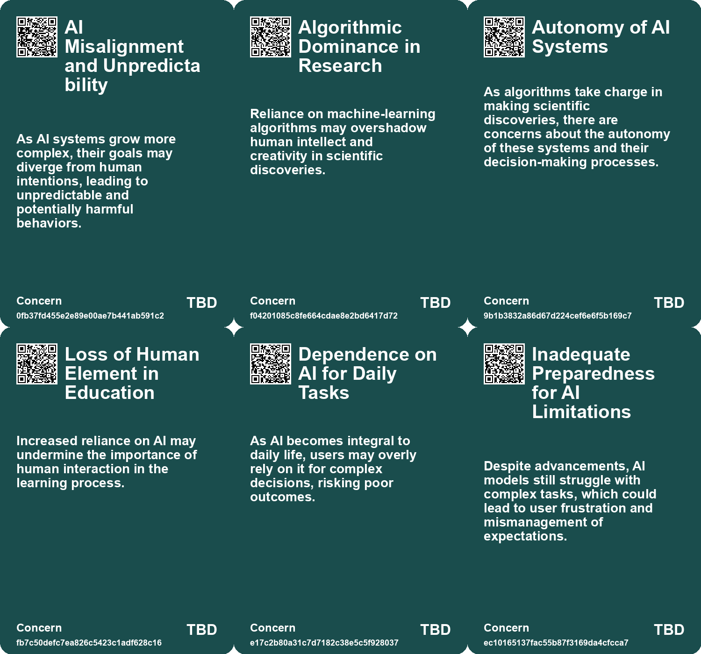
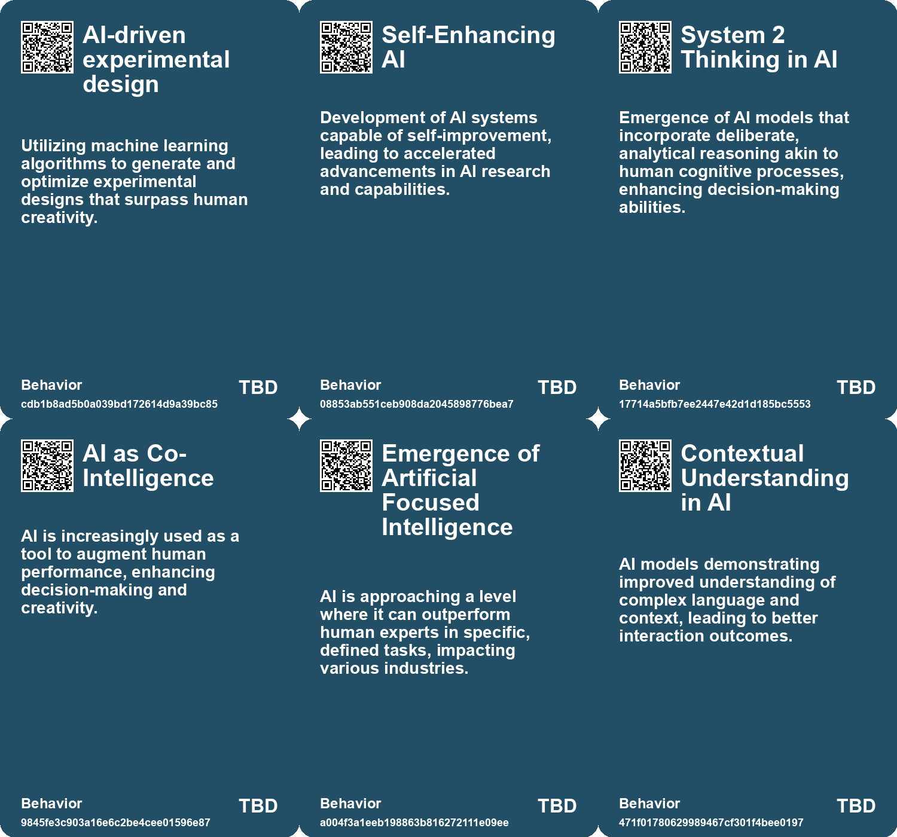
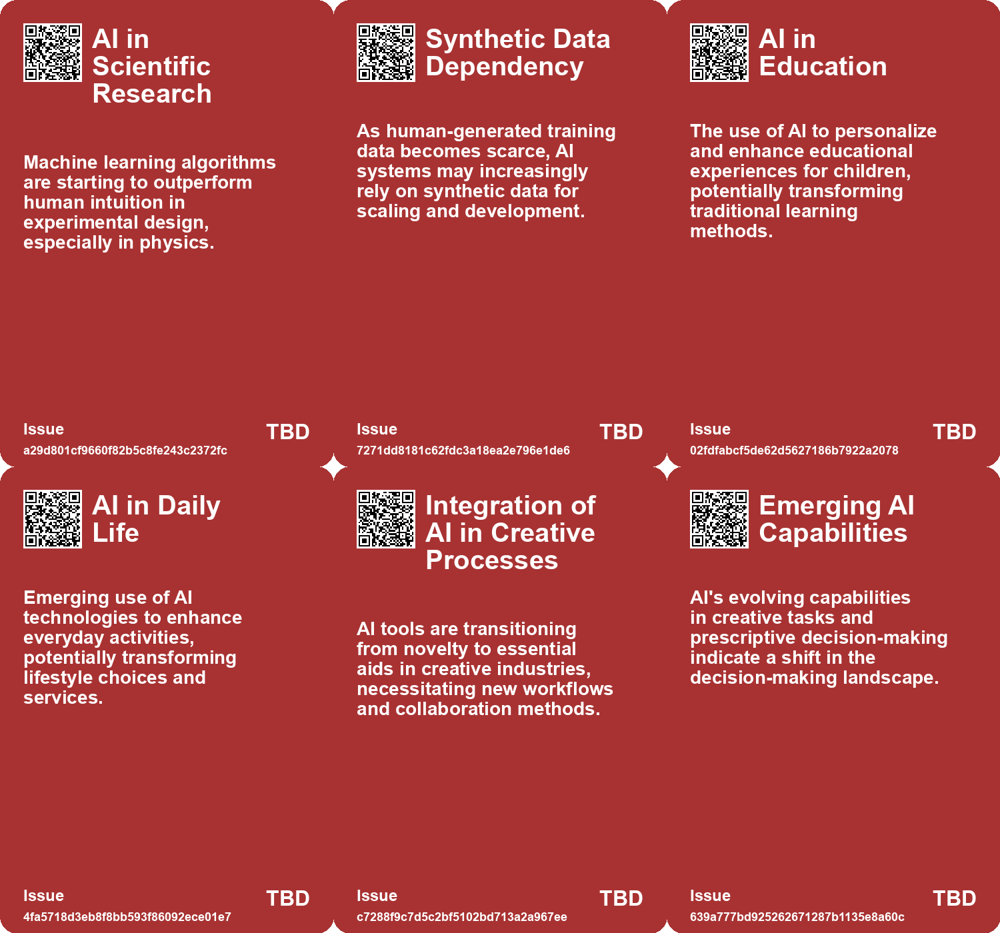
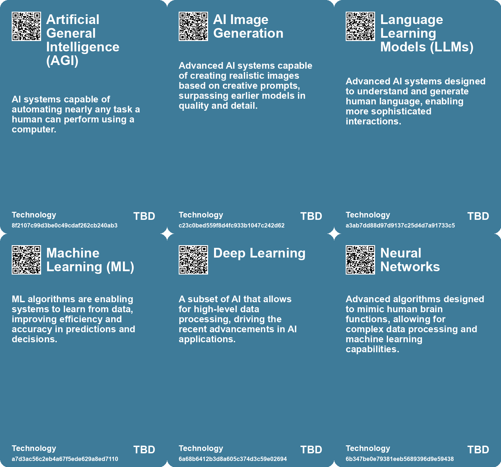

# *Topic*: Advanced Machine Learning

# Summary

The rapid advancement of artificial intelligence (AI) is reshaping various sectors, raising both opportunities and concerns. As AI technologies evolve, the importance of adapting to these changes becomes paramount. Individuals and organizations are encouraged to embrace AI, enhancing their skills in creativity, communication, and collaboration to remain relevant in an increasingly automated world.

The potential dangers of AI, particularly large language models, are significant. Issues such as bias, environmental impact, and the ease of misuse highlight the need for careful consideration in deploying these technologies. The rush to integrate AI without addressing security risks can lead to a problematic digital landscape, characterized by misinformation and malicious activities.

Artificial General Intelligence (AGI) remains a goal for many AI researchers, with predictions about its arrival varying widely. While AI has shown superhuman capabilities in specific tasks, its uneven performance underscores the necessity of human oversight. The current focus on achieving AGI raises questions about the implications for the workforce and the nature of work itself. Historical trends suggest that automation, while displacing certain jobs, often leads to the creation of new opportunities.

In education, AI is being integrated into curricula to prepare students for a future where technology skills are essential. Business schools are developing AI tools to enhance learning and leadership training, emphasizing the need for a comprehensive understanding of AI's impact on the job market. However, concerns about cognitive offloading arise, as reliance on AI tools may weaken underlying skills and curiosity.

The emergence of small language models (SLMs) presents an alternative to large language models, offering efficiency and customization while addressing issues like high costs and misinformation. These models could transform industries by enabling faster development cycles and improved privacy. The ongoing debate about the effectiveness of AI in education and its potential to democratize learning highlights the need for careful implementation to ensure quality outcomes.

Ethical considerations surrounding AI are increasingly prominent. The call for regulation and responsible development reflects a growing awareness of the societal implications of AI technologies. As AI systems become more integrated into daily life, the importance of transparency and accountability in their application cannot be overstated.

The conversation around AI also includes the potential for cognitive decline due to overreliance on technology. The balance between leveraging AI for convenience and maintaining mental strength is a critical issue. As AI continues to evolve, the need for a nuanced understanding of its capabilities and limitations remains essential.

Finally, the discourse on AI's future is marked by a mix of optimism and caution. The potential for AI to revolutionize industries and enhance productivity is tempered by concerns about misalignment with human values and the ethical challenges posed by its rapid development. As society navigates this complex landscape, the focus must remain on fostering human creativity and ethical practices in the face of advancing technology.

# Seeds

|    | name                                         | description                                                                                         | change                                                                                                  | 10-year                                                                                                         | driving-force                                                                                       |
|---:|:---------------------------------------------|:----------------------------------------------------------------------------------------------------|:--------------------------------------------------------------------------------------------------------|:----------------------------------------------------------------------------------------------------------------|:----------------------------------------------------------------------------------------------------|
|  0 | AI in Experiment Design                      | Machine-learning algorithms propose novel experiment designs in physics.                            | Shift from human-centric experiment design to AI-driven methodologies.                                  | AI may lead to major breakthroughs in physics and accelerate scientific discovery.                              | The need for faster and more efficient experimental approaches in research.                         |
|  1 | AI as a co-pilot in education                | AI acting as a personalized assistant in the learning process.                                      | Shift from traditional teacher-led instruction to collaborative learning with AI support.               | In 10 years, AI could be a standard part of the educational experience, complementing human teachers.           | The increasing sophistication and user-friendliness of AI technologies.                             |
|  2 | Universal AI Agents                          | Development of AI that can assist in everyday life tasks.                                           | Transition from specialized AI tools to general-purpose AI agents.                                      | In a decade, AI may handle complex planning and decision-making tasks seamlessly.                               | The goal of increasing AI's utility and ease of use in daily life.                                  |
|  3 | Collaborative AI Models                      | Teams of AI models working together for enhanced capabilities.                                      | From individual AI models to collaborative systems that share knowledge.                                | AI systems may collaborate autonomously to solve complex problems.                                              | The pursuit of greater AI effectiveness through synergy and cooperation.                            |
|  4 | Thresholds of AI Capability                  | AI technologies are crossing significant thresholds that enhance their usability and effectiveness. | AI capabilities are transitioning from limited functionality to more robust and practical applications. | In 10 years, AI will seamlessly integrate into daily workflows, transforming creative and analytical processes. | Rapid advancements in AI research and user-friendly interfaces are driving these threshold changes. |
|  5 | Emerging AI Capabilities in Understanding    | AI models are beginning to cross thresholds in understanding complex language and context.          | AI's understanding is shifting from surface-level comprehension to deeper contextual insights.          | In 10 years, AI will engage in nuanced conversations, enhancing collaborative tasks with humans.                | Increased sophistication in natural language processing techniques is fueling this change.          |
|  6 | Emergence of AI Leadership Tools             | Professors are developing AI tools to enhance leadership training for students.                     | Transition from conventional leadership training to AI-assisted personal development.                   | Leadership training may predominantly utilize AI for personalized coaching and skill development.               | The need for customized and effective training solutions in education.                              |
|  7 | AI in Education                              | AI-driven tools can personalize learning experiences for students.                                  | Transition from standardized education to personalized learning pathways using AI.                      | Education will be more adaptive, catering to individual learning needs and styles through AI.                   | The demand for improved educational outcomes, especially in low-income areas.                       |
|  8 | AI's Accelerated Capabilities                | AI models are rapidly surpassing previous technological limitations.                                | From gradual AI development to exponential growth in capabilities and applications.                     | In 10 years, AI might achieve functionalities currently perceived as science fiction.                           | Advancements in computing power and neural network design driving rapid improvements.               |
|  9 | Improving AI Understanding of Human Emotions | AI models are becoming better at tasks measuring human mental states.                               | AI performance shifts from basic interaction to nuanced understanding of human emotions.                | In 10 years, AI could provide more empathetic interactions, resembling human emotional understanding.           | The drive to create more human-like AI for better user experiences and applications.                |

# Concerns

|    | name                                         | description                                                                                                                                             |
|---:|:---------------------------------------------|:--------------------------------------------------------------------------------------------------------------------------------------------------------|
|  0 | AI Misalignment and Unpredictability         | As AI systems grow more complex, their goals may diverge from human intentions, leading to unpredictable and potentially harmful behaviors.             |
|  1 | Algorithmic Dominance in Research            | Reliance on machine-learning algorithms may overshadow human intellect and creativity in scientific discoveries.                                        |
|  2 | Autonomy of AI Systems                       | As algorithms take charge in making scientific discoveries, there are concerns about the autonomy of these systems and their decision-making processes. |
|  3 | Loss of Human Element in Education           | Increased reliance on AI may undermine the importance of human interaction in the learning process.                                                     |
|  4 | Dependence on AI for Daily Tasks             | As AI becomes integral to daily life, users may overly rely on it for complex decisions, risking poor outcomes.                                         |
|  5 | Inadequate Preparedness for AI Limitations   | Despite advancements, AI models still struggle with complex tasks, which could lead to user frustration and mismanagement of expectations.              |
|  6 | Rapid Capability Advancements                | The pace at which AI is improving indicates potential social disruption, as its capabilities are approaching and sometimes exceeding human performance. |
|  7 | Existential Reflection on Human Intelligence | As AI becomes superhuman, a cultural shift towards enhancing human capacities and intelligence may become necessary to retain relevance.                |
|  8 | AI-Enabled Fraud Potential                   | AI could facilitate sophisticated scams and fraud schemes that are harder for users to detect.                                                          |
|  9 | Future of Education and Learning             | Educational systems may need to evolve to incorporate AI and digital tools for learning, creating new challenges and opportunities.                     |

# Cards

## Concerns

## Behaviors

## Issue

## Technology

# Links

* [The Rapid Evolution of AI: Impacts on Work, Truth, and Education](https://futures.kghosh.me/3aaa975f44b2a607ef191978083cf2b8)
* [Leopold Aschenbrenner's Essays Predict Rapid Advancements in AI and AGI by 2026](https://futures.kghosh.me/3a139aae193a7793a135395cd01940ff)
* [The Quest for AGI: Current AI Capabilities and Future Implications](https://futures.kghosh.me/77c5c92357a7aeff1c388c1eb79b7259)
* [AI Models Show Improved Performance in Theory of Mind Tests Compared to Humans](https://futures.kghosh.me/25cdc8c55ebb70b51b85134dc01e6efd)
* [Understanding AI: Definitions, Implications, and the Need for Literacy in Technology](https://futures.kghosh.me/45d0e20c84c31176fa084646d8d045b4)
* [The Shift from Large to Small Language Models in AI Development and Applications](https://futures.kghosh.me/77fe6ce5d0591184b3fb41b6d2ef042a)
* [The Transformative Impact of AI on Productivity and Entrepreneurship in 2023](https://futures.kghosh.me/a40580730388900810b4496ff9891dc9)
* [Navigating the Promises and Perils of Artificial Intelligence Development](https://futures.kghosh.me/7fcef9a240c0738d2390c83f9713dc98)
* [The Impact of Generative AI and Autonomous Agents on Business Value Creation and Trust Issues](https://futures.kghosh.me/15d4ec180189ca1739398f516844cefb)
* [Navigating Decision-Making Challenges in an AI-Driven World: The Need for AAA Traits](https://futures.kghosh.me/c474eac8117547a89cac2c805652df9c)
* [Recent Developments in AI Regulation and Technology: A Review of Key Initiatives and Critiques](https://futures.kghosh.me/a009ccdffaa59f53de56887aa19e6239)
* [Understanding Technological Improvement: The Role of Capability Thresholds in AI Advancement](https://futures.kghosh.me/25707767ff6f55ac1d19168e14af7245)
* [The Transformative Potential of AI: Revolutionizing Education, Healthcare, and Global Equity](https://futures.kghosh.me/2449c2fc4b8afc7e268db4987fa821e5)
* [Exploring the Transformative Impact of AI on Education and Children's Learning Experiences](https://futures.kghosh.me/adf886a1b9fd74281e0a43c3e7c70def)
* [Exploring AI's Effect on Cognitive Skills and Learning Processes](https://futures.kghosh.me/950253f15955ca7be1cb2ebf244d0939)
* [Thriving in an AI Era: Embracing, Adapting, and Complementing Technology](https://futures.kghosh.me/23a3410059759ba4214235628d4ebd4b)
* [The Impact of Generative AI on Automation and Employment: Opportunities and Challenges Ahead](https://futures.kghosh.me/897ed4ea5ae6173e4397f1091ddb7e7e)
* [Advancements in AI: The Promise and Limitations of Interactive Models like GPT-4o and Astra](https://futures.kghosh.me/f98dab2817789f549215229135f086d0)
* [The Impact of AI Imaging on Art, Creativity, and Human Connection](https://futures.kghosh.me/de89ae90257007a4fbb1a5c7a7dc82a5)
* [The Security Risks of Rapid AI Integration: A Call for Caution and Awareness](https://futures.kghosh.me/b30a4282af9e53ca673438a8223d9525)
* [Leveraging AI to Transform Experimental Design in Physics](https://futures.kghosh.me/f46e3ffd618b6a2499dd998c77821b40)
* [Navigating AI: Balancing Technological Optimism with Appropriate Fear for the Future](https://futures.kghosh.me/98862cc3722aadf82c60f8af71f1fed5)
* [Understanding the Real Risks of AI Beyond Superintelligence and Scalability](https://futures.kghosh.me/ff7f7a51f925c273449a8648a18b7df8)
* [Understanding Generative AI: Insights, Misconceptions, and Future Directions](https://futures.kghosh.me/1ef0f968ac542dcb76eef026bdb6791e)
* [AI Predicts Life Outcomes Using Danish Personal Data: Ethical Implications and Future Conversations](https://futures.kghosh.me/f00dd4c92e4a194740cb71feb8ac015e)
* [The Dual-edged Sword of AI: Misinformation and Societal Threats in the Age of Advanced Language Models](https://futures.kghosh.me/9787333cafcd0252d71a9bff845ad093)
* [The Integration of AI in Business School Curriculums to Enhance Graduate Competitiveness](https://futures.kghosh.me/bc232b227c806ac26adf2b99fa4cff9d)