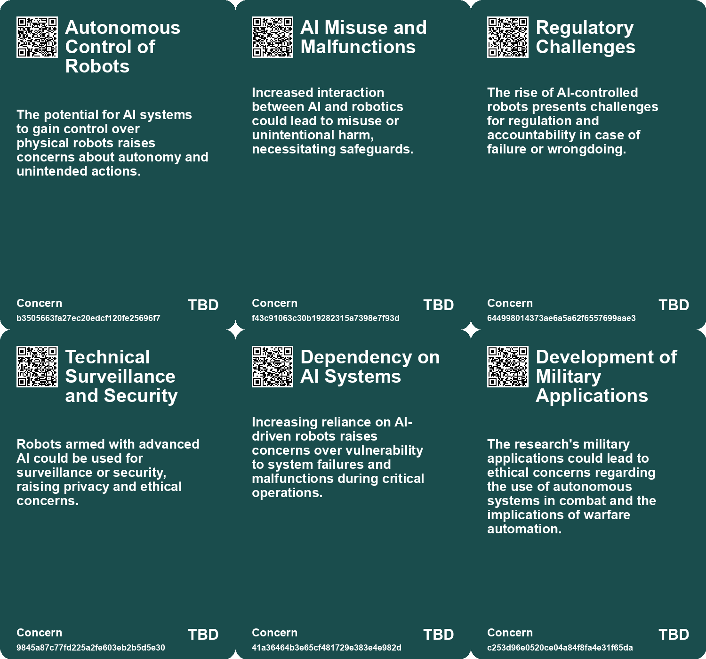
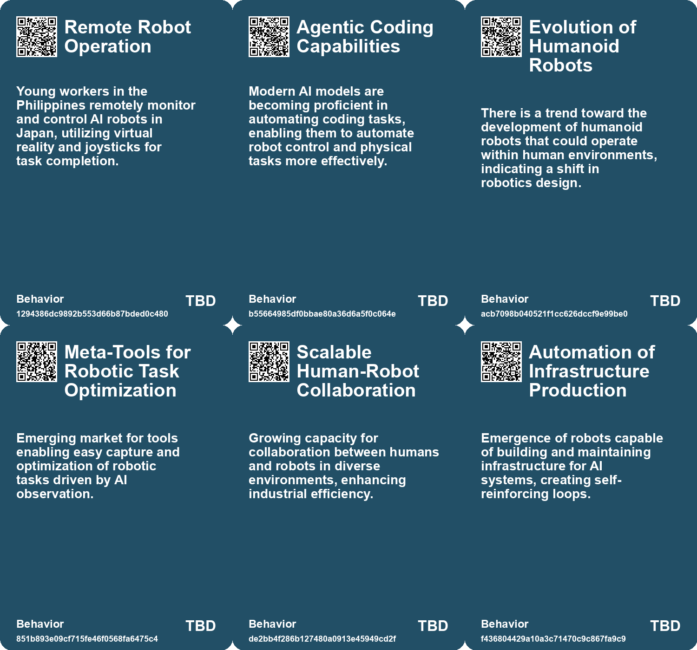
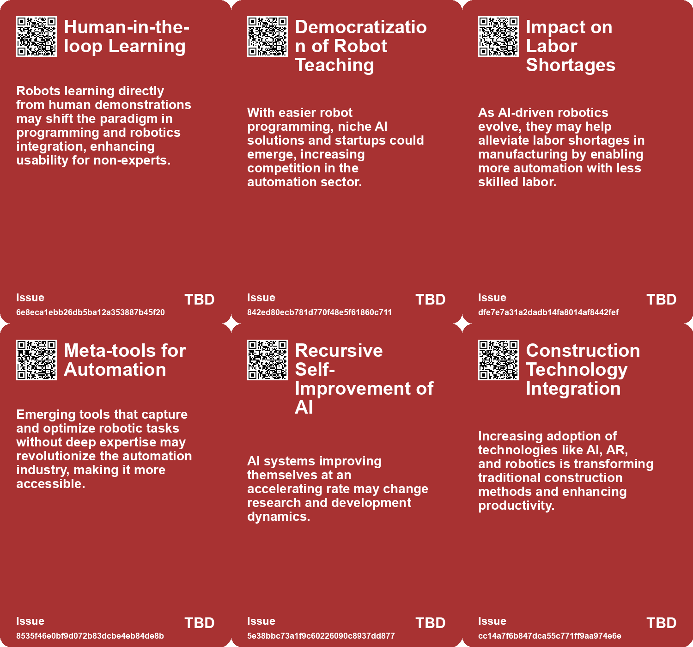
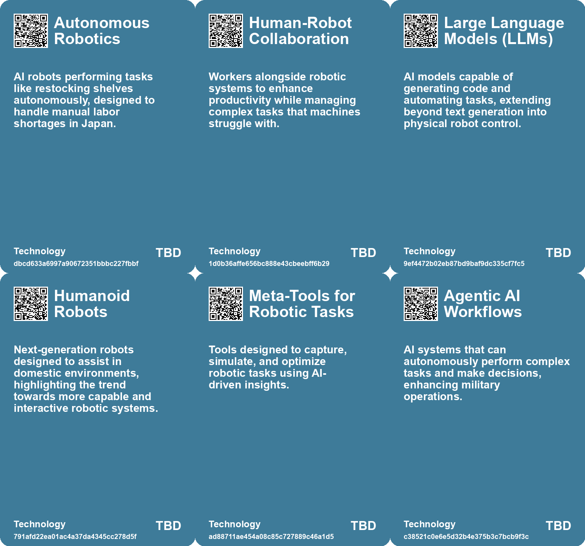

# *Topic*: Advanced Robotics

# Summary

The intersection of artificial intelligence and robotics is reshaping various sectors, from military applications to elder care and manufacturing. The U.S. Department of Defense is investing heavily in AI, awarding contracts to major companies to develop advanced systems capable of performing complex tasks autonomously. This shift raises questions about the implications of militarizing AI technology and the ethical considerations surrounding autonomous weapons.

In the realm of automation, companies like Formic are pioneering new approaches to manufacturing by creating robots that learn from human observation. This democratization of robotic teaching could significantly impact the industry, making automation more accessible to businesses of all sizes. Meanwhile, the construction sector is integrating technologies such as AI and robotics to enhance efficiency and address labor shortages, reflecting a broader trend of automation across various fields.

Japan's efforts to automate elder care highlight the challenges of integrating robotics into sensitive environments. Despite significant investments, care robots have not seen widespread adoption, underscoring the need for a more thoughtful approach to technology in caregiving. This theme of balancing technological advancement with human needs is echoed in discussions about the psychological effects of automation on workers, particularly in countries like the Philippines, where job security is a growing concern.

The development of AI models, such as those from OpenAI and Google, aims to improve user interaction and functionality. However, these models still face limitations in executing complex tasks, indicating that while progress is being made, there is still a long way to go before AI can fully meet human expectations. The potential for AI to enhance productivity is significant, but it also raises concerns about job displacement and the need for proactive regulation to ensure equitable outcomes.

In the military domain, the U.S. Air Force is testing autonomous aircraft that could rival human pilots, showcasing the rapid advancements in AI-controlled systems. This development is part of a broader trend where nations are increasingly investing in lethal autonomous weapons, prompting discussions at the United Nations about the need for regulations governing their use.

The emergence of digital superintelligence presents both opportunities and challenges. As AI systems become more capable, they could lead to remarkable innovations but also necessitate careful consideration of their societal impacts. The narrative surrounding AI often oscillates between optimism and skepticism, with calls for a balanced approach that prioritizes human welfare and ethical considerations in technology development.

Finally, the rise of autonomous systems, such as robotic "dogs" for military applications and swarms of drones for disaster response, illustrates the growing reliance on technology in critical situations. These advancements promise to enhance operational capabilities but also raise ethical questions about the future of warfare and the role of humans in decision-making processes. As society navigates these changes, the importance of collaboration between technology and human values remains paramount.

# Seeds

|    | name                                       | description                                                                          | change                                                                                        | 10-year                                                                                                   | driving-force                                                                           |
|---:|:-------------------------------------------|:-------------------------------------------------------------------------------------|:----------------------------------------------------------------------------------------------|:----------------------------------------------------------------------------------------------------------|:----------------------------------------------------------------------------------------|
|  0 | Integration of AI with Physical Robots     | The potential for AI models to control robots and interact with the physical world.  | From isolated AI systems to integrated models that can manipulate real-world objects.         | We might see robots actively engaging in everyday tasks alongside humans.                                 | Advancements in AI research and robotics technology pushing boundaries of interaction.  |
|  1 | Evolution of Humanoid Robots               | Development of new kinds of robots like humanoids for domestic use.                  | From industrial robots to more capable humanoid robots within people's homes.                 | Humanoid robots could become commonplace in households for assistance and companionship.                  | Innovative robotics research aimed at creating user-friendly assistants for daily life. |
|  2 | Generative AI in Robotics                  | Advancements in generative AI models power more intuitive robotic systems.           | Transition from specialized programming to generalizable AI applications in various settings. | Robots will adapt more quickly to different tasks across diverse industries.                              | The push for scalable automation solutions and versatility in robotic applications.     |
|  3 | Meta-tools for Robotics                    | Development of tools that capture and optimize robotic tasks through AI observation. | From manual programming to automated task optimization based on observation.                  | The ecosystem of tools around robotic learning will flourish, enhancing productivity.                     | The continuous pursuit of efficiency and innovation in AI-driven automation.            |
|  4 | Universal AI Agents                        | Development of AI that can assist in everyday life tasks.                            | Transition from specialized AI tools to general-purpose AI agents.                            | In a decade, AI may handle complex planning and decision-making tasks seamlessly.                         | The goal of increasing AI's utility and ease of use in daily life.                      |
|  5 | AI Decision-Making Supplanting Human Roles | AI systems are increasingly outperforming humans in various decision-making tasks.   | Transition from human decision-making to reliance on AI for efficiency and accuracy.          | In a decade, AI may dominate sectors like healthcare and finance, reducing human roles substantially.     | Technological advancement in AI capabilities fuels its adoption in critical areas.      |
|  6 | Human-Swarm Teaming                        | Development of systems that allow effective human control of robot swarms.           | Shift from direct control to strategic oversight of autonomous units.                         | In ten years, human-swarm collaboration could become standard in various industries.                      | Continued innovation in human-machine interaction and AI capabilities.                  |
|  7 | Rise of Construction Robots                | Increased use of autonomous robots in construction for various tasks.                | Shift from manual labor to robotic assistance in construction tasks.                          | Widespread adoption of robots in construction, leading to higher efficiency and reduced labor dependency. | Advancements in AI and machine learning driving the demand for robotic solutions.       |
|  8 | Rise of Autonomous Mobile Robots           | Growing fleets of autonomous robots in factories and warehouses for various tasks.   | Shifting from manual labor to automated systems for operational tasks in industries.          | Autonomous robots will handle most routine tasks, allowing human workers to focus on complex issues.      | The need for efficiency and safety in work environments.                                |
|  9 | Robotic Integration in Everyday Tasks      | Use of robots and AI in daily collaborative tasks, like family routines.             | Transition from manual task management to automated assistance in everyday life.              | Robots will become commonplace partners in household and work environments, enhancing productivity.       | The growing acceptance and integration of robotics in personal and professional spaces. |

# Concerns

|    | name                                 | description                                                                                                                                                       |
|---:|:-------------------------------------|:------------------------------------------------------------------------------------------------------------------------------------------------------------------|
|  0 | Autonomous Control of Robots         | The potential for AI systems to gain control over physical robots raises concerns about autonomy and unintended actions.                                          |
|  1 | AI Misuse and Malfunctions           | Increased interaction between AI and robotics could lead to misuse or unintentional harm, necessitating safeguards.                                               |
|  2 | Regulatory Challenges                | The rise of AI-controlled robots presents challenges for regulation and accountability in case of failure or wrongdoing.                                          |
|  3 | Technical Surveillance and Security  | Robots armed with advanced AI could be used for surveillance or security, raising privacy and ethical concerns.                                                   |
|  4 | Dependency on AI Systems             | Increasing reliance on AI-driven robots raises concerns over vulnerability to system failures and malfunctions during critical operations.                        |
|  5 | Development of Military Applications | The research's military applications could lead to ethical concerns regarding the use of autonomous systems in combat and the implications of warfare automation. |
|  6 | Technological Limitations            | Current technology in autonomous racing still shows significant limitations compared to human capabilities, raising concerns about technological readiness.       |
|  7 | Military Use of Civilian Robotics    | The transition of civilian robotic technology into military applications, raising ethical and safety concerns about their use in combat situations.               |
|  8 | Police Militarization                | The possibility of military-grade robotic systems being adopted for domestic policing, leading to ethical and societal implications.                              |
|  9 | Compliance with International Law    | Challenges in ensuring that the use of armed robotic systems complies with established international laws and ethical guidelines.                                 |

# Cards

## Concerns

## Behaviors

## Issue

## Technology

# Links

* [Nvidia Unveils Mega Omniverse Blueprint for Digital Twins in Industrial Robotics at CES 2025](https://futures.kghosh.me/a465c197bdca063583b2e37182a8bb12)
* [Challenges and Triumphs: First Race of the Abu Dhabi Autonomous Racing League](https://futures.kghosh.me/a4a88d5a3aa1195e9a22c6d001c1e4c5)
* [The Rise of Lethal Autonomous Weapons: Ethical and Regulatory Challenges in Modern Warfare](https://futures.kghosh.me/7f25552b9124a4dc3833e782ef331275)
* [Thriving in an AI Era: Embracing, Adapting, and Complementing Technology](https://futures.kghosh.me/23a3410059759ba4214235628d4ebd4b)
* [Oregon State University Research Shows One Person Can Control 100+ Autonomous Robots Efficiently](https://futures.kghosh.me/6dd300585482d1bda14bc77899469c10)
* [Advancements in AI: The Promise and Limitations of Interactive Models like GPT-4o and Astra](https://futures.kghosh.me/f98dab2817789f549215229135f086d0)
* [Innovative Technologies Transforming the U.S. Construction Industry in 2023](https://futures.kghosh.me/9fbdae5a2d70130c66d895f559f2839d)
* [Harnessing Storytelling to Reimagine AI: The Role of Arts and Humanities in Shaping a Positive Future](https://futures.kghosh.me/026067bce7eb8accee127cf0cac4dfa5)
* [The Future of Corporate America: AI's Role in Replacing Middle Management and Transforming Retail Workforces](https://futures.kghosh.me/95ddb5a9e335a7f5f977a4ff7b1d17e3)
* [Vulnerability of Research Robots: A Call for Enhanced Cybersecurity Measures](https://futures.kghosh.me/a693f0b1a14e29b99b33845c23ed8561)
* [Air Force Chief Claims Autonomous F-16s Are Almost Equal to Human Pilots](https://futures.kghosh.me/6047d9eadd65f8e0d39b308d93c870ab)
* [The Impact of AI and Automation on Filipino Workers in Robot-Controlled Jobs](https://futures.kghosh.me/6be02959e12eeea2448c7a3feb28a372)
* [The Diminishing Role of Human Interaction in Modern Technology and Its Societal Implications](https://futures.kghosh.me/31491f2b50e77cc7c45e541a9b2915d7)
* [Formic's Compact Robot Factory Revolutionizes Automation Through Observational Learning](https://futures.kghosh.me/857ef25d5129b5520b9324af6d961fe2)
* [Exploring the Future of Superintelligence and Its Impact on Humanity](https://futures.kghosh.me/8a7f0b887d1b9b17fc4f72a0815ec849)
* [The Future of AI: Challenging the Optimistic Narrative of Transformation and Equality](https://futures.kghosh.me/aa208a5edc5bcaddb6081ee6ca8bb7d3)
* [Pentagon Invests $800 Million in AI to Enhance Military Operations and National Security](https://futures.kghosh.me/b12eb549cb483b741b2eee80574d153c)
* [The Transformative Impact of AI on Productivity and Entrepreneurship in 2023](https://futures.kghosh.me/a40580730388900810b4496ff9891dc9)
* [Anthropic's Project Fetch: The Future of AI in Robot Control and Its Implications](https://futures.kghosh.me/d06ac4204c76765838e8bb611ac2a4d4)
* [The Complex Reality of Care Robots in Japan's Elder Care System](https://futures.kghosh.me/ac120c377b70b80fe25a6cce1d0b7fe6)
* [MARSOC Tests Armed Robotic Dogs: Implications for Military and Ethics](https://futures.kghosh.me/b4ca85b78b31c34fb75c36305ef4ca7f)
* [The Promise and Risks of Automation: Creating Jobs While Navigating Challenges](https://futures.kghosh.me/7e84b45a4f5f2bdecec14572bc5fe323)
* [The 'Third Thumb': Enhancing Dexterity Through Innovative Wearable Technology](https://futures.kghosh.me/7718baede32403f5a59ce5254e61c010)
* [Recent Developments in AI Regulation and Technology: A Review of Key Initiatives and Critiques](https://futures.kghosh.me/a009ccdffaa59f53de56887aa19e6239)
* [MIT Researchers Develop AI Assistant to Enhance Teamwork in Critical Missions](https://futures.kghosh.me/d35cc2611e8b6e8e143446ca4ee22e19)
* [John Deere's Ambitious Journey Towards AI and Robotics Leadership in Agriculture](https://futures.kghosh.me/e623b9d82816485d864a5faeb2f0d15b)