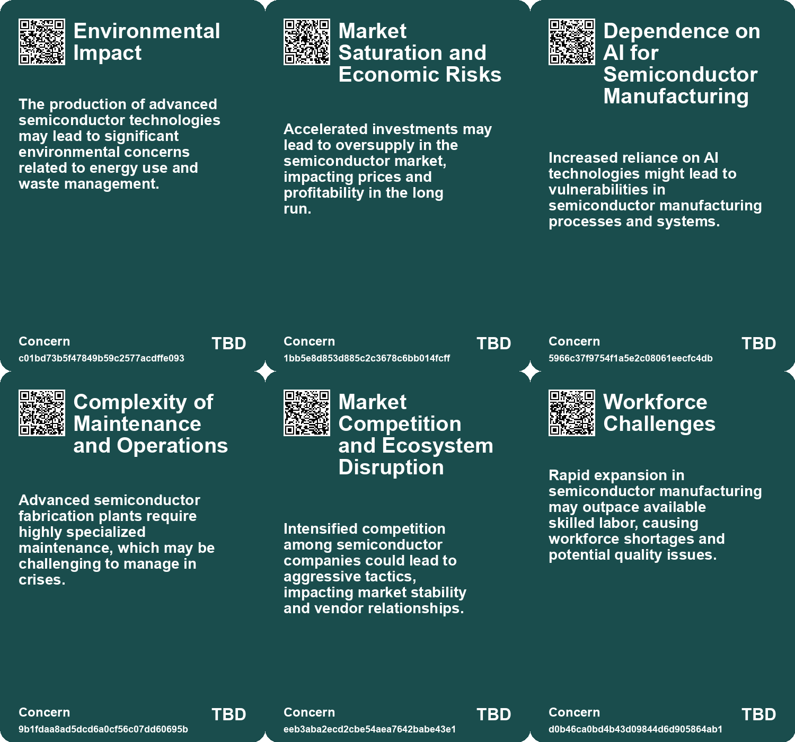
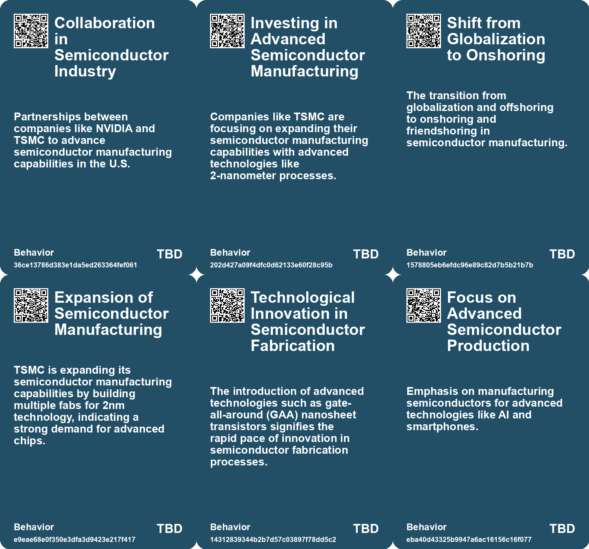
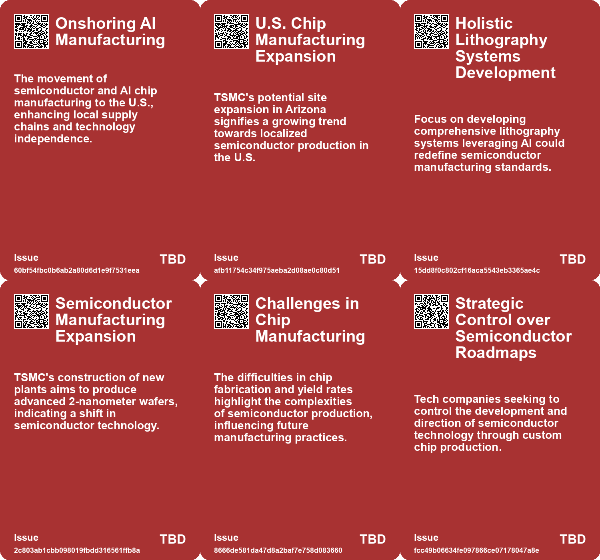
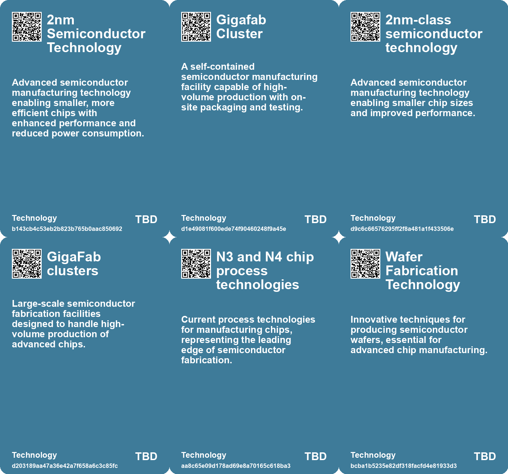

# *Topic*: Advanced Semiconductor Manufacturing

# Summary

The semiconductor industry is undergoing significant changes driven by geopolitical tensions, technological advancements, and workforce challenges. The Biden administration is actively promoting domestic semiconductor manufacturing through subsidies to major companies like Intel and TSMC. This initiative aims to bolster the U.S. supply chain for critical technologies, including AI and military applications. Intel is investing heavily in new factories across several states, while TSMC is expanding its operations in Arizona, despite facing delays due to a shortage of skilled workers.

TSMC's construction of its Arizona chip factory has encountered setbacks primarily due to a lack of technical expertise in the U.S. The company plans to address this by sending more workers from Taiwan, but this has sparked tensions with local unions. The challenges of recruiting American workers at competitive wages highlight the ongoing labor shortages in the semiconductor sector.

In response to rising demand for AI chips, TSMC is accelerating its production timeline for 2nm technology. The company is also establishing a comprehensive manufacturing site in Arizona, which will include advanced capabilities for producing high-performance chips. This expansion reflects the robust demand for semiconductors driven by partnerships with major clients like Apple and NVIDIA.

Geopolitical factors are also influencing TSMC's operations. The company has suspended production of advanced AI chips for Chinese customers due to U.S. export controls. This decision could significantly impact Chinese tech firms that rely on TSMC for cutting-edge technology. The ongoing scrutiny of TSMC's practices underscores the complexities of U.S.-China relations in the tech sector.

The semiconductor industry is not only focused on production but also on innovation. TSMC is nearing completion of its ecosystem for 2nm chip development, introducing new technologies that will require updated design tools. Meanwhile, Intel is planning to introduce 1nm chips and aims to automate its factories to enhance efficiency.

The global semiconductor landscape is also shifting as countries like France invest heavily in local chip production to reduce reliance on foreign supply chains. This trend is mirrored in the U.S., where the government is incentivizing the reshoring of semiconductor manufacturing to strengthen national security and economic competitiveness.

The industry faces environmental challenges as well. Rising global temperatures are affecting the reliability of automotive chips, particularly in electric vehicles. Companies are increasingly focused on understanding how extreme heat impacts chip performance and lifespan, emphasizing the need for predictive maintenance.

Finally, the semiconductor sector is witnessing a convergence of technology and education. Universities like Purdue are expanding their engineering programs to address the critical shortage of semiconductor engineers. The U.S. needs tens of thousands of new engineers in the coming years to support its growing semiconductor industry, highlighting the importance of education in maintaining technological leadership.

# Seeds

|    | name                                                  | description                                                                              | change                                                                                                                   | 10-year                                                                                                                   | driving-force                                                                                                   |
|---:|:------------------------------------------------------|:-----------------------------------------------------------------------------------------|:-------------------------------------------------------------------------------------------------------------------------|:--------------------------------------------------------------------------------------------------------------------------|:----------------------------------------------------------------------------------------------------------------|
|  0 | Advancement in Semiconductor Technology               | New semiconductor technologies being developed for AI applications in Arizona.           | Shift towards more advanced chip production techniques in the U.S. to meet AI needs.                                     | By 2033, we may see ultra-advanced chips enabling breakthroughs in AI and computing.                                      | Increasing need for high-performance chips for various sectors including AI and telecommunications.             |
|  1 | Long-term collaboration between ASML and Mistral AI   | A strategic partnership formed to explore AI applications in semiconductor technology.   | Shift from traditional vendor-client relationships to long-term strategic partnerships in tech.                          | Collaboration might lead to innovative AI-driven semiconductor manufacturing techniques enhancing industry performance.   | The growing importance of AI in enhancing operational efficiency and product innovation in technology sectors.  |
|  2 | Taiwan Semiconductor Manufacturing Expansion          | TSMC plans new plants focusing on advanced semiconductor production.                     | From traditional semiconductor manufacturing to advanced 2-nanometer processes and facilities.                           | In 10 years, Taiwan could become the global leader in cutting-edge semiconductor technology.                              | Demand for smaller, faster chips in technology driving semiconductor innovation and investments.                |
|  3 | Development of independent semiconductor clusters     | Creation of a semiconductor manufacturing hub around TSMC's Fab 21 in Arizona.           | From dispersed manufacturing locations to concentrated semiconductor clusters in the U.S.                                | Such clusters could enable better collaboration and innovation in semiconductor technology.                               | The need for a robust local supply chain and reduced dependency on foreign manufacturing catalyzes this change. |
|  4 | Cross-disciplinary Inspiration                        | Physics principles from astronomy are being used to advance semiconductor manufacturing. | Shift from astronomy to practical engineering innovations in technology.                                                 | Integration of astronomical physics in more engineering fields could enhance tech innovation.                             | Desire to overcome technological limitations through novel interdisciplinary approaches.                        |
|  5 | Improving Semiconductor Production                    | Using ancient star processes to solve modern semiconductor manufacturing issues.         | From traditional methodologies to innovative solutions inspired by astrophysics.                                         | Significantly improved efficiency and capabilities in semiconductor production processes.                                 | Need for cost-effective and efficient manufacturing techniques in high-tech industries.                         |
|  6 | Investment in Advanced Semiconductor Projects         | Major investments by companies like Intel and TSMC in U.S. semiconductor factories.      | Transition from limited domestic production to significant investment in local semiconductor manufacturing capabilities. | Ten years from now, the U.S. could have a robust semiconductor industry infrastructure supporting various technologies.   | Increased demand for semiconductors in AI, smartphones, and military applications drives investment.            |
|  7 | Chips for America Program                             | A major funding initiative aimed at boosting U.S. semiconductor production.              | Shift from sporadic funding to a structured, large-scale subsidy program for semiconductor production.                   | The program could establish a sustainable semiconductor ecosystem in the U.S., fostering innovation.                      | Government recognition of semiconductor production as vital for economic and national security.                 |
|  8 | Global Race for Semiconductor Dominance               | Countries are ramping up investments and policies to secure semiconductor production.    | Transition from fragmented global production to concentrated national strategies for semiconductor manufacturing.        | National strategies may lead to a more fragmented global semiconductor landscape with increased regional production hubs. | Heightened national security concerns and competition in technology sectors.                                    |
|  9 | Emerging Manufacturers for Semiconductor-Grade Quartz | New manufacturers for semiconductor-grade quartz are emerging in Jiangsu, China.         | Shifting production centers from Spruce Pine to China, potentially diversifying the supply chain.                        | In 10 years, semiconductor-grade quartz production may become more globalized and less reliant on single locations.       | Rising demand for semiconductors and geopolitical tensions prompting diversification of supply sources.         |

# Concerns

|    | name                                             | description                                                                                                                                      |
|---:|:-------------------------------------------------|:-------------------------------------------------------------------------------------------------------------------------------------------------|
|  0 | Environmental Impact                             | The production of advanced semiconductor technologies may lead to significant environmental concerns related to energy use and waste management. |
|  1 | Market Saturation and Economic Risks             | Accelerated investments may lead to oversupply in the semiconductor market, impacting prices and profitability in the long run.                  |
|  2 | Dependence on AI for Semiconductor Manufacturing | Increased reliance on AI technologies might lead to vulnerabilities in semiconductor manufacturing processes and systems.                        |
|  3 | Complexity of Maintenance and Operations         | Advanced semiconductor fabrication plants require highly specialized maintenance, which may be challenging to manage in crises.                  |
|  4 | Market Competition and Ecosystem Disruption      | Intensified competition among semiconductor companies could lead to aggressive tactics, impacting market stability and vendor relationships.     |
|  5 | Workforce Challenges                             | Rapid expansion in semiconductor manufacturing may outpace available skilled labor, causing workforce shortages and potential quality issues.    |
|  6 | Dependence on Foreign Manufacturing              | The U.S. reliance on Asian manufacturers for semiconductors raises major economic and national security concerns.                                |
|  7 | Global Chip Shortage                             | Recent global chip shortages have highlighted vulnerabilities in the supply chain and raised awareness of careers in semiconductors.             |
|  8 | Supply Chain Dependence                          | Heavy reliance on semiconductor production in specific regions may lead to vulnerabilities if those areas face disruptions.                      |
|  9 | Market Competition and Disruption                | As Intel pursues to be a major foundry, increased competition may impact innovation and pricing strategies within the semiconductor industry.    |

# Cards

## Concerns

## Behaviors

## Issue

## Technology

# Links

* [Apple and TSMC's Plans for Advanced 2nm and 1.4nm Chip Technologies](https://futures.kghosh.me/5429ed27b68b1f05b50819d7c0810d02)
* [The Impact of Rising Temperatures on Automotive Chip Lifespan and Reliability](https://futures.kghosh.me/e161cf68ccd4b5722cc0dc045ca6a2e1)
* [Exploring the Importance of Semiconductors in Modern Warfare and U.S.-China Rivalry](https://futures.kghosh.me/328434477c31995b44102949d5341006)
* [TSMC Accelerates 2nm Production Plans in Arizona Amid Strong AI Demand](https://futures.kghosh.me/b646059320fe8a6e84c82c1b7a8493ed)
* [Semiconductor-Grade Quartz Supply Chain Vulnerabilities and the Impact of Hurricane Helene](https://futures.kghosh.me/05b120278c63f23bf88be13c77ffc0de)
* [Intel's Ambitious Roadmap: 1nm Chips and AI-Driven Manufacturing by 2027](https://futures.kghosh.me/d535be70e1ac2598e9da9b6dfecc362e)
* [TSMC to Produce 30% of Advanced Chips in the U.S. with Arizona Expansion Plans](https://futures.kghosh.me/374f9a6147e5681f7b93d5e426277b74)
* [TSMC Stops Supplying Advanced AI Processors to Chinese Clients Amid U.S. Export Controls](https://futures.kghosh.me/7002b3f8d603f389b5ff6306cd315f52)
* [Morris Chang's Sobering Insights at TSMC Arizona Fab Ceremony Highlight Semiconductor Challenges Ahead](https://futures.kghosh.me/0fce5ae3e73cafb8739ab8c2c63ebad5)
* [Exploring the Unexpected Link Between Supernovae and EUV Lithography in Semiconductor Fabrication](https://futures.kghosh.me/1398be9d6a80172394114ee43deccd64)
* [Biden Administration to Award Billions in Semiconductor Subsidies to Boost U.S. Manufacturing](https://futures.kghosh.me/56fdd83956fda4be2560c7d4c4238af2)
* [Addressing the U.S. Engineer Shortage: Purdue University’s Initiative for Semiconductor Education](https://futures.kghosh.me/2d51ddcfa13e2cdd1c310390ce104eb8)
* [TSMC Expands Operations for 2-Nanometer Production and Other Significant Developments in Taiwan](https://futures.kghosh.me/13537548dec96d4f224c24427759a8c0)
* [ASML Partners with Mistral AI for Strategic Collaboration and €1.3 Billion Investment](https://futures.kghosh.me/ab9f152ff74527c09e1fc17d5556f98c)
* [TSMC Faces Delays in Arizona Chip Factory Due to Worker Shortages and Rising Costs](https://futures.kghosh.me/2b6cc7a8e528932936c2b72ea35d930c)
* [Google's Shift to Custom ASICs: Enhancing Efficiency and Gaining Competitive Advantage](https://futures.kghosh.me/5d8b4aa6d5d8d086044fd9d1a00c270f)
* [TSMC Halts Advanced AI Chip Production for Chinese Firms Amid U.S. Restrictions](https://futures.kghosh.me/2f3c3eb80f2d1bc30cfac18323b89e87)
* [Canon's Nanoimprint Lithography: A Game Changer for Silicon Chip Manufacturing?](https://futures.kghosh.me/83303afccbf004016a1af5f68fc8abe3)
* [TSMC Advances Toward 2nm Chip Production with New Innovations and Tool Readiness](https://futures.kghosh.me/cca4ca46edfcac58a750fffde3522e7e)
* [TSMC's Ambitious Plans for 2nm Chip Production with New Fabs in Taiwan](https://futures.kghosh.me/4be308670b5c0c5a47ba2b0185459ff4)
* [France Invests €2.9 Billion in Semiconductor Factory to Strengthen Local Production Amid Global Competition](https://futures.kghosh.me/8dfeb7f353bb51c54f0fbaeadf3ed292)
* [NVIDIA and TSMC Partner to Onshore AI Manufacturing in the U.S.](https://futures.kghosh.me/2039af93f76daae3abf440734e0d37ae)
* [Advancements and Sustainability in Perovskite LED Technology for Future Applications](https://futures.kghosh.me/3434e9315c934a4922e82b89644e989d)