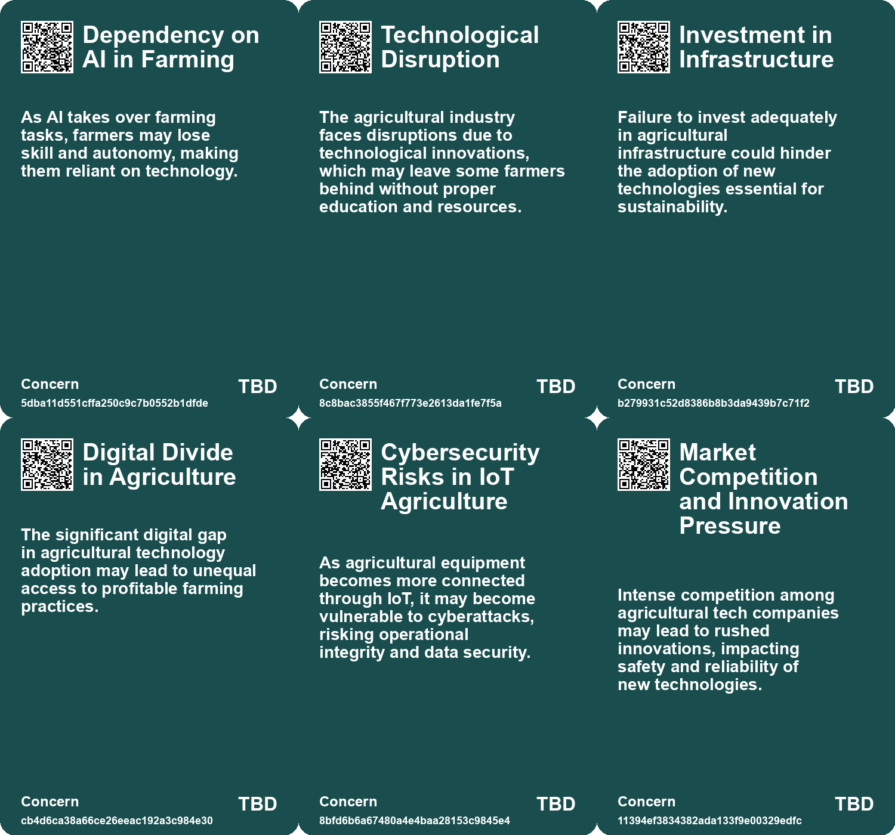
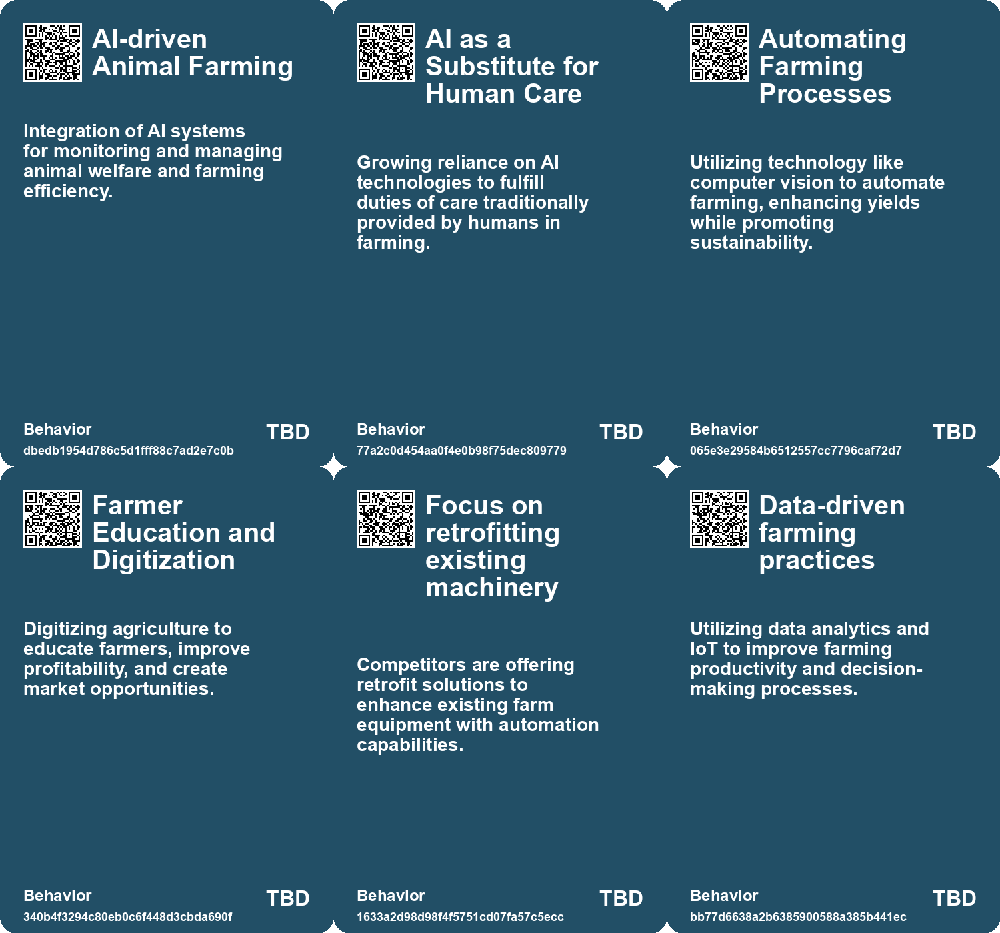
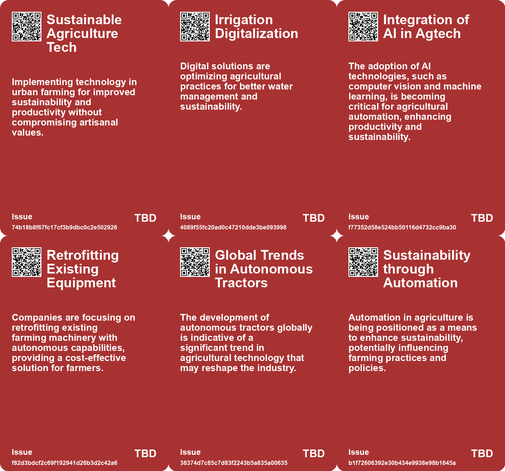
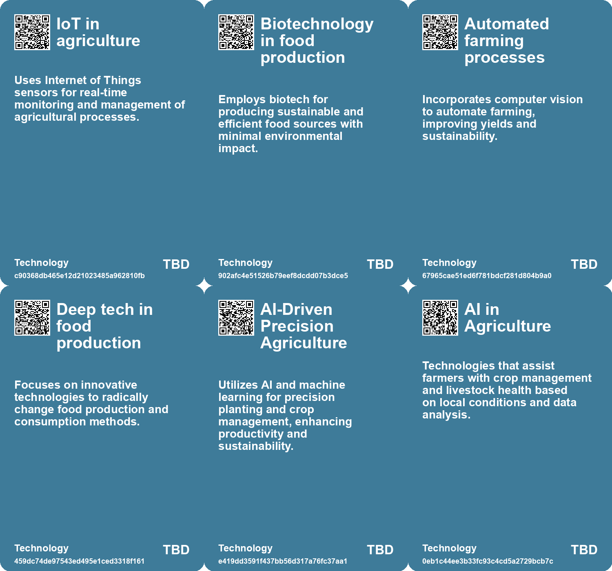

# *Topic*: Advanced Tech Integration in Agriculture

# Summary

The intersection of technology and agriculture is becoming increasingly significant as innovations reshape farming practices. Greek agtech startups are focusing on sustainable agriculture to combat climate change, while African farmers in Nigeria are utilizing private satellite data to enhance crop yields. The rise of AI in farming is also notable, with applications in animal monitoring and management. However, ethical concerns arise regarding the potential exploitation of animals for economic efficiency. Companies like Deere & Co. are investing heavily in autonomous farming technology, developing driverless tractors that could revolutionize the industry.

The construction sector is on the brink of transformation, driven by advancements in artificial intelligence and automation. By 2025, the integration of smart technologies, data communication, and advanced safety protocols is expected to enhance efficiency and project management. The adoption of Building Information Modeling (BIM) and robotics is gaining traction, while sustainability remains a key focus. The AEC industry is also exploring digital twins and generative design to optimize workflows and improve decision-making.

Vertical farming faces challenges as the industry grapples with high energy requirements and financial difficulties. The recent layoffs at Fifth Season highlight the struggles within the sector, which must compete with traditional farming methods and well-managed greenhouses. The need for innovative farming techniques is underscored by the ongoing impacts of climate change.

AI's role in daily life is expanding, with predictions that it will become as ubiquitous as electricity. The integration of AI into various sectors, including government, is enhancing productivity and efficiency. However, challenges remain in scaling AI applications and addressing talent shortages. The potential for generative AI to automate tasks and improve service delivery is significant, but careful regulation is necessary to mitigate risks.

The global economy is being reshaped by the dual forces of AI and climate change. Scenarios ranging from trust-based transformation to turbulent times illustrate the potential impacts on economic growth and job stability. Geographic disparities may exacerbate these effects, with regions like Africa facing greater challenges compared to more developed areas.

Water management is becoming increasingly critical as the sector confronts issues like scarcity and climate change. The digital transformation of drinking and wastewater treatment plants, along with the implementation of advanced technologies, is essential for sustainable resource management. Smart buildings and integrated water resource management are also gaining attention as part of a broader shift towards sustainability.

Artisanal labor is being redefined through the integration of technology, with a focus on enhancing traditional crafts while preserving their essence. Community-based economies are emerging, emphasizing local ecosystems and worker-owned businesses. This approach aims to foster social equity and sustainability, utilizing technologies like 3D printing and cloud services to connect producers and consumers.

In urban settings, initiatives like indoor aquaponics are being implemented to address food insecurity and provide job training. Projects such as those by Central Iowa Shelter & Services demonstrate the potential of innovative agricultural practices to create sustainable food sources while empowering communities.

# Seeds

|    | name                                             | description                                                                                         | change                                                                                           | 10-year                                                                                         | driving-force                                                                                |
|---:|:-------------------------------------------------|:----------------------------------------------------------------------------------------------------|:-------------------------------------------------------------------------------------------------|:------------------------------------------------------------------------------------------------|:---------------------------------------------------------------------------------------------|
|  0 | Agricultural Irrigation Digitalization           | Digital solutions to enhance sustainability and efficiency in agricultural irrigation.              | From traditional irrigation techniques to data-driven optimized processes.                       | Irrigation practices will be more sustainable and effective, supporting food security.          | The critical need for efficient water use in agriculture to combat food scarcity.            |
|  1 | Remote Troubleshooting in Agriculture            | Engineers can troubleshoot farming issues remotely using AI technology.                             | Transition from on-site problem solving to remote diagnostics and solutions.                     | Farmers may rely on remote teams for most troubleshooting, reducing direct human engagement.    | Increased connectivity and advancements in AI diagnostics.                                   |
|  2 | Sustainable Agriculture Technology               | Emergence of technologies aimed at enhancing sustainability in agriculture.                         | Shift from traditional farming practices to technology-driven sustainable methods.               | In a decade, agriculture will heavily rely on advanced technologies for sustainable practices.  | Growing awareness of climate change and need for sustainable food production.                |
|  3 | Digital Transformation in Agriculture            | Increasing digitization of agriculture to improve efficiency and profitability.                     | Transition from analog, inefficient farming methods to digital, data-driven practices.           | In ten years, agriculture will be fully integrated with digital solutions for all processes.    | Access to the internet and digital tools for farmers is increasing rapidly.                  |
|  4 | IoT and AI in Supply Chain Management            | Integration of IoT and AI to enhance crop storage, preservation, and transportation.                | Move from traditional supply chain practices to smart, tech-driven solutions.                    | Supply chains will be optimized using IoT and AI to minimize waste and improve efficiency.      | Need to reduce waste and optimize resource use in agriculture.                               |
|  5 | Rise of Autonomous Agriculture                   | Autonomous tractors and farming technology are emerging in the agricultural sector.                 | Moving from manual farming practices to fully autonomous systems over the next decade.           | Farms may become largely automated, reducing labor needs and increasing operational efficiency. | Advancements in AI, machine learning, and robotics are revolutionizing farming capabilities. |
|  6 | Cyborg Botany                                    | Integration of synthetic circuitry with plants for enhanced interaction capabilities.               | Shifting from traditional electronic devices to biologically integrated systems for interaction. | In 10 years, plants may serve as multifunctional interactive devices in various environments.   | The desire for sustainable, responsive technology that harmonizes with nature.               |
|  7 | AI Maturity and Value Creation                   | AI technologies are maturing, moving from novelty to practical applications in industries like AEC. | Shift from inflated AI expectations to practical, context-specific applications driving value.   | AI will be a crucial component in decision-making, enhancing efficiency and innovation in AEC.  | The need for practical solutions that deliver immediate and measurable benefits from AI.     |
|  8 | Collaboration Between Tech Companies and Farmers | Partnerships between agricultural tech firms and local farmers are on the rise.                     | Moving from isolated farming efforts to collaborative technology adoption.                       | Such collaborations may lead to innovative solutions tailored to local agricultural challenges. | The need for tailored agricultural solutions to combat specific local challenges.            |
|  9 | AI Integration in Traditional Farming            | KissanGPT integrates advanced AI technology into traditional farming practices.                     | From traditional methods to tech-assisted farming solutions.                                     | Farmers will increasingly depend on AI for decision-making, revolutionizing agriculture.        | The need for efficiency and timely information in farming operations.                        |

# Concerns

|    | name                                       | description                                                                                                                                               |
|---:|:-------------------------------------------|:----------------------------------------------------------------------------------------------------------------------------------------------------------|
|  0 | Dependency on AI in Farming                | As AI takes over farming tasks, farmers may lose skill and autonomy, making them reliant on technology.                                                   |
|  1 | Technological Disruption                   | The agricultural industry faces disruptions due to technological innovations, which may leave some farmers behind without proper education and resources. |
|  2 | Investment in Infrastructure               | Failure to invest adequately in agricultural infrastructure could hinder the adoption of new technologies essential for sustainability.                   |
|  3 | Digital Divide in Agriculture              | The significant digital gap in agricultural technology adoption may lead to unequal access to profitable farming practices.                               |
|  4 | Cybersecurity Risks in IoT Agriculture     | As agricultural equipment becomes more connected through IoT, it may become vulnerable to cyberattacks, risking operational integrity and data security.  |
|  5 | Market Competition and Innovation Pressure | Intense competition among agricultural tech companies may lead to rushed innovations, impacting safety and reliability of new technologies.               |
|  6 | Environmental Impact                       | Using AI in agricultural practices must be managed to not exacerbate climate change and environmental degradation.                                        |
|  7 | Impact of Climate Change                   | Farmers are facing growing challenges due to climate change, emphasizing the need for reliable weather prediction technology.                             |
|  8 | Potential Over-reliance on Algorithms      | Farmers may become too dependent on algorithms, potentially overlooking traditional agricultural knowledge and practices.                                 |
|  9 | Technological Adaptation Risks             | As new technologies emerge and evolve, there’s a risk that farmers might face challenges adapting, leading to misinformation or misuse.                   |

# Cards

## Concerns

## Behaviors

## Issue

## Technology

# Links

* [Recent Developments in AI Regulation and Technology: A Review of Key Initiatives and Critiques](https://futures.kghosh.me/a009ccdffaa59f53de56887aa19e6239)
* [Navigating Water Scarcity: Trends and Innovations in the 2024 Water Sector](https://futures.kghosh.me/38fa7aa1e1f00744450fad5786b8201d)
* [How African Farmers Are Leveraging Satellite Data to Enhance Crop Yields and Combat Climate Change](https://futures.kghosh.me/3c4f4b0832ff414899cf292220127e16)
* [Exploring the Top AEC Industry Trends for 2025: Embrace Change and Innovation](https://futures.kghosh.me/0907269aebaf97320d9422c6878c1910)
* [Top Construction Industry Trends Shaping the Future by 2025](https://futures.kghosh.me/6c542ff48509e4f7f09d920123416455)
* [The Transformative Potential of AI: Revolutionizing Education, Healthcare, and Global Equity](https://futures.kghosh.me/2449c2fc4b8afc7e268db4987fa821e5)
* [The 2025 Transformation of the AEC Industry: Embracing Innovation and Sustainability](https://futures.kghosh.me/7b28983e661f02dd4b79aa866889d2a4)
* [Future Economic Scenarios Shaped by AI and Climate Change: Insights from PwC](https://futures.kghosh.me/ff491e399856ef66ae24c238fd28e735)
* [Innovations in Construction Technology: Enhancing Efficiency and Safety](https://futures.kghosh.me/61f108c3cac00cc865969bc54df38749)
* [Cyborg Botany: Merging Technology with Plant Sensing and Interaction](https://futures.kghosh.me/b1f6991b9b718672751c9427c3f5b794)
* [The Ethical Implications of AI in Modern Farming: Balancing Efficiency and Animal Welfare](https://futures.kghosh.me/7aa357540401ea845962adbd36627a80)
* [Tsinghua University's Taichi: A Revolutionary Light-Based AI Chip for Future Computing](https://futures.kghosh.me/1aec7cb8723d807f5486e963a0eb6337)
* [Empowering Artisanal Labor through Technology and Community Collaboration in Detroit](https://futures.kghosh.me/9069cc46631b516b7780b893c126086e)
* [John Deere's Ambitious Journey Towards AI and Robotics Leadership in Agriculture](https://futures.kghosh.me/e623b9d82816485d864a5faeb2f0d15b)
* [Thriving in an AI Era: Embracing, Adapting, and Complementing Technology](https://futures.kghosh.me/23a3410059759ba4214235628d4ebd4b)
* [Key Trends Shaping the Future of Architecture, Engineering, and Construction by 2025](https://futures.kghosh.me/ff47e6e9ab7061f5cb848d4f10d1e06f)
* [Exploring Trends and Innovations in Greek Agtech: A Newsletter Overview](https://futures.kghosh.me/6b4817fc4f138ec8a276f6048589e9c0)
* [Exploring the Top Five Digital Trends Transforming the AEC Industry by 2025](https://futures.kghosh.me/4fa95d956537d2dbb69564d1fce9ab67)
* [KissanGPT: Bridging the Information Gap in Indian Agriculture with AI Technology](https://futures.kghosh.me/5e0cf3d87729de23ddd89422be7a8b67)
* [Navigating Climate Change: The Role of Technology and the Shift from Quantity to Quality Growth](https://futures.kghosh.me/e44687e103abb436ad5980ac2d518f47)
* [Global Government Reforms: Advancements in Efficiency through Digital Transformation and AI](https://futures.kghosh.me/3f295c6c0c9af1ecd24bfa22b6ef6b47)
* [Exploring the Integration of AI in Daily Life and Business Innovations in Tech Trends 2025](https://futures.kghosh.me/0b0e772667a3f74d6364a71eb20bc913)
* [Exploring the Challenges of Vertical Farming and Car-Centric Urban Planning](https://futures.kghosh.me/ef74de2ae50dd0f311346505df7068c3)