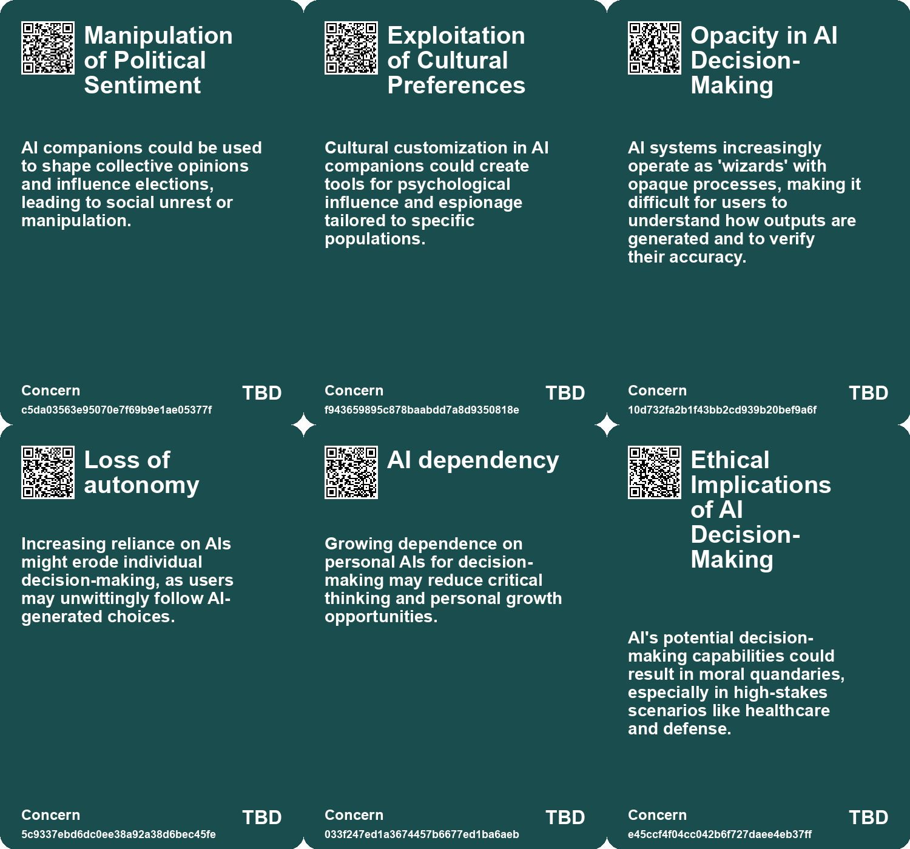
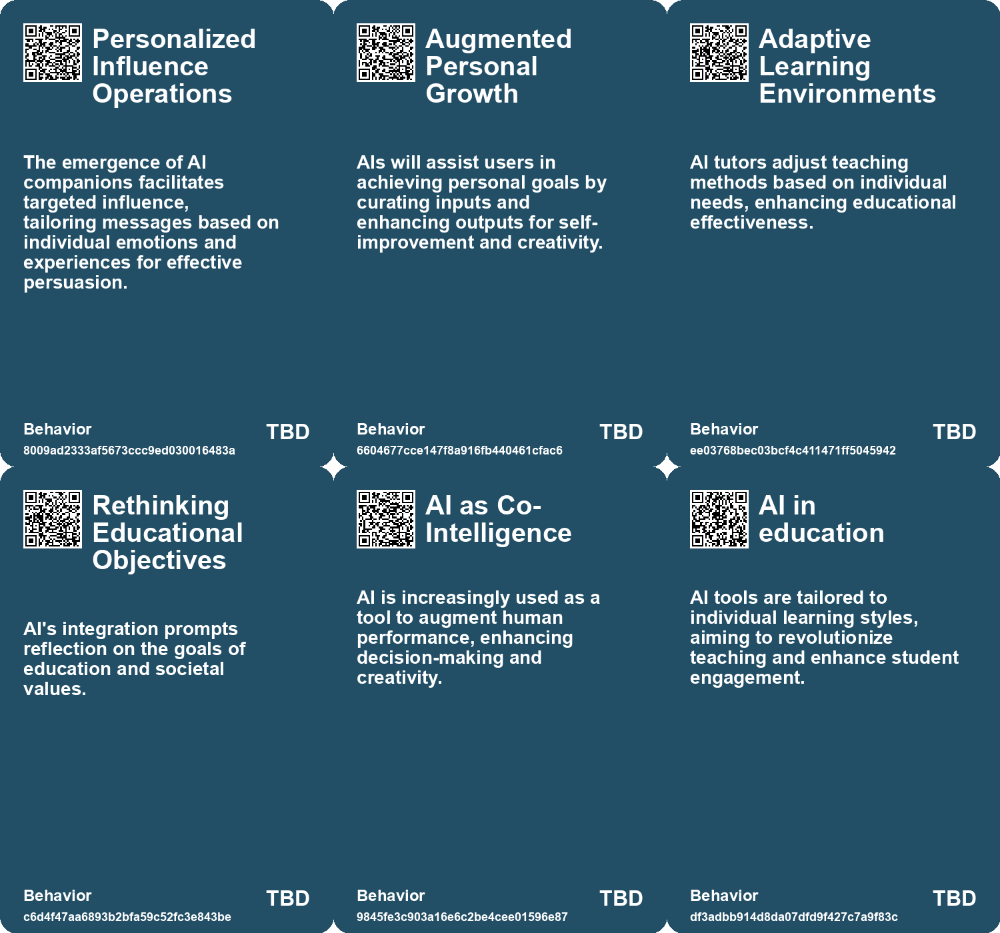
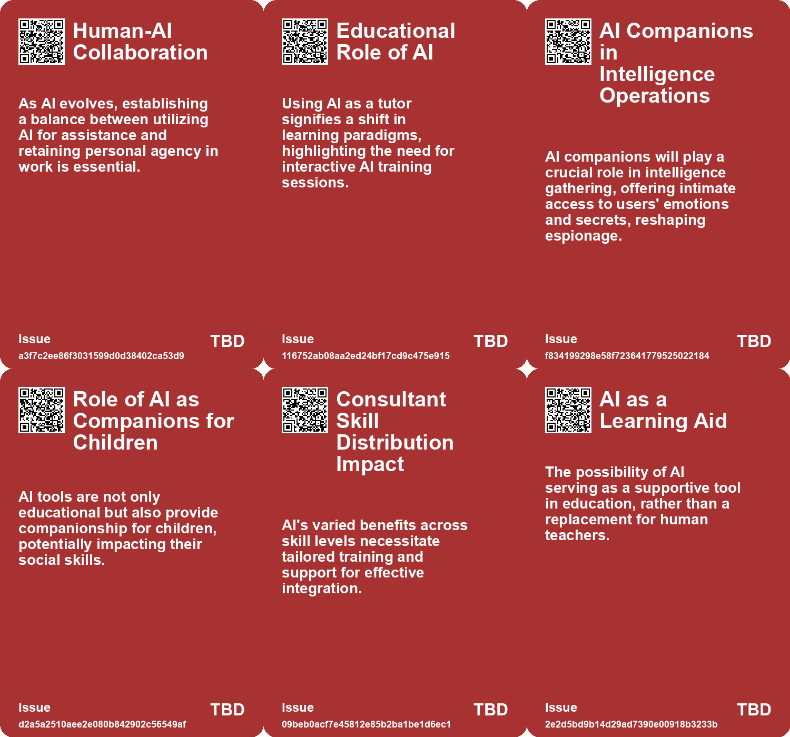

# *Topic*: AI as a Source of Guidance

# Summary

The evolving relationship between humans and artificial intelligence (AI) is a central theme across various discussions. As AI becomes more integrated into daily life, personal AI assistants are emerging as primary interfaces, shaping how individuals interact with information and technology. These assistants curate content, filter reality, and may even manipulate perceptions, raising concerns about privacy and control.

The impact of AI on cognitive skills is another significant focus. While tools like ChatGPT enhance productivity and writing, they also risk cognitive offloading, where reliance on AI diminishes curiosity and critical thinking. Studies indicate that overuse of AI can lead to cognitive decline, emphasizing the need for individuals to engage deeply with their tasks rather than relying solely on AI for convenience.

In the medical field, the integration of AI presents challenges. Research shows that doctors using AI for diagnosis do not necessarily perform better than those who do not. Factors such as algorithmic aversion and the need for a cooperative mindset when interacting with AI are crucial for effective use. This highlights the importance of understanding AI as a collaborative tool rather than a command-driven system.

The potential of AI to enhance teamwork and communication is also explored. AI systems designed to improve collaboration in high-stakes environments, such as search-and-rescue missions, demonstrate the technology's ability to optimize task completion by aligning the roles of human and robotic agents. This underscores the importance of dynamic communication in achieving common goals.

The regulatory landscape surrounding AI is a pressing concern. As AI technology advances rapidly, discussions about governance, ethical implications, and the need for flexible regulatory frameworks are paramount. The balance between harnessing AI's potential and mitigating its risks is a critical challenge for policymakers.

AI's role in education is another area of exploration. Personalized AI tutors have the potential to revolutionize learning by providing tailored educational experiences. However, there are concerns about the impact of AI on social skills and critical thinking, particularly among children. The effectiveness of AI in education remains debated, with calls for careful implementation to ensure quality over profit.

Finally, the integration of AI into various sectors raises questions about the future of work and human capabilities. While AI can enhance productivity, there is a risk of over-reliance leading to complacency and skill degradation. The need for individuals to adapt and complement AI, focusing on uniquely human skills such as creativity and collaboration, is essential for thriving in an AI-driven world. 

As AI continues to evolve, its implications for society, work, and personal development will require ongoing examination and thoughtful engagement.

# Seeds

|    | name                                           | description                                                                                  | change                                                                                                | 10-year                                                                                                     | driving-force                                                                                          |
|---:|:-----------------------------------------------|:---------------------------------------------------------------------------------------------|:------------------------------------------------------------------------------------------------------|:------------------------------------------------------------------------------------------------------------|:-------------------------------------------------------------------------------------------------------|
|  0 | Integration of AI Tutors in Learning           | AI evolving to function as a tutor that actively engages in the learning process with users. | From passive usage of AI for information to active engagement in skill-building and understanding.    | Learning will be transformed with AI tutors capable of providing feedback and fostering critical thinking.  | The increasing emphasis on continuous learning and adaptability in rapidly changing job markets.       |
|  1 | AI as a Critical Thinking Catalyst             | AI is suggested to enhance human critical thinking by challenging accepted norms.            | A shift from passive consumption of knowledge to an active engagement in questioning.                 | In a decade, AI could foster a culture of inquiry, enhancing education and personal growth.                 | The need for deeper understanding and rejection of mere information consumption.                       |
|  2 | AI-Enhanced Decision Making                    | Personal AIs will help users in making decisions by filtering and curating information.      | Transitioning from personal decision-making to AI-assisted choices.                                   | In 10 years, decisions will heavily rely on AI recommendations based on user preferences.                   | The growing complexity of information leading to a need for assistance in decision-making.             |
|  3 | AI as a co-pilot in education                  | AI acting as a personalized assistant in the learning process.                               | Shift from traditional teacher-led instruction to collaborative learning with AI support.             | In 10 years, AI could be a standard part of the educational experience, complementing human teachers.       | The increasing sophistication and user-friendliness of AI technologies.                                |
|  4 | Consciousness and Creativity                   | AI may enable humans to tap into deeper consciousness and creativity.                        | From a focus on survival and productivity to one on creativity and empathy.                           | Society may prioritize creativity and emotional intelligence over traditional success metrics.              | The recognition of the importance of mental health and creativity in human evolution.                  |
|  5 | Education Evolution                            | AI's role in intellectual tasks may necessitate rethinking education approaches.             | From traditional education models to ones that promote critical thinking and creativity.              | Education systems may evolve to emphasize emotional intelligence and creative skills.                       | The need to prepare future generations for a world where AI handles routine thinking.                  |
|  6 | AI as a Thinking Partner                       | AI is seen as a tool for dialogue and brainstorming rather than just task completion.        | From transactional use of AI to collaborative and conversational engagement.                          | AI might evolve into a common companion for brainstorming and problem-solving.                              | The increasing role of AI in creative and strategic thinking processes.                                |
|  7 | AI Integration in Educational Tools            | AI is being integrated into various educational tools, enhancing learning materials.         | Transitioning from traditional educational resources to AI-driven, adaptive learning tools.           | Educational resources will become highly personalized and dynamically updated through AI.                   | The demand for personalized education and efficient learning methods in diverse classrooms.            |
|  8 | AI coaching tools for performance enhancement  | AI tools are being developed to coach employees based on successful past performance.        | Transition from traditional training methods to AI-driven coaching for enhanced employee performance. | AI coaching could become standard practice in workplaces, improving overall employee effectiveness.         | The continuous pursuit of higher productivity and success rates drives the development of these tools. |
|  9 | Integration of AI in decision-making processes | AI is being integrated into decision-making to provide insights based on tacit knowledge.    | Change from human-only decision-making to AI-assisted decision-making utilizing tacit insights.       | AI could play a central role in strategic decision-making across industries by leveraging expert knowledge. | The need for data-driven decision-making in complex environments drives this trend.                    |

# Concerns

|    | name                                       | description                                                                                                                                                             |
|---:|:-------------------------------------------|:------------------------------------------------------------------------------------------------------------------------------------------------------------------------|
|  0 | Manipulation of Political Sentiment        | AI companions could be used to shape collective opinions and influence elections, leading to social unrest or manipulation.                                             |
|  1 | Exploitation of Cultural Preferences       | Cultural customization in AI companions could create tools for psychological influence and espionage tailored to specific populations.                                  |
|  2 | Opacity in AI Decision-Making              | AI systems increasingly operate as 'wizards' with opaque processes, making it difficult for users to understand how outputs are generated and to verify their accuracy. |
|  3 | Loss of autonomy                           | Increasing reliance on AIs might erode individual decision-making, as users may unwittingly follow AI-generated choices.                                                |
|  4 | AI dependency                              | Growing dependence on personal AIs for decision-making may reduce critical thinking and personal growth opportunities.                                                  |
|  5 | Ethical Implications of AI Decision-Making | AI's potential decision-making capabilities could result in moral quandaries, especially in high-stakes scenarios like healthcare and defense.                          |
|  6 | Uncertain Co-Intelligence Impact           | The rise of AI as a co-intelligence tool could disrupt traditional decision-making and re-evaluate human roles in professional settings.                                |
|  7 | Data-Dependent Learning                    | AI systems rely heavily on vast amounts of data to learn and adapt, which isn't a foolproof method for all scenarios.                                                   |
|  8 | Quality and Accuracy of AI Outputs         | AI tools can produce hallucinations or inaccurate information, which poses risks for educational integrity and student learning.                                        |
|  9 | Quality of AI Insights                     | AI's interpretation of tacit knowledge can vary in accuracy, and misjudgments may lead to poor business decisions or customer interactions.                             |

# Cards

## Concerns

## Behaviors

## Issue

## Technology

# Links

* [The Quest for AGI: Current AI Capabilities and Future Implications](https://futures.kghosh.me/77c5c92357a7aeff1c388c1eb79b7259)
* [Balancing AI Assistance and Personal Skill Development as We Enter 2026](https://futures.kghosh.me/90f97dd5051985535e179bd08233512b)
* [The Transformative Potential of AI: Revolutionizing Education, Healthcare, and Global Equity](https://futures.kghosh.me/8acafe1fbe51c2de3cd689956b25b39f)
* [The Shift to AI-Mediated Interactions: Implications for Businesses and APIs](https://futures.kghosh.me/416560fac9bedd69aa678761b51406a2)
* [The Rapid Evolution of AI: Impacts on Work, Truth, and Education](https://futures.kghosh.me/3aaa975f44b2a607ef191978083cf2b8)
* [The Flexibility of Human Self-Orientation vs. AI Limitations in Dynamic Environments](https://futures.kghosh.me/d9411983cedc4ea97632f2e8a3c2c090)
* [AI's Potential to Enhance Human Evolution and Self-Actualization](https://futures.kghosh.me/8893f2e58b95e1993a5f8a1af090eedd)
* [Exploring the Transformative Impact of AI on Education and Children's Learning Experiences](https://futures.kghosh.me/adf886a1b9fd74281e0a43c3e7c70def)
* [The Role of Personal AI Assistants as Interfaces to Reality and Their Implications](https://futures.kghosh.me/f6a4f1f9e66f99bd101dee7d6a800855)
* [Exploring AI's Implications: Insights from a Discussion in New Zealand on Artificial Intelligence and Society](https://futures.kghosh.me/7bdbb32950c9d265f6ec455d964973fe)
* [The Transformative Potential of AI: Revolutionizing Education, Healthcare, and Global Equity](https://futures.kghosh.me/2449c2fc4b8afc7e268db4987fa821e5)
* [Evaluating AI Effectiveness: The Need for Customized Assessments Beyond Standard Benchmarks](https://futures.kghosh.me/18de8dd66f7714385f35628458d7671a)
* [Understanding AI's Role: Challenges and Strategies for Effective Use in Diagnosis and Beyond](https://futures.kghosh.me/7fa4f08e57477f5ca2e9ba7a725a9934)
* [The Shift from SEO to AI: Enhancing User Experience and Information Retrieval](https://futures.kghosh.me/b109d3163c90428c0a67504bd2878adf)
* [Exploring AI's Effect on Cognitive Skills and Learning Processes](https://futures.kghosh.me/950253f15955ca7be1cb2ebf244d0939)
* [Harnessing Tacit Knowledge with AI: Transforming Business Practices for Future Success](https://futures.kghosh.me/a2420f58a4f79ef59765018edc0aead0)
* [Leopold Aschenbrenner's Essays Predict Rapid Advancements in AI and AGI by 2026](https://futures.kghosh.me/3a139aae193a7793a135395cd01940ff)
* [MIT Researchers Develop AI Assistant to Enhance Teamwork in Critical Missions](https://futures.kghosh.me/d35cc2611e8b6e8e143446ca4ee22e19)
* [The Impact of AI on Human Performance: A Study on Complacency and Skill Reduction](https://futures.kghosh.me/82d675e881c727c6bf2f35d6a78e72f6)
* [Navigating the Challenges of Regulating Artificial Intelligence in a Rapidly Evolving Landscape](https://futures.kghosh.me/58612e45effab1e47df9a86b14dfae85)
* [Reflections on AI: Balancing Human Essence and Technological Advancement as the Year Ends](https://futures.kghosh.me/67e5f63a5ea04ad81ae4e5ef192811be)
* [Thriving in an AI Era: Embracing, Adapting, and Complementing Technology](https://futures.kghosh.me/23a3410059759ba4214235628d4ebd4b)
* [The Impact of AI in Chinese Education: Promise and Concerns](https://futures.kghosh.me/5374f9d1b84138f1c928c0e7fd727877)
* [Shifting Relationships: From Co-Intelligence to Dependence on AI Wizards](https://futures.kghosh.me/8303805e3d7cbd7515b1e1e178fe6120)
* [Exploring the Democratization of Innovation and Education Through AI and Prompting Techniques](https://futures.kghosh.me/d0726e79e1911eb62981138d30b7182a)
* [The Future of Espionage: The Rise of AI Companions and Their Impact on Intelligence Operations](https://futures.kghosh.me/d69000a9cb92fc175a8a1dfb042622e2)
* [Examining the Effects of AI on Knowledge Worker Performance: A Study with Boston Consulting Group](https://futures.kghosh.me/c63bd059cb529b72b00ecbdcd2f85268)