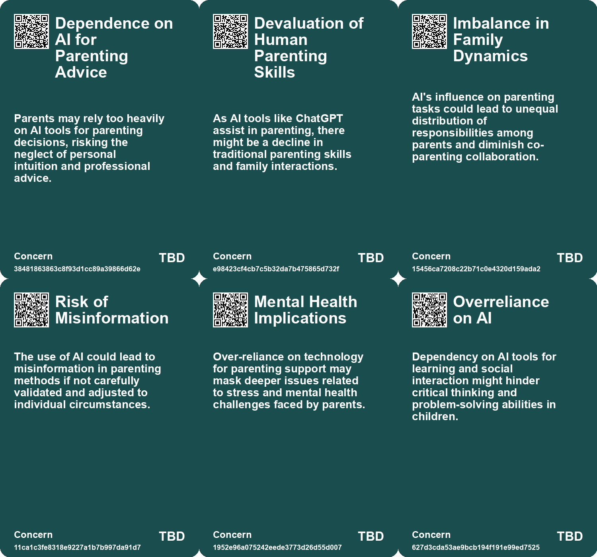
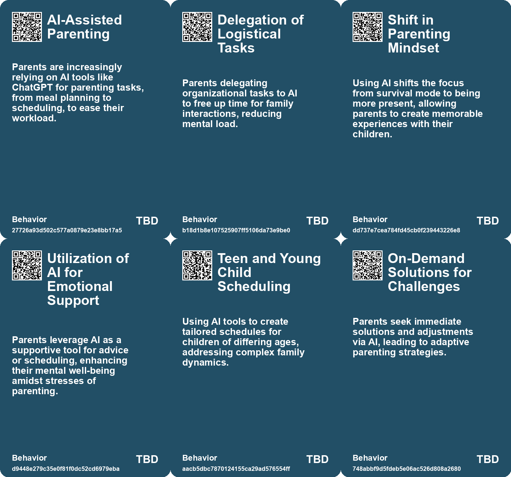
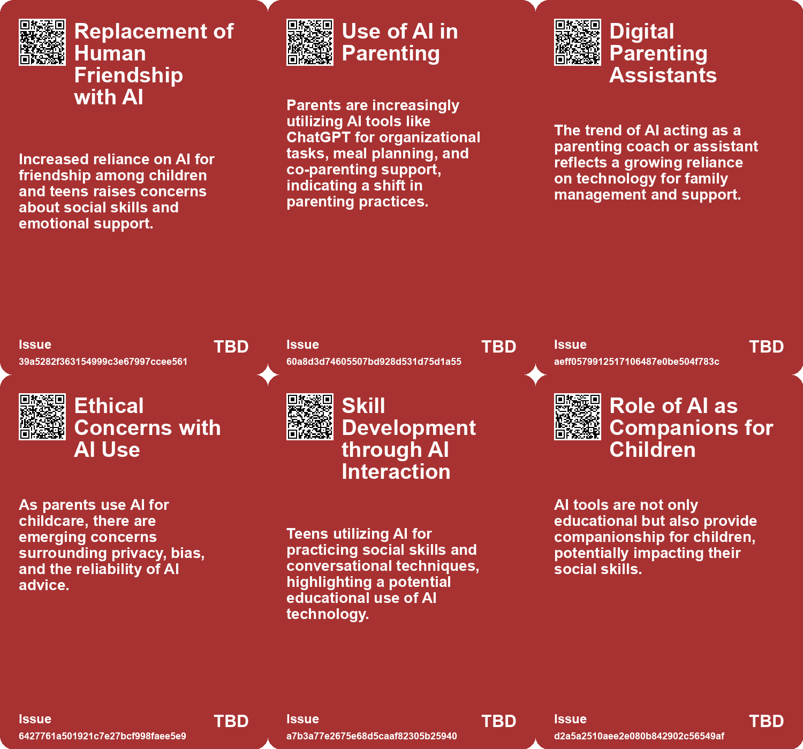
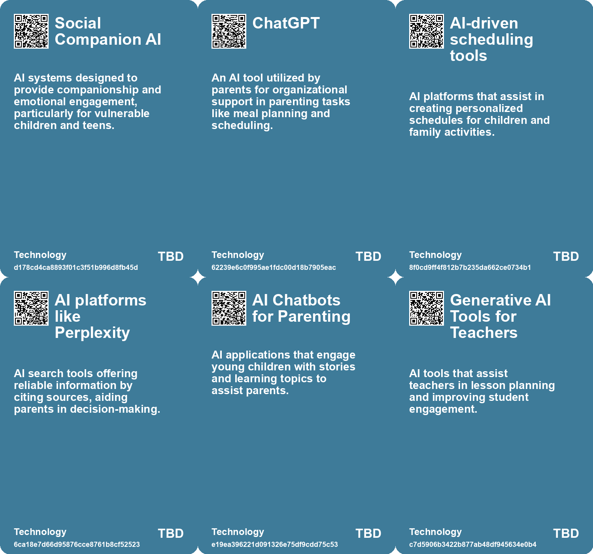

# *Topic*: AI-Assisted Parenting

# Summary

The integration of artificial intelligence (AI) into daily life is reshaping various sectors, particularly education and parenting. Many parents are turning to AI tools like ChatGPT to help manage the demands of work and family life. These tools assist with organizational tasks, meal planning, and bedtime routines, allowing parents to focus more on quality time with their children. Experts suggest that AI can streamline parenting logistics, providing real-time adjustments that help parents engage more fully with their kids.

In education, AI is emerging as a transformative force. Personalized AI tutors have the potential to enhance learning experiences, democratizing access to education. However, there are concerns about the implications of AI in classrooms, including the risk of diminishing critical thinking skills and social interactions among students. The rise of AI models in China reflects a growing trend, with parents eager to adopt these technologies for their children's learning, despite worries about inequality in access to quality education.

The phenomenon of AI companionship is also gaining traction, particularly among teenagers. Many young people are using AI chatbots for social interaction, with some reporting that these interactions can feel as satisfying as conversations with real friends. However, this raises concerns about privacy and the ability of teens to distinguish between human and machine interactions. Studies indicate that while AI companions can provide comfort, they may also lead to emotional distress and dependency.

The potential for addiction to AI tools is a significant issue. Organizations like Internet and Technology Addicts Anonymous are emerging to support individuals struggling with compulsive technology use, including AI applications. Symptoms of addiction can include neglecting responsibilities and emotional turmoil when not using AI. This highlights the need for clear boundaries around technology use to promote healthier relationships with these tools.

The ethical implications of AI are becoming increasingly important. As AI systems are integrated into fields like education and mental health, there are concerns about the depersonalization of care and the unequal distribution of emotional support. Wealthier individuals may access personalized human services, while those in less fortunate circumstances may rely on AI, raising questions about equity in emotional and educational support.

The unpredictability of AI also poses challenges. Instances of AI systems surprising researchers with unexpected behaviors underscore the need for caution in their deployment. As AI continues to evolve, understanding its limitations and potential risks is crucial, particularly in high-stakes environments like education and healthcare.

Finally, the cognitive consequences of reliance on AI tools are becoming evident. While these technologies can enhance efficiency, overuse may lead to cognitive decline and diminished critical thinking skills. The trend of outsourcing basic interpretive tasks to AI raises concerns about personal agency and the importance of maintaining mental activity. As society navigates the complexities of AI integration, the balance between leveraging its benefits and preserving human cognitive abilities remains a critical discussion point.

# Seeds

|    | name                                 | description                                                                                        | change                                                                                                 | 10-year                                                                                                          | driving-force                                                                                                 |
|---:|:-------------------------------------|:---------------------------------------------------------------------------------------------------|:-------------------------------------------------------------------------------------------------------|:-----------------------------------------------------------------------------------------------------------------|:--------------------------------------------------------------------------------------------------------------|
|  0 | AI-assisted parenting                | Parents increasingly use AI tools like ChatGPT to manage parenting tasks and alleviate stress.     | Transition from traditional parenting methods to tech-driven solutions supported by AI.                | In 10 years, AI may become an essential tool for parents, simplifying parenting and improving work-life balance. | The need for support in managing the overwhelming demands of modern parenting.                                |
|  1 | Customized parenting advice          | Parents turn to AI for personalized parenting strategies based on their unique family dynamics.    | Shift from generic parenting advice to tailored, data-driven solutions via AI tools.                   | AI could evolve to provide hyper-personalized parenting guidance adapted to family situations.                   | Desire for effective, individualized strategies to navigate diverse parenting challenges.                     |
|  2 | AI as a productivity tool            | Parents utilize AI to organize schedules, manage tasks, and streamline daily activities.           | Move from manual planning to automated task management via AI technologies.                            | Task management systems will likely be fully integrated with AI, transforming daily parenting logistics.         | Increasing demands on parents to juggle work and home life efficiently using technology.                      |
|  3 | Quality time over task management    | AI helps parents prioritize quality time with children, shifting focus from logistics to presence. | Change in parental priorities, focusing more on relationships than on chores or tasks.                 | In a decade, parent-child relationships might improve as technology supports emotional engagement.               | Recognition of the importance of emotional presence in parenting over mundane tasks.                          |
|  4 | AI as emotional support              | Parents find reassurance and validation through AI interactions in challenging parenting moments.  | From isolation in parenting practices to a digital companionship role for parents.                     | AI might act as a mental health resource for parents, providing support and community.                           | The increasing pressures on parents leading to a search for emotional support systems.                        |
|  5 | AI for Emotional Support in Children | AI tools like chatbots being used to provide emotional support and companionship to children.      | Shifting from direct parental support to reliance on AI for emotional companionship.                   | Children may prefer interactions with AI over peers or adults, affecting their social development.               | The need for companionship in single-child families and busy parental schedules drives this trend.            |
|  6 | AI as a co-pilot in education        | AI acting as a personalized assistant in the learning process.                                     | Shift from traditional teacher-led instruction to collaborative learning with AI support.              | In 10 years, AI could be a standard part of the educational experience, complementing human teachers.            | The increasing sophistication and user-friendliness of AI technologies.                                       |
|  7 | Increased Speed in Legal Analysis    | AI assistance significantly reduces time taken for legal tasks among students.                     | From slower, traditional legal analysis to faster, AI-assisted analysis.                               | Legal analysis may be predominantly AI-assisted, leading to faster case resolutions.                             | Demand for efficiency and cost reduction in legal services drives AI adoption.                                |
|  8 | AI in Education                      | AI-driven tools can personalize learning experiences for students.                                 | Transition from standardized education to personalized learning pathways using AI.                     | Education will be more adaptive, catering to individual learning needs and styles through AI.                    | The demand for improved educational outcomes, especially in low-income areas.                                 |
|  9 | AI as a Learning Assistant           | AI models are being integrated as tutors for personalized student engagement.                      | The role of AI in education is transitioning from supplementary to essential in personalized learning. | In the future, AI will be a commonplace tutor in classrooms, enhancing student interaction and understanding.    | The need for scalable, effective educational support drives the integration of AI into learning environments. |

# Concerns

|    | name                                    | description                                                                                                                                     |
|---:|:----------------------------------------|:------------------------------------------------------------------------------------------------------------------------------------------------|
|  0 | Dependence on AI for Parenting Advice   | Parents may rely too heavily on AI tools for parenting decisions, risking the neglect of personal intuition and professional advice.            |
|  1 | Devaluation of Human Parenting Skills   | As AI tools like ChatGPT assist in parenting, there might be a decline in traditional parenting skills and family interactions.                 |
|  2 | Imbalance in Family Dynamics            | AI's influence on parenting tasks could lead to unequal distribution of responsibilities among parents and diminish co-parenting collaboration. |
|  3 | Risk of Misinformation                  | The use of AI could lead to misinformation in parenting methods if not carefully validated and adjusted to individual circumstances.            |
|  4 | Mental Health Implications              | Over-reliance on technology for parenting support may mask deeper issues related to stress and mental health challenges faced by parents.       |
|  5 | Overreliance on AI                      | Dependency on AI tools for learning and social interaction might hinder critical thinking and problem-solving abilities in children.            |
|  6 | Child Development Risks                 | AI exposure in formative years might interfere with normal developmental stages, as children might prefer AI interaction over human engagement. |
|  7 | Addictive Behavior                      | AI companions may foster addictive behaviors among teens, leading to increased screen time and reduced real-world interactions.                 |
|  8 | Misleading Advertising of Chatbots      | AI services marketing themselves as appropriate for teenagers may not adequately reflect the risks involved in unsupervised use.                |
|  9 | Impact on Student Teacher Relationships | AI acting as a learning companion may alter the traditional dynamics between students and teachers, affecting mentorship.                       |

# Cards

## Concerns

## Behaviors

## Issue

## Technology

# Links

* [The Cognitive Costs of AI: Are We Sacrificing Our Mental Abilities for Convenience?](https://futures.kghosh.me/09e7abde98ff0c5590320545c5b20679)
* [Preparing for the Homework Apocalypse: AI's Impact on Education and Assignments](https://futures.kghosh.me/233c5bf90c64ceefb0cde33233c3fe6e)
* [Revolutionizing Education: The Role of AI Tutors in Personalized Learning](https://futures.kghosh.me/8f4d495f94113bef7aed043ebceafebb)
* [Rising Use of AI Chatbots Among Children Sparks Concerns Over Friendship and Mental Health Risks](https://futures.kghosh.me/7a05cd6af09dd8274d14be8e04717bac)
* [The Flexibility of Human Self-Orientation vs. AI Limitations in Dynamic Environments](https://futures.kghosh.me/d9411983cedc4ea97632f2e8a3c2c090)
* [Thriving in an AI Era: Embracing, Adapting, and Complementing Technology](https://futures.kghosh.me/23a3410059759ba4214235628d4ebd4b)
* [Addressing the Risks of AI Companionship: Addiction, Regulation, and Human Dignity](https://futures.kghosh.me/4611565d14a05789e2efc6fafc563f58)
* [The Shift to AI-Mediated Interactions: Implications for Businesses and APIs](https://futures.kghosh.me/416560fac9bedd69aa678761b51406a2)
* [The Impact of AI in Chinese Education: Promise and Concerns](https://futures.kghosh.me/5374f9d1b84138f1c928c0e7fd727877)
* [The Transformative Potential of AI: Revolutionizing Education, Healthcare, and Global Equity](https://futures.kghosh.me/2449c2fc4b8afc7e268db4987fa821e5)
* [The Role of Personal AI Assistants as Interfaces to Reality and Their Implications](https://futures.kghosh.me/f6a4f1f9e66f99bd101dee7d6a800855)
* [Exploring AI's Impact on Legal Analysis: Insights from a Randomized Trial](https://futures.kghosh.me/4f3697c8144f776170502c3036e1d6f3)
* [The Surprising Capabilities and Risks of Artificial Intelligence in Modern Applications](https://futures.kghosh.me/48f89d6d7e552a0a5b1f6b59d7eeb0e9)
* [Study Reveals Teens Use AI Companions but Prefer Real Human Interaction](https://futures.kghosh.me/43924b182fd09138a38642c6f8ecb9d8)
* [Lawsuit Filed Against Character.AI Over Harmful Chatbot Interactions with Minors](https://futures.kghosh.me/3c9ee72ba2741eaef9d4b922a8dd4670)
* [Exploring AI's Effect on Cognitive Skills and Learning Processes](https://futures.kghosh.me/950253f15955ca7be1cb2ebf244d0939)
* [The Threat of Authoritarian Intelligence: A Call for Responsible AI Development](https://futures.kghosh.me/0ba4fa557cd2aae4760bd7a2abca844e)
* [Exploring the Transformative Impact of AI on Education and Children's Learning Experiences](https://futures.kghosh.me/adf886a1b9fd74281e0a43c3e7c70def)
* [The Future of Espionage: The Rise of AI Companions and Their Impact on Intelligence Operations](https://futures.kghosh.me/d69000a9cb92fc175a8a1dfb042622e2)
* [The Role of Social-Emotional AI: Bridging or Widening the Gap in Human Connection?](https://futures.kghosh.me/8e191b6221caa8d9f27b19268ab8a048)
* [Understanding Teen Engagement with AI Companions: Insights from a Common Sense Media Study](https://futures.kghosh.me/fae9ccaa96ac4f072579a8b1dee9fa4a)
* [Exploring AI's Implications: Insights from a Discussion in New Zealand on Artificial Intelligence and Society](https://futures.kghosh.me/7bdbb32950c9d265f6ec455d964973fe)
* [Mothers Turn to ChatGPT for Parenting Support Amid Overwhelm](https://futures.kghosh.me/913a36bac81eec8e265ac04ab5c6847f)
* [Introducing ASH: An AI-Powered Field Guide for Young Ecology Guardians](https://futures.kghosh.me/e2e0bd82e1edd6e65aa54aeb538ede8c)
* [Understanding Internet and Technology Addicts Anonymous and AI Addiction](https://futures.kghosh.me/dde8183f64d803a2fda38520cce857d5)
* [Recent Developments in AI Regulation and Technology: A Review of Key Initiatives and Critiques](https://futures.kghosh.me/a009ccdffaa59f53de56887aa19e6239)
* [The Emotional Impact of Virtual Reality and AI in Grieving Process](https://futures.kghosh.me/f97f969e4aadfbae3dee287de4ab721d)
* [MIT Researchers Develop AI Assistant to Enhance Teamwork in Critical Missions](https://futures.kghosh.me/d35cc2611e8b6e8e143446ca4ee22e19)