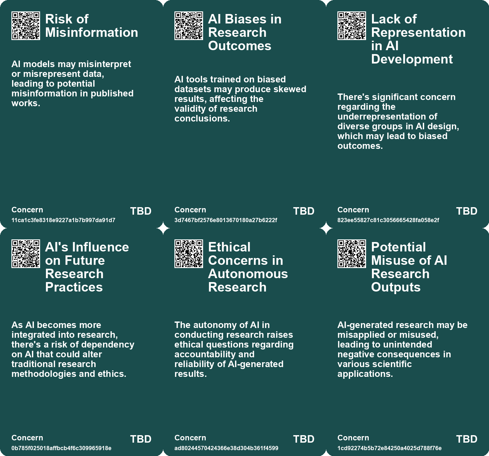
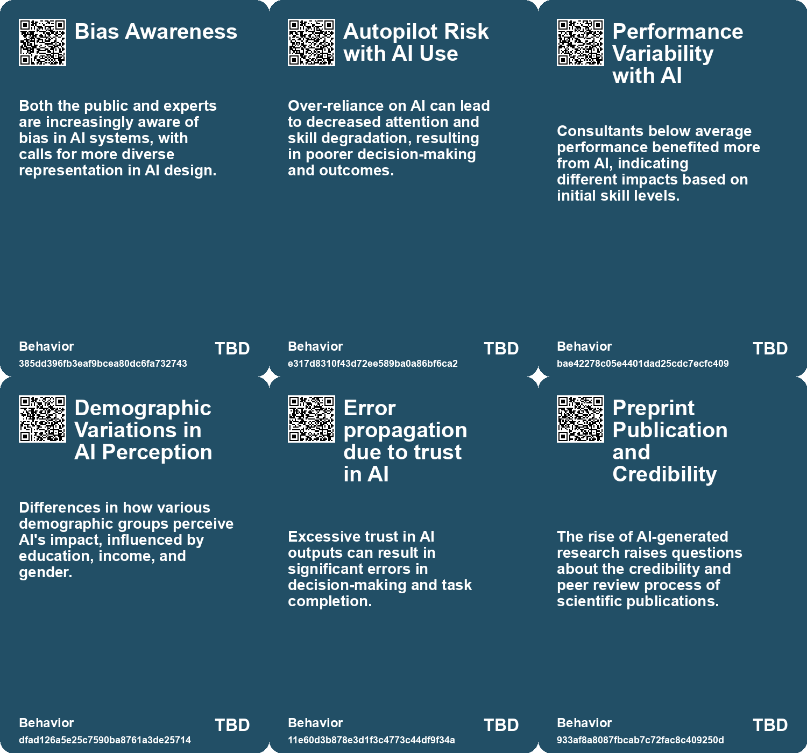
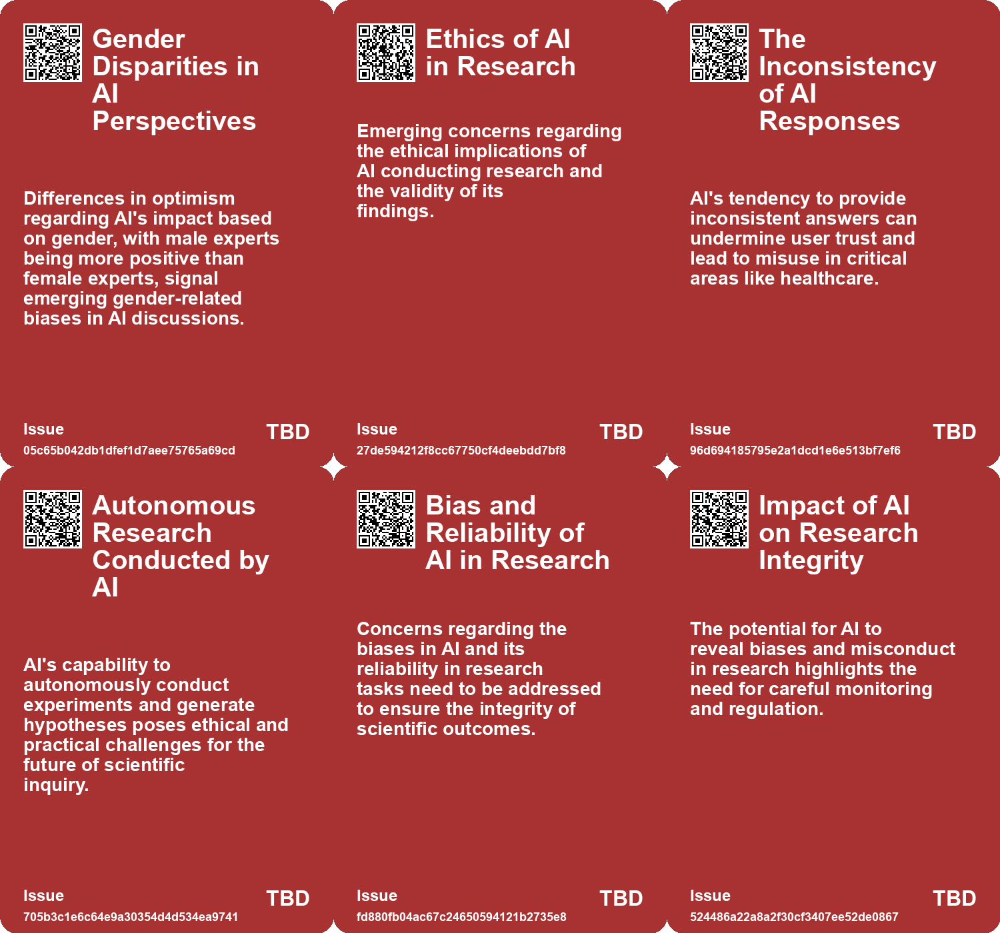
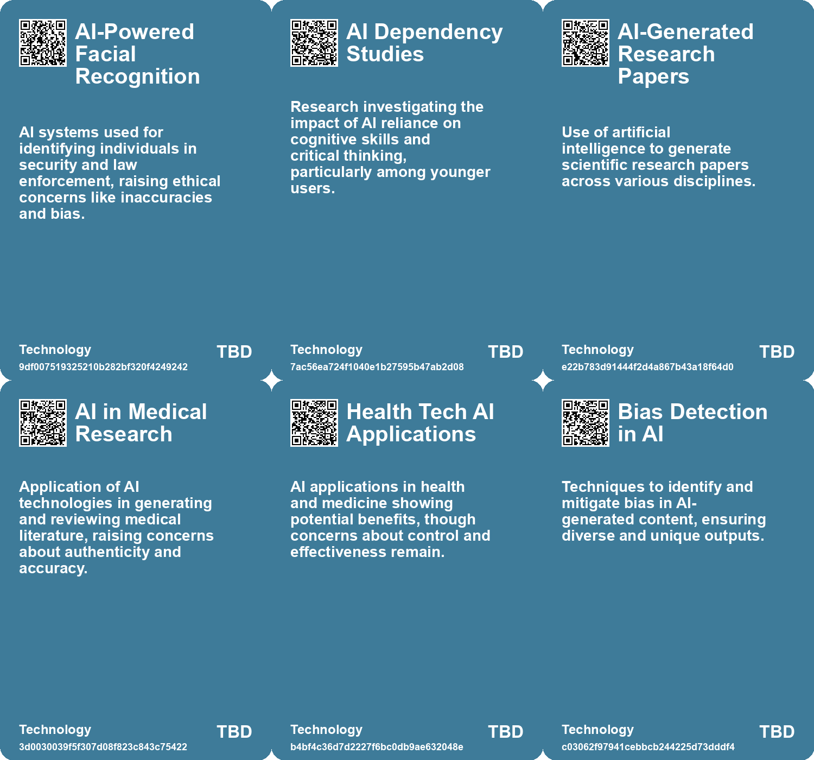

# *Topic*: AI Biases in Research Outcomes

# Summary

The integration of artificial intelligence (AI) into various sectors is reshaping human behavior, productivity, and the nature of work. Research indicates that AI can enhance performance among knowledge workers, particularly in consulting, where AI-assisted consultants outperformed their peers in creativity and analytical tasks. However, this reliance on AI also raises concerns about over-dependence, leading to cognitive atrophy and diminished critical thinking skills. Studies show that heavy use of AI tools can result in a decline in independent problem-solving abilities, especially among younger users.

The academic landscape is also experiencing significant changes due to AI. The rise of AI-generated content in scientific literature has sparked debates about the integrity of research. Analysts have noted an increase in AI-generated phrases in academic papers, which may compromise factual accuracy. This trend raises alarms about the potential for low-quality research and the challenges faced by traditional peer review systems. As AI tools like ChatGPT become more prevalent, the need for vigilance in distinguishing legitimate research from AI-generated content is critical.

Concerns about job displacement due to AI are growing, particularly among entry-level workers. A study found a notable decline in employment for younger workers in AI-exposed occupations, highlighting the disproportionate impact of automation on early-career individuals. While AI can improve efficiency in back-office tasks, its integration into customer service roles raises questions about the future of these positions.

The ethical implications of AI are becoming increasingly important. Experts emphasize the need for responsible AI development and regulation to address biases and ensure equitable outcomes. Public sentiment reflects a growing apprehension about AI's role in society, with many expressing concerns about job security and the potential for exacerbating social inequalities. The divergence in views between AI experts and the general public underscores the necessity for transparent discussions about AI's impact.

AI's influence extends to the educational sector, where its use in classrooms is being scrutinized. While AI has the potential to enhance learning, there are fears that reliance on AI tools could undermine critical thinking and creativity among students. Educators are encouraged to adopt a balanced approach, treating AI as a collaborative tool rather than a replacement for human intellect.

The rapid advancement of AI technology raises questions about its long-term implications. As AI systems become more capable, the potential for misuse and ethical dilemmas increases. The call for regulations and ethical guidelines is becoming more urgent, as stakeholders recognize the need to navigate the complexities of AI integration responsibly.

Finally, the emergence of autonomous AI systems capable of conducting independent research poses both opportunities and challenges. While these systems could revolutionize scientific inquiry, they also threaten traditional research roles and raise concerns about the future of academic integrity. The balance between leveraging AI for innovation and maintaining human oversight is crucial as society moves forward in this new technological landscape.

# Seeds

|    | name                                | description                                                                                       | change                                                                                                | 10-year                                                                                                         | driving-force                                                                               |
|---:|:------------------------------------|:--------------------------------------------------------------------------------------------------|:------------------------------------------------------------------------------------------------------|:----------------------------------------------------------------------------------------------------------------|:--------------------------------------------------------------------------------------------|
|  0 | Brain Drain in Knowledge Work       | Evidence from research points to a societal downside known as 'brain drain' due to AI reliance.   | Transition from problem-solving skills to a reliance on AI-derived solutions among knowledge workers. | Knowledge workers may increasingly struggle to perform independent problem-solving tasks due to AI dependency.  | The efficiency provided by AI leads workers to prioritize time-saving over skill retention. |
|  1 | AI and Decreased Creative Thinking  | AI reliance reportedly hinders creativity, particularly when outputs are challenging to evaluate. | Shift from independent creative processes to reliance on AI-assisted outputs for creative tasks.      | The creative landscape may be dominated by AI-assisted solutions, with reduced original thought among creators. | A trend towards efficiency leads individuals to prioritize speed over creativity in work.   |
|  2 | Potential Breakthroughs in Science  | AI-driven research could lead to significant scientific breakthroughs.                            | From slow, human-led discoveries to rapid AI-driven advancements in various fields.                   | Accelerated discoveries in critical fields like cancer research and climate change solutions.                   | The capability of AI to process vast data sets and generate insights quickly.               |
|  3 | AI Integration in Academic Research | AI's increasing role in writing and publishing academic papers.                                   | Shift from traditional academic writing to AI-assisted writing processes.                             | Academic publishing will be dominated by AI-generated content, changing review and publication standards.       | The need for faster publication rates and improved writing quality in academia.             |
|  4 | AI in Research Methodology          | AI tools are changing how researchers conduct experiments and analyze data.                       | Evolution of research methods to include AI-driven analysis and hypothesis generation.                | Research will increasingly rely on AI for data analysis, potentially leading to new methodologies.              | The need for more efficient and effective research processes.                               |
|  5 | Autonomous AI Research              | AI systems may begin conducting research independently.                                           | Shift from human-led research to AI-led research initiatives.                                         | Research discoveries could increasingly originate from AI, altering the research landscape.                     | Advancements in AI capabilities allowing for independent research tasks.                    |
|  6 | Ethical Concerns in AI Use          | Concerns arise over AI's role in producing biased or flawed research.                             | Shift from traditional ethical considerations to new challenges posed by AI in research.              | The landscape of research ethics will evolve to address AI-related challenges.                                  | Increasing reliance on AI tools without fully understanding their implications.             |
|  7 | Hallucination of AI Models          | AI generating false references or data in scientific papers.                                      | Shift from reliance on factual data to potential misinformation in research outputs.                  | Risk of misinformation becoming normalized in scientific literature due to AI errors.                           | Trust in AI tools for efficiency outweighing concerns about accuracy.                       |
|  8 | AI in Peer Review Processes         | Introduction of AI in peer review, potentially affecting quality of feedback.                     | Change from human-led peer review to AI-assisted evaluations in academia.                             | Peer review processes may rely heavily on AI, impacting the integrity of scientific validation.                 | Desire for efficiency and faster publication times in academic publishing.                  |
|  9 | Human-like AI Interaction Risks     | Potential risks of attributing human-like qualities to AI models.                                 | Shift from viewing AI as tools to perceiving them as emotionally intelligent entities.                | AI may be treated as companions or advisors, leading to ethical and emotional implications.                     | The desire for more relatable and responsive AI systems in daily life.                      |

# Concerns

|    | name                                        | description                                                                                                                                     |
|---:|:--------------------------------------------|:------------------------------------------------------------------------------------------------------------------------------------------------|
|  0 | Risk of Misinformation                      | AI models may misinterpret or misrepresent data, leading to potential misinformation in published works.                                        |
|  1 | AI Biases in Research Outcomes              | AI tools trained on biased datasets may produce skewed results, affecting the validity of research conclusions.                                 |
|  2 | Lack of Representation in AI Development    | There's significant concern regarding the underrepresentation of diverse groups in AI design, which may lead to biased outcomes.                |
|  3 | AI's Influence on Future Research Practices | As AI becomes more integrated into research, there's a risk of dependency on AI that could alter traditional research methodologies and ethics. |
|  4 | Ethical Concerns in Autonomous Research     | The autonomy of AI in conducting research raises ethical questions regarding accountability and reliability of AI-generated results.            |
|  5 | Potential Misuse of AI Research Outputs     | AI-generated research may be misapplied or misused, leading to unintended negative consequences in various scientific applications.             |
|  6 | Quality Control in Research                 | With AI's ability to generate research content, there are concerns about the quality and reliability of research outputs.                       |
|  7 | Bias and Errors in AI Research              | AI systems can be biased and produce errors, creating challenges in validity and ethics of research.                                            |
|  8 | AI in Peer Review Process                   | There is a risk that AI may influence peer review, leading to biased or unqualified evaluations of research.                                    |
|  9 | Bias in AI Reporting                        | Reports on AI safety may reflect human biases, potentially undermining efforts to address AI risks and benefits comprehensively.                |

# Cards

## Concerns

## Behaviors

## Issue

## Technology

# Links

* [The Quest for AGI: Current AI Capabilities and Future Implications](https://futures.kghosh.me/77c5c92357a7aeff1c388c1eb79b7259)
* [Navigating AI: Balancing Technological Optimism with Appropriate Fear for the Future](https://futures.kghosh.me/98862cc3722aadf82c60f8af71f1fed5)
* [Exploring the Future of Knowledge in the Age of AI: From Peer Review to NotebookLM](https://futures.kghosh.me/2c3e163f113838429299866828dad17c)
* [Exploring the Future of AI in Knowledge Ecosystems and Global Challenges](https://futures.kghosh.me/a9266018b458295480a07167310458a9)
* [The Cognitive Costs of AI: Are We Sacrificing Our Mental Abilities for Convenience?](https://futures.kghosh.me/09e7abde98ff0c5590320545c5b20679)
* [The Dangers of AI Reliance: Cognitive Atrophy and Critical Thinking Decline in Knowledge Workers](https://futures.kghosh.me/682e04f0b543e67738d8ffbb84fc50dd)
* [The Rapid Evolution of AI: Impacts on Work, Truth, and Education](https://futures.kghosh.me/3aaa975f44b2a607ef191978083cf2b8)
* [The AI Scientist: A Revolutionary Autonomous AI for Scientific Research](https://futures.kghosh.me/3607a211a5ceadc4c9c4f86cd5fcd2df)
* [Exploring the Rising Trend of AI-Generated Research Papers and Its Implications](https://futures.kghosh.me/9b642aee67b2341d5b1597cbf199fa56)
* [Exploring AI's Implications: Insights from a Discussion in New Zealand on Artificial Intelligence and Society](https://futures.kghosh.me/7bdbb32950c9d265f6ec455d964973fe)
* [AI Models Show Improved Performance in Theory of Mind Tests Compared to Humans](https://futures.kghosh.me/25cdc8c55ebb70b51b85134dc01e6efd)
* [Evaluating AI Effectiveness: The Need for Customized Assessments Beyond Standard Benchmarks](https://futures.kghosh.me/18de8dd66f7714385f35628458d7671a)
* [The Threat of Authoritarian Intelligence: A Call for Responsible AI Development](https://futures.kghosh.me/0ba4fa557cd2aae4760bd7a2abca844e)
* [MIT Study Reveals High Failure Rate of Enterprise AI Implementations Due to Poor Integration](https://futures.kghosh.me/a6a18a39971f1bcdb555339c05b4dbc5)
* [Understanding AI's Role: Challenges and Strategies for Effective Use in Diagnosis and Beyond](https://futures.kghosh.me/7fa4f08e57477f5ca2e9ba7a725a9934)
* [Contrasting Views on AI: Public Concerns vs. Expert Optimism and Advocacy for Regulation](https://futures.kghosh.me/e2ce30b29c24272c98349d7a121be360)
* [Understanding the Real Risks of AI Beyond Superintelligence and Scalability](https://futures.kghosh.me/ff7f7a51f925c273449a8648a18b7df8)
* [Understanding the 95% AI Pilot Failure Rate and How to Achieve Success](https://futures.kghosh.me/381b17bbec6c2957fe0995c6813483d0)
* [The Urgent Need for Ethical AI Regulations Amid Rapid Development and Deployment](https://futures.kghosh.me/382e9ebc1e518ee49e541da1e6b5f8af)
* [The Impact of AI on Human Performance: A Study on Complacency and Skill Reduction](https://futures.kghosh.me/82d675e881c727c6bf2f35d6a78e72f6)
* [Concerns Over AI Misuse in Scientific Literature: A Growing Challenge for Research Integrity](https://futures.kghosh.me/6dd4fe4c2f8f6e8fcc6f47e7ac1641cf)
* [Impact of Generative AI on Early-Career Employment: A Study](https://futures.kghosh.me/6286563cae4851c1c414fffd13d908c2)
* [Exploring the Risks of Homogeneity in AI Generated Content and Its Impact on Creativity](https://futures.kghosh.me/9f228766187c6c10eeddbda5a6dbbe7b)
* [Public Concern About Artificial Intelligence Grows Amid Mixed Opinions on Its Impact](https://futures.kghosh.me/c3876ee8e1b4e0d9e38edf15caaa5521)
* [AI's Impact on Work: Insights from a Study on Consultants Using ChatGPT-4](https://futures.kghosh.me/c94f72ff677c7517a836417c1f1df620)
* [The Transformative Impact of AI on Academic Research and Its Future Challenges](https://futures.kghosh.me/04ea36e5447d3914bd8e463d50f2715f)
* [Examining the Effects of AI on Knowledge Worker Performance: A Study with Boston Consulting Group](https://futures.kghosh.me/c63bd059cb529b72b00ecbdcd2f85268)