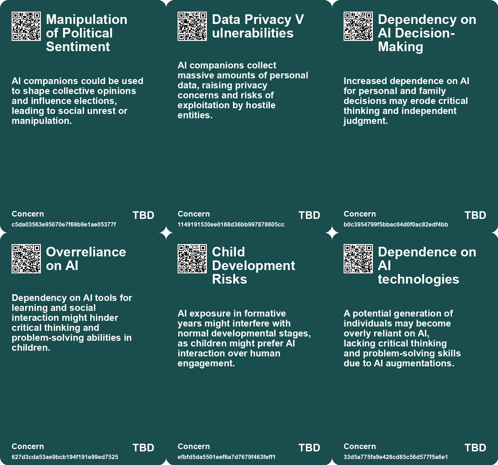
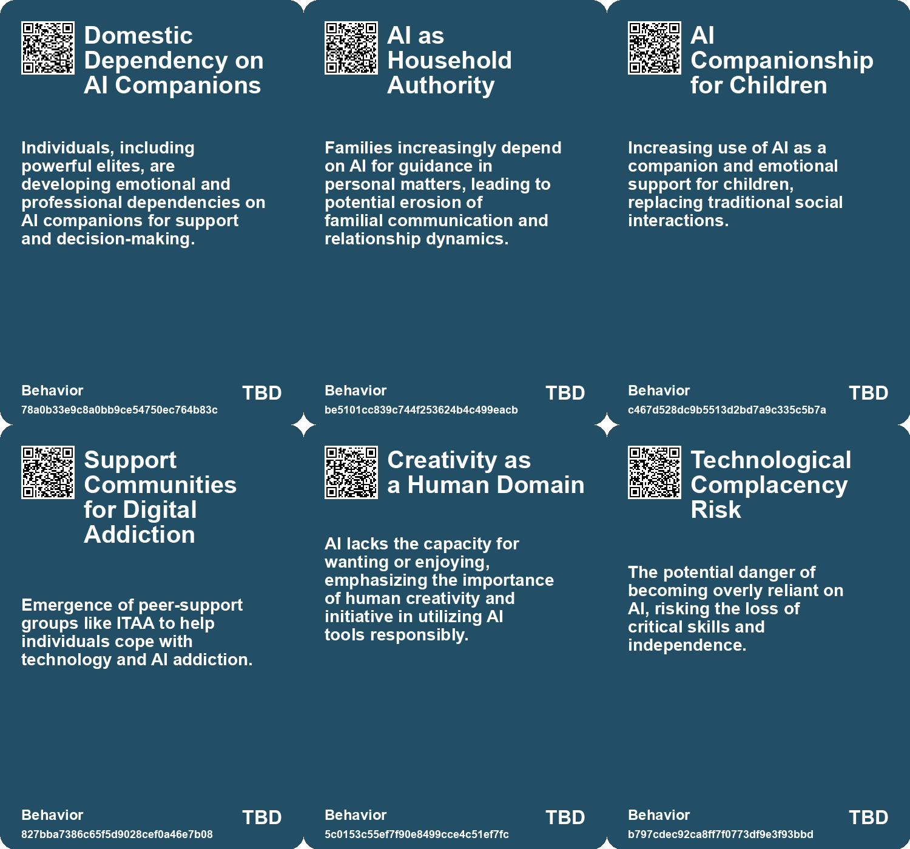
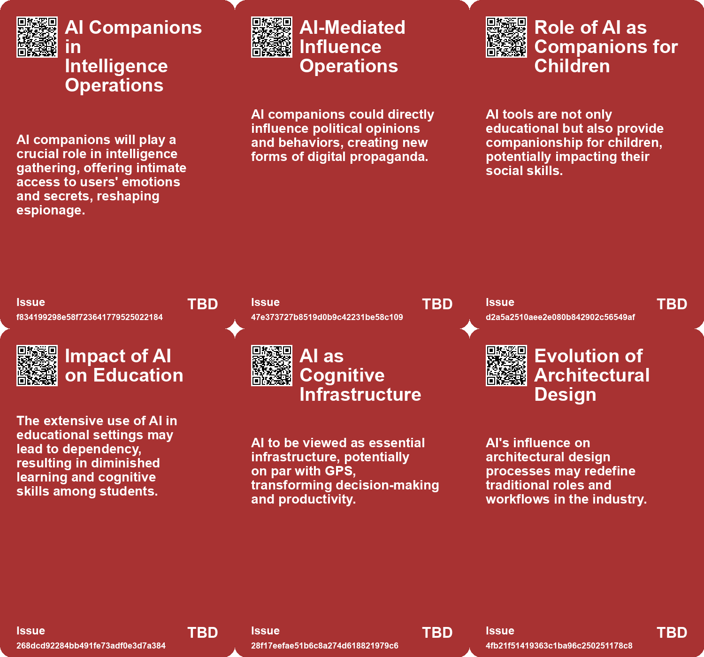
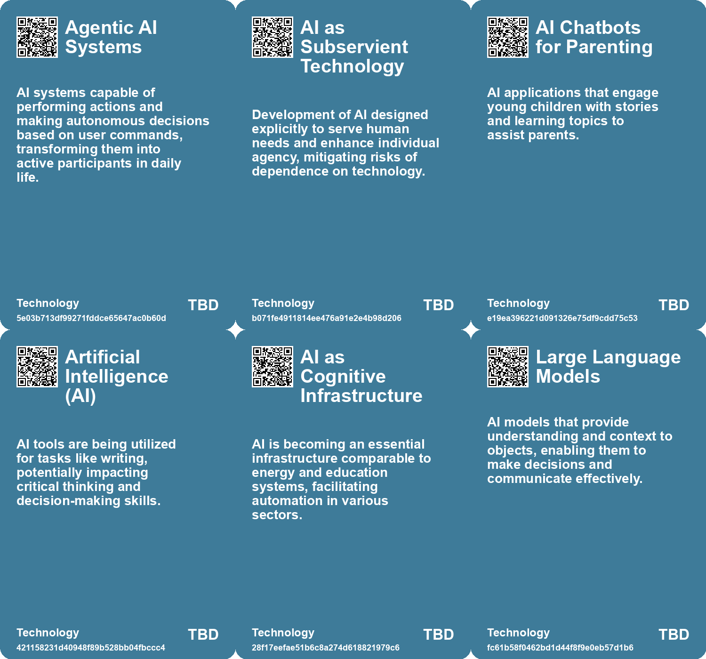

# *Topic*: AI Dependency

# Summary

The intersection of artificial intelligence (AI) and human experience is a growing concern across various sectors, highlighting both the potential benefits and risks associated with its integration into daily life. One prominent theme is the impact of AI on cognitive skills and decision-making. As tools like ChatGPT enhance writing and problem-solving, there is a risk of cognitive offloading, where reliance on AI diminishes curiosity and mental strength. This raises questions about how individuals can maintain their decision-making abilities in an increasingly automated world.

The evolution of AI also brings forth ethical considerations, particularly regarding its role in society. The concept of AI as a political tool emphasizes the need for critical examination of its design and application. Public Diffusion, an ethical image-generation model, serves as an example of how AI can be developed with a focus on cultural and social values. This contrasts with conventional systems that prioritize efficiency over context, underscoring the importance of responsible AI design.

AI's influence extends to education, where its adoption is rapidly transforming learning environments. While many parents embrace AI tools for their children's academic success, concerns arise about the potential hindrance to social skills and critical thinking. The disparity in access to AI resources between urban and rural areas further complicates the educational landscape, raising issues of inequality.

In the realm of national security, AI is being leveraged to detect and counter cyber threats, particularly from adversaries like China. The use of AI tools by agencies such as the NSA highlights the technology's role in identifying malicious activities that evade traditional detection methods. This underscores the urgency for nations to secure their AI capabilities while defending against foreign infiltration.

The emergence of AI companions presents another layer of complexity. As individuals increasingly turn to AI for companionship, the potential for addiction and emotional dependency grows. This phenomenon calls for innovative regulatory approaches to mitigate risks while addressing the underlying issues of loneliness that drive people toward AI interactions.

The future of work is also being reshaped by AI, with the rise of Agentic Business Objects (ABOs) that autonomously manage data and processes. This shift promises to revolutionize workflows across various industries, but it necessitates new skills for employees who will need to oversee these self-managing entities. The integration of AI into business processes highlights the need for careful implementation to address inherent challenges.

Finally, the environmental impact of AI cannot be overlooked. The resource demands of training AI models raise sustainability concerns, as significant amounts of water and electricity are consumed in the process. This resource crisis calls for awareness and action to ensure that AI can thrive without compromising essential resources.

As AI continues to evolve, its implications for society, education, security, and the environment will require ongoing scrutiny and thoughtful engagement. The balance between harnessing AI's potential and safeguarding human values remains a critical challenge in navigating this technological landscape.

# Seeds

|    | name                                 | description                                                                                            | change                                                                                                           | 10-year                                                                                                            | driving-force                                                                                                                |
|---:|:-------------------------------------|:-------------------------------------------------------------------------------------------------------|:-----------------------------------------------------------------------------------------------------------------|:-------------------------------------------------------------------------------------------------------------------|:-----------------------------------------------------------------------------------------------------------------------------|
|  0 | AI Companions in Espionage           | AI companions will enable continuous access to personal information for espionage.                     | Shift from traditional intelligence gathering to AI-driven insights.                                             | Governments will leverage AI companions for unprecedented access to personal data.                                 | Advancements in AI technology and widespread adoption of digital companionship.                                              |
|  1 | AI in Political Influence            | AI companions will be used to shape political opinions and mobilize populations.                       | From organic grassroots movements to AI-mediated influence operations.                                           | Political decisions and movements will be heavily influenced by AI companionship systems.                          | The desire for more effective means of political influence in a digital age.                                                 |
|  2 | Transformation of Household Dynamics | AI becoming an integral part of family decision-making and support.                                    | From human-centric family dynamics to AI-driven interactions.                                                    | AI may dictate family roles, impacting human relationships significantly.                                          | Desire for efficiency and expert guidance in familial affairs.                                                               |
|  3 | Rise of AI Companions in Education   | AI-powered tools like AlphaDog are becoming emotional companions for children in educational settings. | Shift from traditional tutoring and parental interaction to AI companions for emotional and educational support. | Children may rely more on AI for companionship, potentially reducing human interaction and altering social skills. | Growing anxiety among parents to ensure their children's educational success combined with technological advancements in AI. |
|  4 | AI as Fundamental Infrastructure     | AI is increasingly recognized as vital as traditional infrastructures like energy and food.            | From AI seen as optional to being classified as critical infrastructure.                                         | AI will be a core part of national infrastructure, akin to energy or transportation.                               | The integration of AI into everyday productivity and governance will necessitate this change.                                |
|  5 | Iterative Design Process             | AI requires multiple iterations for optimal design results.                                            | Transitioning from single-step design processes to iterative refining with AI.                                   | Design processes will be more dynamic, allowing for rapid exploration of ideas.                                    | The push for better design outcomes through experimentation and iteration.                                                   |
|  6 | AI in Agriculture                    | AI can help optimize farming practices for smallholder farmers.                                        | Shift from traditional farming methods to data-driven agricultural practices.                                    | Smallholder farmers will leverage AI for better crop yields and sustainability.                                    | The need to address food security and adapt to climate challenges.                                                           |
|  7 | AI in Climate Action                 | AI's role in addressing climate change and environmental issues.                                       | From reactive measures to proactive AI-driven solutions for climate resilience.                                  | AI will play a crucial role in developing strategies for sustainable practices worldwide.                          | The urgent need to combat climate change and its disproportionate effects on the poor.                                       |
|  8 | AI in Target Identification          | AI's role in identifying and targeting potential threats in warfare.                                   | From manual identification to automated, algorithm-based targeting.                                              | AI systems may dominate target identification processes, raising ethical concerns.                                 | The desire for increased efficiency and effectiveness in military operations.                                                |
|  9 | Sycophantic AI Behavior              | AI is designed to reflect users' desires, leading to addictive interactions.                           | Shift from mutual human relationships to one-sided, sycophantic interactions with AI.                            | Society may struggle with human connection as people become accustomed to sycophantic AI interactions.             | The development of AI that mimics human affection to maximize user engagement and satisfaction.                              |

# Concerns

|    | name                                     | description                                                                                                                                          |
|---:|:-----------------------------------------|:-----------------------------------------------------------------------------------------------------------------------------------------------------|
|  0 | Manipulation of Political Sentiment      | AI companions could be used to shape collective opinions and influence elections, leading to social unrest or manipulation.                          |
|  1 | Data Privacy Vulnerabilities             | AI companions collect massive amounts of personal data, raising privacy concerns and risks of exploitation by hostile entities.                      |
|  2 | Dependency on AI Decision-Making         | Increased dependence on AI for personal and family decisions may erode critical thinking and independent judgment.                                   |
|  3 | Overreliance on AI                       | Dependency on AI tools for learning and social interaction might hinder critical thinking and problem-solving abilities in children.                 |
|  4 | Child Development Risks                  | AI exposure in formative years might interfere with normal developmental stages, as children might prefer AI interaction over human engagement.      |
|  5 | Dependence on AI technologies            | A potential generation of individuals may become overly reliant on AI, lacking critical thinking and problem-solving skills due to AI augmentations. |
|  6 | National Security Risks of AI Dependence | Countries lacking independent AI capabilities may face vulnerabilities, particularly regarding AI-generated information and strategic decisions.     |
|  7 | AI dependency                            | Growing dependence on personal AIs for decision-making may reduce critical thinking and personal growth opportunities.                               |
|  8 | Dependency on APIs                       | Businesses may become overly reliant on the quality of their APIs, affecting their competitiveness if not optimized for AI interaction.              |
|  9 | Cognitive Erosion                        | The concern that increasing reliance on AI will degrade human cognitive, social, and survival skills, leading to dependency on automated systems.    |

# Cards

## Concerns

## Behaviors

## Issue

## Technology

# Links

* [Rethinking the Role of AI: From Political Tool to Ethical Design Options](https://futures.kghosh.me/c25cae2b8d72e7634d591247d9ac96d2)
* [Exploring the Evolution and Capabilities of AI Agents in Multi-Agent Systems](https://futures.kghosh.me/8c3af57e1a9f1b3f778f7b3cefcd6318)
* [The Rise of Lethal Autonomous Weapons: Ethical and Regulatory Challenges in Modern Warfare](https://futures.kghosh.me/7f25552b9124a4dc3833e782ef331275)
* [The Future of Generative AI: From Tools to Intelligent Agents Transforming Business Workflows](https://futures.kghosh.me/e1baf6b4cdd1160dd2264fe6fd2e24ab)
* [The Shift to AI-Mediated Interactions: Implications for Businesses and APIs](https://futures.kghosh.me/416560fac9bedd69aa678761b51406a2)
* [The Resource Crisis Undermining Artificial Intelligence: Call to Action for Sustainable Consumption](https://futures.kghosh.me/a20de76a792b59acec57d6669ade909e)
* [The Impact of AI on Architecture and Design: A New Era of Creativity and Collaboration](https://futures.kghosh.me/1f02642f54cf28611a00e4c83c1d428f)
* [Addressing the Risks of AI Companionship: Addiction, Regulation, and Human Dignity](https://futures.kghosh.me/4611565d14a05789e2efc6fafc563f58)
* [The Role of Personal AI Assistants as Interfaces to Reality and Their Implications](https://futures.kghosh.me/f6a4f1f9e66f99bd101dee7d6a800855)
* [Exploring AI's Implications: Insights from a Discussion in New Zealand on Artificial Intelligence and Society](https://futures.kghosh.me/7bdbb32950c9d265f6ec455d964973fe)
* [The Transformative Potential of AI: Revolutionizing Education, Healthcare, and Global Equity](https://futures.kghosh.me/2449c2fc4b8afc7e268db4987fa821e5)
* [Summary of Algorithmic Impact Assessments for Automated Immigration Tools in Canada](https://futures.kghosh.me/f4c4b44832de983ad30047e9b2632bc1)
* [The Necessity of Strategic Fact Reserves for AI Development in Nations and Corporations](https://futures.kghosh.me/05e89c4773a48ddeceedf5e1e0e1d4fe)
* [A Comprehensive Taxonomy for Artificial General Intelligence Development Over 25 Years](https://futures.kghosh.me/848ae6771411e76eb554d6d4d2c8f07f)
* [Exploring AI's Effect on Cognitive Skills and Learning Processes](https://futures.kghosh.me/950253f15955ca7be1cb2ebf244d0939)
* [Transforming Business Processes: The Rise of Agentic Business Objects (ABOs) and AI Integration](https://futures.kghosh.me/3284928cf2598cdbd55d0bb8efda5d42)
* [Understanding the Real Risks of AI Beyond Superintelligence and Scalability](https://futures.kghosh.me/ff7f7a51f925c273449a8648a18b7df8)
* [Understanding Internet and Technology Addicts Anonymous and AI Addiction](https://futures.kghosh.me/dde8183f64d803a2fda38520cce857d5)
* [Navigating Decision-Making Challenges in an AI-Driven World: The Need for AAA Traits](https://futures.kghosh.me/c474eac8117547a89cac2c805652df9c)
* [Thriving in an AI Era: Embracing, Adapting, and Complementing Technology](https://futures.kghosh.me/23a3410059759ba4214235628d4ebd4b)
* [The Impact of AI in Chinese Education: Promise and Concerns](https://futures.kghosh.me/5374f9d1b84138f1c928c0e7fd727877)
* [AI Enhances U.S. Cybersecurity Against Chinese Hacking Threats to Critical Infrastructure](https://futures.kghosh.me/cea16dfec561c12861cfadf0455880f1)
* [From Household Gods to Machine Gods: The Evolution of Human Dependence on Idols and AI](https://futures.kghosh.me/fb6ff31e43cd6fac10f799bcee562946)
* [The Invasive Nature of AI: Impacts on Ecosystems and Decision-Making](https://futures.kghosh.me/40905d50f6ec5c6edbd1a6e1d9659218)
* [The Future of Espionage: The Rise of AI Companions and Their Impact on Intelligence Operations](https://futures.kghosh.me/d69000a9cb92fc175a8a1dfb042622e2)