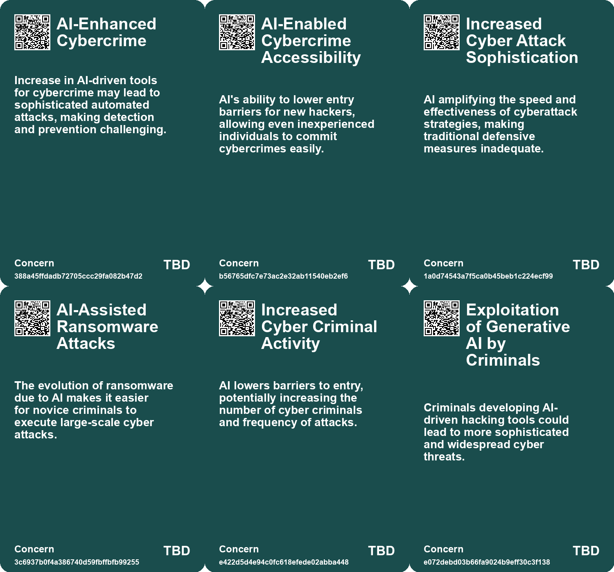
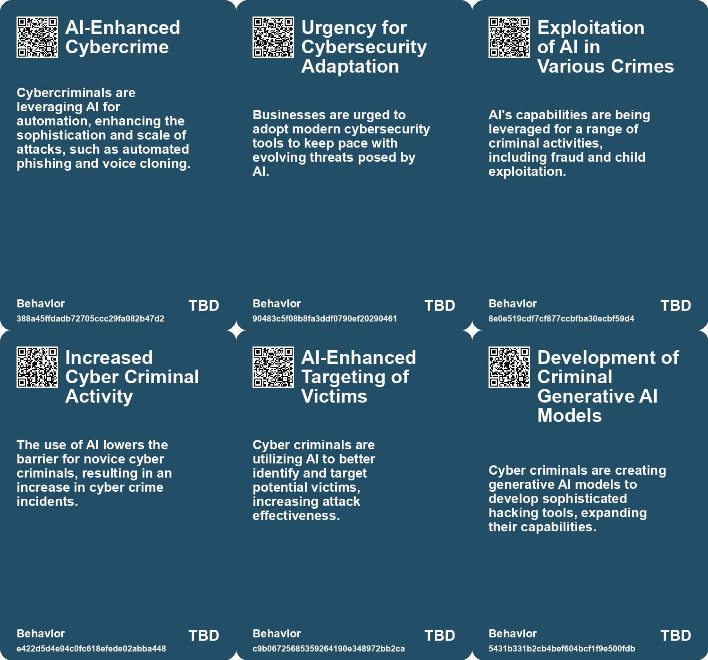
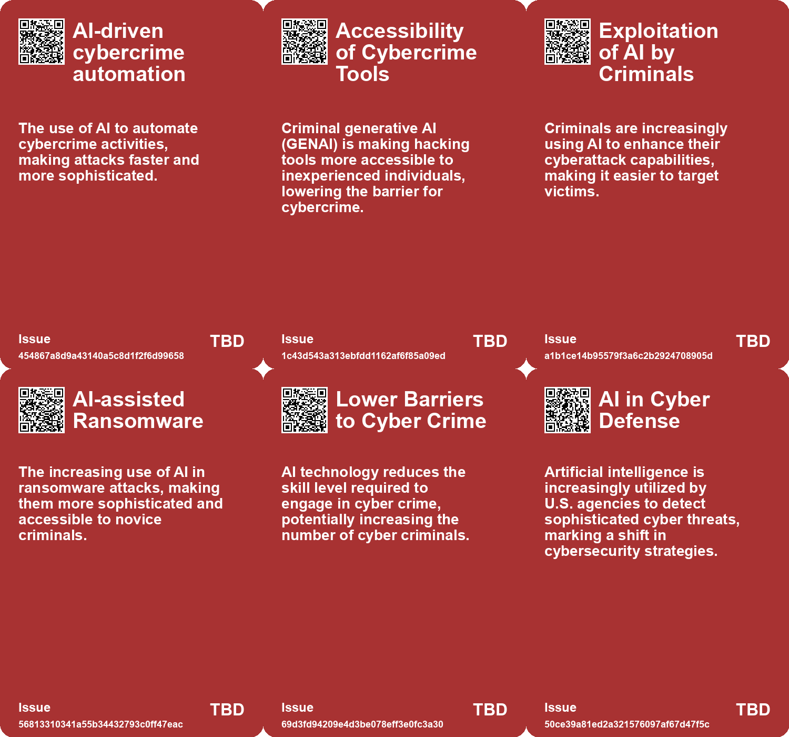

# *Topic*: AI-driven Cybercrime

# Summary

Cybersecurity is facing unprecedented challenges as artificial intelligence (AI) becomes a double-edged sword in the digital landscape. The rise of AI-fueled cybercrime is alarming, with attackers leveraging automation for phishing, voice cloning, and social engineering. Reports indicate that AI is lowering the entry barriers for novice hackers, making it easier for them to execute sophisticated attacks, particularly ransomware. The UK's National Cyber Security Centre has highlighted the urgent need for organizations to adopt modern cybersecurity tools to combat these evolving threats.

In the United States, government agencies are employing AI to detect malicious cyber activities, particularly from state-sponsored actors like China and Iran. These adversaries are increasingly targeting critical infrastructure, using unconventional methods that evade traditional security measures. The National Security Agency is utilizing AI to identify anomalous behaviors that may indicate cyber intrusions, reflecting a broader trend of integrating advanced technologies into national defense strategies.

The financial sector is not immune to these threats. A recent incident in Hong Kong involved a finance worker falling victim to a deepfake scam, resulting in a loss of $25 million. This incident underscores the growing sophistication of AI-driven fraud, where scammers can create convincing impersonations that deceive even the most vigilant employees. As AI technologies advance, the potential for misuse in financial scams continues to rise.

Generative AI is also transforming identity security, leading to a significant increase in voice phishing attacks. Traditional identity management systems are struggling to keep pace with these machine-driven threats, prompting organizations to adopt AI-powered security solutions. The CrowdStrike 2025 Threat Hunting report noted a staggering increase in vishing attacks, emphasizing the need for integrated identity management approaches to mitigate risks.

The emergence of synthetic media, including deepfakes, poses a significant threat to information integrity. A Europol report warns that by 2026, a substantial portion of online content could be artificially generated, raising concerns about misinformation and manipulation. This trend is particularly troubling for artists and writers, as the boundaries of authenticity blur in the digital realm.

In the legal sector, mercenary hackers are increasingly targeting law firms to steal sensitive data that could influence legal outcomes. Reports from French and British authorities highlight the risks posed by hackers-for-hire, who are hired to obtain confidential information from opposing parties. This trend underscores the urgent need for enhanced cybersecurity measures within the legal industry to protect sensitive information.

Finally, the use of AI by extremist groups to create propaganda raises significant concerns about the effectiveness of current content moderation efforts. Generative AI tools are being employed to produce large volumes of extremist content, complicating the battle against online radicalization. However, there is also potential for AI to be used as a countermeasure against these threats, as organizations explore ways to detect and mitigate the misuse of AI technologies.

As the landscape of cybersecurity continues to evolve, the intersection of AI and cyber threats presents both challenges and opportunities. Organizations across various sectors must remain vigilant and proactive in adapting their security measures to address the complexities introduced by AI.

# Seeds

|    | name                                       | description                                                                                   | change                                                                                        | 10-year                                                                                                        | driving-force                                                                                            |
|---:|:-------------------------------------------|:----------------------------------------------------------------------------------------------|:----------------------------------------------------------------------------------------------|:---------------------------------------------------------------------------------------------------------------|:---------------------------------------------------------------------------------------------------------|
|  0 | AI-Driven Cybercrime                       | Adversaries using AI to automate cyberattacks and enhance threat capabilities.                | From traditional cybercrime methods to AI-automated strategies for efficiency.                | Cybercrime evolves into highly automated and sophisticated operations, challenging security measures globally. | Increased accessibility and capabilities of AI tools, making cybercrime easier to execute.               |
|  1 | Agricultural and Industrial Targeting      | Cybercriminals focusing on enterprise software vital for operational technology.              | From general attacks on data to targeted threats against critical industrial infrastructures. | Operational technology may face more frequent and severe disruptions from cyber threats.                       | Increased reliance on technology in industrial sectors makes them attractive targets for cybercriminals. |
|  2 | Rise of Generative AI in Cybercrime        | Criminals are using generative AI to facilitate cyberattacks more easily.                     | Shift from traditional hacking methods to AI-assisted hacking techniques.                     | In 10 years, generative AI could dominate the cybercrime landscape, enabling widespread attacks.               | The accessibility and affordability of generative AI technology for potential hackers.                   |
|  3 | Increased Vulnerability of Businesses      | Businesses are becoming more vulnerable to cyber threats due to AI advancements.              | Transition from secure systems to more easily breached systems due to AI tools.               | In a decade, businesses may face unprecedented levels of cyber threats and data breaches.                      | The continuous evolution of cyberattack strategies leveraging AI advancements.                           |
|  4 | Affordable Cybercrime as a Service         | Criminal generative AI will be offered as a service for aspiring hackers.                     | Shift from individual hacking efforts to organized services providing hacking tools.          | A decade from now, cybercrime as a service could become a mainstream industry.                                 | The growing market demand for accessible hacking tools among criminals.                                  |
|  5 | AI in Risk Management                      | Businesses urged to use AI effectively for managing cyber threats.                            | Shift from traditional risk management to AI-driven approaches.                               | In a decade, AI may become essential for all businesses' cybersecurity strategies.                             | The increasing complexity and frequency of cyber threats necessitating advanced risk management.         |
|  6 | AI as a Tool for Cyber Crime               | AI is being used to develop sophisticated hacking tools accessible to novice criminals.       | The use of AI in cyber crime is evolving, increasing accessibility for novice criminals.      | In ten years, AI may enable a larger number of effective cyber criminals, increasing attack frequency.         | The growing availability of AI tools lowers the barriers for entry into cyber crime.                     |
|  7 | Generative AI in Cyber Crime               | Criminal versions of generative AI models are being developed for hacking.                    | Generative AI is transitioning from a tool for creativity to a tool for crime.                | In ten years, generative AI could be a common tool in cyber crime, complicating defenses.                      | The accessibility of generative AI models encourages their use in illegal activities.                    |
|  8 | Increased automation in phishing attacks   | AI enables scammers to automate mass personalized phishing campaigns quickly and efficiently. | Transition from manual phishing campaigns to automated, large-scale operations powered by AI. | Phishing attacks may become highly automated, making them harder to detect and counter.                        | The need for efficiency and effectiveness in executing scams on a larger scale.                          |
|  9 | Rapid Advancements in AI for Malicious Use | AI advancements are harnessed for malware creation and targeted scams.                        | Shift from AI being a tool for innovation to a tool for malicious activities.                 | AI could be predominantly viewed as a risk, with regulations potentially lagging behind innovation.            | The pace of AI development outstrips regulatory frameworks, enabling misuse.                             |

# Concerns

|    | name                                       | description                                                                                                                             |
|---:|:-------------------------------------------|:----------------------------------------------------------------------------------------------------------------------------------------|
|  0 | AI-Enhanced Cybercrime                     | Increase in AI-driven tools for cybercrime may lead to sophisticated automated attacks, making detection and prevention challenging.    |
|  1 | AI-Enabled Cybercrime Accessibility        | AI's ability to lower entry barriers for new hackers, allowing even inexperienced individuals to commit cybercrimes easily.             |
|  2 | Increased Cyber Attack Sophistication      | AI amplifying the speed and effectiveness of cyberattack strategies, making traditional defensive measures inadequate.                  |
|  3 | AI-Assisted Ransomware Attacks             | The evolution of ransomware due to AI makes it easier for novice criminals to execute large-scale cyber attacks.                        |
|  4 | Increased Cyber Criminal Activity          | AI lowers barriers to entry, potentially increasing the number of cyber criminals and frequency of attacks.                             |
|  5 | Exploitation of Generative AI by Criminals | Criminals developing AI-driven hacking tools could lead to more sophisticated and widespread cyber threats.                             |
|  6 | Development of Criminal AI Models          | The emergence of generative AI models tailored for criminal activity raises serious concerns about future cyber security.               |
|  7 | AI-Enabled Fraud Potential                 | AI could facilitate sophisticated scams and fraud schemes that are harder for users to detect.                                          |
|  8 | Automation of Theft Techniques             | AI facilitates the automation of phishing content generation, making scams easier to execute and more convincing.                       |
|  9 | Malware and Phishing Crisis                | The use of AI-driven chatbots in creating malware and phishing scams presents a growing threat to cybersecurity across various sectors. |

# Cards

## Concerns

## Behaviors

## Issue

## Technology

# Links

* [GhostGPT: An Uncensored AI Chatbot Fueling Cybercrime Activities](https://futures.kghosh.me/51425fe41720b5ffadb461218610d615)
* [OpenAI Discovers Abuse of Its AI Tools in Global Disinformation Campaigns by State Actors](https://futures.kghosh.me/038728d36aa4f09090b2d01ffe571ab4)
* [Overview of Cyber Threats in the UK: Insights from the 2023 Cyber Security Breaches Survey](https://futures.kghosh.me/576f8cf76f713e057b075e2424ea709c)
* [Enhancing Cyber Insurance Accessibility and Affordability Through AI Innovations](https://futures.kghosh.me/724dfbad882cc57ee4e3526f4f43327b)
* [Rise of Hackers-for-Hire Targeting Law Firms: New Reports from French and UK Authorities](https://futures.kghosh.me/86eed7596de75b410b471fb8618f4be3)
* [Understanding AI-Powered Phishing: Threats, Tactics, and Defenses](https://futures.kghosh.me/614d855711a094cc3358fb8b586707a5)
* [The Rising Threat of Generative AI in Extremist Propaganda and Child Exploitation](https://futures.kghosh.me/4aae935ffedd7227301fe1eb6647d69f)
* [UK Cyber Security Chief Warns of Rising AI-Assisted Ransomware Threats](https://futures.kghosh.me/1c3d82ee939ffa81f9376cb961a20f46)
* [AI Enhances U.S. Cybersecurity Against Chinese Hacking Threats to Critical Infrastructure](https://futures.kghosh.me/cea16dfec561c12861cfadf0455880f1)
* [$25 Million Scam: Deepfake Technology Used to Dupe Finance Worker in Video Call](https://futures.kghosh.me/d58f865ef4ddbe1ee773770b8910a10b)
* [Exploiting AI: Researchers Uncover Financial Scams Using OpenAI's ChatGPT-4o Voice API](https://futures.kghosh.me/621766c227a11fac42f2079e1dd913f2)
* [Enterprise Risks of Data Leaks Through Generative AI Applications: Insights and Recommendations](https://futures.kghosh.me/8db2a36589f876d68d47c64440d9b91c)
* [U.S. DOJ Disrupts Russian Disinformation Network Using AI-Powered Bot Farm](https://futures.kghosh.me/1fbf07a918bb1e37ab2eb41365d6bbe2)
* [Safeguarding the UK's Energy Sector: The Cybersecurity Challenge in an AI Era](https://futures.kghosh.me/58871ce6d54ebbaf1ac529fa1376eb2a)
* [Argentina's AI Security Unit: Balancing Crime Prevention and Human Rights Concerns](https://futures.kghosh.me/5aeb9641eb6b5fc2822af63965423717)
* [Increasing Threats to German Infrastructure: Drones, Cyberattacks, and Sabotage](https://futures.kghosh.me/d045d8b5ced2f8d16cc811c965dee5e2)
* [Biden Administration Unveils New Cybersecurity Strategy to Combat Growing Threats](https://futures.kghosh.me/1eaefdcf11b24d5f443b5f4e7645e0a5)
* [The Future of Hacking: AI's Role in Vulnerabilities and Defenses](https://futures.kghosh.me/5b3d3d834980e2ca7912f46b7e74917d)
* [The Rise of Lethal Autonomous Weapons: Ethical and Regulatory Challenges in Modern Warfare](https://futures.kghosh.me/7f25552b9124a4dc3833e782ef331275)
* [The Security Risks of Rapid AI Integration: A Call for Caution and Awareness](https://futures.kghosh.me/b30a4282af9e53ca673438a8223d9525)
* [Europol Report Warns of Rising AI-Generated Content and Disinformation Risks](https://futures.kghosh.me/8900fb75566c9d1b008c2e2c36f7a8e2)
* [Generative AI: Transforming Identity Security and Governance Amidst Rising Threats](https://futures.kghosh.me/06af6687242788a345b934758b3a0705)
* [Google's 2026 Cybersecurity Forecast: The Rise of AI-Driven Cybercrime and Nation-State Threats](https://futures.kghosh.me/5cbd39db8f9df76ceec518a276cd7d17)
* [The Future of Espionage: The Rise of AI Companions and Their Impact on Intelligence Operations](https://futures.kghosh.me/d69000a9cb92fc175a8a1dfb042622e2)
* [Increasing Cyber Threats in the UK: The Role of AI and Generative Services](https://futures.kghosh.me/dabd88039518d1eb97139f16625eeec8)
* [Urgent Warning: Threats from Iranian Cyber Hackers to U.S. Critical Infrastructure](https://futures.kghosh.me/605e2654bd3bbaa502827084ca7a44be)