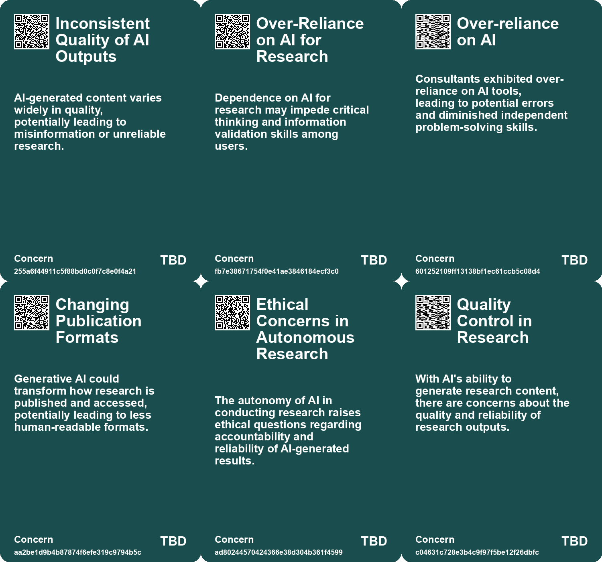
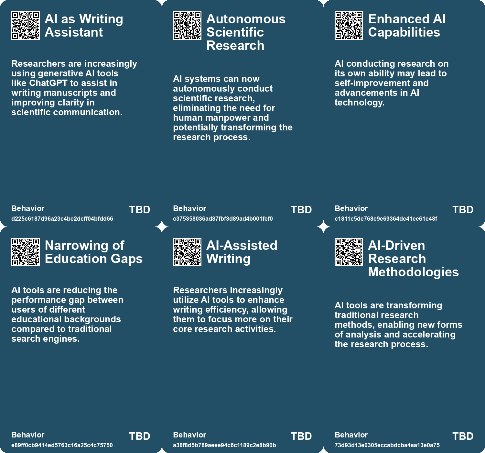
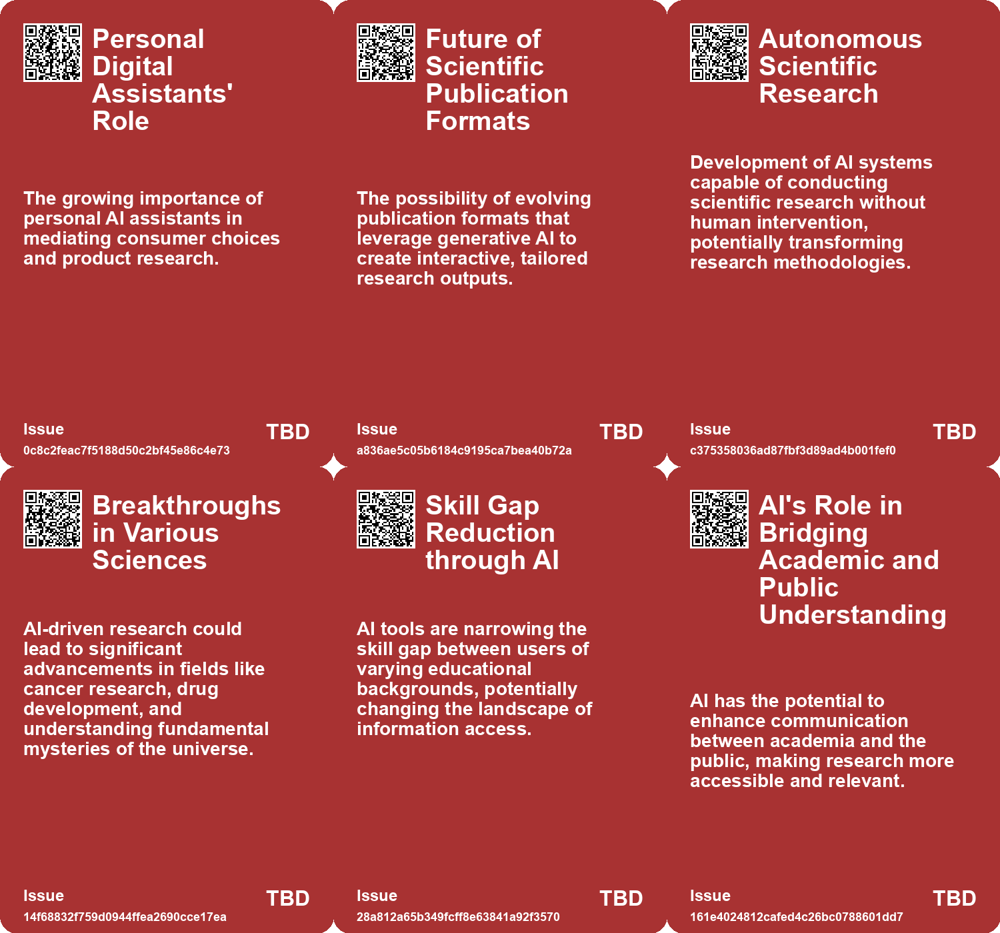
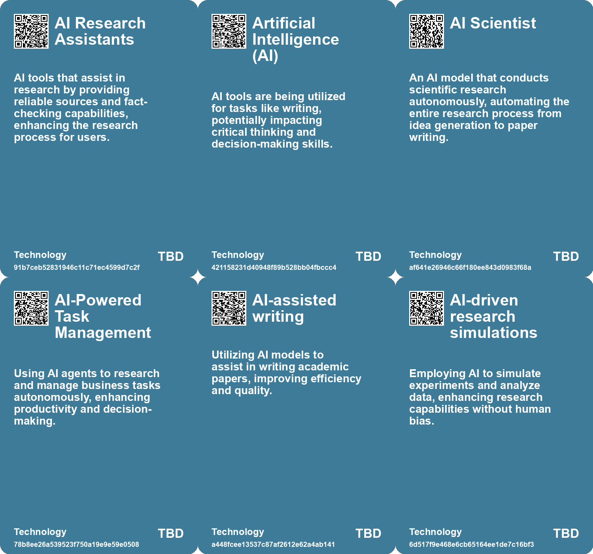

# *Topic*: AI-driven Research Assistance

# Summary

The integration of artificial intelligence (AI) into various sectors is reshaping productivity and job roles. In customer support, generative AI tools have shown a 14 percent increase in productivity, particularly aiding novice workers while experienced employees see minimal impact. This trend highlights AI's role in knowledge sharing and improving customer sentiment, suggesting a positive shift in workplace dynamics.

In the realm of teamwork, AI systems are being developed to enhance collaboration among human and robotic agents. These systems aim to improve communication in high-stakes environments, such as search-and-rescue missions and surgeries, by aligning the roles of different agents and preventing confusion. This underscores the importance of effective collaboration in achieving common goals.

AI's influence extends to consulting, where studies reveal that AI assistance boosts productivity and quality in tasks suited to its capabilities. However, reliance on AI can lead to errors in areas where human judgment is crucial. This duality of AI as both a tool for enhancement and a potential crutch is evident across various fields, including legal analysis, where AI improves speed but not necessarily quality.

The impact of AI on human behavior is also significant. In consulting, AI-assisted groups outperformed their non-AI counterparts but exhibited a tendency to over-rely on technology, raising concerns about complacency and skill degradation. This phenomenon is echoed in the academic realm, where AI tools are transforming research processes but may also lead to cognitive offloading, diminishing critical thinking and curiosity.

The job market is undergoing a transformation as AI automates tasks, particularly in sectors like supply chain management and marketing. Professionals are evolving into strategic roles that leverage AI for efficiency while maintaining essential human skills such as empathy and ethical reasoning. This shift necessitates a reevaluation of job responsibilities and the integration of AI into workflows.

Governments are also adapting to the AI landscape, implementing reforms to enhance productivity and efficiency. AI technologies are being utilized to streamline processes and detect fraud, exemplified by the IRS's modernization efforts. However, challenges remain in scaling AI applications and addressing the talent shortage in the public sector.

The ethical implications of AI are increasingly under scrutiny, particularly in military applications. The rise of lethal autonomous weapons has sparked debates about the morality of machines making life-and-death decisions. The United Nations is considering regulations to govern the use of such technologies, highlighting the urgent need for a framework to ensure accountability and safety in AI deployment.

As AI continues to evolve, its potential to revolutionize industries is matched by the necessity for responsible integration. The balance between leveraging AI for efficiency and maintaining human oversight is critical in navigating the future landscape of work and society.

# Seeds

|    | name                                        | description                                                                        | change                                                                                      | 10-year                                                                                                   | driving-force                                                                                                  |
|---:|:--------------------------------------------|:-----------------------------------------------------------------------------------|:--------------------------------------------------------------------------------------------|:----------------------------------------------------------------------------------------------------------|:---------------------------------------------------------------------------------------------------------------|
|  0 | AI as Research Assistant                    | Incorporating AI tools for research and writing processes.                         | Shifting from traditional methods of research to AI-assisted methods.                       | AI will become a standard tool in research workflows, enhancing efficiency and accuracy.                  | The need for faster information processing and improved research quality in academic and professional fields.  |
|  1 | Increased Speed in Legal Analysis           | AI assistance significantly reduces time taken for legal tasks among students.     | From slower, traditional legal analysis to faster, AI-assisted analysis.                    | Legal analysis may be predominantly AI-assisted, leading to faster case resolutions.                      | Demand for efficiency and cost reduction in legal services drives AI adoption.                                 |
|  2 | AI Scientist Development                    | An AI system that can autonomously conduct scientific research has been developed. | Shift from human-led research to AI-driven scientific inquiry.                              | In 10 years, AI could dominate scientific research, reshaping academic structures and methodologies.      | The need for cost-effective and efficient research processes is driving the development of autonomous systems. |
|  3 | Potential Breakthroughs in Science          | AI-driven research could lead to significant scientific breakthroughs.             | From slow, human-led discoveries to rapid AI-driven advancements in various fields.         | Accelerated discoveries in critical fields like cancer research and climate change solutions.             | The capability of AI to process vast data sets and generate insights quickly.                                  |
|  4 | AI in Research Methodology                  | AI tools are changing how researchers conduct experiments and analyze data.        | Evolution of research methods to include AI-driven analysis and hypothesis generation.      | Research will increasingly rely on AI for data analysis, potentially leading to new methodologies.        | The need for more efficient and effective research processes.                                                  |
|  5 | Bridging Academia and Public Understanding  | AI could help translate academic research for public consumption.                  | From isolated academic findings to accessible public knowledge through AI.                  | There will be a more informed public engagement with research due to AI simplification.                   | Desire to make academic research relevant and understandable to broader audiences.                             |
|  6 | Autonomous AI Research                      | AI systems may begin conducting research independently.                            | Shift from human-led research to AI-led research initiatives.                               | Research discoveries could increasingly originate from AI, altering the research landscape.               | Advancements in AI capabilities allowing for independent research tasks.                                       |
|  7 | AI-Assisted Team Coordination               | Development of AI assistants that enhance communication and coordination in teams. | Shift from traditional teamwork methods to AI-supported collaboration.                      | AI will seamlessly integrate into teams, improving efficiency and reducing misunderstandings.             | The increasing complexity of tasks requiring precise coordination among team members.                          |
|  8 | Generative AI in Public Sector              | Emergence of generative AI tools to assist government employees in various tasks.  | Moving from manual processes to generative AI applications for quick information retrieval. | Generative AI could significantly enhance decision-making and operational efficiency in government roles. | The demand for increased productivity and reduced operational burdens is a key motivator.                      |
|  9 | Emergence of Autonomous Research Assistants | Development of chatbot systems to automate Q&A for understanding research papers.  | Shift from manual reading and comprehension to automated assistance in research.            | In 10 years, researchers may rely heavily on AI for instant insights from papers.                         | The increasing volume of published research and the need for efficient information processing.                 |

# Concerns

|    | name                                    | description                                                                                                                          |
|---:|:----------------------------------------|:-------------------------------------------------------------------------------------------------------------------------------------|
|  0 | Inconsistent Quality of AI Outputs      | AI-generated content varies widely in quality, potentially leading to misinformation or unreliable research.                         |
|  1 | Over-Reliance on AI for Research        | Dependence on AI for research may impede critical thinking and information validation skills among users.                            |
|  2 | Over-reliance on AI                     | Consultants exhibited over-reliance on AI tools, leading to potential errors and diminished independent problem-solving skills.      |
|  3 | Changing Publication Formats            | Generative AI could transform how research is published and accessed, potentially leading to less human-readable formats.            |
|  4 | Ethical Concerns in Autonomous Research | The autonomy of AI in conducting research raises ethical questions regarding accountability and reliability of AI-generated results. |
|  5 | Quality Control in Research             | With AI's ability to generate research content, there are concerns about the quality and reliability of research outputs.            |
|  6 | Autonomous Research Conducted by AI     | AIs could autonomously conduct scientific research, raising questions about oversight and accountability.                            |
|  7 | Scalability Issues                      | Scaling AI assistance effectively in diverse environments and teams may present unforeseen challenges and complications.             |
|  8 | Loss of Human Expertise                 | As AI tools become more prevalent, there is a risk that human expertise in research digesting may diminish over time.                |
|  9 | Ethical Concerns of AI in Research      | The use of AI tools raises ethical questions regarding authorship, intellectual property, and the role of human researchers.         |

# Cards

## Concerns

## Behaviors

## Issue

## Technology

# Links

* [Exploring an Autonomous Dual-Chatbot System for Efficient Research Paper Understanding](https://futures.kghosh.me/3f2d71fd29e59b34cde2af2dd3222940)
* [MIT Study Challenges AI Job Displacement Fears with Economic Viability Insights](https://futures.kghosh.me/89ee61cc0d9fa77ecb1eb4100622a53f)
* [The Impact of Generative AI and Autonomous Agents on Business Value Creation and Trust Issues](https://futures.kghosh.me/15d4ec180189ca1739398f516844cefb)
* [The Flexibility of Human Self-Orientation vs. AI Limitations in Dynamic Environments](https://futures.kghosh.me/d9411983cedc4ea97632f2e8a3c2c090)
* [The Rise of Lethal Autonomous Weapons: Ethical and Regulatory Challenges in Modern Warfare](https://futures.kghosh.me/7f25552b9124a4dc3833e782ef331275)
* [Leveraging AI in Research and Reading: Tools and Strategies for Better Focus](https://futures.kghosh.me/6df3d0c8a3ae4a2bfce8d9c3750faad8)
* [The Transformative Impact of AI on Academic Research and Its Future Challenges](https://futures.kghosh.me/04ea36e5447d3914bd8e463d50f2715f)
* [The Shift to AI-Mediated Interactions: Implications for Businesses and APIs](https://futures.kghosh.me/416560fac9bedd69aa678761b51406a2)
* [Generative AI's Impact on Scientific Writing: Opportunities and Concerns](https://futures.kghosh.me/60f3a64993d5e355561c59e5d641bec9)
* [Global Government Reforms: Advancements in Efficiency through Digital Transformation and AI](https://futures.kghosh.me/3f295c6c0c9af1ecd24bfa22b6ef6b47)
* [The Shift from SEO to AI: Enhancing User Experience and Information Retrieval](https://futures.kghosh.me/b109d3163c90428c0a67504bd2878adf)
* [Exploring AI's Impact on Legal Analysis: Insights from a Randomized Trial](https://futures.kghosh.me/4f3697c8144f776170502c3036e1d6f3)
* [Overview of the Closed Agentic AI Research Grant Program and Its Objectives](https://futures.kghosh.me/b394787c467cb4f7f164c975923bc874)
* [Exploring AI's Effect on Cognitive Skills and Learning Processes](https://futures.kghosh.me/950253f15955ca7be1cb2ebf244d0939)
* [The Impact of AI on Human Performance: A Study on Complacency and Skill Reduction](https://futures.kghosh.me/82d675e881c727c6bf2f35d6a78e72f6)
* [The AI Scientist: A Revolutionary Autonomous AI for Scientific Research](https://futures.kghosh.me/3607a211a5ceadc4c9c4f86cd5fcd2df)
* [Navigating the Challenges and Opportunities of Generative AI in Business](https://futures.kghosh.me/6a8633d1148eb442435b9f6bca735ad3)
* [Examining the Effects of AI on Knowledge Worker Performance: A Study with Boston Consulting Group](https://futures.kghosh.me/c63bd059cb529b72b00ecbdcd2f85268)
* [The Transformative Role of Generative AI in Supply Chain and Marketing Management](https://futures.kghosh.me/1b46caa07ff58af58c2e1cf51b86402d)
* [The Rise of Autonomous Agents: Opportunities and Challenges Ahead](https://futures.kghosh.me/0e336ce2e4b07459b257407e90d27389)
* [Recent Developments in AI Regulation and Technology: A Review of Key Initiatives and Critiques](https://futures.kghosh.me/a009ccdffaa59f53de56887aa19e6239)
* [MIT Researchers Develop AI Assistant to Enhance Teamwork in Critical Missions](https://futures.kghosh.me/d35cc2611e8b6e8e143446ca4ee22e19)
* [Understanding AI's Role: Challenges and Strategies for Effective Use in Diagnosis and Beyond](https://futures.kghosh.me/7fa4f08e57477f5ca2e9ba7a725a9934)