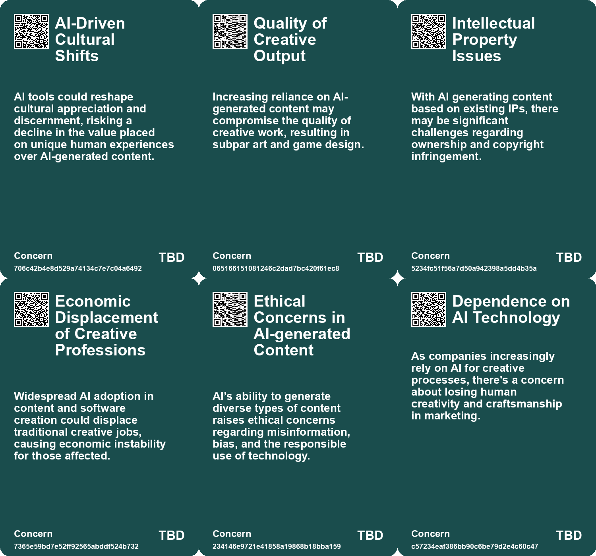
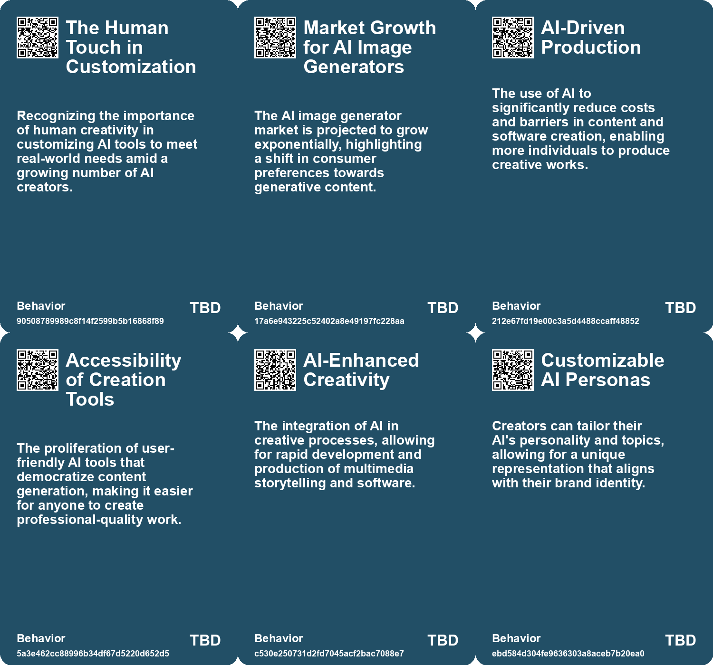
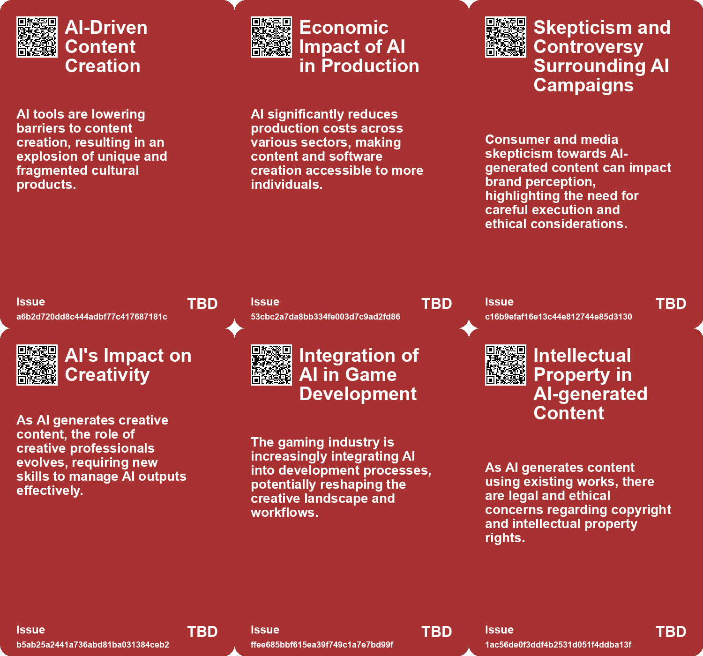
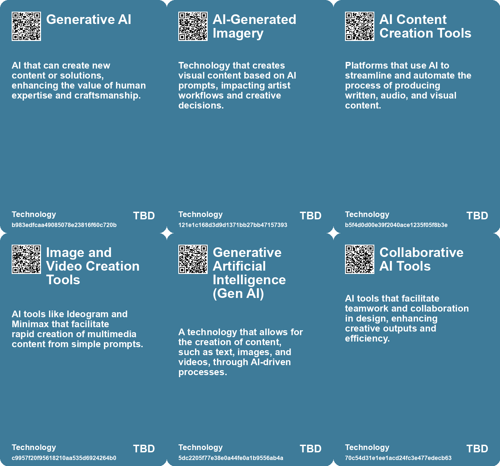

# *Topic*: AI in Creative Content

# Summary

The rise of generative artificial intelligence (GenAI) is reshaping creativity across various fields, particularly in writing and visual arts. Research indicates that GenAI can enhance creativity, with studies showing that writers using AI-generated ideas produce stories that are better received than those created without assistance. However, this reliance on AI may lead to a homogenization of creative outputs, as stories generated with AI show similarities to each other and the initial prompts. This raises concerns about the potential loss of individual voice and originality in creative work.

In the visual arts, tools like Midjourney and DALL·E are transforming content creation, posing challenges to traditional stock photography markets. The rapid adoption of generative AI is evident, with a significant portion of the U.S. population now utilizing these technologies. While the stock photography market is expected to grow, the AI image generator market is projected to explode, indicating a shift in how visual content is produced and consumed. This disruption has led to anxiety among artists and creative professionals, who fear job displacement and the ethical implications of AI-generated content.

The impact of AI extends to the job market, particularly in industries like copywriting and video game development. Copywriters are experiencing a dual reality where AI can enhance their work but also threatens their job security. Many are finding new roles in refining AI-generated content, while others struggle to find employment as AI takes over traditional writing tasks. In the gaming industry, artists and developers express frustration over AI's encroachment on their roles, fearing that reliance on AI for efficiency will undermine the creative process and lead to layoffs.

As AI tools become more integrated into workplaces, the need for individuals to adapt and develop new skills is paramount. Business schools are responding by incorporating AI into their curriculums, emphasizing the importance of technology skills alongside traditional education. The concept of "out skills," which enhance human capabilities through intelligent assistants, is gaining traction as professionals seek to leverage AI for competitive advantage.

The ethical implications of AI in creative fields are increasingly scrutinized. The U.S. Copyright Office has ruled that AI-generated art cannot be copyrighted, raising questions about ownership and the rights of creators. As AI continues to democratize content production, concerns about the exploitation of artists' work without consent are becoming more pronounced. The need for a new framework that addresses data rights and consent is critical to ensure that artists maintain control over their creations.

Generative AI is also contributing to the fragmentation of culture, as it enables a vast array of content production that can dilute traditional forms of media. The internet has already disrupted media distribution, and AI is now revolutionizing content creation, leading to a splintering of popular culture. This trend highlights the importance of preserving human authenticity and creativity in a landscape increasingly dominated by automated processes.

Finally, the relationship between AI and cognitive skills is a growing concern. While AI tools can enhance productivity, there is a risk of cognitive offloading, where reliance on technology may weaken mental abilities and diminish curiosity. The challenge lies in finding a balance between leveraging AI's capabilities and nurturing human creativity and critical thinking. As the landscape of work continues to evolve, the interplay between AI and human skills will shape the future of various industries.

# Seeds

|    | name                                        | description                                                                                             | change                                                                                            | 10-year                                                                                                        | driving-force                                                                                                    |
|---:|:--------------------------------------------|:--------------------------------------------------------------------------------------------------------|:--------------------------------------------------------------------------------------------------|:---------------------------------------------------------------------------------------------------------------|:-----------------------------------------------------------------------------------------------------------------|
|  0 | AI as a Perspective Shifter                 | AI's potential to reshape human perception and creativity.                                              | Transition from viewing AI as a threat to recognizing its capacity for inspiration and new ideas. | In the future, AI will be seen as a tool for creative exploration and innovative thinking.                     | A growing curiosity and desire for deeper understanding fuels this shift in perception.                          |
|  1 | AI Tools for Content Creation               | AI significantly reduces the time and cost to create content.                                           | Transition from traditional content creation methods to AI-driven production.                     | Content creation could become as ubiquitous as social media sharing, empowering more creators.                 | The democratization of content creation through accessible AI tools.                                             |
|  2 | Explosive Growth of AI-Generated Content    | The proliferation of AI-generated content is overwhelming traditional content ecosystems.               | From limited, professionally curated content to an abundance of AI-generated material.            | The ability to filter and curate quality content will become a critical skill for consumers.                   | AI's capability to produce vast amounts of creative output at low cost.                                          |
|  3 | Consumer Trend Towards DIY Content Creation | Individuals are increasingly creating personal media content using AI tools.                            | Shift from professional-only content production to widespread DIY creation.                       | Every user might become a content creator, changing marketing and engagement strategies.                       | AI's accessibility makes it easy for anyone to create and share media.                                           |
|  4 | GenAI's Role in Enhancing Creativity        | Generative AI is being used to augment human creativity, especially in creative writing.                | Transition from traditional creativity methods to AI-assisted creativity.                         | In ten years, GenAI may be a standard tool for writers and artists, fundamentally changing creative processes. | The demand for innovative and diverse creative output in a competitive landscape.                                |
|  5 | GenAI's Role in Enhancing Creativity        | Generative AI is being used to augment human creativity, especially in creative writing.                | Transition from traditional creativity methods to AI-assisted creativity.                         | In ten years, GenAI may be a standard tool for writers and artists, fundamentally changing creative processes. | The demand for innovative and diverse creative output in a competitive landscape.                                |
|  6 | AI-Driven Image Creation                    | AI is increasingly being used to create and manipulate images.                                          | Shift from traditional art forms to AI-generated images and art.                                  | Art and creativity could be dominated by AI, changing how we perceive art.                                     | The rapid advancement of AI technology and its integration into creative fields.                                 |
|  7 | Customized AI Interactions                  | Creators can tailor AI responses based on personal content and preferences.                             | Transition from generic AI interactions to personalized and context-aware dialogues.              | Ten years from now, AI interactions may become highly personalized and contextually relevant for each user.    | The need for more engaging and relevant online interactions in a crowded digital space.                          |
|  8 | Generative AI as Infinite Entertainment     | Generative AI enables limitless content creation, transforming entertainment into an infinite resource. | Shift from finite, creator-driven content to infinite, algorithmically generated media.           | Content will be indistinguishable from original works, redefining ownership and creativity in entertainment.   | Advancements in AI technology and data manipulation will drive this change, creating new forms of entertainment. |
|  9 | Value of Human-Made Content                 | Emerging preference for human-created content over AI-generated outputs among brands.                   | Shift from prioritizing AI-generated content to valuing authenticity and craftsmanship.           | In 10 years, brands will emphasize human-made content to differentiate in a saturated market.                  | Desire for authenticity and connection in brand narratives amidst technological proliferation.                   |

# Concerns

|    | name                                          | description                                                                                                                                                |
|---:|:----------------------------------------------|:-----------------------------------------------------------------------------------------------------------------------------------------------------------|
|  0 | AI-Driven Cultural Shifts                     | AI tools could reshape cultural appreciation and discernment, risking a decline in the value placed on unique human experiences over AI-generated content. |
|  1 | Quality of Creative Output                    | Increasing reliance on AI-generated content may compromise the quality of creative work, resulting in subpar art and game design.                          |
|  2 | Intellectual Property Issues                  | With AI generating content based on existing IPs, there may be significant challenges regarding ownership and copyright infringement.                      |
|  3 | Economic Displacement of Creative Professions | Widespread AI adoption in content and software creation could displace traditional creative jobs, causing economic instability for those affected.         |
|  4 | Ethical Concerns in AI-generated Content      | AI’s ability to generate diverse types of content raises ethical concerns regarding misinformation, bias, and the responsible use of technology.           |
|  5 | Dependence on AI Technology                   | As companies increasingly rely on AI for creative processes, there's a concern about losing human creativity and craftsmanship in marketing.               |
|  6 | Loss of Human Element in Branding             | As AI generates content, there's a risk of losing the authentic human touch in marketing and branding efforts.                                             |
|  7 | Autonomy of AI in Creative Processes          | The increasing reliance on AI for creative tasks may undermine the quality and originality of game production and diminish human artistic contribution.    |
|  8 | Impact on the Creative Workforce              | As AI tools automate content creation, traditional creative roles may be threatened, leading to job displacement in the arts.                              |
|  9 | Quality of Content                            | With the influx of AI-generated content, there may be a decline in the quality and uniqueness of artistic expression.                                      |

# Cards

## Concerns

## Behaviors

## Issue

## Technology

# Links

* [Exploring the Age of Infinite Entertainment and the Impact of Generative AI on Art](https://futures.kghosh.me/63f1bb42da49c95b95587a4e15740fcb)
* [The Impact of Generative AI on Human Creativity in Story Writing](https://futures.kghosh.me/de55bd2afb2b9bfadae84d2a0fb8b4e8)
* [U.S. Copyright Office Denies Copyright for A.I.-Generated Art Due to Lack of Human Authorship](https://futures.kghosh.me/fc78d6a757326382f385c8b5504ad6f9)
* [Exploring the Risks of Homogeneity in AI Generated Content and Its Impact on Creativity](https://futures.kghosh.me/9f228766187c6c10eeddbda5a6dbbe7b)
* [The Impact of Generative AI on Creative Professions and the Need for New Data Rights Frameworks](https://futures.kghosh.me/858dac884c8fe7dfa6fc0c2cf093e97f)
* [Exploring the Balance Between AI Efficiency and Human Creativity in Design](https://futures.kghosh.me/92ae644db3cc8e4d0fb262bac8413f8b)
* [Meta Launches AI Studio for Personalized AI Interactions on Instagram and the Web](https://futures.kghosh.me/d279f6fcd07339dc6675ad90b2e49c94)
* [Reflecting on AI's Impact: Skills, Augmentation, and Perspective During Summer's Calm](https://futures.kghosh.me/cdd939bfdbc53b3ed60a5fea370f9df6)
* [Reflections on AI: Balancing Human Essence and Technological Advancement as the Year Ends](https://futures.kghosh.me/67e5f63a5ea04ad81ae4e5ef192811be)
* [Navigating the Challenges and Opportunities of Generative AI in Business](https://futures.kghosh.me/6a8633d1148eb442435b9f6bca735ad3)
* [The Impact of AI on Job Security and Creativity in the Video Game Industry](https://futures.kghosh.me/f9e48d7ccb7479cb60051af41b429584)
* [The Impact of AI on Job Security and Creativity in the Video Game Industry](https://futures.kghosh.me/4cd2b3c6bcef9d6cec7022f18a40ebdb)
* [UK Government Consultation on Copyright and AI: Balancing Rights and Innovation](https://futures.kghosh.me/032b82c62a531e1bc83bf8f2ef4deaff)
* [The Impact of Generative AI on Traditional Stock Photography and Licensing Markets](https://futures.kghosh.me/966eddc4698e68b47bc5a9c33fe2afbd)
* [Silicon Valley AI Firms Recruit Poets to Enhance Generative Models Amid Creative Challenges](https://futures.kghosh.me/072d8f78f332ffec057b30c3fe9dee6d)
* [AI's Role in Fragmenting Culture and Software: A New Era of Creation](https://futures.kghosh.me/c25f207450d56b52443cc95f158d4138)
* [Exploring AI's Effect on Cognitive Skills and Learning Processes](https://futures.kghosh.me/950253f15955ca7be1cb2ebf244d0939)
* [The Integration of AI in Business School Curriculums to Enhance Graduate Competitiveness](https://futures.kghosh.me/bc232b227c806ac26adf2b99fa4cff9d)
* [Coca-Cola's Pioneering Journey with Generative AI in Marketing Campaigns](https://futures.kghosh.me/3d916d077334a1ce71d60e0186891709)
* [AI's Disruptive Presence in the Video Game Industry: Personal Experiences and Concerns](https://futures.kghosh.me/07654b65aaa32bbf290cfde69ddf3253)
* [The Impact of Generative AI on Human Creativity in Story Writing](https://futures.kghosh.me/e2006a4269f097491cc98583df08a47d)
* [The Rise of Augmented Humans: Embracing AI in a Transformative Era](https://futures.kghosh.me/a8f2b9b3c07bd0f1d91784ff8b5ee5fc)
* [The Impact of Generative AI and Autonomous Agents on Business Value Creation and Trust Issues](https://futures.kghosh.me/15d4ec180189ca1739398f516844cefb)
* [Thriving in an AI Era: Embracing, Adapting, and Complementing Technology](https://futures.kghosh.me/23a3410059759ba4214235628d4ebd4b)
* [The Impact of AI Imaging on Art, Creativity, and Human Connection](https://futures.kghosh.me/de89ae90257007a4fbb1a5c7a7dc82a5)
* [The Transformative Role of Generative AI in Supply Chain and Marketing Management](https://futures.kghosh.me/1b46caa07ff58af58c2e1cf51b86402d)