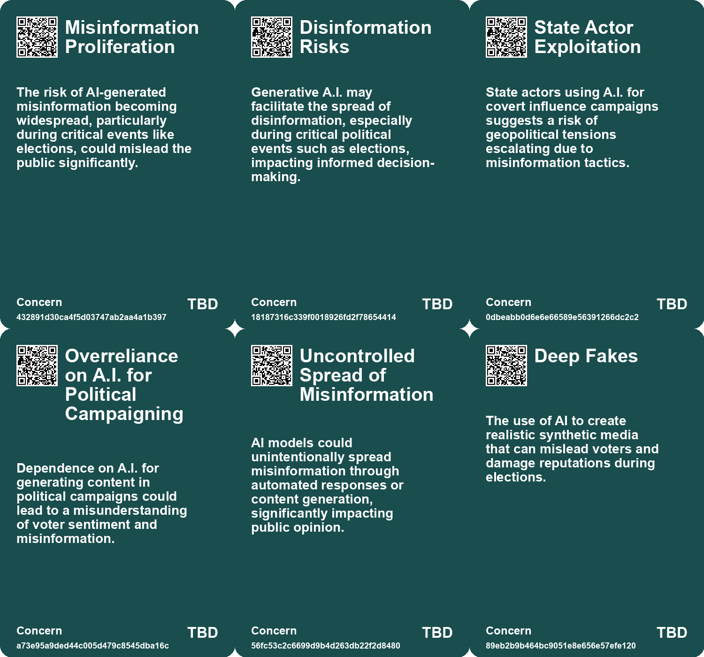
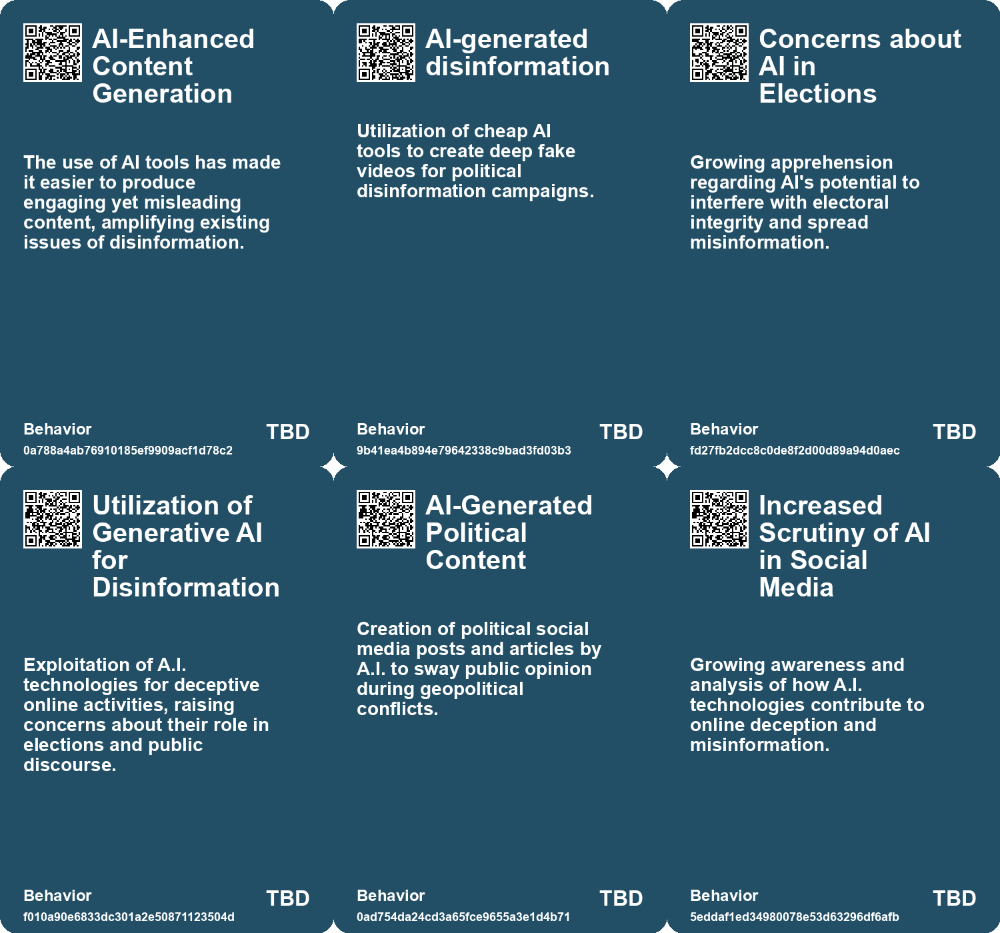
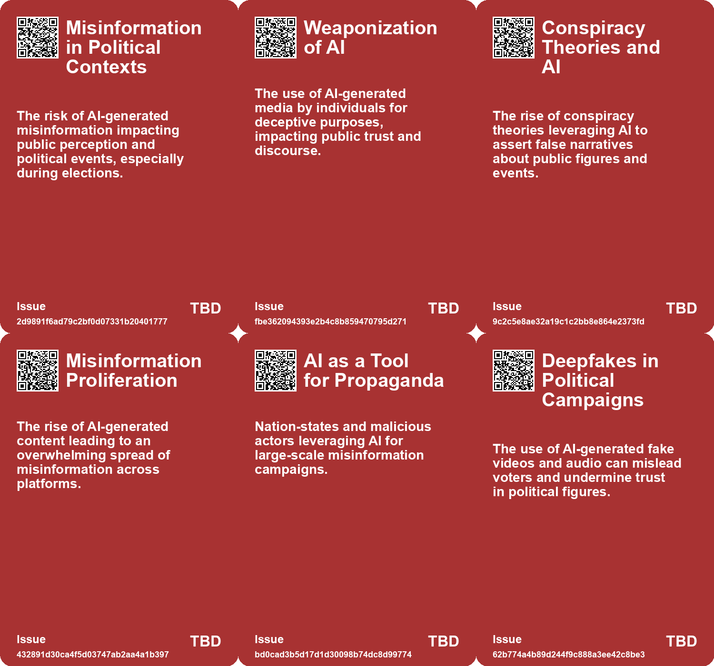
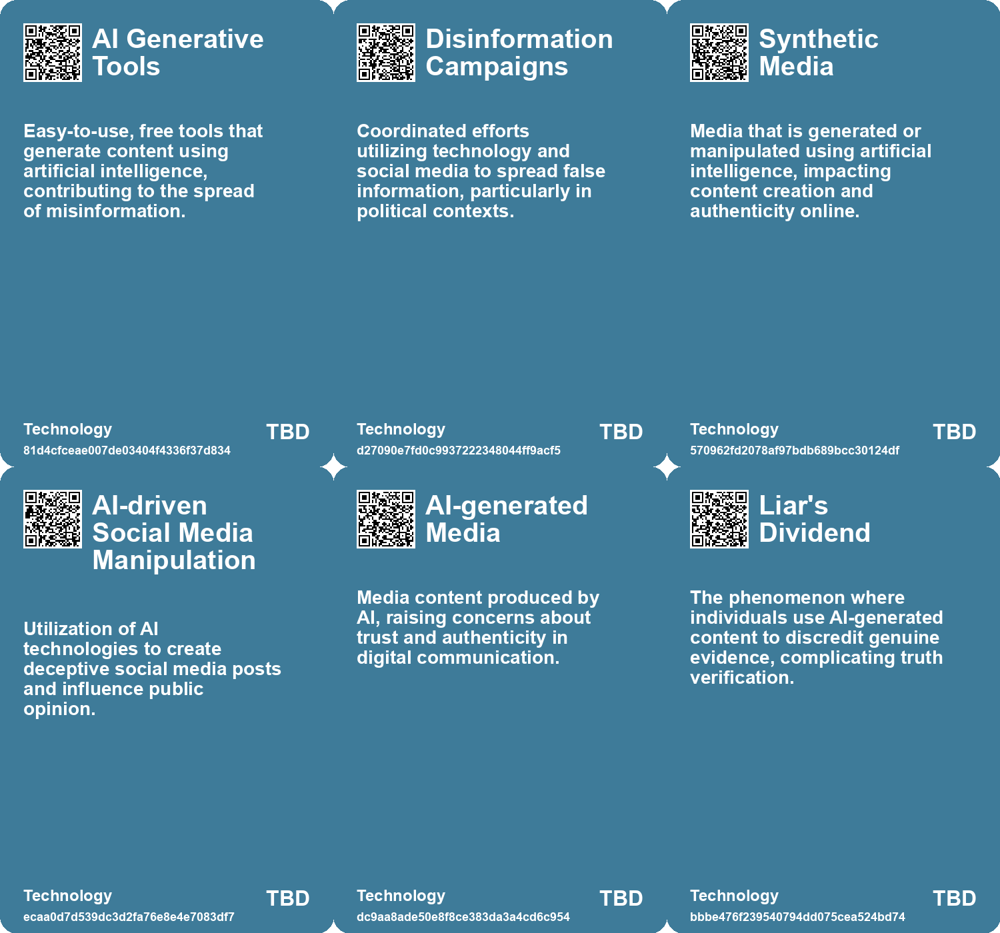

# *Topic*: AI-Induced Misinformation in Politics

# Summary

The intersection of artificial intelligence (AI) and politics is increasingly fraught with challenges, particularly as the 2024 election approaches. Concerns about the integrity of elections are rising, with AI tools being used to create deep fakes and manipulate voter behavior. OpenAI has reported that its technologies were exploited in online campaigns aimed at influencing public opinion across various countries, including Russia, China, and Iran. This highlights the potential for AI to be weaponized in geopolitical contexts.

In Bangladesh, pro-government outlets are utilizing cheap AI tools to produce deep fakes and spread disinformation against opposition parties. This coordinated effort underscores the intertwining of authoritarianism and disinformation, as the ruling party seeks to control public perception through social media. The situation is exacerbated by a lack of free speech and stringent laws that silence dissent.

The UK faces similar challenges, with generative AI posing risks to the electoral process. The creation of personalized communications and deep fakes raises the need for a clear code of conduct for political actors. Experts emphasize the importance of transparency and education to combat the potential for disinformation and manipulation.

In the United States, extremist groups are leveraging AI to spread hate speech and recruit members. Reports indicate that these groups are using AI-generated content to advance their agendas, raising alarms about the speed and scale of their operations. The use of AI in this context poses significant risks to social cohesion and democratic values.

The rise of synthetic media is another pressing concern. A Europol report warns that by 2026, a significant portion of online content could be artificially generated, leading to increased opportunities for misinformation. This trend is compounded by a growing skepticism towards digital media, as the public grapples with the authenticity of information in an era of deep fakes and AI-generated content.

The potential for AI to disrupt traditional polling methods is also being explored. Harvard experts suggest that AI simulations could replace unreliable polling practices, although concerns about the misuse of these technologies remain. The implications for democracy are profound, as the accuracy and integrity of voter sentiment become increasingly difficult to ascertain.

Finally, the ethical implications of AI technologies are under scrutiny. Critics argue that the rapid deployment of AI systems without adequate safeguards can lead to harmful consequences, including biased outcomes and environmental impacts. The call for regulation and transparency in AI development is growing louder, as society seeks to navigate the complexities of this evolving landscape.

# Seeds

|    | name                                                  | description                                                                                        | change                                                                                            | 10-year                                                                                                                | driving-force                                                                                          |
|---:|:------------------------------------------------------|:---------------------------------------------------------------------------------------------------|:--------------------------------------------------------------------------------------------------|:-----------------------------------------------------------------------------------------------------------------------|:-------------------------------------------------------------------------------------------------------|
|  0 | Generative A.I. and Online Disinformation             | Concerns about the role of generative A.I. in spreading disinformation during elections.           | Change from traditional media influence to digital A.I.-generated disinformation.                 | In a decade, A.I. may play a dominant role in shaping electoral narratives and public opinion.                         | The convergence of technology and politics during critical electoral periods.                          |
|  1 | Misinformation Overload                               | The rise of AI-generated content leads to an overwhelming volume of misinformation.                | Shift from occasional misinformation to a pervasive ocean of false information.                   | Society may struggle to discern truth in a landscape dominated by AI-generated misinformation.                         | The ease of producing large volumes of content using AI tools encourages the spread of misinformation. |
|  2 | AI as a Tool for Propaganda                           | Nation-states leverage AI to create vast amounts of misleading content.                            | Shift from traditional misinformation to automated and sophisticated propaganda techniques.       | The landscape of information warfare may evolve, increasing the sophistication of misinformation campaigns.            | The strategic advantage gained from using AI to amplify propaganda efforts.                            |
|  3 | Public Demand for Transparency in AI-Driven Campaigns | Growing public awareness and demand for transparency in AI's role in political messaging.          | From opaque political communication to a demand for transparency in AI-generated content.         | Voters will expect detailed disclosures on AI usage in political messaging, influencing campaign strategies.           | Public distrust in unregulated tech use in politics pushes for clearer communication.                  |
|  4 | AI-driven Hacktivism                                  | Iranian hackers using AI to spread propaganda and misinformation through deepfake technology.      | Shift from traditional hacking to sophisticated AI-driven misinformation campaigns.               | Widespread use of AI in cyber warfare, blurring lines between reality and deepfakes in media.                          | Increased geopolitical tensions and desire for influence in global narratives.                         |
|  5 | AI's Role in Election Outcomes                        | AI might significantly influence election outcomes, overshadowing traditional political discourse. | From candidate policies determining election results to AI effectiveness playing a central role.  | Elections may be won or lost based on AI capabilities rather than candidate ideals or policies.                        | The competitive nature of political campaigns requiring innovative tools for voter engagement.         |
|  6 | Concerns Over AI Misuse in Elections                  | Broader concerns exist regarding AI's role in elections, including disinformation.                 | From traditional polling methods to AI tools that could potentially mislead voters.               | AI's role in elections could raise ethical and trust issues in democratic processes.                                   | The impact of technology on political transparency and voter manipulation.                             |
|  7 | AI-generated Political Manipulation                   | AI tools are being used to impersonate political figures in robocalls.                             | Shift from traditional campaigning to the use of AI-generated propaganda in politics.             | In ten years, AI-generated content could dominate political discourse, making it harder to discern truth from fiction. | Advancements in AI voice cloning technology and its accessibility to the public.                       |
|  8 | Election Misinformation Threat                        | The rise of AI-generated misinformation poses a significant risk during elections.                 | Change from traditional misinformation methods to sophisticated AI-generated audio and deepfakes. | Future elections may see widespread AI-generated misinformation, complicating voter trust.                             | The urgent need for effective safeguards against emerging technologies in political contexts.          |
|  9 | Public Preparedness for AI Misinformation             | Authorities and the public are underprepared for AI-generated misinformation.                      | Shift from reliance on traditional verification methods to the need for advanced detection tools. | In a decade, society may develop new literacy skills to navigate AI-generated content effectively.                     | Growing recognition of the impact of synthetic media on public perception and democracy.               |

# Concerns

|    | name                                           | description                                                                                                                                                     |
|---:|:-----------------------------------------------|:----------------------------------------------------------------------------------------------------------------------------------------------------------------|
|  0 | AI promoting disinformation                    | The potential for AI to generate misleading or false information at scale, affecting public discourse.                                                          |
|  1 | Misinformation Proliferation                   | The risk of AI-generated misinformation becoming widespread, particularly during critical events like elections, could mislead the public significantly.        |
|  2 | Disinformation Risks                           | Generative A.I. may facilitate the spread of disinformation, especially during critical political events such as elections, impacting informed decision-making. |
|  3 | State Actor Exploitation                       | State actors using A.I. for covert influence campaigns suggests a risk of geopolitical tensions escalating due to misinformation tactics.                       |
|  4 | Overreliance on A.I. for Political Campaigning | Dependence on A.I. for generating content in political campaigns could lead to a misunderstanding of voter sentiment and misinformation.                        |
|  5 | Deep Fakes                                     | The use of AI to create realistic synthetic media that can mislead voters and damage reputations during elections.                                              |
|  6 | AI Hallucination                               | AI's tendency to generate false information can lead to misinformation spreading rapidly, affecting public perception and democracy.                            |
|  7 | AI's Role in Electoral Interference            | AI technology could be leveraged to disrupt democratic processes, such as influencing elections through misinformation campaigns.                               |
|  8 | Lack of Truthfulness in Messaging              | AI may generate misleading or false content without the ability to verify accuracy, compromising informed voter decisions.                                      |
|  9 | Misinformation and Disinformation              | AI-generated audio can be used to disseminate false information, potentially leading to widespread misinformation during elections.                             |

# Cards

## Concerns

## Behaviors

## Issue

## Technology

# Links

* [Rethinking the Role of AI: From Political Tool to Ethical Design Options](https://futures.kghosh.me/c25cae2b8d72e7634d591247d9ac96d2)
* [Addressing Threats to Democracy: Strategies for Resilience Against Misinformation and Manipulation](https://futures.kghosh.me/56d1a28746cd95ebaa3d62a4e1f91c3a)
* [The Dual-edged Sword of AI: Misinformation and Societal Threats in the Age of Advanced Language Models](https://futures.kghosh.me/9787333cafcd0252d71a9bff845ad093)
* [Bangladesh's Disinformation Campaign: The Role of AI and Deep Fakes in Elections](https://futures.kghosh.me/299ee0a175c6ba617e28713566f23557)
* [Harvard Scholars Advocate for AI in Political Polling Amid Declining Human Engagement](https://futures.kghosh.me/1e5947176c3712200aba7c2dfb0db020)
* [Exploring the Right's Embrace of AI-Generated Art and Its Ideological Implications](https://futures.kghosh.me/d9eabadabb28c2a17d6808d33314e808)
* [OpenAI CEO Highlights AI Risks to Election Integrity and Calls for Regulation](https://futures.kghosh.me/fd96f58595786b0820cca21394223a66)
* [The Impact of Supersharers on Vaccine Hesitancy and Fake News Spread on Social Media](https://futures.kghosh.me/091c0c86efbac50bd1354fbc72324198)
* [The Threat of Authoritarian Intelligence: A Call for Responsible AI Development](https://futures.kghosh.me/0ba4fa557cd2aae4760bd7a2abca844e)
* [Extremists in the US Exploit AI Tools for Hate Speech and Recruitment Efforts](https://futures.kghosh.me/922dd73d3cd60450863808b908f314d8)
* [The Risks of AI Manipulation in Political Campaigns: A Vision of 'Clogocracy'](https://futures.kghosh.me/3958ff20e8489240e2461aa8d0eee7b5)
* [Exploring the Rise of 'Deep Doubt' Amidst AI-Generated Media Content](https://futures.kghosh.me/97be17298986599d68a1642e4359d6d5)
* [Exploring AI's Effect on Cognitive Skills and Learning Processes](https://futures.kghosh.me/950253f15955ca7be1cb2ebf244d0939)
* [AI's Impact on Society: Job Displacement and the Need for Retraining](https://futures.kghosh.me/cf119665e47c7434e3e3c54dbbc585e3)
* [The Security Risks of Rapid AI Integration: A Call for Caution and Awareness](https://futures.kghosh.me/b30a4282af9e53ca673438a8223d9525)
* [Addressing Generative AI Threats in the Upcoming UK General Election](https://futures.kghosh.me/9bcd0e8850a5de2296f414bfeeff7567)
* [Exploring the Current Landscape of AI Regulation Bills in the U.S. Congress](https://futures.kghosh.me/9bd7db184480046848916908461b3e31)
* [Concerns Rise Over AI-Generated Political Misinformation Ahead of 2024 Elections](https://futures.kghosh.me/d73462d47098506eb9aa6c2b8cc180fb)
* [The Rising Threat of Generative AI in Extremist Propaganda and Child Exploitation](https://futures.kghosh.me/4aae935ffedd7227301fe1eb6647d69f)
* [Shifting Perspectives: The Growing Skepticism Towards AI and Its Implications](https://futures.kghosh.me/29c7deb9342372a5679806355c66d5e2)
* [The Role of AI in Erasing Democratic Processes: A Warning Against Technocracy](https://futures.kghosh.me/5def74b0ec9aa796e8b8d8f54b19e8a6)
* [Iranian Hackers Use Deepfake Technology to Alter Media Narrative on Israel-Hamas Conflict](https://futures.kghosh.me/25f3ff23280cd27f74b3b60e9168d657)
* [The Potential Impact of AI on Lobbying and Legislative Processes](https://futures.kghosh.me/c47825b39c3c52d3b664efa5201aca44)
* [Europol Report Warns of Rising AI-Generated Content and Disinformation Risks](https://futures.kghosh.me/8900fb75566c9d1b008c2e2c36f7a8e2)
* [OpenAI Discovers Abuse of Its AI Tools in Global Disinformation Campaigns by State Actors](https://futures.kghosh.me/038728d36aa4f09090b2d01ffe571ab4)