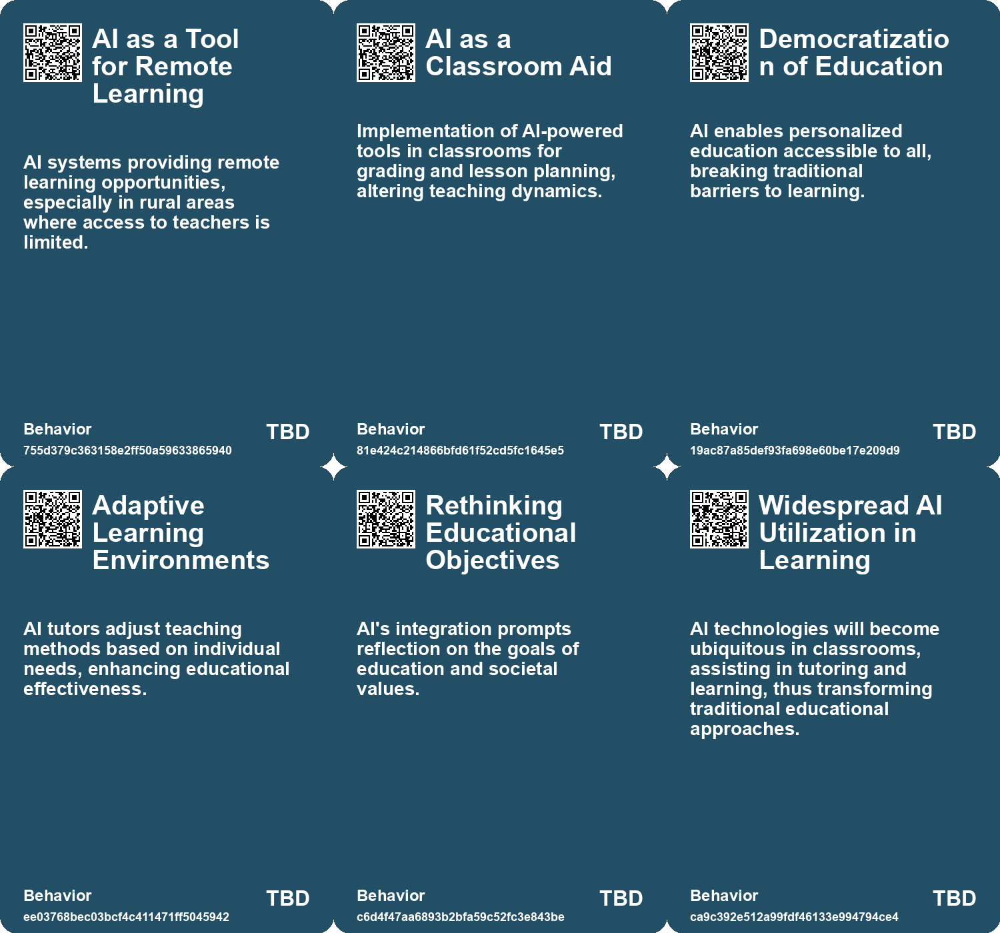
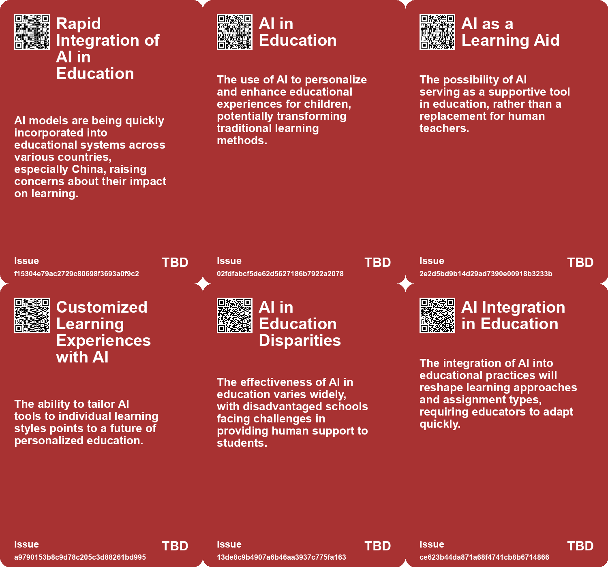
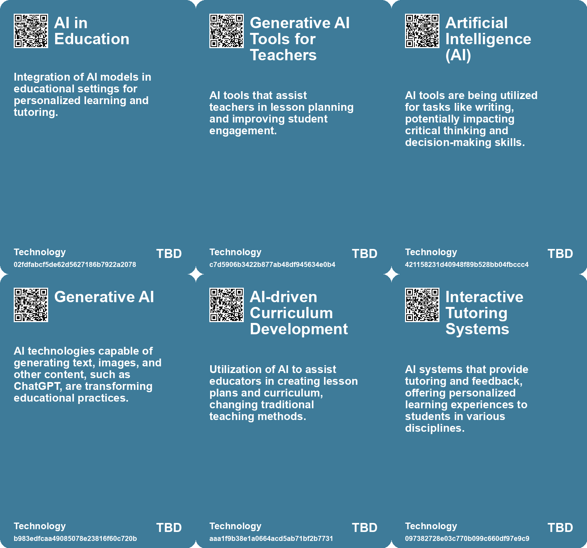

# *Topic*: AI in Education

# Summary

The integration of artificial intelligence (AI) into education is reshaping the landscape of learning, presenting both opportunities and challenges. AI has the potential to personalize education through tailored tutoring systems, enhancing student engagement and learning outcomes. Business schools are adapting their curricula to include AI, preparing graduates for a job market that increasingly values technological proficiency. However, there is a growing concern that reliance on AI tools may lead to a decline in critical thinking and cognitive skills among students.

The rise of AI has sparked fears of academic dishonesty, with students using tools like ChatGPT to bypass traditional learning methods. This has led educators to rethink conventional assignments and explore innovative pedagogical approaches. While some view AI as a threat to the integrity of education, others argue it can enhance learning experiences by providing personalized support and freeing up teachers for more meaningful interactions.

The emergence of social-emotional AI raises ethical questions about the depersonalization of education and mental health support. As affluent individuals access personalized services, there is a risk that marginalized groups may rely solely on AI for emotional assistance, exacerbating existing inequalities. The challenge lies in balancing AI integration with the need for human interaction to ensure equitable access to care.

AI's impact on the humanities is also significant, as it transforms teaching and research methodologies. Educators are urged to adapt to AI's capabilities while maintaining core educational values. The potential for AI to enhance creativity and knowledge is tempered by concerns that it may enable students to disengage from deep intellectual work.

The rapid advancement of AI technology presents both opportunities for innovation and risks of disruption. As AI tools become more prevalent, there is a pressing need for clear policies governing their use in educational settings. The potential for AI to support the United Nations Sustainable Development Goals highlights its role in addressing global challenges, but disparities in access and funding remain significant obstacles.

In higher education, institutions are grappling with the implications of AI on teaching and learning. The introduction of AI chatbots as teaching assistants reflects a shift towards more personalized education, yet it raises questions about the effectiveness and reliability of such tools. As universities navigate these changes, the focus must remain on fostering genuine engagement with the human experience.

The future of AI in education is uncertain, with ongoing debates about its long-term effects on learning and society. While AI has the potential to revolutionize education, careful consideration of its ethical implications and the need for human oversight is essential to harness its benefits effectively.

# Seeds

|    | name                                              | description                                                                               | change                                                                                                 | 10-year                                                                                                             | driving-force                                                                                                 |
|---:|:--------------------------------------------------|:------------------------------------------------------------------------------------------|:-------------------------------------------------------------------------------------------------------|:--------------------------------------------------------------------------------------------------------------------|:--------------------------------------------------------------------------------------------------------------|
|  0 | AI-enhanced learning                              | The integration of AI in educational settings for personalized learning experiences.      | Shift from traditional, one-size-fits-all education to personalized, AI-driven learning methods.       | In 10 years, education could be highly personalized, with AI tutors adapting to each child's unique learning style. | The desire for tailored educational experiences that cater to individual needs and preferences.               |
|  1 | AI as a co-pilot in education                     | AI acting as a personalized assistant in the learning process.                            | Shift from traditional teacher-led instruction to collaborative learning with AI support.              | In 10 years, AI could be a standard part of the educational experience, complementing human teachers.               | The increasing sophistication and user-friendliness of AI technologies.                                       |
|  2 | AI as an Emerging Skill in Education              | AI usage is being recognized as a crucial emerging skill in business education.           | Shift from traditional skill sets to integrating AI as a core competency.                              | AI literacy may become a fundamental requirement for all business graduates.                                        | The increasing importance of AI in various business functions and decision-making processes.                  |
|  3 | Education Evolution                               | AI's role in intellectual tasks may necessitate rethinking education approaches.          | From traditional education models to ones that promote critical thinking and creativity.               | Education systems may evolve to emphasize emotional intelligence and creative skills.                               | The need to prepare future generations for a world where AI handles routine thinking.                         |
|  4 | Social-Emotional AI in Education                  | AI is now being integrated into educational systems to assist with emotional connections. | Shift from human-led emotional support in education to AI-assisted emotional and educational guidance. | Ten years from now, AI will play a central role in educational emotional support, with varying accessibility.       | The increasing need for personalized education and support, especially in under-resourced areas.              |
|  5 | Shift in Educational Philosophy                   | A reevaluation of educational goals amidst AI integration.                                | From a focus on rote learning to skills for success in an AI-driven world.                             | Education will prioritize skills like critical thinking and adaptability to prepare for AI-centric futures.         | The recognition of AI's influence on future job markets and required competencies.                            |
|  6 | Improvement of AI Technologies                    | Continuous improvement of AI models for better educational support.                       | From error-prone AI applications to more accurate and reliable educational tools.                      | AI technologies will evolve to provide seamless and accurate educational assistance.                                | The commitment to enhancing learning outcomes through advanced technology drives improvements.                |
|  7 | AI as a Learning Assistant                        | AI models are being integrated as tutors for personalized student engagement.             | The role of AI in education is transitioning from supplementary to essential in personalized learning. | In the future, AI will be a commonplace tutor in classrooms, enhancing student interaction and understanding.       | The need for scalable, effective educational support drives the integration of AI into learning environments. |
|  8 | Emergence of AI-Powered Educational Tools         | Development of tools leveraging AI to enhance educational content delivery.               | The educational landscape is being transformed by AI-powered tools that enhance learning experiences.  | AI-powered tools will be commonplace, providing tailored educational experiences and resources for students.        | The rapid advancement of AI technology is driving the creation of innovative educational tools.               |
|  9 | Human-Machine Symbiosis in Medicine and Education | AI will revolutionize sectors like healthcare and education through collaboration.        | From traditional methodologies to integrated AI-assisted approaches.                                   | Healthcare and education will become more personalized and efficient with AI.                                       | The push for improved outcomes and accessibility in critical sectors.                                         |

# Concerns

|    | name                                    | description                                                                                                                                              |
|---:|:----------------------------------------|:---------------------------------------------------------------------------------------------------------------------------------------------------------|
|  0 | Impact on Education                     | AI's role in education may hinder the development of essential skills despite improving immediate outcomes, affecting future learning.                   |
|  1 | Normalization of Academic Dishonesty    | AI's presence in education may normalize cheating and academic dishonesty, further undermining the integrity of educational institutions.                |
|  2 | Teacher Dependency on AI                | Educators may become overly reliant on AI for lesson planning and curriculum development, reducing their engagement with students and critical pedagogy. |
|  3 | Access Disparity                        | AI tools may exacerbate educational inequalities, benefiting students in affluent environments while disadvantaging those in underfunded schools.        |
|  4 | Inadequate Teacher Training             | Teachers may lack sufficient training on effective AI integration in the classroom, impacting educational outcomes.                                      |
|  5 | Education System Adaptation             | There is a risk of over-dependence on AI affecting intellectual development, necessitating changes in the education system.                              |
|  6 | Changes in Teaching Methods Needed      | The rise of AI in education necessitates significant adjustments in teaching methods and curricular focus, posing risks to traditional pedagogy.         |
|  7 | Impact on Student Teacher Relationships | AI acting as a learning companion may alter the traditional dynamics between students and teachers, affecting mentorship.                                |
|  8 | Future of Education and Learning        | Educational systems may need to evolve to incorporate AI and digital tools for learning, creating new challenges and opportunities.                      |
|  9 | Loss of Teacher Roles                   | The introduction of AI tutors could lead to a reduced need for human teachers, impacting job security in education.                                      |

# Cards

## Concerns

## Behaviors

## Issue

## Technology

# Links

* [Understanding AI: Definitions, Implications, and the Need for Literacy in Technology](https://futures.kghosh.me/45d0e20c84c31176fa084646d8d045b4)
* [The Rapid Evolution of AI: Impacts on Work, Truth, and Education](https://futures.kghosh.me/3aaa975f44b2a607ef191978083cf2b8)
* [The Role of AI in Transforming Higher Education and Humanities](https://futures.kghosh.me/5245185ec1ba7c6c5eff97ba092efe80)
* [Preparing for the Homework Apocalypse: AI's Impact on Education and Assignments](https://futures.kghosh.me/233c5bf90c64ceefb0cde33233c3fe6e)
* [Revolutionizing Education: The Role of AI Tutors in Personalized Learning](https://futures.kghosh.me/8f4d495f94113bef7aed043ebceafebb)
* [Exploring the Future: How AI Will Transform Our Lives by 2041](https://futures.kghosh.me/1621aeb7941f2df0feefc2de14851249)
* [AI's Impact on Society: Job Displacement and the Need for Retraining](https://futures.kghosh.me/cf119665e47c7434e3e3c54dbbc585e3)
* [The Disruption of Education by AI: An Intellectual Crisis](https://futures.kghosh.me/9457c5541dba02968735056f18b53dc3)
* [Thriving in an AI Era: Embracing, Adapting, and Complementing Technology](https://futures.kghosh.me/23a3410059759ba4214235628d4ebd4b)
* [The Quest for AGI: Current AI Capabilities and Future Implications](https://futures.kghosh.me/eef4f83910b733e34ce5d57218a46d32)
* [The Transformative Impact of AI on Academic Research and Its Future Challenges](https://futures.kghosh.me/04ea36e5447d3914bd8e463d50f2715f)
* [Harnessing AI for Social Good: Opportunities and Challenges in Achieving the UN SDGs](https://futures.kghosh.me/0d88d49818819d335d12f792275fde97)
* [The Impact of AI in Chinese Education: Promise and Concerns](https://futures.kghosh.me/5374f9d1b84138f1c928c0e7fd727877)
* [The Impact of AI Imaging on Art, Creativity, and Human Connection](https://futures.kghosh.me/de89ae90257007a4fbb1a5c7a7dc82a5)
* [The Transformative Potential of AI: Revolutionizing Education, Healthcare, and Global Equity](https://futures.kghosh.me/2449c2fc4b8afc7e268db4987fa821e5)
* [The Transformative Impact of AI on Humanities Education and Its Challenges](https://futures.kghosh.me/72aad99b3b502b39304cbe2302a55141)
* [The Transformative Potential of AI: Revolutionizing Education, Healthcare, and Global Equity](https://futures.kghosh.me/8acafe1fbe51c2de3cd689956b25b39f)
* [AI's Potential to Enhance Human Evolution and Self-Actualization](https://futures.kghosh.me/8893f2e58b95e1993a5f8a1af090eedd)
* [The Transformative Impact of AI on Productivity and Entrepreneurship in 2023](https://futures.kghosh.me/a40580730388900810b4496ff9891dc9)
* [OpenAI's Ambitious Plans to Integrate AI Chatbots into Online Education](https://futures.kghosh.me/d3038dab94883cba191b52ecdb37245b)
* [Exploring AI's Effect on Cognitive Skills and Learning Processes](https://futures.kghosh.me/950253f15955ca7be1cb2ebf244d0939)
* [Exploring the Transformative Impact of AI on Education and Children's Learning Experiences](https://futures.kghosh.me/adf886a1b9fd74281e0a43c3e7c70def)
* [The Role of Social-Emotional AI: Bridging or Widening the Gap in Human Connection?](https://futures.kghosh.me/8e191b6221caa8d9f27b19268ab8a048)
* [Exploring AI's Implications: Insights from a Discussion in New Zealand on Artificial Intelligence and Society](https://futures.kghosh.me/7bdbb32950c9d265f6ec455d964973fe)
* [The Quest for AGI: Current AI Capabilities and Future Implications](https://futures.kghosh.me/77c5c92357a7aeff1c388c1eb79b7259)
* [The Integration of AI in Business School Curriculums to Enhance Graduate Competitiveness](https://futures.kghosh.me/bc232b227c806ac26adf2b99fa4cff9d)
* [Harvard Introduces AI Chatbot as Teaching Assistant for CS50 Course](https://futures.kghosh.me/e2cc63d7622564eb4cb5af13e8b2669c)
* [AI's Impact on Education: Adaptation, Challenges, and Opportunities for Learning](https://futures.kghosh.me/ea74b217d36ec570bb432fb5aa679090)