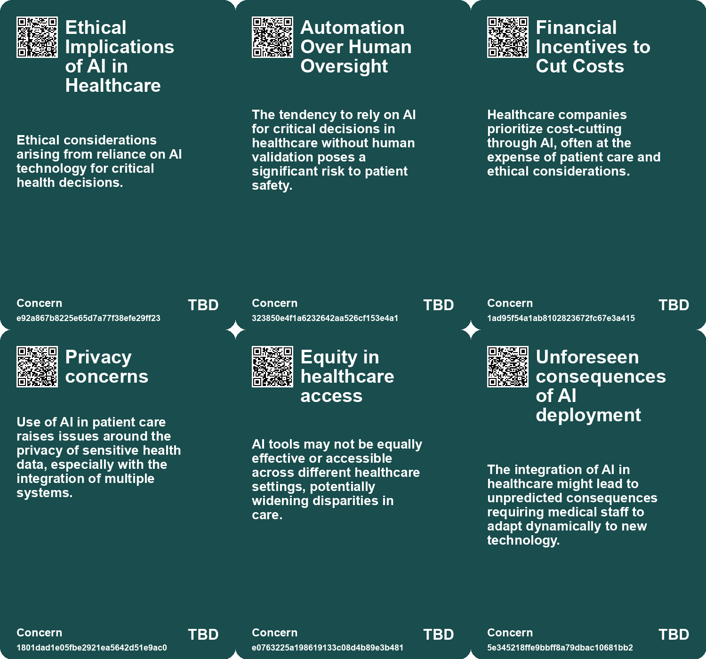
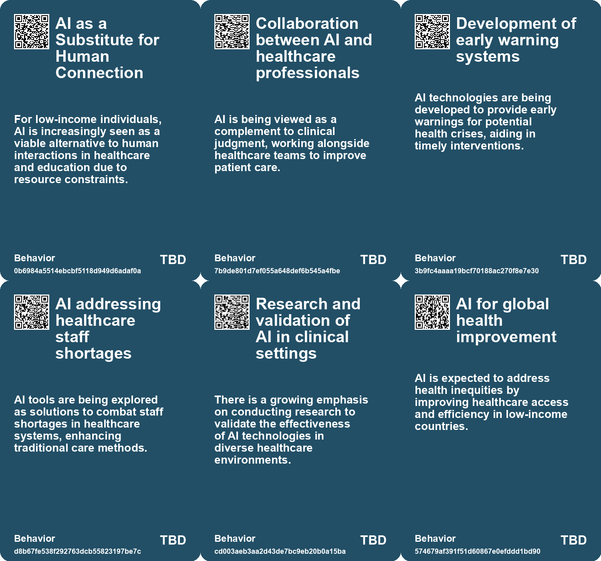
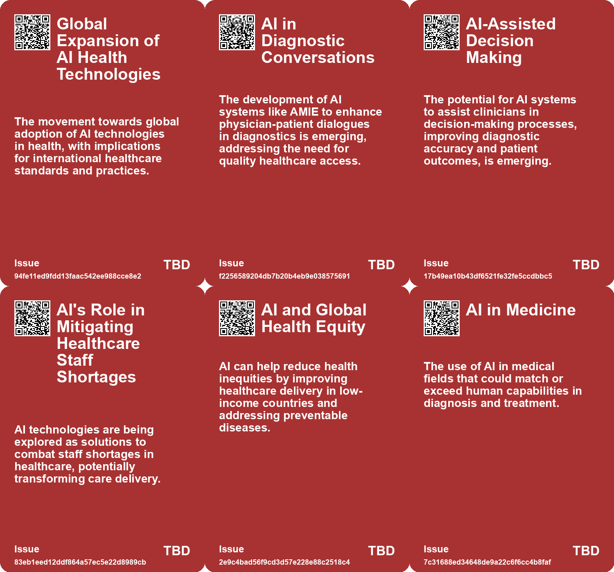
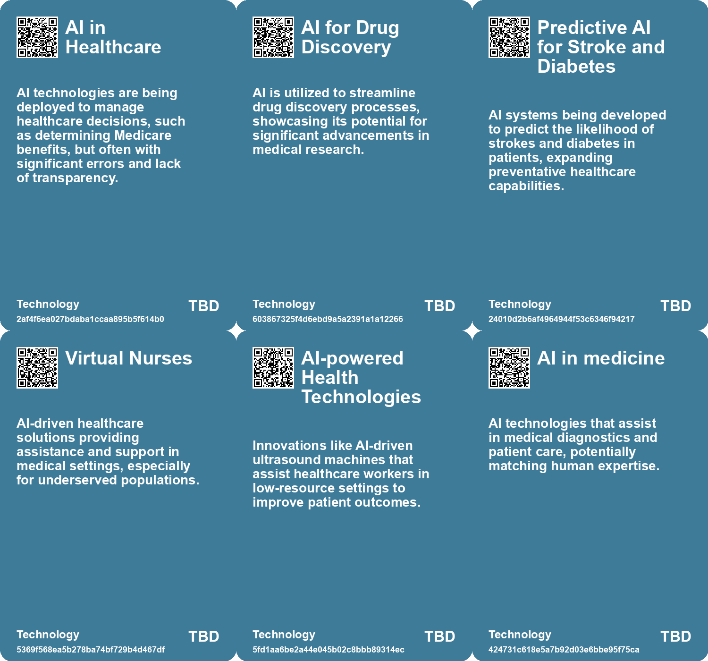

# *Topic*: AI in Healthcare

# Summary

The integration of artificial intelligence (AI) into various sectors is reshaping industries, but it also raises significant ethical and practical concerns. In healthcare, the use of AI has shown promise, such as the AI-based early warning system Chartwatch, which reduced unexpected deaths by 26% in a Canadian study. However, the implementation of flawed AI systems, like those used by UnitedHealthcare, has led to serious errors in patient care, highlighting the need for better regulation and oversight.

In education and mental health, social-emotional AI applications are emerging to support students and patients. While these tools can provide assistance, they risk exacerbating inequalities, as wealthier individuals access personalized human services while others rely on AI. The challenge lies in balancing AI's benefits with the necessity of human interaction to ensure equitable care.

AI's role in diagnostics is also expanding. The NHS is evaluating an AI system that enhances CT scans to identify hidden cardiac risks, potentially saving thousands of lives. Similarly, the PRISM trial at UC Davis Health aims to improve mammogram accuracy through AI, emphasizing collaboration between AI and healthcare professionals rather than replacement.

The potential of AI extends beyond healthcare. Business schools are adapting their curricula to include AI, preparing graduates for a job market increasingly focused on technology skills. However, there is a need to maintain a broader understanding of AI's implications for the future of work. In customer support, generative AI has been shown to boost productivity, particularly for less experienced workers, while also improving customer sentiment.

Despite the advancements, challenges remain. A study comparing physician responses to ChatGPT found that AI could enhance healthcare delivery, but it also highlighted the burden on doctors from increasing electronic patient messages. The integration of AI into workflows requires a shift in mindset, treating AI as a collaborative tool rather than a directive one.

The economic implications of AI are significant, particularly in the job market. While AI has the potential to automate tasks, research indicates that only a fraction of jobs involving computer vision are currently viable for automation. This suggests a gradual integration of AI, with a focus on creating new job categories rather than outright displacement.

Concerns about cognitive skills are also prevalent. The reliance on AI tools like ChatGPT may lead to cognitive offloading, where individuals become less engaged in deep learning. This raises questions about the long-term effects of AI on curiosity and mental strength.

As AI continues to evolve, it presents both opportunities and challenges. The potential for AI to enhance productivity and creativity is tempered by the need for ethical considerations and equitable access. Addressing these issues will be crucial as society navigates the complexities of an AI-driven future.

# Seeds

|    | name                                               | description                                                                                         | change                                                                                                 | 10-year                                                                                                              | driving-force                                                                                            |
|---:|:---------------------------------------------------|:----------------------------------------------------------------------------------------------------|:-------------------------------------------------------------------------------------------------------|:---------------------------------------------------------------------------------------------------------------------|:---------------------------------------------------------------------------------------------------------|
|  0 | Dependence on AI Over Human Judgment               | Healthcare providers are increasingly mandated to rely on AI decisions over their own expertise.    | From human-centric care to an over-reliance on AI algorithms for critical decisions.                   | Healthcare may become impersonal, with patients treated as data points rather than individuals.                      | The desire to streamline processes and reduce labor costs.                                               |
|  1 | Integration of AI in Cardiovascular Medicine       | AI systems are being integrated into standard medical practices for heart health assessment.        | Transitioning from traditional diagnostic methods to AI-enhanced imaging and analysis.                 | Standard practice will include AI tools, improving early detection and treatment of heart conditions.                | Desire for more accurate diagnostics and better patient outcomes.                                        |
|  2 | AI Shaping Treatment Decisions                     | AI analysis influences clinical decisions on patient treatments significantly.                      | From clinical intuition to data-driven decision-making in patient care.                                | Treatment protocols will be increasingly personalized based on predictive analytics from AI.                         | The need for evidence-based treatment plans to improve patient outcomes.                                 |
|  3 | AI in Diagnostic Conversations                     | AI systems like AMIE are being developed for diagnostic dialogues in healthcare.                    | Transitioning from traditional clinician-patient interactions to AI-assisted diagnostic conversations. | AI systems could become standard partners in clinical consultations, enhancing diagnostic accuracy and patient care. | The need for increased availability and accessibility of healthcare expertise globally.                  |
|  4 | Integration of AI in Clinical Teams                | AI is increasingly seen as a team member enhancing clinical care rather than replacing human roles. | Change from traditional medical practices to AI-supported care teams in hospitals.                     | Healthcare systems may become more efficient and patient outcomes better due to AI integration in care teams.        | The push for better patient care amidst rising healthcare challenges and staff shortages.                |
|  5 | AI's Role in Addressing Healthcare Staff Shortages | AI technology is viewed as a potential solution to combat staff shortages in healthcare settings.   | Transition from human-only care to hybrid models incorporating AI support.                             | Healthcare systems may operate more efficiently, with AI alleviating some pressures of staff shortages.              | The ongoing challenge of maintaining healthcare quality with limited staff resources.                    |
|  6 | AI in Healthcare                                   | AI can improve productivity of healthcare workers and help in triaging patients.                    | Shift from traditional healthcare practices to AI-driven solutions in underserved regions.             | AI-driven healthcare solutions will bridge the gap in medical access for impoverished communities.                   | The need to reduce healthcare inequities and improve medical access for the poor.                        |
|  7 | Human-Machine Symbiosis in Medicine and Education  | AI will revolutionize sectors like healthcare and education through collaboration.                  | From traditional methodologies to integrated AI-assisted approaches.                                   | Healthcare and education will become more personalized and efficient with AI.                                        | The push for improved outcomes and accessibility in critical sectors.                                    |
|  8 | AI in Healthcare                                   | AI can improve productivity of healthcare workers and help in triaging patients.                    | Shift from traditional healthcare practices to AI-driven solutions in underserved regions.             | AI-driven healthcare solutions will bridge the gap in medical access for impoverished communities.                   | The need to reduce healthcare inequities and improve medical access for the poor.                        |
|  9 | AI in Clinical Training                            | AI tools could be used to train healthcare professionals in patient-centered communication.         | Transition from traditional training methods to AI-assisted training programs in medical education.    | Medical training could evolve to include AI simulations, enhancing communication skills among healthcare providers.  | There is a growing emphasis on improving communication skills in healthcare for better patient outcomes. |

# Concerns

|    | name                                     | description                                                                                                                                |
|---:|:-----------------------------------------|:-------------------------------------------------------------------------------------------------------------------------------------------|
|  0 | Ethical Implications of AI in Healthcare | Ethical considerations arising from reliance on AI technology for critical health decisions.                                               |
|  1 | Automation Over Human Oversight          | The tendency to rely on AI for critical decisions in healthcare without human validation poses a significant risk to patient safety.       |
|  2 | Financial Incentives to Cut Costs        | Healthcare companies prioritize cost-cutting through AI, often at the expense of patient care and ethical considerations.                  |
|  3 | Privacy concerns                         | Use of AI in patient care raises issues around the privacy of sensitive health data, especially with the integration of multiple systems.  |
|  4 | Equity in healthcare access              | AI tools may not be equally effective or accessible across different healthcare settings, potentially widening disparities in care.        |
|  5 | Unforeseen consequences of AI deployment | The integration of AI in healthcare might lead to unpredicted consequences requiring medical staff to adapt dynamically to new technology. |
|  6 | Ethical Concerns in AI in Medicine       | Relying on AI for medical decision-making raises questions about accountability and the quality of care.                                   |
|  7 | Dehumanization of Care Systems           | AI and scaling might further remove human touch from essential care systems, leading to less personalized and effective care.              |
|  8 | Potential for AI Bias                    | AI systems could perpetuate existing biases if not carefully managed, affecting decision-making in health and education.                   |
|  9 | Physician Burnout and Job Displacement   | AI could exacerbate physician burnout if not managed properly and might threaten jobs in healthcare.                                       |

# Cards

## Concerns

## Behaviors

## Issue

## Technology

# Links

* [Understanding AI: Definitions, Implications, and the Need for Literacy in Technology](https://futures.kghosh.me/45d0e20c84c31176fa084646d8d045b4)
* [MIT Study Challenges AI Job Displacement Fears with Economic Viability Insights](https://futures.kghosh.me/89ee61cc0d9fa77ecb1eb4100622a53f)
* [Exploring the Future: How AI Will Transform Our Lives by 2041](https://futures.kghosh.me/1621aeb7941f2df0feefc2de14851249)
* [Stability AI's CEO Predicts AI Will Disrupt Society More Than the Pandemic](https://futures.kghosh.me/283ff70c63aed09ef2b0613f6acc2eb9)
* [AI's Impact on Society: Job Displacement and the Need for Retraining](https://futures.kghosh.me/cf119665e47c7434e3e3c54dbbc585e3)
* [Thriving in an AI Era: Embracing, Adapting, and Complementing Technology](https://futures.kghosh.me/23a3410059759ba4214235628d4ebd4b)
* [AI Early Warning System Reduces Unexpected Hospital Deaths by 26% in Canadian Study](https://futures.kghosh.me/2626f231f7df229a68e93bd2a129f234)
* [The Impact of AI on Employee Workload and Burnout: A Global Study's Findings and Recommendations](https://futures.kghosh.me/24919a630ace2f95d7dc1ec6e455b419)
* [Harnessing AI for Social Good: Opportunities and Challenges in Achieving the UN SDGs](https://futures.kghosh.me/0d88d49818819d335d12f792275fde97)
* [The Transformative Potential of AI: Revolutionizing Education, Healthcare, and Global Equity](https://futures.kghosh.me/2449c2fc4b8afc7e268db4987fa821e5)
* [The Transformative Potential of AI: Revolutionizing Education, Healthcare, and Global Equity](https://futures.kghosh.me/8acafe1fbe51c2de3cd689956b25b39f)
* [Study Shows ChatGPT Excels Over Physicians in Patient Response Quality and Empathy](https://futures.kghosh.me/47d0fd7d569a766b50f66eba76cb5c4d)
* [AI's Potential to Enhance Human Evolution and Self-Actualization](https://futures.kghosh.me/8893f2e58b95e1993a5f8a1af090eedd)
* [The Transformative Impact of AI on Productivity and Entrepreneurship in 2023](https://futures.kghosh.me/a40580730388900810b4496ff9891dc9)
* [Exploring AI's Effect on Cognitive Skills and Learning Processes](https://futures.kghosh.me/950253f15955ca7be1cb2ebf244d0939)
* [The Role of Social-Emotional AI: Bridging or Widening the Gap in Human Connection?](https://futures.kghosh.me/8e191b6221caa8d9f27b19268ab8a048)
* [Reimagining Social Systems: The Role of AI in Enhancing Human Care and Management Consulting](https://futures.kghosh.me/58f70468586e816cc19aaf2bfbbf8f5b)
* [AMIE: Advancing AI in Diagnostic Medical Conversations and Reasoning](https://futures.kghosh.me/8f10466494e9d6129bcb5056ec54f24a)
* [AI System Aims to Predict Heart Attack Risks and Save Lives in the UK](https://futures.kghosh.me/dead7bfcd66251606f35ea6015f2447c)
* [The Dangers of AI Misuse in the U.S. Healthcare System and Its Impact on Elderly Care](https://futures.kghosh.me/5f91e2d433a76b5d40c649100da24318)
* [The Transformative Role of Generative AI in Supply Chain and Marketing Management](https://futures.kghosh.me/1b46caa07ff58af58c2e1cf51b86402d)
* [How AI Could Transform Work-Life Balance and Job Dynamics in Various Industries](https://futures.kghosh.me/bc5ff4c170f1f63b34eb7ca70775d8d7)
* [The Integration of AI in Business School Curriculums to Enhance Graduate Competitiveness](https://futures.kghosh.me/bc232b227c806ac26adf2b99fa4cff9d)
* [UC Davis Health Leads $16 Million Study on AI in Mammogram Interpretation for Breast Cancer Detection](https://futures.kghosh.me/846c0e3bad3cff41ac11609ecb907b14)
* [Understanding AI's Role: Challenges and Strategies for Effective Use in Diagnosis and Beyond](https://futures.kghosh.me/7fa4f08e57477f5ca2e9ba7a725a9934)