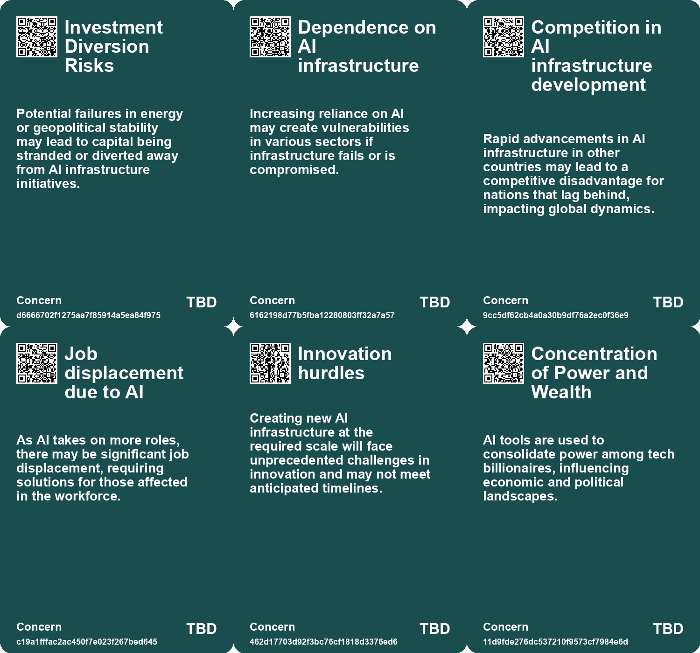
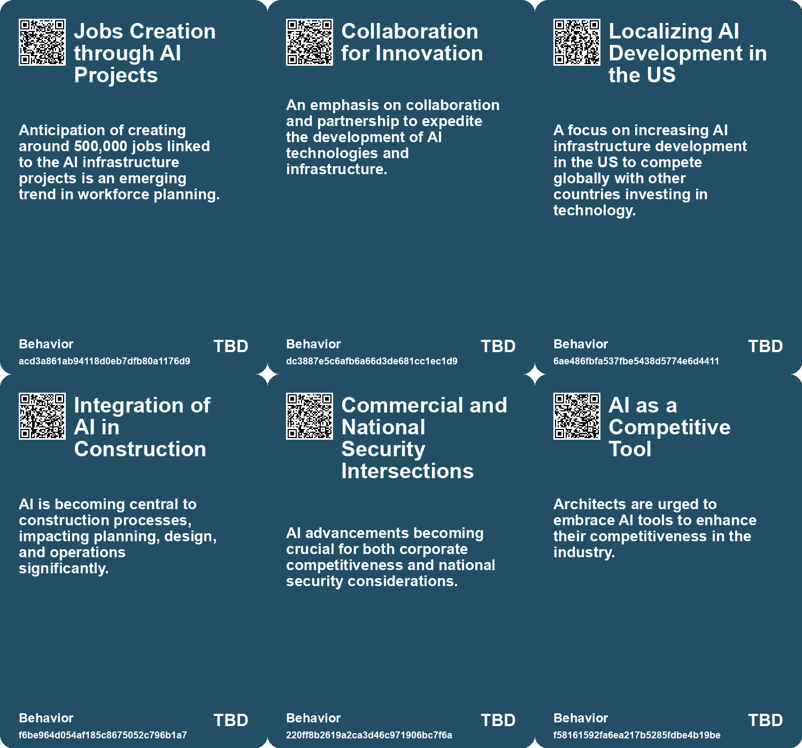
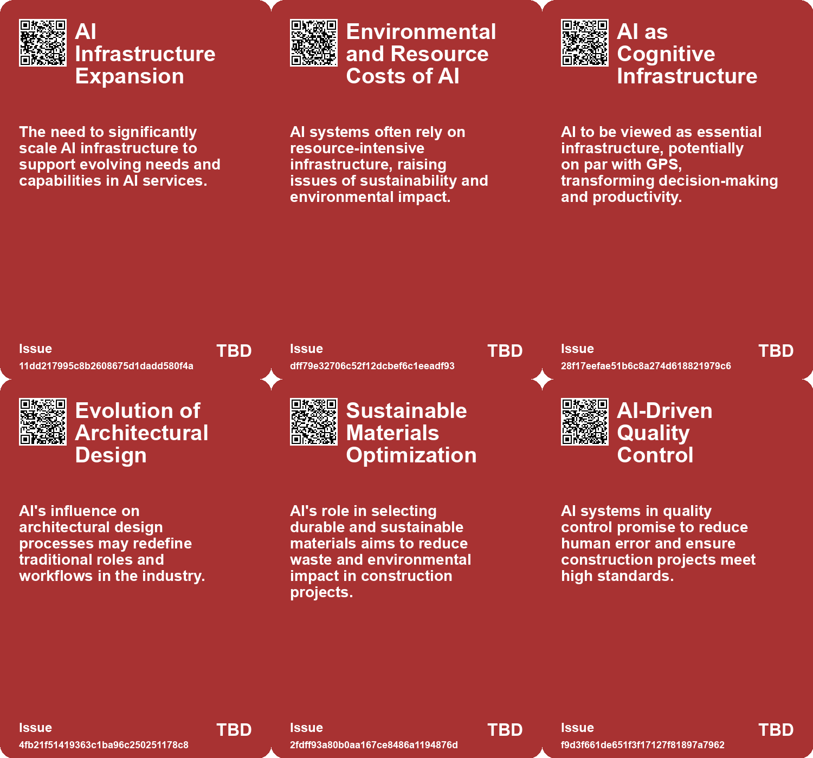
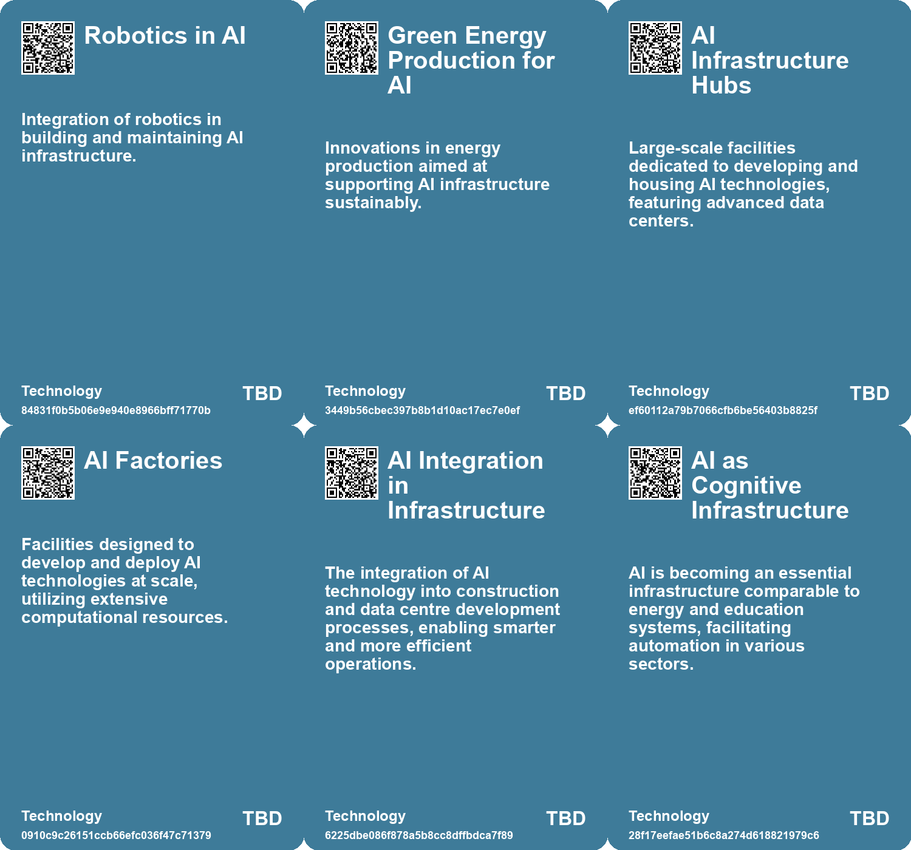

# *Topic*: AI in infrastructure companies

# Summary

The rapid advancement of artificial intelligence (AI) is reshaping various sectors, with significant implications for economic growth, job markets, and organizational structures. Governments and corporations are increasingly recognizing AI as a critical driver of innovation and competitiveness. The U.S. is investing heavily in AI infrastructure, aiming to produce a gigawatt of AI resources weekly to support model training and inference. Similarly, the UK is positioning itself as a leader in AI, launching initiatives to boost data centers and promote sustainable practices in construction.

AI's role in national security is also gaining attention. The National Security Agency is utilizing AI to detect malicious cyber activities, particularly from Chinese hacking groups targeting critical infrastructure. This highlights the growing importance of AI in safeguarding national interests and addressing emerging threats.

As countries strive to establish themselves as AI hubs, Taiwan has announced a $3.2 billion initiative to enhance its AI capabilities by 2040. However, challenges such as energy supply constraints and geopolitical tensions could hinder its ambitions. The integration of AI in various sectors, including architecture and construction, is transforming traditional practices. Architects face the risk of being replaced by AI, which can autonomously generate designs, while AI-driven project management tools are optimizing workflows and enhancing safety in construction.

The impact of AI on organizational structures is profound. Companies are moving towards flatter hierarchies as AI takes over routine tasks, leading to the emergence of hybrid teams that combine human and machine intelligence. This shift necessitates a cultural change towards innovation and reskilling the workforce to adapt to new technologies.

Concerns about the ethical implications of AI are also prevalent. The consolidation of AI resources by large tech companies raises questions about diversity and public-minded innovation. The proposed National Artificial Intelligence Research Resource aims to address these issues, but skepticism remains regarding its potential to benefit society broadly.

AI's influence extends to cognitive skills, with tools like ChatGPT enhancing writing capabilities but potentially leading to cognitive decline through over-reliance. The economic implications of AI automation vary, with research indicating that automating complex tasks can lower wages while increasing employment, whereas automating routine tasks may reduce jobs but raise wages for those remaining.

Finally, the Gulf states, particularly the UAE, are investing in AI as part of their strategy to diversify from fossil fuels. This shift is seen as a way to compete globally in the AI sector, with significant projects underway to attract top talent and foster innovation. The collaboration between the U.S. and Gulf nations aims to strengthen economic ties and enhance technological capabilities in the face of rising competition from China. 

The landscape of AI is evolving rapidly, with its potential to drive economic growth, transform job markets, and raise ethical questions becoming increasingly apparent.

# Seeds

|    | name                                  | description                                                                                           | change                                                                                          | 10-year                                                                                          | driving-force                                                                                     |
|---:|:--------------------------------------|:------------------------------------------------------------------------------------------------------|:------------------------------------------------------------------------------------------------|:-------------------------------------------------------------------------------------------------|:--------------------------------------------------------------------------------------------------|
|  0 | Gigawatt AI Infrastructure Factories  | Establishment of factories producing gigawatts of AI infrastructure weekly.                           | Transition from traditional infrastructure development to rapid, AI-focused factory production. | Smart infrastructure networks powered by AI will revolutionize various industries and economies. | The urgent need for scalable AI compute power to support unprecedented AI advancements.           |
|  1 | AI in Healthcare and Education        | AI's potential role in revolutionizing healthcare and education systems.                              | The paradigm shift in healthcare and education delivery through AI technologies.                | AI-driven personalized healthcare solutions and educational experiences may become standard.     | The aspiration to solve large-scale problems like cancer treatment and universal education.       |
|  2 | Innovative Financing for AI Expansion | New financing strategies will emerge to support AI infrastructure expansion.                          | Transition from traditional funding models to innovative financing solutions for AI.            | Emerging funding models could democratize AI development, making it accessible to more players.  | The critical need for substantial resources to enhance AI compute capabilities.                   |
|  3 | AI as Fundamental Infrastructure      | AI is increasingly recognized as vital as traditional infrastructures like energy and food.           | From AI seen as optional to being classified as critical infrastructure.                        | AI will be a core part of national infrastructure, akin to energy or transportation.             | The integration of AI into everyday productivity and governance will necessitate this change.     |
|  4 | Job Transformation in Creative Fields | AI's role is changing the job landscape for architects and designers.                                 | From traditional roles to new collaborative roles with AI tools.                                | Creative jobs will evolve, with AI as a common collaborator rather than a replacement.           | The integration of AI into design practices necessitating new skill sets.                         |
|  5 | AI-Driven Project Management          | AI tools are streamlining project management processes in construction.                               | From manual project management to AI-enhanced systems that optimize operations.                 | Project management will be fully automated, with AI making real-time decisions for efficiency.   | The need for increased productivity and cost-effectiveness in construction.                       |
|  6 | AI-Driven Quality Control             | AI systems enhance quality control in construction projects.                                          | From manual oversight to continuous AI-powered quality monitoring.                              | Quality assurance will be radically improved, with fewer errors and rework.                      | The demand for higher standards and reduced human error in construction.                          |
|  7 | AI as a Design Prosthesis             | AI is seen as a tool that can augment an architect's capabilities.                                    | Shift from traditional design methods to AI-assisted design processes.                          | The design process may be entirely redefined through AI collaboration.                           | The desire for greater efficiency and innovation in architectural design.                         |
|  8 | AI in Climate Action                  | AI's role in addressing climate change and environmental issues.                                      | From reactive measures to proactive AI-driven solutions for climate resilience.                 | AI will play a crucial role in developing strategies for sustainable practices worldwide.        | The urgent need to combat climate change and its disproportionate effects on the poor.            |
|  9 | New Business Models Around AI         | Emerging business models are focusing on AI applications in various sectors, transforming industries. | Shift from traditional business models to ones centered around AI capabilities and services.    | Industries may fully evolve to integrate AI as a core component of business strategies.          | The demand for innovative solutions and efficiency is encouraging new AI-centric business models. |

# Concerns

|    | name                                         | description                                                                                                                                               |
|---:|:---------------------------------------------|:----------------------------------------------------------------------------------------------------------------------------------------------------------|
|  0 | Investment Diversion Risks                   | Potential failures in energy or geopolitical stability may lead to capital being stranded or diverted away from AI infrastructure initiatives.            |
|  1 | Dependence on AI infrastructure              | Increasing reliance on AI may create vulnerabilities in various sectors if infrastructure fails or is compromised.                                        |
|  2 | Competition in AI infrastructure development | Rapid advancements in AI infrastructure in other countries may lead to a competitive disadvantage for nations that lag behind, impacting global dynamics. |
|  3 | Job displacement due to AI                   | As AI takes on more roles, there may be significant job displacement, requiring solutions for those affected in the workforce.                            |
|  4 | Innovation hurdles                           | Creating new AI infrastructure at the required scale will face unprecedented challenges in innovation and may not meet anticipated timelines.             |
|  5 | Concentration of Power and Wealth            | AI tools are used to consolidate power among tech billionaires, influencing economic and political landscapes.                                            |
|  6 | Dependence on AI Infrastructure              | The focus on AI gigafactories may lead to an over-reliance on centralized AI infrastructure, which could create vulnerabilities.                          |
|  7 | Invasive Technology Proliferation            | AI's rapid integration into various sectors without clear necessity risks overshadowing more effective human-centric problem-solving approaches.          |
|  8 | Need for Workforce Retraining                | As AI automates certain tasks, there will be increased demand for retraining workers for new roles in AI management and maintenance.                      |
|  9 | Bias and Misinformation in AI                | AI systems may perpetuate or exacerbate issues related to bias and misinformation, impacting decision-making and company reputation.                      |

# Cards

## Concerns

## Behaviors

## Issue

## Technology

# Links

* [A Vision for Expanding AI Infrastructure to Drive Economic Growth and Innovation](https://futures.kghosh.me/a1045c1231e63ffbb2422c8d850c5e6f)
* [Adapting Organizational Structures to Embrace AI: Lessons from History and Future Directions](https://futures.kghosh.me/fd0f3b7a6783ba6a0fcd3a18c8241be5)
* [The Transformative Impact of AI on Organizational Structures and Culture](https://futures.kghosh.me/fe6a32f4a3def00b40a187cec64fec72)
* [The Transformative Impact of AI on the Construction Industry: Innovations and Future Prospects](https://futures.kghosh.me/4c573871ba10e6b696264391285cc955)
* [MIT Study Challenges AI Job Displacement Fears with Economic Viability Insights](https://futures.kghosh.me/89ee61cc0d9fa77ecb1eb4100622a53f)
* [Exploring the Paradox of Innovation in Climate and AI: Speed vs. Advantage](https://futures.kghosh.me/3ee7211a6d9953b676097afae3377769)
* [Transforming Project Management: The Impact of AI and Machine Learning on Delivery Success](https://futures.kghosh.me/9b8c9e1c07779589f3ecf3d75fb375ba)
* [The Importance of Explainable AI: Building Trust in Artificial Intelligence for Organizations](https://futures.kghosh.me/afe2219279811b5905b43a7731e95da7)
* [Understanding AI: Definitions, Implications, and the Need for Literacy in Technology](https://futures.kghosh.me/45d0e20c84c31176fa084646d8d045b4)
* [The Existential Threat of AI to the Architecture Profession: A Call to Action for Architects](https://futures.kghosh.me/bf4505c73a7c8cd0d84f15d3384b0433)
* [The Gulf's Strategic Pivot Towards AI: A New Economic Frontier Beyond Oil](https://futures.kghosh.me/30ca1c340801820ef5954decc45e70c3)
* [Taiwan's Ambitious AI Island Initiative Faces Energy and Geopolitical Challenges](https://futures.kghosh.me/9696933ed36b35a793b84c6ba725d8e6)
* [The Transformative Impact of AI on Productivity and Entrepreneurship in 2023](https://futures.kghosh.me/a40580730388900810b4496ff9891dc9)
* [AI Enhances U.S. Cybersecurity Against Chinese Hacking Threats to Critical Infrastructure](https://futures.kghosh.me/cea16dfec561c12861cfadf0455880f1)
* [The Transformative Potential of AI: Revolutionizing Education, Healthcare, and Global Equity](https://futures.kghosh.me/2449c2fc4b8afc7e268db4987fa821e5)
* [Exploring AI's Effect on Cognitive Skills and Learning Processes](https://futures.kghosh.me/950253f15955ca7be1cb2ebf244d0939)
* [The Invasive Nature of AI: Impacts on Ecosystems and Decision-Making](https://futures.kghosh.me/40905d50f6ec5c6edbd1a6e1d9659218)
* [Harnessing AI for Social Good: Opportunities and Challenges in Achieving the UN SDGs](https://futures.kghosh.me/0d88d49818819d335d12f792275fde97)
* [European Commission Unveils €200 Billion AI Investment Plan with Focus on Gigafactories](https://futures.kghosh.me/32b15503bb9a88d3cb10661b71c47eb4)
* [The Impact of AI on Architecture and Design: A New Era of Creativity and Collaboration](https://futures.kghosh.me/1f02642f54cf28611a00e4c83c1d428f)
* [UK Government's AI Strategy and the Future of Data Centre Infrastructure](https://futures.kghosh.me/153e5fa0582a39419875eb23b972ec2c)
* [The Necessity of Strategic Fact Reserves for AI Development in Nations and Corporations](https://futures.kghosh.me/05e89c4773a48ddeceedf5e1e0e1d4fe)
* [Understanding the Real Risks of AI Beyond Superintelligence and Scalability](https://futures.kghosh.me/ff7f7a51f925c273449a8648a18b7df8)
* [Exploring the Top Five Digital Trends Transforming the AEC Industry by 2025](https://futures.kghosh.me/4fa95d956537d2dbb69564d1fce9ab67)
* [Rethinking the Role of AI: From Political Tool to Ethical Design Options](https://futures.kghosh.me/c25cae2b8d72e7634d591247d9ac96d2)
* [Analyzing AI's Impact on Wages and Employment: Two Diverging Pathways in the Future of Work](https://futures.kghosh.me/ef65b4ec6a48bf076171480f9ec6c8cc)
* [Public-Private Partnerships in AI: Risks and Societal Implications](https://futures.kghosh.me/6264095641147fe54800b8f03723f381)