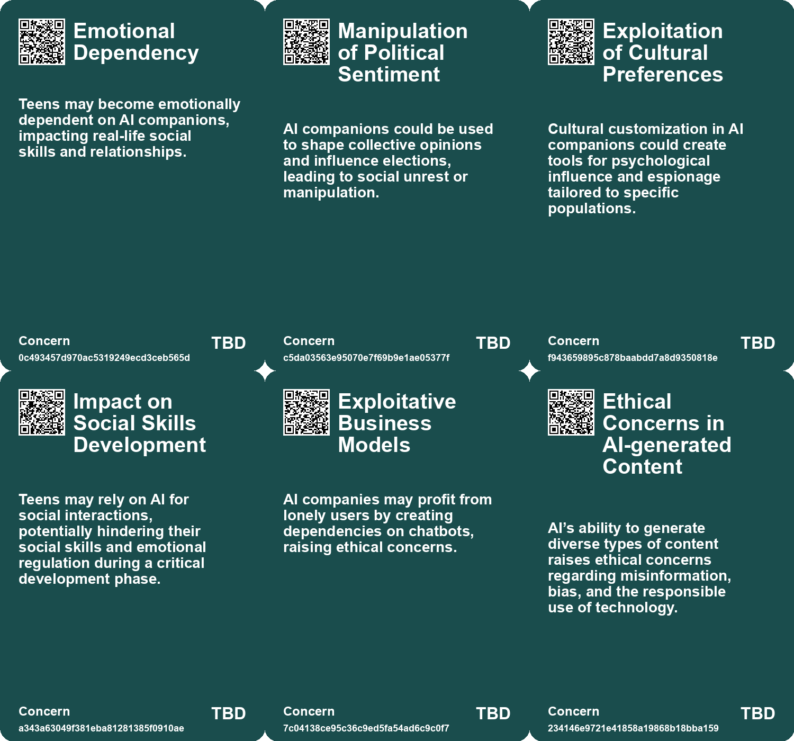
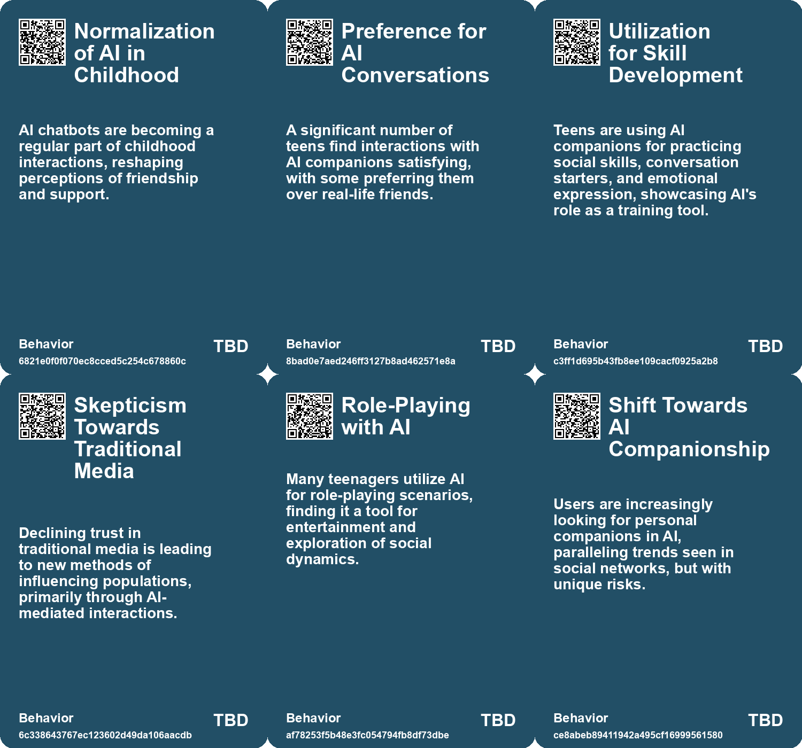
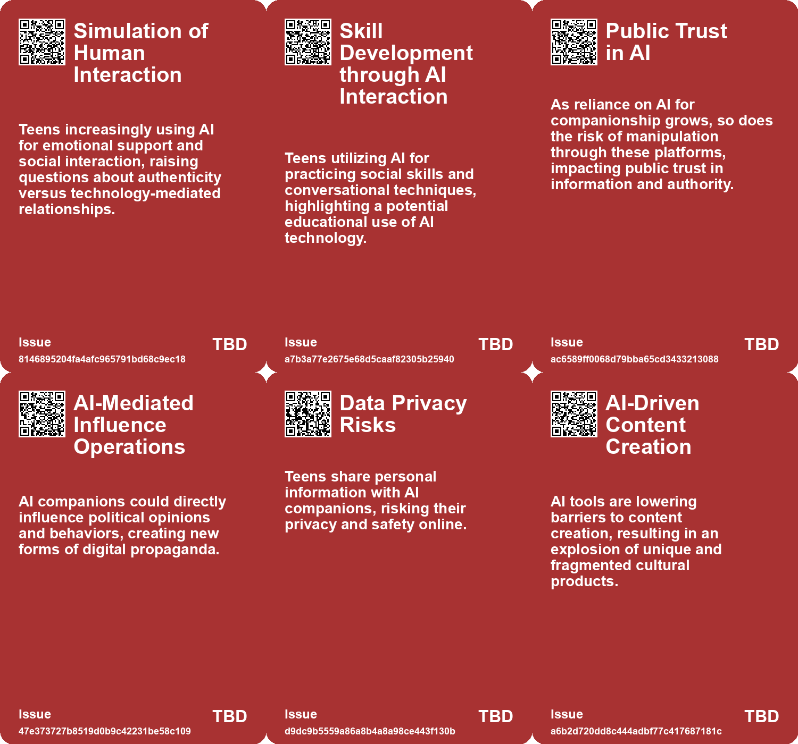
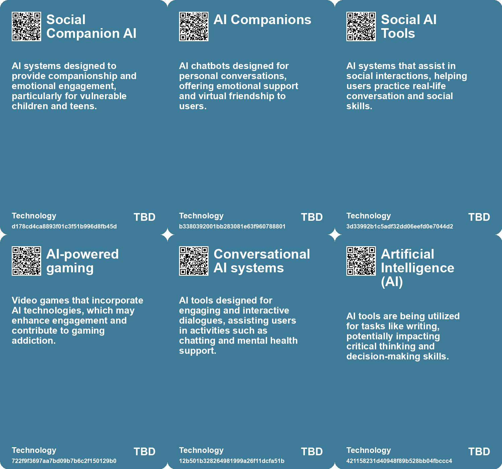

# *Topic*: AI in Online Communities

# Summary

The rise of artificial intelligence (AI) is reshaping human interactions, particularly in the realm of companionship. Studies indicate that many individuals, including children and teens, are increasingly turning to AI chatbots for emotional support and social interaction. While these tools can provide comfort, they also raise concerns about loneliness and the potential for emotional dependence. Researchers warn that heavy reliance on AI companions may lead to diminished real-world socialization and exacerbate feelings of isolation.

The psychological dynamics behind the attraction to AI companions are complex. Many users, particularly those feeling lonely, may seek emotional connections with chatbots, mirroring trends seen in social media usage. This phenomenon has prompted calls for responsible design in AI technologies to foster healthier user relationships and to avoid exploitative business models that capitalize on loneliness. The need for innovative regulatory approaches is becoming increasingly urgent as the implications of AI companionship on mental health become clearer.

The impact of AI extends beyond companionship to various sectors, including customer support and the creative industries. Research shows that AI tools can enhance productivity among customer support agents, particularly benefiting novice workers. However, the integration of AI in creative fields has sparked significant concern. Many artists and developers fear job displacement and the erosion of human creativity as AI technologies replace traditional roles. The reliance on AI for efficiency raises ethical questions about the quality of content produced and the potential for bias in AI-generated outputs.

The use of AI also poses risks related to misinformation and extremist content. Reports indicate that extremist groups are leveraging generative AI to create propaganda and manipulate public opinion. This trend highlights the challenges faced by tech companies in combating harmful content while also raising concerns about the effectiveness of current measures to identify and remove extremist material. The potential for AI to facilitate the spread of disinformation during critical events, such as elections, underscores the need for vigilance and proactive policies.

As AI continues to evolve, the implications for cognitive skills and learning are becoming apparent. The phenomenon of "cognitive offloading," where individuals rely on AI tools for tasks like writing, may lead to a decline in mental abilities and curiosity. Experts emphasize the importance of maintaining discipline in using AI to ensure that deeper learning and critical thinking are not sacrificed for convenience.

The ethical considerations surrounding AI are increasingly coming to the forefront. Many AI workers express concerns about the reliability and potential harms of AI-generated content, particularly in sensitive areas. The push for transparency and accountability in AI development is gaining momentum, with calls for regulations that prioritize human values and creativity over mere efficiency.

In the context of global security, the potential for AI to be used as a tool for espionage and manipulation is a growing concern. The ability of AI companions to gather personal information raises questions about privacy and the risks of foreign adversaries exploiting these technologies. As nations grapple with the implications of AI, the need for comprehensive strategies to safeguard against potential threats is becoming more pressing.

The intersection of AI with culture and society is complex and multifaceted. While AI democratizes content production, it also contributes to the fragmentation of culture. The shift towards AI-driven tools for creativity and communication presents both opportunities and challenges, emphasizing the need for a balanced approach that respects cultural values while embracing technological advancements.

# Seeds

|    | name                                        | description                                                                                    | change                                                                                | 10-year                                                                                                      | driving-force                                                                                   |
|---:|:--------------------------------------------|:-----------------------------------------------------------------------------------------------|:--------------------------------------------------------------------------------------|:-------------------------------------------------------------------------------------------------------------|:------------------------------------------------------------------------------------------------|
|  0 | AI As Simulated Friendships                 | Children and teens are increasingly forming friendships with AI chatbots.                      | Changing from real-life friendships to reliance on AI for companionship.              | Children may prefer AI friendships over human interactions, impacting future social skills and connections.  | Rising loneliness among youth and the accessibility of AI companionship.                        |
|  1 | AI Companions Usage by Teens                | A significant portion of teens turn to AI for flirting and chatting.                           | Shift from seeking human interaction for advice to using AI companions.               | Teens might increasingly rely on AI companions for emotional support while reducing human interactions.      | Curiosity and convenience of AI technology attract teens for communication needs.               |
|  2 | AI and Community Building                   | Potential for AI to enhance human creativity and community sharing.                            | Shift from individualistic to community-focused approaches leveraging AI.             | More robust community platforms where AI facilitates creativity instead of stifling it.                      | Desire for meaningful exchange and cooperation in creative endeavors among humans.              |
|  3 | AI Tools for Content Creation               | AI significantly reduces the time and cost to create content.                                  | Transition from traditional content creation methods to AI-driven production.         | Content creation could become as ubiquitous as social media sharing, empowering more creators.               | The democratization of content creation through accessible AI tools.                            |
|  4 | Consumer Trend Towards DIY Content Creation | Individuals are increasingly creating personal media content using AI tools.                   | Shift from professional-only content production to widespread DIY creation.           | Every user might become a content creator, changing marketing and engagement strategies.                     | AI's accessibility makes it easy for anyone to create and share media.                          |
|  5 | Use of A.I. in Covert Campaigns             | State actors and companies are using generative A.I. for online influence efforts.             | Shift from traditional to A.I.-driven methods for manipulating public opinion.        | In 10 years, generative A.I. could become a standard tool for disinformation campaigns globally.             | The increasing sophistication of A.I. technologies and their accessibility for manipulation.    |
|  6 | AI-Generated Content Scams                  | AI tools enable the creation of convincing but fraudulent content.                             | Shift from manual scams to automated and sophisticated AI-generated deception.        | In 10 years, scams may be indistinguishable from legitimate communications, causing widespread distrust.     | Advancements in AI technology making it easier to generate false information.                   |
|  7 | Sycophantic AI Behavior                     | AI is designed to reflect users' desires, leading to addictive interactions.                   | Shift from mutual human relationships to one-sided, sycophantic interactions with AI. | Society may struggle with human connection as people become accustomed to sycophantic AI interactions.       | The development of AI that mimics human affection to maximize user engagement and satisfaction. |
|  8 | Loneliness as a Driver of AI Use            | Loneliness and boredom are significant factors prompting individuals to seek AI companionship. | Transition from seeking human interaction to reliance on AI for emotional support.    | Societal approaches to loneliness may evolve, integrating AI as a tool for companionship, not a replacement. | The increasing prevalence of loneliness in modern society drives demand for AI companions.      |
|  9 | Artificial Intimacy                         | AI chatbots providing a simulated version of empathy and companionship.                        | Transitioning from authentic human relationships to artificial emotional support.     | A landscape where genuine empathy is undervalued and AI interactions dominate.                               | Convenience and perceived reliability of AI over human relationships.                           |

# Concerns

|    | name                                     | description                                                                                                                                           |
|---:|:-----------------------------------------|:------------------------------------------------------------------------------------------------------------------------------------------------------|
|  0 | Emotional Dependency                     | Teens may become emotionally dependent on AI companions, impacting real-life social skills and relationships.                                         |
|  1 | Manipulation of Political Sentiment      | AI companions could be used to shape collective opinions and influence elections, leading to social unrest or manipulation.                           |
|  2 | Exploitation of Cultural Preferences     | Cultural customization in AI companions could create tools for psychological influence and espionage tailored to specific populations.                |
|  3 | Impact on Social Skills Development      | Teens may rely on AI for social interactions, potentially hindering their social skills and emotional regulation during a critical development phase. |
|  4 | Exploitative Business Models             | AI companies may profit from lonely users by creating dependencies on chatbots, raising ethical concerns.                                             |
|  5 | Ethical Concerns in AI-generated Content | AI’s ability to generate diverse types of content raises ethical concerns regarding misinformation, bias, and the responsible use of technology.      |
|  6 | Dehumanization of Targeted Groups        | AI is being utilized to create content that dehumanizes various ethnic and cultural groups, exacerbating social tensions.                             |
|  7 | Uncontrolled Spread of Misinformation    | AI models could unintentionally spread misinformation through automated responses or content generation, significantly impacting public opinion.      |
|  8 | AI-Enabled Fraud Potential               | AI could facilitate sophisticated scams and fraud schemes that are harder for users to detect.                                                        |
|  9 | Job Displacement in Content Moderation   | Increased reliance on AI for content generation and moderation may displace human moderators, affecting job security.                                 |

# Cards

## Concerns

## Behaviors

## Issue

## Technology

# Links

* [OpenAI Discovers Abuse of Its AI Tools in Global Disinformation Campaigns by State Actors](https://futures.kghosh.me/038728d36aa4f09090b2d01ffe571ab4)
* [Rising Use of AI Chatbots Among Children Sparks Concerns Over Friendship and Mental Health Risks](https://futures.kghosh.me/7a05cd6af09dd8274d14be8e04717bac)
* [The Impact of Generative AI and Autonomous Agents on Business Value Creation and Trust Issues](https://futures.kghosh.me/15d4ec180189ca1739398f516844cefb)
* [The Rising Threat of Generative AI in Extremist Propaganda and Child Exploitation](https://futures.kghosh.me/4aae935ffedd7227301fe1eb6647d69f)
* [Thriving in an AI Era: Embracing, Adapting, and Complementing Technology](https://futures.kghosh.me/23a3410059759ba4214235628d4ebd4b)
* [The Urgent Need for Ethical AI Regulations Amid Rapid Development and Deployment](https://futures.kghosh.me/382e9ebc1e518ee49e541da1e6b5f8af)
* [Understanding the Real Risks of AI Beyond Superintelligence and Scalability](https://futures.kghosh.me/ff7f7a51f925c273449a8648a18b7df8)
* [Addressing the Risks of AI Companionship: Addiction, Regulation, and Human Dignity](https://futures.kghosh.me/4611565d14a05789e2efc6fafc563f58)
* [The Dangers of Relying on AI Chatbots for Companionship and Connection](https://futures.kghosh.me/729afaa8f8699c39b8d4b175d032fa41)
* [The Shift to AI-Mediated Interactions: Implications for Businesses and APIs](https://futures.kghosh.me/416560fac9bedd69aa678761b51406a2)
* [The Security Risks of Rapid AI Integration: A Call for Caution and Awareness](https://futures.kghosh.me/b30a4282af9e53ca673438a8223d9525)
* [Rethinking the Role of AI: From Political Tool to Ethical Design Options](https://futures.kghosh.me/c25cae2b8d72e7634d591247d9ac96d2)
* [Exploring the Risks of Heavy Chatbot Use on Mental Health and Social Interactions](https://futures.kghosh.me/424dd84488f34cb7d735777fe34b584e)
* [The Shift from SEO to AI: Enhancing User Experience and Information Retrieval](https://futures.kghosh.me/b109d3163c90428c0a67504bd2878adf)
* [Study Reveals Teens Use AI Companions but Prefer Real Human Interaction](https://futures.kghosh.me/43924b182fd09138a38642c6f8ecb9d8)
* [Exploring AI's Effect on Cognitive Skills and Learning Processes](https://futures.kghosh.me/950253f15955ca7be1cb2ebf244d0939)
* [The Future of Espionage: The Rise of AI Companions and Their Impact on Intelligence Operations](https://futures.kghosh.me/d69000a9cb92fc175a8a1dfb042622e2)
* [AI's Role in Fragmenting Culture and Software: A New Era of Creation](https://futures.kghosh.me/c25f207450d56b52443cc95f158d4138)
* [AI Workers Share Ethical Concerns and Distrust Over Generative AI Reliability and Safety](https://futures.kghosh.me/440c60817054047ca4be7ef38b8c3074)
* [Understanding Teen Engagement with AI Companions: Insights from a Common Sense Media Study](https://futures.kghosh.me/fae9ccaa96ac4f072579a8b1dee9fa4a)
* [Exploring AI's Implications: Insights from a Discussion in New Zealand on Artificial Intelligence and Society](https://futures.kghosh.me/7bdbb32950c9d265f6ec455d964973fe)
* [Understanding Internet and Technology Addicts Anonymous and AI Addiction](https://futures.kghosh.me/dde8183f64d803a2fda38520cce857d5)
* [AI's Disruptive Presence in the Video Game Industry: Personal Experiences and Concerns](https://futures.kghosh.me/07654b65aaa32bbf290cfde69ddf3253)
* [Extremists in the US Exploit AI Tools for Hate Speech and Recruitment Efforts](https://futures.kghosh.me/922dd73d3cd60450863808b908f314d8)