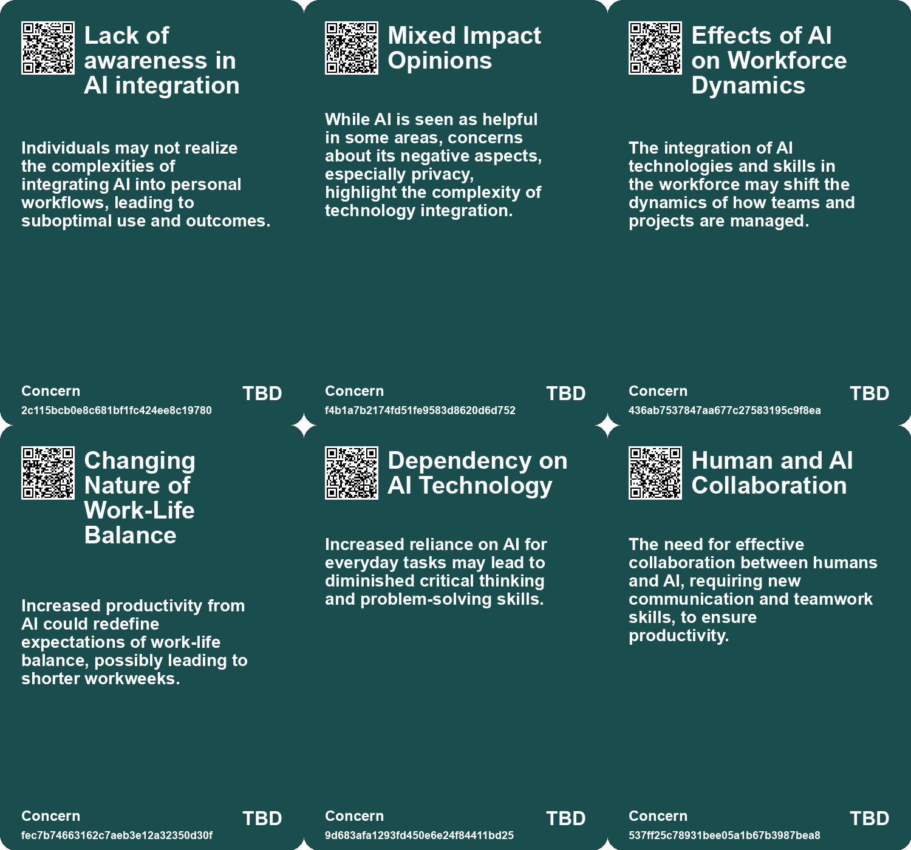
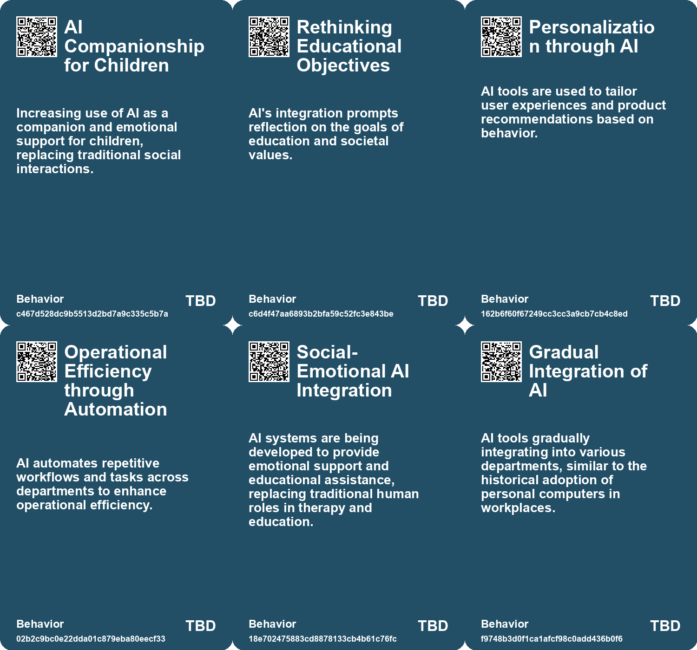
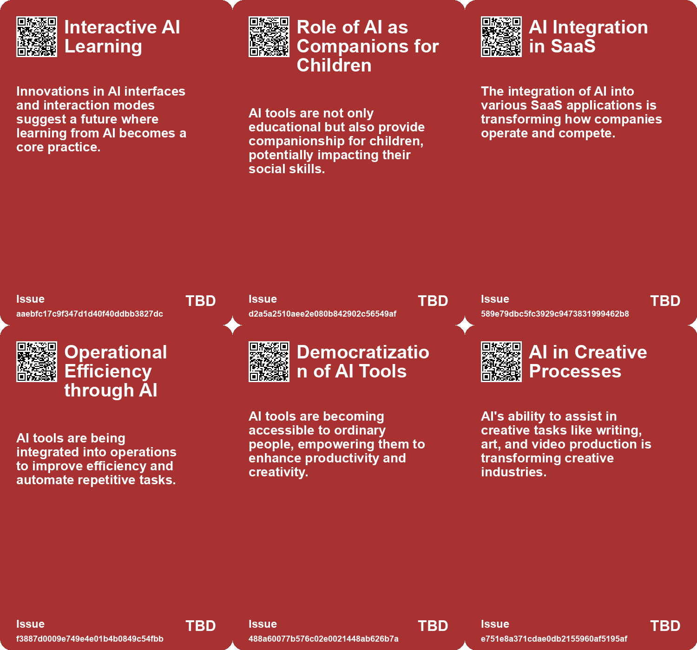
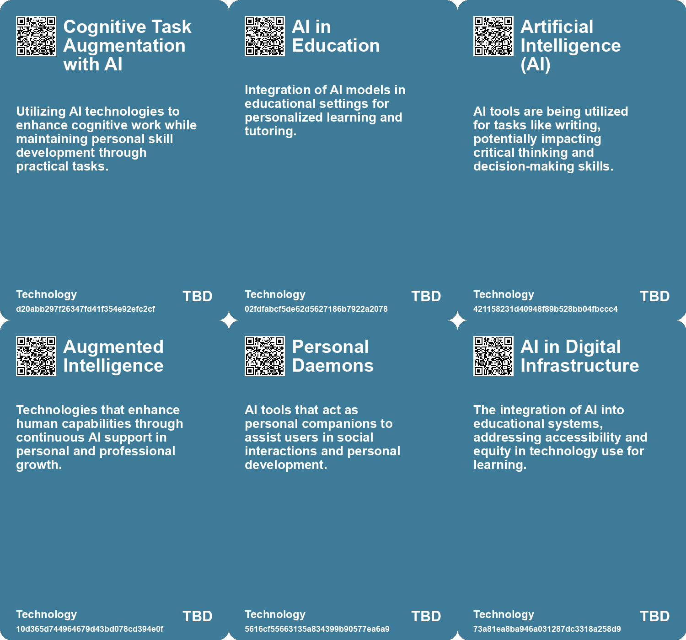

# *Topic*: AI Integration in Daily Life

# Summary

The rise of artificial intelligence (AI) is reshaping various aspects of daily life, work, and education, prompting both excitement and concern among the public. Personal AI assistants are becoming primary interfaces for individuals, curating information and managing tasks. While these tools promise convenience, they also raise issues of manipulation and control over personal data. The potential for influence campaigns managed by AI highlights the need for security and ethical considerations in their deployment.

In the realm of education, AI is seen as a transformative force, offering personalized learning experiences through AI tutors. However, there are concerns about the impact on social skills and critical thinking, particularly among children. The integration of AI in classrooms may enhance academic performance but could also exacerbate inequalities, especially in rural areas lacking access to quality resources.

The workplace is undergoing significant changes as business schools incorporate AI into their curriculums. Graduates are expected to be proficient in AI tools, which are increasingly valued by employers. Yet, there is a cautionary note regarding the balance between leveraging AI for efficiency and maintaining essential human skills. The emergence of "Frontier Firms" illustrates the shift towards agile business processes, but it also raises challenges related to work-life balance and the potential for an "infinite workday."

Cognitive skills are also at risk as reliance on AI tools leads to cognitive offloading. Studies indicate that overuse of AI can weaken critical thinking and decision-making abilities. This phenomenon, described as cognitive atrophy, underscores the importance of maintaining mental engagement and skepticism towards AI-generated information.

The ethical implications of AI are particularly pronounced in sectors like healthcare and mental health, where social-emotional AI applications are emerging. While these tools aim to provide support, they risk depersonalizing care and widening the gap between those who can afford personalized services and those who cannot. The need for a balanced integration of AI and human interaction is crucial to ensure equitable access to care.

Public sentiment towards AI is shifting, with a growing number of Americans expressing concern about its role in daily life. A recent survey indicates that more people are worried than excited about AI, particularly regarding privacy and control. Demographic differences reveal that older adults and those with lower education levels tend to be more skeptical of AI's benefits.

As AI continues to evolve, its potential to disrupt traditional roles and industries is becoming clearer. From transforming supply chain management to redefining marketing roles, AI is pushing professionals to adapt and embrace new skills. The future of work will require a focus on uniquely human attributes, such as creativity and empathy, as businesses seek to integrate AI efficiencies while preserving the human element.

# Seeds

|    | name                                       | description                                                                               | change                                                                                                 | 10-year                                                                                                             | driving-force                                                                                    |
|---:|:-------------------------------------------|:------------------------------------------------------------------------------------------|:-------------------------------------------------------------------------------------------------------|:--------------------------------------------------------------------------------------------------------------------|:-------------------------------------------------------------------------------------------------|
|  0 | AI-enhanced learning                       | The integration of AI in educational settings for personalized learning experiences.      | Shift from traditional, one-size-fits-all education to personalized, AI-driven learning methods.       | In 10 years, education could be highly personalized, with AI tutors adapting to each child's unique learning style. | The desire for tailored educational experiences that cater to individual needs and preferences.  |
|  1 | AI as a co-pilot in education              | AI acting as a personalized assistant in the learning process.                            | Shift from traditional teacher-led instruction to collaborative learning with AI support.              | In 10 years, AI could be a standard part of the educational experience, complementing human teachers.               | The increasing sophistication and user-friendliness of AI technologies.                          |
|  2 | AI Integration in SaaS Development         | AI tools are increasingly integrated into SaaS product development processes.             | Shift from traditional development methods to AI-enhanced approaches in SaaS.                          | SaaS companies will rely heavily on AI for efficient and innovative product development.                            | The need for faster and more efficient product development cycles in a competitive market.       |
|  3 | AI in Customer Support                     | AI chatbots and tools are evolving to enhance customer interaction and support.           | Move from basic automated responses to intelligent, context-aware customer support.                    | Customer support will be largely automated, with AI handling most inquiries efficiently.                            | The demand for quicker, more accurate customer support solutions.                                |
|  4 | AI Personalization                         | AI is increasingly used to tailor user experiences and product recommendations.           | Change from generic user experiences to highly personalized interactions.                              | User experiences will be uniquely customized, enhancing satisfaction and loyalty.                                   | The importance of customer retention and satisfaction in a saturated market.                     |
|  5 | AI Decision-Making Supplanting Human Roles | AI systems are increasingly outperforming humans in various decision-making tasks.        | Transition from human decision-making to reliance on AI for efficiency and accuracy.                   | In a decade, AI may dominate sectors like healthcare and finance, reducing human roles substantially.               | Technological advancement in AI capabilities fuels its adoption in critical areas.               |
|  6 | Consciousness and Creativity               | AI may enable humans to tap into deeper consciousness and creativity.                     | From a focus on survival and productivity to one on creativity and empathy.                            | Society may prioritize creativity and emotional intelligence over traditional success metrics.                      | The recognition of the importance of mental health and creativity in human evolution.            |
|  7 | Social-Emotional AI in Education           | AI is now being integrated into educational systems to assist with emotional connections. | Shift from human-led emotional support in education to AI-assisted emotional and educational guidance. | Ten years from now, AI will play a central role in educational emotional support, with varying accessibility.       | The increasing need for personalized education and support, especially in under-resourced areas. |
|  8 | AI-Assisted Team Coordination              | Development of AI assistants that enhance communication and coordination in teams.        | Shift from traditional teamwork methods to AI-supported collaboration.                                 | AI will seamlessly integrate into teams, improving efficiency and reducing misunderstandings.                       | The increasing complexity of tasks requiring precise coordination among team members.            |
|  9 | Robotic Integration in Everyday Tasks      | Use of robots and AI in daily collaborative tasks, like family routines.                  | Transition from manual task management to automated assistance in everyday life.                       | Robots will become commonplace partners in household and work environments, enhancing productivity.                 | The growing acceptance and integration of robotics in personal and professional spaces.          |

# Concerns

|    | name                                 | description                                                                                                                                             |
|---:|:-------------------------------------|:--------------------------------------------------------------------------------------------------------------------------------------------------------|
|  0 | Lack of awareness in AI integration  | Individuals may not realize the complexities of integrating AI into personal workflows, leading to suboptimal use and outcomes.                         |
|  1 | Mixed Impact Opinions                | While AI is seen as helpful in some areas, concerns about its negative aspects, especially privacy, highlight the complexity of technology integration. |
|  2 | Effects of AI on Workforce Dynamics  | The integration of AI technologies and skills in the workforce may shift the dynamics of how teams and projects are managed.                            |
|  3 | Changing Nature of Work-Life Balance | Increased productivity from AI could redefine expectations of work-life balance, possibly leading to shorter workweeks.                                 |
|  4 | Dependency on AI Technology          | Increased reliance on AI for everyday tasks may lead to diminished critical thinking and problem-solving skills.                                        |
|  5 | Human and AI Collaboration           | The need for effective collaboration between humans and AI, requiring new communication and teamwork skills, to ensure productivity.                    |
|  6 | AI Limitations in Adaptability       | AI currently lacks the human-like ability to self-orient and adapt to rapidly changing environments, posing safety risks in critical applications.      |
|  7 | Data-Dependent Learning              | AI systems rely heavily on vast amounts of data to learn and adapt, which isn't a foolproof method for all scenarios.                                   |
|  8 | Emerging Safety Standards            | As AI adoption increases, there is a need to establish safety standards for its use in dynamic environments.                                            |
|  9 | Bias and Misinformation in AI        | AI systems may perpetuate or exacerbate issues related to bias and misinformation, impacting decision-making and company reputation.                    |

# Cards

## Concerns

## Behaviors

## Issue

## Technology

# Links

* [Public Concern About Artificial Intelligence Grows Amid Mixed Opinions on Its Impact](https://futures.kghosh.me/c3876ee8e1b4e0d9e38edf15caaa5521)
* [The Transformative Impact of AI on Organizational Structures and Culture](https://futures.kghosh.me/fe6a32f4a3def00b40a187cec64fec72)
* [The Integration of AI in Business School Curriculums to Enhance Graduate Competitiveness](https://futures.kghosh.me/bc232b227c806ac26adf2b99fa4cff9d)
* [The Role of Personal AI Assistants as Interfaces to Reality and Their Implications](https://futures.kghosh.me/f6a4f1f9e66f99bd101dee7d6a800855)
* [Harnessing Artificial Intelligence in the SaaS Industry: Benefits, Use Cases, and Future Trends](https://futures.kghosh.me/df59e2cf3380ffd9aeac9a3e01073300)
* [The Future of AI Agents: Transforming Software Interaction and Society](https://futures.kghosh.me/f9ab247df033c3d903c94289a8687845)
* [The Transformative Impact of AI on Productivity and Entrepreneurship in 2023](https://futures.kghosh.me/a40580730388900810b4496ff9891dc9)
* [AI's Potential to Enhance Human Evolution and Self-Actualization](https://futures.kghosh.me/8893f2e58b95e1993a5f8a1af090eedd)
* [The Transformative Role of Generative AI in Supply Chain and Marketing Management](https://futures.kghosh.me/1b46caa07ff58af58c2e1cf51b86402d)
* [The Flexibility of Human Self-Orientation vs. AI Limitations in Dynamic Environments](https://futures.kghosh.me/d9411983cedc4ea97632f2e8a3c2c090)
* [The Transformative Potential of AI: Revolutionizing Education, Healthcare, and Global Equity](https://futures.kghosh.me/2449c2fc4b8afc7e268db4987fa821e5)
* [Exploring the Transformative Impact of AI on Education and Children's Learning Experiences](https://futures.kghosh.me/adf886a1b9fd74281e0a43c3e7c70def)
* [Exploring AI's Effect on Cognitive Skills and Learning Processes](https://futures.kghosh.me/950253f15955ca7be1cb2ebf244d0939)
* [Microsoft Launches Autonomous AI Agents to Boost Productivity and Improve Business Efficiency](https://futures.kghosh.me/ccb5695c1b392857d55b45a52b0b62e6)
* [Thriving in an AI Era: Embracing, Adapting, and Complementing Technology](https://futures.kghosh.me/23a3410059759ba4214235628d4ebd4b)
* [How AI Could Transform Work-Life Balance and Job Dynamics in Various Industries](https://futures.kghosh.me/bc5ff4c170f1f63b34eb7ca70775d8d7)
* [The Role of Social-Emotional AI: Bridging or Widening the Gap in Human Connection?](https://futures.kghosh.me/8e191b6221caa8d9f27b19268ab8a048)
* [The Impact of AI in Chinese Education: Promise and Concerns](https://futures.kghosh.me/5374f9d1b84138f1c928c0e7fd727877)
* [Harnessing AI for Social Good: Opportunities and Challenges in Achieving the UN SDGs](https://futures.kghosh.me/0d88d49818819d335d12f792275fde97)
* [The Shift to AI-Mediated Interactions: Implications for Businesses and APIs](https://futures.kghosh.me/416560fac9bedd69aa678761b51406a2)
* [Balancing AI Assistance and Personal Skill Development as We Enter 2026](https://futures.kghosh.me/90f97dd5051985535e179bd08233512b)
* [Navigating the Infinite Workday: Insights from the 2025 Work Trend Index Report](https://futures.kghosh.me/eef55f2e710257a37ec32bae1b59f47c)
* [The Transformative Potential of AI: Revolutionizing Education, Healthcare, and Global Equity](https://futures.kghosh.me/8acafe1fbe51c2de3cd689956b25b39f)
* [The Diminishing Role of Human Interaction in Modern Technology and Its Societal Implications](https://futures.kghosh.me/31491f2b50e77cc7c45e541a9b2915d7)
* [MIT Researchers Develop AI Assistant to Enhance Teamwork in Critical Missions](https://futures.kghosh.me/d35cc2611e8b6e8e143446ca4ee22e19)
* [The Cognitive Costs of AI: Are We Sacrificing Our Mental Abilities for Convenience?](https://futures.kghosh.me/09e7abde98ff0c5590320545c5b20679)
* [Exploring AI's Implications: Insights from a Discussion in New Zealand on Artificial Intelligence and Society](https://futures.kghosh.me/7bdbb32950c9d265f6ec455d964973fe)