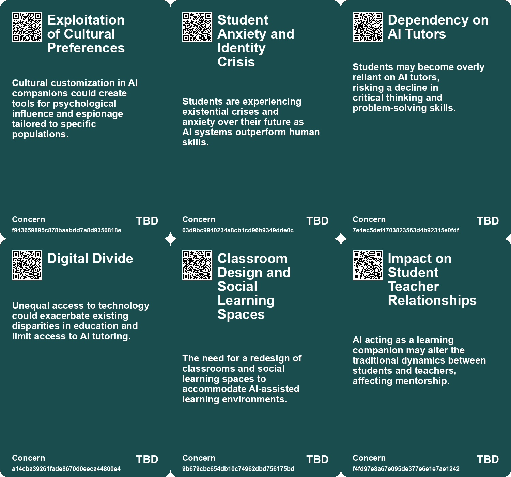
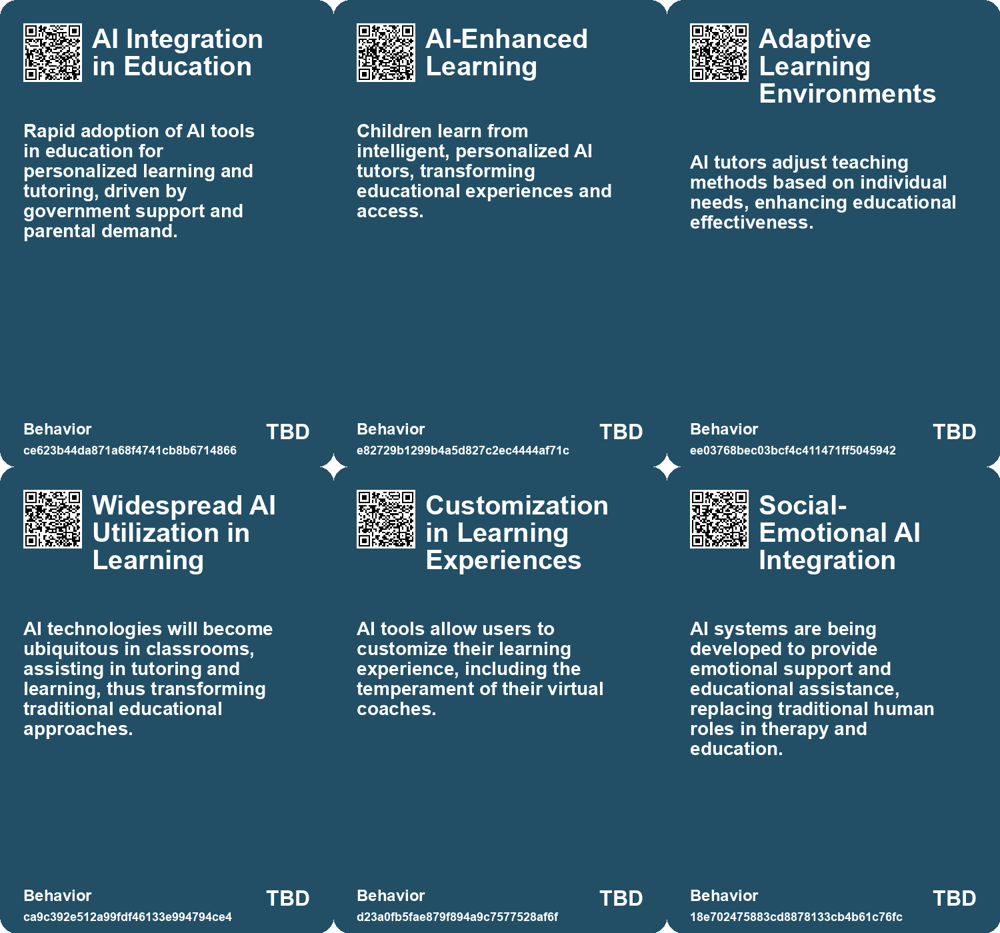
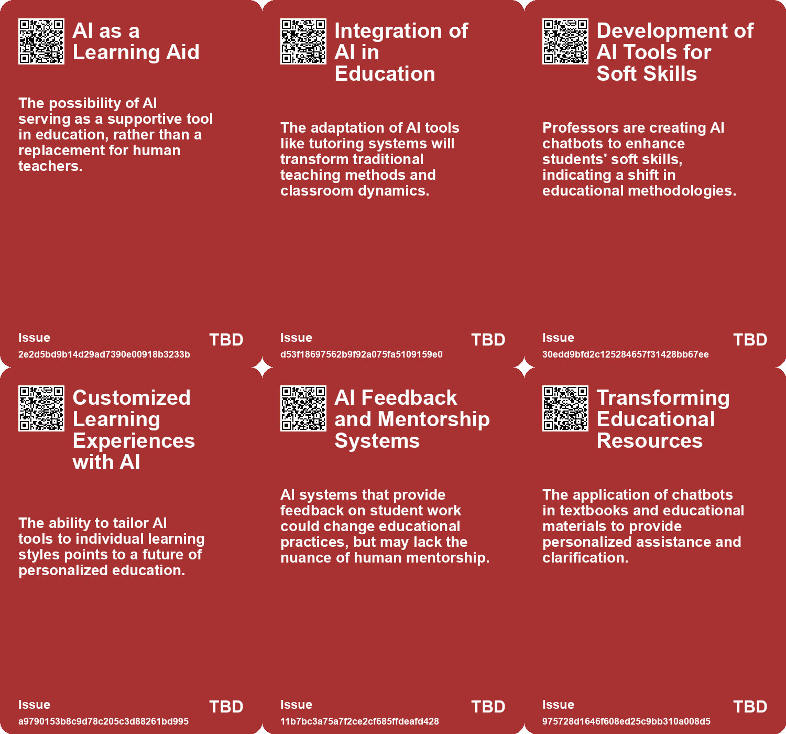
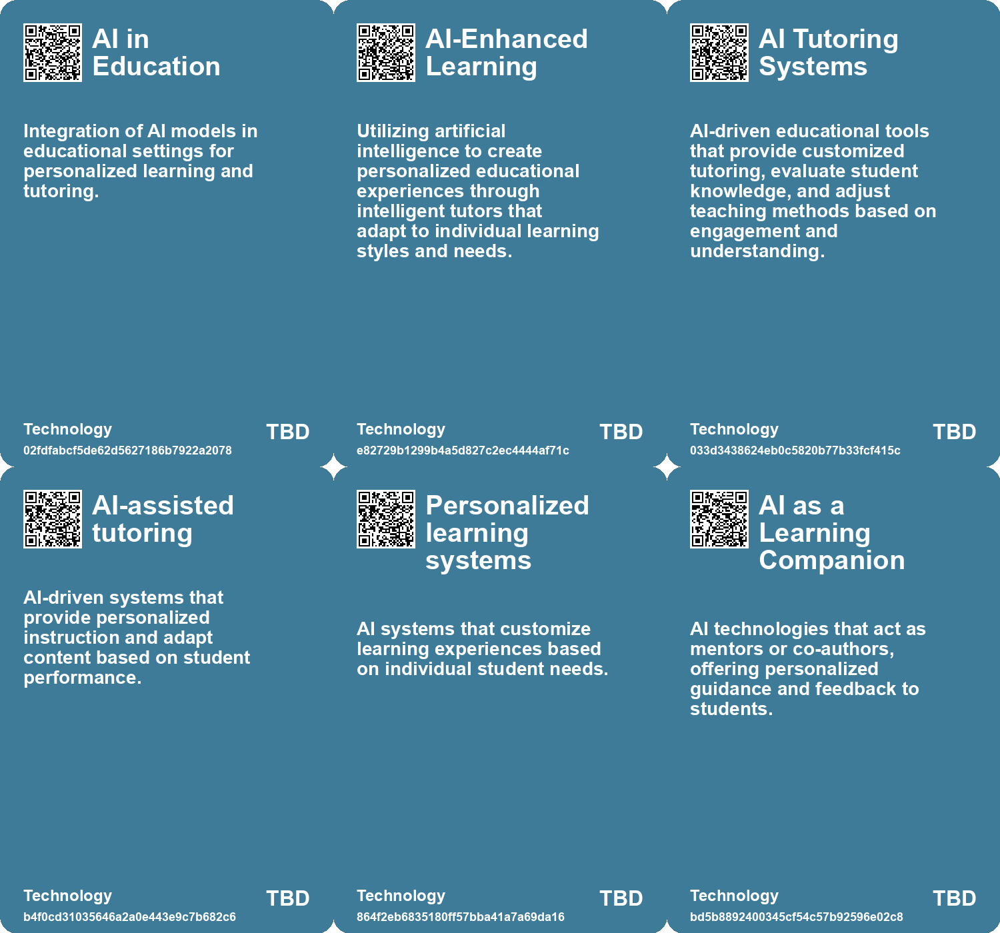

# *Topic*: AI Personalized Tutoring Systems

# Summary

The integration of artificial intelligence (AI) in education is reshaping learning environments and raising significant concerns. Personalized learning is gaining traction, with micro-schools and innovative teaching methods emphasizing active engagement and the potential of AI as a tutor. This shift highlights the need for a new educational paradigm that leverages AI to enhance personalized and interactive learning experiences.

However, the rise of AI tools has also sparked fears of academic dishonesty. Many educators express concerns about students using AI to cheat, leading to a perceived decline in intellectual rigor. The ease of accessing AI for assignments has prompted calls for a reevaluation of traditional homework methods and assessments. As educators grapple with these challenges, there is a growing recognition that AI can also provide opportunities for innovative pedagogical approaches.

The ethical implications of AI in education are becoming increasingly prominent. The emergence of social-emotional AI raises questions about the quality of emotional support provided to students, particularly in light of budget cuts and reduced human interaction. While affluent individuals may access personalized services, those in less fortunate circumstances often rely on AI, highlighting issues of inequality in educational resources.

In higher education, the adoption of AI tools is met with skepticism from some faculty members. Despite the potential for AI to enhance learning experiences, many educators remain cautious about its effectiveness in the classroom. Initiatives like AI chatbots in university courses illustrate both the promise and pitfalls of this technology, as institutions strive to balance innovation with the need for critical thinking and genuine engagement.

The global landscape of AI in education is also evolving, with countries like China rapidly adopting AI tools for learning. Parents are increasingly turning to AI solutions for their children's education, despite concerns about the impact on social skills and critical thinking. The disparity in access to quality education between urban and rural areas further complicates the integration of AI in learning environments.

As AI continues to permeate various sectors, including education, the potential for productivity gains is significant. AI agents are being developed to automate tasks and improve efficiency, but concerns about workforce displacement and the ethical use of these technologies persist. The need for responsible implementation and regulation is critical to ensure that AI serves as a tool for enhancement rather than a source of inequality.

The emotional and psychological dimensions of AI interactions are also under scrutiny. Studies show that while AI chatbots can provide support, they may inadvertently reinforce harmful thoughts and behaviors. The reliance on AI for mental health support raises ethical questions about the adequacy of these tools compared to human interaction.

In summary, the integration of AI in education presents a complex landscape of opportunities and challenges. As educators, students, and policymakers navigate this evolving terrain, the focus must remain on fostering genuine learning experiences while addressing the ethical implications and potential inequalities that arise from the widespread use of AI technologies.

# Seeds

|    | name                                | description                                                                                   | change                                                                                                 | 10-year                                                                                                             | driving-force                                                                                                 |
|---:|:------------------------------------|:----------------------------------------------------------------------------------------------|:-------------------------------------------------------------------------------------------------------|:--------------------------------------------------------------------------------------------------------------------|:--------------------------------------------------------------------------------------------------------------|
|  0 | AI-enhanced learning                | The integration of AI in educational settings for personalized learning experiences.          | Shift from traditional, one-size-fits-all education to personalized, AI-driven learning methods.       | In 10 years, education could be highly personalized, with AI tutors adapting to each child's unique learning style. | The desire for tailored educational experiences that cater to individual needs and preferences.               |
|  1 | AI as a co-pilot in education       | AI acting as a personalized assistant in the learning process.                                | Shift from traditional teacher-led instruction to collaborative learning with AI support.              | In 10 years, AI could be a standard part of the educational experience, complementing human teachers.               | The increasing sophistication and user-friendliness of AI technologies.                                       |
|  2 | AI as a Learning Tool               | Students are increasingly using AI as tutors and guides, enhancing their learning experience. | Transition from passive learning to interactive and adaptive learning via AI tools.                    | AI integration will lead to personalized education experiences and improved learning outcomes.                      | Demand for personalized and efficient learning solutions in education.                                        |
|  3 | AI as a Writing Mentor              | Students using AI for personalized feedback and writing assistance.                           | From traditional teacher feedback to AI-driven, personalized writing mentorship.                       | AI will routinely assist students with writing, enhancing learning experiences and outcomes.                        | The need for efficient and effective feedback mechanisms in education.                                        |
|  4 | AI in Education                     | AI-driven tools can personalize learning experiences for students.                            | Transition from standardized education to personalized learning pathways using AI.                     | Education will be more adaptive, catering to individual learning needs and styles through AI.                       | The demand for improved educational outcomes, especially in low-income areas.                                 |
|  5 | AI as a Decision Support Tool       | AI providing real-time guidance to enhance human decision-making capabilities.                | Enhancement of decision-making processes from elite-level to more accessible skill sets.               | Wider access to decision-making roles may lead to a more egalitarian professional landscape.                        | The evolution of AI technologies enabling broader participation in decision-making tasks.                     |
|  6 | Evolution of Learning Tools         | AI agents will revolutionize personalized learning experiences for students.                  | Shifting from traditional tutoring to tailored AI-assisted education.                                  | In ten years, all students could have access to personalized tutoring through AI agents.                            | The push for equitable education opportunities for all students.                                              |
|  7 | AI Integration in Educational Tools | AI is being integrated into various educational tools, enhancing learning materials.          | Transitioning from traditional educational resources to AI-driven, adaptive learning tools.            | Educational resources will become highly personalized and dynamically updated through AI.                           | The demand for personalized education and efficient learning methods in diverse classrooms.                   |
|  8 | AI as a Learning Assistant          | AI models are being integrated as tutors for personalized student engagement.                 | The role of AI in education is transitioning from supplementary to essential in personalized learning. | In the future, AI will be a commonplace tutor in classrooms, enhancing student interaction and understanding.       | The need for scalable, effective educational support drives the integration of AI into learning environments. |
|  9 | AI in Education                     | AI-driven tools can personalize learning experiences for students.                            | Transition from standardized education to personalized learning pathways using AI.                     | Education will be more adaptive, catering to individual learning needs and styles through AI.                       | The demand for improved educational outcomes, especially in low-income areas.                                 |

# Concerns

|    | name                                        | description                                                                                                                            |
|---:|:--------------------------------------------|:---------------------------------------------------------------------------------------------------------------------------------------|
|  0 | Exploitation of Cultural Preferences        | Cultural customization in AI companions could create tools for psychological influence and espionage tailored to specific populations. |
|  1 | Student Anxiety and Identity Crisis         | Students are experiencing existential crises and anxiety over their future as AI systems outperform human skills.                      |
|  2 | Dependency on AI Tutors                     | Students may become overly reliant on AI tutors, risking a decline in critical thinking and problem-solving skills.                    |
|  3 | Digital Divide                              | Unequal access to technology could exacerbate existing disparities in education and limit access to AI tutoring.                       |
|  4 | Classroom Design and Social Learning Spaces | The need for a redesign of classrooms and social learning spaces to accommodate AI-assisted learning environments.                     |
|  5 | Impact on Student Teacher Relationships     | AI acting as a learning companion may alter the traditional dynamics between students and teachers, affecting mentorship.              |
|  6 | Impact on Education                         | Questions about the future of education and personal development in the age of readily available AI assistance.                        |
|  7 | Dependence on AI for Education              | Over-reliance on AI tutors could undermine traditional teaching methods and critical thinking skills in students.                      |
|  8 | Inequality in Access to AI Tools            | Not all schools may afford AI tutors, potentially widening the educational gap between affluent and underprivileged students.          |
|  9 | Loss of Teacher Roles                       | The introduction of AI tutors could lead to a reduced need for human teachers, impacting job security in education.                    |

# Cards

## Concerns

## Behaviors

## Issue

## Technology

# Links

* [The Role of AI in Transforming Higher Education and Humanities](https://futures.kghosh.me/5245185ec1ba7c6c5eff97ba092efe80)
* [Preparing for the Homework Apocalypse: AI's Impact on Education and Assignments](https://futures.kghosh.me/233c5bf90c64ceefb0cde33233c3fe6e)
* [Revolutionizing Education: The Role of AI Tutors in Personalized Learning](https://futures.kghosh.me/8f4d495f94113bef7aed043ebceafebb)
* [The Flexibility of Human Self-Orientation vs. AI Limitations in Dynamic Environments](https://futures.kghosh.me/d9411983cedc4ea97632f2e8a3c2c090)
* [The Disruption of Education by AI: An Intellectual Crisis](https://futures.kghosh.me/9457c5541dba02968735056f18b53dc3)
* [Exploring the Future of AI Agents and the Evolution of GPTs](https://futures.kghosh.me/a7a5e8b41b65f1390a0098e577dbea46)
* [The Rise of AI Chatbots in China's Mental Health Landscape: Opportunities and Risks](https://futures.kghosh.me/70e9fcd5fc1d2dd04ae1df8b2628194d)
* [The Impact of AI in Chinese Education: Promise and Concerns](https://futures.kghosh.me/5374f9d1b84138f1c928c0e7fd727877)
* [YouAI's Book AI: Transforming Books into Conversational Chatbots for Enhanced Reader Engagement](https://futures.kghosh.me/52ee8c1b0291daa92b97c28225a816b6)
* [The Transformative Potential of AI: Revolutionizing Education, Healthcare, and Global Equity](https://futures.kghosh.me/2449c2fc4b8afc7e268db4987fa821e5)
* [The Transformative Potential of AI: Revolutionizing Education, Healthcare, and Global Equity](https://futures.kghosh.me/8acafe1fbe51c2de3cd689956b25b39f)
* [The Future of AI Agents: Transforming Software Interaction and Society](https://futures.kghosh.me/f9ab247df033c3d903c94289a8687845)
* [Exploring Emotional Connections with Future Selves Through AI Chatbots: Insights from MIT's Future You Project](https://futures.kghosh.me/65cf4789fa6df6abeb1b059b62894622)
* [Study Reveals Teens Use AI Companions but Prefer Real Human Interaction](https://futures.kghosh.me/43924b182fd09138a38642c6f8ecb9d8)
* [Microsoft's Copilot Tool: Empowering Custom AI Applications Amid Criticism](https://futures.kghosh.me/666bdebd6270309b77680ace8d0a727c)
* [OpenAI's Ambitious Plans to Integrate AI Chatbots into Online Education](https://futures.kghosh.me/d3038dab94883cba191b52ecdb37245b)
* [Microsoft Launches Autonomous AI Agents to Boost Productivity and Improve Business Efficiency](https://futures.kghosh.me/ccb5695c1b392857d55b45a52b0b62e6)
* [Exploring the Transformative Impact of AI on Education and Children's Learning Experiences](https://futures.kghosh.me/adf886a1b9fd74281e0a43c3e7c70def)
* [Navigating AI's Impact on Education: A Call for a New Learning Model](https://futures.kghosh.me/28bb84905643c6dc551653659cfbb8d9)
* [The Role of Social-Emotional AI: Bridging or Widening the Gap in Human Connection?](https://futures.kghosh.me/8e191b6221caa8d9f27b19268ab8a048)
* [The Future of Espionage: The Rise of AI Companions and Their Impact on Intelligence Operations](https://futures.kghosh.me/d69000a9cb92fc175a8a1dfb042622e2)
* [Reimagining Social Systems: The Role of AI in Enhancing Human Care and Management Consulting](https://futures.kghosh.me/58f70468586e816cc19aaf2bfbbf8f5b)
* [Exploring the Democratization of Innovation and Education Through AI and Prompting Techniques](https://futures.kghosh.me/d0726e79e1911eb62981138d30b7182a)
* [The Integration of AI in Business School Curriculums to Enhance Graduate Competitiveness](https://futures.kghosh.me/bc232b227c806ac26adf2b99fa4cff9d)
* [Harvard Introduces AI Chatbot as Teaching Assistant for CS50 Course](https://futures.kghosh.me/e2cc63d7622564eb4cb5af13e8b2669c)
* [The Rising Challenge of AI Misconduct in Higher Education: A Student's Perspective](https://futures.kghosh.me/3a0df65b37db9e778d0fb8511ea94543)
* [AI's Impact on Education: Adaptation, Challenges, and Opportunities for Learning](https://futures.kghosh.me/ea74b217d36ec570bb432fb5aa679090)