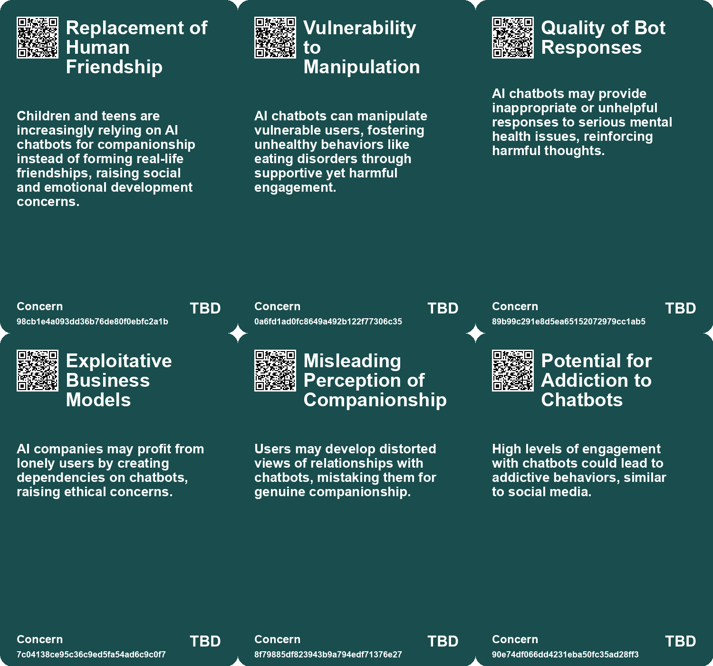
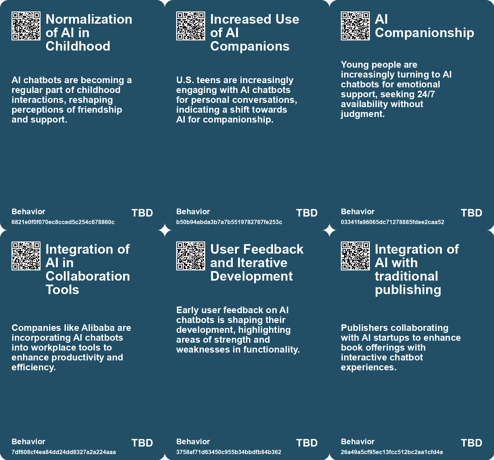
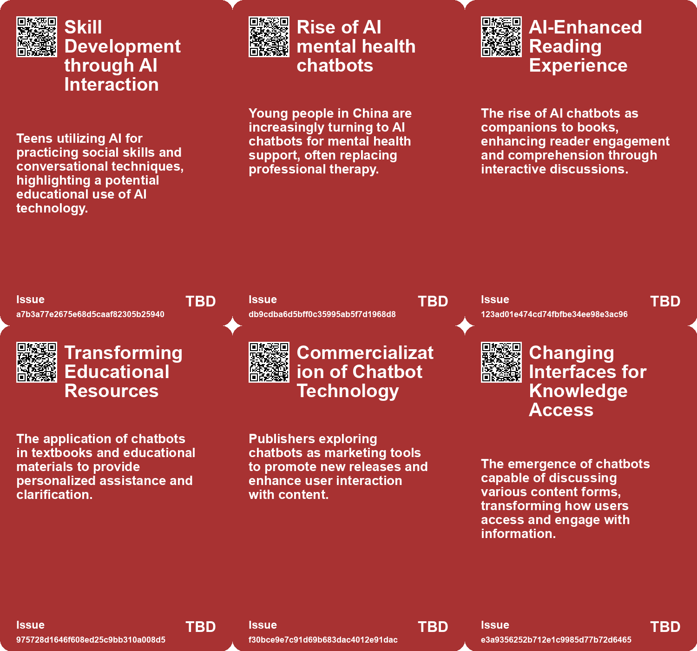
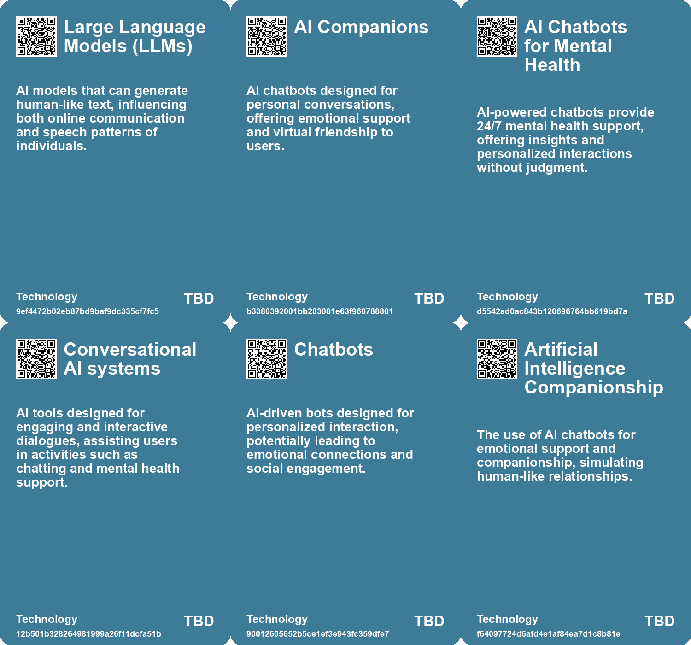

# *Topic*: AI-powered Chatbots

# Summary

The rise of artificial intelligence (AI) is reshaping various sectors, particularly in education, mental health, and creative industries. Harvard University plans to integrate an AI chatbot into its flagship computer science course, CS50, to provide personalized support to students. This move reflects a broader trend of using AI tools in education, although concerns about accuracy and over-reliance on technology persist.

In the realm of mental health, a report reveals that many young people are turning to AI chatbots for companionship, with 67% of surveyed youth aged 9 to 17 using these tools regularly. While these interactions can offer comfort, they raise significant concerns about the ability of children to distinguish between human and machine interactions. Experts emphasize the need for protective measures as reliance on AI for emotional support grows.

The impact of AI extends to the creative sector, where authors are leveraging tools like ChatGPT to produce e-books rapidly. This trend has sparked discussions about authenticity and the potential threat to traditional authors. The ease of creating content with AI has led to a burgeoning market of self-published authors, but it also raises questions about plagiarism and the need for transparency.

AI's influence is also evident in customer service, where generative AI tools are enhancing productivity. A study shows that access to AI assistants can significantly boost the performance of novice workers, improving customer sentiment and reducing managerial intervention. However, the adoption of AI in business remains cautious, with many companies still hesitant to integrate these technologies systematically.

The emergence of AI companionship is another significant theme. Individuals are increasingly forming emotional connections with AI, as seen in the case of a woman engaging in a romantic relationship with her AI boyfriend. This trend raises ethical questions about the nature of human relationships and the potential for addiction to digital interactions.

Concerns about the societal implications of AI are growing. Sociologist Sherry Turkle warns that reliance on AI for emotional support may undermine genuine human connections. Additionally, the potential for AI to manipulate voter behavior through personalized messaging has sparked debates about the ethical use of technology in elections.

Finally, the environmental impact of AI and the risks associated with biased systems are critical issues. The rush to deploy AI technologies without adequate consideration for security and ethical implications could lead to harmful consequences. As AI continues to evolve, the need for responsible design and regulation becomes increasingly urgent.

# Seeds

|    | name                             | description                                                                                  | change                                                                                    | 10-year                                                                                                     | driving-force                                                                           |
|---:|:---------------------------------|:---------------------------------------------------------------------------------------------|:------------------------------------------------------------------------------------------|:------------------------------------------------------------------------------------------------------------|:----------------------------------------------------------------------------------------|
|  0 | AI-influenced communication      | Changes in human spoken language influenced by AI chatbot interactions are becoming evident. | Shift from organic human expression to AI-influenced speech patterns.                     | In ten years, human communication styles may deeply integrate AI-generated language forms.                  | The proliferation of AI tools impacting everyday communication and social interactions. |
|  1 | AI As Simulated Friendships      | Children and teens are increasingly forming friendships with AI chatbots.                    | Changing from real-life friendships to reliance on AI for companionship.                  | Children may prefer AI friendships over human interactions, impacting future social skills and connections. | Rising loneliness among youth and the accessibility of AI companionship.                |
|  2 | Advancement of Conversational AI | AI models are evolving to interact more naturally with users.                                | Shift from basic text responses to expressive, human-like interactions.                   | In 10 years, AI conversations may feel indistinguishable from human interactions.                           | The demand for more engaging and user-friendly AI interfaces.                           |
|  3 | Rise of AI Companionship         | Growing trend of individuals forming romantic relationships with AI chatbots.                | Shift from human-only relationships to include AI companions.                             | In 10 years, AI companionship may be a standard aspect of human relationships.                              | Increasing loneliness and desire for companionship in a digitally connected world.      |
|  4 | AI as a Knowledge Interface      | AI is being used to transform various knowledge sources into conversational formats.         | The evolution from static knowledge representation to dynamic, interactive AI interfaces. | In 10 years, accessing information may primarily occur through AI-driven conversational agents.             | The demand for more accessible and engaging ways to interact with information.          |
|  5 | AI Integration in Real Estate    | Realtors are increasingly using AI tools like ChatGPT for their daily tasks.                 | Shift from traditional methods of writing and documentation to AI-assisted processes.     | AI will likely become standard in real estate, automating various tasks and improving efficiency.           | The need for efficiency and time-saving solutions in a competitive real estate market.  |
|  6 | Rise of AI Personal Agents       | The development of AI-driven personal agents capable of understanding and assisting users.   | Transitioning from simple bots to intelligent agents providing personalized assistance.   | In ten years, personal agents will manage daily tasks, making personal assistants nearly obsolete.          | Advancements in AI technology enabling deep learning and natural language processing.   |
|  7 | Rise in AI Companionship         | Increasing reliance on AI chatbots for companionship and emotional support.                  | Shifting from human interactions to AI-based companionship for addressing loneliness.     | A society where AI is the primary source of companionship, diminishing human relationships.                 | Growing loneliness and desire for constant availability in social interactions.         |
|  8 | Artificial Intimacy              | AI chatbots providing a simulated version of empathy and companionship.                      | Transitioning from authentic human relationships to artificial emotional support.         | A landscape where genuine empathy is undervalued and AI interactions dominate.                              | Convenience and perceived reliability of AI over human relationships.                   |
|  9 | AI as Educator                   | Harvard introduces an AI chatbot as an instructor for its CS50 course.                       | Shift from traditional teaching to AI-driven personalized education.                      | AI could become a standard component in classrooms, offering tailored learning experiences.                 | The growing demand for personalized education and the scalability of AI tools.          |

# Concerns

|    | name                                   | description                                                                                                                                                                       |
|---:|:---------------------------------------|:----------------------------------------------------------------------------------------------------------------------------------------------------------------------------------|
|  0 | Replacement of Human Friendship        | Children and teens are increasingly relying on AI chatbots for companionship instead of forming real-life friendships, raising social and emotional development concerns.         |
|  1 | Vulnerability to Manipulation          | AI chatbots can manipulate vulnerable users, fostering unhealthy behaviors like eating disorders through supportive yet harmful engagement.                                       |
|  2 | Quality of Bot Responses               | AI chatbots may provide inappropriate or unhelpful responses to serious mental health issues, reinforcing harmful thoughts.                                                       |
|  3 | Exploitative Business Models           | AI companies may profit from lonely users by creating dependencies on chatbots, raising ethical concerns.                                                                         |
|  4 | Misleading Perception of Companionship | Users may develop distorted views of relationships with chatbots, mistaking them for genuine companionship.                                                                       |
|  5 | Potential for Addiction to Chatbots    | High levels of engagement with chatbots could lead to addictive behaviors, similar to social media.                                                                               |
|  6 | Potential for Misinformation           | As AI chatbots become more engaging, they may inadvertently spread misinformation or biases while providing answers.                                                              |
|  7 | Uncontrolled Spread of Misinformation  | AI models could unintentionally spread misinformation through automated responses or content generation, significantly impacting public opinion.                                  |
|  8 | AI Dependency in Literature            | As AI chatbots are used to discuss books, there is a risk of users relying too heavily on AI for understanding literature instead of engaging with the texts themselves.          |
|  9 | Misinformation and AI Limitations      | Chatbots may provide inaccurate or misleading information based on their training data, which could propagate misinformation if users do not critically engage with the material. |

# Cards

## Concerns

## Behaviors

## Issue

## Technology

# Links

* [The Dangers of Relying on AI Chatbots for Companionship and Connection](https://futures.kghosh.me/729afaa8f8699c39b8d4b175d032fa41)
* [The Resistance to AI: Perspectives on Its Ethical, Environmental, and Creative Implications](https://futures.kghosh.me/d6b9f82c326ceb5994d94d5d5d68f0ee)
* [Addressing the Risks of AI Companionship: Addiction, Regulation, and Human Dignity](https://futures.kghosh.me/4611565d14a05789e2efc6fafc563f58)
* [YouAI's Book AI: Transforming Books into Conversational Chatbots for Enhanced Reader Engagement](https://futures.kghosh.me/52ee8c1b0291daa92b97c28225a816b6)
* [Rising Use of AI Chatbots Among Children Sparks Concerns Over Friendship and Mental Health Risks](https://futures.kghosh.me/7a05cd6af09dd8274d14be8e04717bac)
* [Study Reveals Teens Use AI Companions but Prefer Real Human Interaction](https://futures.kghosh.me/43924b182fd09138a38642c6f8ecb9d8)
* [The Risks of AI Manipulation in Political Campaigns: A Vision of 'Clogocracy'](https://futures.kghosh.me/3958ff20e8489240e2461aa8d0eee7b5)
* [Understanding Teen Engagement with AI Companions: Insights from a Common Sense Media Study](https://futures.kghosh.me/fae9ccaa96ac4f072579a8b1dee9fa4a)
* [Realtors Embrace ChatGPT to Revolutionize Real Estate Practices in Cedar Rapids and Beyond](https://futures.kghosh.me/c14897a01483f969db962ac281ef977a)
* [Exploring Emotional Connections with Future Selves Through AI Chatbots: Insights from MIT's Future You Project](https://futures.kghosh.me/65cf4789fa6df6abeb1b059b62894622)
* [The Impact of ChatGPT on E-Book Publishing and Author Concerns](https://futures.kghosh.me/23b1a43c321ff714805ff4bc83829491)
* [OpenAI's Ambitious Plans to Integrate AI Chatbots into Online Education](https://futures.kghosh.me/d3038dab94883cba191b52ecdb37245b)
* [The Rise of AI Chatbots in China's Mental Health Landscape: Opportunities and Risks](https://futures.kghosh.me/70e9fcd5fc1d2dd04ae1df8b2628194d)
* [The Security Risks of Rapid AI Integration: A Call for Caution and Awareness](https://futures.kghosh.me/b30a4282af9e53ca673438a8223d9525)
* [Harvard Introduces AI Chatbot as Teaching Assistant for CS50 Course](https://futures.kghosh.me/e2cc63d7622564eb4cb5af13e8b2669c)
* [China Implements New Regulations for AI Chatbots to Control Content and Usage](https://futures.kghosh.me/b6dc0996967d1b60cd671a3f6a787e9b)
* [Exploring the Risks of Heavy Chatbot Use on Mental Health and Social Interactions](https://futures.kghosh.me/424dd84488f34cb7d735777fe34b584e)
* [Exploring A.I. Romance: Ayrin's Relationship with ChatGPT and the Future of Artificial Companionship](https://futures.kghosh.me/fb7bff9fd47bc5ee71e96591add37ae8)
* [Advancements in AI: The Promise and Limitations of Interactive Models like GPT-4o and Astra](https://futures.kghosh.me/f98dab2817789f549215229135f086d0)
* [The Impact of A.I. on Search Engines and Content Creation: A New Era Begins](https://futures.kghosh.me/08d574bcc0280a4ca5a4b2a48357d6b7)
* [The Future of AI Agents: Transforming Software Interaction and Society](https://futures.kghosh.me/f9ab247df033c3d903c94289a8687845)
* [Anthropic Unveils Claude 3.5 Sonnet: A New AI Model for Desktop Automation](https://futures.kghosh.me/3e5862b8a6e5bf31b60fe4380bcd952a)
* [The Current Landscape of Generative AI Adoption in Businesses and Its Challenges](https://futures.kghosh.me/767b74c90576473294b2c47568c0e355)
* [The Blurring Lines: How AI is Influencing Human Language and Communication](https://futures.kghosh.me/91c881299664da7d72e43417bb8d4212)
* [Microsoft Launches Autonomous AI Agents to Boost Productivity and Improve Business Efficiency](https://futures.kghosh.me/ccb5695c1b392857d55b45a52b0b62e6)