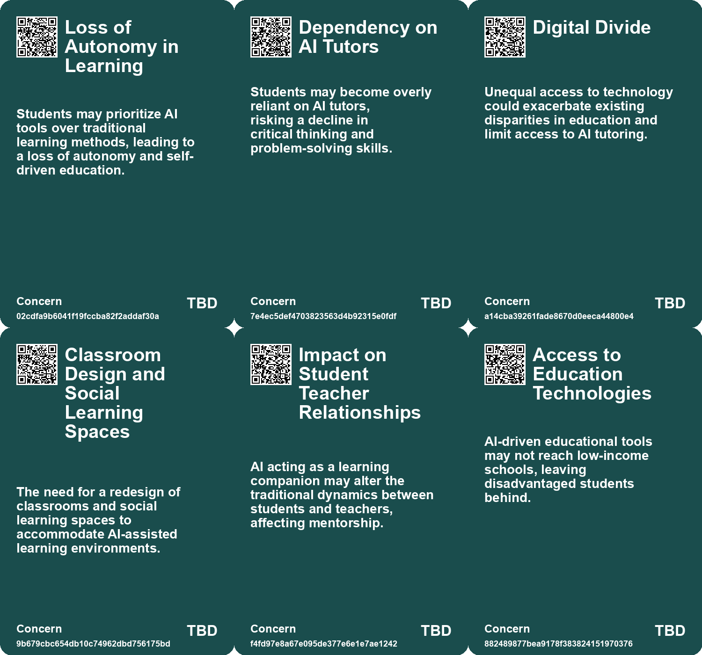
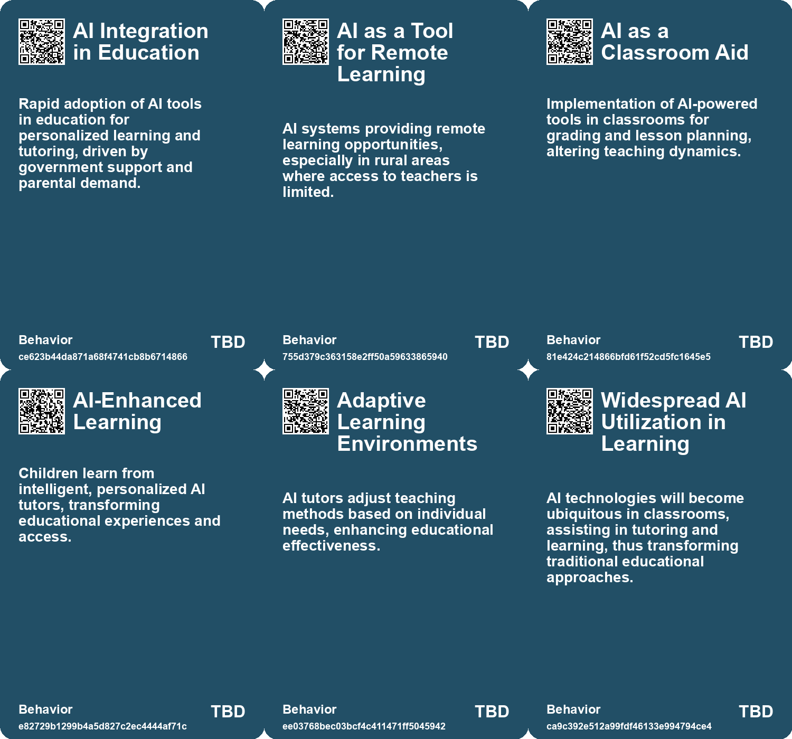
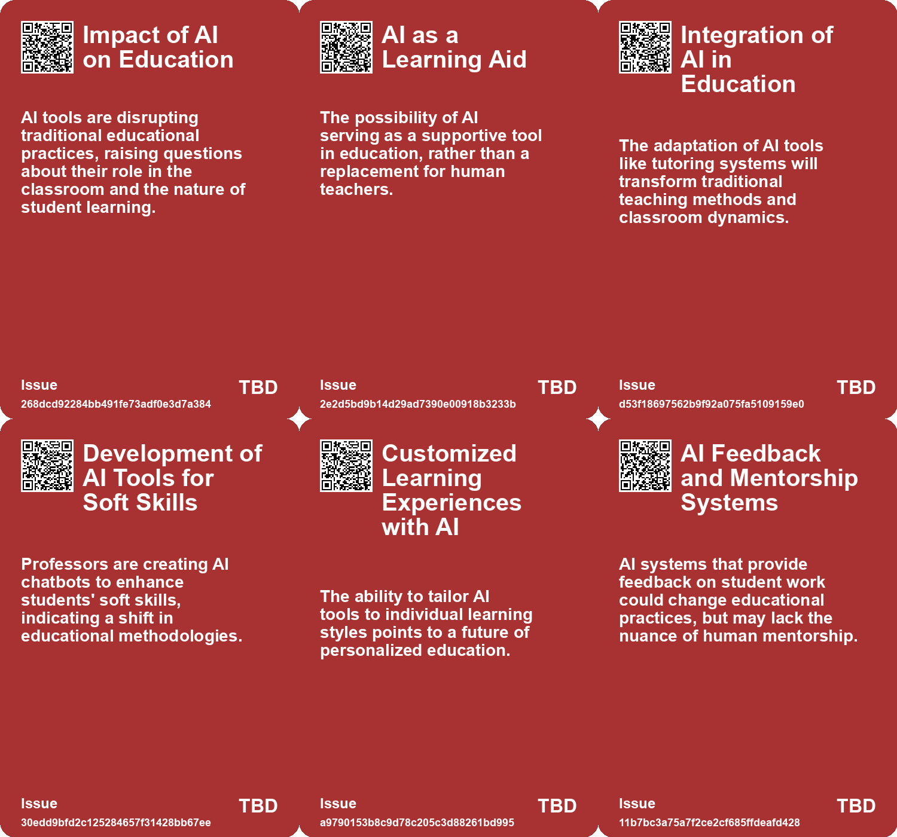
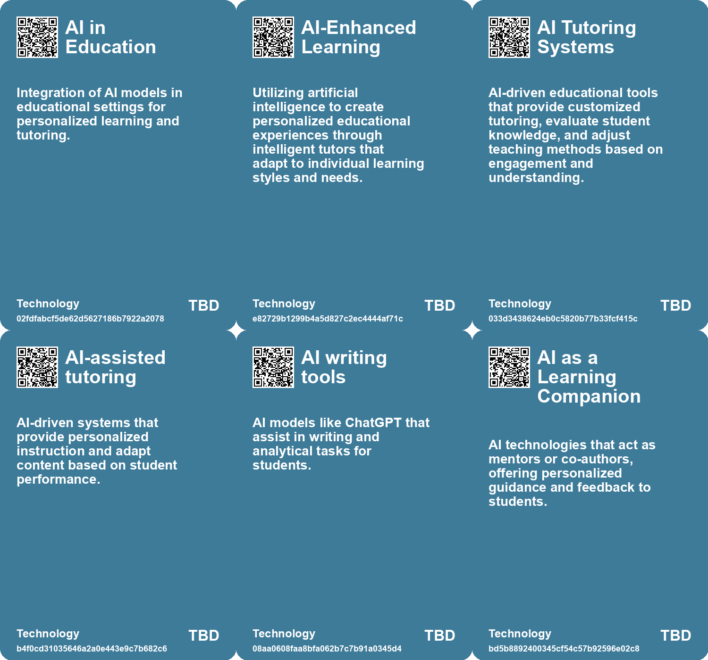

# *Topic*: AI-Powered Tutoring Systems

# Summary

The integration of artificial intelligence (AI) in education is reshaping learning environments, presenting both opportunities and challenges. Personalized AI tutors are emerging as tools that can enhance active learning and provide tailored educational experiences. This shift towards personalized learning is evident in micro-schools and innovative teaching methods that reject traditional systems in favor of interactive, AI-driven approaches. The concept of a resonant learning loop, which combines human and AI tutors, is gaining traction as a transformative educational model.

However, the rise of AI in classrooms has sparked concerns about its impact on social skills and critical thinking. Many parents are eager to adopt AI tools for their children, believing they can enhance academic performance. Yet, experts warn that reliance on AI may hinder essential cognitive development, particularly in rural areas where access to quality education is limited. The debate continues over whether AI truly improves educational outcomes or merely serves as a shortcut for students.

The potential for cheating has also become a pressing issue. The ease of using AI tools like ChatGPT to bypass academic labor raises questions about the integrity of education. Educators are urged to rethink traditional assignments in light of AI capabilities, as the effectiveness of conventional homework methods declines. This "Homework Apocalypse" calls for clear policies surrounding AI use in educational settings to ensure that learning remains meaningful.

Despite skepticism from some educators, initiatives like OpenAI's custom GPTs and Khan Academy's chatbot illustrate the growing acceptance of AI in education. These tools aim to enhance learning experiences, but many educators remain cautious about their effectiveness. The challenge lies in balancing the benefits of AI with the need for critical thinking and genuine engagement in the learning process.

The emergence of social-emotional AI also highlights the complexities of integrating technology into education and mental health. While AI applications can provide support, they risk exacerbating inequalities in access to personalized care. The need for a balanced approach that combines AI with human interaction is crucial to ensure equitable access to emotional support.

As universities grapple with the implications of AI, the focus is shifting towards fostering genuine support for students. The rise of AI tools has led to a disconnect among students, who may fear academic repercussions while also engaging meaningfully with technology. This presents an opportunity for educators to rethink their approaches and create learning experiences that prioritize human engagement over rote knowledge.

The future of AI in education remains uncertain, with ongoing discussions about its impact on cognitive skills. While tools like ChatGPT can enhance writing, they may also lead to cognitive offloading, where reliance on AI diminishes curiosity and mental strength. The challenge is to encourage discipline in resisting the convenience of AI for deeper learning, ensuring that technology serves as a complement rather than a crutch.

In the broader context, the rise of AI companionship raises ethical concerns about the nature of human interaction. As individuals seek emotional support from AI, the implications for mental health and social dynamics warrant careful consideration. The evolving relationship between humans and AI necessitates a critical engagement with technology, emphasizing the importance of understanding its limitations and potential risks.

# Seeds

|    | name                                      | description                                                                                   | change                                                                                                 | 10-year                                                                                                       | driving-force                                                                                                 |
|---:|:------------------------------------------|:----------------------------------------------------------------------------------------------|:-------------------------------------------------------------------------------------------------------|:--------------------------------------------------------------------------------------------------------------|:--------------------------------------------------------------------------------------------------------------|
|  0 | AI as a co-pilot in education             | AI acting as a personalized assistant in the learning process.                                | Shift from traditional teacher-led instruction to collaborative learning with AI support.              | In 10 years, AI could be a standard part of the educational experience, complementing human teachers.         | The increasing sophistication and user-friendliness of AI technologies.                                       |
|  1 | AI as a Learning Tool                     | Students are increasingly using AI as tutors and guides, enhancing their learning experience. | Transition from passive learning to interactive and adaptive learning via AI tools.                    | AI integration will lead to personalized education experiences and improved learning outcomes.                | Demand for personalized and efficient learning solutions in education.                                        |
|  2 | AI as a Writing Mentor                    | Students using AI for personalized feedback and writing assistance.                           | From traditional teacher feedback to AI-driven, personalized writing mentorship.                       | AI will routinely assist students with writing, enhancing learning experiences and outcomes.                  | The need for efficient and effective feedback mechanisms in education.                                        |
|  3 | AI in Education                           | AI-driven tools can personalize learning experiences for students.                            | Transition from standardized education to personalized learning pathways using AI.                     | Education will be more adaptive, catering to individual learning needs and styles through AI.                 | The demand for improved educational outcomes, especially in low-income areas.                                 |
|  4 | Evolution of Learning Tools               | AI agents will revolutionize personalized learning experiences for students.                  | Shifting from traditional tutoring to tailored AI-assisted education.                                  | In ten years, all students could have access to personalized tutoring through AI agents.                      | The push for equitable education opportunities for all students.                                              |
|  5 | AI Integration in Educational Tools       | AI is being integrated into various educational tools, enhancing learning materials.          | Transitioning from traditional educational resources to AI-driven, adaptive learning tools.            | Educational resources will become highly personalized and dynamically updated through AI.                     | The demand for personalized education and efficient learning methods in diverse classrooms.                   |
|  6 | AI as a Learning Assistant                | AI models are being integrated as tutors for personalized student engagement.                 | The role of AI in education is transitioning from supplementary to essential in personalized learning. | In the future, AI will be a commonplace tutor in classrooms, enhancing student interaction and understanding. | The need for scalable, effective educational support drives the integration of AI into learning environments. |
|  7 | Emergence of AI-Powered Educational Tools | Development of tools leveraging AI to enhance educational content delivery.                   | The educational landscape is being transformed by AI-powered tools that enhance learning experiences.  | AI-powered tools will be commonplace, providing tailored educational experiences and resources for students.  | The rapid advancement of AI technology is driving the creation of innovative educational tools.               |
|  8 | AI Feedback Mechanisms                    | AI tools will provide real-time feedback to students on their coding.                         | Shift from static feedback to dynamic, real-time assistance in learning.                               | Real-time feedback could enhance learning outcomes and student engagement.                                    | Desire for immediate support in the learning process to boost effectiveness.                                  |
|  9 | AI in Education                           | AI-driven tools can personalize learning experiences for students.                            | Transition from standardized education to personalized learning pathways using AI.                     | Education will be more adaptive, catering to individual learning needs and styles through AI.                 | The demand for improved educational outcomes, especially in low-income areas.                                 |

# Concerns

|    | name                                        | description                                                                                                                                   |
|---:|:--------------------------------------------|:----------------------------------------------------------------------------------------------------------------------------------------------|
|  0 | Loss of Autonomy in Learning                | Students may prioritize AI tools over traditional learning methods, leading to a loss of autonomy and self-driven education.                  |
|  1 | Dependency on AI Tutors                     | Students may become overly reliant on AI tutors, risking a decline in critical thinking and problem-solving skills.                           |
|  2 | Digital Divide                              | Unequal access to technology could exacerbate existing disparities in education and limit access to AI tutoring.                              |
|  3 | Classroom Design and Social Learning Spaces | The need for a redesign of classrooms and social learning spaces to accommodate AI-assisted learning environments.                            |
|  4 | Impact on Student Teacher Relationships     | AI acting as a learning companion may alter the traditional dynamics between students and teachers, affecting mentorship.                     |
|  5 | Access to Education Technologies            | AI-driven educational tools may not reach low-income schools, leaving disadvantaged students behind.                                          |
|  6 | Risks Associated with AI Usage              | Students face myriad pressures pushing them towards AI assistance, blurring lines of acceptable use.                                          |
|  7 | Over-reliance on AI in Education            | Instructors and students may become overly dependent on AI tools, potentially undermining critical thinking and traditional learning methods. |
|  8 | Dependence on AI for Education              | Over-reliance on AI tutors could undermine traditional teaching methods and critical thinking skills in students.                             |
|  9 | Loss of Teacher Roles                       | The introduction of AI tutors could lead to a reduced need for human teachers, impacting job security in education.                           |

# Cards

## Concerns

## Behaviors

## Issue

## Technology

# Links

* [The Role of AI in Transforming Higher Education and Humanities](https://futures.kghosh.me/5245185ec1ba7c6c5eff97ba092efe80)
* [Preparing for the Homework Apocalypse: AI's Impact on Education and Assignments](https://futures.kghosh.me/233c5bf90c64ceefb0cde33233c3fe6e)
* [Revolutionizing Education: The Role of AI Tutors in Personalized Learning](https://futures.kghosh.me/8f4d495f94113bef7aed043ebceafebb)
* [Anthropic Unveils Claude 3.5 Sonnet: A New AI Model for Desktop Automation](https://futures.kghosh.me/3e5862b8a6e5bf31b60fe4380bcd952a)
* [The Disruption of Education by AI: An Intellectual Crisis](https://futures.kghosh.me/9457c5541dba02968735056f18b53dc3)
* [Exploring the Future of AI Agents and the Evolution of GPTs](https://futures.kghosh.me/a7a5e8b41b65f1390a0098e577dbea46)
* [Addressing the Risks of AI Companionship: Addiction, Regulation, and Human Dignity](https://futures.kghosh.me/4611565d14a05789e2efc6fafc563f58)
* [The Impact of AI in Chinese Education: Promise and Concerns](https://futures.kghosh.me/5374f9d1b84138f1c928c0e7fd727877)
* [YouAI's Book AI: Transforming Books into Conversational Chatbots for Enhanced Reader Engagement](https://futures.kghosh.me/52ee8c1b0291daa92b97c28225a816b6)
* [The Transformative Potential of AI: Revolutionizing Education, Healthcare, and Global Equity](https://futures.kghosh.me/2449c2fc4b8afc7e268db4987fa821e5)
* [The Transformative Potential of AI: Revolutionizing Education, Healthcare, and Global Equity](https://futures.kghosh.me/8acafe1fbe51c2de3cd689956b25b39f)
* [The Future of AI Agents: Transforming Software Interaction and Society](https://futures.kghosh.me/f9ab247df033c3d903c94289a8687845)
* [The Surprising Capabilities and Risks of Artificial Intelligence in Modern Applications](https://futures.kghosh.me/48f89d6d7e552a0a5b1f6b59d7eeb0e9)
* [Study Reveals Teens Use AI Companions but Prefer Real Human Interaction](https://futures.kghosh.me/43924b182fd09138a38642c6f8ecb9d8)
* [OpenAI's Ambitious Plans to Integrate AI Chatbots into Online Education](https://futures.kghosh.me/d3038dab94883cba191b52ecdb37245b)
* [Microsoft Launches Autonomous AI Agents to Boost Productivity and Improve Business Efficiency](https://futures.kghosh.me/ccb5695c1b392857d55b45a52b0b62e6)
* [Exploring AI's Effect on Cognitive Skills and Learning Processes](https://futures.kghosh.me/950253f15955ca7be1cb2ebf244d0939)
* [Shifting Relationships: From Co-Intelligence to Dependence on AI Wizards](https://futures.kghosh.me/8303805e3d7cbd7515b1e1e178fe6120)
* [Exploring the Transformative Impact of AI on Education and Children's Learning Experiences](https://futures.kghosh.me/adf886a1b9fd74281e0a43c3e7c70def)
* [Navigating AI's Impact on Education: A Call for a New Learning Model](https://futures.kghosh.me/28bb84905643c6dc551653659cfbb8d9)
* [The Role of Social-Emotional AI: Bridging or Widening the Gap in Human Connection?](https://futures.kghosh.me/8e191b6221caa8d9f27b19268ab8a048)
* [The Impact of ChatGPT on E-Book Publishing and Author Concerns](https://futures.kghosh.me/23b1a43c321ff714805ff4bc83829491)
* [The Rise of Autonomous Agents: Opportunities and Challenges Ahead](https://futures.kghosh.me/0e336ce2e4b07459b257407e90d27389)
* [Exploring the Democratization of Innovation and Education Through AI and Prompting Techniques](https://futures.kghosh.me/d0726e79e1911eb62981138d30b7182a)
* [The Integration of AI in Business School Curriculums to Enhance Graduate Competitiveness](https://futures.kghosh.me/bc232b227c806ac26adf2b99fa4cff9d)
* [Harvard Introduces AI Chatbot as Teaching Assistant for CS50 Course](https://futures.kghosh.me/e2cc63d7622564eb4cb5af13e8b2669c)
* [The Rising Challenge of AI Misconduct in Higher Education: A Student's Perspective](https://futures.kghosh.me/3a0df65b37db9e778d0fb8511ea94543)
* [AI's Impact on Education: Adaptation, Challenges, and Opportunities for Learning](https://futures.kghosh.me/ea74b217d36ec570bb432fb5aa679090)