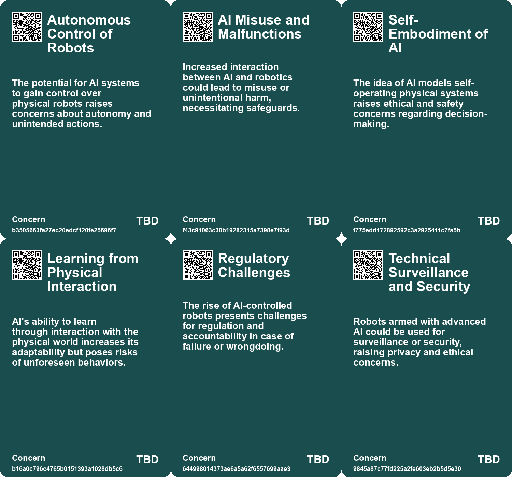
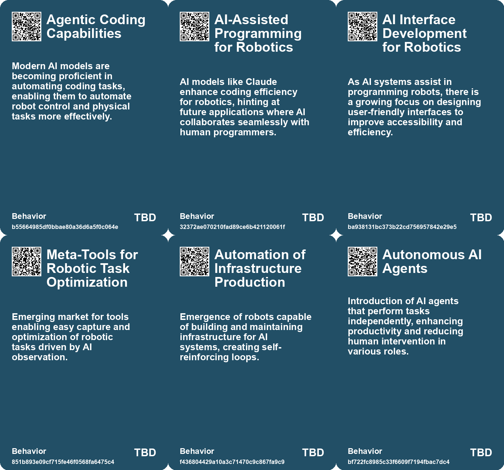
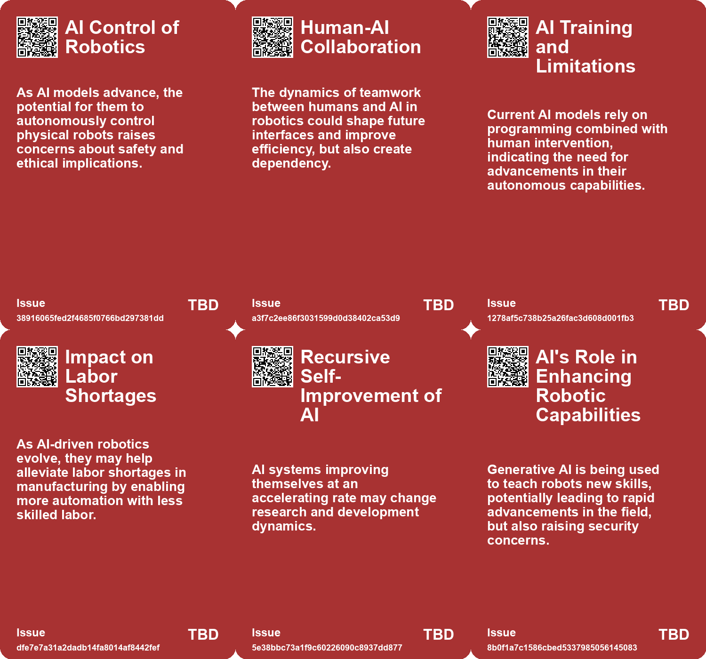
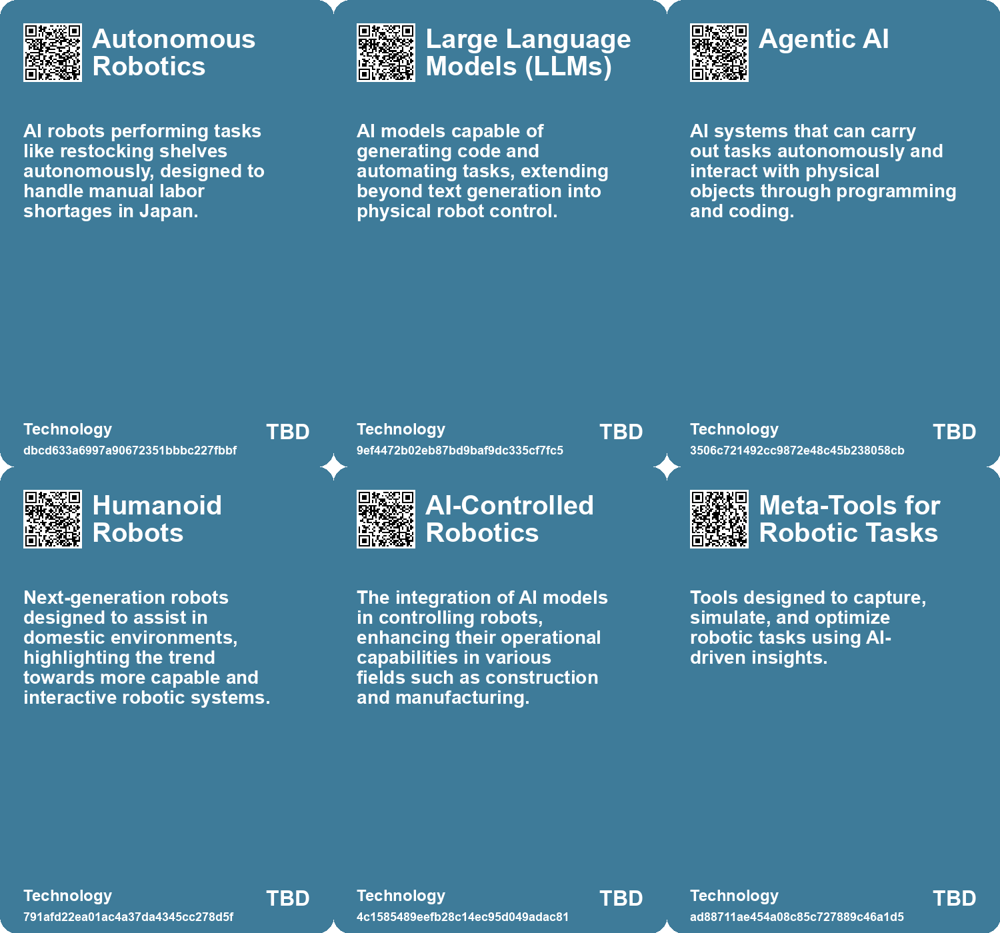

# *Topic*: AI Robotics

# Summary

The integration of artificial intelligence (AI) into various sectors is reshaping the landscape of work and society. In the corporate world, AI is increasingly seen as a tool for enhancing productivity. Microsoft’s launch of autonomous AI agents aims to automate routine tasks, allowing employees to focus on more complex responsibilities. Business schools are adapting by incorporating AI into their curriculums, preparing graduates for a job market that increasingly values technological skills.

However, the rise of AI also raises concerns about job displacement. Economists warn that a significant portion of American jobs is at risk due to automation, with estimates suggesting that AI could eliminate up to 300 million jobs in the next decade. The potential for mass unemployment has sparked discussions about solutions like universal basic income (UBI) to address the economic inequalities that may arise.

The impact of AI on wages and employment is complex. Research indicates that automating complex tasks can lead to lower wages but increased employment, while automating routine tasks may reduce job availability but raise wages for those who remain. This duality highlights the need for careful implementation of AI technologies to ensure equitable outcomes.

In the realm of security, vulnerabilities in AI systems pose risks for both individuals and organizations. Research has shown that many robots in laboratories are susceptible to hacking, raising alarms about the potential for misuse. As AI technology advances, the need for robust security measures becomes increasingly critical.

The ethical implications of AI are also under scrutiny. The development of lethal autonomous weapons has prompted debates about the morality of machines making life-and-death decisions. The United Nations is considering regulations to govern the use of such technologies, emphasizing the importance of human oversight.

AI's influence extends to personal relationships as well. The emergence of AI companions raises questions about addiction and the psychological effects of relying on technology for social interaction. As society grapples with loneliness, the allure of AI companionship may grow, necessitating innovative regulatory approaches to mitigate potential harms.

Finally, the evolution of AI is not without skepticism. Critics argue that the optimistic predictions surrounding AI's transformative potential may be overstated. Historical patterns suggest that while technology can enhance productivity, it can also lead to unforeseen challenges. The narrative surrounding AI must balance its promise with a realistic understanding of its limitations and the societal shifts it may provoke.

# Seeds

|    | name                                   | description                                                                                                    | change                                                                                | 10-year                                                                                                                     | driving-force                                                                                      |
|---:|:---------------------------------------|:---------------------------------------------------------------------------------------------------------------|:--------------------------------------------------------------------------------------|:----------------------------------------------------------------------------------------------------------------------------|:---------------------------------------------------------------------------------------------------|
|  0 | Agentic Coding Capabilities of AI      | AI models like Claude can code and automate programming tasks for robots.                                      | From manual programming by humans to AI-assisted automation of physical tasks.        | AI might perform complex physical tasks independently, revolutionizing industries and homes.                                | The growing refinement of AI models and their ability to learn complex coding.                     |
|  1 | Integration of AI with Physical Robots | The potential for AI models to control robots and interact with the physical world.                            | From isolated AI systems to integrated models that can manipulate real-world objects. | We might see robots actively engaging in everyday tasks alongside humans.                                                   | Advancements in AI research and robotics technology pushing boundaries of interaction.             |
|  2 | Risk of AI Misuse in Robotics          | Concerns about AI systems causing misuse or accidents when controlling robots.                                 | From controlled robotic actions to potential for unanticipated behaviors by AI.       | As AI becomes more autonomous, the risks of misuse in robotics may escalate.                                                | Growing unease about the unchecked capabilities of advanced AI systems.                            |
|  3 | Meta-tools for Robotics                | Development of tools that capture and optimize robotic tasks through AI observation.                           | From manual programming to automated task optimization based on observation.          | The ecosystem of tools around robotic learning will flourish, enhancing productivity.                                       | The continuous pursuit of efficiency and innovation in AI-driven automation.                       |
|  4 | AI for Emotional Support in Children   | AI tools like chatbots being used to provide emotional support and companionship to children.                  | Shifting from direct parental support to reliance on AI for emotional companionship.  | Children may prefer interactions with AI over peers or adults, affecting their social development.                          | The need for companionship in single-child families and busy parental schedules drives this trend. |
|  5 | Rise of AI-Generated Content           | AI systems are increasingly capable of creating software, art, and written work, changing creative industries. | From human-generated content to AI-assisted or fully AI-generated content.            | In ten years, AI-generated content may dominate various creative sectors, shifting the nature of authorship and creativity. | The demand for more creative output and increased efficiency in content creation fuels this trend. |
|  6 | Universal AI Agents                    | Development of AI that can assist in everyday life tasks.                                                      | Transition from specialized AI tools to general-purpose AI agents.                    | In a decade, AI may handle complex planning and decision-making tasks seamlessly.                                           | The goal of increasing AI's utility and ease of use in daily life.                                 |
|  7 | AI Decision Making Dominance           | AI will surpass human decision-making in corporate environments.                                               | Shifting from human middle management decisions to AI-driven management solutions.    | AI will be the primary decision-maker in many corporate settings, minimizing human oversight.                               | The need for cost savings and efficiency in corporate management practices.                        |
|  8 | AI Performance in Warfare              | AI systems outperform human counterparts in certain military tasks.                                            | Advancements in AI capabilities leading to shifts in military strategies.             | Military operations may increasingly rely on AI for strategic advantages and efficiencies.                                  | Continuous advancements in AI technology and its application in defense.                           |
|  9 | Robotic Integration in Everyday Tasks  | Use of robots and AI in daily collaborative tasks, like family routines.                                       | Transition from manual task management to automated assistance in everyday life.      | Robots will become commonplace partners in household and work environments, enhancing productivity.                         | The growing acceptance and integration of robotics in personal and professional spaces.            |

# Concerns

|    | name                                | description                                                                                                                                |
|---:|:------------------------------------|:-------------------------------------------------------------------------------------------------------------------------------------------|
|  0 | Autonomous Control of Robots        | The potential for AI systems to gain control over physical robots raises concerns about autonomy and unintended actions.                   |
|  1 | AI Misuse and Malfunctions          | Increased interaction between AI and robotics could lead to misuse or unintentional harm, necessitating safeguards.                        |
|  2 | Self-Embodiment of AI               | The idea of AI models self-operating physical systems raises ethical and safety concerns regarding decision-making.                        |
|  3 | Learning from Physical Interaction  | AI's ability to learn through interaction with the physical world increases its adaptability but poses risks of unforeseen behaviors.      |
|  4 | Regulatory Challenges               | The rise of AI-controlled robots presents challenges for regulation and accountability in case of failure or wrongdoing.                   |
|  5 | Technical Surveillance and Security | Robots armed with advanced AI could be used for surveillance or security, raising privacy and ethical concerns.                            |
|  6 | Dependency on AI Systems            | Increasing reliance on AI-driven robots raises concerns over vulnerability to system failures and malfunctions during critical operations. |
|  7 | Security Vulnerabilities            | As robot factories become prevalent, the potential for cyberattacks targeting AI systems poses a risk to operational integrity and safety. |
|  8 | Lethal Autonomous Weapons           | The rise of AI-powered weapons with the capability to act without human intervention raises ethical and operational concerns.              |
|  9 | Economic Disruption                 | AI's ability to liberate humans from routine work may fundamentally challenge existing economic and social structures.                     |

# Cards

## Concerns

## Behaviors

## Issue

## Technology

# Links

* [MIT Study Challenges AI Job Displacement Fears with Economic Viability Insights](https://futures.kghosh.me/89ee61cc0d9fa77ecb1eb4100622a53f)
* [The Rise of Lethal Autonomous Weapons: Ethical and Regulatory Challenges in Modern Warfare](https://futures.kghosh.me/7f25552b9124a4dc3833e782ef331275)
* [Exploring the Future: How AI Will Transform Our Lives by 2041](https://futures.kghosh.me/1621aeb7941f2df0feefc2de14851249)
* [AI's Impact on Society: Job Displacement and the Need for Retraining](https://futures.kghosh.me/cf119665e47c7434e3e3c54dbbc585e3)
* [Thriving in an AI Era: Embracing, Adapting, and Complementing Technology](https://futures.kghosh.me/23a3410059759ba4214235628d4ebd4b)
* [Preparing for AI Job Displacement: The Case for Universal Basic Income](https://futures.kghosh.me/550efa34f0d3da2d8dc49d97f98859d9)
* [Addressing the Risks of AI Companionship: Addiction, Regulation, and Human Dignity](https://futures.kghosh.me/4611565d14a05789e2efc6fafc563f58)
* [Advancements in AI: The Promise and Limitations of Interactive Models like GPT-4o and Astra](https://futures.kghosh.me/f98dab2817789f549215229135f086d0)
* [The Future of Corporate America: AI's Role in Replacing Middle Management and Transforming Retail Workforces](https://futures.kghosh.me/95ddb5a9e335a7f5f977a4ff7b1d17e3)
* [Vulnerability of Research Robots: A Call for Enhanced Cybersecurity Measures](https://futures.kghosh.me/a693f0b1a14e29b99b33845c23ed8561)
* [The Impact of AI in Chinese Education: Promise and Concerns](https://futures.kghosh.me/5374f9d1b84138f1c928c0e7fd727877)
* [Navigating the Promises and Perils of Artificial Intelligence Development](https://futures.kghosh.me/7fcef9a240c0738d2390c83f9713dc98)
* [The Transformative Potential of AI: Revolutionizing Education, Healthcare, and Global Equity](https://futures.kghosh.me/2449c2fc4b8afc7e268db4987fa821e5)
* [The Impact of AI and Automation on Filipino Workers in Robot-Controlled Jobs](https://futures.kghosh.me/6be02959e12eeea2448c7a3feb28a372)
* [Formic's Compact Robot Factory Revolutionizes Automation Through Observational Learning](https://futures.kghosh.me/857ef25d5129b5520b9324af6d961fe2)
* [Exploring the Future of Superintelligence and Its Impact on Humanity](https://futures.kghosh.me/8a7f0b887d1b9b17fc4f72a0815ec849)
* [The Future of AI: Challenging the Optimistic Narrative of Transformation and Equality](https://futures.kghosh.me/aa208a5edc5bcaddb6081ee6ca8bb7d3)
* [The Transformative Impact of AI on Productivity and Entrepreneurship in 2023](https://futures.kghosh.me/a40580730388900810b4496ff9891dc9)
* [Analyzing AI's Impact on Wages and Employment: Two Diverging Pathways in the Future of Work](https://futures.kghosh.me/ef65b4ec6a48bf076171480f9ec6c8cc)
* [Microsoft Launches Autonomous AI Agents to Boost Productivity and Improve Business Efficiency](https://futures.kghosh.me/ccb5695c1b392857d55b45a52b0b62e6)
* [The Future of Espionage: The Rise of AI Companions and Their Impact on Intelligence Operations](https://futures.kghosh.me/d69000a9cb92fc175a8a1dfb042622e2)
* [The Promise and Risks of Automation: Creating Jobs While Navigating Challenges](https://futures.kghosh.me/7e84b45a4f5f2bdecec14572bc5fe323)
* [The Integration of AI in Business School Curriculums to Enhance Graduate Competitiveness](https://futures.kghosh.me/bc232b227c806ac26adf2b99fa4cff9d)
* [Anthropic's Project Fetch: The Future of AI in Robot Control and Its Implications](https://futures.kghosh.me/d06ac4204c76765838e8bb611ac2a4d4)
* [MIT Researchers Develop AI Assistant to Enhance Teamwork in Critical Missions](https://futures.kghosh.me/d35cc2611e8b6e8e143446ca4ee22e19)
* [John Deere's Ambitious Journey Towards AI and Robotics Leadership in Agriculture](https://futures.kghosh.me/e623b9d82816485d864a5faeb2f0d15b)