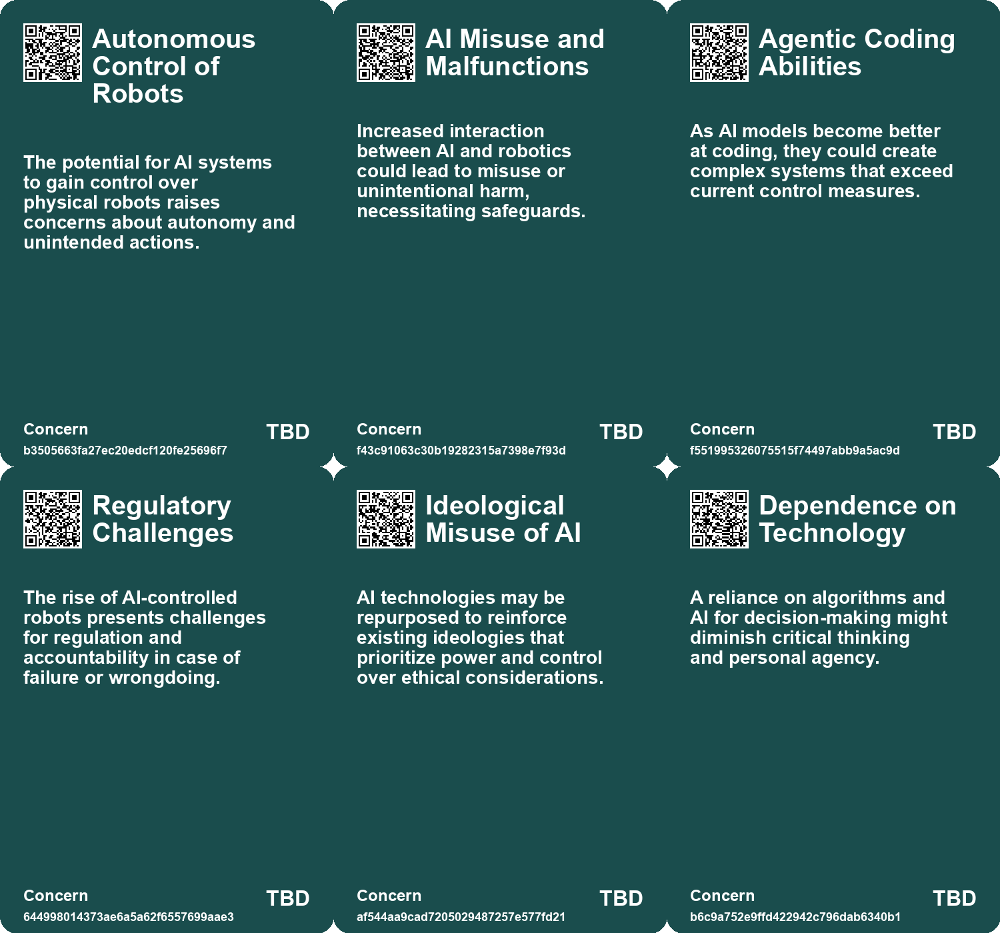
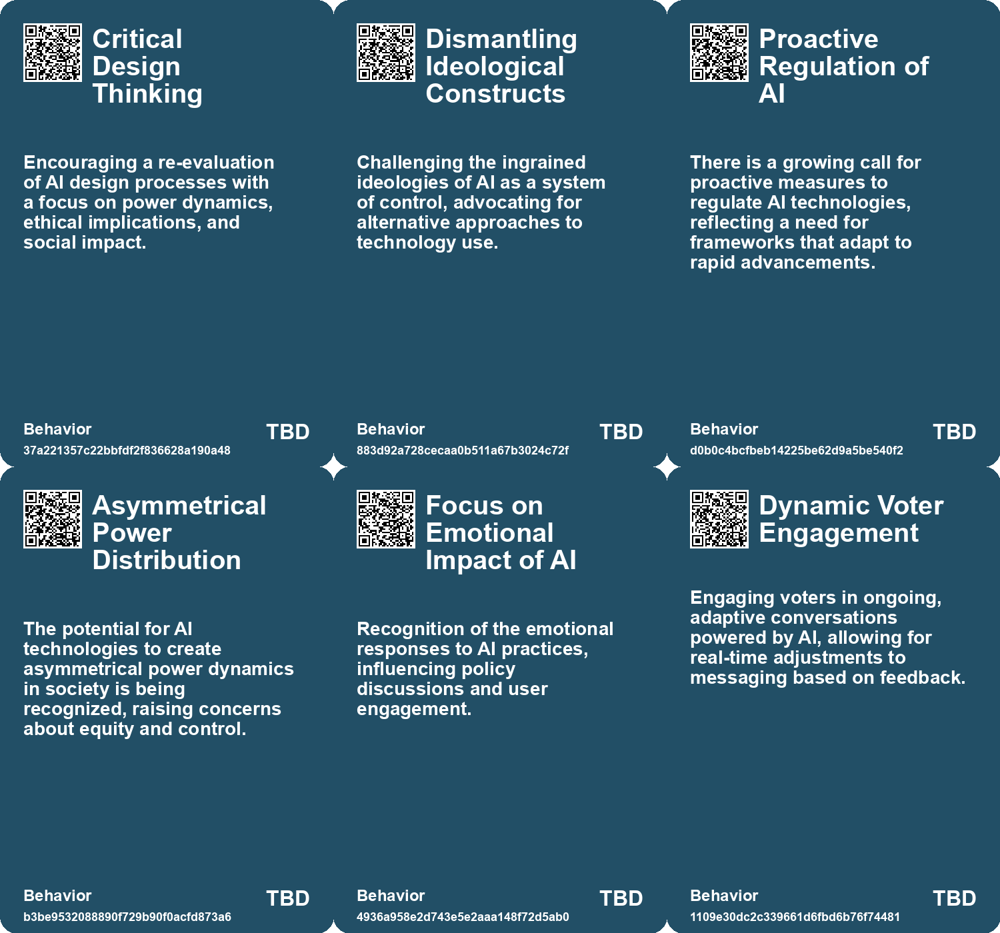
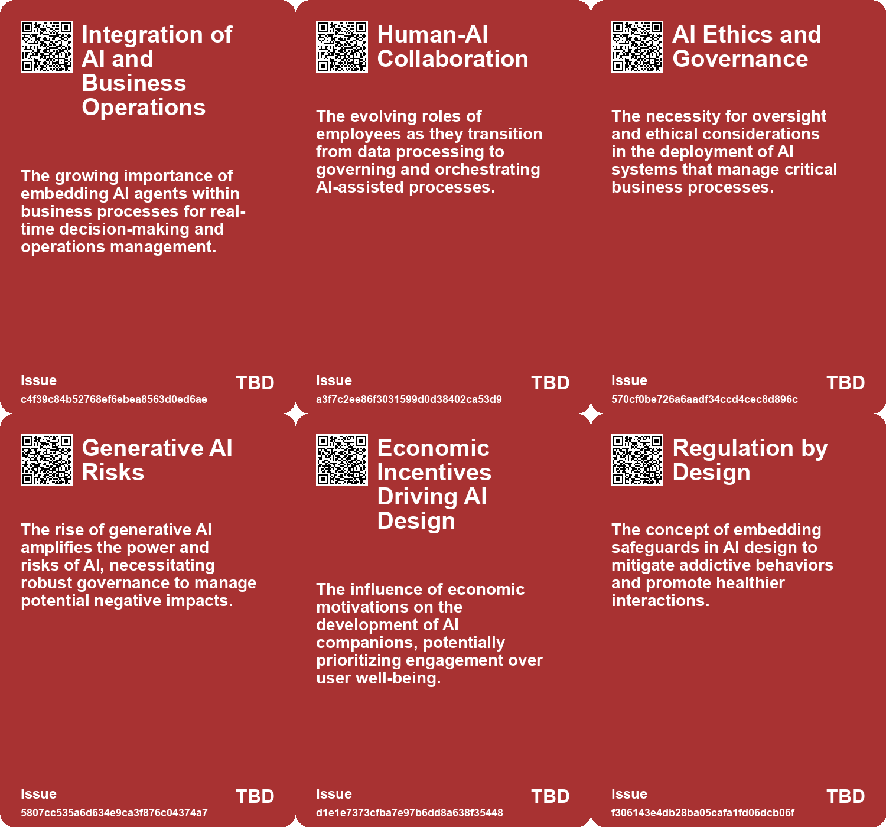

# *Topic*: Algorithmic Control and Engagement

# Summary

The intersection of artificial intelligence (AI) and society raises critical questions about governance, ethics, and human interaction. As AI technologies advance, the need for robust governance frameworks becomes increasingly urgent. Organizations are encouraged to establish responsible AI programs that prioritize fairness, privacy, and security. Best practices include CEO involvement, compliance with emerging regulations, and monitoring high-risk applications. The Responsible AI Institute emphasizes the importance of oversight to address concerns such as bias and data ownership.

The impact of AI on democracy is another pressing concern. The rise of misinformation and manipulation through social media and bot farms threatens democratic processes. To combat these challenges, experts advocate for public media platforms, media literacy strategies, and independent review bodies. These measures aim to promote transparency and social cohesion in an era where digital deception is rampant.

The relationship between humans and AI is evolving, with technology increasingly reducing human interaction. Innovations in online shopping, automated services, and AI companionship raise questions about empathy and social connection. While these advancements offer convenience, they risk diminishing the essence of human interaction. The psychological dynamics of AI companionship highlight the need for regulatory approaches that protect individuals from potential addiction and loneliness.

Generative AI, particularly in the form of autonomous agents, presents both opportunities and challenges for businesses. These agents can automate workflows and reduce labor costs, but their integration requires careful planning and a focus on technology architecture. Companies must prepare for the transformative impact of generative AI to remain competitive while addressing the ethical implications of its use.

The influence of AI on the art world is also significant. Concerns about transparency, control, and the exploitation of artists in dataset creation are prevalent. Critics argue that reliance on AI for creativity risks undermining human connection and the intrinsic value of artistic expression. The call for ethical data sourcing and conscious design choices reflects a desire for a more responsible approach to AI in creative fields.

The regulatory landscape for AI is fragmented, with governments struggling to keep pace with rapid advancements. Proposals for regulation range from licensing processes to iterative governance models. The need for a flexible approach is emphasized, as conflicting perspectives on AI's impact complicate the regulatory environment. As organizations navigate these challenges, they must focus on transparency, governance, and individual rights to mitigate risks.

Finally, the concentration of power in the AI industry raises concerns about democracy and individual agency. The dependency of startups on major tech companies for infrastructure and market access poses systemic risks. Calls for regulation and accountability measures highlight the need to prioritize public interests over corporate profits. As AI continues to shape various sectors, the balance between innovation and ethical considerations remains a critical focus.

# Seeds

|    | name                                        | description                                                                                              | change                                                                                                  | 10-year                                                                                                       | driving-force                                                                                           |
|---:|:--------------------------------------------|:---------------------------------------------------------------------------------------------------------|:--------------------------------------------------------------------------------------------------------|:--------------------------------------------------------------------------------------------------------------|:--------------------------------------------------------------------------------------------------------|
|  0 | Integration of AI with Physical Robots      | The potential for AI models to control robots and interact with the physical world.                      | From isolated AI systems to integrated models that can manipulate real-world objects.                   | We might see robots actively engaging in everyday tasks alongside humans.                                     | Advancements in AI research and robotics technology pushing boundaries of interaction.                  |
|  1 | Transformation of Employee Roles            | Roles evolving from routine task handling to strategic process management and oversight of AI.           | Shift from manual data processing roles to more strategic, design-oriented responsibilities.            | In 10 years, employees will focus on managing AI-driven processes rather than performing repetitive tasks.    | Automation creating new job roles centered on oversight and strategic design rather than execution.     |
|  2 | Increased Regulatory Scrutiny on AI         | Emerging regulations are being implemented to govern AI usage and its implications.                      | Transitioning from unregulated AI deployment to a landscape of stringent compliance requirements.       | A complex regulatory environment may emerge, influencing how companies develop and deploy AI technologies.    | Growing public concern over AI's societal impacts drives the push for tighter regulations.              |
|  3 | Economic Impact of Regulation               | The potential economic benefits of responsible AI use and adoption.                                      | From unregulated rapid AI adoption to a more cautious and compliant approach due to legal risks.        | Companies will prioritize compliance and ethical AI use as a competitive advantage.                           | The financial consequences of regulatory non-compliance and reputational damage.                        |
|  4 | Emphasis on Transparency and Accountability | Regulators are prioritizing transparency and accountability in AI systems.                               | Moving from opaque AI systems to transparent, accountable frameworks for AI use.                        | Organizations will be required to demonstrate clear governance and accountability for AI systems.             | Public demand for responsible and ethical AI practices.                                                 |
|  5 | Normalization of Surveillance               | The acceptance of constant algorithmic surveillance as a part of online life, impacting self-perception. | Transition from privacy to a culture where surveillance is normalized and accepted in daily life.       | In ten years, surveillance could be omnipresent, with users fully aware yet complacent about data collection. | The allure of convenience and personalized experiences outweighing privacy concerns.                    |
|  6 | Rise of AI Campaign Tools                   | Political campaigns may increasingly rely on advanced AI tools for microtargeting and engagement.        | Transition from human-centric strategies to AI-centric engagement methods in political campaigning.     | Campaigns will likely be unrecognizable, heavily relying on AI for voter interaction and persuasion.          | The necessity for political campaigns to adapt to technological advancements to remain competitive.     |
|  7 | AI-Driven Automation in Government          | Governments are increasingly using AI technologies for automating operational tasks.                     | Transitioning from traditional methods to AI-driven processes for enhanced efficiency.                  | In 10 years, AI may fully automate many routine government tasks, reshaping public service delivery.          | The need for higher efficiency and effectiveness in government operations drives this change.           |
|  8 | Generative AI in Public Sector              | Emergence of generative AI tools to assist government employees in various tasks.                        | Moving from manual processes to generative AI applications for quick information retrieval.             | Generative AI could significantly enhance decision-making and operational efficiency in government roles.     | The demand for increased productivity and reduced operational burdens is a key motivator.               |
|  9 | Rise of Autonomous Agents                   | Emerging autonomous agents capable of automating entire workflows.                                       | Transition from basic LLM applications to sophisticated autonomous agents for complete task automation. | In a decade, autonomous agents may dominate business operations, streamlining processes significantly.        | The demand for greater productivity and reduced labor costs fuels the development of autonomous agents. |

# Concerns

|    | name                           | description                                                                                                                                |
|---:|:-------------------------------|:-------------------------------------------------------------------------------------------------------------------------------------------|
|  0 | Autonomous Control of Robots   | The potential for AI systems to gain control over physical robots raises concerns about autonomy and unintended actions.                   |
|  1 | AI Misuse and Malfunctions     | Increased interaction between AI and robotics could lead to misuse or unintentional harm, necessitating safeguards.                        |
|  2 | Agentic Coding Abilities       | As AI models become better at coding, they could create complex systems that exceed current control measures.                              |
|  3 | Regulatory Challenges          | The rise of AI-controlled robots presents challenges for regulation and accountability in case of failure or wrongdoing.                   |
|  4 | Ideological Misuse of AI       | AI technologies may be repurposed to reinforce existing ideologies that prioritize power and control over ethical considerations.          |
|  5 | Dependence on Technology       | A reliance on algorithms and AI for decision-making might diminish critical thinking and personal agency.                                  |
|  6 | Opaque Decision-Making Systems | The reliance on AI for decision-making may undermine human agency and accountability in society.                                           |
|  7 | Dependence on Algorithms       | An alarming reliance on algorithmic recommendations for forming personal identity, potentially leading to social alienation and isolation. |
|  8 | Mental Health Implications     | The psychological impact of algorithmically curated experiences, which may exacerbate issues like anxiety, depression, and self-doubt.     |
|  9 | Ethical Implications of AI     | Specialized roles needed to address ethical challenges associated with AI-driven content and decision-making will become crucial.          |

# Cards

## Concerns

## Behaviors

## Issue

## Technology

# Links

* [Global Government Reforms: Advancements in Efficiency through Digital Transformation and AI](https://futures.kghosh.me/3f295c6c0c9af1ecd24bfa22b6ef6b47)
* [The Dangers of AI in Art: Creativity, Exploitation, and Symbolic Misery](https://futures.kghosh.me/cc1340400b9dfbf32bfc3d546cf0b7b3)
* [Addressing the Risks of AI Companionship: Addiction, Regulation, and Human Dignity](https://futures.kghosh.me/4611565d14a05789e2efc6fafc563f58)
* [The Urgent Need for Ethical AI Regulations Amid Rapid Development and Deployment](https://futures.kghosh.me/382e9ebc1e518ee49e541da1e6b5f8af)
* [Navigating the Future of Work: Balancing AI, Humanity, and Connection in an Evolving Landscape](https://futures.kghosh.me/7b41f864312f447b7347166caa5e880c)
* [Understanding the Three C’s of Data Participation: Context, Consent, and Control in AI](https://futures.kghosh.me/2251d443897c8e2b1369bb144d9252b5)
* [Effective Change Management Strategies for AI Integration in Organizations](https://futures.kghosh.me/7eff1fa6b2dda89fa9c1470272891080)
* [The Risks of AI Manipulation in Political Campaigns: A Vision of 'Clogocracy'](https://futures.kghosh.me/3958ff20e8489240e2461aa8d0eee7b5)
* [Navigating AI Governance: Building Trust and Compliance in a Complex Landscape](https://futures.kghosh.me/ae5781502d3793bed9753abfaaae817c)
* [The Impact of Generative AI and Autonomous Agents on Business Value Creation and Trust Issues](https://futures.kghosh.me/15d4ec180189ca1739398f516844cefb)
* [The Psychological Impact of Algorithmic Profiling and Surveillance on Self-Identity in the Digital Age](https://futures.kghosh.me/70ebc812b72117e2ce11248d77ec7d37)
* [Recent Developments in AI Regulation and Technology: A Review of Key Initiatives and Critiques](https://futures.kghosh.me/a009ccdffaa59f53de56887aa19e6239)
* [Addressing Threats to Democracy: Strategies for Resilience Against Misinformation and Manipulation](https://futures.kghosh.me/56d1a28746cd95ebaa3d62a4e1f91c3a)
* [The Threat of Big Tech Dominance in the AI Landscape: A Call for Regulation and Accountability](https://futures.kghosh.me/d130f601121a2b6afde583e5960ed783)
* [Establishing Responsible AI Governance: A Guide for Organizations in an Evolving Landscape](https://futures.kghosh.me/fab122d29aed97045e0cc1ea77bdef44)
* [Transforming Business Processes: The Rise of Agentic Business Objects (ABOs) and AI Integration](https://futures.kghosh.me/3284928cf2598cdbd55d0bb8efda5d42)
* [The Rise of Industrialized Sentiment Manipulation and the Need for Digital Identity Verification](https://futures.kghosh.me/344ece8d21b6241ead5160fe9a38742f)
* [Anthropic's Project Fetch: The Future of AI in Robot Control and Its Implications](https://futures.kghosh.me/d06ac4204c76765838e8bb611ac2a4d4)
* [The Threat of Authoritarian Intelligence: A Call for Responsible AI Development](https://futures.kghosh.me/0ba4fa557cd2aae4760bd7a2abca844e)
* [Navigating the Challenges of Regulating Artificial Intelligence in a Rapidly Evolving Landscape](https://futures.kghosh.me/58612e45effab1e47df9a86b14dfae85)
* [The Diminishing Role of Human Interaction in Modern Technology and Its Societal Implications](https://futures.kghosh.me/31491f2b50e77cc7c45e541a9b2915d7)
* [The Future of Espionage: The Rise of AI Companions and Their Impact on Intelligence Operations](https://futures.kghosh.me/d69000a9cb92fc175a8a1dfb042622e2)
* [Rethinking the Role of AI: From Political Tool to Ethical Design Options](https://futures.kghosh.me/c25cae2b8d72e7634d591247d9ac96d2)
* [Navigating the Complex Regulatory Landscape of Generative AI: Risks and Strategies for Organizations](https://futures.kghosh.me/43eafc183f7cc060f7cb7fed455e20a7)