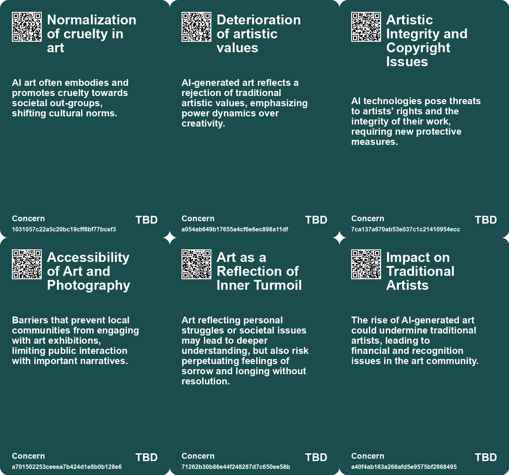
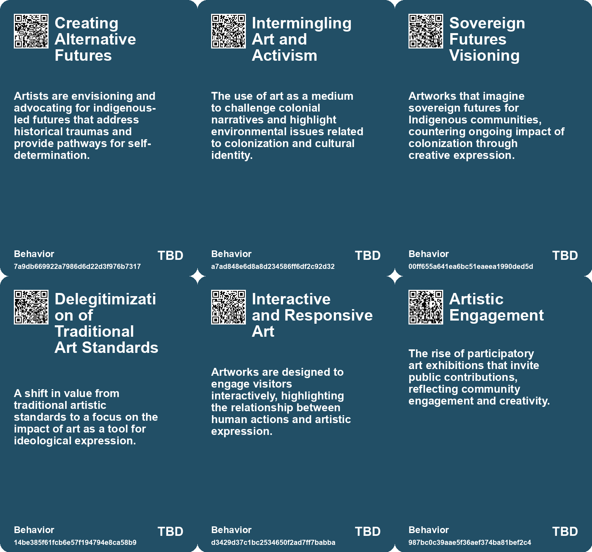
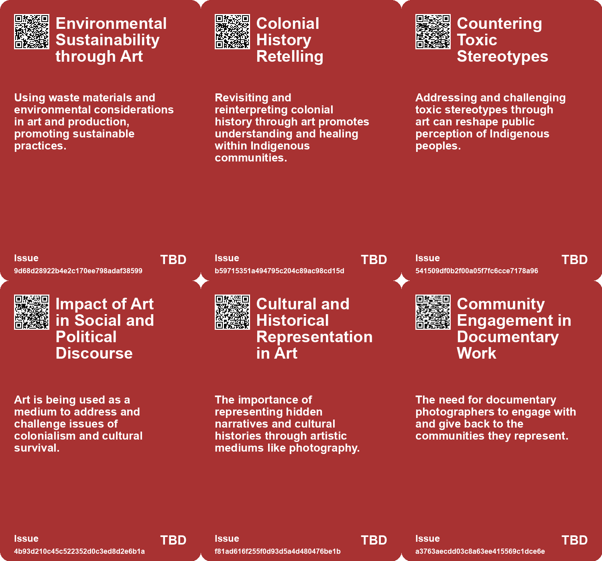
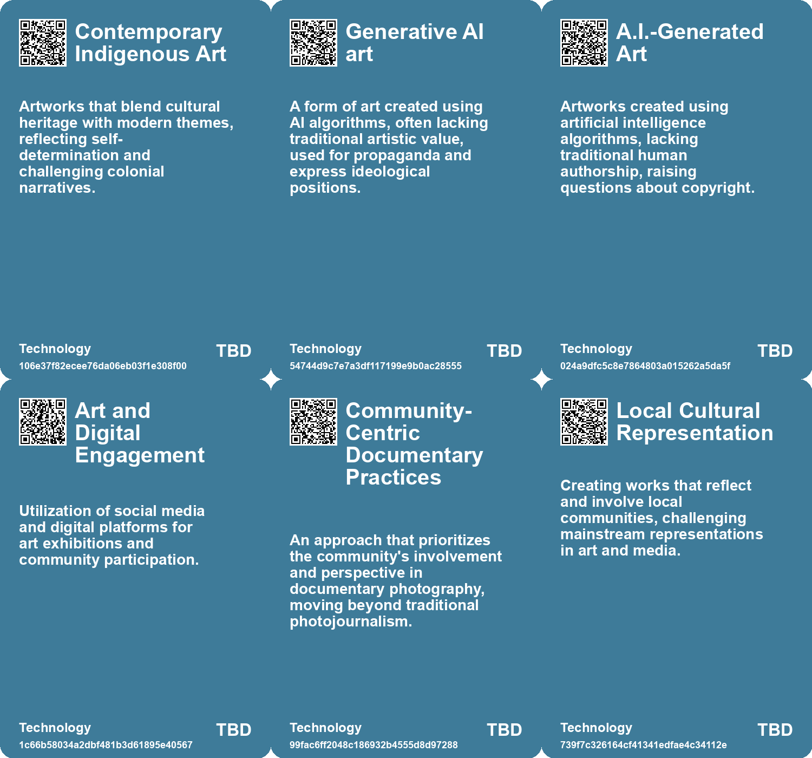

# *Topic*: Art as Advocacy

# Summary

The intersection of art, technology, and copyright law is increasingly complex as artists navigate the challenges posed by artificial intelligence (AI). The U.S. Copyright Office has ruled that AI-generated art cannot be copyrighted due to the lack of human authorship, raising concerns about the protection of artists' rights. This decision follows the case of Stephen Thaler, whose AI-generated work was denied copyright, highlighting the ongoing debate over ownership in the age of AI. Meanwhile, artists like Kris Kashtanova have begun to secure copyright for works that incorporate AI, setting a precedent for future creations.

The impact of AI on the creative workforce is profound. Freelance artists, such as illustrator Rafael Rodríguez Deustúa, face competition from generative AI on platforms like 99designs. While some embrace AI tools to enhance their work, others resist, fearing job loss and diminished artistic integrity. This tension reflects a broader concern about the future of creative professions as AI continues to evolve.

In the realm of visual culture, the political implications of AI-generated art are being scrutinized. Critics argue that the right's adoption of AI reflects a rejection of traditional artistic values, using technology to assert power over marginalized groups. This trend raises questions about the role of AI in shaping public consciousness and the potential for art to serve as a vehicle for ideological expression.

The dialogue around AI also extends to cultural heritage and sustainability. The Armenian pavilion at the Venice Architecture Biennale showcases how AI can be used to reinterpret ancient monuments, emphasizing a dynamic approach to preservation. This project highlights the potential for technology to engage with traditional practices while addressing contemporary challenges like climate change.

As artists and technologists grapple with these issues, the importance of ethical considerations in AI development becomes clear. The Future of Life Institute advocates for integrating the humanities into discussions about AI, emphasizing the need for benevolent applications that prioritize human welfare. This perspective aligns with calls for a new framework that protects artists' rights and ensures that AI serves as a tool for empowerment rather than exploitation.

The relationship between creativity and AI is further complicated by the concept of "uphill thinking," which emphasizes the unique human journey in the creative process. While AI can streamline tasks, it lacks the ability to navigate the complexities of human experience that drive true innovation. This notion underscores the enduring value of human creativity in an increasingly automated world.

Finally, the conversation around AI and its implications for society is ongoing. The UN General Assembly has adopted a resolution promoting safe and trustworthy AI systems that respect human rights, signaling a global commitment to ethical AI development. As these discussions unfold, the need for a collective approach to address the challenges posed by AI becomes increasingly urgent, emphasizing the importance of collaboration among artists, technologists, and policymakers.

# Seeds

|    | name                                                    | description                                                                              | change                                                                                           | 10-year                                                                                                        | driving-force                                                                                          |
|---:|:--------------------------------------------------------|:-----------------------------------------------------------------------------------------|:-------------------------------------------------------------------------------------------------|:---------------------------------------------------------------------------------------------------------------|:-------------------------------------------------------------------------------------------------------|
|  0 | Environmental Awareness through Indigenous Perspectives | Art reflects the connection between colonization and environmental degradation.          | From general environmental discourse to focusing on Indigenous narratives and solutions.         | Indigenous-led environmental initiatives may reshape conservation efforts globally.                            | Urgent need to address climate change through historically rooted approaches.                          |
|  1 | Reimagination of Historical Events in Contemporary Art  | Artists recontextualize historical uprisings to envision empowered futures.              | Transition from passive acceptance of history to active reinterpretation and empowerment.        | Historical events may be frequently revisited to inspire current resistance movements.                         | Desire for empowerment and understanding of ancestral histories.                                       |
|  2 | AI-Generated Art Popularity                             | The rise of AI-generated art among right-wing groups and figures.                        | Shift from traditional art to AI-generated imagery that aligns with their ideologies.            | AI-generated art may dominate mainstream media, impacting perceptions of artistic value and creativity.        | The right's rejection of traditional artistic expression in favor of easily accessible technology.     |
|  3 | Normalization of Cruelty in Art                         | Increasing acceptance of art that deliberately causes harm or offends vulnerable groups. | Transition from art as a reflection of humanity to art as a tool for cruelty against out-groups. | Art and media may increasingly reflect cruel, nihilistic values, diminishing empathy in society.               | A reactionary cultural shift prioritizing provocation over artistic quality or social responsibility.  |
|  4 | Educational Shifts in Art Training                      | Art education is adapting to include AI and digital techniques.                          | Art training evolving from hands-on techniques to include AI and digital tools.                  | Future artists may require formal training in AI technologies and digital media.                               | The integration of technology into all sectors, including education.                                   |
|  5 | Collective Memory through Art                           | Art is increasingly used to forge connections and collective memories among strangers.   | From individualistic perspectives in art to embracing shared experiences and collective memory.  | In ten years, art institutions may prioritize community engagement and shared storytelling in exhibitions.     | A cultural shift towards valuing community narratives and shared human experiences amid individualism. |
|  6 | Art as Emotional Reflection                             | Art is increasingly viewed as a medium for emotional exploration and reflection.         | From art as mere representation to art as a tool for emotional processing and connection.        | In ten years, art may be integrated into therapeutic practices, enhancing emotional well-being and connection. | The rising awareness of mental health and the therapeutic potential of creative expression.            |
|  7 | Public Perception of AI Art                             | Speculation around copyright reveals societal debate on AI's role in art.                | Growing awareness and scrutiny of AI-generated content and its implications for copyright.       | Shift in public perception towards acceptance and understanding of AI in creative fields.                      | Increased media coverage and discourse surrounding AI art and copyright issues.                        |
|  8 | Legal Framework for AI Art                              | Legal discussions surrounding AI artworks are becoming more relevant as cases arise.     | Evolving legal interpretations of authorship and copyright in the context of AI art.             | Establishment of clearer legal frameworks governing AI-generated artworks and copyrights.                      | Need for clarity and protection in the rapidly evolving landscape of AI-generated content.             |
|  9 | Commercial Use Scrutiny                                 | Court emphasizes the commercial nature of art in fair use cases.                         | Shift from leniency in commercial use of art to stricter scrutiny.                               | In a decade, commercial artists may need to navigate complex licensing agreements.                             | The commercialization of art and photography in media and advertising.                                 |

# Concerns

|    | name                                    | description                                                                                                                                                          |
|---:|:----------------------------------------|:---------------------------------------------------------------------------------------------------------------------------------------------------------------------|
|  0 | Normalization of cruelty in art         | AI art often embodies and promotes cruelty towards societal out-groups, shifting cultural norms.                                                                     |
|  1 | Deterioration of artistic values        | AI-generated art reflects a rejection of traditional artistic values, emphasizing power dynamics over creativity.                                                    |
|  2 | Artistic Integrity and Copyright Issues | AI technologies pose threats to artists' rights and the integrity of their work, requiring new protective measures.                                                  |
|  3 | Accessibility of Art and Photography    | Barriers that prevent local communities from engaging with art exhibitions, limiting public interaction with important narratives.                                   |
|  4 | Art as a Reflection of Inner Turmoil    | Art reflecting personal struggles or societal issues may lead to deeper understanding, but also risk perpetuating feelings of sorrow and longing without resolution. |
|  5 | Impact on Traditional Artists           | The rise of AI-generated art could undermine traditional artists, leading to financial and recognition issues in the art community.                                  |
|  6 | Legal Precedents for AI Art             | Establishing legal precedents for AI-generated art could lead to widespread changes in copyright law and its interpretation.                                         |
|  7 | Misrepresentation of AI Contribution    | There is a risk of misrepresenting the amount of human artistic input versus AI contribution, affecting public perception and valuation of art.                      |
|  8 | Accessibility vs. Exploitation          | Efforts to make art accessible, such as using alt text, can inadvertently expose artists to exploitation by A.I.                                                     |
|  9 | Commercialism in Artistic Expression    | The decision emphasizes commercial nature over artistic transformation, which may inhibit creativity in commercial art.                                              |

# Cards

## Concerns

## Behaviors

## Issue

## Technology

# Links

* [Exploring Susan Meiselas's Inclusive and Collaborative Photographic Approach](https://futures.kghosh.me/3732af6b65f8a13ac1af7007d063eb7b)
* [The Interplay of Democracy, Work, and Economic Justice in Modern Society](https://futures.kghosh.me/43aa6ac3d82bbc19f0d66d5b2bb37897)
* [Exploring Cultural Heritage Through AI: Armenia's Pavilion at Venice Biennale 2025](https://futures.kghosh.me/34b4d87b744230499df1eb6a00d5c11d)
* [Kris Kashtanova Secures US Copyright for AI-Generated Graphic Novel "Zarya of the Dawn"](https://futures.kghosh.me/9191375fe5b80e2b93a7369a79e63957)
* [Exploring the Modern Entertainment Landscape and Its Societal Implications](https://futures.kghosh.me/c5c2c794f1426e6e307a9df3f9ff61f6)
* [The Impact of Generative AI on Creative Professions and the Need for New Data Rights Frameworks](https://futures.kghosh.me/858dac884c8fe7dfa6fc0c2cf093e97f)
* [Rethinking Architecture: Embracing Futures Thinking to Combat Climate Crisis](https://futures.kghosh.me/26e385bfcd6784d024e3e49e8b04ce89)
* [Harnessing Storytelling to Reimagine AI: The Role of Arts and Humanities in Shaping a Positive Future](https://futures.kghosh.me/026067bce7eb8accee127cf0cac4dfa5)
* [The Impact of AI Imaging on Art, Creativity, and Human Connection](https://futures.kghosh.me/de89ae90257007a4fbb1a5c7a7dc82a5)
* [Digital Artist Greg Rutkowski Calls for Exclusion of Living Artists from AI Databases](https://futures.kghosh.me/f5d2fbbd282d6e37d9e572edfcd235b2)
* [Rethinking the Role of AI: From Political Tool to Ethical Design Options](https://futures.kghosh.me/c25cae2b8d72e7634d591247d9ac96d2)
* [Exploring Healing-Centric Design in the Age of Emerging Technologies](https://futures.kghosh.me/6ce4d4d1c40fef14044ea70a600c66d4)
* [Supreme Court Rules on Copyright Infringement in Warhol v. Goldsmith Case](https://futures.kghosh.me/c1e1bed7a22d1ccc1a5d6e57f87ba862)
* [The Impact of Generative AI on Freelance and Outsourced Workers Worldwide](https://futures.kghosh.me/df147d78aff4f0c3a7186172d8278644)
* [Exploring Futurism in Indigenous Art: Future Imaginaries Exhibit](https://futures.kghosh.me/d688ddddbb61a934e594c21b14d2aaf6)
* [Empowering Artisanal Labor through Technology and Community Collaboration in Detroit](https://futures.kghosh.me/9069cc46631b516b7780b893c126086e)
* [The Illusion of Online Activism in the Age of Trump: Embracing Real-World Action Instead](https://futures.kghosh.me/9f50450d1a7c46c073a928b6fa172c18)
* [Anthropic's Artifacts: A Game-Changer in AI Collaboration and Integration](https://futures.kghosh.me/ac27c72b9082bc30429311012247f768)
* [Exploring the Balance Between AI Efficiency and Human Creativity in Design](https://futures.kghosh.me/92ae644db3cc8e4d0fb262bac8413f8b)
* [U.S. Copyright Office Denies Copyright for A.I.-Generated Art Due to Lack of Human Authorship](https://futures.kghosh.me/fc78d6a757326382f385c8b5504ad6f9)
* [UN General Assembly Adopts Historic Resolution on Safe and Trustworthy Artificial Intelligence](https://futures.kghosh.me/d7b56c819275b35f84a01258707f39f9)
* [Redefining Storytelling: From Heroic Conquests to Collective Narratives in Climate Change](https://futures.kghosh.me/9583276a9aeb9f9a0bf87400700799bc)
* [Finding Connection and Beauty in Garry Winogrand's Photography: A Personal Reflection](https://futures.kghosh.me/ab6e3fcdacd5615fd45dda4664c395e5)
* [Exploring Indigenous Perspectives Through Art and Technology at the Autry Museum](https://futures.kghosh.me/bcb3358ea987c50fb056866ca37eef83)
* [Exploring the Right's Embrace of AI-Generated Art and Its Ideological Implications](https://futures.kghosh.me/d9eabadabb28c2a17d6808d33314e808)