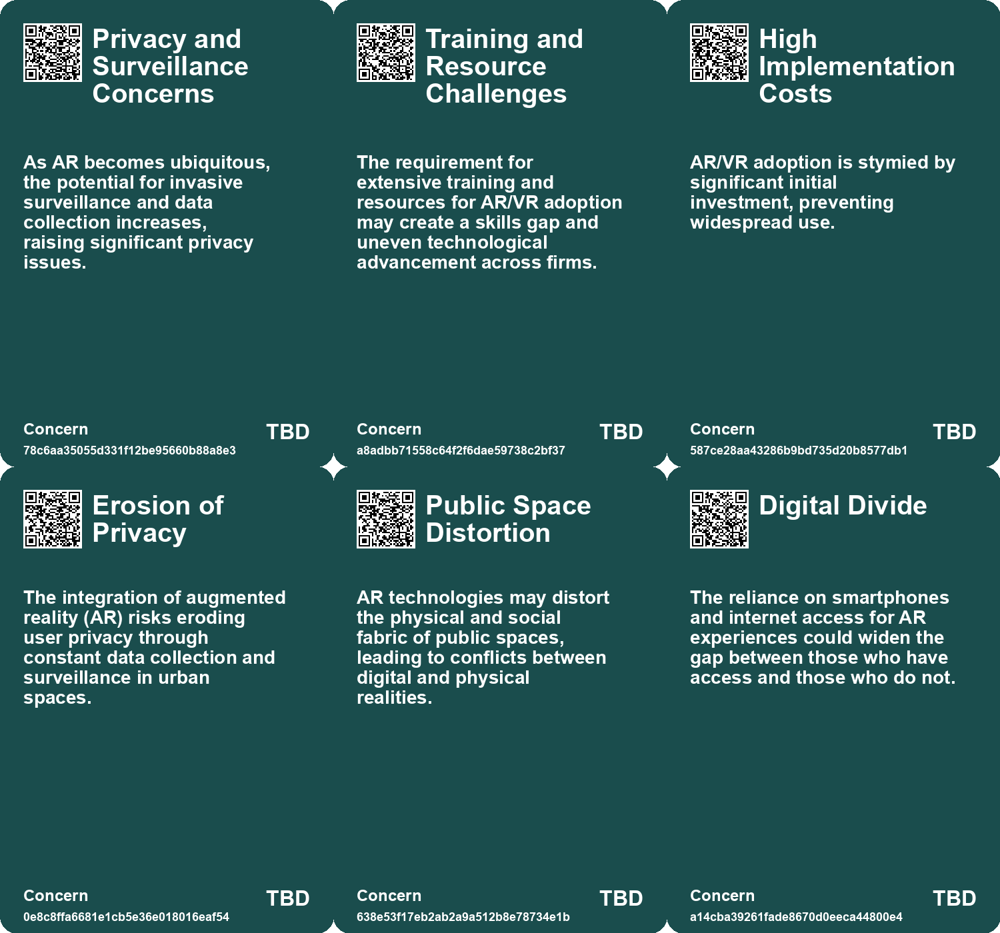
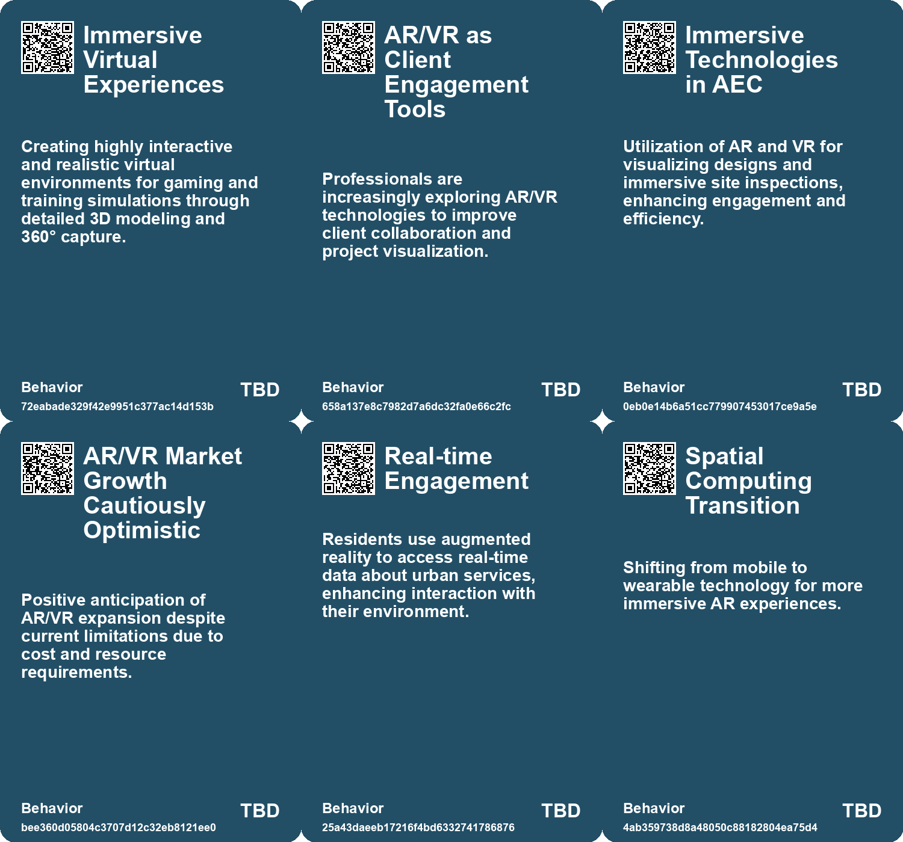
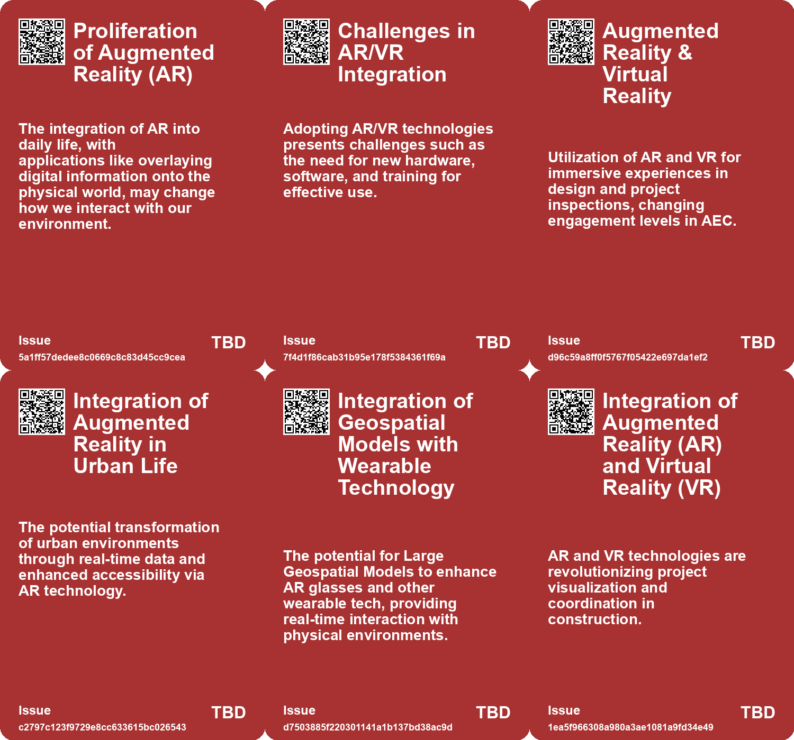
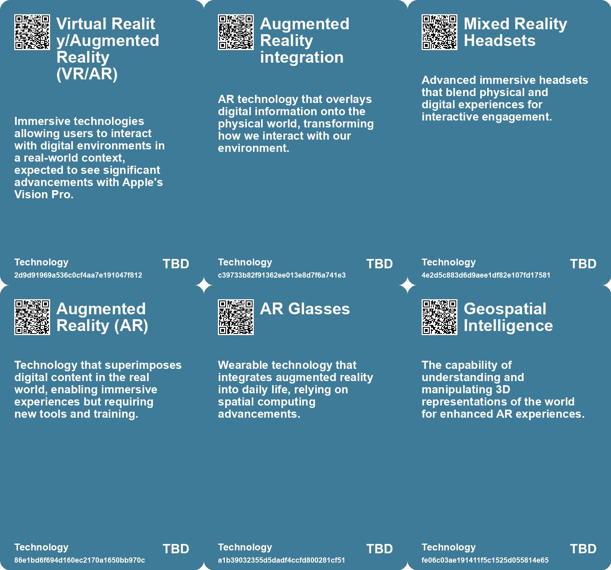

# *Topic*: Augmented Reality (AR) & VR

# Summary

The integration of technology into daily life is reshaping urban environments, with augmented reality (AR) at the forefront. AR has the potential to transform how citizens interact with their surroundings, providing real-time data and enhancing accessibility. However, concerns about privacy, corporate influence, and social inequities accompany this technological shift. Proactive governance and thoughtful regulation are essential to navigate these challenges.

Wearable technology is another area experiencing rapid growth, merging human and machine in ways that redefine social interactions. Successful examples like wireless earphones demonstrate the potential of wearables, while products like Google Glass highlight the challenges of seamless integration into everyday life. The future of wearables is tied to the development of augmented reality, which could create a new hybrid reality.

The architecture, engineering, and construction (AEC) industry is undergoing significant transformation driven by technological advancements. Key trends include the adoption of Building Information Modeling (BIM), artificial intelligence (AI), and augmented reality/virtual reality (AR/VR). These technologies aim to improve efficiency, sustainability, and collaboration among stakeholders. A survey of AEC professionals indicates a strong commitment to innovation, with many planning to adopt sustainable design tools and AI-driven solutions.

Reality capture technology is revolutionizing how industries visualize and manage real-world environments. Utilizing LiDAR and 360-degree imaging, this method creates digital representations that enhance remote site visits and asset management. As industries from gaming to architecture embrace reality capture, the potential for innovative applications continues to expand, bridging the gap between physical and digital worlds.

The rise of surveillance technology raises important questions about privacy and accountability. With cameras becoming ubiquitous, the volume of video data generated is overwhelming. AI is increasingly used to analyze this data, but the implications for personal privacy remain a significant concern. As society adapts to a world where surveillance is commonplace, legal and social norms struggle to keep pace.

The virtual people industry is gaining traction, particularly in China, where tech companies are investing heavily in creating digitized human beings. These virtual personas are being used across various sectors, from finance to tourism, as alternatives to traditional spokespeople. The growth of this industry reflects a broader trend toward digital representation and the desire for scandal-free public figures.

Finally, the ongoing evolution of AI technology is reshaping business norms and human interactions. As AI applications become more sophisticated, they promise to enhance productivity and creativity. However, the challenge remains in ensuring that these technologies complement human skills rather than replace them. The future will require individuals and organizations to adapt to an AI-driven landscape, emphasizing the importance of creativity, communication, and collaboration.

# Seeds

|    | name                                                | description                                                                                 | change                                                                                                | 10-year                                                                                                  | driving-force                                                                                          |
|---:|:----------------------------------------------------|:--------------------------------------------------------------------------------------------|:------------------------------------------------------------------------------------------------------|:---------------------------------------------------------------------------------------------------------|:-------------------------------------------------------------------------------------------------------|
|  0 | Integration with Virtual Reality                    | Growing use of reality capture in immersive VR experiences for training and tourism.        | Shifting from passive viewing to immersive engagement in virtual environments.                        | In a decade, educational and training experiences will predominantly utilize engaging VR technologies.   | The demand for immersive experiences in training and education is pushing virtual reality integration. |
|  1 | Applications in Diverse Industries                  | Expanding adoption of reality capture across gaming, architecture, manufacturing, and more. | From niche applications to mainstream usage across various industries.                                | In ten years, reality capture will be a foundational technology in multiple sectors worldwide.           | The versatility and efficiency of reality capture are driving its adoption across various fields.      |
|  2 | VR/AR Adoption Challenges                           | AR/VR technology adoption requires new software, hardware, and training.                    | Moving from traditional visualization to immersive technologies in design.                            | AR/VR will create new standards for client presentations and project development.                        | Demand for innovative solutions in client engagement and design collaboration.                         |
|  3 | Rise of Immersive Technologies                      | AR and VR becoming integral for design visualization in the AEC industry.                   | Transition from conventional design reviews to immersive experiences using AR/VR.                     | Ten years from now, immersive technologies will redefine client interactions and design reviews in AEC.  | The demand for more engaging and interactive design solutions.                                         |
|  4 | Augmented Reality/Virtual Reality (AR/VR) Potential | Despite initial niche usage, AR/VR is anticipated to grow in influence.                     | Transitioning from minimal engagement to widespread utilization in project visualization.             | AR/VR could become a standard for client presentations and project planning in AEC.                      | Growing importance of immersive technology for stakeholder engagement and project validation.          |
|  5 | Integration of Augmented Reality in Urban Life      | The increasing use of AR technology in urban planning and public engagement.                | Cities will transition from traditional urban planning to data-driven, interactive design using AR.   | In a decade, urban spaces may be fully integrated with AR, enhancing interaction and accessibility.      | The need for real-time data and improved civic engagement amidst urban challenges.                     |
|  6 | AR-Code Integration                                 | The merging of QR codes with augmented reality to enhance user experiences.                 | Transitioning from static content to interactive AR experiences using simple QR codes.                | In 10 years, AR-Code could transform how we interact with printed media, making it dynamic and engaging. | The growing demand for interactive and immersive experiences in everyday life.                         |
|  7 | Emergence of Wearable Technologies                  | Wearable tech is becoming a primary way to access innovations like AI and AR.               | Shift from smartphone-centric technology to wearable devices for accessing digital innovations.       | Wearable tech will dominate daily life, integrating seamlessly with our routines and identities.         | The push for more intuitive and integrated tech that enhances human capabilities.                      |
|  8 | Integration of AR and VR into Daily Life            | Wearable tech is paving the way for AR and VR integration in everyday activities.           | From separate virtual experiences to an integrated hybrid reality.                                    | AR and VR will become commonplace, altering perceptions of reality and identity.                         | The desire to enhance experiences through immersive technology.                                        |
|  9 | Virtual Reality for Training                        | VR is being utilized extensively for worker training and safety simulations.                | Moving from conventional training methods to immersive, simulated environments for skill development. | A more skilled workforce with enhanced safety protocols due to VR training.                              | The need for improved safety and efficiency in construction training programs.                         |

# Concerns

|    | name                                      | description                                                                                                                                                 |
|---:|:------------------------------------------|:------------------------------------------------------------------------------------------------------------------------------------------------------------|
|  0 | Privacy and Surveillance Concerns         | As AR becomes ubiquitous, the potential for invasive surveillance and data collection increases, raising significant privacy issues.                        |
|  1 | Training and Resource Challenges          | The requirement for extensive training and resources for AR/VR adoption may create a skills gap and uneven technological advancement across firms.          |
|  2 | High Implementation Costs                 | AR/VR adoption is stymied by significant initial investment, preventing widespread use.                                                                     |
|  3 | Erosion of Privacy                        | The integration of augmented reality (AR) risks eroding user privacy through constant data collection and surveillance in urban spaces.                     |
|  4 | Public Space Distortion                   | AR technologies may distort the physical and social fabric of public spaces, leading to conflicts between digital and physical realities.                   |
|  5 | Digital Divide                            | The reliance on smartphones and internet access for AR experiences could widen the gap between those who have access and those who do not.                  |
|  6 | Misinformation Risk                       | Augmented reality content could be used to spread misinformation or misleading advertisements more effectively.                                             |
|  7 | Dependency on Technology                  | As users rely more on AR experiences, there may be a growing dependency on technology for learning and engagement.                                          |
|  8 | Cultural Resistance to Wearables          | Societal hesitance towards integrating wearables, particularly those with AR, due to past failures like Google Glass, can hinder acceptance and innovation. |
|  9 | Ethical Implications of Augmented Reality | The introduction of AR wearables raises ethical concerns surrounding the manipulation of reality and the potential for misinformation.                      |

# Cards

## Concerns

## Behaviors

## Issue

## Technology

# Links

* [Exploring Reality Capture: Transforming Real World into Digital Experience](https://futures.kghosh.me/e7ca971a22ddfefb04348322026f64d5)
* [Nvidia Unveils Mega Omniverse Blueprint for Digital Twins in Industrial Robotics at CES 2025](https://futures.kghosh.me/a465c197bdca063583b2e37182a8bb12)
* [Exploring the Top Five Digital Trends Transforming the AEC Industry by 2025](https://futures.kghosh.me/4fa95d956537d2dbb69564d1fce9ab67)
* [Top 10 Construction Technology Trends Transforming the Industry by 2025](https://futures.kghosh.me/e5f654f63eaeb60d2dce7ea70a8c03aa)
* [Understanding the AI Revolution Through Historical Technology Patterns](https://futures.kghosh.me/29dffdf88b6ee51b47693fdd178cea22)
* [AR-Code: Revolutionizing Access to Augmented Reality Through QR Codes](https://futures.kghosh.me/7a80fea8d2a1e552625452f3d38ab599)
* [Key Trends Shaping the Future of Architecture, Engineering, and Construction by 2025](https://futures.kghosh.me/ff47e6e9ab7061f5cb848d4f10d1e06f)
* [The Augmented City: Balancing Innovation and Challenges in Urban AR Integration](https://futures.kghosh.me/79a156bc6b74667af8c3e7309844d739)
* [Harvard Students Create AI-Powered Ray-Ban Glasses for Real-Time Facial Recognition](https://futures.kghosh.me/df23c7b48a8f711404c1d0d100c72e42)
* [Thriving in an AI Era: Embracing, Adapting, and Complementing Technology](https://futures.kghosh.me/23a3410059759ba4214235628d4ebd4b)
* [The Future of Wearable Technology: Merging Cyborg Lifestyles with Daily Life](https://futures.kghosh.me/a81c4775b91ccd0db3e1b84da893ac6f)
* [Advancements in AI: The Promise and Limitations of Interactive Models like GPT-4o and Astra](https://futures.kghosh.me/f98dab2817789f549215229135f086d0)
* [Innovative Technologies Transforming the U.S. Construction Industry in 2023](https://futures.kghosh.me/9fbdae5a2d70130c66d895f559f2839d)
* [Exploring the Intersection of Video Game Simulation and Real-World Ecology](https://futures.kghosh.me/57fcfcda347e1934e0c1da9fc212fcec)
* [Transformations in the Architecture, Engineering, and Construction Industry: Key Digital Trends for 2025](https://futures.kghosh.me/02aa17b4b1a6e60fd84fd570ada11997)
* [Emerging Technologies Shape the Future of the AEC Industry in 2025](https://futures.kghosh.me/95d469c68ec86b47c502e645a5b5c141)
* [The Rise of Virtual Employees in China and Their Impact on Business](https://futures.kghosh.me/9830e769665e82dcea315b1089dc40c4)
* [The Diminishing Role of Human Interaction in Modern Technology and Its Societal Implications](https://futures.kghosh.me/31491f2b50e77cc7c45e541a9b2915d7)
* [Exploring the Intersection of Technology and Sci-Fi: Insights on AI, Predictive Policing, and Drone Warfare](https://futures.kghosh.me/026209244953fa87db05ebd0105fb0c4)
* [The Impact of Ubiquitous Surveillance Cameras on Society and Accountability](https://futures.kghosh.me/7790ecd5c227bae024a54ac5725ac978)
* [The Architectural Industry's Misguided Love Affair with the Metaverse and Its Consequences](https://futures.kghosh.me/6f71a216712969ccfb48faf7968a552b)
* [Meta's Ray-Ban Glasses Introduce Live Translation and Future AI Features](https://futures.kghosh.me/865c4dea84bbed684e720cae239e4237)
* [Five Emerging Trends Transforming Business in the Coming Year](https://futures.kghosh.me/55bac03899915f25bf0b47fa4342472c)
* [Exploring the Future: How Technology Will Transform Society by 2034](https://futures.kghosh.me/8ef50cfd87ff3eedbc028932b07520b3)
* [Niantic's Vision for a Large Geospatial Model to Revolutionize AR and Spatial Computing](https://futures.kghosh.me/65e4c914b47f88920bb9442d4d102b67)
* [Exploring the Digital Transformation and Technological Trends in Construction for 2024](https://futures.kghosh.me/50c14f2e6605f1cf834c2f855040479e)