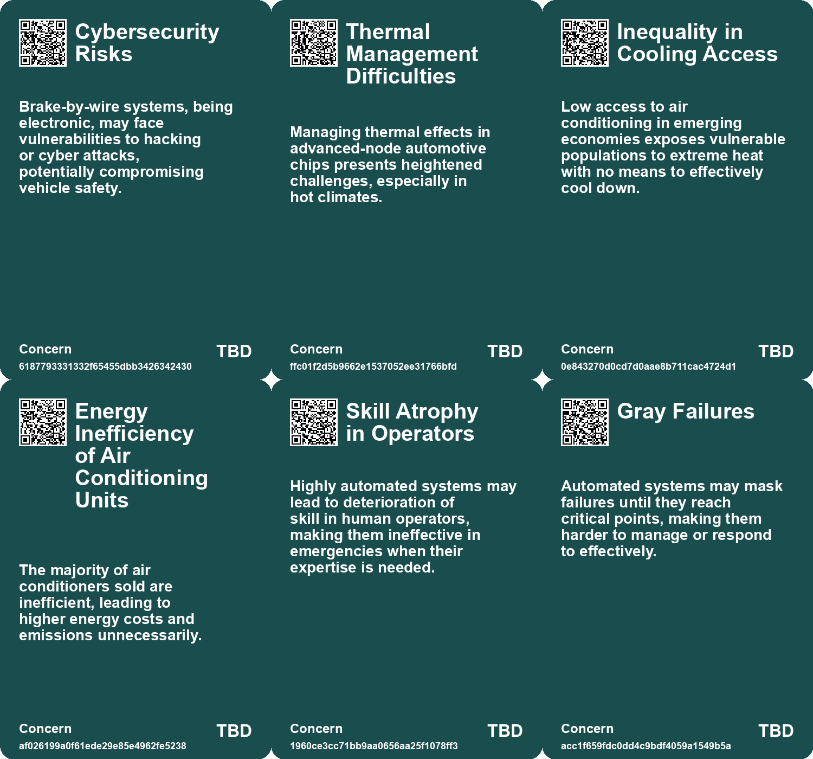
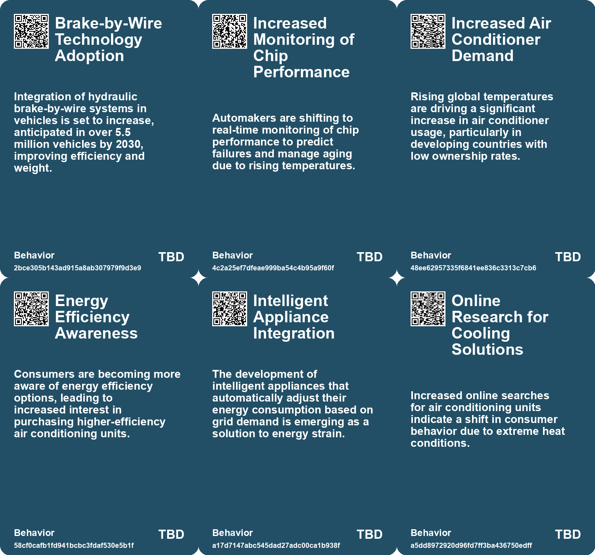
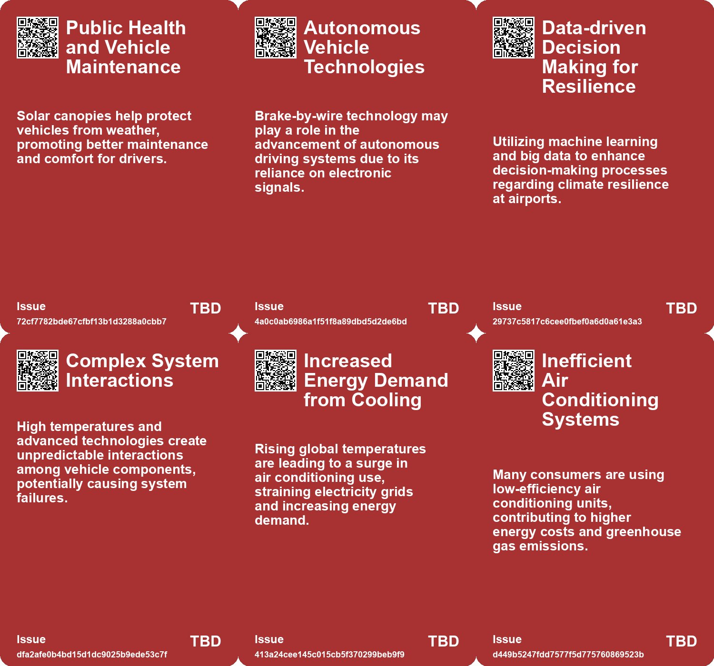
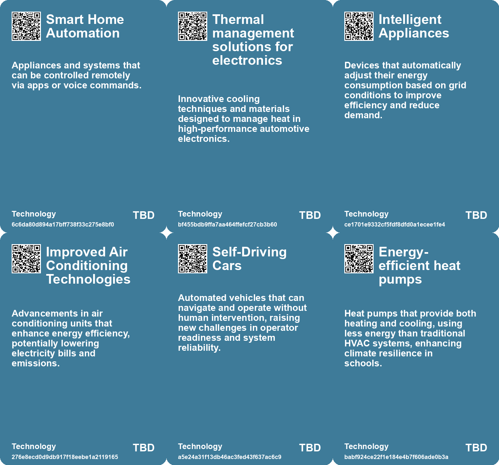

# *Topic*: Automated Climate Control Systems

# Summary

The impact of climate change is increasingly evident across various sectors, with rising global temperatures affecting everything from automotive technology to energy consumption. Automotive chips, particularly those in electrified vehicles, are degrading faster due to extreme heat, raising safety and performance concerns. Companies are focusing on understanding how environmental factors influence the lifespan of these chips, emphasizing the need for monitoring and predictive maintenance.

In the realm of energy, record-breaking temperatures have led to a surge in air conditioning demand, straining power systems and increasing greenhouse gas emissions. Inefficient cooling systems exacerbate the energy crisis, particularly in developing economies. To address these challenges, stronger standards for air conditioning units and energy efficiency measures are essential.

The shift towards low-tech living is gaining traction among high-end homeowners, who are moving away from smart homes filled with automation. Frustrations with complex digital systems have led to a desire for simpler, manual homes that prioritize self-sufficiency and tactile experiences. This trend reflects a broader movement away from technology-driven lifestyles, as buyers seek comfort and escape from digital overload.

Automation continues to spark debate, with concerns about job displacement and the ethical implications of artificial intelligence. Historical examples show that automation can create new opportunities rather than just eliminate jobs. However, the need for regulation and guidelines is crucial to ensure responsible implementation. The potential of AI to reduce carbon emissions and water use is tempered by its significant energy consumption, highlighting the need for careful consideration of its environmental impact.

Innovations in technology are also reshaping industries. Bosch's brake-by-wire technology, which eliminates traditional mechanical connections, is set to enhance safety and design flexibility in electric vehicles. Meanwhile, Heimdall Power's collaboration with Meteomatics has increased power grid transmission capacity by 30%, utilizing real-time data to optimize performance.

The challenges of climate change are particularly acute in education, as many California schools lack adequate air conditioning, impacting student health and learning. This issue is exacerbated in low-income communities, where resources for infrastructure upgrades are limited. 

In agriculture, Deere & Co. is positioning itself as a leader in AI and robotics with its fully autonomous farm tractor. However, the industry remains in its early stages, with significant potential for growth as automation becomes more prevalent in farming.

The vulnerabilities of technology are also a concern, as over 130,000 solar energy monitoring systems have been found exposed online, making them targets for hackers. The need for robust security measures is critical to protect these systems from exploitation.

Finally, the ongoing conflict between Russia and Ukraine has highlighted the role of AI in warfare, raising ethical questions about the use of lethal autonomous weapons. The United Nations is addressing these concerns, aiming to establish regulations for AI in military applications.

As climate change continues to pose challenges, airports are increasingly vulnerable to extreme weather. Strategies for resilience, such as retrofitting existing structures and utilizing data technology, are essential for adapting to future conditions.

# Seeds

|    | name                                                    | description                                                                                 | change                                                                                                        | 10-year                                                                                                                   | driving-force                                                                                                |
|---:|:--------------------------------------------------------|:--------------------------------------------------------------------------------------------|:--------------------------------------------------------------------------------------------------------------|:--------------------------------------------------------------------------------------------------------------------------|:-------------------------------------------------------------------------------------------------------------|
|  0 | Brake-by-Wire Adoption                                  | Bosch's hydraulic brake-by-wire technology is being tested and adopted by automakers.       | Transitioning from mechanical to electronic braking systems in vehicles.                                      | By 2030, 5.5 million vehicles worldwide will utilize brake-by-wire technology, enhancing vehicle design.                  | The demand for lightweight designs in electric vehicles to improve efficiency and range.                     |
|  1 | Data Utilization in Decision-Making                     | Airports increasingly use data and technology for climate resilience decisions.             | From minimal data use to advanced analytics guiding infrastructure enhancements.                              | Data-driven approaches will revolutionize airport management, enhancing climate adaptation strategies.                    | The digital transformation in aviation fuels better decision-making through comprehensive data insights.     |
|  2 | Increased Air Conditioning Demand in Emerging Economies | Emerging economies are experiencing a surge in demand for air conditioning units.           | From low air conditioner ownership to significant increases in demand in developing regions.                  | In a decade, air conditioning may become standard in emerging economies, altering energy consumption patterns.            | Economic growth and rising temperatures are driving air conditioning adoption in these regions.              |
|  3 | Mandatory Energy Performance Standards                  | Countries are implementing mandatory standards for air conditioning efficiency.             | From unregulated standards to enforced minimum efficiency requirements for appliances.                        | In a decade, these standards could significantly reduce overall energy consumption and emissions.                         | Governments are motivated by climate goals and energy security to enforce efficiency standards.              |
|  4 | Consumer Behavior Shift Towards Energy Efficiency       | Consumers are increasingly seeking more efficient air conditioning options.                 | From indifference towards air conditioning efficiency to active pursuit of energy-saving options.             | In a decade, consumer preferences could heavily favor energy-efficient appliances, reshaping markets.                     | Rising energy costs and climate awareness are driving consumers to prioritize efficiency.                    |
|  5 | Solar-Powered Desalination                              | A new solar-powered desalination system that adjusts to sunlight variations.                | Transition from traditional steady power desalination to a dynamic solar-powered system.                      | Widespread adoption of solar-powered desalination technologies in remote areas with scarce freshwater.                    | The increasing scarcity of freshwater resources due to climate change and population growth.                 |
|  6 | Automated Control Strategies                            | Development of automated control strategies for optimizing desalination processes.          | Shift from manual to automated, real-time adjustments in desalination systems.                                | More efficient desalination systems operating autonomously to meet water demands.                                         | Advancements in technology allowing for real-time data processing and automation.                            |
|  7 | Gray Failure Issues                                     | Automated systems may obscure failures until they are critical due to adaptive controls.    | Shift from clear system failure notifications to more subtle, hard-to-detect failures.                        | Operators may face increased challenges in recognizing system failures in complex automated environments.                 | Complexity in systems may lead to hidden failures, necessitating advanced monitoring solutions.              |
|  8 | Inadequate Air Conditioning in Schools                  | Many California schools lack functioning air conditioning systems amid rising temperatures. | Shift from inadequate cooling systems to urgent needs for functioning air conditioning due to climate change. | In 10 years, schools may have modernized cooling systems or alternative heat management strategies.                       | Increasing frequency of heat waves due to climate change demands better thermal comfort in schools.          |
|  9 | Funding Gaps for Repairs                                | Underfunded schools struggle to maintain or upgrade air conditioning systems.               | Transition from insufficient funding to a potential crisis in school infrastructure investment.               | In 10 years, funding mechanisms may evolve to better support school infrastructure needs, especially in low-income areas. | Equity and resource distribution in education funding are driving forces behind infrastructure improvements. |

# Concerns

|    | name                                          | description                                                                                                                                            |
|---:|:----------------------------------------------|:-------------------------------------------------------------------------------------------------------------------------------------------------------|
|  0 | Cybersecurity Risks                           | Brake-by-wire systems, being electronic, may face vulnerabilities to hacking or cyber attacks, potentially compromising vehicle safety.                |
|  1 | Thermal Management Difficulties               | Managing thermal effects in advanced-node automotive chips presents heightened challenges, especially in hot climates.                                 |
|  2 | Inequality in Cooling Access                  | Low access to air conditioning in emerging economies exposes vulnerable populations to extreme heat with no means to effectively cool down.            |
|  3 | Energy Inefficiency of Air Conditioning Units | The majority of air conditioners sold are inefficient, leading to higher energy costs and emissions unnecessarily.                                     |
|  4 | Skill Atrophy in Operators                    | Highly automated systems may lead to deterioration of skill in human operators, making them ineffective in emergencies when their expertise is needed. |
|  5 | Gray Failures                                 | Automated systems may mask failures until they reach critical points, making them harder to manage or respond to effectively.                          |
|  6 | Over-Reliance on Alarms                       | Automated alarm systems may fail, leaving operators unaware of critical issues requiring their intervention.                                           |
|  7 | Lack of Air Conditioning in Schools           | Many California schools lack functional air conditioning, leaving students vulnerable to extreme heat conditions.                                      |
|  8 | Climate Change as a Stressor                  | Increasing temperatures due to climate change worsen existing challenges faced by schools, making air conditioning a necessity.                        |
|  9 | Environmental Impact of Global Supply Chains  | Continued reliance on global supply chains contributes to carbon emissions, highlighting a need for domestic automation solutions.                     |

# Cards

## Concerns

## Behaviors

## Issue

## Technology

# Links

* [Exploring Vulnerabilities in Radio-Controlled Power Controllers and Grid Security](https://futures.kghosh.me/218eac6847270273820fa2beedd2c4fa)
* [MIT Study Challenges AI Job Displacement Fears with Economic Viability Insights](https://futures.kghosh.me/89ee61cc0d9fa77ecb1eb4100622a53f)
* [California Schools Struggle with Insufficient Air Conditioning Amid Rising Heat Waves](https://futures.kghosh.me/ad732c9d43f36a4f50b7b3e31fcf4e49)
* [Critique of Climate Litigation: Overreach and Misguided Legal Strategies in the Fight for Climate Justice](https://futures.kghosh.me/520e99c78c4f0a986e3a3677778dc5ea)
* [The Rise of 'Dumb Homes': High-End Buyers Reject Smart Technology](https://futures.kghosh.me/025cf0c3f2bcffc0ac242fb547a1320a)
* [Bosch Tests Innovative Brake-by-Wire Technology for Future Vehicles](https://futures.kghosh.me/a5146fa795feacfe2247d9de40b9d933)
* [Pirelli Launches Cyber Tire Pilot Program in Apulia, Italy](https://futures.kghosh.me/50b764e44aa82abede3379066ad35e74)
* [Navigating the Diminishing Availability of Spare Parts for Vintage Vehicles in an Evolving Automotive Landscape](https://futures.kghosh.me/633655a8e8a99ad217f019928a2b8dc1)
* [The Promise and Risks of Automation: Creating Jobs While Navigating Challenges](https://futures.kghosh.me/7e84b45a4f5f2bdecec14572bc5fe323)
* [John Deere's Ambitious Journey Towards AI and Robotics Leadership in Agriculture](https://futures.kghosh.me/e623b9d82816485d864a5faeb2f0d15b)
* [Extreme Heat and Rising Air Conditioning Demand: The Urgent Need for Energy Efficiency Solutions](https://futures.kghosh.me/0ca38b65b97d6235d3b3dbb3efdb0c21)
* [Heimdall Power and Meteomatics Boost Power Grid Capacity by 30% Through Innovative Technology](https://futures.kghosh.me/ac1dca3c524bdd7aa99f29fd255c7c41)
* [Balancing AI’s Potential and Its Climate Impact: Insights and Strategies](https://futures.kghosh.me/4785e50f4a444f872724a74095f7ef4b)
* [Enhancing Airport Resilience to Climate Change: Strategies and Solutions for the Future](https://futures.kghosh.me/a6add16457f9bca667941b2ec045b485)
* [The Paradox of Automation: Dependency on Skilled Operators Despite Increased Automation](https://futures.kghosh.me/6a67048dd9edce24a136022c6ce0c2eb)
* [Anthropic Unveils Claude 3.5 Sonnet: A New AI Model for Desktop Automation](https://futures.kghosh.me/3e5862b8a6e5bf31b60fe4380bcd952a)
* [South Korea Mandatory Solar Canopies for Large Parking Lots: A Step Towards Renewable Energy and Job Creation](https://futures.kghosh.me/75a04fecc548ab6c963eae6a04ddc605)
* [Exploring the Disconnection Between AI Promises and Reality at CES 2023](https://futures.kghosh.me/761a3d9b508c2a1db7a6c60d1be5ec98)
* [Exploring the Challenges of Vertical Farming and Car-Centric Urban Planning](https://futures.kghosh.me/ef74de2ae50dd0f311346505df7068c3)
* [The Rise of Lethal Autonomous Weapons: Ethical and Regulatory Challenges in Modern Warfare](https://futures.kghosh.me/7f25552b9124a4dc3833e782ef331275)
* [MIT Engineers Develop Innovative Solar-Powered Desalination System for Clean Water](https://futures.kghosh.me/66f16672fad50ae27b2625c86d101b01)
* [Publicly Accessible PV Monitoring Systems Pose Cybersecurity Risks](https://futures.kghosh.me/3ac657f7b32d24bb43bddca058e2db25)
* [The Impact of Rising Temperatures on Automotive Chip Lifespan and Reliability](https://futures.kghosh.me/e161cf68ccd4b5722cc0dc045ca6a2e1)