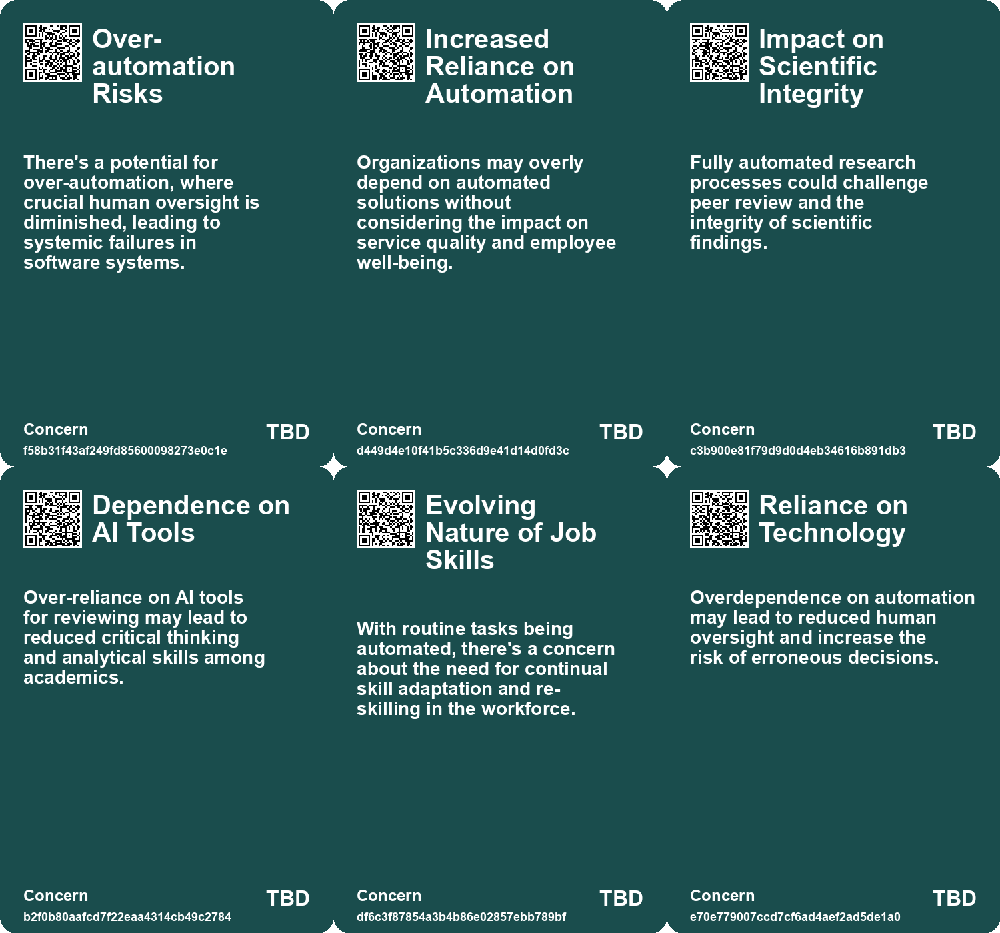
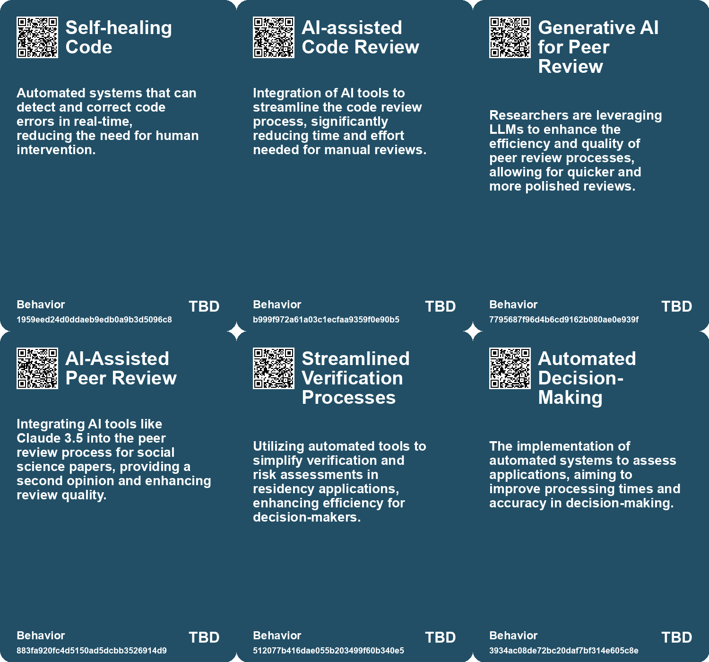
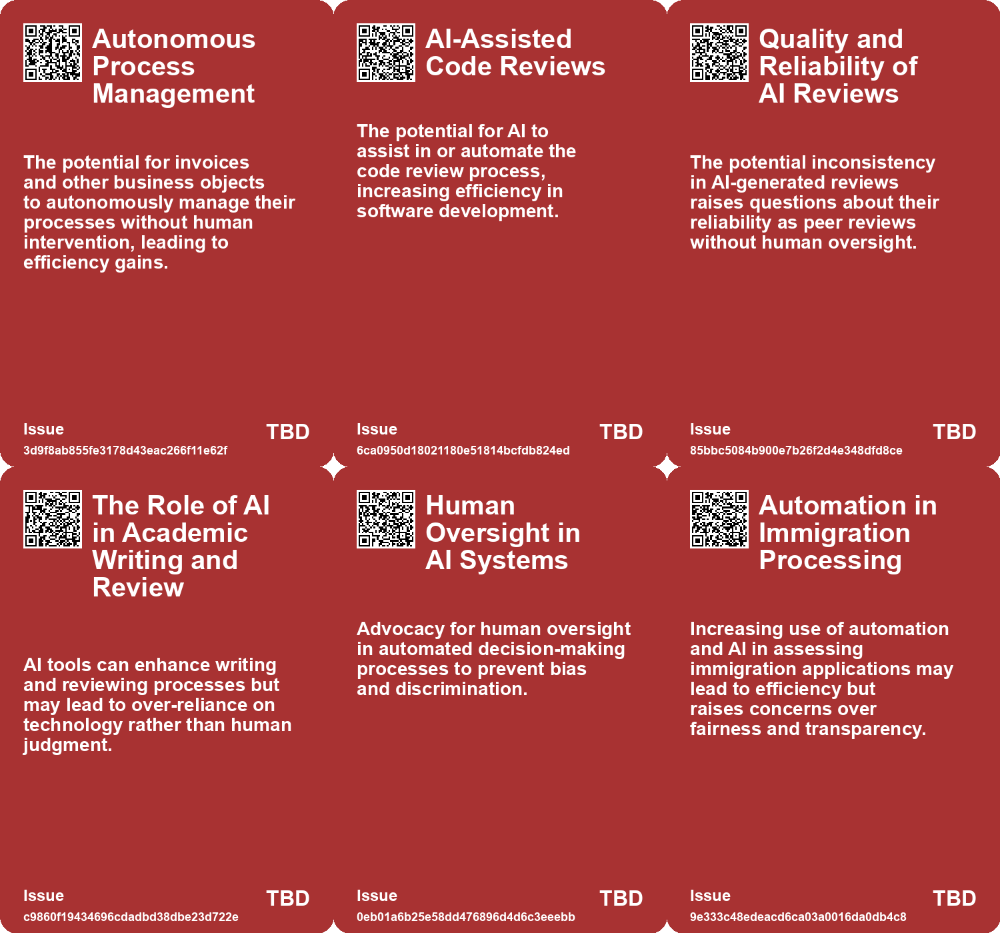
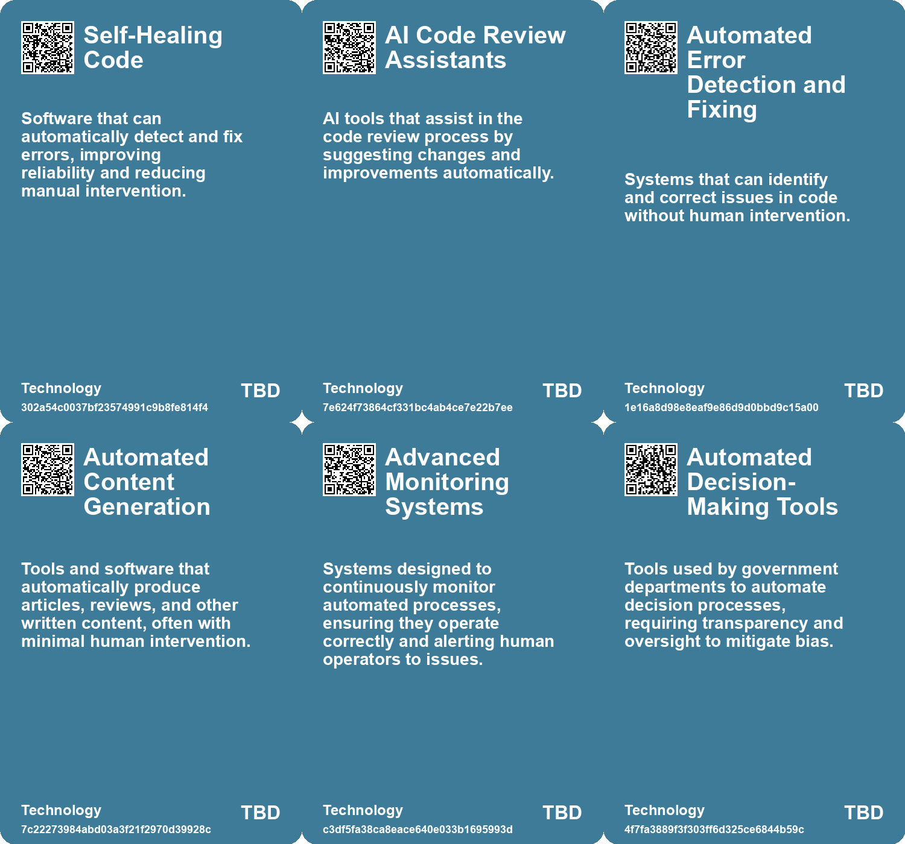

# *Topic*: Automation of Review Processes

# Summary

The intersection of artificial intelligence (AI) and automation is reshaping various sectors, from academia to corporate America. In the realm of social sciences, the role of reviewers is evolving with the introduction of AI models, such as large language models (LLMs), which assist in the paper review process. While these tools offer efficiency, ethical concerns regarding intellectual property and the necessity of human expertise remain paramount.

In scientific research, the emergence of autonomous AI systems, like "The AI Scientist," promises to revolutionize how studies are conducted. This system can independently generate research papers, potentially transforming the research landscape. However, it raises concerns about job displacement within traditional research roles and the implications for university enrollments.

Automation anxiety is a recurring theme, with historical examples illustrating that technological advancements do not always lead to job loss. Instead, automation can create new opportunities, reduce costs, and promote sustainability. Yet, the need for regulation and ethical guidelines is emphasized to ensure responsible implementation.

Governments are increasingly leveraging AI to enhance productivity and efficiency. The U.S. Internal Revenue Service exemplifies how AI can streamline processes and improve service delivery. However, challenges such as talent shortages and the need for scalable AI applications persist.

The impact of AI on the job market is complex. Research indicates that while some tasks, particularly in computer vision, are economically viable for automation, a gradual integration of AI is necessary. This approach allows for the exploration of new job categories and the potential reduction of AI system costs.

In white-collar jobs, AI copilots are becoming integral to workflows, particularly in sectors like banking and healthcare. Startups are encouraged to adopt AI solutions to enhance efficiency, with studies showing that a significant portion of tasks can be accelerated through AI assistance.

The concept of Agentic Business Objects (ABOs) is gaining traction, advocating for data records that autonomously manage themselves. This shift could eliminate inefficiencies caused by data silos, requiring employees to adapt their skills to oversee these self-managing entities.

Self-healing code, driven by LLMs, is emerging in software development, promising improved outcomes through self-reflection. However, challenges related to code quality and the need for human oversight remain critical.

Generative AI tools are increasingly popular among researchers, aiding in writing and editing research papers. While these tools can enhance scientific communication, concerns about inaccuracies and ethical implications, such as plagiarism, are significant.

The rise of AI in corporate America is expected to impact middle management more than hourly workers. AI decision-making tools are predicted to streamline operations, potentially leading to job reductions in management roles. The success of these implementations hinges on strong leadership and a clear vision.

The relationship between AI and wages is nuanced. Research indicates that automating complex tasks can lower wages while increasing employment, whereas automating routine tasks may reduce jobs but raise wages for remaining workers. The future of work will depend on how AI is integrated into various industries.

As AI technologies continue to evolve, the need for transparency and ethical considerations in their deployment becomes increasingly critical. Governments are responding to concerns about bias and discrimination by developing frameworks to assess the impact of AI systems.

# Seeds

|    | name                                               | description                                                                                      | change                                                                                                           | 10-year                                                                                                        | driving-force                                                                                           |
|---:|:---------------------------------------------------|:-------------------------------------------------------------------------------------------------|:-----------------------------------------------------------------------------------------------------------------|:---------------------------------------------------------------------------------------------------------------|:--------------------------------------------------------------------------------------------------------|
|  0 | Rise of Intelligent Systems in Enterprise Software | Increasing use of intelligent systems to automate tasks and enhance business processes.          | Shift from traditional enterprise software to solutions enabling autonomous decision-making and task management. | In a decade, enterprise software will largely rely on intelligent systems that autonomously handle operations. | Need for increased efficiency and reduced operational overhead in organizational processes.             |
|  1 | AI-Assisted Code Reviews                           | AI tools are being developed to assist in code review processes, improving efficiency.           | Transition from fully manual code reviews to AI-assisted reviews that speed up the process.                      | In a decade, AI may conduct initial reviews, allowing developers to focus on complex issues.                   | The need for increased efficiency in code review processes due to growing codebases.                    |
|  2 | Dependence on Skilled Operators                    | Increased automation leads to greater reliance on highly skilled human operators for management. | Shift from human-operated systems to automated systems requiring skilled oversight.                              | Operators will require continuous training to maintain skills in increasingly complex automated systems.       | The growth of automated systems necessitating skilled human oversight to ensure reliability and safety. |
|  3 | AI in Academic Review Process                      | Increasing use of AI tools like Claude for reviewing academic papers.                            | Shift from human-only reviews to AI-assisted evaluations in academic publishing.                                 | Widespread acceptance of AI as a standard tool in academic peer review processes.                              | Demand for efficiency and consistency in academic publishing.                                           |
|  4 | Diversity in Journal Policies                      | Variability in journal policies regarding the use of AI in manuscript reviews.                   | From a lack of standardization to clear, diverse policies across journals on AI usage.                           | A structured framework governing AI use in manuscript evaluation across journals.                              | Increased scrutiny and ethical considerations surrounding AI tools in academia.                         |
|  5 | Streamlining Immigration Processes                 | Automation of various visa and immigration application assessments.                              | Shift from manual processing of immigration applications to automated systems.                                   | Faster processing times for immigration applications leading to improved user experiences.                     | Demand for efficiency and speed in immigration processing systems.                                      |
|  6 | Support for Refugee Applications via Automation    | Automation of processing for privately sponsored refugee applications.                           | From manual reviews to automated assessments of refugee applications.                                            | Increased capacity to handle refugee applications efficiently and effectively.                                 | Humanitarian needs and the urgency to process refugee applications faster.                              |
|  7 | AI-Driven Automation in Government                 | Governments are increasingly using AI technologies for automating operational tasks.             | Transitioning from traditional methods to AI-driven processes for enhanced efficiency.                           | In 10 years, AI may fully automate many routine government tasks, reshaping public service delivery.           | The need for higher efficiency and effectiveness in government operations drives this change.           |
|  8 | Emergence of Autonomous Research Assistants        | Development of chatbot systems to automate Q&A for understanding research papers.                | Shift from manual reading and comprehension to automated assistance in research.                                 | In 10 years, researchers may rely heavily on AI for instant insights from papers.                              | The increasing volume of published research and the need for efficient information processing.          |
|  9 | Startups Targeting Painful Workflows               | Startups can automate tedious processes like document checking and data collection.              | Shift from traditional manual workflows to automated solutions provided by startups.                             | Startups will dominate sectors like banking and healthcare by automating painful workflows.                    | The demand for improved efficiency and customer experience in service industries.                       |

# Concerns

|    | name                             | description                                                                                                                             |
|---:|:---------------------------------|:----------------------------------------------------------------------------------------------------------------------------------------|
|  0 | Over-automation Risks            | There's a potential for over-automation, where crucial human oversight is diminished, leading to systemic failures in software systems. |
|  1 | Increased Reliance on Automation | Organizations may overly depend on automated solutions without considering the impact on service quality and employee well-being.       |
|  2 | Impact on Scientific Integrity   | Fully automated research processes could challenge peer review and the integrity of scientific findings.                                |
|  3 | Dependence on AI Tools           | Over-reliance on AI tools for reviewing may lead to reduced critical thinking and analytical skills among academics.                    |
|  4 | Evolving Nature of Job Skills    | With routine tasks being automated, there's a concern about the need for continual skill adaptation and re-skilling in the workforce.   |
|  5 | Reliance on Technology           | Overdependence on automation may lead to reduced human oversight and increase the risk of erroneous decisions.                          |
|  6 | Algorithmic Accountability       | Challenges in holding automated systems accountable for incorrect decisions or failures in the decision-making process.                 |
|  7 | Impact on Employment             | Automation of application processes might impact job security for officials conducting these assessments.                               |
|  8 | Uniformity in Handwriting        | Automated handwriting tools lead to uniform submissions, raising suspicion and undermining the authenticity of reports.                 |
|  9 | Quality Control in Automation    | Automated systems may struggle with maintaining quality and accuracy, particularly in sensitive industries like healthcare and finance. |

# Cards

## Concerns

## Behaviors

## Issue

## Technology

# Links

* [Global Government Reforms: Advancements in Efficiency through Digital Transformation and AI](https://futures.kghosh.me/3f295c6c0c9af1ecd24bfa22b6ef6b47)
* [Exploring AI's Impact on Legal Analysis: Insights from a Randomized Trial](https://futures.kghosh.me/4f3697c8144f776170502c3036e1d6f3)
* [MIT Study Challenges AI Job Displacement Fears with Economic Viability Insights](https://futures.kghosh.me/89ee61cc0d9fa77ecb1eb4100622a53f)
* [Generative AI's Impact on Scientific Writing: Opportunities and Concerns](https://futures.kghosh.me/60f3a64993d5e355561c59e5d641bec9)
* [The Role of AI Copilots in Transforming White-Collar Workflows and Opportunities for Startups](https://futures.kghosh.me/fb3e9547ab9dcd19c85e551ae3230a30)
* [The Future of Corporate America: AI's Role in Replacing Middle Management and Transforming Retail Workforces](https://futures.kghosh.me/95ddb5a9e335a7f5f977a4ff7b1d17e3)
* [The Promise and Risks of Automation: Creating Jobs While Navigating Challenges](https://futures.kghosh.me/7e84b45a4f5f2bdecec14572bc5fe323)
* [Recent Developments in AI Regulation and Technology: A Review of Key Initiatives and Critiques](https://futures.kghosh.me/a009ccdffaa59f53de56887aa19e6239)
* [Navigating the Use of AI and Handwriting Robots in China's Bureaucracy](https://futures.kghosh.me/a224d3757e88a2790c846a856fd98d7b)
* [The Paradox of Automation: Dependency on Skilled Operators Despite Increased Automation](https://futures.kghosh.me/6a67048dd9edce24a136022c6ce0c2eb)
* [Transforming Business Processes: The Rise of Agentic Business Objects (ABOs) and AI Integration](https://futures.kghosh.me/3284928cf2598cdbd55d0bb8efda5d42)
* [Summary of Algorithmic Impact Assessments for Automated Immigration Tools in Canada](https://futures.kghosh.me/f4c4b44832de983ad30047e9b2632bc1)
* [The Rise of AI-Generated Content: Implications for Authors and Readers](https://futures.kghosh.me/dcb77b655838bfb2e77e5440c5b3a3b5)
* [The Impact of Generative AI on Automation and Employment: Opportunities and Challenges Ahead](https://futures.kghosh.me/897ed4ea5ae6173e4397f1091ddb7e7e)
* [The Future of Software Development: Embracing Self-Healing Code and AI Integration](https://futures.kghosh.me/b40abee8454abdd879147c0e086bb9c1)
* [UK Government to Publish AI Tools Register Amid Bias Concerns and Campaigner Challenges](https://futures.kghosh.me/4dfbcd63db7ee3f5da2f9ecc8eaf2ed0)
* [Navigating Organizational Chaos: The Role of AI and Human Judgment in Adoption](https://futures.kghosh.me/95f960a9689f6c13694908fb762c84e5)
* [Exploring an Autonomous Dual-Chatbot System for Efficient Research Paper Understanding](https://futures.kghosh.me/3f2d71fd29e59b34cde2af2dd3222940)
* [Evaluating AI's Role in Academic Paper Review: Insights and Concerns](https://futures.kghosh.me/f4b7f7a682bd80e66e5e982310837004)
* [The AI Scientist: A Revolutionary Autonomous AI for Scientific Research](https://futures.kghosh.me/3607a211a5ceadc4c9c4f86cd5fcd2df)
* [Navigating Job Transitions: Embracing AI and Automation with Confidence](https://futures.kghosh.me/b0d2ee7f12089094cc1ccbe512130503)
* [Analyzing AI's Impact on Wages and Employment: Two Diverging Pathways in the Future of Work](https://futures.kghosh.me/ef65b4ec6a48bf076171480f9ec6c8cc)