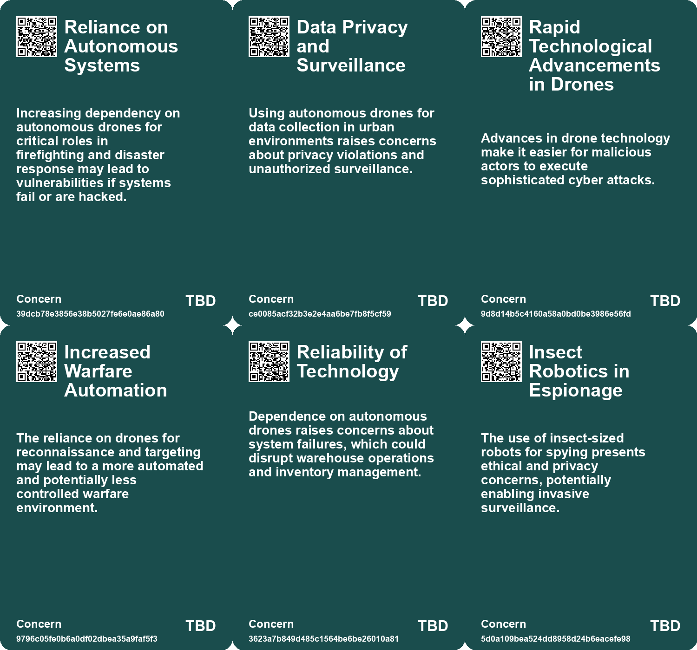
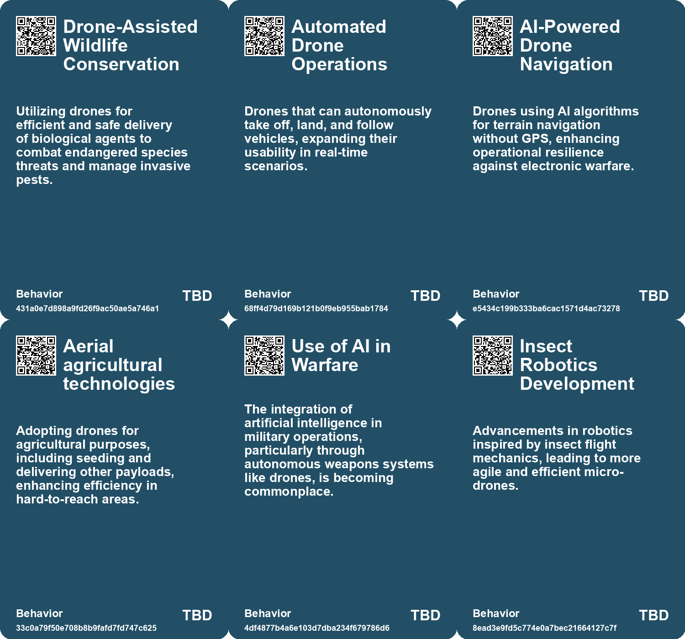
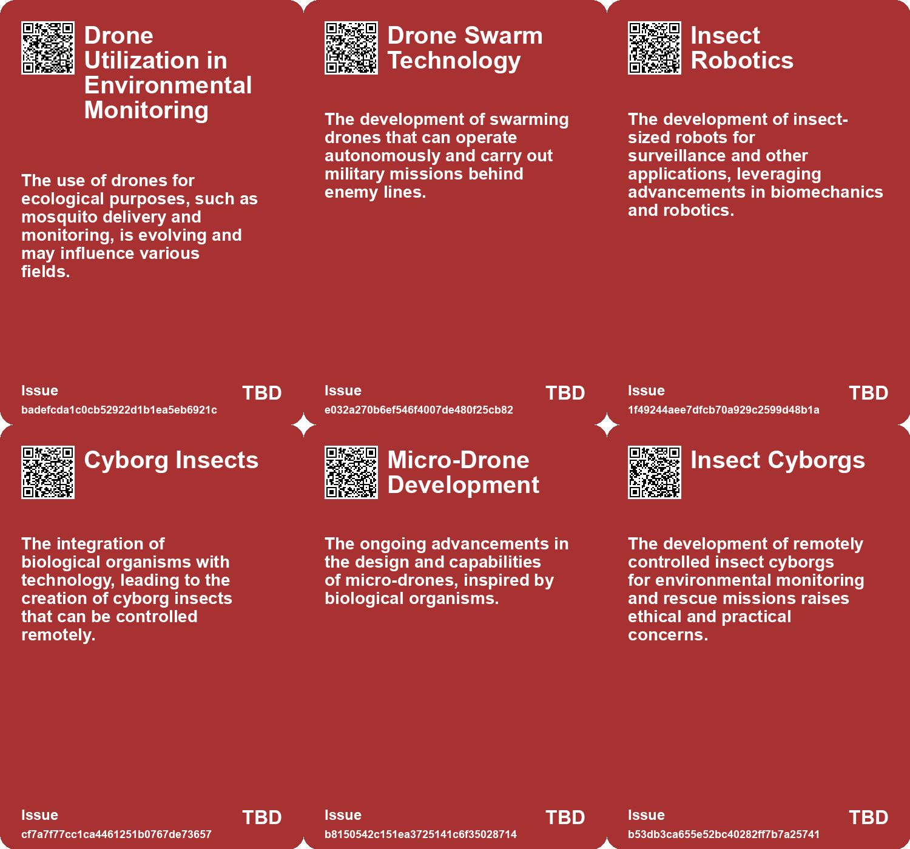
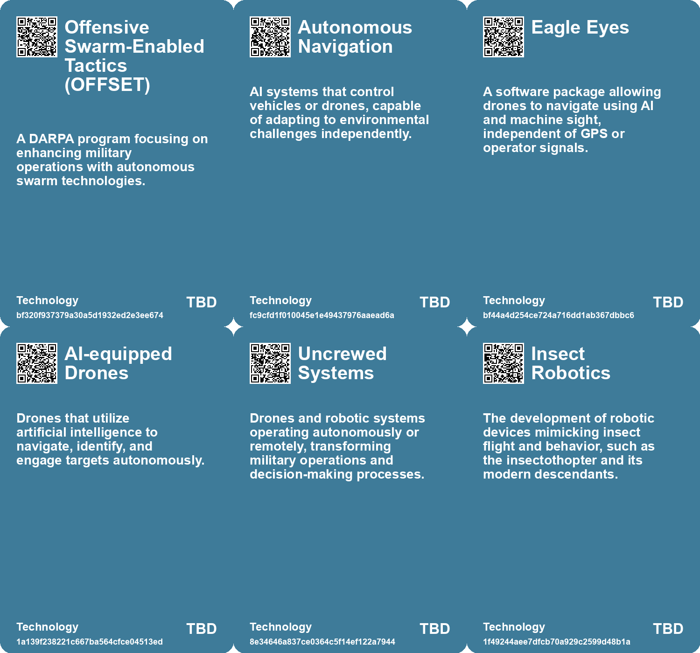

# *Topic*: Autonomous Drone Insects (ADIs)

# Summary

The integration of drones and autonomous systems into various sectors is reshaping modern technology and warfare. The CIA's historical efforts to develop robotic devices, such as the insectothopter, laid the groundwork for contemporary advancements in insect robotics and drone technology. Research initiatives have emerged, including the development of the Skeeter drone and cyborg dragonflies, showcasing the evolution of these technologies since the Cold War.

In military applications, drones are playing a crucial role in the ongoing conflict between Russia and Ukraine. Ukrainian forces have utilized drones for precision strikes and ammunition delivery, while also facing challenges from Russian electronic warfare. To counteract these threats, Ukraine has developed Eagle Eyes, a software that enables drones to navigate using machine vision, even when communication signals are jammed. The emergence of lethal autonomous weapons, including AI-equipped drones, has sparked debates about their ethical implications and the need for regulations, with the United Nations considering a ban on weapons that operate without human oversight.

The use of autonomous systems is not limited to warfare. A study from Oregon State University demonstrated that a single operator can effectively manage over 100 autonomous ground and aerial robots, which has significant implications for applications like disaster response and package delivery. This research highlights the potential for efficient workload management in controlling large swarms of drones.

In agriculture, companies like Deere & Co. are advancing autonomous farming technologies, including fully driverless tractors. This shift towards automation aims to enhance efficiency in farming practices, although the industry is still in its early stages. Similarly, BYD has introduced a vehicle-mounted drone system that allows drones to launch and land while the vehicle is in motion, further illustrating the growing intersection of transportation and drone technology.

Environmental and conservation efforts are also leveraging drone technology. In Hawaii, genetically modified mosquitoes are being deployed via drones to combat avian malaria threatening endangered bird species. This innovative approach aims to stabilize populations of native birds while addressing the challenges posed by invasive mosquito species.

The use of drones is not without controversy. In New York City, drones deployed for beach safety have faced opposition from local shorebirds, raising concerns about the impact on endangered species. The interaction between drones and wildlife underscores the need for careful consideration of environmental impacts as drone technology becomes more prevalent.

Finally, the development of new technologies continues to push boundaries. Researchers at the University of Texas at Dallas have created a wireless power transfer system that allows drones to recharge mid-flight, potentially revolutionizing the operational capabilities of drones and other autonomous devices. This innovation reflects the ongoing quest for advancements that enhance the functionality and efficiency of drone technology across various fields.

# Seeds

|    | name                                  | description                                                                                               | change                                                                                                          | 10-year                                                                                                            | driving-force                                                                                             |
|---:|:--------------------------------------|:----------------------------------------------------------------------------------------------------------|:----------------------------------------------------------------------------------------------------------------|:-------------------------------------------------------------------------------------------------------------------|:----------------------------------------------------------------------------------------------------------|
|  0 | Emerging Delivery Methods for Insects | The development of biodegradable pods for mosquito delivery via drones.                                   | Moving from manual release methods to automated aerial delivery for ecological interventions.                   | Within a decade, aerial delivery systems may become standard in ecological management and pest control efforts.    | The need for efficient and safe methods to manage invasive species drives this technological advancement. |
|  1 | Automated drone operations            | Drones can autonomously return to vehicles, enhancing user experience.                                    | Transition from manual drone operation to automated command and control.                                        | Future drones could operate entirely autonomously, transforming logistics and travel.                              | Advancements in AI and autonomous technology driving new consumer applications.                           |
|  2 | AI Integration in Military Technology | AI algorithms are now essential for drone navigation and operations.                                      | Shift from manual control to autonomous AI-driven operations in military tech.                                  | AI will play a pivotal role in all military operations, enhancing decision-making speed.                           | The need for faster, autonomous responses in combat scenarios.                                            |
|  3 | Increased Drone Capabilities          | Drones are becoming more powerful, portable, and capable of sophisticated tasks.                          | Evolution from basic consumer drones to advanced tech capable of targeted cyberattacks.                         | Future drones could integrate AI for autonomous hacking, complicating detection and prevention efforts.            | Continuous innovation in drone technology meets the needs of malicious actors.                            |
|  4 | Advancements in Insect Robotics       | Development of insect-inspired drones like Skeeter and Delfly Micro shows progress in robotics.           | Shift from theoretical insect robots to practical, agile drones that can operate in real-world conditions.      | Micro-drones could become commonplace in surveillance, environmental monitoring, and search-and-rescue operations. | Continued research and technological evolution in robotics and biomechanics.                              |
|  5 | Cyborg Insect Technology              | Creation of cyborg dragonflies controlled by remote signals indicates a fusion of biology and technology. | Move from purely robotic insects to biologically enhanced drones, merging natural capabilities with technology. | Cyborg insects could revolutionize fields like surveillance, environmental monitoring, and agriculture.            | Advancements in neurotechnology and understanding of animal behavior.                                     |
|  6 | Insect Cyborgs Development            | Advancements in creating cyborg insects like Madagascar hissing cockroaches for various applications.     | From traditional robotics to bio-integrated systems using living organisms.                                     | Widespread use of biohybrids for environmental monitoring and disaster response.                                   | The need for efficient monitoring solutions in urban and natural disasters.                               |
|  7 | Solar-Powered Robotics                | Emergence of solar-powered technologies in insect cyborgs to enhance functionality.                       | From reliance on batteries to sustainable energy sources for robotic systems.                                   | Advancement of self-sustaining robotic systems using renewable energy in various applications.                     | The push for sustainable technology solutions in robotics and environmental applications.                 |
|  8 | Integration of Sensors in Biohybrids  | Potential to integrate sensors and cameras into cyborg insects for enhanced capabilities.                 | From simple locomotion control to complex environmental monitoring systems.                                     | Development of multifunctional biohybrids capable of diverse tasks in real-time environments.                      | Technological advancements in miniaturization and energy efficiency for sensors.                          |
|  9 | Rise of Robotic Insects               | Increased interest and research in creating robotic versions of various insects.                          | From traditional robotics focused on machines to bio-inspired robotic systems.                                  | A new class of robotic systems that mimic insect behaviors and functionalities.                                    | Nature-inspired design principles driving innovation in robotics.                                         |

# Concerns

|    | name                                        | description                                                                                                                                                    |
|---:|:--------------------------------------------|:---------------------------------------------------------------------------------------------------------------------------------------------------------------|
|  0 | Reliance on Autonomous Systems              | Increasing dependency on autonomous drones for critical roles in firefighting and disaster response may lead to vulnerabilities if systems fail or are hacked. |
|  1 | Data Privacy and Surveillance               | Using autonomous drones for data collection in urban environments raises concerns about privacy violations and unauthorized surveillance.                      |
|  2 | Rapid Technological Advancements in Drones  | Advances in drone technology make it easier for malicious actors to execute sophisticated cyber attacks.                                                       |
|  3 | Increased Warfare Automation                | The reliance on drones for reconnaissance and targeting may lead to a more automated and potentially less controlled warfare environment.                      |
|  4 | Reliability of Technology                   | Dependence on autonomous drones raises concerns about system failures, which could disrupt warehouse operations and inventory management.                      |
|  5 | Insect Robotics in Espionage                | The use of insect-sized robots for spying presents ethical and privacy concerns, potentially enabling invasive surveillance.                                   |
|  6 | Environmental Impact of Surveillance Drones | The proliferation of drones, including bio-inspired ones, could negatively affect ecosystems and wildlife through disruption and habitat destruction.          |
|  7 | Control Challenges in Miniaturized Drones   | The technical difficulties in controlling miniaturized drones in dynamic environments may lead to unintended consequences or failures.                         |
|  8 | Environmental Impact of Insect Robots       | Potential ecological consequences of deploying cyborg insects for monitoring or rescue operations in various environments.                                     |
|  9 | Technical Reliability and Safety            | Concerns about the reliability of the technology and safety in natural disasters when using insect cyborgs for search and rescue.                              |

# Cards

## Concerns

## Behaviors

## Issue

## Technology

# Links

* [The Rise of Lethal Autonomous Weapons: Ethical and Regulatory Challenges in Modern Warfare](https://futures.kghosh.me/7f25552b9124a4dc3833e782ef331275)
* [Innovative Research on Madagascar Hissing Cockroaches: The Rise of Insect Cyborgs](https://futures.kghosh.me/b0cc49ba07708ecffb1a8c88d66554fd)
* [University of Texas Team Develops Wireless Charging Tech for Drones and Beyond](https://futures.kghosh.me/442dee7d7ffa984ba157b0d7bce3add0)
* [NYC Beach Birds Attack Police Drones in Defense of Their Territory](https://futures.kghosh.me/86ea49a6a7f6e3c63190508eff2d8945)
* [The CIA's Insectothopter: A Revolutionary Yet Unused Spy Robot from the 1970s](https://futures.kghosh.me/a960d86f2945ad8d666b1c649c42edc1)
* [Ukraine Unveils Brave1 Drones: Electronic Warfare-Resistant Kamikaze Technology with 31-Mile Range](https://futures.kghosh.me/fcc056c1ff7bd727a512e8b77f936c54)
* [The Rise of Drone-Enabled Cyberattacks: A Financial Firm Targeted](https://futures.kghosh.me/20ad49fa494b31286502efcbf6e22d9a)
* [BYD Launches Vehicle-Mounted Drone System 'Lingyuan' in Collaboration with DJI](https://futures.kghosh.me/64f573dc9b96171072f5c75905aaf5b3)
* [The US Military's Quest for Robo-Mules: Balancing Load Reduction and Heavy Armament Needs](https://futures.kghosh.me/7519e9a7f3750f7460c2593c69c6a243)
* [Transforming Warfare: The Role of Uncrewed Systems in Modern Military Strategy](https://futures.kghosh.me/df83d0064f88153a92b016bc412f6b97)
* [Introducing the Photon Matrix: A New Laser Device for Eliminating Mosquitoes](https://futures.kghosh.me/5b5557a95e749ef18332f87cc39f1b7d)
* [Oregon State University Research Shows One Person Can Control 100+ Autonomous Robots Efficiently](https://futures.kghosh.me/6dd300585482d1bda14bc77899469c10)
* [The Surprising Capabilities and Risks of Artificial Intelligence in Modern Applications](https://futures.kghosh.me/48f89d6d7e552a0a5b1f6b59d7eeb0e9)
* [Anduril's Fury: The Future of Autonomous Warfare and AI in Combat](https://futures.kghosh.me/85deccc43eda257950f61b7acd662b07)
* [Ukrainian Drones Attack Russian Ground Robots: A Rare Instance of Drone-on-Drone Combat](https://futures.kghosh.me/e1c2bc61b45e6587c4cc278532416665)
* [U.S. Army's Initiative to Use High-Altitude Balloons for Drone Swarms and ISR Operations](https://futures.kghosh.me/4d4f8bb17a5a7e5a852786591e70ffc8)
* [Innovative E-seed Technology Enhances Aerial Seeding Inspired by Nature](https://futures.kghosh.me/58c165e1a46408307f2b60f63df7c549)
* [Revolutionizing Naval Warfare: The Rise of Autonomous Underwater Vehicles in Modern Conflict](https://futures.kghosh.me/ec4164fa3eae25e84bb4570d78845332)
* [John Deere's Ambitious Journey Towards AI and Robotics Leadership in Agriculture](https://futures.kghosh.me/e623b9d82816485d864a5faeb2f0d15b)
* [Air Force Chief Claims Autonomous F-16s Are Almost Equal to Human Pilots](https://futures.kghosh.me/6047d9eadd65f8e0d39b308d93c870ab)
* [Ikea Expands Use of Drones for Inventory Management Across Europe](https://futures.kghosh.me/73c05925a7ca7e2fe6fd64b7074f4098)
* [Ukraine Develops AI Software to Counteract Russian Drone Jamming](https://futures.kghosh.me/c53d8deebd79b3b56d65c227875d65e6)
* [Study Reveals Human Controllers Can Manage Large Swarms of Robots Effectively](https://futures.kghosh.me/d53909b5dc0d4c947475949f1a1686f7)
* [Conservation Efforts in Hawaii: Using Biologically Modified Mosquitoes to Save Endangered Honeycreepers](https://futures.kghosh.me/855f7683fc6470c8fbe82c31b535416f)
* [New York National Guard Soldiers Train with Pocket-Sized Drones to Enhance Reconnaissance and Safety](https://futures.kghosh.me/68360fde62e6a94980474fa1805e4b8c)
* [Conflict Between Drones and Shorebirds on NYC Beaches Raises Wildlife Concerns](https://futures.kghosh.me/e8beabe726a250dd1676e8f681a56c9d)