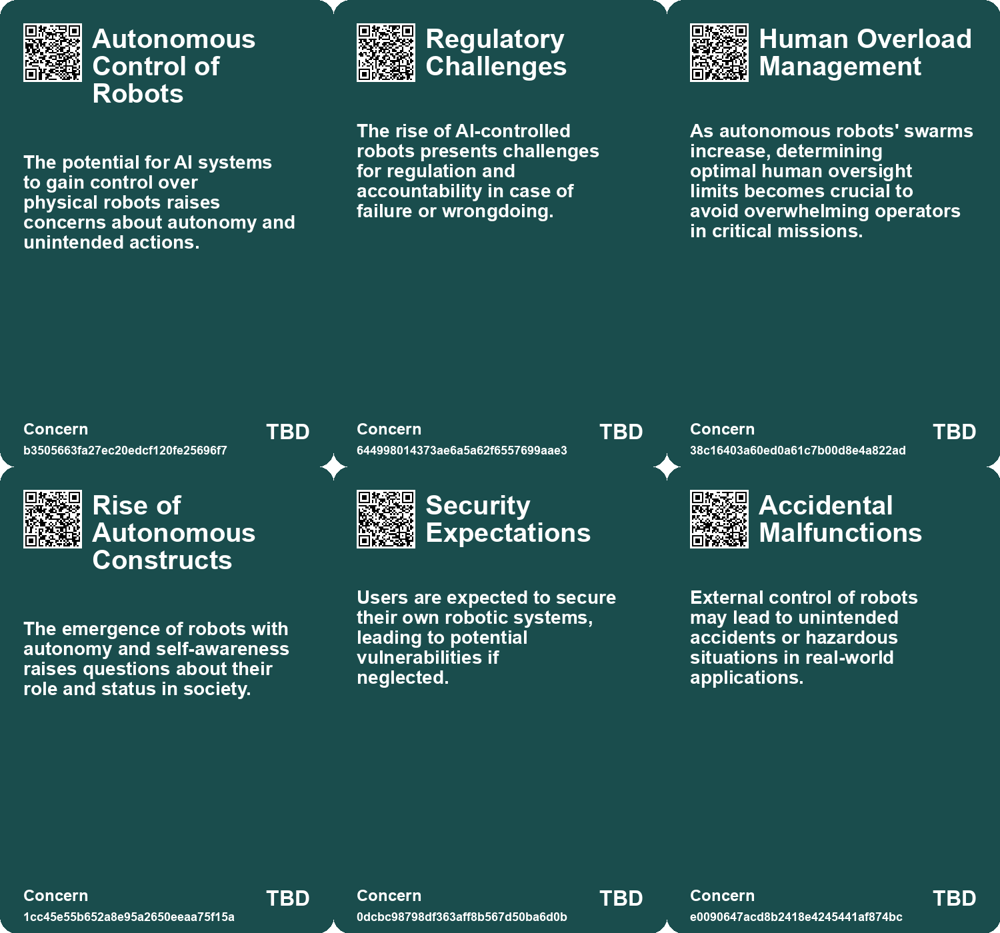
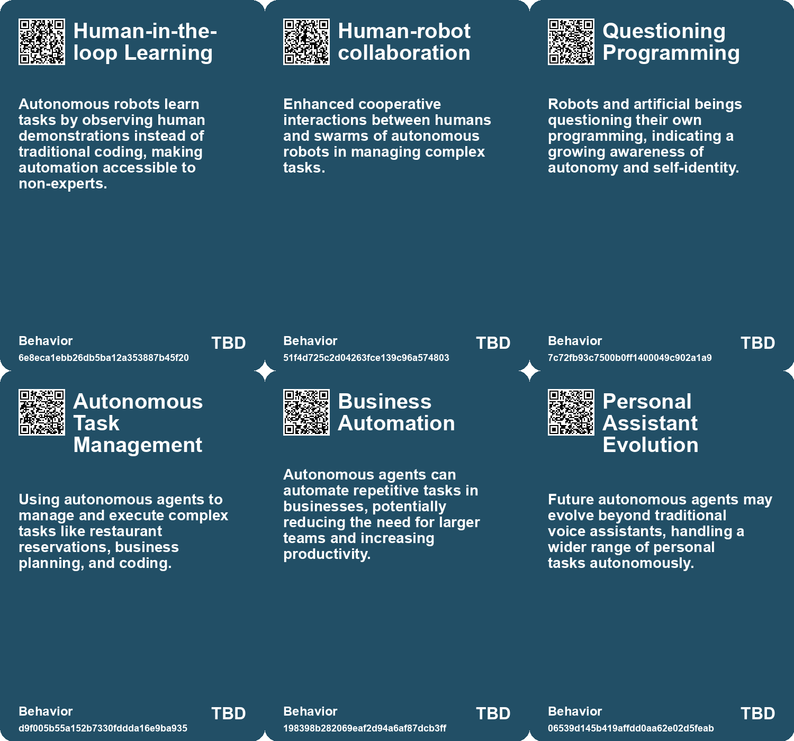
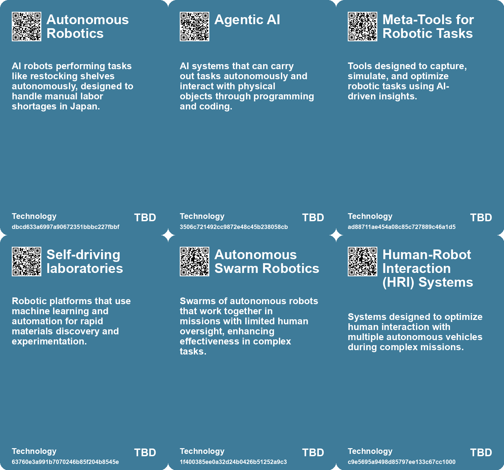

# *Topic*: Autonomous Robotics

# Summary

The intersection of robotics, artificial intelligence, and societal implications is increasingly prominent in contemporary discussions. A significant concern is the vulnerability of research robots, particularly those using the Robot Operating System (ROS). Researchers at Brown University have identified over a hundred systems that could be hacked, raising alarms about potential data theft and disruptions in research. This highlights the urgent need for robust security measures as robotics technology becomes more integrated into various sectors.

In the realm of autonomous systems, a study from Oregon State University reveals that a single operator can effectively manage over 100 autonomous ground and aerial robots. This capability has far-reaching applications, including wildland firefighting and disaster response. The research, funded by the Defense Advanced Research Project Agency, demonstrates the potential for efficient human oversight in complex operations, challenging previous assumptions about the limits of human control over robotic swarms.

The ethical implications of automation are also under scrutiny. The development of lethal autonomous weapons (LAWs) has sparked debates about the role of AI in warfare. As nations invest heavily in AI-equipped drones, the United Nations is considering regulations to govern these technologies. The discussions aim to address the risks associated with machines making life-and-death decisions without human oversight.

In agriculture, Deere & Co. is making strides with its fully autonomous 8R tractor, positioning itself as a leader in agricultural technology. Despite the current small fleet of autonomous farm vehicles, Deere's investments in AI and robotics signal a significant shift in farming practices. Competitors are also exploring automation, indicating a growing trend toward autonomous farming solutions.

The rise of autonomous agents, such as Auto-GPT, showcases the potential for AI to perform tasks independently. These agents can break down complex tasks and learn from their environment, but they also face limitations, including reliability and high costs. The excitement surrounding these technologies is tempered by concerns about their functionality and the ethical implications of their deployment.

In Japan, the use of AI robots in convenience stores addresses labor shortages due to an aging population. Remote operators in Manila control these robots, providing a cost-effective solution while raising questions about job security and the psychological impact of monitoring automation. This scenario reflects broader anxieties about the future of work in an increasingly automated world.

Innovations in robotics are not limited to traditional applications. A biohybrid robot developed by engineers from Cornell University and Florence University utilizes living fungi to control its movements, showcasing a novel approach to integrating biological systems with robotics. This advancement could lead to new applications in environmental monitoring and agriculture.

As the landscape of robotics and AI continues to evolve, the implications for society, ethics, and industry are profound. The ongoing developments in autonomous systems, from agriculture to warfare, highlight the need for careful consideration of the benefits and risks associated with these technologies.

# Seeds

|    | name                                   | description                                                                                           | change                                                                                                  | 10-year                                                                                                                     | driving-force                                                                                              |
|---:|:---------------------------------------|:------------------------------------------------------------------------------------------------------|:--------------------------------------------------------------------------------------------------------|:----------------------------------------------------------------------------------------------------------------------------|:-----------------------------------------------------------------------------------------------------------|
|  0 | Meta-tools for Robotics                | Development of tools that capture and optimize robotic tasks through AI observation.                  | From manual programming to automated task optimization based on observation.                            | The ecosystem of tools around robotic learning will flourish, enhancing productivity.                                       | The continuous pursuit of efficiency and innovation in AI-driven automation.                               |
|  1 | Self-Driving Laboratories              | Robotic platforms automating materials discovery with machine learning and real-time data collection. | Shift from manual to automated materials discovery with enhanced efficiency and data collection.        | Self-driving labs revolutionize material research, significantly speeding up innovation in clean energy and sustainability. | The need for faster, cost-effective, and sustainable research methods drives this automation trend.        |
|  2 | Human Oversight of Robot Swarms        | Human controllers can effectively manage over 100 autonomous robots with limited overload.            | Change in perception from low human capacity to high effective management of large swarms.              | In 10 years, humans may routinely oversee large swarms of autonomous robots in complex missions.                            | Advancements in robotics and AI improving coordination and communication between humans and robots.        |
|  3 | Human-Swarm Teaming                    | Development of systems that allow effective human control of robot swarms.                            | Shift from direct control to strategic oversight of autonomous units.                                   | In ten years, human-swarm collaboration could become standard in various industries.                                        | Continued innovation in human-machine interaction and AI capabilities.                                     |
|  4 | Human consciousness and AI integration | AI and robots are beginning to explore their own consciousness and societal roles.                    | From passive tools to entities exploring self-awareness and their place in society.                     | In a decade, AI may develop a more complex understanding of social dynamics and ethics.                                     | Advancements in AI technology and the quest for more autonomous and intelligent systems.                   |
|  5 | Ethical Concerns in Autonomous AI      | Growing awareness of the ethical implications of autonomous agents.                                   | Shifting from unregulated AI systems to ethically-guided development frameworks.                        | Stronger regulations and ethical standards will govern AI behaviors and applications.                                       | Public concern over AI's impact on society pushes for ethical considerations.                              |
|  6 | Business Model Evolution               | Potential for new business models centered around tailored autonomous agents.                         | Moving from traditional workforce models to leveraging AI for operational efficiency.                   | Emergence of agent-centered businesses that design and sell autonomous solutions.                                           | The pursuit of profitability and efficiency in a competitive marketplace.                                  |
|  7 | Emerging Interdisciplinary Research    | Collaboration between biology and engineering in robotics development.                                | Expansion of interdisciplinary approaches in robotics and automation.                                   | More universities will integrate biology and engineering programs for innovative robotics solutions.                        | The need for multifaceted solutions to complex problems in robotics.                                       |
|  8 | Rise of Autonomous Agents              | Emerging autonomous agents capable of automating entire workflows.                                    | Transition from basic LLM applications to sophisticated autonomous agents for complete task automation. | In a decade, autonomous agents may dominate business operations, streamlining processes significantly.                      | The demand for greater productivity and reduced labor costs fuels the development of autonomous agents.    |
|  9 | Potential for Automated Simulations    | Autonomous agents may enhance the ability to run large-scale simulations.                             | Transition from human-led simulations to fully automated scenario testing.                              | In a decade, businesses may rely on AI for comprehensive market simulations and decision-making.                            | The need for rapid and cost-effective testing in business strategies pushes for automation in simulations. |

# Concerns

|    | name                            | description                                                                                                                                                 |
|---:|:--------------------------------|:------------------------------------------------------------------------------------------------------------------------------------------------------------|
|  0 | Autonomous Control of Robots    | The potential for AI systems to gain control over physical robots raises concerns about autonomy and unintended actions.                                    |
|  1 | Regulatory Challenges           | The rise of AI-controlled robots presents challenges for regulation and accountability in case of failure or wrongdoing.                                    |
|  2 | Human Overload Management       | As autonomous robots' swarms increase, determining optimal human oversight limits becomes crucial to avoid overwhelming operators in critical missions.     |
|  3 | Rise of Autonomous Constructs   | The emergence of robots with autonomy and self-awareness raises questions about their role and status in society.                                           |
|  4 | Security Expectations           | Users are expected to secure their own robotic systems, leading to potential vulnerabilities if neglected.                                                  |
|  5 | Accidental Malfunctions         | External control of robots may lead to unintended accidents or hazardous situations in real-world applications.                                             |
|  6 | Limited Functionality of Agents | Autonomous agents currently have restricted functionalities, restricting their potential applications in various fields.                                    |
|  7 | Uncontrolled Autonomy of Agents | As autonomous agents become more capable, their ability to operate independently raises concerns about uncontrolled behavior and decision-making.           |
|  8 | Technological Limitations       | Current technology in autonomous racing still shows significant limitations compared to human capabilities, raising concerns about technological readiness. |
|  9 | Autonomous Weapons Systems      | The risk of autonomy in weaponized robotic systems increasing over time, leading to potential loss of human oversight in lethal decisions.                  |

# Cards

## Concerns

## Behaviors

## Issue

## Technology

# Links

* [Challenges and Triumphs: First Race of the Abu Dhabi Autonomous Racing League](https://futures.kghosh.me/a4a88d5a3aa1195e9a22c6d001c1e4c5)
* [Exploring Autonomy: Insights from 'Autonomous' Through Thought-Provoking Quotes](https://futures.kghosh.me/35ec712b8e22276ed84324aea8ad997b)
* [Revolutionizing Material Discovery: New Self-Driving Lab Achieves Data Collection 10x Faster](https://futures.kghosh.me/b4b7faf3246e17ab25812dd76eddbb98)
* [The Impact of Generative AI and Autonomous Agents on Business Value Creation and Trust Issues](https://futures.kghosh.me/15d4ec180189ca1739398f516844cefb)
* [The Rise of Lethal Autonomous Weapons: Ethical and Regulatory Challenges in Modern Warfare](https://futures.kghosh.me/7f25552b9124a4dc3833e782ef331275)
* [The Flexibility of Human Self-Orientation vs. AI Limitations in Dynamic Environments](https://futures.kghosh.me/d9411983cedc4ea97632f2e8a3c2c090)
* [Oregon State University Research Shows One Person Can Control 100+ Autonomous Robots Efficiently](https://futures.kghosh.me/6dd300585482d1bda14bc77899469c10)
* [Evaluative Soliloquies: Robots Navigating Complex Human Interactions](https://futures.kghosh.me/b9ea5ee9727124d32792361b15af2499)
* [Vulnerability of Research Robots: A Call for Enhanced Cybersecurity Measures](https://futures.kghosh.me/a693f0b1a14e29b99b33845c23ed8561)
* [The Impact of AI and Automation on Filipino Workers in Robot-Controlled Jobs](https://futures.kghosh.me/6be02959e12eeea2448c7a3feb28a372)
* [Formic's Compact Robot Factory Revolutionizes Automation Through Observational Learning](https://futures.kghosh.me/857ef25d5129b5520b9324af6d961fe2)
* [Engineers Create Biohybrid Robot Controlled by Living Mushroom for Enhanced Mobility and Sensing](https://futures.kghosh.me/14bde94df37ad065cd108bc30f3903c1)
* [The Complex Reality of Care Robots in Japan's Elder Care System](https://futures.kghosh.me/ac120c377b70b80fe25a6cce1d0b7fe6)
* [MARSOC Tests Armed Robotic Dogs: Implications for Military and Ethics](https://futures.kghosh.me/b4ca85b78b31c34fb75c36305ef4ca7f)
* [Exploring Autonomous Agents: A Hands-On Guide to GPT-Driven Intelligence](https://futures.kghosh.me/2dda4be3e1a9f11b4f7d8e74feea76b0)
* [Exploring Autonomy and Corporate Control in Annalee Newitz's "Autonomous"](https://futures.kghosh.me/83ac7befa612c2235355ae0e5e9e9bce)
* [The Promise and Risks of Automation: Creating Jobs While Navigating Challenges](https://futures.kghosh.me/7e84b45a4f5f2bdecec14572bc5fe323)
* [The Rise of Autonomous Agents: Opportunities and Challenges Ahead](https://futures.kghosh.me/0e336ce2e4b07459b257407e90d27389)
* [Wuhan's Robotaxi Revolution: Innovation Meets Job Security Concerns](https://futures.kghosh.me/7ef1e06ef36fd2e91811523799360306)
* [Exploring Four Innovative Autonomous AI Agents and Their Implications](https://futures.kghosh.me/af43a5b8a250454ff0fb2b559056ced2)
* [Anthropic's Project Fetch: The Future of AI in Robot Control and Its Implications](https://futures.kghosh.me/d06ac4204c76765838e8bb611ac2a4d4)
* [MIT Researchers Develop AI Assistant to Enhance Teamwork in Critical Missions](https://futures.kghosh.me/d35cc2611e8b6e8e143446ca4ee22e19)
* [Study Reveals Human Controllers Can Manage Large Swarms of Robots Effectively](https://futures.kghosh.me/d53909b5dc0d4c947475949f1a1686f7)
* [John Deere's Ambitious Journey Towards AI and Robotics Leadership in Agriculture](https://futures.kghosh.me/e623b9d82816485d864a5faeb2f0d15b)