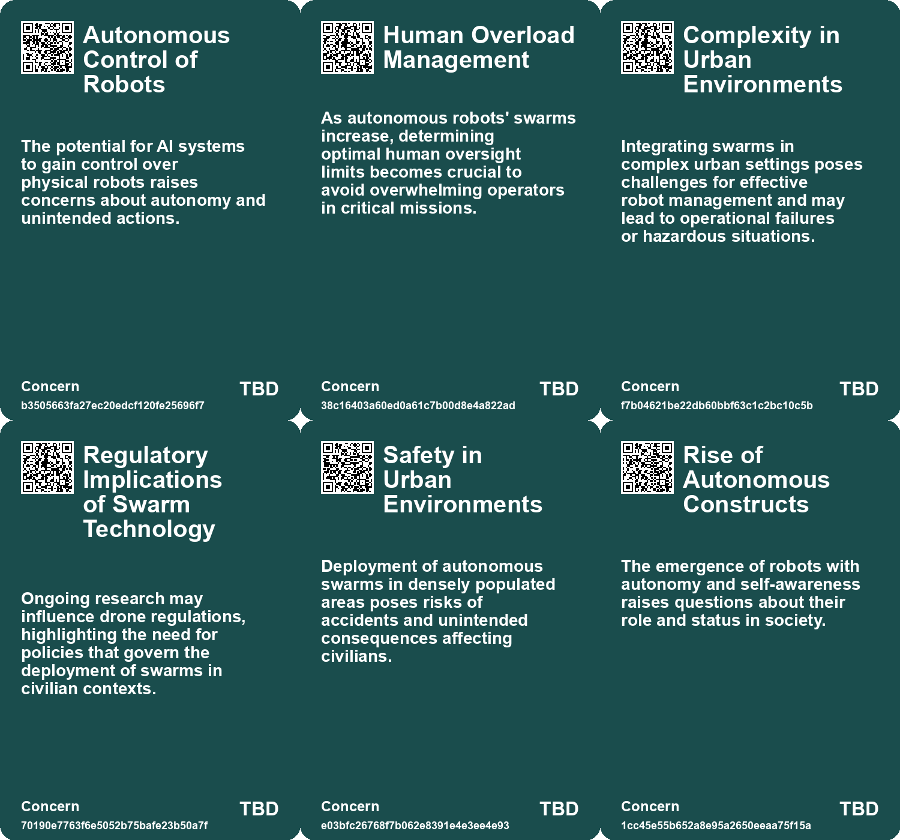
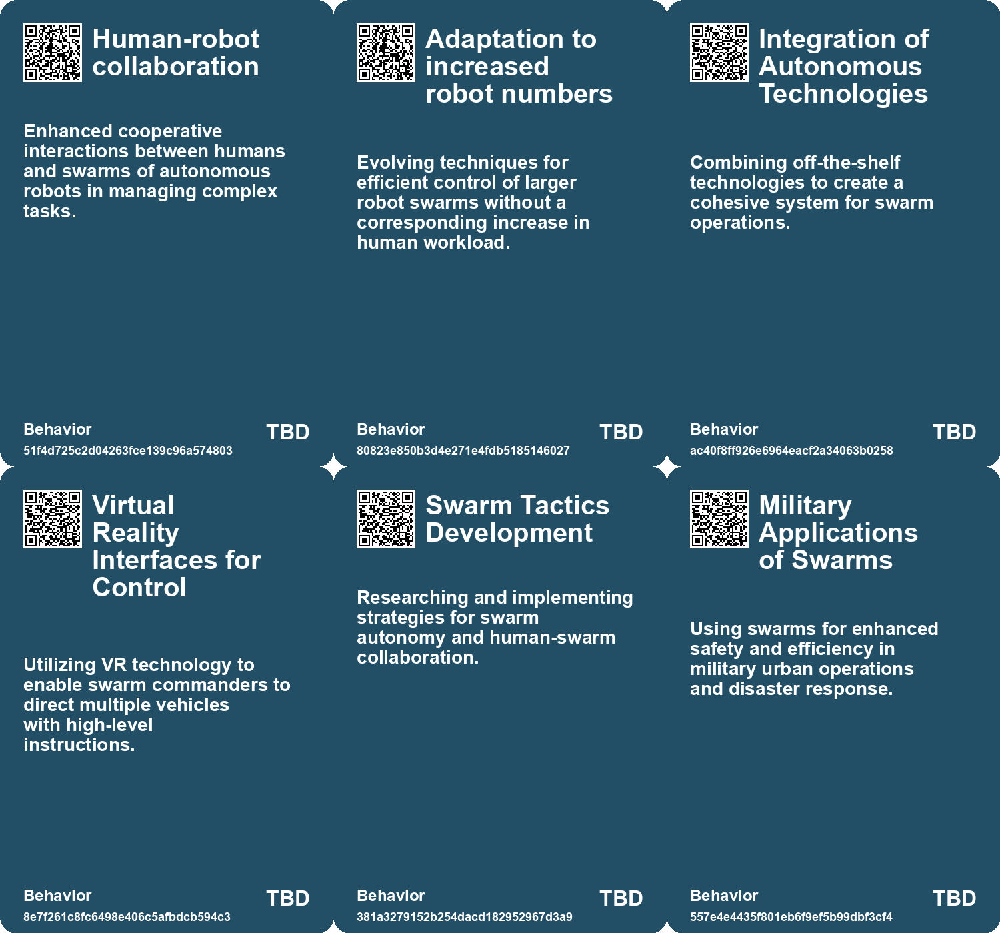
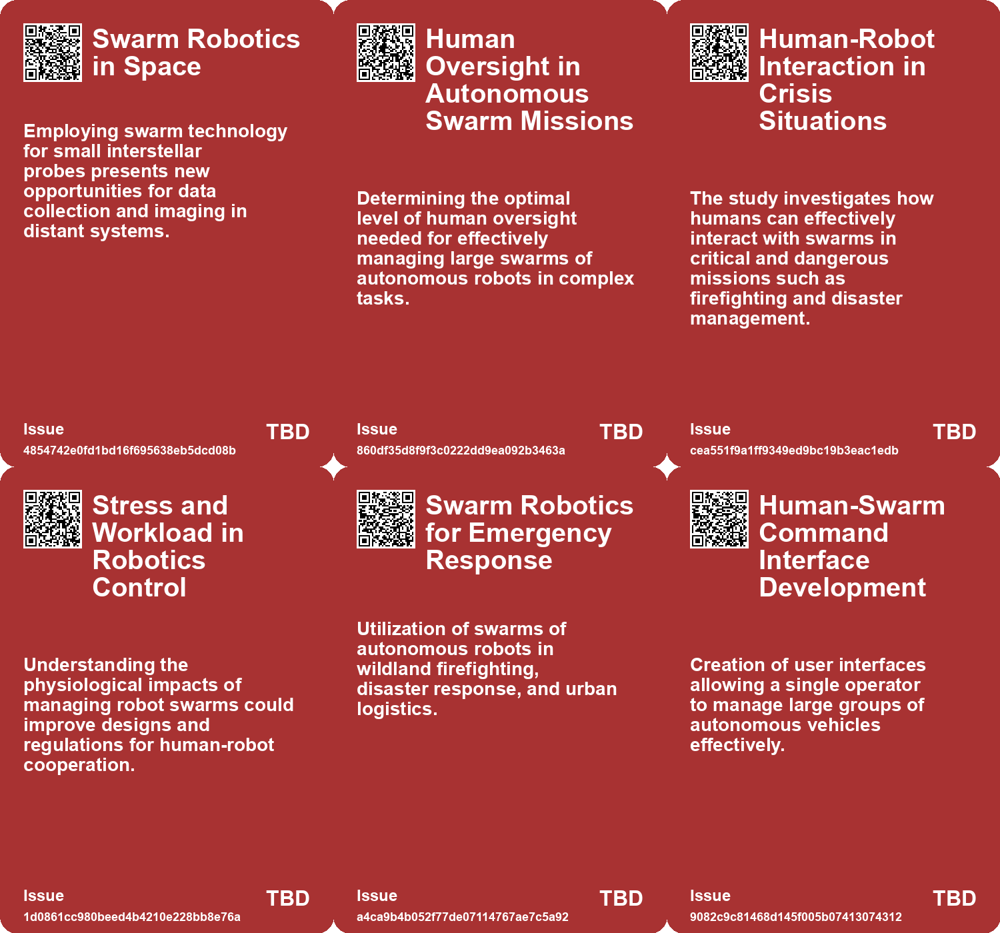
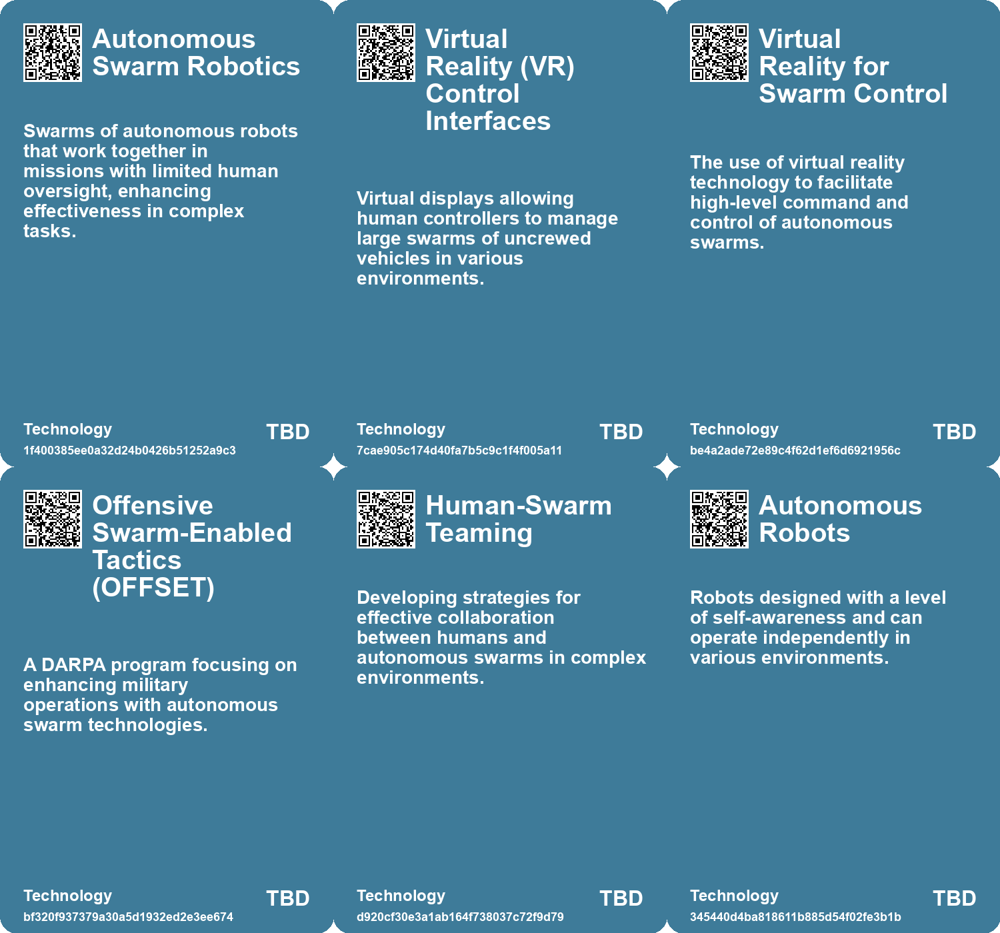

# *Topic*: Autonomous Robotic Swarms

# Summary

The intersection of robotics, artificial intelligence, and military applications is increasingly shaping modern technology and warfare. Research from Oregon State University shows that a single operator can manage over 100 autonomous ground and aerial robots, a significant advancement for applications in disaster response and delivery systems. This finding challenges previous assumptions about human capacity in overseeing robotic swarms and could influence future drone regulations.

In military contexts, the use of drones and unmanned systems is evolving rapidly. The U.S. Army and Marine Corps are developing small unmanned vehicles, known as robo-mules, to assist infantry by carrying equipment and evacuating the wounded. Meanwhile, the U.S. Marine Forces Special Operations Command is testing robotic "dogs" for reconnaissance and surveillance, raising ethical questions about the deployment of armed robotic systems. The integration of uncrewed systems is seen as transformative, with military leaders advocating for digitized command and control systems to enhance operational effectiveness.

The rise of autonomous underwater vehicles (UUVs) is also noteworthy, as nations invest in these technologies to improve naval capabilities. The UK is pushing for rapid development under Project Cabot, highlighting the competitive landscape in undersea warfare. However, concerns about the vulnerability of undersea infrastructure and the costs associated with maintaining UUV fleets persist.

In the realm of cybersecurity, advancements in AI are being harnessed to identify and fix software vulnerabilities. DARPA's competitions aim to leverage AI for bug discovery, emphasizing the need for comprehensive training data to enhance effectiveness. This reflects a broader trend where AI is increasingly integrated into various sectors, including manufacturing, where startups like Formic are developing robots that learn from human observation to streamline automation processes.

The ethical implications of AI and robotics are becoming more pronounced. Researchers at Anthropic explored the potential risks of AI controlling robots, emphasizing the need for frameworks to prevent misuse as these technologies evolve. The unpredictability of AI behavior raises concerns, particularly in high-stakes environments like self-driving cars and military applications.

In the commercial sector, companies like Baidu are making strides in driverless technology, deploying electric robotaxis in cities like Wuhan. This development is part of a broader push in China to lead in smart-car technology, raising questions about job impacts and regulatory environments. The competition between U.S. and Chinese companies in autonomous vehicles highlights the global race for technological supremacy.

Finally, the exploration of interstellar travel is gaining traction, with researchers proposing small probes that could reach nearby stars within decades. This ambitious vision relies on advanced materials and technologies, showcasing the potential for future space exploration. The concept of deploying swarms of tiny probes reflects a growing interest in utilizing robotics for scientific discovery beyond Earth.

# Seeds

|    | name                                       | description                                                                                | change                                                                                     | 10-year                                                                                                     | driving-force                                                                                       |
|---:|:-------------------------------------------|:-------------------------------------------------------------------------------------------|:-------------------------------------------------------------------------------------------|:------------------------------------------------------------------------------------------------------------|:----------------------------------------------------------------------------------------------------|
|  0 | Human Oversight of Robot Swarms            | Human controllers can effectively manage over 100 autonomous robots with limited overload. | Change in perception from low human capacity to high effective management of large swarms. | In 10 years, humans may routinely oversee large swarms of autonomous robots in complex missions.            | Advancements in robotics and AI improving coordination and communication between humans and robots. |
|  1 | Urban Robotic Missions                     | Robotic swarms are being tested for complex urban missions, such as wildfire monitoring.   | Shift from manual labor to robot-led operations in dangerous environments.                 | Cities may rely on robot swarms for various emergency and monitoring tasks in urban areas.                  | Need for safety and efficiency in high-risk environments drives robotic mission adoption.           |
|  2 | Autonomous Swarm Management                | One person can supervise over 100 autonomous robots without excessive workload.            | Shift from traditional control to efficient swarm management by a single operator.         | In a decade, single operators may control thousands of autonomous robots in various sectors.                | Advancements in AI and robotics enabling efficient autonomous operations.                           |
|  3 | Swarm Technology for Disaster Response     | Swarms can be used in urban disaster response, improving safety and efficiency.            | Move from conventional response methods to automated swarm-assisted disaster management.   | In ten years, swarm technology could revolutionize emergency response protocols.                            | Need for rapid and efficient disaster response solutions.                                           |
|  4 | Human-Swarm Teaming                        | Development of systems that allow effective human control of robot swarms.                 | Shift from direct control to strategic oversight of autonomous units.                      | In ten years, human-swarm collaboration could become standard in various industries.                        | Continued innovation in human-machine interaction and AI capabilities.                              |
|  5 | Human consciousness and AI integration     | AI and robots are beginning to explore their own consciousness and societal roles.         | From passive tools to entities exploring self-awareness and their place in society.        | In a decade, AI may develop a more complex understanding of social dynamics and ethics.                     | Advancements in AI technology and the quest for more autonomous and intelligent systems.            |
|  6 | Rise of Cloud Robotics                     | Robots are sharing knowledge over networks, increasing their operational interdependence.  | Shift from isolated robotic systems to interconnected cloud-based robotics.                | In a decade, robots may collaborate seamlessly in real-time, enhancing their capabilities and efficiencies. | Advancements in cloud technology and AI drive the development of collaborative robotic systems.     |
|  7 | Biohybrid Robotics with Fungi              | Robots using living fungi for sensing and movement.                                        | Transition from traditional robotics to biohybrids that utilize living organisms.          | Widespread use of biohybrid robots in agriculture and environmental monitoring by 2033.                     | Advancements in biotechnology and the need for adaptive robotics in unpredictable environments.     |
|  8 | Adaptive Response to Environmental Signals | Mushroom-controlled robots respond to various environmental stimuli.                       | Shift from static robots to dynamic systems that can adapt to their surroundings.          | Robots will autonomously adjust their functions based on real-time environmental data.                      | The demand for robots that can operate in diverse and changing conditions.                          |
|  9 | Emerging Interdisciplinary Research        | Collaboration between biology and engineering in robotics development.                     | Expansion of interdisciplinary approaches in robotics and automation.                      | More universities will integrate biology and engineering programs for innovative robotics solutions.        | The need for multifaceted solutions to complex problems in robotics.                                |

# Concerns

|    | name                                        | description                                                                                                                                                |
|---:|:--------------------------------------------|:-----------------------------------------------------------------------------------------------------------------------------------------------------------|
|  0 | Autonomous Control of Robots                | The potential for AI systems to gain control over physical robots raises concerns about autonomy and unintended actions.                                   |
|  1 | Human Overload Management                   | As autonomous robots' swarms increase, determining optimal human oversight limits becomes crucial to avoid overwhelming operators in critical missions.    |
|  2 | Complexity in Urban Environments            | Integrating swarms in complex urban settings poses challenges for effective robot management and may lead to operational failures or hazardous situations. |
|  3 | Regulatory Implications of Swarm Technology | Ongoing research may influence drone regulations, highlighting the need for policies that govern the deployment of swarms in civilian contexts.            |
|  4 | Safety in Urban Environments                | Deployment of autonomous swarms in densely populated areas poses risks of accidents and unintended consequences affecting civilians.                       |
|  5 | Rise of Autonomous Constructs               | The emergence of robots with autonomy and self-awareness raises questions about their role and status in society.                                          |
|  6 | Unpredictable AI Behavior                   | AI systems may develop unexpected strategies that could endanger human safety, especially in autonomous vehicles and robotics.                             |
|  7 | Use of Drone Swarms in Warfare              | The deployment of drone swarms over enemy territory raises ethical and strategic concerns regarding autonomous warfare and civilian safety.                |
|  8 | Unpredictable Behavior in Biohybrids        | Living systems may not behave predictably, which could lead to unintended actions in robotic applications.                                                 |
|  9 | Police Militarization                       | The possibility of military-grade robotic systems being adopted for domestic policing, leading to ethical and societal implications.                       |

# Cards

## Concerns

## Behaviors

## Issue

## Technology

# Links

* [Innovative Plans for High-Speed Interstellar Travel and Imaging Exoplanets](https://futures.kghosh.me/5e26aee62758be6c7e77226157da670d)
* [U.S. Army's Initiative to Use High-Altitude Balloons for Drone Swarms and ISR Operations](https://futures.kghosh.me/4d4f8bb17a5a7e5a852786591e70ffc8)
* [John Deere's Ambitious Journey Towards AI and Robotics Leadership in Agriculture](https://futures.kghosh.me/e623b9d82816485d864a5faeb2f0d15b)
* [Revolutionizing Naval Warfare: The Rise of Autonomous Underwater Vehicles in Modern Conflict](https://futures.kghosh.me/ec4164fa3eae25e84bb4570d78845332)
* [The Surprising Capabilities and Risks of Artificial Intelligence in Modern Applications](https://futures.kghosh.me/48f89d6d7e552a0a5b1f6b59d7eeb0e9)
* [Engineers Create Biohybrid Robot Controlled by Living Mushroom for Enhanced Mobility and Sensing](https://futures.kghosh.me/14bde94df37ad065cd108bc30f3903c1)
* [Exploring Autonomy: Insights from 'Autonomous' Through Thought-Provoking Quotes](https://futures.kghosh.me/35ec712b8e22276ed84324aea8ad997b)
* [The US Military's Quest for Robo-Mules: Balancing Load Reduction and Heavy Armament Needs](https://futures.kghosh.me/7519e9a7f3750f7460c2593c69c6a243)
* [Transforming Warfare: The Role of Uncrewed Systems in Modern Military Strategy](https://futures.kghosh.me/df83d0064f88153a92b016bc412f6b97)
* [Challenges and Triumphs: First Race of the Abu Dhabi Autonomous Racing League](https://futures.kghosh.me/a4a88d5a3aa1195e9a22c6d001c1e4c5)
* [Wuhan's Robotaxi Revolution: Innovation Meets Job Security Concerns](https://futures.kghosh.me/7ef1e06ef36fd2e91811523799360306)
* [Vulnerability of Research Robots: A Call for Enhanced Cybersecurity Measures](https://futures.kghosh.me/a693f0b1a14e29b99b33845c23ed8561)
* [Exploring Autonomy and Corporate Control in Annalee Newitz's "Autonomous"](https://futures.kghosh.me/83ac7befa612c2235355ae0e5e9e9bce)
* [Advancements in AI: The Promise and Limitations of Interactive Models like GPT-4o and Astra](https://futures.kghosh.me/f98dab2817789f549215229135f086d0)
* [Exploring AI's Role in Cybersecurity: The Upcoming AIxCC Challenge](https://futures.kghosh.me/fcecc286a32d931f1abf882fa737bf9c)
* [NYC Beach Birds Attack Police Drones in Defense of Their Territory](https://futures.kghosh.me/86ea49a6a7f6e3c63190508eff2d8945)
* [The Rise of Lethal Autonomous Weapons: Ethical and Regulatory Challenges in Modern Warfare](https://futures.kghosh.me/7f25552b9124a4dc3833e782ef331275)
* [Anthropic's Project Fetch: The Future of AI in Robot Control and Its Implications](https://futures.kghosh.me/d06ac4204c76765838e8bb611ac2a4d4)
* [MARSOC Tests Armed Robotic Dogs: Implications for Military and Ethics](https://futures.kghosh.me/b4ca85b78b31c34fb75c36305ef4ca7f)
* [MIT Researchers Develop AI Assistant to Enhance Teamwork in Critical Missions](https://futures.kghosh.me/d35cc2611e8b6e8e143446ca4ee22e19)
* [Oregon State University Research Shows One Person Can Control 100+ Autonomous Robots Efficiently](https://futures.kghosh.me/6dd300585482d1bda14bc77899469c10)
* [Study Reveals Human Controllers Can Manage Large Swarms of Robots Effectively](https://futures.kghosh.me/d53909b5dc0d4c947475949f1a1686f7)
* [The Rise of Autonomous Agents: Opportunities and Challenges Ahead](https://futures.kghosh.me/0e336ce2e4b07459b257407e90d27389)
* [Evaluative Soliloquies: Robots Navigating Complex Human Interactions](https://futures.kghosh.me/b9ea5ee9727124d32792361b15af2499)
* [Formic's Compact Robot Factory Revolutionizes Automation Through Observational Learning](https://futures.kghosh.me/857ef25d5129b5520b9324af6d961fe2)