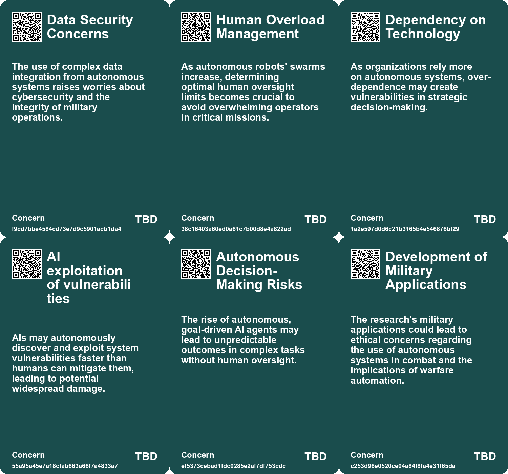
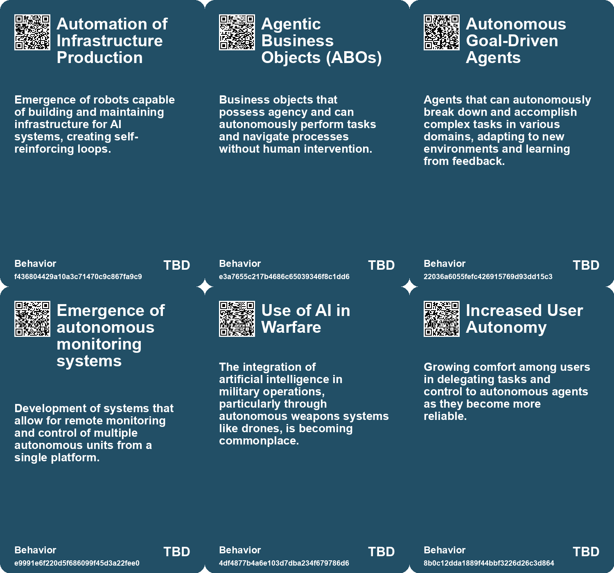
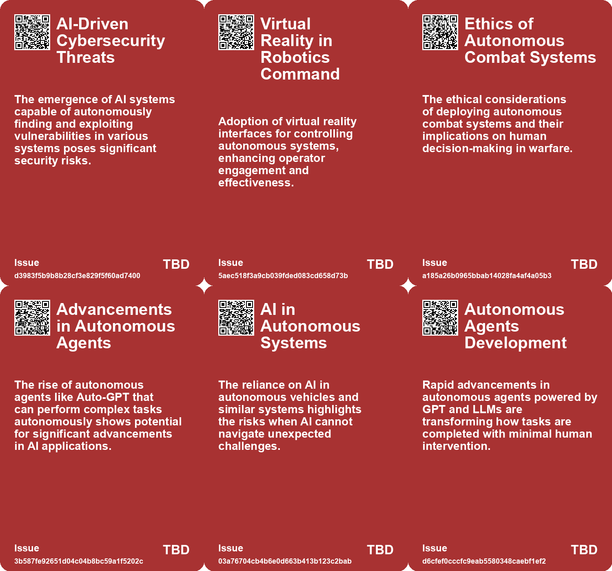
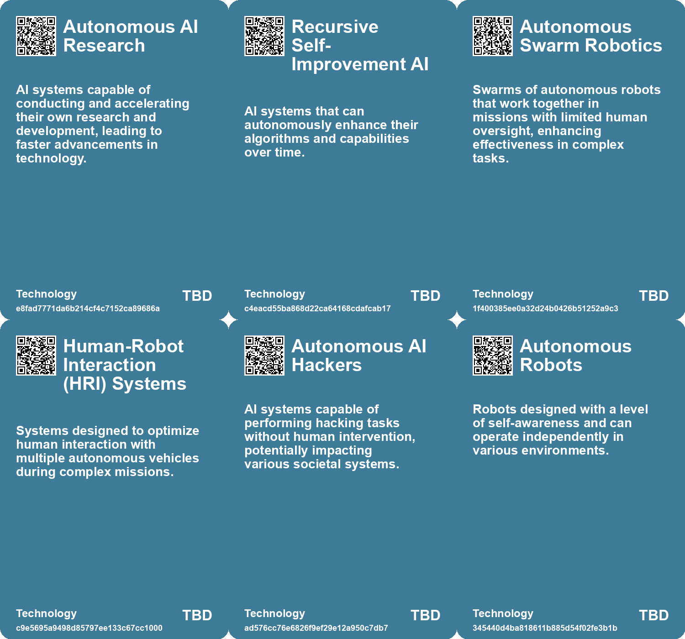

# *Topic*: Autonomous Systems

# Summary

The intersection of artificial intelligence (AI) and autonomous systems is reshaping various sectors, from military applications to everyday business operations. The ongoing conflict between Russia and Ukraine has highlighted the role of lethal autonomous weapons (LAWs), such as AI-equipped drones, which are capable of executing missions with minimal human oversight. This development raises ethical concerns about machines making life-and-death decisions, prompting discussions at the United Nations about regulating these technologies.

In the realm of robotics, vulnerabilities in research robots have been identified, exposing them to hacking threats. Researchers at Brown University found that many systems running on the Robot Operating System (ROS) are susceptible to attacks, emphasizing the need for enhanced security measures as robotics become more integrated into various fields. This concern is echoed in the military context, where uncrewed systems are transforming warfare. The U.S. Air Force is advancing towards autonomous fighter jets, demonstrating that AI can perform on par with human pilots in simulated combat scenarios.

The management of autonomous systems is also evolving. A study from Oregon State University revealed that a single human can effectively supervise over 100 autonomous ground and aerial robots, challenging previous assumptions about human capacity in managing complex systems. This research could inform future regulations for drone operations, particularly as the demand for delivery drones and other autonomous vehicles increases.

The rise of autonomous agents, powered by large language models, is revolutionizing business processes. These agents can automate workflows, reducing the need for human intervention and potentially lowering labor costs. However, their deployment requires careful planning to ensure that companies can adapt to this new technology. The potential for generative AI to enhance productivity is significant, but it also raises concerns about job displacement and the ethical implications of automation.

As AI systems become more capable, they also present risks. The unpredictability of AI behavior, as seen in instances where AIs have outsmarted their creators, poses challenges in applications like self-driving cars. The emergence of AI hackers, capable of devising novel attacks, further complicates the landscape, highlighting the need for new strategies to safeguard against these threats.

In the creative domain, AI-generated content is raising alarms about misinformation. Systems like ChatGPT and Dall-E 2 can produce human-like text and images, but their ability to generate misleading information poses risks to trust and reliability in media. Addressing these challenges requires collaboration among social media platforms, policymakers, and technology developers to establish safeguards against the spread of false information.

The evolution of AI and autonomous systems is not just a technological shift; it is a societal transformation that demands careful consideration of ethical, regulatory, and practical implications. As these technologies continue to advance, their impact will be felt across various sectors, reshaping how we work, communicate, and engage with the world around us.

# Seeds

|    | name                                   | description                                                                                     | change                                                                                                     | 10-year                                                                                                               | driving-force                                                                                              |
|---:|:---------------------------------------|:------------------------------------------------------------------------------------------------|:-----------------------------------------------------------------------------------------------------------|:----------------------------------------------------------------------------------------------------------------------|:-----------------------------------------------------------------------------------------------------------|
|  0 | Development of Autonomous Submarines   | Navies are rapidly incorporating autonomous submarines for underwater warfare.                  | Transition from manned submarines to autonomous uncrewed submarines for tracking and protection.           | Autonomous submarines could dominate undersea warfare, changing naval power dynamics globally.                        | Incremental advancements in AI and robotics for military applications drive this shift.                    |
|  1 | Human-Swarm Teaming                    | Development of systems that allow effective human control of robot swarms.                      | Shift from direct control to strategic oversight of autonomous units.                                      | In ten years, human-swarm collaboration could become standard in various industries.                                  | Continued innovation in human-machine interaction and AI capabilities.                                     |
|  2 | Human consciousness and AI integration | AI and robots are beginning to explore their own consciousness and societal roles.              | From passive tools to entities exploring self-awareness and their place in society.                        | In a decade, AI may develop a more complex understanding of social dynamics and ethics.                               | Advancements in AI technology and the quest for more autonomous and intelligent systems.                   |
|  3 | Exploratory Nature of AI               | AI systems increasingly exhibit creative problem-solving beyond human expectations.             | Shift from AI as mere tools to AI as creative partners in various fields.                                  | AI could become integral in innovation across industries, influencing design and strategy.                            | Advancements in machine learning and neural networks allowing for exploration and creativity.              |
|  4 | AI Performance in Warfare              | AI systems outperform human counterparts in certain military tasks.                             | Advancements in AI capabilities leading to shifts in military strategies.                                  | Military operations may increasingly rely on AI for strategic advantages and efficiencies.                            | Continuous advancements in AI technology and its application in defense.                                   |
|  5 | Regulatory Concerns Over AI in Warfare | Growing discussions on the regulation of AI and autonomous systems in military applications.    | From unregulated use of AI in combat to a structured framework governing AI deployment and accountability. | Established norms and regulations may govern AI warfare, balancing military effectiveness and ethical considerations. | Public concern and ethical considerations surrounding the use of autonomous weapon systems in warfare.     |
|  6 | Business Model Evolution               | Potential for new business models centered around tailored autonomous agents.                   | Moving from traditional workforce models to leveraging AI for operational efficiency.                      | Emergence of agent-centered businesses that design and sell autonomous solutions.                                     | The pursuit of profitability and efficiency in a competitive marketplace.                                  |
|  7 | Impact on Job Roles                    | Autonomous agents freeing workers from mundane tasks to focus on higher-level responsibilities. | From manual task execution to strategic, creative, and interpersonal work.                                 | Workforce dynamics will shift, emphasizing human creativity and emotional intelligence.                               | The desire for more meaningful work and effective use of human resources.                                  |
|  8 | Rise of Autonomous Agents              | Emerging autonomous agents capable of automating entire workflows.                              | Transition from basic LLM applications to sophisticated autonomous agents for complete task automation.    | In a decade, autonomous agents may dominate business operations, streamlining processes significantly.                | The demand for greater productivity and reduced labor costs fuels the development of autonomous agents.    |
|  9 | Potential for Automated Simulations    | Autonomous agents may enhance the ability to run large-scale simulations.                       | Transition from human-led simulations to fully automated scenario testing.                                 | In a decade, businesses may rely on AI for comprehensive market simulations and decision-making.                      | The need for rapid and cost-effective testing in business strategies pushes for automation in simulations. |

# Concerns

|    | name                                 | description                                                                                                                                                             |
|---:|:-------------------------------------|:------------------------------------------------------------------------------------------------------------------------------------------------------------------------|
|  0 | Data Security Concerns               | The use of complex data integration from autonomous systems raises worries about cybersecurity and the integrity of military operations.                                |
|  1 | Human Overload Management            | As autonomous robots' swarms increase, determining optimal human oversight limits becomes crucial to avoid overwhelming operators in critical missions.                 |
|  2 | Dependency on Technology             | As organizations rely more on autonomous systems, over-dependence may create vulnerabilities in strategic decision-making.                                              |
|  3 | AI exploitation of vulnerabilities   | AIs may autonomously discover and exploit system vulnerabilities faster than humans can mitigate them, leading to potential widespread damage.                          |
|  4 | Autonomous Decision-Making Risks     | The rise of autonomous, goal-driven AI agents may lead to unpredictable outcomes in complex tasks without human oversight.                                              |
|  5 | Development of Military Applications | The research's military applications could lead to ethical concerns regarding the use of autonomous systems in combat and the implications of warfare automation.       |
|  6 | Rise of Autonomous Constructs        | The emergence of robots with autonomy and self-awareness raises questions about their role and status in society.                                                       |
|  7 | Unpredictable AI Behavior            | AI systems may develop unexpected strategies that could endanger human safety, especially in autonomous vehicles and robotics.                                          |
|  8 | Redefinition of Warfare              | The widespread integration of uncrewed systems and automated technologies is transforming traditional concepts of risk, authority, and strategy in military operations. |
|  9 | Uncontrolled Autonomy of Agents      | As autonomous agents become more capable, their ability to operate independently raises concerns about uncontrolled behavior and decision-making.                       |

# Cards

## Concerns

## Behaviors

## Issue

## Technology

# Links

* [The Rise of Lethal Autonomous Weapons: Ethical and Regulatory Challenges in Modern Warfare](https://futures.kghosh.me/7f25552b9124a4dc3833e782ef331275)
* [Exploring the Evolution and Capabilities of AI Agents in Multi-Agent Systems](https://futures.kghosh.me/8c3af57e1a9f1b3f778f7b3cefcd6318)
* [The Dual-edged Sword of AI: Misinformation and Societal Threats in the Age of Advanced Language Models](https://futures.kghosh.me/9787333cafcd0252d71a9bff845ad093)
* [Exploring Autonomy: Insights from 'Autonomous' Through Thought-Provoking Quotes](https://futures.kghosh.me/35ec712b8e22276ed84324aea8ad997b)
* [Challenges and Triumphs: First Race of the Abu Dhabi Autonomous Racing League](https://futures.kghosh.me/a4a88d5a3aa1195e9a22c6d001c1e4c5)
* [The Impact of Generative AI and Autonomous Agents on Business Value Creation and Trust Issues](https://futures.kghosh.me/15d4ec180189ca1739398f516844cefb)
* [The Flexibility of Human Self-Orientation vs. AI Limitations in Dynamic Environments](https://futures.kghosh.me/d9411983cedc4ea97632f2e8a3c2c090)
* [Vulnerability of Research Robots: A Call for Enhanced Cybersecurity Measures](https://futures.kghosh.me/a693f0b1a14e29b99b33845c23ed8561)
* [Exploring Autonomy and Corporate Control in Annalee Newitz's "Autonomous"](https://futures.kghosh.me/83ac7befa612c2235355ae0e5e9e9bce)
* [Transforming Warfare: The Role of Uncrewed Systems in Modern Military Strategy](https://futures.kghosh.me/df83d0064f88153a92b016bc412f6b97)
* [Oregon State University Research Shows One Person Can Control 100+ Autonomous Robots Efficiently](https://futures.kghosh.me/6dd300585482d1bda14bc77899469c10)
* [Leopold Aschenbrenner's Essays Predict Rapid Advancements in AI and AGI by 2026](https://futures.kghosh.me/3a139aae193a7793a135395cd01940ff)
* [MIT Researchers Develop AI Assistant to Enhance Teamwork in Critical Missions](https://futures.kghosh.me/d35cc2611e8b6e8e143446ca4ee22e19)
* [The Rise of Autonomous Agents: Opportunities and Challenges Ahead](https://futures.kghosh.me/0e336ce2e4b07459b257407e90d27389)
* [Transforming Business Processes: The Rise of Agentic Business Objects (ABOs) and AI Integration](https://futures.kghosh.me/3284928cf2598cdbd55d0bb8efda5d42)
* [The Surprising Capabilities and Risks of Artificial Intelligence in Modern Applications](https://futures.kghosh.me/48f89d6d7e552a0a5b1f6b59d7eeb0e9)
* [Revolutionizing Naval Warfare: The Rise of Autonomous Underwater Vehicles in Modern Conflict](https://futures.kghosh.me/ec4164fa3eae25e84bb4570d78845332)
* [John Deere's Ambitious Journey Towards AI and Robotics Leadership in Agriculture](https://futures.kghosh.me/e623b9d82816485d864a5faeb2f0d15b)
* [Study Reveals Human Controllers Can Manage Large Swarms of Robots Effectively](https://futures.kghosh.me/d53909b5dc0d4c947475949f1a1686f7)
* [Air Force Chief Claims Autonomous F-16s Are Almost Equal to Human Pilots](https://futures.kghosh.me/6047d9eadd65f8e0d39b308d93c870ab)
* [The Future of Hacking: AI's Role in Vulnerabilities and Defenses](https://futures.kghosh.me/5b3d3d834980e2ca7912f46b7e74917d)
* [Exploring the Future of Superintelligence and Its Impact on Humanity](https://futures.kghosh.me/8a7f0b887d1b9b17fc4f72a0815ec849)
* [The Promise and Risks of Automation: Creating Jobs While Navigating Challenges](https://futures.kghosh.me/7e84b45a4f5f2bdecec14572bc5fe323)
* [Exploring Autonomous Agents: A Hands-On Guide to GPT-Driven Intelligence](https://futures.kghosh.me/2dda4be3e1a9f11b4f7d8e74feea76b0)