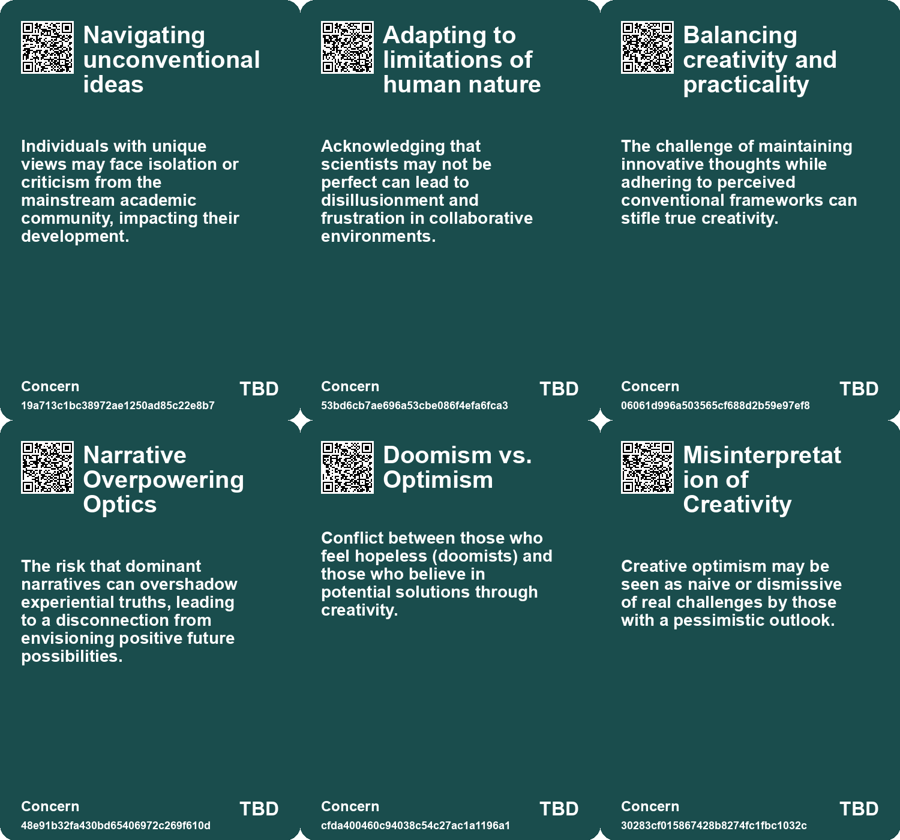
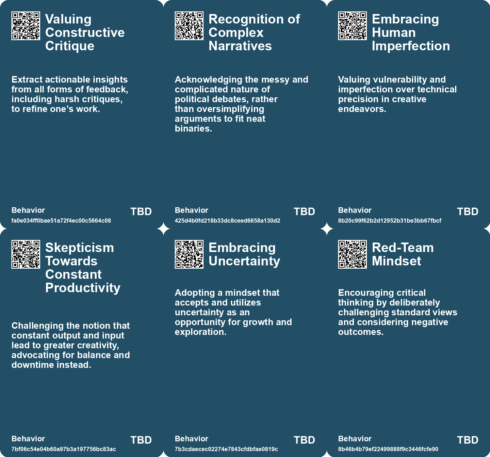
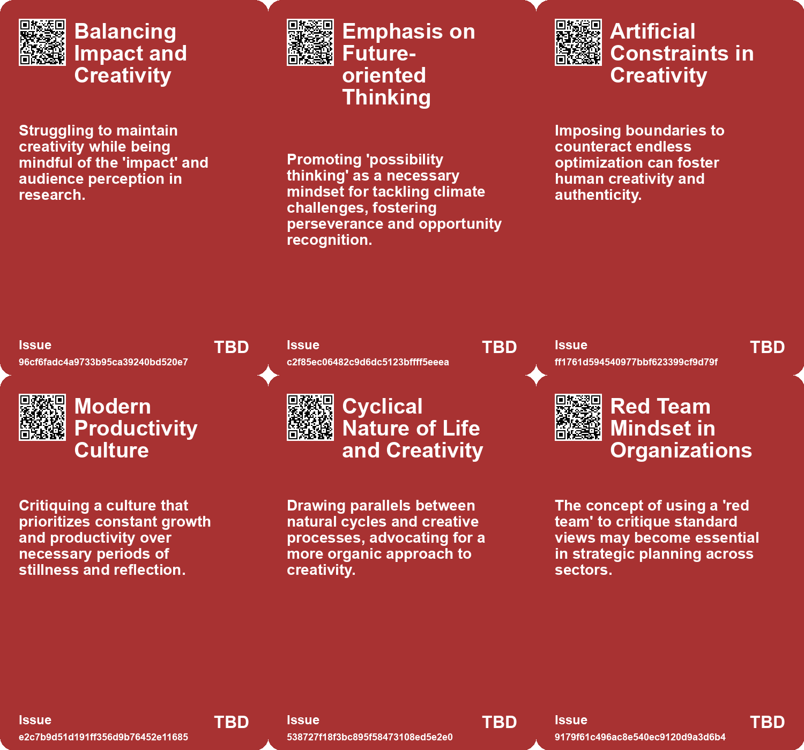
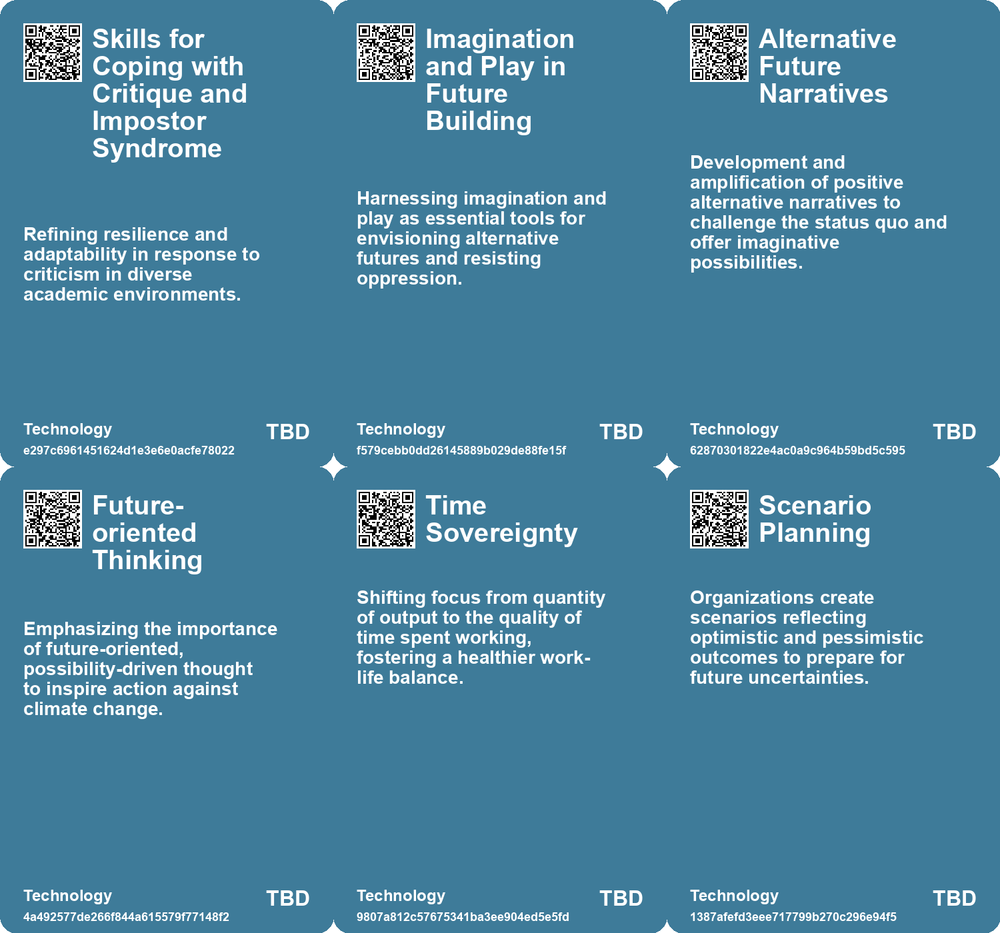

# *Topic*: Balancing Optimism and Critique

# Summary

The intersection of technology, creativity, and societal challenges emerges as a prominent theme across recent discussions. The Techno-Optimist’s Fallacy highlights the dangers of blind faith in technological progress, particularly in areas like nuclear energy and the production of harmful substances. This skepticism is echoed in the exploration of AI, where the balance between optimism and caution is crucial. The rapid advancement of AI systems raises concerns about misalignment with human values, emphasizing the need for transparency and public engagement.

Creativity is positioned as a vital force in addressing pressing issues, particularly climate change. A study reveals that individuals with creative mindsets are more optimistic about humanity's ability to tackle environmental challenges. This optimism is essential for motivating sustainable behaviors and fostering innovative solutions. The concept of storytelling is also underscored as a powerful tool for making climate issues relatable and inspiring action.

The complexities of uncertainty in modern life are examined, particularly for younger generations. Embracing uncertainty rather than attempting to predict it is essential for effective decision-making. A 'red-team mindset' is suggested as a way to visualize potential futures and navigate the unknown. This adaptability is further emphasized in discussions about resilience, which is crucial for individuals and systems facing unpredictable environments.

The impact of technology on personal fulfillment and productivity is scrutinized. The rise of AI and efficiency tools often leads to increased workloads, creating a cycle of anxiety. A reevaluation of success metrics is necessary, prioritizing human well-being over mere productivity. This perspective aligns with the critique of online engagement, which suggests that social media can distract from meaningful political action and community organizing.

The discourse on climate change also highlights the importance of social trust and community resilience. Personal experiences of living in climate-affected areas underscore the need for solidarity in finding solutions. The challenges of foresight and futures thinking are addressed, advocating for transformative approaches that prioritize care and empathy over profit-driven trends.

Leadership dynamics are explored through the lens of uniqueness bias, which can hinder organizational growth. Leaders often view their organizations as unique, preventing them from learning from more progressive models. Overcoming this bias is essential for fostering positive change.

Finally, the precarious state of democracy is examined in light of misinformation and social media manipulation. The need for immunity activators, such as media literacy strategies and independent review bodies, is emphasized to promote transparency and social cohesion. These discussions collectively highlight the urgent need for critical engagement with technology, creativity, and community in navigating contemporary challenges.

# Seeds

|    | name                                | description                                                                                | change                                                                                                          | 10-year                                                                                                     | driving-force                                                                                                 |
|---:|:------------------------------------|:-------------------------------------------------------------------------------------------|:----------------------------------------------------------------------------------------------------------------|:------------------------------------------------------------------------------------------------------------|:--------------------------------------------------------------------------------------------------------------|
|  0 | Techno-Optimism vs Fear Balance     | A growing divide between optimism about AI and fear of its implications.                   | Shift from treating AI as mere tools to recognizing them as complex beings.                                     | Public perception may evolve, treating AI as collaborative partners rather than tools or threats.           | Experience with increasingly advanced AI systems is shaping public understanding.                             |
|  1 | Recognition of Outliers in Academia | Increasing validation and support for unconventional thinkers and ideas.                   | Transition from dismissing outliers to celebrating and leveraging their unique perspectives.                    | Outlier academics will more frequently lead groundbreaking research and paradigm shifts.                    | Demand for innovation and new solutions in a rapidly changing world.                                          |
|  2 | Evolution of Scientific Critique    | Understanding that all forms of feedback, including harsh criticism, can be valuable.      | From viewing criticism defensively to perceiving it as a constructive tool for growth.                          | Scientists will develop stronger, more resilient approaches to feedback, fostering continuous improvement.  | Efforts to enhance the quality and impact of scientific work in competitive environments.                     |
|  3 | Shift in Career Expectations        | Reevaluating what success looks like in science and academia.                              | From traditional metrics of success to broader definitions, including personal fulfillment and societal impact. | Future academia will place more value on personal happiness and eudaimonic fulfillment in careers.          | Increased awareness of mental health and well-being in high-stress academic environments.                     |
|  4 | Creative Optimism Link              | The correlation between creativity and optimism in addressing climate change.              | Shifting perceptions about who can contribute solutions to climate problems.                                    | Creative individuals will drive significant climate solutions through innovative thinking and storytelling. | The urgent need for climate action highlights the value of diverse perspectives and creative problem-solving. |
|  5 | Creativity as Survival Skill        | Increasing recognition of creativity as an essential tool in navigating crises.            | From viewing creativity as a luxury to recognizing it as essential for problem-solving.                         | Society will increasingly value creative skills in response to environmental and social challenges.         | The urgent need to innovate amidst pressing global issues such as climate change.                             |
|  6 | Reevaluation of Productivity Norms  | Challenging traditional views on productivity and constant output as a measure of success. | From nonstop productivity to valuing creative and productive downtime.                                          | Work cultures will evolve to embrace focus on well-being, balance, and health rather than just output.      | The movement towards work-life balance and holistic approaches to productivity is fueling this change.        |
|  7 | Cultural Shift Towards Humility     | A growing cultural emphasis on humility in decision-making and predictions.                | From overconfidence in predictions to a more cautious and humble approach.                                      | In a decade, humility will be a core value in leadership and decision-making processes.                     | The realization of the limits of knowledge and the unpredictability of complex systems.                       |
|  8 | Polarization in Technology Debate   | The increasing divide between techno-optimists and critics like Luddites.                  | Transition from healthy debate to extreme polarization, hindering constructive dialogue.                        | In 10 years, the discourse might become more polarized, limiting shared understanding of technology's role. | Rising societal tensions around technology's impact on daily life and culture.                                |
|  9 | Emphasis on Divergent Thinking      | Promoting independent analysis before proposing solutions.                                 | Transitioning from immediate solution ideation to exploratory thinking.                                         | In 10 years, organizations will prioritize brainstorming and exploratory phases before decision-making.     | The need for more effective solutions in a fast-paced environment.                                            |

# Concerns

|    | name                                    | description                                                                                                                                      |
|---:|:----------------------------------------|:-------------------------------------------------------------------------------------------------------------------------------------------------|
|  0 | Navigating unconventional ideas         | Individuals with unique views may face isolation or criticism from the mainstream academic community, impacting their development.               |
|  1 | Adapting to limitations of human nature | Acknowledging that scientists may not be perfect can lead to disillusionment and frustration in collaborative environments.                      |
|  2 | Balancing creativity and practicality   | The challenge of maintaining innovative thoughts while adhering to perceived conventional frameworks can stifle true creativity.                 |
|  3 | Narrative Overpowering Optics           | The risk that dominant narratives can overshadow experiential truths, leading to a disconnection from envisioning positive future possibilities. |
|  4 | Doomism vs. Optimism                    | Conflict between those who feel hopeless (doomists) and those who believe in potential solutions through creativity.                             |
|  5 | Misinterpretation of Creativity         | Creative optimism may be seen as naive or dismissive of real challenges by those with a pessimistic outlook.                                     |
|  6 | Role of Luck in Outcomes                | Relying too heavily on luck and external circumstances can overshadow personal agency and resilience in facing challenges.                       |
|  7 | Illusory Certainty in Optimization      | Assuming certainty in conditions when optimizing can result in significant failures when the reality proves unpredictable.                       |
|  8 | Underestimation of Naïveté Benefits     | Avoiding naïveté in pursuit of goals may prevent novel and unconventional approaches, leading to stagnation in innovative practices.             |
|  9 | Measurement Issue                       | Current metrics are inadequate for grasping the nature of an ever-changing future, potentially leading to misguided actions.                     |

# Cards

## Concerns

## Behaviors

## Issue

## Technology

# Links

* [Overcoming the Curse of Specialization: A Lean Problem-Solving Process](https://futures.kghosh.me/c47a1d430cd80c828275e1eb5f5fbdc5)
* [Exploring the Link Between Creativity and Climate Optimism for a Sustainable Future](https://futures.kghosh.me/1803433f32d1db4b39c9b6041650b939)
* [Exploring the Modern Entertainment Landscape and Its Societal Implications](https://futures.kghosh.me/c5c2c794f1426e6e307a9df3f9ff61f6)
* [Examining the Political Landscape: A Reflection on Ezra Klein and Derek Thompson's 'Abundance'](https://futures.kghosh.me/b7820dcd25b4e5b36ef678f56602f4c4)
* [Exploring Tensions and Truths in Envisioning Future Possibilities After Recent Events](https://futures.kghosh.me/b752d5e8f3a088df428207c6902c9477)
* [Exploring the Paradox of Exhaustion and Creative Flow Through the Noetic Spiral](https://futures.kghosh.me/41317b487f66f51787c3f667e738a046)
* [Exploring Goal Flexibility and AI's Impact on Creativity and Connection](https://futures.kghosh.me/94d31e760d2d34d7355ef3ee6bf47ffe)
* [Exploring Attitudes Towards Climate Change and the Planetary Crisis Through the Polak Game](https://futures.kghosh.me/8829c6584a9427158f32a38766b0e3b2)
* [Addressing Threats to Democracy: Strategies for Resilience Against Misinformation and Manipulation](https://futures.kghosh.me/56d1a28746cd95ebaa3d62a4e1f91c3a)
* [Understanding the Techno-Optimist's Fallacy and its Implications for Technology Regulation](https://futures.kghosh.me/0e281eb043be786a51d70cb923881594)
* [The Conflict Between Optimization and Resilience in Organizational Systems](https://futures.kghosh.me/0362ad6b5f22e9f1a7f14a4b08987bc0)
* [Embracing Uncertainty: Strategies for Navigating Life's Unknowns](https://futures.kghosh.me/b6a1403e12fe78cbb944ee7233c6d1f4)
* [Exploring the Oblique Approach to Goals Inspired by Richard Feynman's Journey](https://futures.kghosh.me/8733778acc3402584c9653dbe872bf8c)
* [Overcoming Uniqueness Bias: A Path to Leadership Growth and Change](https://futures.kghosh.me/d58cdfa2239c4073bde09c04e7751eeb)
* [Five Emerging Trends Transforming Business in the Coming Year](https://futures.kghosh.me/55bac03899915f25bf0b47fa4342472c)
* [Reflections on AI: Balancing Human Essence and Technological Advancement as the Year Ends](https://futures.kghosh.me/67e5f63a5ea04ad81ae4e5ef192811be)
* [The Illusion of Online Activism in the Age of Trump: Embracing Real-World Action Instead](https://futures.kghosh.me/9f50450d1a7c46c073a928b6fa172c18)
* [Navigating Unconventional Paths in Science: Advice for Academic Misfits](https://futures.kghosh.me/31acd3259f9a87ff44dec0d6808eb2e8)
* [Reimagining Futures Thinking: Addressing Critical Flaws and Embracing Transformation](https://futures.kghosh.me/670b7a7f03caef5935520a962c78dd5a)
* [Navigating Climate Change: The Need for Community Resilience and Social Trust](https://futures.kghosh.me/efa36dc9bd5ddc890866d4ab1e68e71f)
* [Embracing Chaos: Strategies for Thriving in Uncertain Times](https://futures.kghosh.me/7456d661e6f006d09a3f10e8790588d0)
* [Navigating Jevons Paradox: Embracing Authenticity in a Productivity-Driven World](https://futures.kghosh.me/fc47a0f6771688b5d00260a9567c1fee)
* [Navigating AI: Balancing Technological Optimism with Appropriate Fear for the Future](https://futures.kghosh.me/98862cc3722aadf82c60f8af71f1fed5)
* [Understanding Polarization: Healing Our Relationship with Technology and Embracing Diverse Perspectives](https://futures.kghosh.me/c1bb890337ef382bfaa5720c9fd05134)