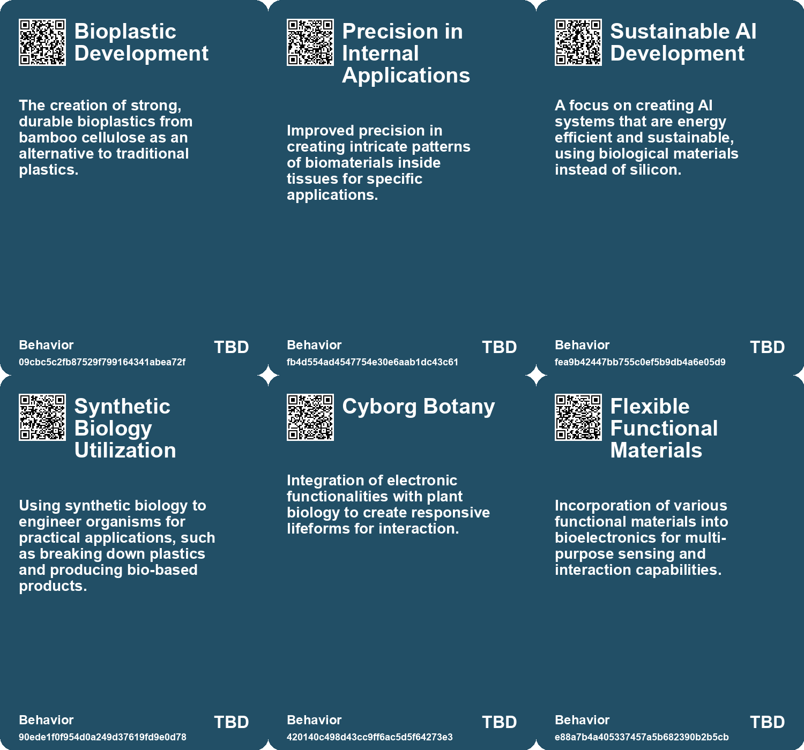
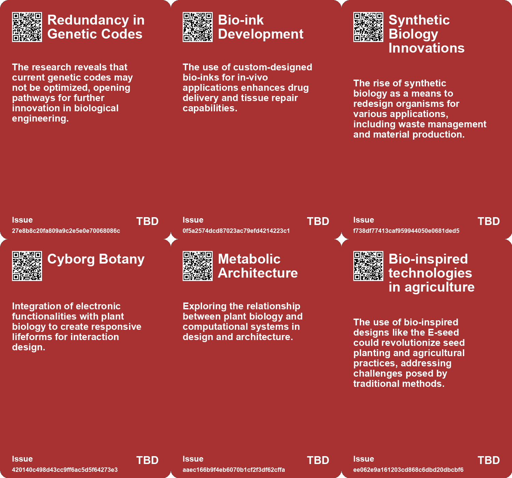
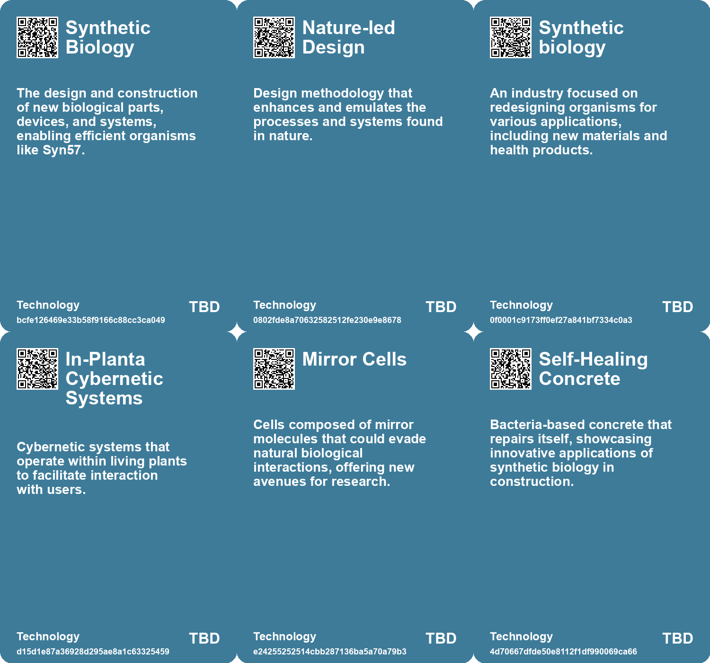

# *Topic*: Biomimetic Designs

# Summary

The intersection of technology and biology is increasingly shaping our understanding of design, health, and sustainability. A new approach called Cyborg Botany merges electronic functionalities with plant biology, allowing for innovative interaction devices that utilize plants' natural sensing abilities. This exploration highlights the potential for deeper integration of technology into living systems.

In the realm of design, the concept of regenerative design emphasizes the need for ethical responsibility in our ecological actions. It advocates for a harmonious coexistence between human and natural systems, urging a shift from extractive practices to restorative methods. This aligns with the call for alternative design approaches that prioritize sustainability and consider the socio-ecological impacts of our choices.

Synthetic biology is at the forefront of scientific advancements, with researchers developing new methods to store digital information in DNA and create synthetic cells. However, the potential dangers of manipulating life forms, such as the creation of "mirror bacteria," raise significant ethical concerns. Experts warn that these developments could lead to catastrophic consequences for ecosystems and human health.

Wearable technology is evolving, with innovations that integrate seamlessly into daily life. The concept of cyborg lifestyles is becoming more prevalent, as technology enhances social interactions and personal experiences. This trend is mirrored in advancements in robotics, where lifelike robotic skin made from living human cells offers new possibilities for emotional expression and interaction.

The Bio Revolution is transforming various sectors, from healthcare to agriculture, but it also brings risks associated with biological manipulation. The accessibility of biological materials complicates the management of these risks, necessitating cautious regulation and oversight to ensure safe development.

Recent breakthroughs in antibiotic research highlight the urgent need for new treatments to combat antibiotic resistance. Discoveries from soil samples have led to the identification of new antibiotic molecules that target harmful bacteria without harming human cells. Similarly, AI-driven approaches are being used to design novel antimicrobial proteins, showcasing the potential of technology in addressing pressing health challenges.

Innovations in materials science are also making strides toward sustainability. Researchers have developed a biodegradable plastic from bamboo cellulose, offering a more environmentally friendly alternative to traditional plastics. Additionally, a startup is working on plastic-eating enzymes to tackle the global plastic waste crisis, aiming to decentralize recycling and empower households to manage their waste more effectively.

These themes reflect a growing awareness of the interconnectedness of technology, biology, and the environment, underscoring the importance of responsible innovation in shaping a sustainable future.

# Seeds

|    | name                                       | description                                                                               | change                                                                                           | 10-year                                                                                                                      | driving-force                                                                                          |
|---:|:-------------------------------------------|:------------------------------------------------------------------------------------------|:-------------------------------------------------------------------------------------------------|:-----------------------------------------------------------------------------------------------------------------------------|:-------------------------------------------------------------------------------------------------------|
|  0 | Bamboo-derived bioplastics                 | Development of a plastic from bamboo that replicates properties of traditional plastics.  | From reliance on oil-based plastics to bioplastics made from renewable materials like bamboo.    | In 10 years, bamboo-derived plastics could become a mainstream alternative for certain applications.                         | Environmental concerns and desire for sustainable materials drive innovation in bioplastic production. |
|  1 | Custom Bio-Inks                            | Development of specific bio-inks tailored for different medical applications.             | From generic materials to customizable inks that serve various therapeutic purposes.             | Bio-inks may evolve to include tailored formulations for specific patients or conditions, enhancing treatment.               | Advancements in biomaterials science and personalized medicine approaches.                             |
|  2 | Cyborg Botany                              | Integration of synthetic circuitry with plants for enhanced interaction capabilities.     | Shifting from traditional electronic devices to biologically integrated systems for interaction. | In 10 years, plants may serve as multifunctional interactive devices in various environments.                                | The desire for sustainable, responsive technology that harmonizes with nature.                         |
|  3 | Build-a-Cell Community                     | A collaborative initiative aimed at developing synthetic living cells.                    | Emergence of community-focused synthetic biology research efforts.                               | Collaborative networks may accelerate advancements in synthetic biology and applications.                                    | The collaborative approach enhances innovation and knowledge sharing in research.                      |
|  4 | Regulatory Framework for Synthetic Biology | Proposed regulations to guide synthetic biology research, especially mirror life.         | Emerging frameworks for regulating high-risk synthetic biology research.                         | In a decade, specific guidelines may govern synthetic biology research to mitigate risks.                                    | Increasing awareness of biosecurity and ethical implications drives regulatory developments.           |
|  5 | Eco-friendly bioelectronics                | Development of sustainable sensors printed on biological surfaces.                        | From conventional sensors with wasteful production to eco-friendly, low-waste bioelectronics.    | Widespread use of imperceptible bioelectronics in daily life, enhancing health monitoring and interaction with environments. | Increasing demand for sustainable technologies and personalized health monitoring solutions.           |
|  6 | Integration of AI and Biology              | A shift towards combining biological principles with artificial intelligence development. | From top-down AI approaches to bottom-up, biologically-inspired models.                          | AI systems may evolve to exhibit more complex, life-like behaviors and adaptability.                                         | The recognition that biological evolution offers insights into creating more effective AI systems.     |
|  7 | Sustainable Agriculture Solutions          | Biohybrid robots could improve agricultural practices.                                    | Move towards more sustainable, responsive farming techniques.                                    | Integration of biohybrid robots in agriculture could reduce chemical usage and environmental damage.                         | Growing concerns over climate change and the environmental impact of traditional farming.              |
|  8 | Emerging Interdisciplinary Research        | Collaboration between biology and engineering in robotics development.                    | Expansion of interdisciplinary approaches in robotics and automation.                            | More universities will integrate biology and engineering programs for innovative robotics solutions.                         | The need for multifaceted solutions to complex problems in robotics.                                   |
|  9 | Bio-based Materials                        | Growing trend towards developing sustainable materials through biological processes.      | Shift from fossil fuel-based materials to bio-derived alternatives.                              | In 10 years, bio-based materials may dominate several industries, reducing environmental impact.                             | Environmental sustainability and resource scarcity drive the need for alternative materials.           |

# Concerns

|    | name                                       | description                                                                                                                                                   |
|---:|:-------------------------------------------|:--------------------------------------------------------------------------------------------------------------------------------------------------------------|
|  0 | Ethical Implications of Gene Editing       | The engineering of life forms raises ethical concerns about playing God and the consequences of creating synthetic life.                                      |
|  1 | Long-term Stability of Printed Structures  | The long-term stability and functionality of printed structures in dynamic biological environments may pose challenges in regenerative medicine applications. |
|  2 | Dependence on Synthetic Biology            | The growing reliance on synthetic biology technologies raises concerns about unforeseen ecological impacts and long-term sustainability.                      |
|  3 | Ethical Implications of AI Artistry        | Concerns surround the ownership and originality of designs created or influenced by AI.                                                                       |
|  4 | Ethical implications of Cyborg Botany      | Integrating technology with living plants may raise ethical questions regarding manipulation of biological entities.                                          |
|  5 | Impact on Ecosystems from New Technologies | Introducing bio-inspired technologies could unintentionally alter existing ecosystems and their dynamics.                                                     |
|  6 | Biological Safety and Biosecurity          | Synthetic proteins could pose risks if released unintentionally or used maliciously, leading to uncontrollable microbial behavior or bioweaponry.             |
|  7 | Ethical Implications of AI in Biotech      | The use of AI for protein design raises questions about the moral implications and regulatory oversight of biotechnological advancements.                     |
|  8 | Feasibility of More-than-Human Design      | Questions about the practical application of more-than-human design could lead to incomplete integration of ecological considerations in practice.            |
|  9 | Environmental Impact of Biohybrids         | Deployment of biohybrid robots in natural ecosystems could disrupt local environments or introduce unforeseen consequences.                                   |

# Cards

## Concerns

## Behaviors

## Issue

## Technology

# Links

* [DeepMind's AI Uncovers 2.2 Million New Crystal Structures for Material Science](https://futures.kghosh.me/115b59fc3f0d7b148482545adb1a8038)
* [Scientists Create Syn57: A Revolutionary Strain of E. coli with Fewer Codons](https://futures.kghosh.me/baa851a48441903a61269df057166abd)
* [AI-Driven Gene Editing: Introducing OpenCRISPR-1 for Enhanced Precision in Human Genomes](https://futures.kghosh.me/fb983ad12b687b393f0bdc2a54ef0c03)
* [Monash University Develops DishBrain: A Semi-Biological Chip with Learning Capabilities](https://futures.kghosh.me/fcf584bddde6a0c4ccaf5ab8eadded1e)
* [The Future of Wearable Technology: Merging Cyborg Lifestyles with Daily Life](https://futures.kghosh.me/a81c4775b91ccd0db3e1b84da893ac6f)
* [The Risks and Ethical Considerations of Research on Mirror Bacteria in Synthetic Biology](https://futures.kghosh.me/e2cc8f6f19604a6a1553d9a871ad03a1)
* [Exploring Regenerative Design for Harmonious Coexistence with Nature](https://futures.kghosh.me/a1acb04c0f65f709ad6c8ce2f0946a51)
* [AI-Powered Profluent Develops Bacteria-Killing Proteins with Novel Designs](https://futures.kghosh.me/851488841bb139d3ed24048269cd0b9b)
* [Tom Ray's Journey from Evolutionary Biology to Artificial Life Creation](https://futures.kghosh.me/d569dcc750762a88b0b75c3ee925c4d4)
* [Exploring the Bio Revolution: Opportunities, Risks, and Future Implications](https://futures.kghosh.me/62a5bae52266a680c6a13bd3ef8dc48c)
* [Epoch Biodesign Secures $11 Million to Develop Plastic-Eating Enzymes for Waste Reduction](https://futures.kghosh.me/d2a5e5d3dad76d8880d6d322b26a8ab9)
* [Breakthrough Discovery of New Antibiotic Molecule from Soil Samples](https://futures.kghosh.me/fa6115ae1686f345d64fa1c0c3dfafd5)
* [Reimagining Design: Moving Beyond Human-Centricity for Sustainability](https://futures.kghosh.me/5374f630138505a84bf07f321ed3d05e)
* [Exploring the Balance Between AI Efficiency and Human Creativity in Design](https://futures.kghosh.me/92ae644db3cc8e4d0fb262bac8413f8b)
* [Innovative 3D Printing Technique Revolutionizes In-Body Medical Applications](https://futures.kghosh.me/b650d2500235b72478de21bf9c0928ec)
* [Urgent Call to Ban Research on Potentially Dangerous Mirror Cells by Biologists](https://futures.kghosh.me/ebc9a424cf40d54bf27fe0287b648be3)
* [Cyborg Botany: Merging Technology with Plant Sensing and Interaction](https://futures.kghosh.me/b1f6991b9b718672751c9427c3f5b794)
* [Innovative Scientific Breakthroughs in Health and Sustainability: From Mini-Brains to Microplastics](https://futures.kghosh.me/893f7fa4d1fb919258d3e90b77babab5)
* [Innovative E-seed Technology Enhances Aerial Seeding Inspired by Nature](https://futures.kghosh.me/58c165e1a46408307f2b60f63df7c549)
* [Development of Lifelike Robotic Skin Using Living Human Cells: A New Technique](https://futures.kghosh.me/3d1407b18f3172e808b79052d38c76de)
* [Cognitive Mimetics and Human Digital Twins: Innovative Tools for AI Design](https://futures.kghosh.me/863bf5f38e20da4709e5cc0951a350c6)
* [Innovative Eco-Friendly Sensors for Health Monitoring and Environmental Applications](https://futures.kghosh.me/0370fcd11fe23fc06dd8784115da238b)
* [Exploring Cultural Heritage Through AI: Armenia's Pavilion at Venice Biennale 2025](https://futures.kghosh.me/34b4d87b744230499df1eb6a00d5c11d)
* [Exploring Healing-Centric Design in the Age of Emerging Technologies](https://futures.kghosh.me/6ce4d4d1c40fef14044ea70a600c66d4)
* [Engineers Create Biohybrid Robot Controlled by Living Mushroom for Enhanced Mobility and Sensing](https://futures.kghosh.me/14bde94df37ad065cd108bc30f3903c1)
* [Innovative Bamboo-Derived Plastic: A Sustainable Alternative to Conventional Plastics](https://futures.kghosh.me/4a3ea4ad65b490bc7e46075ac55e5552)