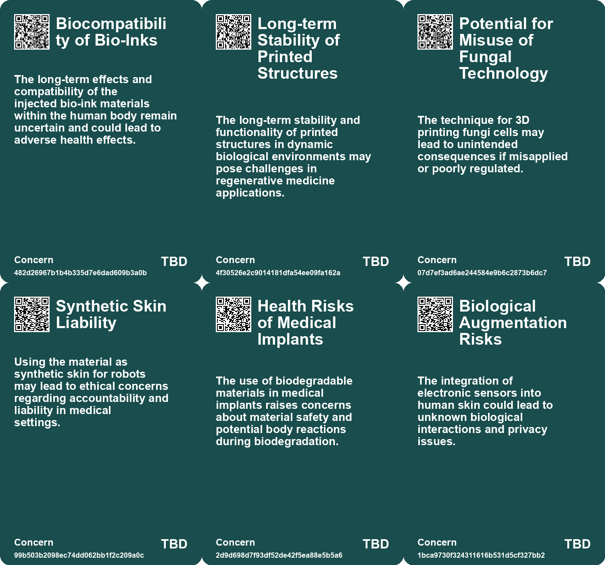
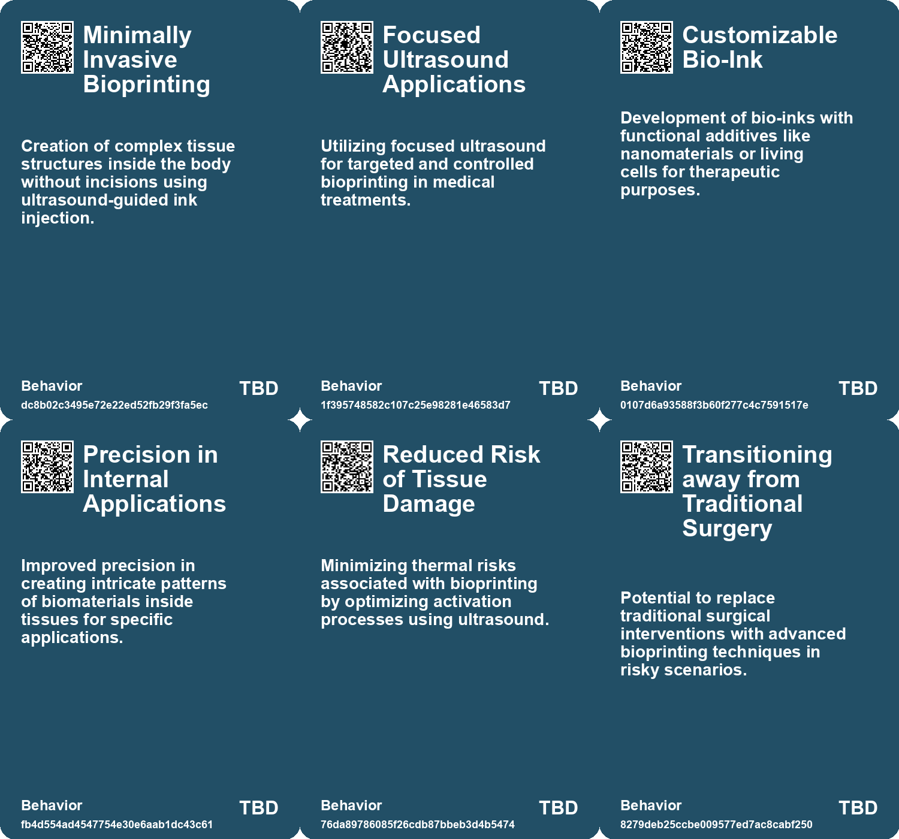
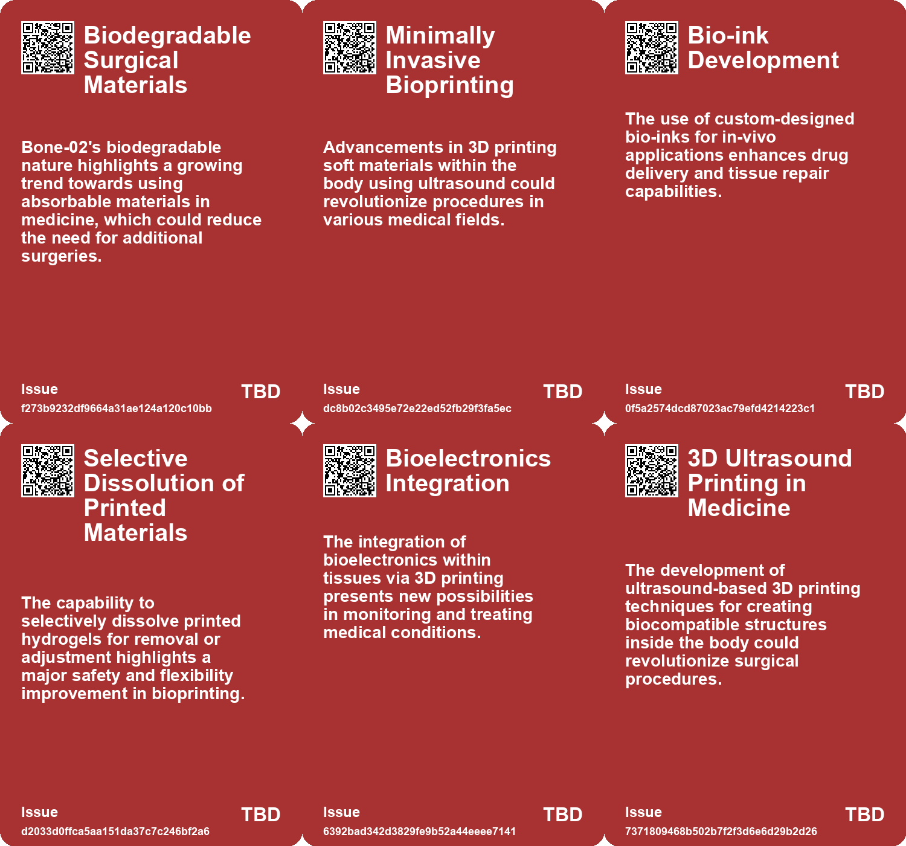
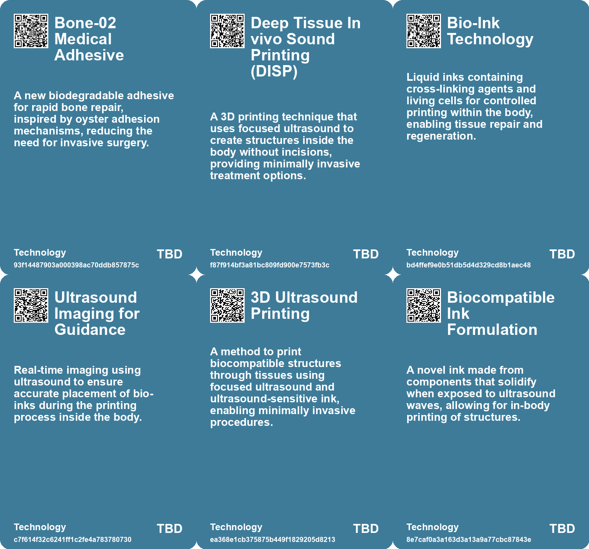

# *Topic*: Bioprinting Without Breaking Skin

# Summary

Recent advancements in medical technology highlight a shift towards less invasive procedures and improved patient outcomes. Techniques such as Deep Tissue In Vivo Sound Printing (DISP) allow for 3D printing of biocompatible structures inside the body using focused ultrasound, potentially transforming cancer therapy and regenerative medicine. Similarly, a new medical adhesive called "Bone-02" offers a rapid solution for bone fractures, bonding fragments quickly and reducing the need for invasive hardware. These innovations reflect a growing trend in the medical field to enhance treatment efficacy while minimizing patient discomfort.

The integration of living materials into technology is gaining traction, particularly in robotics and electronics. Researchers have developed lifelike robotic skin using human cells, enhancing the emotional expressiveness of robots. Additionally, biohybrid robots that utilize electrical signals from mushrooms demonstrate the potential for living organisms to control robotic functions. This intersection of biology and technology opens new avenues for applications in social robotics and environmental monitoring.

Sustainability remains a critical focus across various fields. Innovations such as biodegradable films made from food waste and bamboo-derived plastics aim to reduce plastic pollution and environmental impact. Mushroom-derived electronics present an eco-friendly alternative to traditional materials, while adaptive sensors inspired by spider silk can be printed directly onto biological surfaces. These developments reflect a commitment to creating sustainable solutions that address pressing environmental challenges.

Wearable technology is evolving to enhance health monitoring and improve quality of life. Devices like the SENSE Biopatch monitor vital signs for outdoor workers, while a new hair-like EEG electrode offers a more comfortable and effective way to track brain activity. These advancements in wearable health technology aim to provide real-time data, enabling proactive health management and better patient care.

The exploration of biohacking and genetic engineering raises ethical questions and societal implications. Initiatives like the Longevity House cater to biohackers seeking to optimize health through unconventional methods. Meanwhile, projects focused on genetically modifying pets spark debate about the future of genetic engineering and its potential risks. These discussions highlight the need for careful consideration of the implications of such technologies on society and the environment.

Research into advanced materials continues to push boundaries in various applications. The development of a slime-like material that generates electricity when compressed could revolutionize energy generation and medical technology. Additionally, the creation of a computer chip containing human brain cells demonstrates the potential for merging biological and artificial intelligence, paving the way for advancements in machine learning and robotics.

Finally, the evolving perceptions of body art and tattoo removal reflect changing societal attitudes. As more individuals seek to alter or remove tattoos, advancements in removal technology have made the process more accessible and less painful. This trend indicates a cultural shift where tattoos are increasingly viewed as temporary expressions rather than permanent marks, prompting a reevaluation of identity and self-expression in contemporary society.

# Seeds

|    | name                                | description                                                                                  | change                                                                                              | 10-year                                                                                                                      | driving-force                                                                                |
|---:|:------------------------------------|:---------------------------------------------------------------------------------------------|:----------------------------------------------------------------------------------------------------|:-----------------------------------------------------------------------------------------------------------------------------|:---------------------------------------------------------------------------------------------|
|  0 | 3D Bioprinting Inside the Body      | A new method enables 3D printing of soft tissues directly within the body without incisions. | From traditional surgical methods to a non-invasive ultrasound-guided printing technique.           | In a decade, surgeries may be largely replaced by non-invasive 3D printing methods for tissue repair and drug delivery.      | The push for less invasive medical technologies and personalized treatment strategies.       |
|  1 | Custom Bio-Inks                     | Development of specific bio-inks tailored for different medical applications.                | From generic materials to customizable inks that serve various therapeutic purposes.                | Bio-inks may evolve to include tailored formulations for specific patients or conditions, enhancing treatment.               | Advancements in biomaterials science and personalized medicine approaches.                   |
|  2 | Live Cell Integration               | Incorporation of live cells within bio-printed constructs to promote healing.                | From passive materials to dynamic structures that integrate living cells for better outcomes.       | Bioprinted tissues could be routinely used for regenerative medicine, aiding faster healing and recovery.                    | Increasing focus on tissue engineering and regenerative therapies in healthcare.             |
|  3 | Minimally Invasive Cancer Therapies | Using bioprinted drug depots for targeted cancer treatment with reduced side effects.        | From standard systemic chemotherapy to localized, controlled drug delivery at tumor sites.          | Targeted therapies may significantly reduce systemic side effects and improve cancer treatment outcomes.                     | The demand for more effective and tolerable cancer treatments.                               |
|  4 | Real-time Monitoring of Bioprinting | Incorporating imaging technology to visualize the bioprinting process live.                  | From static monitoring to dynamic oversight of the printing process in real-time.                   | Future systems may allow doctors to monitor and adjust treatments actively, improving precision.                             | Advancements in imaging and diagnostic technologies in medicine.                             |
|  5 | 3D Printing Through Skin            | Innovative method to print implants through skin using focused ultrasound.                   | From traditional invasive surgeries to non-invasive 3D printing methods.                            | Minimally invasive surgeries could become the standard, reducing recovery times and risks.                                   | Advancements in ultrasound technology and material science driving safer medical procedures. |
|  6 | Biocompatible Structures Printing   | Ability to create biocompatible structures inside the body.                                  | From reliance on external implants to internal bioprinting solutions.                               | Personalized medicine could expand with tailored implants created inside patients.                                           | Increasing emphasis on personalized healthcare solutions and biocompatibility.               |
|  7 | Eco-friendly bioelectronics         | Development of sustainable sensors printed on biological surfaces.                           | From conventional sensors with wasteful production to eco-friendly, low-waste bioelectronics.       | Widespread use of imperceptible bioelectronics in daily life, enhancing health monitoring and interaction with environments. | Increasing demand for sustainable technologies and personalized health monitoring solutions. |
|  8 | Lifelike Robotic Skin               | Researchers developed robotic skin using living human cells for emotional expression.        | Robotic coverings evolving from synthetic to living materials for enhanced emotional interaction.   | Robots may possess more realistic emotional expressions and self-healing capabilities, improving human-robot interaction.    | Advancements in biotechnology and the need for more relatable social robots.                 |
|  9 | Self-Healing Technology in Robotics | Living skin allows robots to potentially repair themselves after damage.                     | Shift from static robotic structures to dynamic, self-repairing systems using biological materials. | Future robots could autonomously heal, reducing maintenance needs and enhancing longevity.                                   | Desire for more resilient and autonomous robotic systems in various applications.            |

# Concerns

|    | name                                                | description                                                                                                                                                   |
|---:|:----------------------------------------------------|:--------------------------------------------------------------------------------------------------------------------------------------------------------------|
|  0 | Biocompatibility of Bio-Inks                        | The long-term effects and compatibility of the injected bio-ink materials within the human body remain uncertain and could lead to adverse health effects.    |
|  1 | Long-term Stability of Printed Structures           | The long-term stability and functionality of printed structures in dynamic biological environments may pose challenges in regenerative medicine applications. |
|  2 | Potential for Misuse of Fungal Technology           | The technique for 3D printing fungi cells may lead to unintended consequences if misapplied or poorly regulated.                                              |
|  3 | Synthetic Skin Liability                            | Using the material as synthetic skin for robots may lead to ethical concerns regarding accountability and liability in medical settings.                      |
|  4 | Health Risks of Medical Implants                    | The use of biodegradable materials in medical implants raises concerns about material safety and potential body reactions during biodegradation.              |
|  5 | Biological Augmentation Risks                       | The integration of electronic sensors into human skin could lead to unknown biological interactions and privacy issues.                                       |
|  6 | Ethical implications of using human cells in robots | The use of living human cells in creating robotic skin raises ethical questions regarding consent and the treatment of biological materials.                  |
|  7 | Potential for misuse of technology                  | Lifelike robotic skin may be misused for deception, manipulation, or exploitation in various social contexts.                                                 |
|  8 | Health and safety risks                             | Integrating living tissue into robots may pose health risks, including infection or immune reactions in humans interacting with these robots.                 |
|  9 | Regulatory challenges                               | The development of robots with living tissue may outpace existing regulations, leading to unregulated practices and applications.                             |

# Cards

## Concerns

## Behaviors

## Issue

## Technology

# Links

* [Innovative Scientific Breakthroughs in Health and Sustainability: From Mini-Brains to Microplastics](https://futures.kghosh.me/893f7fa4d1fb919258d3e90b77babab5)
* [Biodegradable Films from Cranberry Pomace: A Sustainable Alternative to Plastic Packaging](https://futures.kghosh.me/b442f3c78716d0a22167e5fc4359f276)
* [The Los Angeles Project: Genetic Engineering for Exotic Pets and Ethical Dilemmas](https://futures.kghosh.me/a14802d50bd16235be4acda9fec4b168)
* [Innovative Eco-Friendly Sensors for Health Monitoring and Environmental Applications](https://futures.kghosh.me/0370fcd11fe23fc06dd8784115da238b)
* [Stella McCartney's 20-Year Commitment: Introducing Mylo™️, Sustainable Mushroom Leather](https://futures.kghosh.me/babc175f444c7c8a095e0739f8ca9f96)
* [Roxana Chicas Develops SENSE Biopatch for Monitoring Heat Exposure in Workers](https://futures.kghosh.me/ce7b7677f5653a48b32d06a6b7413c2b)
* [Japanese Researchers Create Eco-Friendly Plastic That Dissolves in Seawater](https://futures.kghosh.me/3964726caf5eb0757b82a38b798f6a69)
* [Bone-02: A Revolutionary Oystery-Inspired Medical Adhesive for Faster Bone Healing](https://futures.kghosh.me/b5719bff3b686b78a94f9366f16cfe8a)
* [Revolutionary Ultrasound Method Promises Safer, Less Invasive Surgical Procedures](https://futures.kghosh.me/bccb19f0e8600750a06777c4ccea673e)
* [Exploring Biohacking and the Quest for Eternal Youth at Longevity House in Toronto](https://futures.kghosh.me/1877ad2c0ed4b7803dde21574102284a)
* [Innovative Hairlike 3D-Printable Electrode Improves EEG Monitoring for Brain Activity](https://futures.kghosh.me/45b9a8de8b364a995e54680b57eabcad)
* [Innovative 3D Printing Technique Revolutionizes In-Body Medical Applications](https://futures.kghosh.me/b650d2500235b72478de21bf9c0928ec)
* [Cyborg Botany: Merging Technology with Plant Sensing and Interaction](https://futures.kghosh.me/b1f6991b9b718672751c9427c3f5b794)
* [Monash University Develops DishBrain: A Semi-Biological Chip with Learning Capabilities](https://futures.kghosh.me/fcf584bddde6a0c4ccaf5ab8eadded1e)
* [Revolutionary Ultrasound Sticker by MIT Engineers Promises Continuous Imaging of Internal Organs](https://futures.kghosh.me/046ecaa63b94e5eef69df0439e9d3246)
* [Innovative Bamboo-Derived Plastic: A Sustainable Alternative to Conventional Plastics](https://futures.kghosh.me/4a3ea4ad65b490bc7e46075ac55e5552)
* [Northeastern Researchers Discover Thermoformable Ceramics for Electronics Cooling Solutions](https://futures.kghosh.me/bd35b1587de303b44a62d0e99fb749fc)
* [Breakthrough Biodegradable Fungal Battery: A Green Alternative for Future Devices](https://futures.kghosh.me/8d40786d2a0ffa3d455d8bbc36d7fd53)
* [Engineers Create Biohybrid Robot Controlled by Living Mushroom for Enhanced Mobility and Sensing](https://futures.kghosh.me/14bde94df37ad065cd108bc30f3903c1)
* [Development of Lifelike Robotic Skin Using Living Human Cells: A New Technique](https://futures.kghosh.me/3d1407b18f3172e808b79052d38c76de)
* [Revolutionary Bionic Hand Enhances Life for Amputees Like Karin](https://futures.kghosh.me/90accf3ba55fb5e705bbaa47ad145c50)
* [Innovative Slime-Like Material Offers Exciting Medical and Energy Applications](https://futures.kghosh.me/aa17441091514ac3081b8e57221f3fce)
* [Exploring the Shift in Tattoo Culture: The Painful Journey of Tattoo Removal](https://futures.kghosh.me/bad7c8bff0e52ea95f3793a1a049b704)
* [Innovative Uses of Silk: From Painless Vaccinations to Sustainable Food Preservation](https://futures.kghosh.me/b82294d6736ce7c521c1e4baf2636851)
* [Teen Inventor Heman Bekele Develops Affordable Soap to Combat Skin Cancer](https://futures.kghosh.me/bc374aa64e994b7336277a6f352baf60)
* [Mushrooms as Biodegradable Alternatives for Electronic Devices and Medical Implants](https://futures.kghosh.me/58b1d4282237f41c4a33e71179c1ea4b)