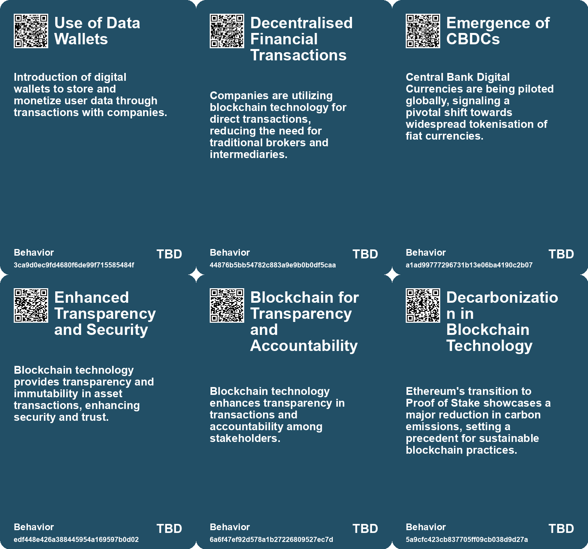
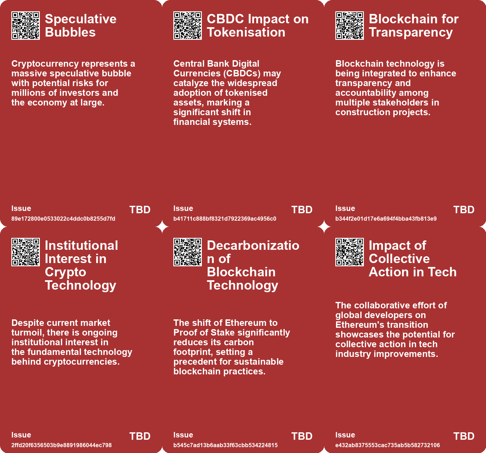
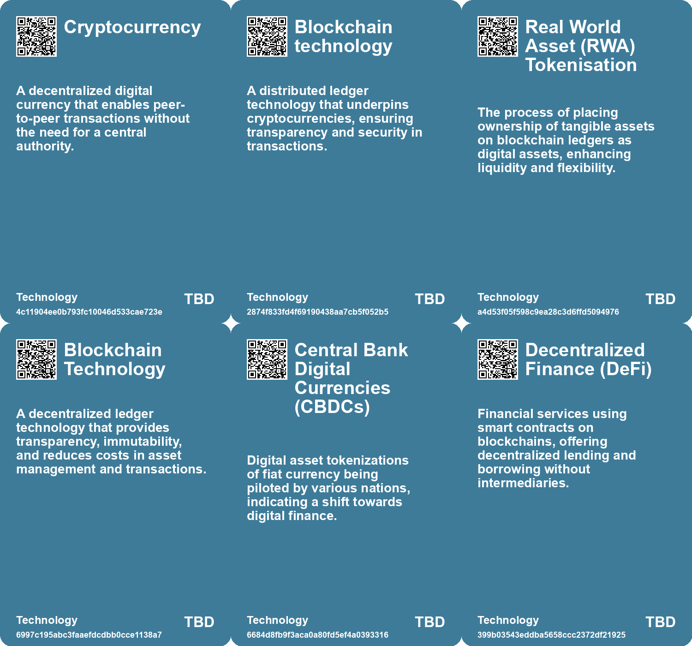

# *Topic*: Blockchain Technology

# Summary

The intersection of technology and sustainability is increasingly evident, particularly in the blockchain sector. Ethereum's transition to a Proof of Stake consensus mechanism has drastically reduced its carbon footprint, showcasing a commitment to sustainable practices. This shift not only enhances Ethereum's appeal as a green technology but also sets a precedent for other industries to follow suit in their sustainability efforts.

Tokenization of real-world assets is emerging as a transformative trend in fintech. The tokenized gold market has surpassed $1 billion, and projections suggest that tokenization could evolve into a $16 trillion industry by 2030. This innovation offers enhanced liquidity and flexibility, allowing for continuous trading of assets. Major financial institutions are beginning to adopt this technology, which promises to revolutionize various sectors by providing transparency and reducing transaction costs.

The cryptocurrency market is currently facing significant volatility, with major cryptocurrencies like Bitcoin and ether experiencing sharp declines. This downturn is attributed to macroeconomic factors, including inflation and interest rate hikes, as well as internal challenges within crypto firms. Layoffs and liquidity concerns have raised questions about the long-term viability of cryptocurrencies, even as interest in quality investments persists.

The construction industry is undergoing a digital transformation, driven by advancements in technology. Innovations such as artificial intelligence, robotics, and blockchain are being integrated to improve operational efficiency and project management. Tools like Building Information Modeling and 3D printing are reshaping project execution, while drones enhance safety and monitoring on job sites. As the sector embraces these technologies, it aims to address challenges like rising material costs and labor shortages.

Trust in artificial intelligence is a growing concern, particularly regarding its applications and the authenticity of AI-generated content. Cryptography is being proposed as a solution to enhance trust, addressing issues such as data privacy and the potential for manipulation. Techniques like digital signatures and zero-knowledge proofs can help verify the integrity of AI outputs, fostering greater confidence in AI technologies.

The rise of generative AI is poised to revolutionize business operations. Autonomous agents powered by large language models can automate workflows and execute tasks independently, significantly reducing labor costs. However, successful integration of these technologies requires careful planning and preparation. Businesses are encouraged to adopt a strategic approach to harness the full potential of generative AI while addressing customer needs.

Concerns about security in the cryptocurrency sector have been amplified by incidents such as the kidnapping of a prominent cryptocurrency executive for ransom. This highlights the increasing risks associated with digital assets and the need for enhanced protective measures within the industry. As the value of cryptocurrencies continues to rise, industry leaders must reassess their security protocols to safeguard personnel and assets against criminal activities.

# Seeds

|    | name                                               | description                                                                                                | change                                                                                                            | 10-year                                                                                                                  | driving-force                                                                                                           |
|---:|:---------------------------------------------------|:-----------------------------------------------------------------------------------------------------------|:------------------------------------------------------------------------------------------------------------------|:-------------------------------------------------------------------------------------------------------------------------|:------------------------------------------------------------------------------------------------------------------------|
|  0 | Data Wallets for Monetization                      | Users can store and profit from their data via digital wallets offering payment options.                   | Transition from passive data sharing to active monetization by users.                                             | Increased user engagement with their data leading to possible new economic models built around data.                     | Growing recognition of data as a valuable asset for individuals.                                                        |
|  1 | Dependency on Speculation                          | Crypto community's reliance on speculative investments for sustainability.                                 | Transition from perception of value as a currency to reliance on speculative investor confidence.                 | Ten years later, speculative investments might decrease, leading to a potential collapse of many crypto ventures.        | Anticipated end of speculative cycles driving crypto advocates to seek alternative support.                             |
|  2 | Integration of Blockchain Technology               | Blockchain is being adopted for transparency and accountability in construction projects.                  | From traditional project management to blockchain-enabled transparency and efficiency.                            | Construction projects will operate on decentralized platforms ensuring transparency and accountability.                  | Need for improved transparency and efficiency in managing complex construction projects.                                |
|  3 | Normalization of Bitcoin-backed Financing          | Companies like MicroStrategy are using Bitcoin as collateral for loans, aiming to legitimize the practice. | Shift from speculative investments to more structured financial practices backed by Bitcoin.                      | Potential establishment of Bitcoin-backed financial products as standard in finance.                                     | The push for innovative financial instruments and normalization of Bitcoin in traditional finance.                      |
|  4 | Emergence of New Business Models                   | Sustainable Ethereum infrastructure opens new business opportunities in decentralized applications.        | Transforming traditional business models to incorporate low-carbon blockchain solutions.                          | New business models will emerge focusing on sustainability in the blockchain space, enhancing economic growth.           | The need for industries to adapt to sustainable practices to align with regulatory and consumer expectations.           |
|  5 | Increased Scrutiny on Tech Carbon Footprint        | Tech sectors, particularly blockchain, face greater scrutiny regarding their environmental impact.         | From minimal accountability to rigorous assessments of carbon emissions in technology.                            | Tech companies will need to demonstrate sustainability efforts as a standard practice to gain consumer trust.            | Heightened regulatory pressures and public demand for accountability in environmental impact.                           |
|  6 | Digital Identity Transformation                    | Emergence of digital identities linked to cryptographic keys and wallets.                                  | Transition from anonymous online interactions to verified digital identities using cryptography.                  | Digital identities may dominate social media and online services, changing how users interact and verify authenticity.   | The push for accountability and trust in online interactions, highlighted by regulatory developments.                   |
|  7 | Mainstream Presence of Cryptocurrency              | Cryptocurrency gaining significant attention and investment leading to increased scrutiny and risks.       | From a niche market to a mainstream financial asset class attracting criminal interest.                           | Cryptocurrency may become an integral part of global finance, necessitating robust regulations and security measures.    | The rapid rise in cryptocurrency valuations attracting both legitimate investors and criminal enterprises.              |
|  8 | Technological Advancements in Security Devices     | Development of sophisticated cryptocurrency security devices to counteract rising threats.                 | Evolution from basic security measures to advanced, user-friendly security solutions that protect digital assets. | In a decade, security devices may integrate AI and biometric features, enhancing digital asset protection significantly. | The need for better protection solutions due to increased threats and higher asset values in the cryptocurrency market. |
|  9 | Rise of Cryptographic Solutions in Various Sectors | Cryptographic techniques are increasingly adopted across sectors like health, finance, and government.     | From limited use in academia to widespread application in real-world problems.                                    | In ten years, cryptographic solutions may be integral to data handling in various industries.                            | The need for data privacy amidst increasing data breaches and regulatory requirements.                                  |

# Concerns

|    | name                                          | description                                                                                                                       |
|---:|:----------------------------------------------|:----------------------------------------------------------------------------------------------------------------------------------|
|  0 | Dependence on Blockchain Technology           | Reliance on blockchain technology could pose risks if major vulnerabilities or technical issues arise within the infrastructure.  |
|  1 | Privacy Issues                                | The transparency of blockchain technology might conflict with privacy concerns, particularly in sensitive financial transactions. |
|  2 | Blockchain Reliability                        | The reliance on blockchain for accountability in contracts raises concerns about potential technological failures.                |
|  3 | Long-term Sustainability                      | The current market dynamics may not support the long-term sustainability of many crypto projects, affecting overall innovation.   |
|  4 | Dependence on Technology for Sustainability   | Reliance on blockchain technology like Ethereum to achieve sustainability could lead to tech failures or limitations.             |
|  5 | Market Reaction to Ethereum's Sustainability  | Potential volatility in cryptocurrency markets as stakeholders adjust to Ethereum’s new environmental credentials.                |
|  6 | Regulatory Scrutiny of Blockchain Innovations | Increased regulatory attention on blockchain and cryptocurrencies due to their environmental impact might stifle innovation.      |
|  7 | Ethical Concerns in Cryptocurrency Adoption   | Wider adoption of Ethereum-based applications may prioritize environmental benefits over ethical practices in blockchain use.     |
|  8 | Overreliance on a Single Blockchain           | The transition of Ethereum to Proof of Stake may create a risky overreliance on one blockchain for sustainable digital solutions. |
|  9 | Unintended Consequences of Decarbonization    | The push for decarbonization through blockchain technology may lead to unforeseen environmental or social issues.                 |

# Cards

## Concerns

## Behaviors

## Issue

## Technology

# Links

* [Enhancing Trust in AI Through Modern Cryptographic Techniques](https://futures.kghosh.me/9ec84987bda1e0a307c2c31c6ed2462d)
* [Ethereum's Transition to Proof of Stake Achieves 99.99% Carbon Footprint Reduction](https://futures.kghosh.me/eb8b03e69354d814c3d0cd31b18648dd)
* [French Cryptocurrency Executive David Balland Kidnapped: A Violent Ordeal and Rescue](https://futures.kghosh.me/93182e1ae0d174df85244327dcc1bd93)
* [Biden Administration Unveils New Cybersecurity Strategy to Combat Growing Threats](https://futures.kghosh.me/1eaefdcf11b24d5f443b5f4e7645e0a5)
* [The Impact of Generative AI and Autonomous Agents on Business Value Creation and Trust Issues](https://futures.kghosh.me/15d4ec180189ca1739398f516844cefb)
* [Navigating AI Governance: Building Trust and Compliance in a Complex Landscape](https://futures.kghosh.me/ae5781502d3793bed9753abfaaae817c)
* [Crypto Market Turmoil: Bitcoin and Ether Plunge Amid Economic Pressures and Solvency Fears](https://futures.kghosh.me/3df21712dc64230ab6f16aea00683d3f)
* [Innovative Technologies Transforming the U.S. Construction Industry in 2023](https://futures.kghosh.me/9fbdae5a2d70130c66d895f559f2839d)
* [Exploring Future Construction Technologies: Key Innovations Transforming the Industry](https://futures.kghosh.me/e1b7298d69221a6360cc9325c1096933)
* [Trump's Announcement on Government Cryptocurrency Purchases Sparks Concerns Over Speculative Bubble and Economic Impact](https://futures.kghosh.me/db3e09a4940efaa4b0dab7a28b919b91)
* [Navigating Generative AI: The Importance of Custom Research for Effective Adoption](https://futures.kghosh.me/ed237776f4979a2104f62c4985fbeba8)
* [The Rise of Tokenised Assets in Fintech: A $16 Trillion Opportunity by 2030](https://futures.kghosh.me/2e03cb7422c61952f399081a83d807d3)
* [Cloud Services Pricing Trends and the Impact of AI and ARM Architectures in 2023](https://futures.kghosh.me/7741be218ebd9775f72342aa31da2a39)
* [Exploring the Similarities and Differences Between the 1990s Tech Bubble and Today's AI Frenzy](https://futures.kghosh.me/fb4c4ce722b5eb99ab866cf06e4fd108)
* [Worldcoin Raises $115 Million for Eyeball-Scanning Crypto Project Led by OpenAI CEO](https://futures.kghosh.me/2288acc14dd8aab5ef245655d253626f)
* [The Surge of Pig Butchering Scams and Crypto Revenue Growth in 2024](https://futures.kghosh.me/3fd67dc677ab6ba410fa87bf486f3c03)
* [Exploring the Future: How Technology Will Transform Society by 2034](https://futures.kghosh.me/8ef50cfd87ff3eedbc028932b07520b3)
* [Worldcoin: A Global Identity and Financial Network in Beta Testing](https://futures.kghosh.me/d88f43d9c77a040fb8af341ebf73dc59)
* [Exploring Callisto and the Role of Privacy-Enhancing Technologies in Combating Sexual Assault](https://futures.kghosh.me/e37681e9430b42da8833c0133e69c45d)
* [Innovations in Construction Technology: Enhancing Efficiency and Safety](https://futures.kghosh.me/61f108c3cac00cc865969bc54df38749)
* [Brazil Introduces World’s First Data Ownership Pilot, Enabling Citizens to Profit from Their Digital Footprints](https://futures.kghosh.me/38207f22024a6cf01b4671ffe08e9a2d)
* [Exploring the Digital Transformation and Technological Trends in Construction for 2024](https://futures.kghosh.me/50c14f2e6605f1cf834c2f855040479e)
* [Exploring Cookies, Supply Chains, and Future Challenges in Technology and Consumption](https://futures.kghosh.me/fa27e27bdec01712d582ab0f61c95bac)
* [Exploring the $100 Trillion Potential of B2B Marketplaces and Their Innovation](https://futures.kghosh.me/50aefdd8b2bffa1bb84f8460c7b559c2)