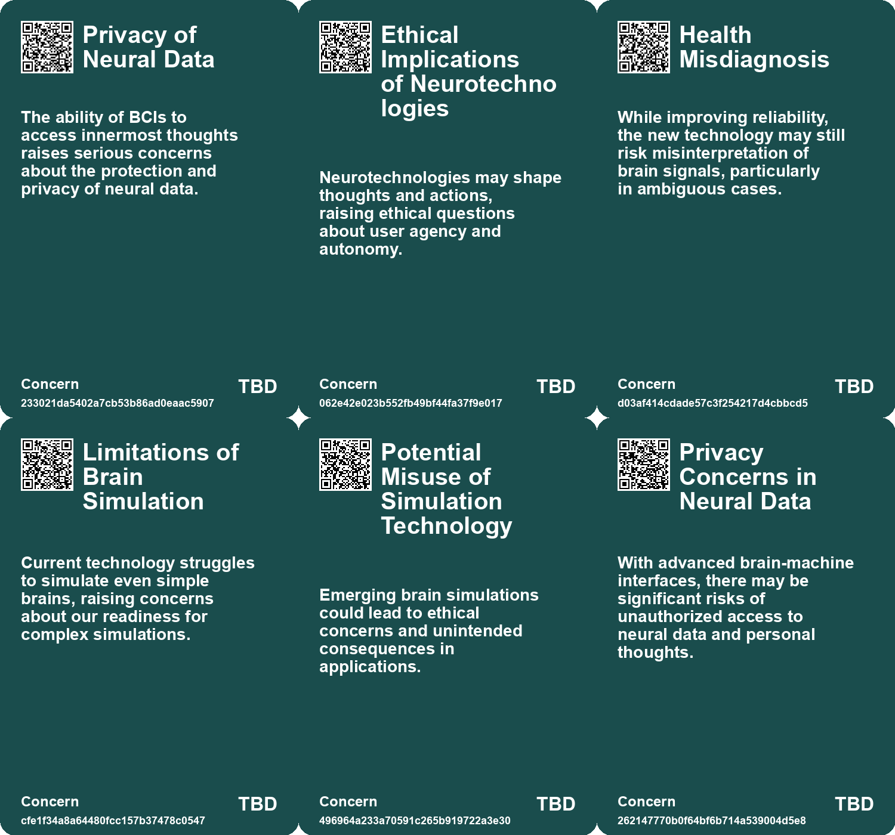
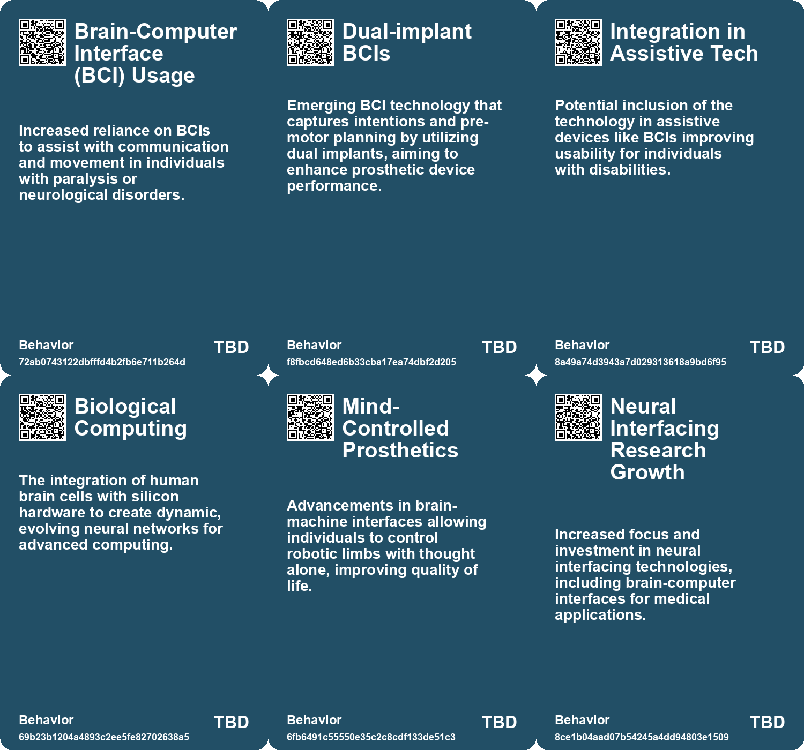
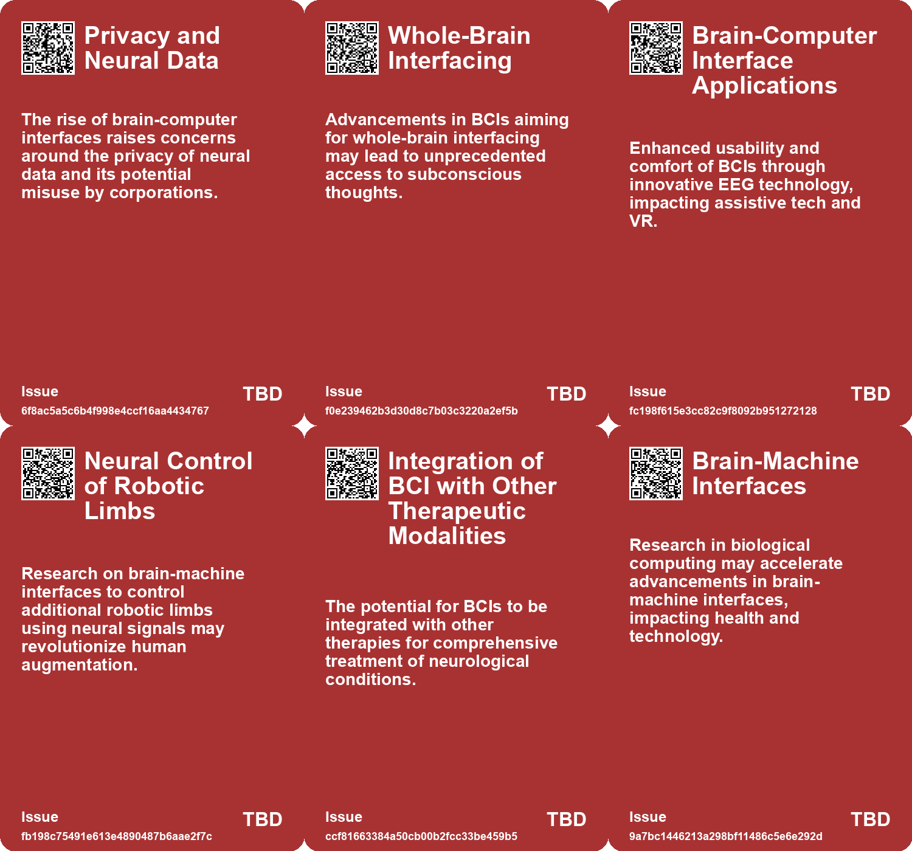
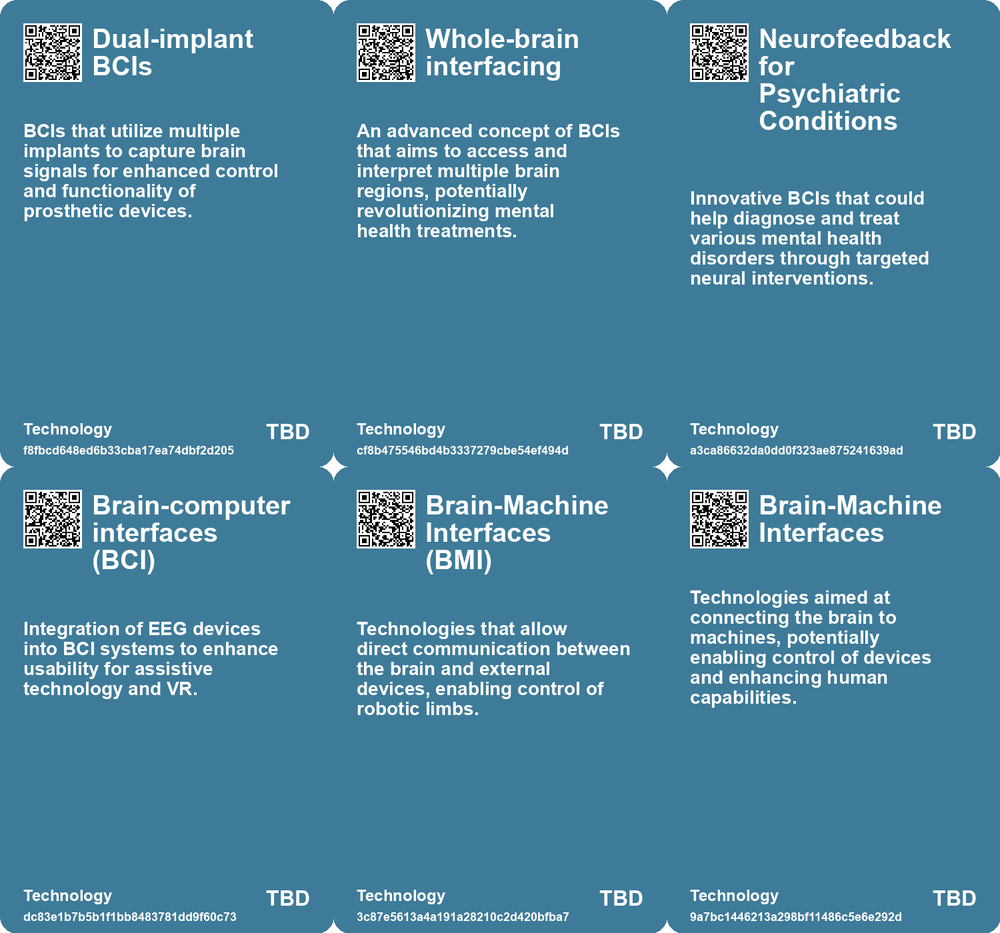

# *Topic*: Brain-Computer Interfaces (BCIs)

# Summary

Advancements in brain-computer interfaces (BCIs) are paving the way for innovative treatments for neurological disorders. Researchers are exploring non-invasive methods, such as functional ultrasound technology, to create BCIs that can cover larger areas of the brain. These developments hold promise for restoring movement and improving the quality of life for individuals with neurological impairments. Meanwhile, dual-implant BCIs are enabling paralyzed individuals to regain abilities, such as making music, by translating brain activity into sound. However, as BCIs become more integrated into clinical use, ethical concerns about privacy and cognitive liberty are emerging, prompting calls for regulation in the neurotechnology sector.

The intersection of biology and technology is further exemplified by the emergence of biological computers. Cortical Labs has introduced the CL1, a device that combines human brain cells with silicon technology to create synthetic biological intelligence. This innovation aims to enhance research in medicine and technology, including drug discovery and robotics. Similarly, the DishBrain project at Monash University has demonstrated sentience in a computer chip containing human and mouse brain cells, showcasing the potential for machine learning and artificial intelligence.

Biohybrid systems are also gaining traction, as seen in the development of Brainoware, which combines a brain organoid with traditional AI technology. This system achieved notable accuracy in speech recognition tasks, highlighting the potential for human biology to enhance computing capabilities. Researchers are also manipulating brain activity patterns to enable learning without conscious awareness, which could revolutionize education and rehabilitation.

The field of mind-reading technology is advancing, with researchers using brain imaging and AI to reconstruct thoughts from brain activity. While this technology offers potential benefits, it raises significant ethical concerns regarding privacy and surveillance. Similarly, AI models are being trained to decode brain scans and reconstruct language, providing insights into how the brain processes communication. These developments underscore the need for careful consideration of the implications of such technologies.

In the realm of neuromorphic computing, researchers are developing energy-efficient alternatives to traditional processors. Innovations like Intel's Loihi chips and new methods to mimic neuron behavior using silicon transistors are promising steps toward more sustainable computing solutions. These advancements could lead to significant improvements in the efficiency of AI systems.

Robotics and neuroscience are converging to explore the potential of mind-controlled prosthetics and robotic limbs. Researchers are investigating noninvasive methods to capture brain commands, aiming to enhance human abilities and assist those with disabilities. The goal is to achieve seamless control of robotic limbs, allowing for natural movement and integration into daily life.

Finally, the concept of neurosecurity is emerging as a critical field that focuses on protecting neural devices and ensuring the integrity of mental processes. This area combines principles of computer science security with neural engineering, addressing the ethical implications of neural technologies. As the landscape of neurotechnology evolves, the need for robust security measures becomes increasingly important to safeguard individual rights and freedoms.

# Seeds

|    | name                                           | description                                                                                       | change                                                                                                     | 10-year                                                                                                        | driving-force                                                                                                        |
|---:|:-----------------------------------------------|:--------------------------------------------------------------------------------------------------|:-----------------------------------------------------------------------------------------------------------|:---------------------------------------------------------------------------------------------------------------|:---------------------------------------------------------------------------------------------------------------------|
|  0 | Brain-Computer Interfaces (BCIs) for Paralysis | BCIs are helping paralyzed individuals regain control of assistive devices through brain signals. | Shift from purely voluntary control to intention prediction using brain activity for assistive technology. | Widespread use of advanced BCIs for various applications beyond paralysis, enhancing user autonomy.            | Increased interest in neuroscience and developments in BCI technology enabling better control and independence.      |
|  1 | Enhanced Human-Computer Interaction (HCI)      | Improved usability of brain-computer interfaces through new EEG electrode design.                 | Evolution from traditional interaction methods to brain-controlled interfaces enhancing user experience.   | HCI may rely more on brain signals, making interactions more intuitive and personalized in everyday tasks.     | Advancements in BCI technology and increasing interest in immersive technologies drive demand for better interfaces. |
|  2 | Biological Computer Launch                     | First commercial launch of a biological computer combining human brain cells with silicon.        | Transition from conventional silicon-based computing to biologically integrated computing.                 | Widespread adoption of biological computers in diverse fields including AI, robotics, and medicine.            | Advancements in biotechnology and the need for energy-efficient computing solutions.                                 |
|  3 | Brain-Machine Interfaces                       | Growing interest in connecting the brain to external devices for various applications.            | Evolution from basic neural interfacing to sophisticated brain-machine interfaces.                         | Integration of brain-machine interfaces into daily life, enabling new capabilities.                            | Ambition to enhance human capabilities and aid those with disabilities.                                              |
|  4 | Biotech Investment in Neural Tech              | Increased investment from companies in brain-computer interface technologies.                     | Shift towards significant funding and research in neural interfacing technologies.                         | A robust market for neural interface technologies with multiple applications.                                  | Growing interest in the intersection of biotechnology and artificial intelligence.                                   |
|  5 | Advancements in Non-Invasive BCIs              | Research into non-invasive brain-computer interfaces using ultrasound technology.                 | Transitioning from invasive BCI surgeries to non-invasive ultrasound methods for brain interaction.        | In 10 years, non-invasive BCIs may become commonplace, improving accessibility for neurological patients.      | The need for safer, long-lasting solutions for brain-computer interfacing drives this innovation.                    |
|  6 | Expansion of BCI Applications                  | Potential to treat a wider range of neurological disorders with BCIs beyond movement restoration. | Broadening the applications of BCIs from movement restoration to mental health treatments.                 | In 10 years, BCIs may be used widely for mental health support, addressing issues like depression and anxiety. | Growing awareness and understanding of mental health issues, combined with BCI advancements, spur this change.       |
|  7 | DishBrain Development                          | Creation of a semi-biological computer chip using lab-grown brain cells.                          | Shift from traditional silicon-based computing to biological computing.                                    | Biological computing could lead to more advanced, adaptable AI systems in various applications.                | The pursuit of more efficient and intelligent computing systems.                                                     |
|  8 | Biological Computing                           | Projects aiming to create intelligent biological systems that can compute and adapt.              | From traditional computing to biological systems that utilize ecosystems for processing information.       | Biological computing could lead to new forms of intelligent systems that integrate with natural ecosystems.    | The need for adaptive systems that can handle complexity beyond human cognitive capabilities.                        |
|  9 | Cyborg Computer Development                    | Development of biohybrid computers combining AI with human brain cells.                           | Transition from traditional computing to biohybrid systems that incorporate human biology.                 | In 10 years, we may see advanced biocomputers outperforming traditional systems in specific tasks.             | The pursuit of energy-efficient computing solutions drives interest in biological integration.                       |

# Concerns

|    | name                                      | description                                                                                                                         |
|---:|:------------------------------------------|:------------------------------------------------------------------------------------------------------------------------------------|
|  0 | Privacy of Neural Data                    | The ability of BCIs to access innermost thoughts raises serious concerns about the protection and privacy of neural data.           |
|  1 | Ethical Implications of Neurotechnologies | Neurotechnologies may shape thoughts and actions, raising ethical questions about user agency and autonomy.                         |
|  2 | Health Misdiagnosis                       | While improving reliability, the new technology may still risk misinterpretation of brain signals, particularly in ambiguous cases. |
|  3 | Limitations of Brain Simulation           | Current technology struggles to simulate even simple brains, raising concerns about our readiness for complex simulations.          |
|  4 | Potential Misuse of Simulation Technology | Emerging brain simulations could lead to ethical concerns and unintended consequences in applications.                              |
|  5 | Privacy Concerns in Neural Data           | With advanced brain-machine interfaces, there may be significant risks of unauthorized access to neural data and personal thoughts. |
|  6 | Data Security Issues                      | As neural interfaces become capable of data transmission, vulnerabilities to hacking or misuse of information could arise.          |
|  7 | Ethical Concerns of Brain Manipulation    | Advancements in BCIs raise ethical questions regarding potential misuse and the psychological impact on users.                      |
|  8 | Device Reliability and Functionality      | The reliability of BCIs, especially in neuroprosthetics, is crucial for user dependency and safety.                                 |
|  9 | Potential for Overreliance on Technology  | As BCIs become more advanced, there is a risk of individuals becoming overly dependent on technology for basic functions.           |

# Cards

## Concerns

## Behaviors

## Issue

## Technology

# Links

* [Revolutionary Method Induces Learning by Directly Manipulating Brain Activity Patterns](https://futures.kghosh.me/608d74fa38b4490086705a9cef803a77)
* [AI Models Show Improved Performance in Theory of Mind Tests Compared to Humans](https://futures.kghosh.me/25cdc8c55ebb70b51b85134dc01e6efd)
* [Tsinghua University's Taichi: A Revolutionary Light-Based AI Chip for Future Computing](https://futures.kghosh.me/1aec7cb8723d807f5486e963a0eb6337)
* [Exploring the Future of Human Augmentation with Extra Robotic Limbs and Neural Control](https://futures.kghosh.me/faad51d1f885af1db9dee5e5ce52b46e)
* [Breakthrough in Biocomputing: Brainoware Combines AI with Human Brain Cells for Speech Recognition](https://futures.kghosh.me/fe93f7419799d1706b4e7ce0a6adcb40)
* [The Impact of Generative AI and Autonomous Agents on Business Value Creation and Trust Issues](https://futures.kghosh.me/15d4ec180189ca1739398f516844cefb)
* [New Research Reveals Mice's Thoughts Through Facial Expressions, Raises Mental Privacy Concerns](https://futures.kghosh.me/2452bd1c47e803e54e65db178501d3b8)
* [Innovative Advances in Neuromorphic Computing: Mimicking Neurons with Silicon Transistors](https://futures.kghosh.me/ed30d911e08e5dabc7996a90ed807274)
* [AI Revolutionizes Wireless Chip Design: Faster, More Efficient, but Not Without Human Oversight](https://futures.kghosh.me/d9e8827672dc442e755c2bc8a0dc7e7d)
* [Innovative Hairlike 3D-Printable Electrode Improves EEG Monitoring for Brain Activity](https://futures.kghosh.me/45b9a8de8b364a995e54680b57eabcad)
* [Harnessing Affective Computing for Empathetic Government Services: Opportunities and Ethical Considerations](https://futures.kghosh.me/53860cc08efad09239e718349307f246)
* [UNSW Engineers Develop 'Optrodes' to Measure Neural Activity Using Light for Advanced Prosthetics](https://futures.kghosh.me/7aeb03c0771769ceb99c3085c141c1fe)
* [Advancements in Mind-Reading Technology Raise Ethical Concerns About Privacy and Free Thought](https://futures.kghosh.me/95a515aafcc880230a55f57c5d902d3f)
* [The Diminishing Role of Human Interaction in Modern Technology and Its Societal Implications](https://futures.kghosh.me/31491f2b50e77cc7c45e541a9b2915d7)
* [The Future of Brain-Computer Interfaces: Promise and Ethical Concerns](https://futures.kghosh.me/c6702f63f03fb731d83c81e00768b28d)
* [Cyborg Botany: Merging Technology with Plant Sensing and Interaction](https://futures.kghosh.me/b1f6991b9b718672751c9427c3f5b794)
* [Monash University Develops DishBrain: A Semi-Biological Chip with Learning Capabilities](https://futures.kghosh.me/fcf584bddde6a0c4ccaf5ab8eadded1e)
* [Exploring the Intelligence of Ecosystems and Biological Computing in Pond Brains](https://futures.kghosh.me/607bce5ceffd29c4ba8997068ebde091)
* [A Comprehensive Taxonomy for Artificial General Intelligence Development Over 25 Years](https://futures.kghosh.me/848ae6771411e76eb554d6d4d2c8f07f)
* [Understanding Neurosecurity: Protection for Neural Devices and User Behavior](https://futures.kghosh.me/70be08bc846223ea4b986fd5f9a69bcf)
* [Cortical Labs Launches World's First Biological Computer: The CL1](https://futures.kghosh.me/c3e6ac3d2c8dcccbff885b74128c5536)
* [The Challenges and Advances in Simulating the C. elegans Brain Over 25 Years](https://futures.kghosh.me/32e91a01ba181534d1578186bfcc240a)
* [Advancements in Brain-Computer Interfaces: Exploring Non-Invasive Ultrasound Technology](https://futures.kghosh.me/32310a2097cecfb2b52a21a7c16fa9e8)
* [Recent Developments in AI Regulation and Technology: A Review of Key Initiatives and Critiques](https://futures.kghosh.me/a009ccdffaa59f53de56887aa19e6239)
* [AI's Role in Understanding the Human Brain: Breakthroughs in Language Processing](https://futures.kghosh.me/e43c70d1c8c34f4587722ef456132b41)
* [Exploring the Future of Neural Networks through Sound and Physical Systems](https://futures.kghosh.me/92fd13cc9ae2e437ede8175d350860ef)