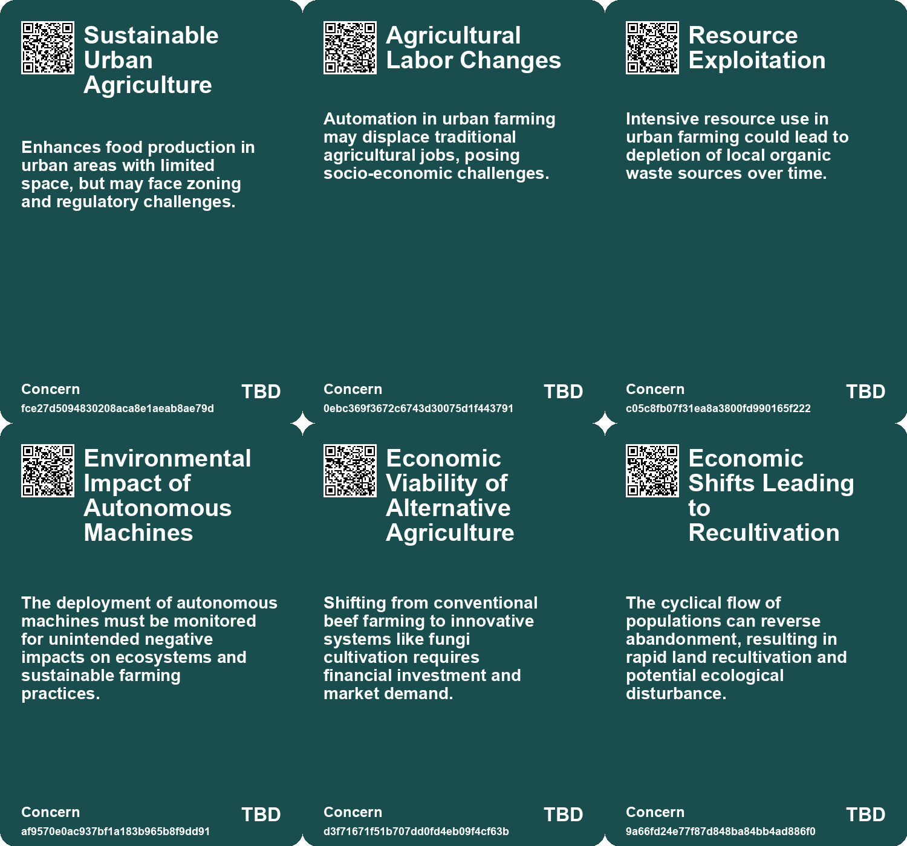
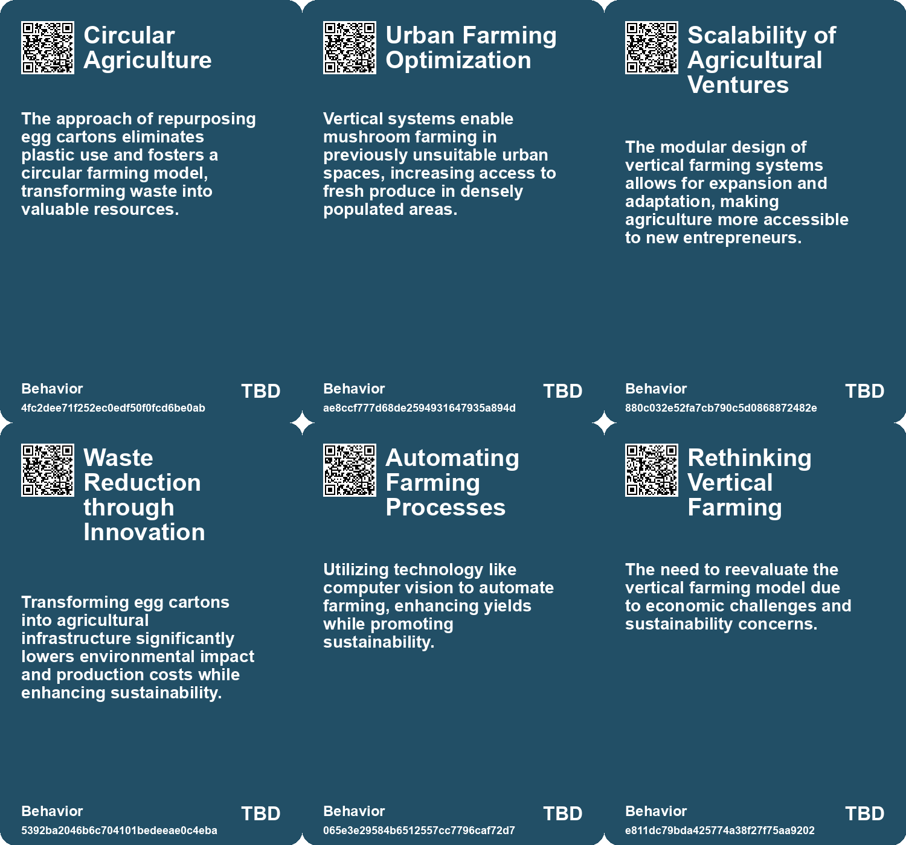
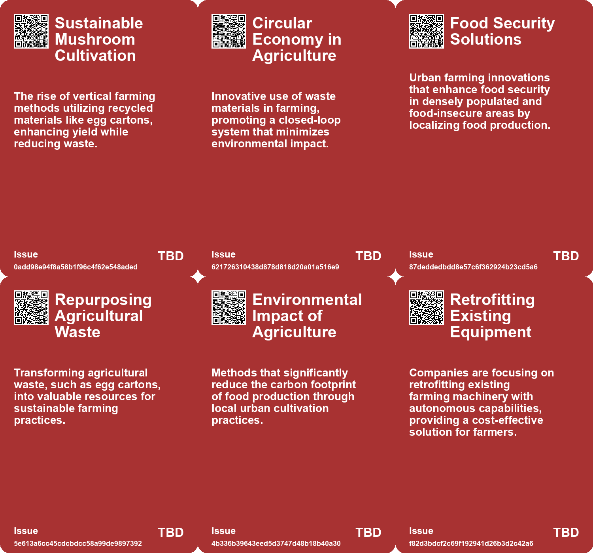
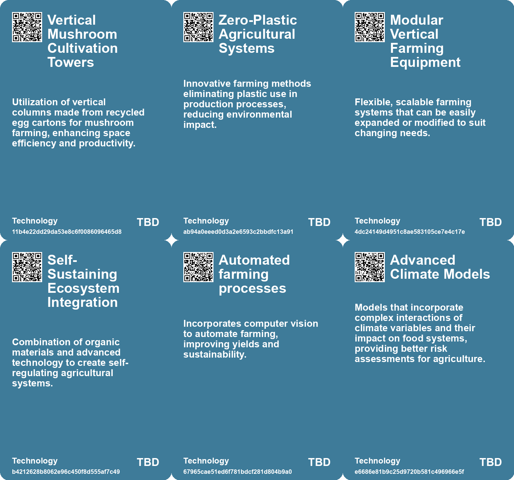

# *Topic*: Circular Farming Models

# Summary

The intersection of agriculture, technology, and urban development is increasingly shaping our food systems and environments. Vertical farming, while promising greater control over food production and reduced water usage, faces significant challenges, including high energy demands and financial instability. Companies like Fifth Season have struggled, highlighting the need for sustainable practices and innovative solutions in urban agriculture.

Sustainable practices are also evident in the development of a mushroom cultivation system in the Netherlands that utilizes recycled materials, optimizing space and eliminating plastic use. This circular farming model not only increases yields but also promotes environmental responsibility, showcasing a replicable approach to food production that addresses waste and food security.

In Africa, farmers are turning to private satellite data to enhance crop yields and improve farming practices. This shift towards data-driven agriculture is crucial in adapting to climate change and traditional farming challenges. Similarly, the concept of electroculture is gaining traction, with anecdotal evidence suggesting that atmospheric electricity can enhance plant growth, offering a potential alternative to conventional farming methods.

Perennial rice strains are being developed to reduce the need for annual replanting, benefiting both farmers and the environment. This innovation could lead to healthier soil and a lower carbon footprint, addressing the pressing issues of food security and sustainability.

Climate change poses significant risks to global food systems, with studies highlighting the potential for simultaneous harvest failures in major breadbaskets. The concentration of greenhouse gases and extreme weather events are often underestimated, necessitating better preparation for complex climate risks.

Innovative technologies are emerging to address agricultural challenges. The E-seed, a bio-inspired seed carrier, can drill itself into the ground, allowing for efficient planting in hard-to-reach areas. This technology has the potential to deliver not only seeds but also fertilizers, enhancing agricultural productivity.

Urban agriculture initiatives, such as the indoor aquaponics system at Central Iowa Shelter & Services, are transforming public spaces and providing job training for residents. This model promotes food production while addressing homelessness and food insecurity.

As cities evolve, innovative designs like floating car parks aim to tackle urban flooding while maximizing public space. These projects reflect a growing awareness of the need for sustainable urban planning in the face of climate change.

The role of fungi in environmental restoration is gaining attention, particularly in addressing pollution in brownfields. Nature-based techniques using fungi and native plants show promise in breaking down toxins and restoring contaminated land, offering a sustainable solution to environmental degradation.

The integration of AI in farming raises ethical questions about animal welfare and the relationship between farmers and livestock. While AI can enhance monitoring and care, it also risks prioritizing economic efficiency over genuine animal care.

These themes underscore the urgent need for innovative solutions in agriculture, urban planning, and environmental restoration as we navigate the complexities of climate change and food security.

# Seeds

|    | name                                        | description                                                                                                           | change                                                                                                         | 10-year                                                                                                         | driving-force                                                                                             |
|---:|:--------------------------------------------|:----------------------------------------------------------------------------------------------------------------------|:---------------------------------------------------------------------------------------------------------------|:----------------------------------------------------------------------------------------------------------------|:----------------------------------------------------------------------------------------------------------|
|  0 | Vertical Mushroom Farming Innovation        | Visualizes mushroom growth in reused egg cartons, significantly increasing yield efficiency.                          | Shift from traditional horizontal farming to vertical farming with recycled materials.                         | Urban agriculture becomes mainstream, optimizing space in cities while enhancing food security.                 | Growing demand for sustainable and local food production methods in urban areas.                          |
|  1 | Circular Farming Model                      | Encourages repurposing agricultural waste into productive growth mediums, eliminating reliance on plastics.           | Transition from linear waste management to a circular economy in agriculture.                                  | Circular farming practices widely adopted globally, reducing waste and promoting sustainability in agriculture. | Increased awareness of environmental sustainability and waste management issues.                          |
|  2 | AI-driven Farming Automation                | AI automates control of farming processes, reducing human involvement and oversight.                                  | Shift from traditional farming methods to AI-driven automated systems.                                         | More farms may operate autonomously with minimal human oversight and intervention.                              | Advancements in AI technology and the demand for efficiency in agriculture.                               |
|  3 | Cage-based Farming Efficiency               | AI enhances efficiency in low-welfare cage-based farming systems.                                                     | Increased reliance on cage systems due to economic efficiencies driven by AI.                                  | Cage-based systems could dominate the market, affecting animal welfare negatively.                              | Economic pressures and demand for higher productivity in farming.                                         |
|  4 | Sustainable Agriculture Technology          | Emergence of technologies aimed at enhancing sustainability in agriculture.                                           | Shift from traditional farming practices to technology-driven sustainable methods.                             | In a decade, agriculture will heavily rely on advanced technologies for sustainable practices.                  | Growing awareness of climate change and need for sustainable food production.                             |
|  5 | Rise of Autonomous Agriculture              | Autonomous tractors and farming technology are emerging in the agricultural sector.                                   | Moving from manual farming practices to fully autonomous systems over the next decade.                         | Farms may become largely automated, reducing labor needs and increasing operational efficiency.                 | Advancements in AI, machine learning, and robotics are revolutionizing farming capabilities.              |
|  6 | Tech Investment Misalignment in Agriculture | Venture capital investments in food tech are declining, questioning the sustainability of tech-driven farming models. | Transition from high-tech investments in agriculture to a focus on sustainable, traditional farming practices. | In a decade, agriculture may rely more on tried-and-true methods rather than tech-driven solutions.             | Investors are recognizing that food production economics differ significantly from tech sector economics. |
|  7 | Environmental Benefits of Perennial Grains  | Potential for healthier soil and lower carbon footprint through perennial crops.                                      | Transition from traditional agriculture to more sustainable practices with perennial crops.                    | In a decade, agriculture may prioritize perennial crops, improving environmental health and biodiversity.       | Increasing awareness of climate change and the need for sustainable agricultural practices.               |
|  8 | Urban Agriculture Experimentation           | Oosterwold serves as a living experiment in urban agriculture, promoting self-sufficiency among residents.            | From conventional city planning to an innovative model prioritizing urban agriculture.                         | Oosterwold may inspire urban areas globally to integrate agriculture into city planning.                        | The need for local food production amidst climate change and urbanization.                                |
|  9 | Innovative Agricultural Practices           | Residents experiment with diverse gardening techniques to optimize their plots.                                       | From conventional gardening to innovative, personalized approaches to urban agriculture.                       | Gardening may evolve into a more experimental and community-driven practice.                                    | The pursuit of sustainable and efficient food production methods in urban settings.                       |

# Concerns

|    | name                                            | description                                                                                                                                                         |
|---:|:------------------------------------------------|:--------------------------------------------------------------------------------------------------------------------------------------------------------------------|
|  0 | Sustainable Urban Agriculture                   | Enhances food production in urban areas with limited space, but may face zoning and regulatory challenges.                                                          |
|  1 | Agricultural Labor Changes                      | Automation in urban farming may displace traditional agricultural jobs, posing socio-economic challenges.                                                           |
|  2 | Resource Exploitation                           | Intensive resource use in urban farming could lead to depletion of local organic waste sources over time.                                                           |
|  3 | Environmental Impact of Autonomous Machines     | The deployment of autonomous machines must be monitored for unintended negative impacts on ecosystems and sustainable farming practices.                            |
|  4 | Economic Viability of Alternative Agriculture   | Shifting from conventional beef farming to innovative systems like fungi cultivation requires financial investment and market demand.                               |
|  5 | Economic Shifts Leading to Recultivation        | The cyclical flow of populations can reverse abandonment, resulting in rapid land recultivation and potential ecological disturbance.                               |
|  6 | Potential Over-reliance on Algorithms           | Farmers may become too dependent on algorithms, potentially overlooking traditional agricultural knowledge and practices.                                           |
|  7 | Need for Adaptive Farm Techniques               | As climate change progresses, the necessity for innovative and adaptive farming methods grows, highlighting vulnerabilities in current practices.                   |
|  8 | Environmental Impact of Urban Agriculture       | Studies indicate possible higher carbon emissions from urban agriculture compared to conventional farming, raising sustainability questions for Oosterwold's model. |
|  9 | Short-term vs Long-term Infrastructure Planning | Infrastructure established early may contribute to higher carbon footprints; long-term sustainability must be prioritized in urban agriculture.                     |

# Cards

## Concerns

## Behaviors

## Issue

## Technology

# Links

* [Innovative Approaches to Public Space Transformation in U.S. Cities](https://futures.kghosh.me/465b809f2a993c634a1a239ca0cab476)
* [Innovative E-seed Technology Enhances Aerial Seeding Inspired by Nature](https://futures.kghosh.me/58c165e1a46408307f2b60f63df7c549)
* [Exploring the Consequences of Abandonment in Rural Bulgaria and Nature's Response](https://futures.kghosh.me/9ab2903416b01dac618d7f3b93ab6dfa)
* [Tredje Natur's Innovative Floating Car Parks Address Urban Flooding Challenges](https://futures.kghosh.me/fa32383d80fb8bdbed6465119f33fe4b)
* [Innovative Solutions to Combat Deforestation and Enhance Food Production with Fungi](https://futures.kghosh.me/0c58d382a0cacf288605a136bbcf69a3)
* [Exploring the Intersection of Video Game Simulation and Real-World Ecology](https://futures.kghosh.me/57fcfcda347e1934e0c1da9fc212fcec)
* [Innovative Adaptations of Assam's Chang Ghars for Flood Resilience and Climate Change Challenges](https://futures.kghosh.me/141479bb35e9f52f4fa3fdccd0d2b13a)
* [China's Urbanization Strategy: Building Sustainable City Clusters for 100 Million Inhabitants](https://futures.kghosh.me/36cc4bee50644b6ef53de008db24e0c4)
* [Revolutionizing Agriculture: The Rise of Perennial Rice and Its Benefits](https://futures.kghosh.me/3955987c235652b24c7507a6999cc80e)
* [China's Urban Future: The Rise of City Clusters and Sustainable Development Strategies](https://futures.kghosh.me/2c6411450b93e8449beffcb00e58b39b)
* [Exploring Electroculture: A New Trend in Gardening Amidst Historical Skepticism and Modern Science](https://futures.kghosh.me/257c9d336364e061c817ec77db9e78f6)
* [Revolutionizing Mushroom Cultivation: Sustainable Practices in Dutch Agriculture Using Recycled Materials](https://futures.kghosh.me/28e35fba43e053527fe7735de63ca252)
* [Exploring Trends and Innovations in Greek Agtech: A Newsletter Overview](https://futures.kghosh.me/6b4817fc4f138ec8a276f6048589e9c0)
* [Oosterwold: A Creative Urban Agriculture Experiment Redefining City Planning](https://futures.kghosh.me/463175b0c08c0814f98567772c571124)
* [The Ethical Implications of AI in Modern Farming: Balancing Efficiency and Animal Welfare](https://futures.kghosh.me/7aa357540401ea845962adbd36627a80)
* [Exploring the Challenges of Vertical Farming and Car-Centric Urban Planning](https://futures.kghosh.me/ef74de2ae50dd0f311346505df7068c3)
* [Innovative Self-Drilling Seed Carriers Enhance Aerial Seeding Success in Agriculture and Restoration](https://futures.kghosh.me/3df5ffec09d8b8f36f0f61ab5ac43730)
* [Innovative Fungal Solutions for Restoring Contaminated Brownfields in the U.S.](https://futures.kghosh.me/666f5297ceb142394ebf30d39f1d9bc3)
* [Study Highlights Underestimated Risks of Simultaneous Harvest Failures Due to Climate Change](https://futures.kghosh.me/9bebaea9ed2c74b635c7ffbedc039556)
* [Navigating Climate Change: The Need for Community Resilience and Social Trust](https://futures.kghosh.me/efa36dc9bd5ddc890866d4ab1e68e71f)
* [How African Farmers Are Leveraging Satellite Data to Enhance Crop Yields and Combat Climate Change](https://futures.kghosh.me/3c4f4b0832ff414899cf292220127e16)
* [Exploring Cookies, Supply Chains, and Future Challenges in Technology and Consumption](https://futures.kghosh.me/fa27e27bdec01712d582ab0f61c95bac)
* [John Deere's Ambitious Journey Towards AI and Robotics Leadership in Agriculture](https://futures.kghosh.me/e623b9d82816485d864a5faeb2f0d15b)