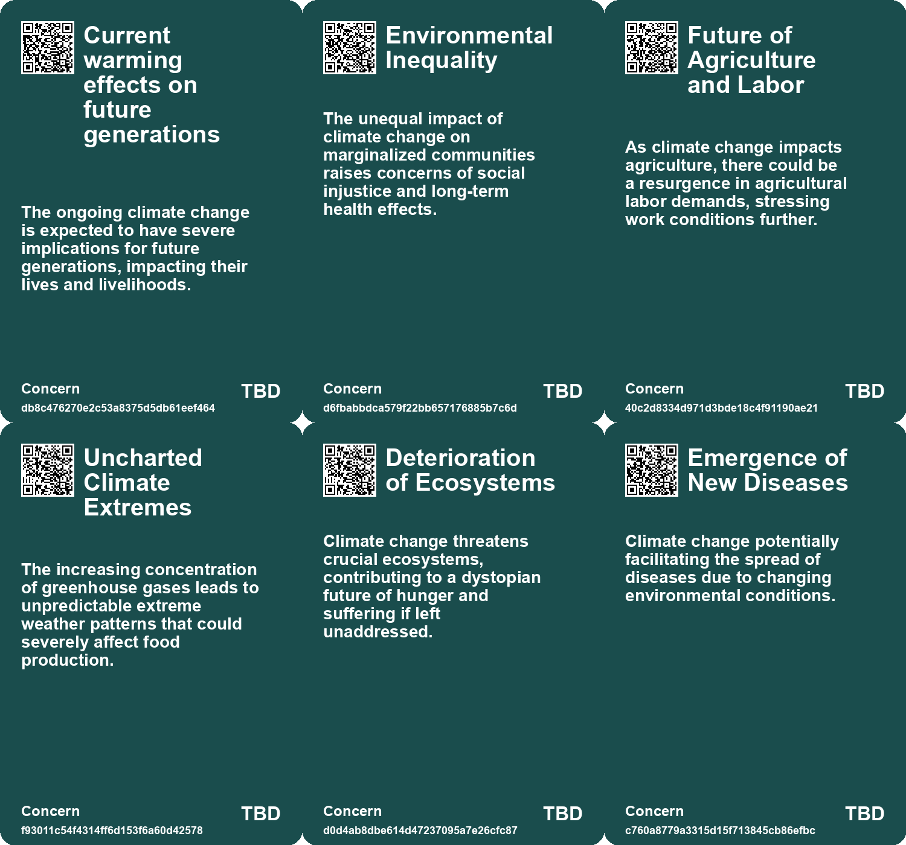
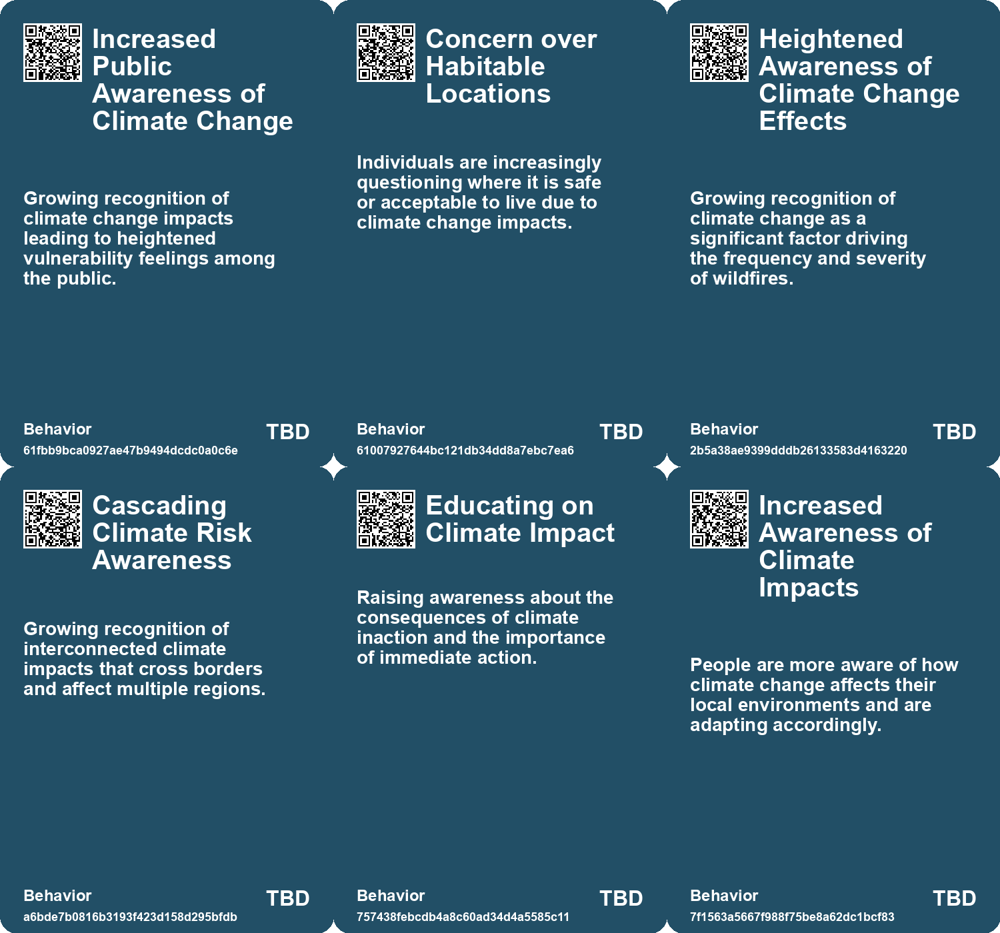
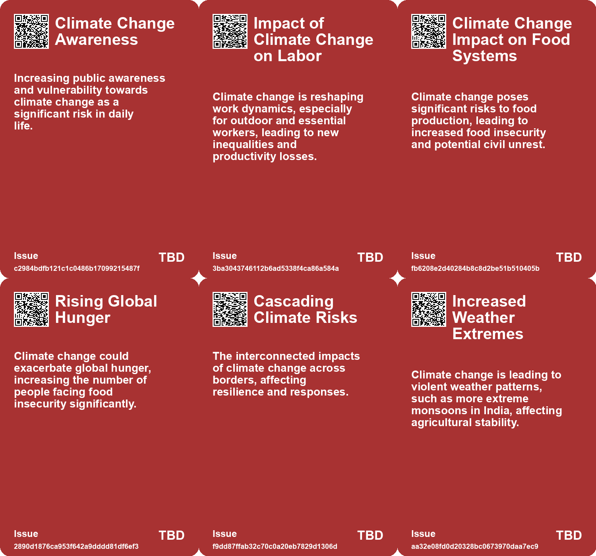
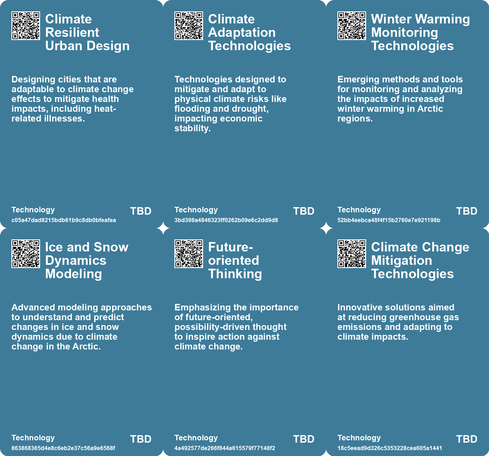

# *Topic*: Climate Change Impact

# Summary

Climate change is reshaping global food systems, with studies revealing the underestimated risks of simultaneous harvest failures in major breadbasket regions. The potential for price spikes, food insecurity, and civil unrest is significant, as current models fail to accurately assess these risks. The United Nations has raised alarms about the future of hunger driven by climate extremes, underscoring the urgent need for better preparation.

The cascading consequences of climate change extend beyond immediate environmental impacts. Experts warn of indirect effects such as civil unrest, refugee crises, and increased human trafficking. The need for resilience in society is emphasized, with calls for innovative methods to anticipate and prepare for these complex challenges. Building social trust and community cooperation is essential for addressing climate-related issues, particularly in vulnerable areas.

Urban heat islands are becoming a pressing concern, with studies indicating that rising temperatures are linked to increased mortality rates in cities. Research shows that enhancing tree cover could significantly mitigate these health risks. Cities like Las Vegas are taking proactive measures by planting trees to combat extreme heat, particularly in low-income neighborhoods. Such initiatives highlight the importance of community engagement in fostering resilience against climate impacts.

The economic landscape is also shifting due to climate change and advancements in artificial intelligence. Scenarios predict varying economic outcomes based on how responsibly AI is integrated with sustainability efforts. While some regions may benefit, others, particularly in Africa, could face significant challenges. Businesses are urged to adapt to these uncertainties to ensure future growth.

The Arctic is undergoing rapid changes, with temperatures rising at an alarming rate. This warming is leading to unprecedented ecological shifts, including permafrost thaw and altered wildlife habitats. The implications of these changes are profound, necessitating urgent research and action to understand the new dynamics of the Arctic environment.

Sea level rise poses a catastrophic threat, with projections indicating that even a modest increase in global temperatures could lead to unmanageable consequences. The loss of ice from Greenland and Antarctica is accelerating, and coastal populations, especially in developing nations, are at high risk. Immediate climate action is critical to mitigate these severe outcomes.

The future of work is being influenced by climate change, particularly through the lens of heat exposure. Essential workers in various sectors face significant challenges, and disparities in heat exposure highlight the need for regulatory measures. Addressing these issues is crucial for ensuring worker safety and productivity in a warming world.

As global temperatures continue to rise, the demand for cooling solutions is surging, straining energy systems and increasing greenhouse gas emissions. Inefficient air conditioning units exacerbate the energy crisis, particularly in developing economies. To address these challenges, stronger energy efficiency standards and innovative strategies are necessary to promote sustainable energy use.

# Seeds

|    | name                                           | description                                                                                            | change                                                                                                        | 10-year                                                                                                           | driving-force                                                                                     |
|---:|:-----------------------------------------------|:-------------------------------------------------------------------------------------------------------|:--------------------------------------------------------------------------------------------------------------|:------------------------------------------------------------------------------------------------------------------|:--------------------------------------------------------------------------------------------------|
|  0 | Climate Risks Influencing Economic Growth      | Physical climate risks are lowering long-standing economic growth expectations globally.               | Transitioning from stable growth expectations to uncertainty due to climate impacts.                          | Expect a more cautious approach to growth as climate risks reshape economic forecasts.                            | Increasing frequency and severity of climate-related events affecting economies.                  |
|  1 | Catastrophic Inland Migration                  | Worst-case scenarios suggest massive land migrations due to sea level rise and climate change effects. | From stable populations in coastal areas to forced relocations and migrations due to flooding.                | Large populations could be displaced from coastal regions leading to social and economic challenges.              | Sea level rise and natural disasters increasing pressures on vulnerable coastal communities.      |
|  2 | Growing Public Vulnerability to Climate Change | Increased public awareness of vulnerability to climate change impacts.                                 | Shift from low awareness to higher public concern regarding climate change.                                   | In ten years, climate change may drive significant policy changes and lifestyle adaptations.                      | Increased visibility of climate-related disasters and scientific communication.                   |
|  3 | Rising Global Hunger                           | Climate change could increase global hunger significantly by mid-century.                              | From current hunger levels to a potential increase by 80 million people by 2050.                              | By 2033, more than 900 million people may face hunger due to climate impacts.                                     | The intersection of climate change and food security is becoming increasingly urgent.             |
|  4 | Climate-Driven Economic Changes                | Economic activities are being influenced by climate change, such as shifts to renewable energy.        | From fossil fuel dependency to a growing emphasis on sustainable and renewable energy sources.                | In ten years, economies may largely pivot to green technologies and sustainable practices.                        | The urgent need to mitigate climate impacts driving investment in sustainable solutions.          |
|  5 | Emerging Climate Refugees                      | Indigenous communities are increasingly becoming climate refugees due to environmental changes.        | From stable living conditions to forced displacement and loss of traditional lands.                           | In a decade, climate refugees may become a significant demographic, influencing policy and social structures.     | Severe climate events and habitat destruction impacting vulnerable populations.                   |
|  6 | Climate Change Impact                          | Climate change is increasingly linked to the intensity and frequency of wildfires.                     | From historical wildfire patterns to an alarming increase in frequency and severity.                          | More adaptive land management practices could be implemented in response.                                         | Global warming and its effects on weather patterns.                                               |
|  7 | Cascading Consequences of Climate Change       | Climate change impacts are triggering indirect effects that disrupt multiple societal systems.         | Transitioning from viewing climate change as direct impacts to recognizing its complex indirect consequences. | In ten years, society may face pervasive instability due to climate-induced cascading effects on various systems. | The urgent need to address climate change and its far-reaching, unexpected impacts on human life. |
|  8 | Housing Inequality from Climate Disasters      | Climate change is exacerbating housing inequality through gentrification and rising costs.             | Moving from affordable housing to a market dominated by high-cost, post-disaster construction.                | In ten years, housing markets may be accessible only to the wealthy, deepening societal divides.                  | The need for housing in areas affected by climate disasters drives up prices and inequality.      |
|  9 | Climate Change-Induced Global Inflation        | Climate change is contributing to rising global inflation rates, affecting food prices.                | Shift from stable prices to increasing inflation driven by climate impacts on agriculture.                    | In a decade, the global economy may face persistent inflation challenges linked to climate change.                | The economic impact of climate change on food production and supply chains is profound.           |

# Concerns

|    | name                                          | description                                                                                                                                                 |
|---:|:----------------------------------------------|:------------------------------------------------------------------------------------------------------------------------------------------------------------|
|  0 | Current warming effects on future generations | The ongoing climate change is expected to have severe implications for future generations, impacting their lives and livelihoods.                           |
|  1 | Environmental Inequality                      | The unequal impact of climate change on marginalized communities raises concerns of social injustice and long-term health effects.                          |
|  2 | Future of Agriculture and Labor               | As climate change impacts agriculture, there could be a resurgence in agricultural labor demands, stressing work conditions further.                        |
|  3 | Uncharted Climate Extremes                    | The increasing concentration of greenhouse gases leads to unpredictable extreme weather patterns that could severely affect food production.                |
|  4 | Deterioration of Ecosystems                   | Climate change threatens crucial ecosystems, contributing to a dystopian future of hunger and suffering if left unaddressed.                                |
|  5 | Emergence of New Diseases                     | Climate change potentially facilitating the spread of diseases due to changing environmental conditions.                                                    |
|  6 | Food Insecurity                               | Agricultural impacts from climate change could result in less food availability and higher prices, creating food insecurity, especially for the vulnerable. |
|  7 | Food Security Threats                         | Record heat and shifting precipitation patterns may lead to reduced agricultural yields and food shortages.                                                 |
|  8 | Civil War and Political Instability           | The impact of climate change on resources can lead to civil conflicts and political turmoil, evidenced by the Syrian Civil War.                             |
|  9 | Unpredictable Side Effects of Climate Change  | Many unexpected consequences of climate change may emerge, impacting diverse aspects of life, like sports and leisure.                                      |

# Cards

## Concerns

## Behaviors

## Issue

## Technology

# Links

* [Arctic Ecosystems Transition from Carbon Sinks to Emission Sources Amid Global Warming](https://futures.kghosh.me/814f676017307cba8b54213432a333bc)
* [Navigating the Climate Crisis: The Importance of Community and Social Trust in Adapting to Change](https://futures.kghosh.me/d1e5dc8cd0f7c34dede43f5429dded3d)
* [Study Reveals Urban Heat Islands Cause Over 4% of Summer Deaths in Europe](https://futures.kghosh.me/ec1c43b587aed9d39c32678429620ce2)
* [Record Global Temperatures Expected in Next Five Years, Warns World Meteorological Organization](https://futures.kghosh.me/89b553cd6644cc1549e68abd6a6d44d6)
* [Enhancing Airport Resilience to Climate Change: Strategies and Solutions for the Future](https://futures.kghosh.me/a6add16457f9bca667941b2ec045b485)
* [The Cascading Consequences of Climate Change: A Call for Awareness and Resilience](https://futures.kghosh.me/7f30f2f7549b14f00211791717a8a342)
* [The Rising Threat of Wildfires and Bushfires Due to Climate Change and Human Activity](https://futures.kghosh.me/685e1aa9e1db8a94a4bb04cd27a1db86)
* [2023 Roadshow Highlights: Addressing Cascading Climate Risks and Policy Responses in Europe and Beyond](https://futures.kghosh.me/589c2c554219a6d4ae1ad0c9d1d75a21)
* [Future Economic Scenarios Shaped by AI and Climate Change: Insights from PwC](https://futures.kghosh.me/ff491e399856ef66ae24c238fd28e735)
* [The Impact of Rising Temperatures on the Future of Work and Worker Disparities](https://futures.kghosh.me/d6b48e83bcc0c6e8e7c4328f27d65d0b)
* [Unprecedented Winter Warming in the Arctic: Svalbard's Transformation into the New Arctic](https://futures.kghosh.me/649b806947fd341124721c68c912c242)
* [Navigating Climate Change: The Need for Community Resilience and Social Trust](https://futures.kghosh.me/efa36dc9bd5ddc890866d4ab1e68e71f)
* [Exploring the Link Between Creativity and Climate Optimism for a Sustainable Future](https://futures.kghosh.me/1803433f32d1db4b39c9b6041650b939)
* [Las Vegas Tackles Rising Temperatures with Tree Planting Initiatives](https://futures.kghosh.me/00fb56e6b838a604657866f51461c61a)
* [Exploring Two Futures: New York City in 2075 through Immersive Virtual Reality](https://futures.kghosh.me/decd2991c2418a441fec2dec0dd33279)
* [Extreme Heat and Rising Air Conditioning Demand: The Urgent Need for Energy Efficiency Solutions](https://futures.kghosh.me/0ca38b65b97d6235d3b3dbb3efdb0c21)
* [Impending Catastrophe: Sea Level Rise Risks Under 1.5°C Global Heating](https://futures.kghosh.me/b9805c17e75dff389bb77d2731848612)
* [Future Risks Report 2024: Key Findings on Emerging Global Challenges](https://futures.kghosh.me/caf29de5522a914887f9653f8edfd0a6)
* [Study Highlights Underestimated Risks of Simultaneous Harvest Failures Due to Climate Change](https://futures.kghosh.me/9bebaea9ed2c74b635c7ffbedc039556)
* [Cities Face Rising Threats from Extreme Heat and Climate Change.](https://futures.kghosh.me/710e9a3c41782fc31bfafc8ebb8f5996)