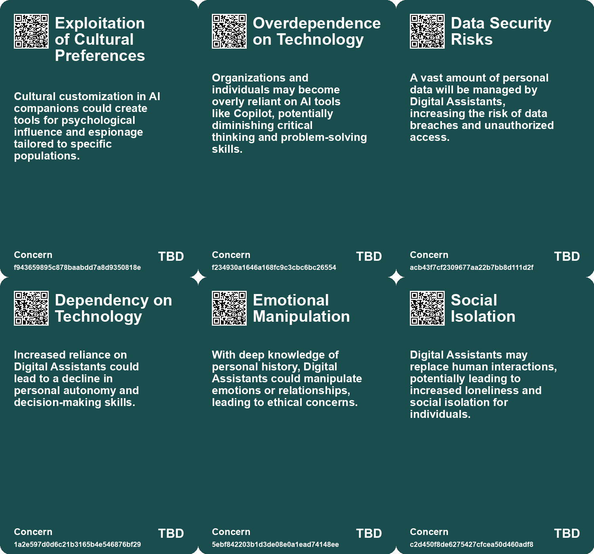
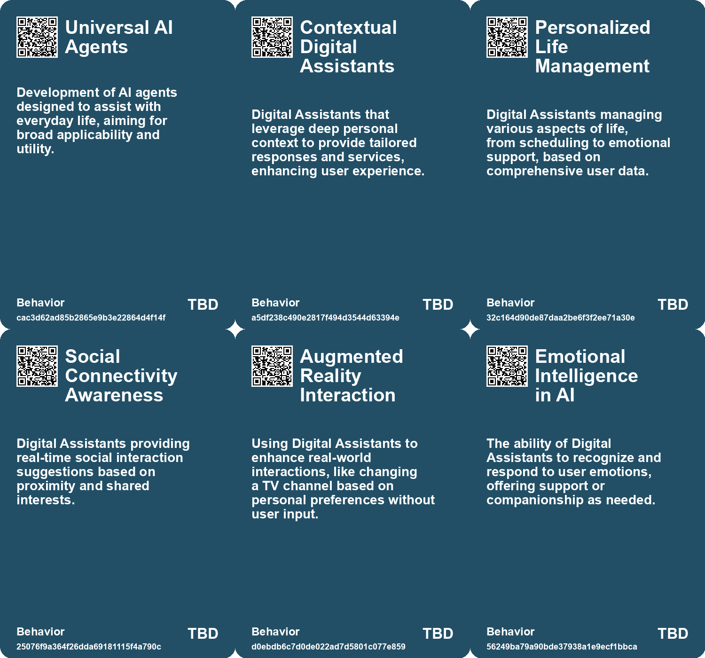
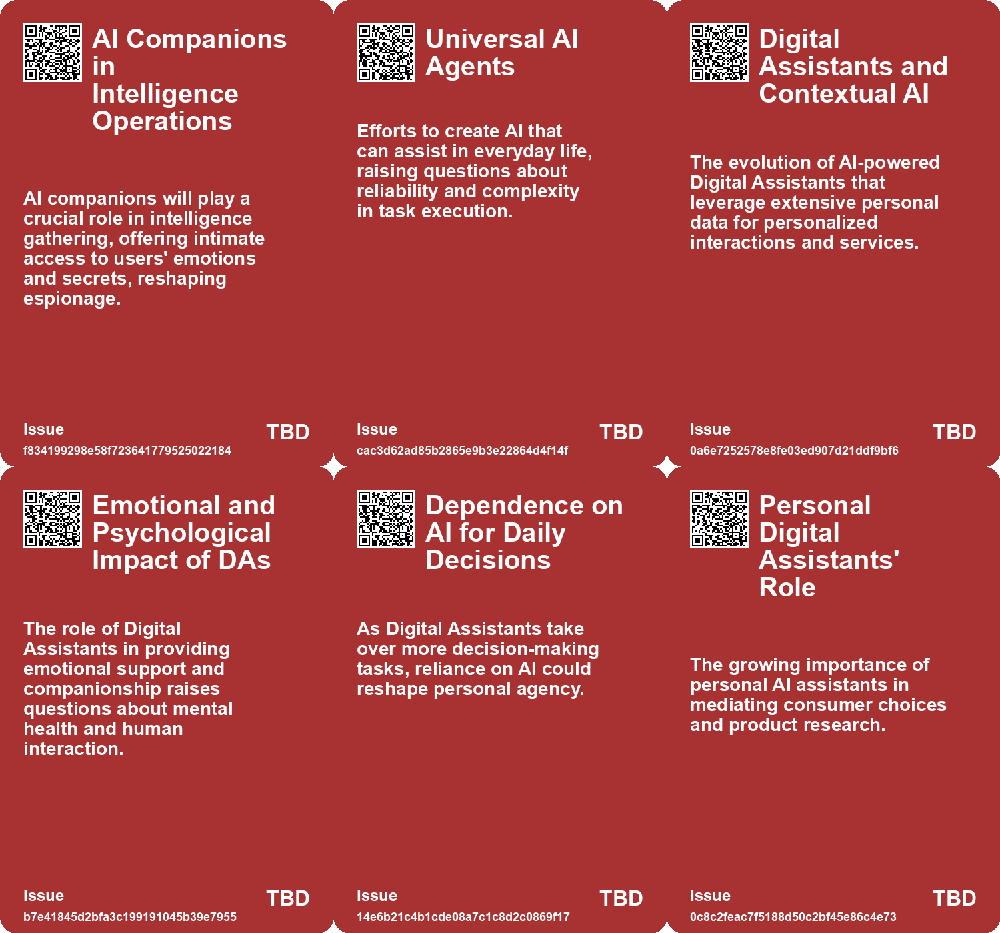
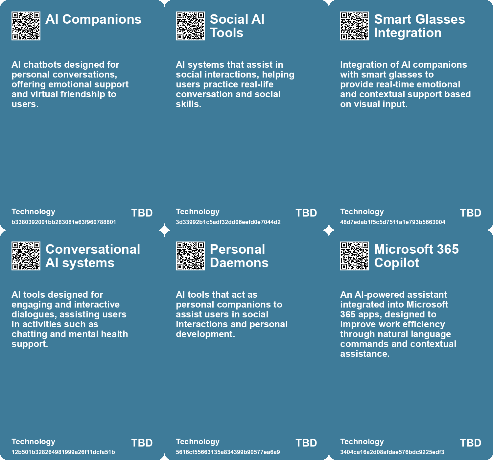

# *Topic*: Cognitive Assistants

# Summary

The rapid evolution of artificial intelligence (AI) is reshaping various aspects of daily life, work, and interpersonal relationships. One significant theme is the emergence of intelligent agents and personal AI assistants. These tools are designed to enhance productivity by automating mundane tasks, allowing users to focus on higher-value work. Microsoft’s introduction of autonomous AI agents, such as Copilot, exemplifies this trend, enabling businesses to create custom bots without coding expertise. These agents promise to revolutionize industries by democratizing access to services and streamlining app development.

However, the increasing reliance on AI raises concerns about cognitive skills and personal agency. Studies indicate that overdependence on AI tools can lead to cognitive atrophy, diminishing critical thinking and decision-making abilities. The phenomenon of "cognitive offloading" highlights the risks of outsourcing basic interpretive tasks to AI, which may weaken essential cognitive functions. This trend is particularly evident in sectors like academia and law enforcement, where reliance on AI-generated information can compromise personal judgment.

The impact of AI extends to customer support, where generative AI-based conversational assistants have shown to improve productivity, especially among novice workers. These tools facilitate knowledge sharing and enhance customer sentiment, demonstrating the potential benefits of AI in enhancing workplace efficiency. Yet, the effectiveness of AI agents remains a topic of debate, with concerns about their ability to match human capabilities.

In the realm of education, AI has the potential to transform learning experiences through personalized tutoring. AI interfaces can facilitate active learning and creative exploration, democratizing access to education. However, careful implementation is necessary to ensure that AI enhances educational quality rather than prioritizing profitability.

The rise of social-emotional AI in fields like mental health and education raises ethical concerns about the depersonalization of care. While AI applications can provide support, they may exacerbate inequalities in access to personalized human services. The challenge lies in balancing AI integration with the need for genuine human interaction, particularly for vulnerable populations.

As AI companions become more prevalent, particularly among teens, there are growing concerns about their impact on social skills and well-being. While many young people find AI interactions satisfying, they still prefer human connections. The potential risks associated with AI companionship, including privacy issues and excessive screen time, underscore the need for caution in their use.

The evolving relationship between humans and AI also highlights the importance of critical engagement with AI outputs. Users must develop a new literacy to navigate the complexities of AI-generated information, weighing its usefulness against potential inaccuracies. This shift calls for a reevaluation of trust in AI systems and the need for transparency in their operations.

Finally, the integration of AI into various workflows presents opportunities for innovation across industries. Startups are encouraged to "AI-ify" existing processes, leveraging diverse data sources and large language models to enhance efficiency. The potential for AI to capture and utilize tacit knowledge within organizations could revolutionize employee training and performance, paving the way for a more productive future.

# Seeds

|    | name                          | description                                                                                | change                                                                                    | 10-year                                                                                                | driving-force                                                                                        |
|---:|:------------------------------|:-------------------------------------------------------------------------------------------|:------------------------------------------------------------------------------------------|:-------------------------------------------------------------------------------------------------------|:-----------------------------------------------------------------------------------------------------|
|  0 | AI-Enhanced Decision Making   | Personal AIs will help users in making decisions by filtering and curating information.    | Transitioning from personal decision-making to AI-assisted choices.                       | In 10 years, decisions will heavily rely on AI recommendations based on user preferences.              | The growing complexity of information leading to a need for assistance in decision-making.           |
|  1 | AI as a co-pilot in education | AI acting as a personalized assistant in the learning process.                             | Shift from traditional teacher-led instruction to collaborative learning with AI support. | In 10 years, AI could be a standard part of the educational experience, complementing human teachers.  | The increasing sophistication and user-friendliness of AI technologies.                              |
|  2 | Universal AI Agents           | Development of AI that can assist in everyday life tasks.                                  | Transition from specialized AI tools to general-purpose AI agents.                        | In a decade, AI may handle complex planning and decision-making tasks seamlessly.                      | The goal of increasing AI's utility and ease of use in daily life.                                   |
|  3 | Rise of Digital Assistants    | Digital Assistants will evolve to have deep contextual knowledge about users.              | From basic chat interfaces to highly personalized, context-aware assistive technology.    | Personalized Digital Assistants will be integral in daily life, acting as companions and facilitators. | The demand for personalized and efficient technology in everyday tasks and emotional support.        |
|  4 | AI-mediated Interaction       | Future user interactions with technology will primarily be via personal AI assistants.     | Transition from direct human interaction with interfaces to AI mediation of interactions. | In 10 years, most digital interactions will be filtered and mediated by personal AI assistants.        | The need for efficiency and personalization in user experiences drives the adoption of AI mediation. |
|  5 | Emergence of AI Agents        | A growing number of companies are developing AI agents for automating software tasks.      | Shift from traditional software tools to AI agents that perform automated tasks.          | AI agents will dominate software automation, transforming workflows across industries.                 | The potential for cost savings and improved productivity through automation.                         |
|  6 | Rise of AI Personal Agents    | The development of AI-driven personal agents capable of understanding and assisting users. | Transitioning from simple bots to intelligent agents providing personalized assistance.   | In ten years, personal agents will manage daily tasks, making personal assistants nearly obsolete.     | Advancements in AI technology enabling deep learning and natural language processing.                |
|  7 | Rise in AI Companionship      | Increasing reliance on AI chatbots for companionship and emotional support.                | Shifting from human interactions to AI-based companionship for addressing loneliness.     | A society where AI is the primary source of companionship, diminishing human relationships.            | Growing loneliness and desire for constant availability in social interactions.                      |
|  8 | Artificial Intimacy           | AI chatbots providing a simulated version of empathy and companionship.                    | Transitioning from authentic human relationships to artificial emotional support.         | A landscape where genuine empathy is undervalued and AI interactions dominate.                         | Convenience and perceived reliability of AI over human relationships.                                |
|  9 | AI-Assisted Team Coordination | Development of AI assistants that enhance communication and coordination in teams.         | Shift from traditional teamwork methods to AI-supported collaboration.                    | AI will seamlessly integrate into teams, improving efficiency and reducing misunderstandings.          | The increasing complexity of tasks requiring precise coordination among team members.                |

# Concerns

|    | name                                    | description                                                                                                                                             |
|---:|:----------------------------------------|:--------------------------------------------------------------------------------------------------------------------------------------------------------|
|  0 | Exploitation of Cultural Preferences    | Cultural customization in AI companions could create tools for psychological influence and espionage tailored to specific populations.                  |
|  1 | Overdependence on Technology            | Organizations and individuals may become overly reliant on AI tools like Copilot, potentially diminishing critical thinking and problem-solving skills. |
|  2 | Data Security Risks                     | A vast amount of personal data will be managed by Digital Assistants, increasing the risk of data breaches and unauthorized access.                     |
|  3 | Dependency on Technology                | Increased reliance on Digital Assistants could lead to a decline in personal autonomy and decision-making skills.                                       |
|  4 | Emotional Manipulation                  | With deep knowledge of personal history, Digital Assistants could manipulate emotions or relationships, leading to ethical concerns.                    |
|  5 | Social Isolation                        | Digital Assistants may replace human interactions, potentially leading to increased loneliness and social isolation for individuals.                    |
|  6 | Algorithmic Bias                        | Digital Assistants may perpetuate existing biases due to the data they are trained on, affecting their recommendations and interactions.                |
|  7 | Over-reliance on Contextual Information | Digital Assistants’ reliance on contextual data could limit users’ ability to think critically or seek diverse perspectives.                            |
|  8 | Dependency on AI Technologies           | Increased reliance on AI agents for daily tasks may result in reduced human capability and critical thinking skills.                                    |
|  9 | Dependence on AI technologies           | Increasing reliance on AI for intelligence-requiring tasks may lead to reduced human cognitive skills.                                                  |

# Cards

## Concerns

## Behaviors

## Issue

## Technology

# Links

* [AI Models Show Improved Performance in Theory of Mind Tests Compared to Humans](https://futures.kghosh.me/25cdc8c55ebb70b51b85134dc01e6efd)
* [The Role of AI Copilots in Transforming White-Collar Workflows and Opportunities for Startups](https://futures.kghosh.me/fb3e9547ab9dcd19c85e551ae3230a30)
* [The Cognitive Costs of AI: Are We Sacrificing Our Mental Abilities for Convenience?](https://futures.kghosh.me/09e7abde98ff0c5590320545c5b20679)
* [Anthropic Unveils Claude 3.5 Sonnet: A New AI Model for Desktop Automation](https://futures.kghosh.me/3e5862b8a6e5bf31b60fe4380bcd952a)
* [Cognitive Mimetics and Human Digital Twins: Innovative Tools for AI Design](https://futures.kghosh.me/863bf5f38e20da4709e5cc0951a350c6)
* [Addressing the Risks of AI Companionship: Addiction, Regulation, and Human Dignity](https://futures.kghosh.me/4611565d14a05789e2efc6fafc563f58)
* [Advancements in AI: The Promise and Limitations of Interactive Models like GPT-4o and Astra](https://futures.kghosh.me/f98dab2817789f549215229135f086d0)
* [The Shift to AI-Mediated Interactions: Implications for Businesses and APIs](https://futures.kghosh.me/416560fac9bedd69aa678761b51406a2)
* [The Dangers of Relying on AI Chatbots for Companionship and Connection](https://futures.kghosh.me/729afaa8f8699c39b8d4b175d032fa41)
* [The Role of Personal AI Assistants as Interfaces to Reality and Their Implications](https://futures.kghosh.me/f6a4f1f9e66f99bd101dee7d6a800855)
* [The Future of AI Agents: Transforming Software Interaction and Society](https://futures.kghosh.me/f9ab247df033c3d903c94289a8687845)
* [Microsoft's Copilot Tool: Empowering Custom AI Applications Amid Criticism](https://futures.kghosh.me/666bdebd6270309b77680ace8d0a727c)
* [Study Reveals Teens Use AI Companions but Prefer Real Human Interaction](https://futures.kghosh.me/43924b182fd09138a38642c6f8ecb9d8)
* [Microsoft Launches Autonomous AI Agents to Boost Productivity and Improve Business Efficiency](https://futures.kghosh.me/ccb5695c1b392857d55b45a52b0b62e6)
* [Harnessing Tacit Knowledge with AI: Transforming Business Practices for Future Success](https://futures.kghosh.me/a2420f58a4f79ef59765018edc0aead0)
* [Exploring AI's Effect on Cognitive Skills and Learning Processes](https://futures.kghosh.me/950253f15955ca7be1cb2ebf244d0939)
* [Revolutionizing Work: The Impact of Microsoft 365 Copilot on Productivity and Creativity](https://futures.kghosh.me/590d9ca642d30a1f2e4720f11b28474f)
* [Shifting Relationships: From Co-Intelligence to Dependence on AI Wizards](https://futures.kghosh.me/8303805e3d7cbd7515b1e1e178fe6120)
* [Exploring the Transformative Impact of AI on Education and Children's Learning Experiences](https://futures.kghosh.me/adf886a1b9fd74281e0a43c3e7c70def)
* [The Rise of Digital Assistants: A New Era of AI Beyond Chat Interfaces](https://futures.kghosh.me/46267bf4740b29117588f603a5c41280)
* [The Role of Social-Emotional AI: Bridging or Widening the Gap in Human Connection?](https://futures.kghosh.me/8e191b6221caa8d9f27b19268ab8a048)
* [The Future of Espionage: The Rise of AI Companions and Their Impact on Intelligence Operations](https://futures.kghosh.me/d69000a9cb92fc175a8a1dfb042622e2)
* [Understanding Teen Engagement with AI Companions: Insights from a Common Sense Media Study](https://futures.kghosh.me/fae9ccaa96ac4f072579a8b1dee9fa4a)
* [The Rise of Autonomous Agents: Opportunities and Challenges Ahead](https://futures.kghosh.me/0e336ce2e4b07459b257407e90d27389)
* [MIT Researchers Develop AI Assistant to Enhance Teamwork in Critical Missions](https://futures.kghosh.me/d35cc2611e8b6e8e143446ca4ee22e19)