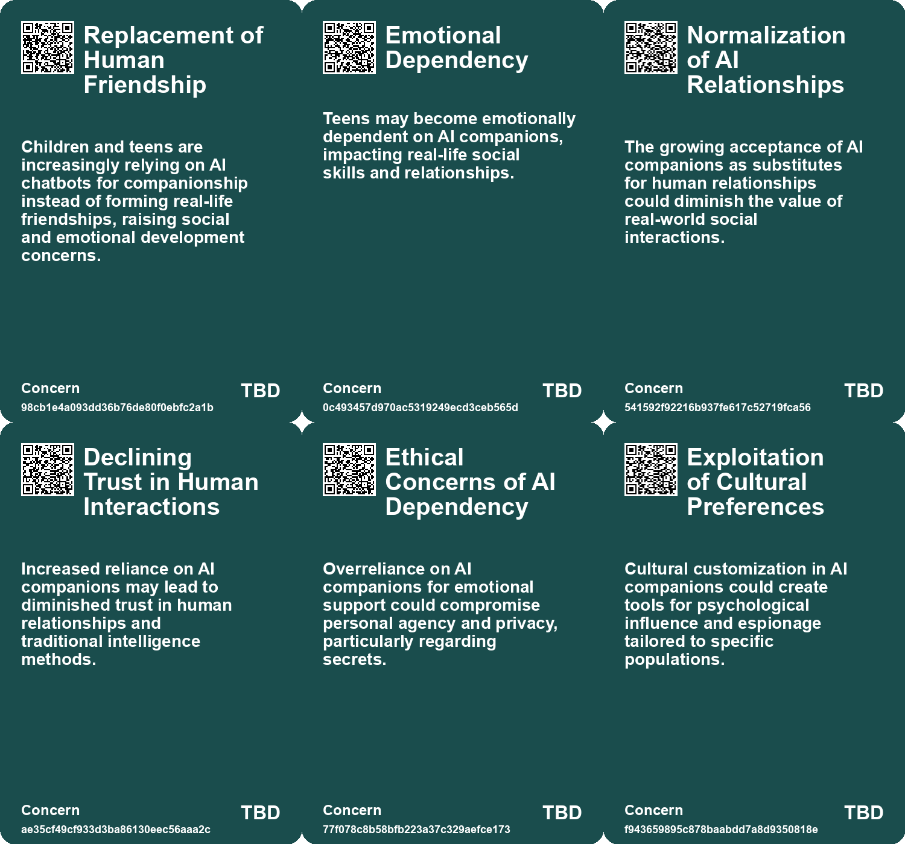
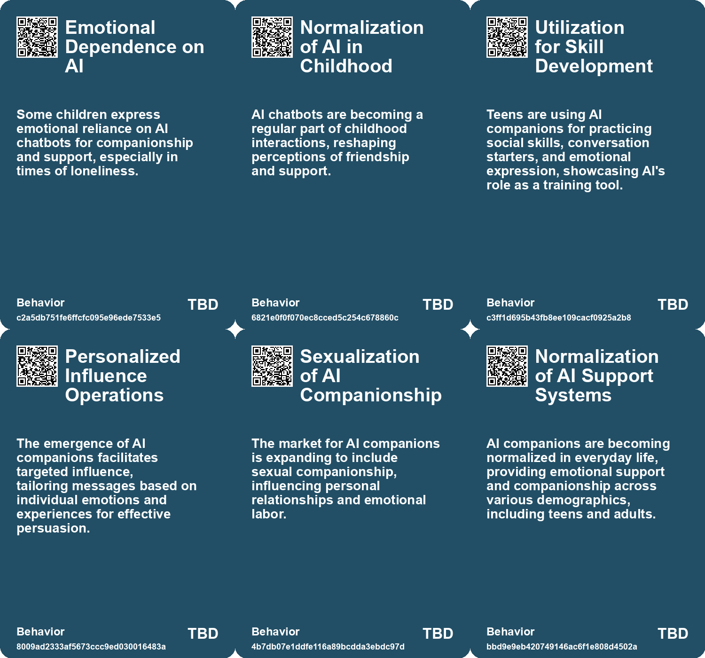
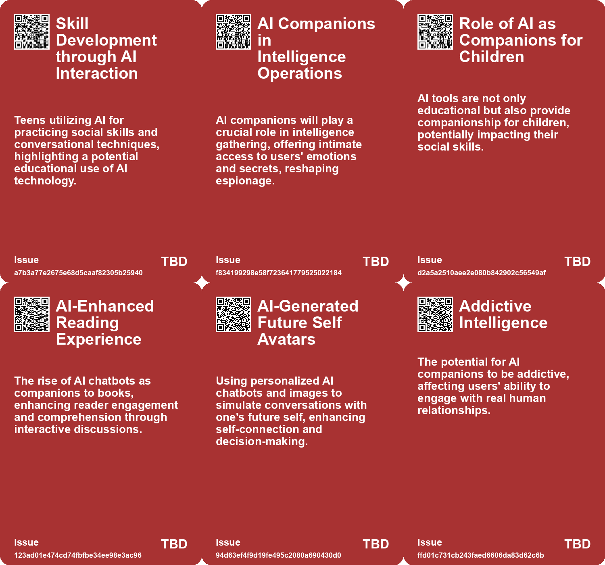
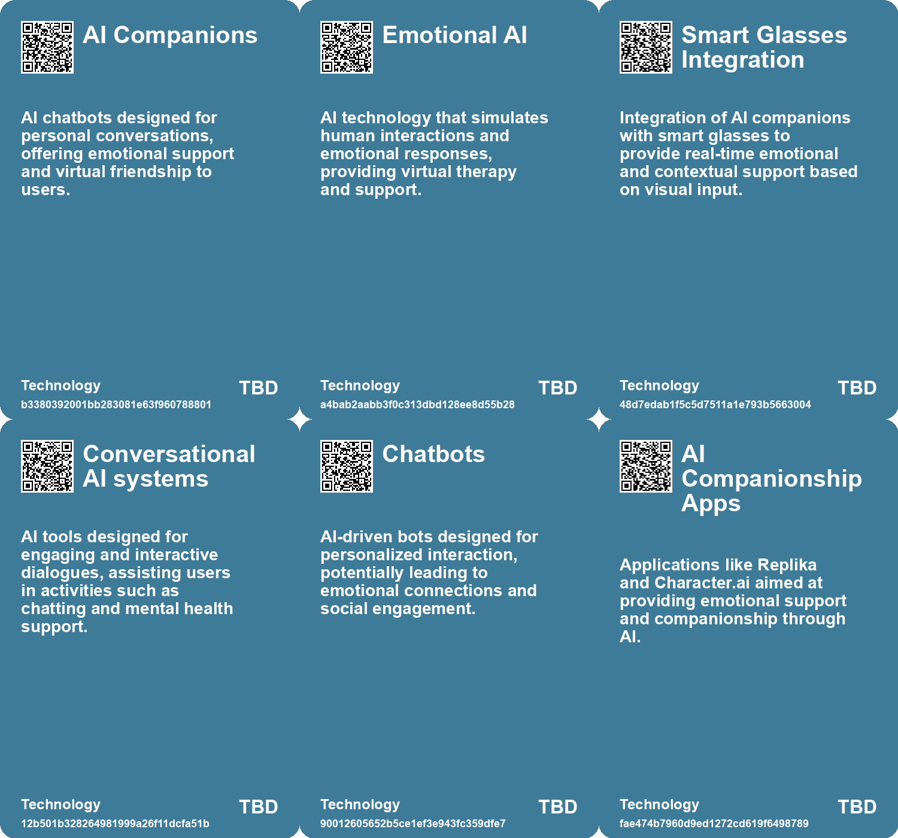

# *Topic*: Cognitive Automation & AI Companionship

# Summary

The rise of AI companionship is reshaping social interactions, particularly among younger generations. A significant number of U.S. teens are engaging with AI chatbots for personal conversations, with many reporting satisfaction in these interactions. However, concerns about the impact on mental well-being and the potential for addiction are growing. Studies indicate that while teens still prefer human connections, they often turn to AI for entertainment, advice, and emotional support, raising questions about the balance between technology and real-life relationships.

The ethical implications of AI in mental health are also under scrutiny. As individuals increasingly seek AI chatbots for emotional support, particularly in regions where mental health resources are limited, experts warn of the risks associated with relying on non-human entities for guidance. The lack of regulatory frameworks for AI therapy tools raises concerns about privacy and the potential for harmful reinforcement of negative thoughts.

AI's influence extends beyond companionship and mental health into the realms of education and productivity. The integration of AI tools in classrooms is seen as a double-edged sword. While they offer personalized learning opportunities, there are fears that reliance on AI could hinder critical thinking and social skills among students. In the workplace, AI assistants are being developed to enhance productivity, particularly for novice employees, but there are ongoing debates about the implications for job security and the effectiveness of these tools compared to human capabilities.

The cognitive effects of AI usage are becoming increasingly evident. Overreliance on AI for tasks such as writing and decision-making may lead to cognitive decline, as individuals risk losing essential skills through "cognitive offloading." This trend highlights the need for a balanced approach to technology use, encouraging individuals to engage in deeper learning rather than relying solely on AI for convenience.

As AI technology evolves, the potential for manipulation and privacy violations becomes a pressing concern. Personal AI assistants are set to become integral to daily life, acting as filters for information and shaping perceptions of reality. The implications of this shift raise questions about control and security, particularly as these systems gather sensitive personal data.

The geopolitical landscape is also affected by advancements in AI. Nations are racing to harness AI technology for both competitive advantage and security. The potential for AI companions to be used in espionage underscores the urgency for countries to develop protective measures against foreign infiltration while leveraging AI for their own strategic interests.

Finally, the design and development of AI technologies are being re-evaluated. New frameworks aim to ensure that AI systems are designed with human behavior in mind, promoting ethical interactions and preventing harmful outcomes. As the conversation around AI continues to evolve, the focus remains on finding a balance between innovation and the preservation of human values in an increasingly digital world.

# Seeds

|    | name                                 | description                                                                                                       | change                                                                                                   | 10-year                                                                                                         | driving-force                                                                                      |
|---:|:-------------------------------------|:------------------------------------------------------------------------------------------------------------------|:---------------------------------------------------------------------------------------------------------|:----------------------------------------------------------------------------------------------------------------|:---------------------------------------------------------------------------------------------------|
|  0 | AI Companions as Emotional Support   | The use of AI companions for emotional support is a growing trend among teens.                                    | A shift from seeking emotional support from peers to AI-driven solutions.                                | AI may become a normalized source of emotional support, altering traditional support mechanisms.                | Increased emotional needs among teens in a fast-paced, digitally connected world.                  |
|  1 | Sexuality in AI Companions           | Commercialization of AI companions that cater to sexual and emotional needs is rising.                            | Move towards acceptance and normalization of sexualized AI interactions in relationships.                | AI will play a role in personal and sexual relationships, influencing social norms.                             | The intersection of technology with human intimacy and societal needs for companionship.           |
|  2 | Perception of Chatbots as Friends    | Users are forming emotional connections with AI chatbots, viewing them as companions rather than just tools.      | Shift in user perception from chatbots as mere software to companions in emotional support.              | AI companions may gain a legitimate place in users' emotional support systems, reshaping relationships.         | The need for connection and support in a digitally-connected world fuels this perception.          |
|  3 | AI for Emotional Support in Children | AI tools like chatbots being used to provide emotional support and companionship to children.                     | Shifting from direct parental support to reliance on AI for emotional companionship.                     | Children may prefer interactions with AI over peers or adults, affecting their social development.              | The need for companionship in single-child families and busy parental schedules drives this trend. |
|  4 | Emotional AI Interactions            | There is a growing interest in creating emotionally intelligent AI capable of meaningful interactions with users. | From simple programmed responses to emotionally aware AI interactions that can influence human behavior. | AI could become a common companion in daily life, providing emotional support and promoting positive behaviors. | The human desire for connection and support in an increasingly digital world.                      |
|  5 | Rise of AI Personal Agents           | The development of AI-driven personal agents capable of understanding and assisting users.                        | Transitioning from simple bots to intelligent agents providing personalized assistance.                  | In ten years, personal agents will manage daily tasks, making personal assistants nearly obsolete.              | Advancements in AI technology enabling deep learning and natural language processing.              |
|  6 | Rise in AI Companionship             | Increasing reliance on AI chatbots for companionship and emotional support.                                       | Shifting from human interactions to AI-based companionship for addressing loneliness.                    | A society where AI is the primary source of companionship, diminishing human relationships.                     | Growing loneliness and desire for constant availability in social interactions.                    |
|  7 | Artificial Intimacy                  | AI chatbots providing a simulated version of empathy and companionship.                                           | Transitioning from authentic human relationships to artificial emotional support.                        | A landscape where genuine empathy is undervalued and AI interactions dominate.                                  | Convenience and perceived reliability of AI over human relationships.                              |
|  8 | AI-Assisted Team Coordination        | Development of AI assistants that enhance communication and coordination in teams.                                | Shift from traditional teamwork methods to AI-supported collaboration.                                   | AI will seamlessly integrate into teams, improving efficiency and reducing misunderstandings.                   | The increasing complexity of tasks requiring precise coordination among team members.              |
|  9 | Holistic AI Design                   | Integrating cognitive mimetics and digital twins for comprehensive AI development.                                | Moving from isolated AI systems to interconnected, user-focused designs.                                 | AI systems could evolve to fully understand and adapt to user needs in real-time.                               | The growing complexity of human tasks and the demand for AI adaptability.                          |

# Concerns

|    | name                                  | description                                                                                                                                                               |
|---:|:--------------------------------------|:--------------------------------------------------------------------------------------------------------------------------------------------------------------------------|
|  0 | Replacement of Human Friendship       | Children and teens are increasingly relying on AI chatbots for companionship instead of forming real-life friendships, raising social and emotional development concerns. |
|  1 | Emotional Dependency                  | Teens may become emotionally dependent on AI companions, impacting real-life social skills and relationships.                                                             |
|  2 | Normalization of AI Relationships     | The growing acceptance of AI companions as substitutes for human relationships could diminish the value of real-world social interactions.                                |
|  3 | Declining Trust in Human Interactions | Increased reliance on AI companions may lead to diminished trust in human relationships and traditional intelligence methods.                                             |
|  4 | Ethical Concerns of AI Dependency     | Overreliance on AI companions for emotional support could compromise personal agency and privacy, particularly regarding secrets.                                         |
|  5 | Exploitation of Cultural Preferences  | Cultural customization in AI companions could create tools for psychological influence and espionage tailored to specific populations.                                    |
|  6 | Mental Health and Human Interaction   | Concerns about the impact on human relationships and emotional connections when AI assists in personal matters, such as therapy.                                          |
|  7 | Atrophy of Human Relationships        | Excessive reliance on AI for companionship may weaken personal connections between people, affecting social skills and emotional intelligence.                            |
|  8 | Erosion of Empathy                    | Increasing reliance on AI for companionship may undermine genuine empathy and interpersonal connections.                                                                  |
|  9 | Social dynamics alteration            | AI and digital twins may change interpersonal relationships and social dynamics as technologies learn and replicate human behaviors.                                      |

# Cards

## Concerns

## Behaviors

## Issue

## Technology

# Links

* [AI Models Show Improved Performance in Theory of Mind Tests Compared to Humans](https://futures.kghosh.me/25cdc8c55ebb70b51b85134dc01e6efd)
* [The Cognitive Costs of AI: Are We Sacrificing Our Mental Abilities for Convenience?](https://futures.kghosh.me/09e7abde98ff0c5590320545c5b20679)
* [Rising Use of AI Chatbots Among Children Sparks Concerns Over Friendship and Mental Health Risks](https://futures.kghosh.me/7a05cd6af09dd8274d14be8e04717bac)
* [Anthropic Unveils Claude 3.5 Sonnet: A New AI Model for Desktop Automation](https://futures.kghosh.me/3e5862b8a6e5bf31b60fe4380bcd952a)
* [Thriving in an AI Era: Embracing, Adapting, and Complementing Technology](https://futures.kghosh.me/23a3410059759ba4214235628d4ebd4b)
* [Cognitive Mimetics and Human Digital Twins: Innovative Tools for AI Design](https://futures.kghosh.me/863bf5f38e20da4709e5cc0951a350c6)
* [The Rise of AI Chatbots in China's Mental Health Landscape: Opportunities and Risks](https://futures.kghosh.me/70e9fcd5fc1d2dd04ae1df8b2628194d)
* [Addressing the Risks of AI Companionship: Addiction, Regulation, and Human Dignity](https://futures.kghosh.me/4611565d14a05789e2efc6fafc563f58)
* [The Dangers of Relying on AI Chatbots for Companionship and Connection](https://futures.kghosh.me/729afaa8f8699c39b8d4b175d032fa41)
* [The Impact of AI in Chinese Education: Promise and Concerns](https://futures.kghosh.me/5374f9d1b84138f1c928c0e7fd727877)
* [YouAI's Book AI: Transforming Books into Conversational Chatbots for Enhanced Reader Engagement](https://futures.kghosh.me/52ee8c1b0291daa92b97c28225a816b6)
* [Exploring the Risks of Heavy Chatbot Use on Mental Health and Social Interactions](https://futures.kghosh.me/424dd84488f34cb7d735777fe34b584e)
* [The Role of Personal AI Assistants as Interfaces to Reality and Their Implications](https://futures.kghosh.me/f6a4f1f9e66f99bd101dee7d6a800855)
* [Exploring Emotional Connections with Future Selves Through AI Chatbots: Insights from MIT's Future You Project](https://futures.kghosh.me/65cf4789fa6df6abeb1b059b62894622)
* [The Future of AI Agents: Transforming Software Interaction and Society](https://futures.kghosh.me/f9ab247df033c3d903c94289a8687845)
* [Study Reveals Teens Use AI Companions but Prefer Real Human Interaction](https://futures.kghosh.me/43924b182fd09138a38642c6f8ecb9d8)
* [Microsoft's Copilot Tool: Empowering Custom AI Applications Amid Criticism](https://futures.kghosh.me/666bdebd6270309b77680ace8d0a727c)
* [Microsoft Launches Autonomous AI Agents to Boost Productivity and Improve Business Efficiency](https://futures.kghosh.me/ccb5695c1b392857d55b45a52b0b62e6)
* [Exploring AI's Effect on Cognitive Skills and Learning Processes](https://futures.kghosh.me/950253f15955ca7be1cb2ebf244d0939)
* [Revolutionizing Work: The Impact of Microsoft 365 Copilot on Productivity and Creativity](https://futures.kghosh.me/590d9ca642d30a1f2e4720f11b28474f)
* [The Future of Espionage: The Rise of AI Companions and Their Impact on Intelligence Operations](https://futures.kghosh.me/d69000a9cb92fc175a8a1dfb042622e2)
* [The Role of Social-Emotional AI: Bridging or Widening the Gap in Human Connection?](https://futures.kghosh.me/8e191b6221caa8d9f27b19268ab8a048)
* [AI-Fueled Delusions: The Disconnection Between Reality and Spiritual Fantasies](https://futures.kghosh.me/6515dbf29262169e3de5e2539171fd96)
* [Understanding Teen Engagement with AI Companions: Insights from a Common Sense Media Study](https://futures.kghosh.me/fae9ccaa96ac4f072579a8b1dee9fa4a)
* [The Privacy Risks of AI Therapy in a Surveillance State](https://futures.kghosh.me/2a493a65f2f08559abd0c9f29816530b)
* [MIT Researchers Develop AI Assistant to Enhance Teamwork in Critical Missions](https://futures.kghosh.me/d35cc2611e8b6e8e143446ca4ee22e19)