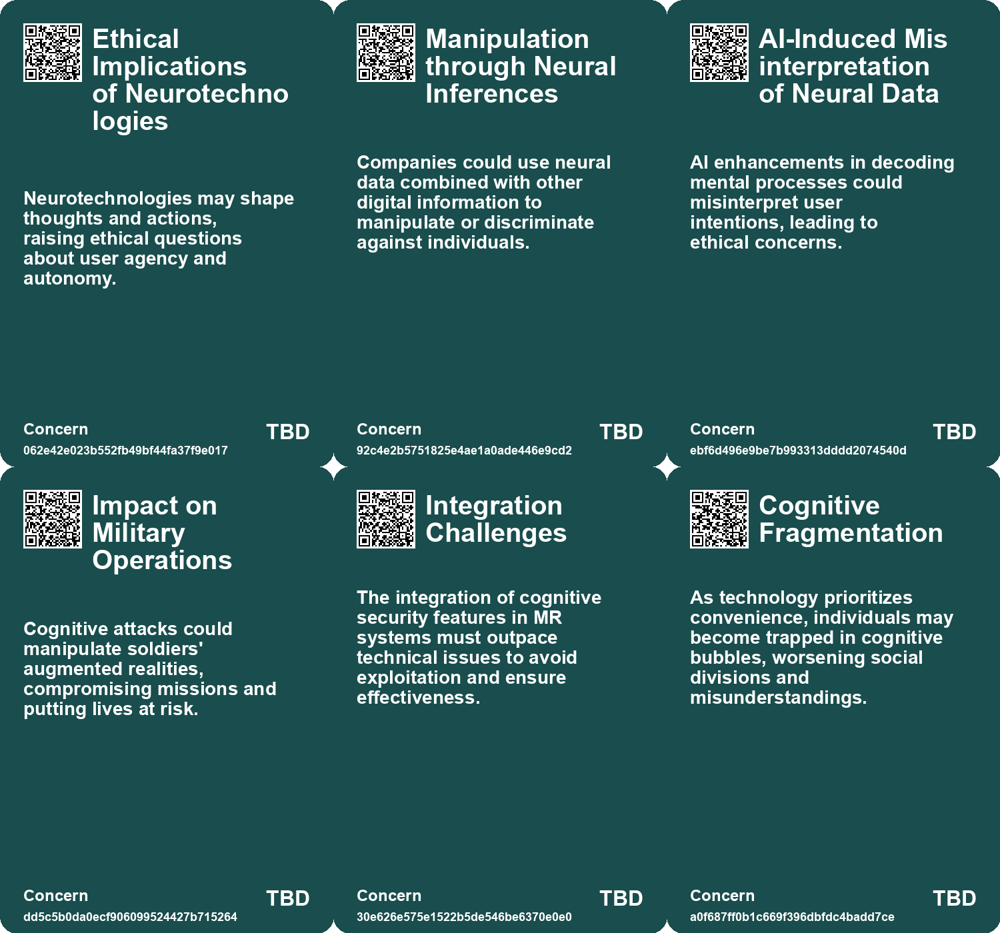
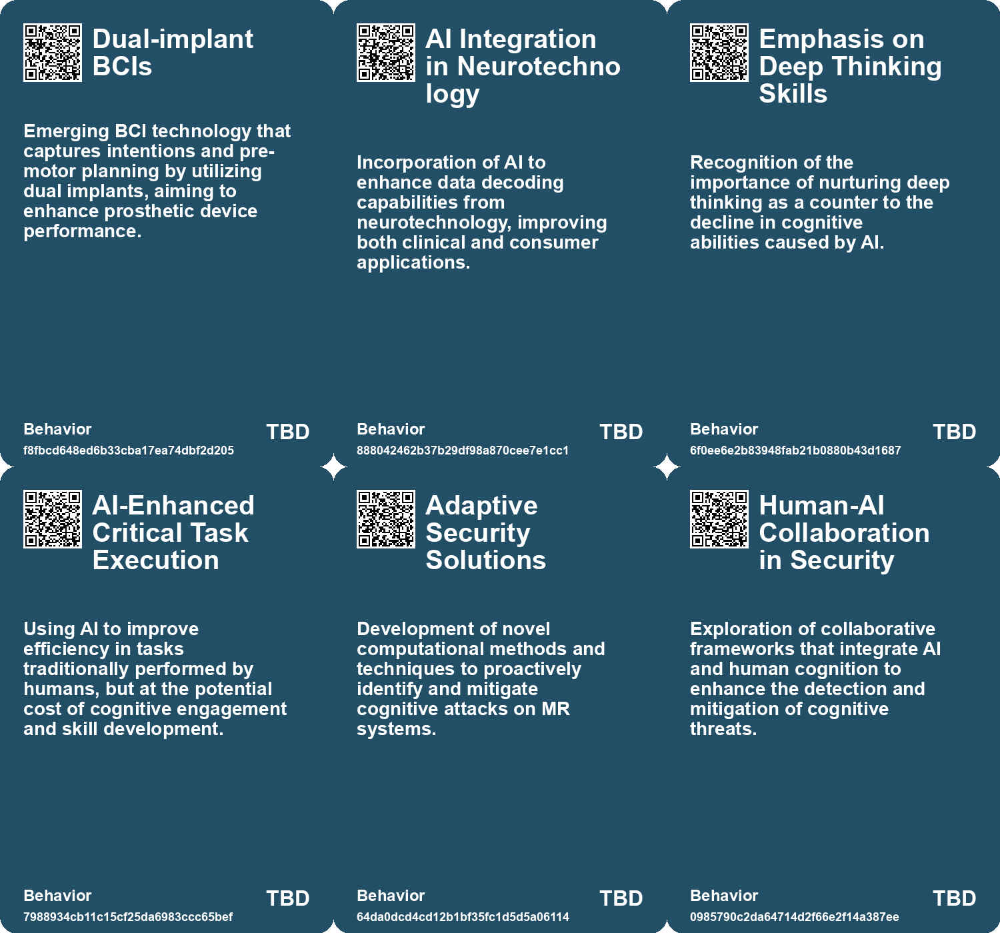
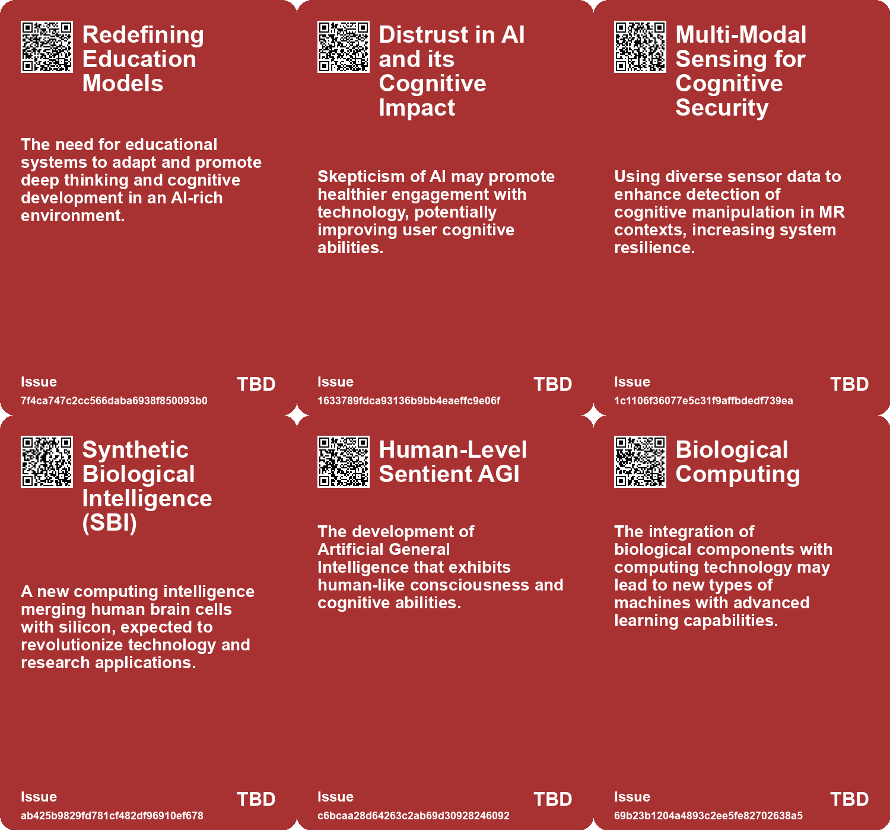
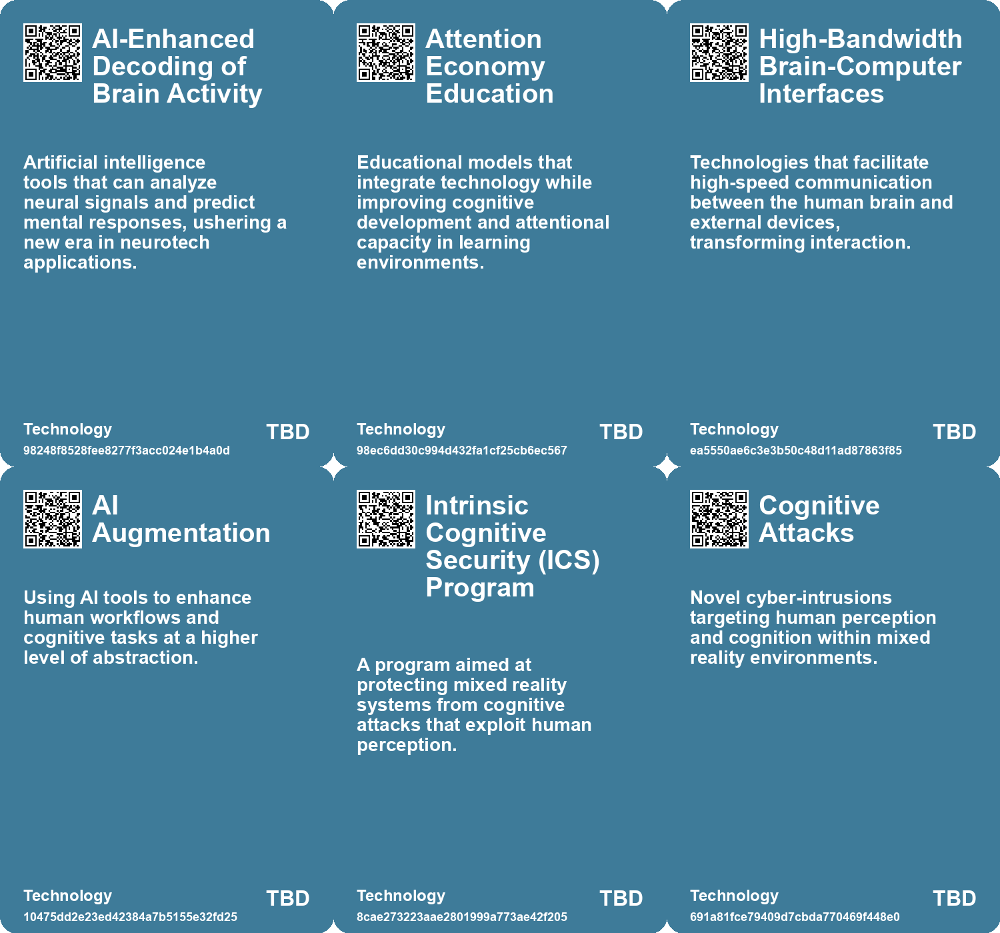

# *Topic*: Cognitive Enhancement Tech

# Summary

The increasing integration of artificial intelligence (AI) into various aspects of life raises significant concerns about cognitive skills and human interaction. Studies indicate that heavy reliance on AI tools can lead to cognitive atrophy, diminishing critical thinking and decision-making abilities. This trend is particularly alarming among younger users, who may outsource their cognitive tasks to AI, risking a decline in literacy and comprehension skills. The phenomenon of "cognitive offloading" highlights the trade-off between convenience and mental strength, suggesting that while AI can enhance efficiency, it may also weaken essential cognitive functions.

As AI technology evolves, the design of intelligent systems is becoming more sophisticated. New tools like cognitive mimetics and human digital twins aim to create AI that better mimics human behavior and thought processes. This holistic approach to AI design could revolutionize various industries, enhancing the capabilities of AI systems while ensuring they remain aligned with human needs.

The ethical implications of AI and related technologies are increasingly scrutinized. Breakthroughs in mind-reading technology, for instance, raise serious privacy concerns. As researchers develop systems that can interpret brain activity, the potential for misuse and surveillance becomes a pressing issue. Similarly, advancements in brain-computer interfaces (BCIs) promise to assist individuals with disabilities but also highlight the need for regulations to protect cognitive liberty and prevent data misuse.

The intersection of technology and human experience is also evident in the realm of sports and public services. The integration of science and technology in athletics emphasizes safety and performance enhancement, while affective computing seeks to improve citizen interactions with government services through empathetic technology. Both fields illustrate the potential for technology to enhance human experiences, provided ethical considerations are addressed.

The emergence of biological computing systems, such as those combining human brain cells with traditional AI, represents a new frontier in technology. These innovations could lead to more energy-efficient and dynamic computing solutions, paving the way for advancements in machine learning and artificial intelligence. However, the implications of such technologies on human cognition and societal structures remain to be fully understood.

As the digital landscape continues to evolve, the architecture of online environments poses risks to human autonomy and critical thinking. Strategies to boost cognitive competences and improve digital environments are essential to counteract the negative effects of disinformation and incivility online. Promoting digital literacy and critical thinking skills is crucial for fostering a more informed and engaged society.

The future of wearable technology also presents opportunities and challenges. As devices become more integrated into daily life, the potential for augmented reality and enhanced social interactions grows. However, the need for seamless integration and user acceptance remains a significant hurdle.

In summary, the rapid advancement of AI and related technologies presents both opportunities and challenges. The need for ethical considerations, cognitive engagement, and responsible design is paramount as society navigates this evolving landscape.

# Seeds

|    | name                                           | description                                                                                               | change                                                                                                | 10-year                                                                                                                   | driving-force                                                                                                  |
|---:|:-----------------------------------------------|:----------------------------------------------------------------------------------------------------------|:------------------------------------------------------------------------------------------------------|:--------------------------------------------------------------------------------------------------------------------------|:---------------------------------------------------------------------------------------------------------------|
|  0 | Cognitive Security in Mixed Reality            | Emerging need for safeguarding MR systems against cognitive attacks targeting human perception.           | Shift from traditional cybersecurity to a focus on human cognitive manipulation in MR environments.   | Cognitive security will be integral in MR systems across military, medical, and educational fields, enhancing user trust. | Growing reliance on MR technology in critical sectors raises concerns over user manipulation and security.     |
|  1 | Cognitive Attack Detection Techniques          | Development of techniques to identify and mitigate cognitive attacks in real time during MR interactions. | Evolving from traditional security measures to dynamic, real-time cognitive protection methodologies. | Real-time cognitive attack detection will be commonplace, ensuring uninterrupted MR user experiences.                     | The urgency to protect users from manipulative attacks drives advancements in detection technologies.          |
|  2 | Digital Competence Boosting                    | Empowering users to navigate online environments effectively through cognitive tools.                     | Transitioning from passive consumption to active engagement and critical analysis of online content.  | In 10 years, citizens will be adept at critically evaluating online information and resisting manipulation.               | Growing recognition of the risks associated with misinformation and the need for informed digital citizenship. |
|  3 | Enhanced Games                                 | A new sporting event focusing on human enhancement through technology and science.                        | Shift from traditional sports to competitions based on enhanced human performance.                    | Sports will feature more technologically enhanced athletes, changing competition dynamics and fan engagement.             | The pursuit of excellence in sports drives the integration of technology and science.                          |
|  4 | Biological-AI Synergy                          | Combining biological systems with AI for enhanced machine intelligence.                                   | Emergence of hybrid systems that leverage biological and artificial intelligence.                     | Hybrid systems could revolutionize industries such as robotics and healthcare.                                            | The need for machines that can learn and adapt like biological entities.                                       |
|  5 | Advances in Mind Reading Technologies          | Researchers are using AI and brain imaging to read thoughts more accurately than ever before.             | Shift from traditional imaging methods to advanced AI-driven mind reading technologies.               | Mind reading technologies could become common tools in healthcare and personal assistance.                                | The need for improved mental health solutions and enhanced human-computer interaction drives this change.      |
|  6 | Photonic Integrated Circuits (PIC) Advancement | Advancements in PIC technology may redefine AI capabilities and applications.                             | From traditional electronic chip limitations to advanced capabilities of photonic circuits.           | AI applications may expand significantly with advanced PICs enabling new functionalities.                                 | The pursuit of enhanced performance and efficiency in AI technology.                                           |
|  7 | Cyborg Computer Development                    | Development of biohybrid computers combining AI with human brain cells.                                   | Transition from traditional computing to biohybrid systems that incorporate human biology.            | In 10 years, we may see advanced biocomputers outperforming traditional systems in specific tasks.                        | The pursuit of energy-efficient computing solutions drives interest in biological integration.                 |
|  8 | Cognitive Mimetics in AI Design                | Analyzing human information processing for mimicking in intelligent technologies.                         | Shifting from traditional AI design to a more human-centric approach.                                 | AI design could become more intuitive and aligned with human cognitive processes.                                         | The need for AI to effectively support human tasks and enhance usability.                                      |
|  9 | Holistic AI Design                             | Integrating cognitive mimetics and digital twins for comprehensive AI development.                        | Moving from isolated AI systems to interconnected, user-focused designs.                              | AI systems could evolve to fully understand and adapt to user needs in real-time.                                         | The growing complexity of human tasks and the demand for AI adaptability.                                      |

# Concerns

|    | name                                        | description                                                                                                                                   |
|---:|:--------------------------------------------|:----------------------------------------------------------------------------------------------------------------------------------------------|
|  0 | Ethical Implications of Neurotechnologies   | Neurotechnologies may shape thoughts and actions, raising ethical questions about user agency and autonomy.                                   |
|  1 | Manipulation through Neural Inferences      | Companies could use neural data combined with other digital information to manipulate or discriminate against individuals.                    |
|  2 | AI-Induced Misinterpretation of Neural Data | AI enhancements in decoding mental processes could misinterpret user intentions, leading to ethical concerns.                                 |
|  3 | Impact on Military Operations               | Cognitive attacks could manipulate soldiers' augmented realities, compromising missions and putting lives at risk.                            |
|  4 | Integration Challenges                      | The integration of cognitive security features in MR systems must outpace technical issues to avoid exploitation and ensure effectiveness.    |
|  5 | Cognitive Fragmentation                     | As technology prioritizes convenience, individuals may become trapped in cognitive bubbles, worsening social divisions and misunderstandings. |
|  6 | Crisis of Identity in Human Intelligence    | As AI takes over cognitive tasks, humanity may struggle with understanding what it means to be truly intelligent or conscious.                |
|  7 | Dependency on AI                            | The increasing reliance on AI could weaken human cognitive abilities, making minds lazy and less engaged with reality.                        |
|  8 | Psychological Manipulation                  | New technologies could be misused to influence or manipulate thoughts and behaviors for commercial gain.                                      |
|  9 | Impact on workforce                         | The adoption of cognitive mimetics and digital twins may lead to job displacement and require workers to adapt rapidly to new technologies.   |

# Cards

## Concerns

## Behaviors

## Issue

## Technology

# Links

* [Monash University Develops DishBrain: A Semi-Biological Chip with Learning Capabilities](https://futures.kghosh.me/fcf584bddde6a0c4ccaf5ab8eadded1e)
* [Recent Developments in AI Regulation and Technology: A Review of Key Initiatives and Critiques](https://futures.kghosh.me/a009ccdffaa59f53de56887aa19e6239)
* [The Future of Wearable Technology: Merging Cyborg Lifestyles with Daily Life](https://futures.kghosh.me/a81c4775b91ccd0db3e1b84da893ac6f)
* [Exploring AI's Impact on Human Thought: A Philosophical Perspective on Consciousness and Intelligence](https://futures.kghosh.me/c3c283d8439f2098f793ed0727d3e563)
* [The Cognitive Costs of AI: Are We Sacrificing Our Mental Abilities for Convenience?](https://futures.kghosh.me/09e7abde98ff0c5590320545c5b20679)
* [The Dangers of AI Reliance: Cognitive Atrophy and Critical Thinking Decline in Knowledge Workers](https://futures.kghosh.me/682e04f0b543e67738d8ffbb84fc50dd)
* [Exploring the Transformative Impact of AI on Education and Children's Learning Experiences](https://futures.kghosh.me/adf886a1b9fd74281e0a43c3e7c70def)
* [Advancements in Mind-Reading Technology Raise Ethical Concerns About Privacy and Free Thought](https://futures.kghosh.me/95a515aafcc880230a55f57c5d902d3f)
* [Enhanced Games: Merging Science and Safety in Athletic Competitions](https://futures.kghosh.me/9786ba9f5842c13525de5cff9ee70d53)
* [The Impact of the Internet and AI on Human Cognition and Productivity](https://futures.kghosh.me/652fc7ec1f422e931bc5a9ba8011650a)
* [A Comprehensive Taxonomy for Artificial General Intelligence Development Over 25 Years](https://futures.kghosh.me/848ae6771411e76eb554d6d4d2c8f07f)
* [The Diminishing Role of Human Interaction in Modern Technology and Its Societal Implications](https://futures.kghosh.me/31491f2b50e77cc7c45e541a9b2915d7)
* [Enhancing Digital Competences: Strategies for Navigating Online Challenges](https://futures.kghosh.me/0770afeb444e4bbb336cdc72c07d6688)
* [Exploring AI's Effect on Cognitive Skills and Learning Processes](https://futures.kghosh.me/950253f15955ca7be1cb2ebf244d0939)
* [Breakthrough in Biocomputing: Brainoware Combines AI with Human Brain Cells for Speech Recognition](https://futures.kghosh.me/fe93f7419799d1706b4e7ce0a6adcb40)
* [Harnessing Affective Computing for Empathetic Government Services: Opportunities and Ethical Considerations](https://futures.kghosh.me/53860cc08efad09239e718349307f246)
* [The Future of Brain-Computer Interfaces: Promise and Ethical Concerns](https://futures.kghosh.me/c6702f63f03fb731d83c81e00768b28d)
* [DARPA’s Intrinsic Cognitive Security Program: Safeguarding Mixed Reality from Cognitive Attacks](https://futures.kghosh.me/1ef9afc963271d8ef3bd9684b0e3d629)
* [The Decline of Human Thinking in the Age of AI: A Call for Educational Reform](https://futures.kghosh.me/1909e5d11ae6f5dc49eb87e739bb1885)
* [Tsinghua University's Taichi: A Revolutionary Light-Based AI Chip for Future Computing](https://futures.kghosh.me/1aec7cb8723d807f5486e963a0eb6337)
* [CIO Advocates for Digital Twins and AI to Enhance Tech Workforce Efficiency at UC San Diego](https://futures.kghosh.me/9decd18c96b2e397a3ca5c1ecd5f8176)
* [Advancements in Brain-Computer Interfaces: Exploring Non-Invasive Ultrasound Technology](https://futures.kghosh.me/32310a2097cecfb2b52a21a7c16fa9e8)
* [Cognitive Mimetics and Human Digital Twins: Innovative Tools for AI Design](https://futures.kghosh.me/863bf5f38e20da4709e5cc0951a350c6)
* [Navigating AI's Impact on Education: A Call for a New Learning Model](https://futures.kghosh.me/28bb84905643c6dc551653659cfbb8d9)
* [Exploring the Future of Superintelligence and Its Impact on Humanity](https://futures.kghosh.me/8a7f0b887d1b9b17fc4f72a0815ec849)
* [Cortical Labs Launches World's First Biological Computer: The CL1](https://futures.kghosh.me/c3e6ac3d2c8dcccbff885b74128c5536)