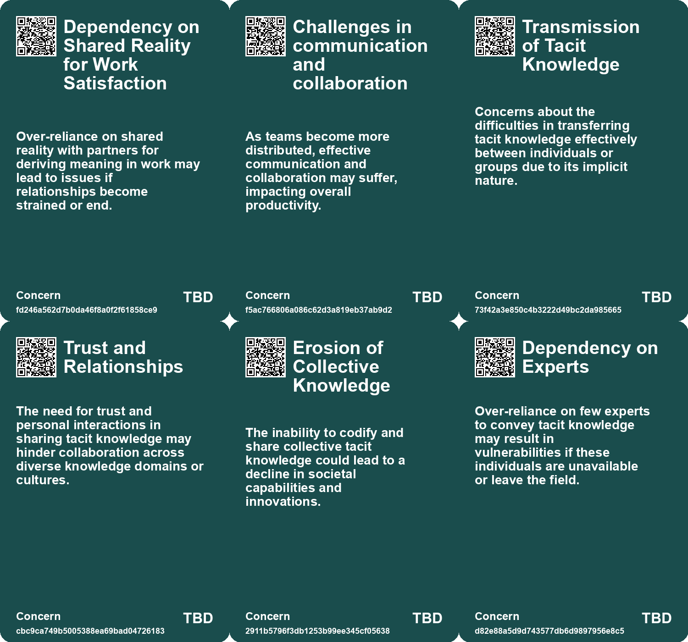
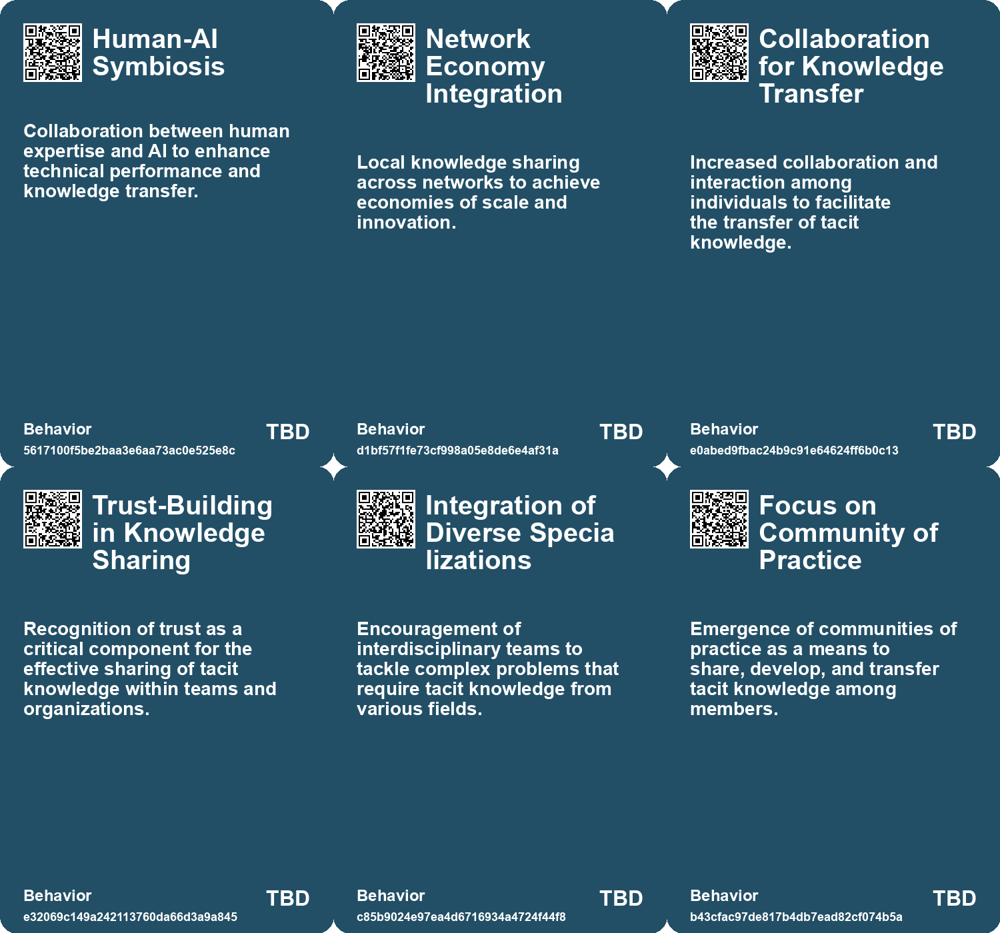
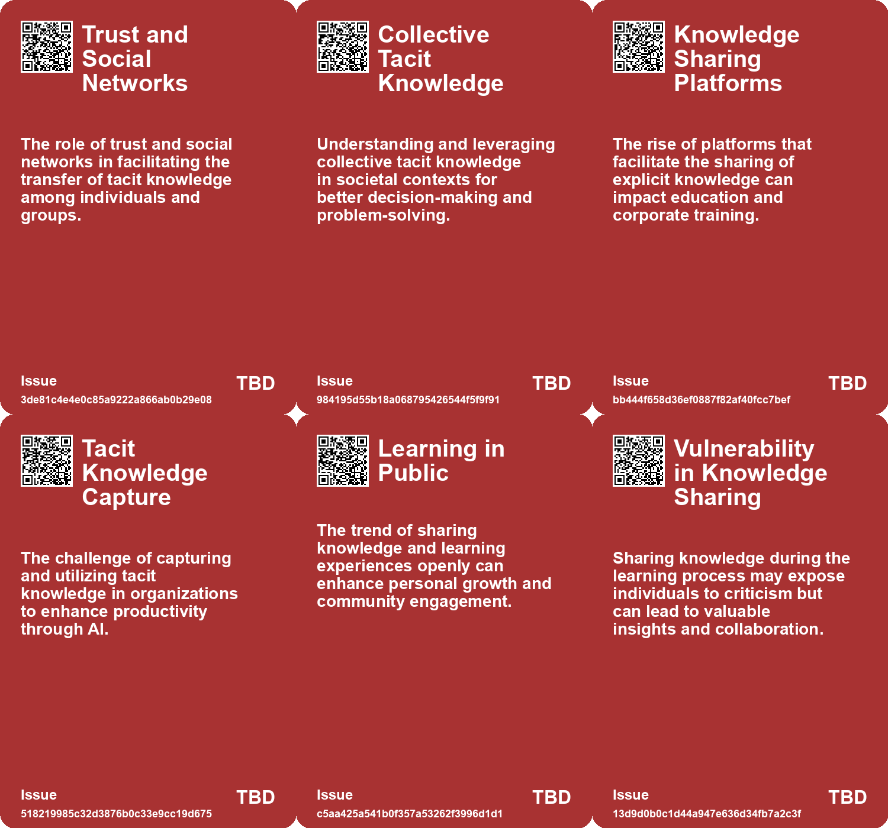
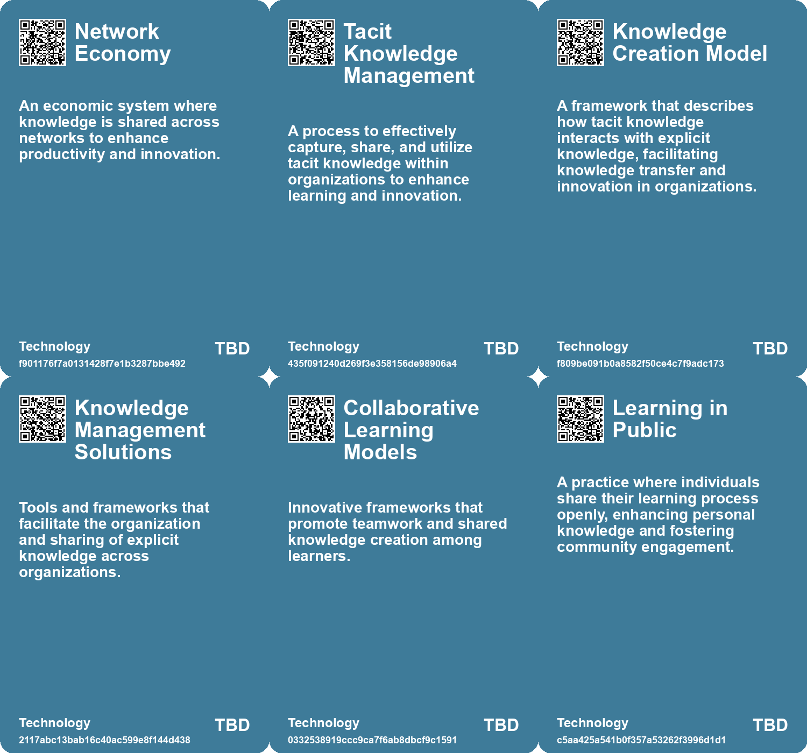

# *Topic*: Collaborative Knowledge Sharing

# Summary

The evolving landscape of knowledge management highlights the critical distinction between tacit and explicit knowledge. Tacit knowledge, often residing in the intuition and experience of employees, poses challenges for documentation and transfer. Michael Polanyi's concept of tacit knowledge underscores its significance in organizational learning and expertise development. In contrast, explicit knowledge is easily codified and shared, playing a vital role in knowledge management through resources like manuals and textbooks. The integration of artificial intelligence (AI) offers new avenues for capturing tacit knowledge, enhancing productivity and employee training across various sectors.

The knowledge economy emphasizes the importance of intellectual capital and skilled labor. This economic model prioritizes knowledge-intensive activities over physical resources, driven by globalization and technological advancements. As organizations navigate this landscape, they must invest in education, research, and innovation to foster a knowledge-based society. The rise of AI further complicates this dynamic, as it can both enhance productivity and challenge traditional roles within the workforce.

Information overload is a pressing concern in today's data-rich environment. Both humans and AI systems, such as large language models (LLMs), struggle to make effective decisions amidst vast amounts of information. Curated knowledge bases and structured approaches to information management are essential for reducing this overload. By integrating AI with retrieval-augmented generation techniques, organizations can improve the relevance and accuracy of insights while addressing privacy and governance issues.

The impact of AI on creativity and artistic professions is a double-edged sword. While generative AI offers new tools for artists, it also raises concerns about job security and the exploitation of creative work. The need for a new framework that protects artists' rights and ensures consent in the use of their work is becoming increasingly urgent. As AI continues to evolve, the creative community must adapt to these changes while advocating for their interests.

The role of collaboration and shared experiences in enhancing workplace meaning is gaining recognition. Research indicates that discussing work with romantic partners can deepen the sense of purpose individuals derive from their jobs. This shared reality fosters connection and understanding, particularly in high-stress environments like healthcare. Open communication and joint activities are essential for cultivating these relationships, ultimately leading to improved work satisfaction.

In the realm of education and learning, there is a growing call for slow and mindful approaches. Continuous reskilling and upskilling are necessary to keep pace with rapid technological advancements. The Slow Food movement serves as an inspiration for fostering a more thoughtful learning environment. Emphasizing questions and self-reflection over quick evaluations can lead to more sustainable and meaningful educational experiences.

The integration of AI in various sectors, including higher education, is transforming operational strategies. Institutions are exploring the use of digital twins and AI agents to enhance productivity and security. By automating routine tasks and capturing knowledge for AI applications, organizations can address challenges while improving efficiency. This shift underscores the importance of adapting to technological changes and reimagining traditional roles in the workforce.

Finally, the potential of knowledge graphs to enhance LLMs is becoming increasingly apparent. While LLMs excel at processing unstructured data, knowledge graphs provide a structured framework for querying information. This synergy can lead to more accurate and contextually relevant responses, bridging the gap between human-like understanding and structured data. As organizations leverage these technologies, the future of knowledge management and AI integration looks promising.

# Seeds

|    | name                                              | description                                                                               | change                                                                                        | 10-year                                                                                            | driving-force                                                                                     |
|---:|:--------------------------------------------------|:------------------------------------------------------------------------------------------|:----------------------------------------------------------------------------------------------|:---------------------------------------------------------------------------------------------------|:--------------------------------------------------------------------------------------------------|
|  0 | Dynamic Knowledge Bases                           | Google's research notebooks allowing for curated, interactive collections of knowledge.   | From static articles to dynamic, evolving knowledge repositories.                             | Knowledge bases may continually update with new research and data automatically.                   | The necessity for up-to-date information to keep pace with rapid innovation.                      |
|  1 | Rising Importance of Tacit Knowledge              | Recognition of tacit knowledge's value is growing in various fields.                      | Shift from valuing only explicit knowledge to acknowledging tacit knowledge's significance.   | In 10 years, tacit knowledge may be integrated into formal education and training systems.         | The need for holistic understanding in complex problem-solving and innovation drives this change. |
|  2 | Integration of Diverse Expertise                  | Collaborative environments are fostering tacit knowledge sharing among diverse teams.     | From isolated expertise to integrated, multi-disciplinary collaboration.                      | Workplaces may evolve into hubs for interdisciplinary collaboration, enhancing innovation.         | The complexity of modern challenges necessitates diverse perspectives and collaboration.          |
|  3 | Development of Knowledge Management Practices     | Organizations are increasingly adopting practices to capture and share tacit knowledge.   | Shift from mere documentation of knowledge to active management of tacit knowledge.           | Over the next decade, organizations may develop sophisticated systems for tacit knowledge sharing. | The pursuit of competitive advantage through knowledge-driven strategies drives this change.      |
|  4 | Growing Recognition of Collective Tacit Knowledge | There is a rising awareness of collective tacit knowledge in organizations and societies. | From individual tacit knowledge to valuing collective knowledge within teams and communities. | In 10 years, collective tacit knowledge may be recognized as a key organizational asset.           | The need for cohesive team performance and organizational learning drives this trend.             |
|  5 | Integration of Explicit and Tacit Knowledge       | Growing emphasis on blending explicit knowledge with tacit knowledge for better outcomes. | Transition from isolated explicit knowledge to integrated knowledge systems.                  | Ten years from now, organizations may leverage integrated knowledge systems to enhance innovation. | The pursuit of more holistic approaches to knowledge management motivates this integration.       |
|  6 | Evolution of Knowledge Sharing Practices          | New methods and tools emerging for sharing explicit knowledge across diverse platforms.   | Change from traditional knowledge sharing to more dynamic, tech-driven interactions.          | In a decade, knowledge sharing could be seamless and instantaneous across global networks.         | The rapid evolution of communication technologies is a key driver of this change.                 |
|  7 | Collaboration in Learning                         | Emerging collaborative efforts to redefine learning paradigms.                            | Moving from isolated learning experiences to community-driven, collaborative learning.        | Learning may become a more social, community-oriented process, enhancing engagement.               | The need for collective problem-solving in a rapidly changing world.                              |
|  8 | Public Learning Trend                             | An increasing number of individuals are sharing their learning experiences publicly.      | Shift from private learning to open, collaborative knowledge sharing.                         | Public learning could become the norm, fostering a culture of continuous knowledge sharing.        | The desire for community engagement and mentorship in learning processes.                         |
|  9 | Open Source Knowledge                             | There is a growing emphasis on documenting and sharing knowledge in open formats.         | From closed, proprietary knowledge to open, accessible knowledge sharing.                     | Knowledge could be more democratized, leading to greater collaboration across industries.          | Technological advancements enabling easier sharing and collaboration across platforms.            |

# Concerns

|    | name                                               | description                                                                                                                                      |
|---:|:---------------------------------------------------|:-------------------------------------------------------------------------------------------------------------------------------------------------|
|  0 | Dependency on Shared Reality for Work Satisfaction | Over-reliance on shared reality with partners for deriving meaning in work may lead to issues if relationships become strained or end.           |
|  1 | Challenges in communication and collaboration      | As teams become more distributed, effective communication and collaboration may suffer, impacting overall productivity.                          |
|  2 | Transmission of Tacit Knowledge                    | Concerns about the difficulties in transferring tacit knowledge effectively between individuals or groups due to its implicit nature.            |
|  3 | Trust and Relationships                            | The need for trust and personal interactions in sharing tacit knowledge may hinder collaboration across diverse knowledge domains or cultures.   |
|  4 | Erosion of Collective Knowledge                    | The inability to codify and share collective tacit knowledge could lead to a decline in societal capabilities and innovations.                   |
|  5 | Dependency on Experts                              | Over-reliance on few experts to convey tacit knowledge may result in vulnerabilities if these individuals are unavailable or leave the field.    |
|  6 | Scalability of Knowledge Graph Construction        | Constructing and maintaining knowledge graphs for vast amounts of data can be resource-intensive and complex.                                    |
|  7 | Dependence on Curation                             | Over-reliance on curated knowledge bases may hinder adaptability and the exploration of diverse information sources.                             |
|  8 | Overexposure of Personal Knowledge                 | Sharing knowledge publicly can lead to potential backlash if outdated or incorrect information is presented, risking reputation and credibility. |
|  9 | Quality Control of Shared Knowledge                | Publicly shared information can sometimes be inaccurate, leading to misinformation spread among inexperienced learners.                          |

# Cards

## Concerns

## Behaviors

## Issue

## Technology

# Links

* [Navigating Information Overload: The Role of Knowledge Management and AI in Decision-Making](https://futures.kghosh.me/3e292858cf09bb02c3e254ede24744f6)
* [Exploring the Future of Knowledge in the Age of AI: From Peer Review to NotebookLM](https://futures.kghosh.me/2c3e163f113838429299866828dad17c)
* [Creating a Minimum Viable Community of Practice Through Co-Design Workshops](https://futures.kghosh.me/62917f945a037530e2691fe05a2600ea)
* [Enhancing Large Language Models with Knowledge Graphs for Structured Data Processing](https://futures.kghosh.me/69aa55d97023850224f4426e6782bb8b)
* [Reimagining Learning: Embracing Slow Learning in an Accelerated World](https://futures.kghosh.me/042cf62855760b54fa5a194db9e6cf11)
* [Essential Skills for Thriving in a Changing Work Landscape: Embrace the Future](https://futures.kghosh.me/d7ef2be80aa075fa18028d91bf7c1aaa)
* [The Impact of Generative AI on Creative Professions and the Need for New Data Rights Frameworks](https://futures.kghosh.me/858dac884c8fe7dfa6fc0c2cf093e97f)
* [Understanding the Knowledge Economy: Key Features and Evolution](https://futures.kghosh.me/07c5954a7c375f3ea3cf9e8724c93de7)
* [Embracing Public Learning: Transform Your Knowledge into Community Engagement](https://futures.kghosh.me/037aba804501ec9f75f8bb434b8a6c20)
* [Unlocking the Potential of Local Data in UK Government Devolution for Enhanced Services](https://futures.kghosh.me/715753b68e3f5ba36be643d1ded0de93)
* [The Impact of the Internet and AI on Human Cognition and Productivity](https://futures.kghosh.me/652fc7ec1f422e931bc5a9ba8011650a)
* [The Importance of Shared Reality with Partners in Enhancing Work Meaning](https://futures.kghosh.me/df4b0eb3222fcdbb37fc1236b613fd80)
* [Integrating Knowledge Graphs with LLMs for Enhanced Multi-Hop Question Answering](https://futures.kghosh.me/0184d23e59d3dc6772ba06c6634f033b)
* [CIO Advocates for Digital Twins and AI to Enhance Tech Workforce Efficiency at UC San Diego](https://futures.kghosh.me/9decd18c96b2e397a3ca5c1ecd5f8176)
* [Harnessing Tacit Knowledge with AI: Transforming Business Practices for Future Success](https://futures.kghosh.me/a2420f58a4f79ef59765018edc0aead0)
* [Understanding Tacit Knowledge: Its Definition, Importance, and Examples](https://futures.kghosh.me/60de5b2053bef8ecb80be44d21b1cea4)
* [Examining the Effects of AI on Knowledge Worker Performance: A Study with Boston Consulting Group](https://futures.kghosh.me/c63bd059cb529b72b00ecbdcd2f85268)
* [The Power of Co-Imagination: Building Closer Connections Through Shared Future Experiences](https://futures.kghosh.me/88c8d5d92bc16f2295e3bcdf3e62d47f)
* [Exploring AI's Role in Enhancing Knowledge Worker Productivity in the 21st Century](https://futures.kghosh.me/c407a926fe431205488024f43c47a801)
* [Understanding Explicit Knowledge: Definition, Examples, and Importance](https://futures.kghosh.me/fcaebc86f2f475af184eaa545a624a2c)
* [Exploring the Future of AI in Knowledge Ecosystems and Global Challenges](https://futures.kghosh.me/a9266018b458295480a07167310458a9)
* [MIT Researchers Develop AI Assistant to Enhance Teamwork in Critical Missions](https://futures.kghosh.me/d35cc2611e8b6e8e143446ca4ee22e19)