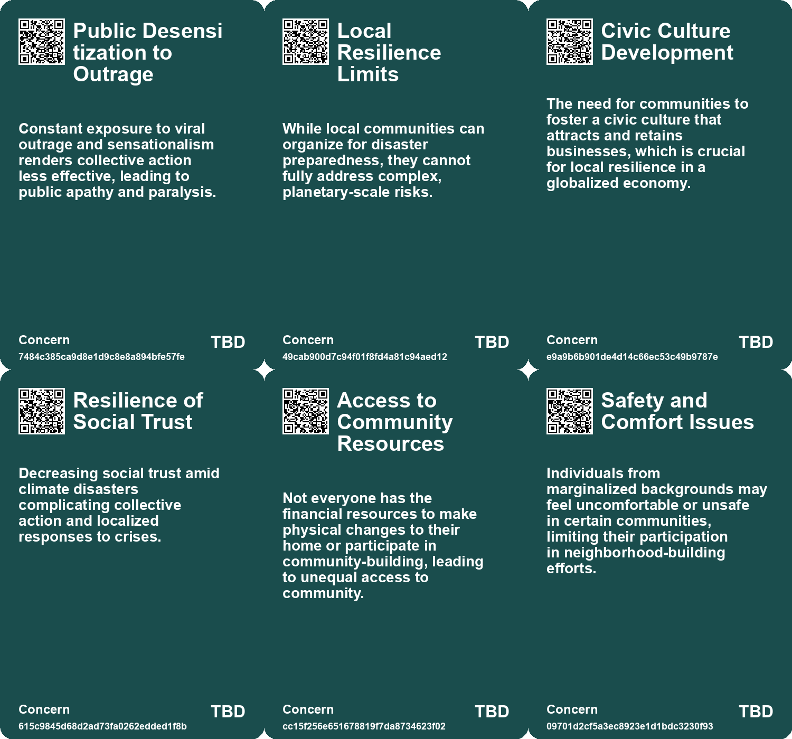
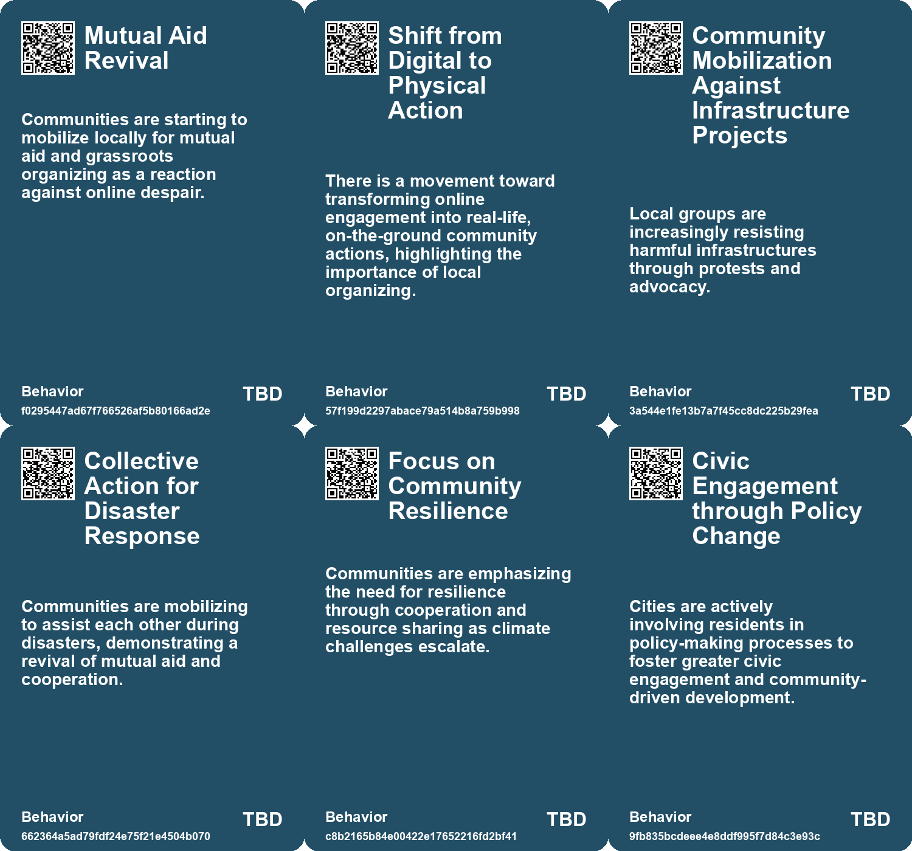
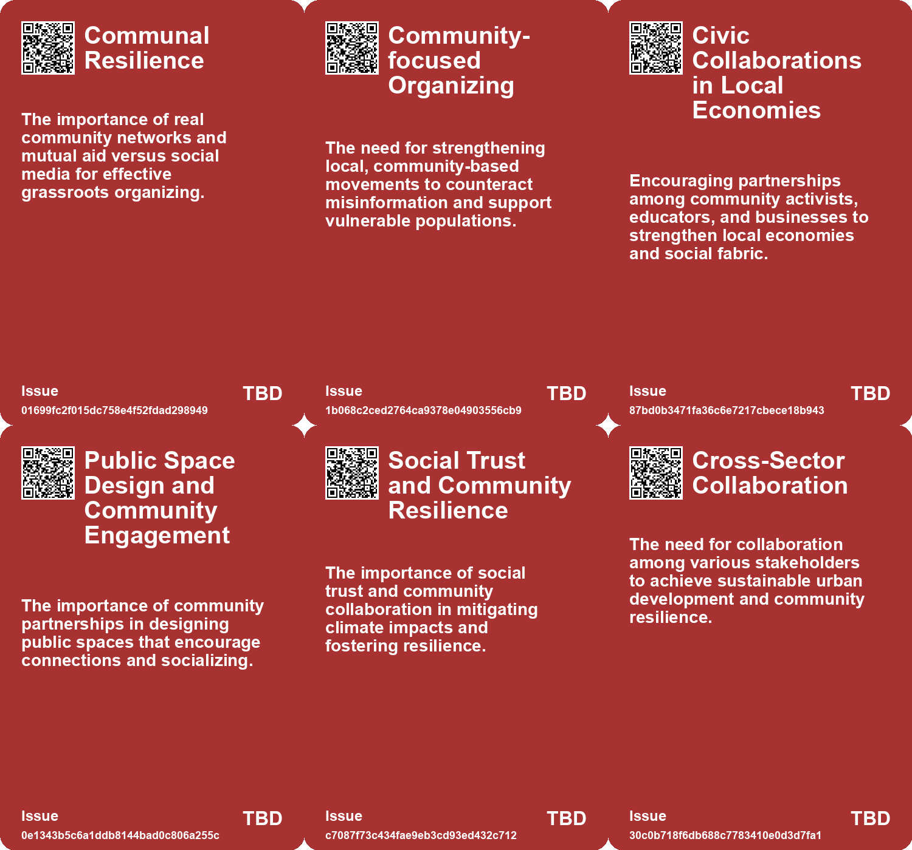
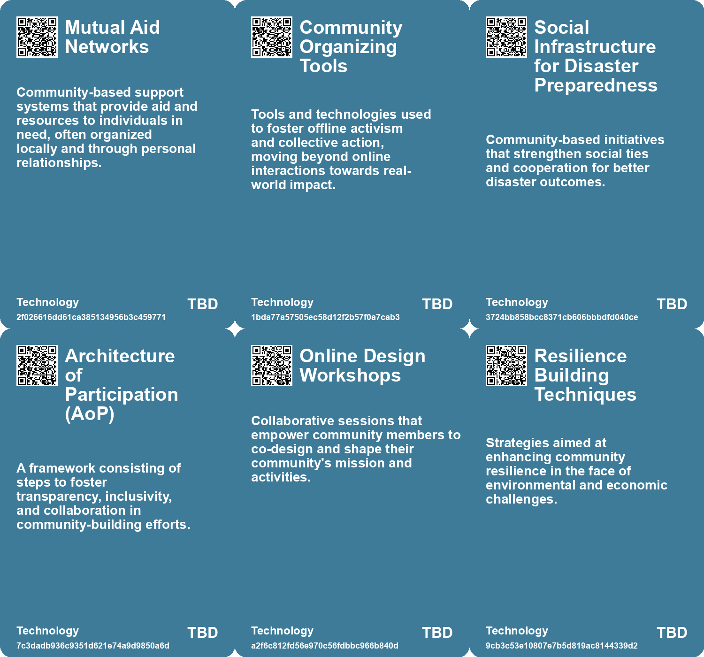

# *Topic*: Community and Collective Action

# Summary

The transformation of public spaces is a focal point in urban development, with cities across the U.S. implementing innovative initiatives to enhance civic engagement and community involvement. These efforts aim to create vibrant environments that counteract issues like loneliness and economic segregation. The Reimagining the Civic Commons model, supported by significant funding, showcases how interdisciplinary partnerships can foster resilience and equity in urban settings.

The concept of community extends into the digital realm, where building a Minimum Viable Community of Practice (MVCoP) is essential for fostering collaboration among professionals. This approach emphasizes open communication, social spaces, and co-design workshops to create inclusive networks that support individual growth. The iterative nature of this process highlights the importance of active participation in cultivating a thriving online community.

Nonviolent protests emerge as a powerful tool for political change, with the "3.5% rule" suggesting that when a small percentage of the population engages in peaceful demonstrations, significant shifts are likely. Historical examples illustrate the effectiveness of nonviolent movements, emphasizing the need for unity and moral high ground in advocating for change. This approach underscores the potential of collective action in shaping political landscapes.

The impact of climate change on communities is a pressing concern, with discussions surrounding the shrinking habitability of certain regions. The importance of social trust and neighborly cooperation is highlighted as essential for adapting to these challenges. Additionally, the role of infrastructure in perpetuating social inequality and its degradation due to climate events is examined, calling for sustainable planning and development practices.

The intersection of private power and democracy raises alarms about the concentration of influence that can undermine societal structures. The need for a business system that supports employment and living standards is emphasized, alongside measures to reduce economic inequalities. This discourse connects to broader themes of social justice and the revival of political democracy.

In rural areas, the phenomenon of abandonment reflects demographic shifts and environmental changes. The decline of communities, such as the village of Tyurkmen in Bulgaria, raises questions about the future of abandoned lands and their ecological outcomes. This narrative illustrates the complex relationship between human presence and environmental health.

Investing in cities requires a reevaluation of current models that often prioritize land speculation over community needs. A new approach that focuses on investing in public goods to create private wealth is proposed, with examples like the High Line in New York City demonstrating the potential for community-led urban development. This shift aims to foster more equitable and sustainable urban environments.

The narrative surrounding climate change is evolving, with calls for a shift in storytelling that encompasses social movements and collective action. By reframing the discourse, there is potential to engage more individuals in the fight against climate change. This perspective emphasizes the importance of community building and proactive efforts to nurture social relationships, particularly in the face of challenges like gentrification and social equity.

# Seeds

|    | name                                               | description                                                                                       | change                                                                                                     | 10-year                                                                                            | driving-force                                                                                           |
|---:|:---------------------------------------------------|:--------------------------------------------------------------------------------------------------|:-----------------------------------------------------------------------------------------------------------|:---------------------------------------------------------------------------------------------------|:--------------------------------------------------------------------------------------------------------|
|  0 | Shift in Trust Networks                            | Emerging community-driven networks for information and aid in crises.                             | Transition from digital-only gatherings to real-world mutual aid initiatives.                              | Increased emphasis on local relationships and trust networks over online discourse.                | Community solidarity in the face of systemic neglect and misinformation.                                |
|  1 | Shift in Business Strategies                       | Businesses adopting community-focused strategies over traditional market tactics.                 | Move from transactional relationships to fostering community and connection.                               | Companies prioritizing community engagement will enhance brand loyalty and customer satisfaction.  | Recognition of the importance of authentic relationships between brands and consumers.                  |
|  2 | Smart Commons Investment Model                     | Proposed model for community-led urban development.                                               | Transition from top-down urban planning to more community-driven investment approaches.                    | Communities may have greater control over local investments, leading to more equitable outcomes.   | Technological advancements enabling decentralized investment and ownership models.                      |
|  3 | Recognition of community efforts                   | Communities are increasingly recognizing individual contributions and milestones.                 | Moving from anonymous participation to acknowledgment and celebration of individual efforts.               | In 10 years, recognition systems may be integral to all community platforms and practices.         | The understanding that motivation and recognition enhance community engagement and retention.           |
|  4 | Localized Climate Action                           | Communities mobilizing to address climate impacts through local initiatives and mutual aid.       | From reliance on governmental support to grassroots efforts and local solutions.                           | In a decade, local initiatives may become the primary means of climate adaptation and resilience.  | Increased recognition of the limits of government response to climate crises, prompting local action.   |
|  5 | Concerns Over Community Homogeneity                | Rising awareness of potential segregation and gentrification in community-building efforts.       | From inclusive community building to a need for equitable, diverse approaches in neighborhood development. | Future communities may prioritize inclusivity and diversity to avoid past mistakes of segregation. | Growing societal recognition of historical injustices and the need for equitable living arrangements.   |
|  6 | Resident-Led Initiatives                           | Community residents are increasingly participating in the design and management of public spaces. | Transitioning from top-down to grassroots-led public space planning and programming.                       | Public spaces will reflect community needs and identities, leading to enhanced local engagement.   | Desire for equitable representation and empowerment in local governance motivates resident involvement. |
|  7 | Civic Engagement through Events                    | Cities are organizing events to engage communities in public space activities.                    | From passive use of parks to active community engagement through events and programming.                   | Public spaces will host diverse events that strengthen community ties and cultural expression.     | Community desire for connection and shared experiences drives event programming in public spaces.       |
|  8 | Increased Community Engagement                     | Communities are coming together to address local climate issues more proactively.                 | From individualistic responses to climate crises to collective community-led initiatives.                  | Local governance and community engagement in climate action may become the norm globally.          | The necessity for collaborative solutions to increasingly complex climate challenges.                   |
|  9 | Shift from Heroic Narratives to Collective Stories | A growing recognition of the importance of collective storytelling over individual heroism.       | Changing from glorifying individual heroes to valuing collective actions and experiences.                  | In ten years, storytelling may prioritize community contributions over singular hero narratives.   | The need for more inclusive representations in narratives addressing social and environmental issues.   |

# Concerns

|    | name                                              | description                                                                                                                                                       |
|---:|:--------------------------------------------------|:------------------------------------------------------------------------------------------------------------------------------------------------------------------|
|  0 | Public Desensitization to Outrage                 | Constant exposure to viral outrage and sensationalism renders collective action less effective, leading to public apathy and paralysis.                           |
|  1 | Local Resilience Limits                           | While local communities can organize for disaster preparedness, they cannot fully address complex, planetary-scale risks.                                         |
|  2 | Civic Culture Development                         | The need for communities to foster a civic culture that attracts and retains businesses, which is crucial for local resilience in a globalized economy.           |
|  3 | Resilience of Social Trust                        | Decreasing social trust amid climate disasters complicating collective action and localized responses to crises.                                                  |
|  4 | Access to Community Resources                     | Not everyone has the financial resources to make physical changes to their home or participate in community-building, leading to unequal access to community.     |
|  5 | Safety and Comfort Issues                         | Individuals from marginalized backgrounds may feel uncomfortable or unsafe in certain communities, limiting their participation in neighborhood-building efforts. |
|  6 | Emotional Labor in Socialization                  | Building community requires significant emotional labor, which can lead to burnout and frustration for those who take on the initiative.                          |
|  7 | Deteriorating Social Trust                        | Declining social trust may hinder community resilience and cooperation needed to deal with climate crises.                                                        |
|  8 | Collective vs. Individual Action                  | The lack of emphasis on collective efforts to combat climate change risks downplaying the importance of shared endeavors for social change.                       |
|  9 | Collective Action Problems in Digital Communities | The challenge of coordinating collective actions like leaving a platform leads to stagnation in seeking better alternatives.                                      |

# Cards

## Concerns

## Behaviors

## Issue

## Technology

# Links

* [Innovative Approaches to Public Space Transformation in U.S. Cities](https://futures.kghosh.me/465b809f2a993c634a1a239ca0cab476)
* [The Impact of Urban Design on Public Space Usage and Social Interaction](https://futures.kghosh.me/2f31d87f3801765f9645d092cadf513a)
* [The Interplay of Democracy, Work, and Economic Justice in Modern Society](https://futures.kghosh.me/43aa6ac3d82bbc19f0d66d5b2bb37897)
* [Creating a Minimum Viable Community of Practice Through Co-Design Workshops](https://futures.kghosh.me/62917f945a037530e2691fe05a2600ea)
* [Addressing the Social Fitness Crisis: The Need for Connection in Modern Society](https://futures.kghosh.me/9aeeedec876dadd7664c8ac15af0b90e)
* [Exploring Alternative Futures for Land Use in Oregon: A Collaborative Initiative by IFTF and 1000 Friends of Oregon](https://futures.kghosh.me/89c33ff05c7560194e8902922720afa5)
* [Building Community: Lessons from Casement Windows and Neighborly Connections](https://futures.kghosh.me/c4728e4ed6178e40f3f788745d12f911)
* [Connecting Local Economies to Global Markets: Insights from Rosabeth Moss Kanter's Analysis](https://futures.kghosh.me/b0f9303688b3f36feafd21625c5d3461)
* [Exploring the Consequences of Abandonment in Rural Bulgaria and Nature's Response](https://futures.kghosh.me/9ab2903416b01dac618d7f3b93ab6dfa)
* [The Fourth Era of Brand Communities: Integrating Events with Marketing Strategies](https://futures.kghosh.me/c179345a7154fb8f3f2f4209ed487406)
* [Critique of Climate Litigation: Overreach and Misguided Legal Strategies in the Fight for Climate Justice](https://futures.kghosh.me/520e99c78c4f0a986e3a3677778dc5ea)
* [Addressing Threats to Democracy: Strategies for Resilience Against Misinformation and Manipulation](https://futures.kghosh.me/56d1a28746cd95ebaa3d62a4e1f91c3a)
* [Reimagining Infrastructure: Towards a Redistributive and Ecologically Sound Future](https://futures.kghosh.me/177a0857ffe0d07d48cd99a269f28a02)
* [A New Investment Model for Urban Development: The Smart Commons Proposal](https://futures.kghosh.me/20e24f276ca807be7569424d8072a67e)
* [Empowering Artisanal Labor through Technology and Community Collaboration in Detroit](https://futures.kghosh.me/9069cc46631b516b7780b893c126086e)
* [The Illusion of Online Activism in the Age of Trump: Embracing Real-World Action Instead](https://futures.kghosh.me/9f50450d1a7c46c073a928b6fa172c18)
* [Evolving Perspectives on Risk Management in the Context of Modern Disasters](https://futures.kghosh.me/cd4f6f65b2486d56699138cd2270044d)
* [Embracing RSS: A Solution for a Better Internet Experience](https://futures.kghosh.me/1dbd39b8ce1a1c86ca4df7ec83cef470)
* [Exploring the Historical and Future Transformations of Land Ownership Worldwide](https://futures.kghosh.me/68a769f0b8d15a4efd8f8136482b9660)
* [The Impact of Conservation Areas on Climate Action and Housing Energy Efficiency in England](https://futures.kghosh.me/fc01cd22da2aa0a185a6c1bb2a7e1145)
* [Navigating Climate Change: The Need for Community Resilience and Social Trust](https://futures.kghosh.me/efa36dc9bd5ddc890866d4ab1e68e71f)
* [Navigating the Climate Crisis: The Importance of Community and Social Trust in Adapting to Change](https://futures.kghosh.me/d1e5dc8cd0f7c34dede43f5429dded3d)
* [Exploring Peacebuilding Through Futures Studies on World Futures Day](https://futures.kghosh.me/ec1cd3015f7369374399a6446dc13586)
* [Redefining Storytelling: From Heroic Conquests to Collective Narratives in Climate Change](https://futures.kghosh.me/9583276a9aeb9f9a0bf87400700799bc)