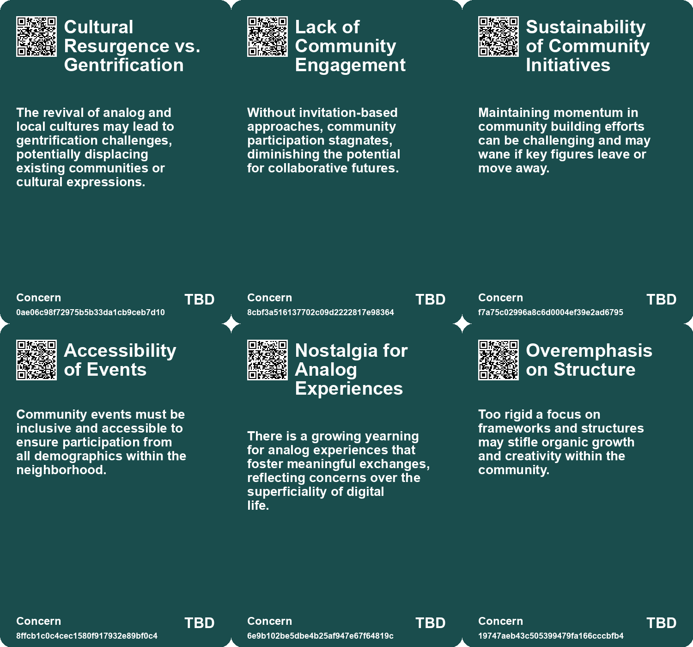
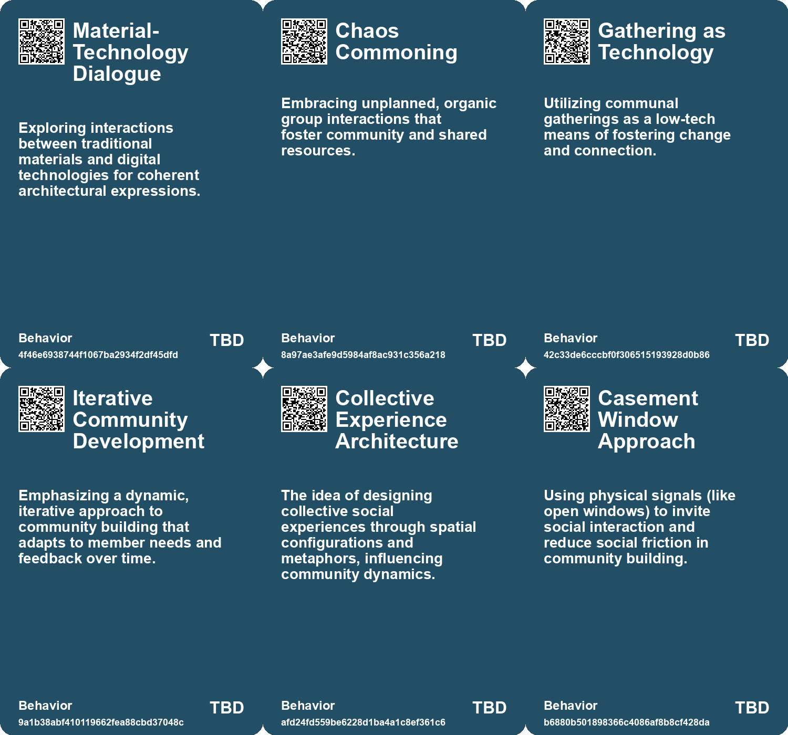
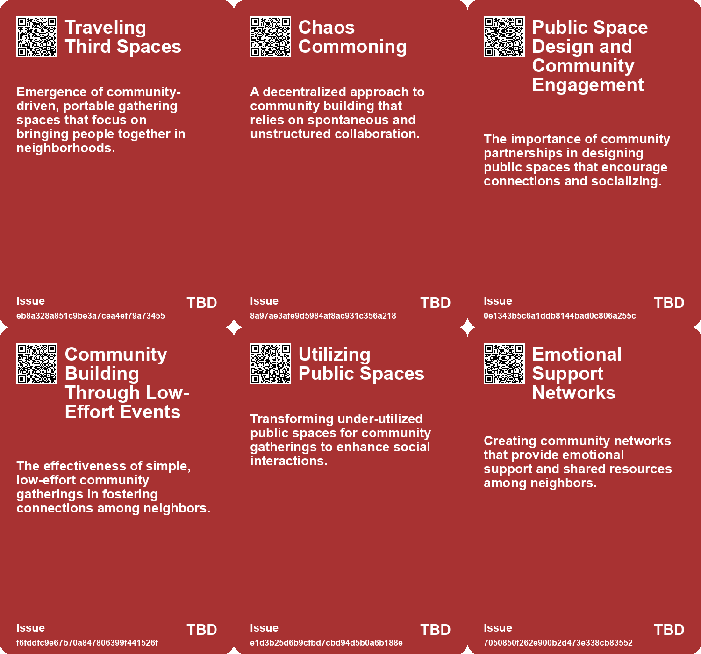
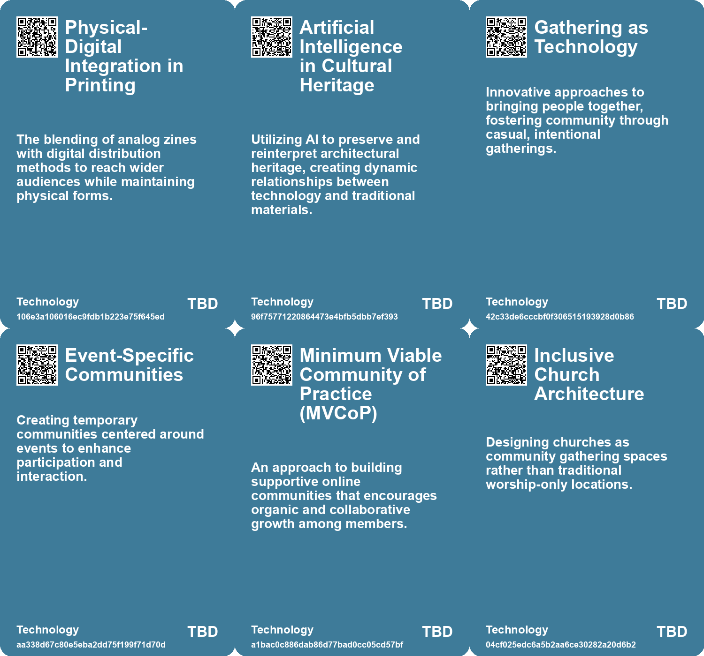

# *Topic*: Community Building Through Analog

# Summary

The transformation of public spaces is a prominent theme, with cities across the U.S. implementing innovative initiatives to enhance civic engagement and community involvement. These efforts aim to create vibrant environments that counteract loneliness and economic segregation. The concept of adaptive reuse also emerges, highlighting the importance of repurposing existing structures, such as churches and shopping malls, to promote sustainability and reduce carbon emissions. This approach reflects a growing recognition of the need to transition spaces for new uses while preserving their historical significance.

Community building is another key focus, emphasizing the value of intentional friendships and neighborhood connections. Simple actions, like hosting casual gatherings or creating group chats, can significantly strengthen social ties. This grassroots approach fosters inclusivity and combats the challenges posed by gentrification and social equity concerns. The importance of visibility in creative endeavors is also discussed, advocating for transparency in the creative process to deepen community engagement.

The impact of technology on social interactions is critically examined. As schools ban smartphones, teens are turning to older devices, reflecting a desire for more authentic experiences. This trend highlights a nostalgic shift in how younger generations consume media and interact with one another. The role of technology in shaping communication and personal experiences is further explored, with a call for self-reflection and occasional digital detoxes to regain perspective.

The intersection of art and community is illustrated through the Bombay Beach Biennale, which has transformed a struggling town into a vibrant art hub. This creative rebirth raises questions about identity and gentrification while showcasing the resilience of its residents. Similarly, the resurgence of zines at the Black Zine Fair highlights the importance of analog communication in a digital age, providing marginalized voices with a platform for expression.

Design and governance play crucial roles in shaping customer experiences, both in physical spaces and digital products. Poor design can lead to frustration, while thoughtful governance can enhance usability and functionality. The concept of Calm Technology is introduced, advocating for user self-governance and long-term value in design.

Finally, the exploration of architectural metaphors reveals how spatial configurations influence social relationships. Understanding these connections can lead to more thoughtful designs that foster community and enhance social interactions. The ongoing dialogue about the role of technology in our lives emphasizes the need for balance, encouraging individuals to navigate the complexities of modern communication while maintaining meaningful connections.

# Seeds

|    | name                                       | description                                                                                          | change                                                                                                          | 10-year                                                                                                                    | driving-force                                                                                                                |
|---:|:-------------------------------------------|:-----------------------------------------------------------------------------------------------------|:----------------------------------------------------------------------------------------------------------------|:---------------------------------------------------------------------------------------------------------------------------|:-----------------------------------------------------------------------------------------------------------------------------|
|  0 | Integration of Technology and Tradition    | Collaborative efforts to blend traditional architectural practices with digital innovations.         | Integration from purely traditional techniques to incorporating digital tools in creative processes.            | Architectural practices may evolve to seamlessly incorporate new technologies while honoring traditions.                   | The need for preservation techniques that are sustainable and forward-thinking in an era of rapid technological advancement. |
|  1 | Front Porch Futuring                       | Sitting on porches as a method of community building and change.                                     | Shifting from formal planning to informal interactions for collective action.                                   | Communities more engaged through informal gatherings, fostering local resilience and shared understanding.                 | A desire for authentic connection and grassroots engagement in decision-making processes.                                    |
|  2 | Gathering as Technology                    | The power of communal gatherings to foster change.                                                   | Shift from digital interactions to physical, presence-oriented community actions.                               | Physical gathering spaces promoting deeper connections and collective actions.                                             | Desire for real, tangible interactions amidst digital overload.                                                              |
|  3 | Revival of Neighborhood Gatherings         | Communities are increasingly reviving outdoor gatherings to foster connections among neighbors.      | From isolated individuals to more connected neighbors through intentional gatherings.                           | Communities may prioritize social interaction and shared spaces as vital for social health.                                | Growing awareness of isolation and the need for community support networks.                                                  |
|  4 | Emerging Local Events Culture              | Neighborhoods are creating a culture of hosting small scale community events for fun and bonding.    | From sporadic social events to a thriving calendar of community-building activities.                            | Local events may become central to community identity and resilience.                                                      | Desire for inclusive spaces that enhance local engagement and connection.                                                    |
|  5 | Utilization of Public Spaces               | Residents are creatively transforming underutilized public spaces into community gathering spots.    | From neglected public spaces to vibrant community hubs fostering interaction.                                   | Urban areas may evolve to prioritize community spaces and public engagement.                                               | The need for inclusive and engaging urban environments amidst growing urbanization.                                          |
|  6 | Use of backchannels                        | The integration of informal communication spaces in community design is becoming common.             | From formal, rigid communication structures to flexible, social interaction spaces.                             | In 10 years, backchannels may be essential components of community engagement strategies.                                  | The recognition of social dynamics and the need for informal exchanges among community members.                              |
|  7 | Increased Interest in Analog Research      | Growing interest in analog astronaut facilities for studying human behavior in extreme environments. | Shift from informal studies to formalized research protocols and standards in analog missions.                  | Analog research will be a recognized field, contributing significantly to space mission preparations and human psychology. | The need for effective training and understanding of human limits in extreme environments, especially for space exploration. |
|  8 | Community Building Among Analog Astronauts | Formation of a support network for individuals who undergo analog missions.                          | From isolated experiences to community support systems for shared challenges post-mission.                      | A robust network will exist for analog astronauts, providing ongoing support and research collaboration.                   | Recognition of the shared experiences and psychological needs of participants returning from analog missions.                |
|  9 | Research on Sustainable Living Practices   | Increasing focus on sustainable practices derived from analog missions for Earth applications.       | From theoretical studies to practical applications of sustainability from space missions to Earth environments. | Practices learned in analog missions will be applied to improve sustainability on Earth, especially in extreme climates.   | The urgent need for sustainable living solutions due to climate change and resource scarcity on Earth.                       |

# Concerns

|    | name                                    | description                                                                                                                                                   |
|---:|:----------------------------------------|:--------------------------------------------------------------------------------------------------------------------------------------------------------------|
|  0 | Cultural Resurgence vs. Gentrification  | The revival of analog and local cultures may lead to gentrification challenges, potentially displacing existing communities or cultural expressions.          |
|  1 | Lack of Community Engagement            | Without invitation-based approaches, community participation stagnates, diminishing the potential for collaborative futures.                                  |
|  2 | Sustainability of Community Initiatives | Maintaining momentum in community building efforts can be challenging and may wane if key figures leave or move away.                                         |
|  3 | Accessibility of Events                 | Community events must be inclusive and accessible to ensure participation from all demographics within the neighborhood.                                      |
|  4 | Nostalgia for Analog Experiences        | There is a growing yearning for analog experiences that foster meaningful exchanges, reflecting concerns over the superficiality of digital life.             |
|  5 | Overemphasis on Structure               | Too rigid a focus on frameworks and structures may stifle organic growth and creativity within the community.                                                 |
|  6 | Social Segregation and Gentrification   | Efforts to build intentional communities may unintentionally exacerbate social segregation and lead to gentrification, affecting marginalized groups.         |
|  7 | Access to Community Resources           | Not everyone has the financial resources to make physical changes to their home or participate in community-building, leading to unequal access to community. |
|  8 | Emotional Labor in Socialization        | Building community requires significant emotional labor, which can lead to burnout and frustration for those who take on the initiative.                      |
|  9 | Isolation effects on well-being         | Continued isolation in analog missions can impact researchers' mental health and performance.                                                                 |

# Cards

## Concerns

## Behaviors

## Issue

## Technology

# Links

* [The Resurgence of Zines: A Response to Digital Surveillance and Censorship](https://futures.kghosh.me/cb1fe0e9b8afd118a7b83e1e16907fa9)
* [The Value of Publicly Sharing Creative Processes Over Finished Products](https://futures.kghosh.me/2f48103338d2c48e804e6878d7019e0b)
* [Exploring Technology's Impact: Insights from Michael Harris on Life Before and After the Internet](https://futures.kghosh.me/357214f864be2592efced782b93b25b3)
* [Transforming a San Francisco Neighborhood Through Simple Community Engagement Traditions](https://futures.kghosh.me/9caf76914f8aba33fd9d01d7be823a97)
* [Exploring Urban Change and Psychological Responses in Austin's Transformation](https://futures.kghosh.me/e825171606432c71606dc78b9bf86eee)
* [Embracing Simplicity: The Path to Evolving Living Systems](https://futures.kghosh.me/628eabb2a1ffbe7b0e6865d9367c32de)
* [Building Community: Lessons from Casement Windows and Neighborly Connections](https://futures.kghosh.me/c4728e4ed6178e40f3f788745d12f911)
* [Exploring the Relationship Between Spatial Metaphors and Social Dynamics in Human Cognition](https://futures.kghosh.me/d63a406f4c783d2b222951d987b912a9)
* [The Shift to Offline Engagement: Emphasizing Exclusivity in Marketing Strategy](https://futures.kghosh.me/65551baaae23bcc5299a04882667bf50)
* [Rethinking Architecture: Embracing Futures Thinking to Combat Climate Crisis](https://futures.kghosh.me/26e385bfcd6784d024e3e49e8b04ce89)
* [Reimagining Church Architecture: Ørestad Church as a Community Hub in Denmark](https://futures.kghosh.me/e68e1c03b43982a51a3374df177701e8)
* [Teens Embrace Older Tech Amid School Smartphone Bans, Sparking Nostalgia and Socialization](https://futures.kghosh.me/2c00b2575d94795c1ea258a68f0cf8ea)
* [Nostalgia for Simplicity: The Burden of Infinite Choice in Modern Life](https://futures.kghosh.me/7b316ebe449187b79e519a8c6d12a2cd)
* [Exploring the Psychological Impact of Analog Astronaut Missions and Post-Mission Reintegration Challenges](https://futures.kghosh.me/37c74ca68455427ad4912697a407f23c)
* [The Impact of Urban Design on Public Space Usage and Social Interaction](https://futures.kghosh.me/2f31d87f3801765f9645d092cadf513a)
* [The Urgent Need for Adaptive Reuse in Architecture Today](https://futures.kghosh.me/cf7cc3361b8139c51e3e97835a2da4e4)
* [Revitalizing Ruins: Bombay Beach's Transformation Through Art and Community](https://futures.kghosh.me/9e3df9dec95cee1464d33e4ab8528d91)
* [Innovative Approaches to Public Space Transformation in U.S. Cities](https://futures.kghosh.me/465b809f2a993c634a1a239ca0cab476)
* [The Fourth Era of Brand Communities: Integrating Events with Marketing Strategies](https://futures.kghosh.me/c179345a7154fb8f3f2f4209ed487406)
* [Empowering Artisanal Labor through Technology and Community Collaboration in Detroit](https://futures.kghosh.me/9069cc46631b516b7780b893c126086e)
* [Polaroid’s Shift: From Creativity to Authenticity in the Age of AI](https://futures.kghosh.me/ba6b48e83806da532c7578d24e914455)
* [Exploring the Intersection of Video Game Simulation and Real-World Ecology](https://futures.kghosh.me/57fcfcda347e1934e0c1da9fc212fcec)
* [Creating a Minimum Viable Community of Practice Through Co-Design Workshops](https://futures.kghosh.me/62917f945a037530e2691fe05a2600ea)
* [Exploring Cultural Heritage Through AI: Armenia's Pavilion at Venice Biennale 2025](https://futures.kghosh.me/34b4d87b744230499df1eb6a00d5c11d)
* [Design as Governance: Lessons from a Coffee Shop Experience on User-Centric Design](https://futures.kghosh.me/2587a142b15645727d2adbee3539d4de)
* [Exploring Front Porch Futuring: Small Actions for Collective Change](https://futures.kghosh.me/2eb10da6327ac336a7829b713d35b7b5)
* [Exploring Healing-Centric Design in the Age of Emerging Technologies](https://futures.kghosh.me/6ce4d4d1c40fef14044ea70a600c66d4)
* [Embracing Human Connection: Lessons from Kurt Vonnegut on Life's Simple Pleasures](https://futures.kghosh.me/0caea9bd56c3af1685f202dc7f22cc16)