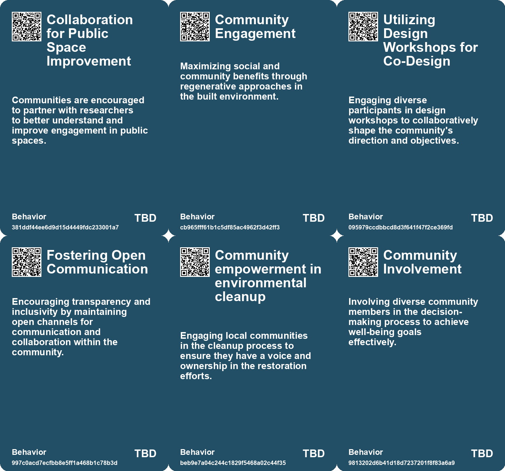
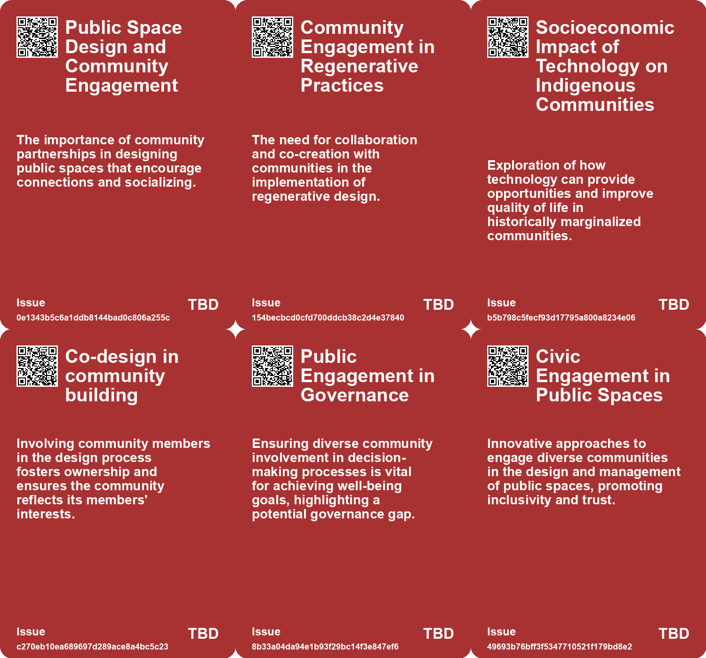
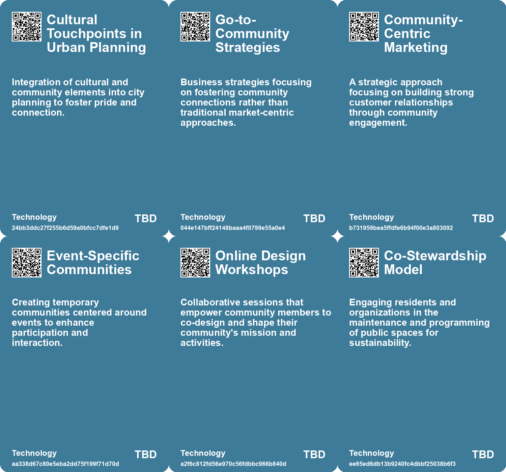

# *Topic*: Community Engagement

# Summary

Cities across the U.S. are reimagining public spaces to enhance community engagement and promote social equity. Initiatives funded by nearly $10 million aim to transform urban environments through collaboration and environmental sustainability. These projects address issues like loneliness and economic segregation, fostering vibrant public areas that encourage diverse interactions.

Research highlights a decline in social interactions in urban settings over the past three decades. Studies show that pedestrians now walk faster and spend less time socializing, influenced by technology and demographic shifts. Experts advocate for pedestrian-friendly designs that promote social capital and warn that concepts like 15-minute cities may inadvertently isolate low-income residents.

The marketing landscape is evolving with a focus on brand communities. Event marketers are integrating community-driven strategies to enhance customer relationships, moving beyond traditional branding. Successful examples from major tech companies illustrate how events can foster connections and engagement, emphasizing the need for alignment between event marketers and community managers.

Building supportive online communities is essential for professional growth. The concept of a Minimum Viable Community of Practice (MVCoP) encourages organic collaboration and belonging. Key steps include open communication, social spaces, and celebrating milestones, ensuring that communities reflect the interests of their members.

The future of work is expected to be promising, with a focus on skill development and adaptability. Public and private sectors are urged to collaborate to maximize opportunities in emerging industries. A sustainable economy will prioritize mental health, creativity, and circular economic models, while individuals are encouraged to cultivate entrepreneurial mindsets.

Governments are leveraging technology to improve efficiency and productivity. The integration of artificial intelligence is enhancing service delivery and streamlining processes. However, challenges remain in scaling AI applications and addressing talent shortages. The combination of technology and policy can drive significant improvements in government performance.

Design and governance play crucial roles in shaping customer experiences. Poorly designed spaces can hinder usability, while thoughtful design choices can enhance functionality. The concept of Calm Technology promotes user self-governance, aiming to optimize user experience in both physical and digital environments.

Public health concerns are rising due to loneliness, with a significant portion of the population reporting feelings of isolation. The need for social connections is emphasized, urging individuals and businesses to foster meaningful relationships. Anticipated changes include technology companies developing apps focused on social health metrics and a resurgence of traditional community activities.

Community building is also highlighted through intentional friendships and neighborhood connections. Simple gestures can enhance social ties and foster supportive environments, despite challenges like gentrification. Efforts to nurture relationships within local communities are essential for creating inclusive spaces.

Local government devolution and data sharing are critical for improving services. Barriers to utilizing local data must be addressed to enhance citizen engagement and meet community needs. Policymakers are encouraged to rethink operating models and prioritize data collaboration for positive change.

Regenerative design principles emphasize the need for ethical responsibility in ecological actions. The focus is on restoring planetary health through thoughtful urban planning and community benefits. The Well-being of Future Generations Act in Wales exemplifies a commitment to long-term sustainability and collaboration among public bodies.

Innovative solutions for environmental challenges are emerging, such as bioremediation techniques using fungi to restore polluted brownfields. These methods offer cost-effective alternatives to traditional cleanup processes and empower communities to participate in environmental restoration.

Artificial intelligence is being harnessed to streamline public consultations, making it easier to analyze responses and identify themes. This tool aims to save costs and improve the policymaking process by automating data analysis.

In Assam, India, traditional bamboo houses are being redesigned to withstand severe flooding. Collaborations between local masons and organizations are enhancing the durability of these homes, setting a precedent for disaster preparedness in flood-prone regions.

Projects awarded microgrants are fostering love and community connections, addressing various social issues. These initiatives emphasize the importance of treating love as a public ethic and highlight diverse visions for nurturing supportive futures.

Earth observation technology is projected to have a significant economic impact while contributing to sustainability efforts. Collaborative approaches across sectors are essential for maximizing the benefits of this technology, despite challenges in awareness and technical complexities.

Indigenous communities are utilizing AI technology to preserve cultural heritage and improve quality of life. Initiatives like the Tainá chatbot empower local populations to engage with their environment and enhance their understanding of traditional practices.

# Seeds

|    | name                            | description                                                                                       | change                                                                                            | 10-year                                                                                                             | driving-force                                                                                               |
|---:|:--------------------------------|:--------------------------------------------------------------------------------------------------|:--------------------------------------------------------------------------------------------------|:--------------------------------------------------------------------------------------------------------------------|:------------------------------------------------------------------------------------------------------------|
|  0 | Community-Centric Approaches    | Rising emphasis on social and community benefits in design processes.                             | Transition from individualistic designs to community-focused regenerative approaches.             | Communities might benefit from improved social cohesion and environmental health due to inclusive design practices. | Demand for social justice and equitable access to resources in urban spaces.                                |
|  1 | Shift in Business Strategies    | Businesses adopting community-focused strategies over traditional market tactics.                 | Move from transactional relationships to fostering community and connection.                      | Companies prioritizing community engagement will enhance brand loyalty and customer satisfaction.                   | Recognition of the importance of authentic relationships between brands and consumers.                      |
|  2 | Youth Engagement in Technology  | Increased interest among youth in using technology to improve community life.                     | From disinterest in technology to proactive engagement in tech solutions.                         | Youth could spearhead innovative solutions in their communities, leading to empowerment.                            | Desire for improved quality of life and cultural relevance in technological applications.                   |
|  3 | Online design workshops         | Design workshops are becoming a popular method for community co-design and engagement.            | Transitioning from passive community involvement to active co-design and participation.           | In 10 years, design workshops may become standard practice for community building and engagement.                   | The rise of collaborative technologies and a focus on participatory methods for community development.      |
|  4 | Diversity in Involvement        | Importance of involving diverse community representation in decision-making.                      | From homogeneous decision-making to inclusive approaches in public governance.                    | More representative policies that reflect the diversity of communities served.                                      | Recognition of the value of diverse perspectives in problem-solving.                                        |
|  5 | Digital Neighborhood Engagement | Use of social media and messaging apps to enhance local community interactions.                   | From traditional community gatherings to digital platforms facilitating neighborhood connections. | In ten years, community engagement may rely heavily on digital tools for organizing and interaction.                | Advancements in technology and the need for efficient communication in busy lifestyles.                     |
|  6 | Civic Commons Collaboration     | Cities are forming multidisciplinary teams to enhance public spaces and community engagement.     | Shift from individual site management to collaborative, connected public space management.        | Public spaces will be more integrated and responsive to community needs, fostering inclusivity.                     | Increased awareness of social issues like loneliness and economic segregation drives collaborative efforts. |
|  7 | Resident-Led Initiatives        | Community residents are increasingly participating in the design and management of public spaces. | Transitioning from top-down to grassroots-led public space planning and programming.              | Public spaces will reflect community needs and identities, leading to enhanced local engagement.                    | Desire for equitable representation and empowerment in local governance motivates resident involvement.     |
|  8 | Civic Engagement through Events | Cities are organizing events to engage communities in public space activities.                    | From passive use of parks to active community engagement through events and programming.          | Public spaces will host diverse events that strengthen community ties and cultural expression.                      | Community desire for connection and shared experiences drives event programming in public spaces.           |
|  9 | Innovative Science Engagement   | Active roles in science engagement at festivals and events.                                       | Changes from passive attendance to active participation in science communication.                 | In a decade, science events may become fully interactive, transforming public engagement with science.              | The public's growing interest in science and technology encourages more interactive learning experiences.   |

# Concerns

|    | name                                      | description                                                                                                                                             |
|---:|:------------------------------------------|:--------------------------------------------------------------------------------------------------------------------------------------------------------|
|  0 | Shifts in Business Strategies             | Businesses may prioritize community-building over traditional market strategies, impacting customer relations and employee engagement.                  |
|  1 | Sustainability of Short-lived Communities | Short-term community engagements around events might not lead to lasting relationships or brand loyalty.                                                |
|  2 | Unforeseen Impacts of Community Projects  | As community-led initiatives grow, there is potential for unexpected consequences that could marginalize less dominant voices.                          |
|  3 | Global versus Local Interests             | The potential conflict between global business strategies and local political interests, which may create tension and impact community engagement.      |
|  4 | Civic Culture Development                 | The need for communities to foster a civic culture that attracts and retains businesses, which is crucial for local resilience in a globalized economy. |
|  5 | Stakeholder Expectations                  | Increasing pressure from customers, employees, and public entities for companies to demonstrate genuine sustainability efforts.                         |
|  6 | Community Empowerment in Cleanup Efforts  | Communities need to be actively involved in cleanup processes to ensure their specific needs and knowledge are acknowledged and used.                   |
|  7 | Social Disconnect                         | Inadequate involvement of diverse community members could result in social disconnect and failure to meet well-being goals.                             |
|  8 | Community Engagement Risks                | Relying on resident feedback for civic projects could result in conflict if differing community needs and priorities are not adequately addressed.      |
|  9 | Science Engagement Relevance              | The challenge of ensuring that participants find the future of science engagement events relevant and impactful for their communities.                  |

# Cards

## Concerns

## Behaviors

## Issue

## Technology

# Links

* [Global Government Reforms: Advancements in Efficiency through Digital Transformation and AI](https://futures.kghosh.me/3f295c6c0c9af1ecd24bfa22b6ef6b47)
* [The Role of Future Generations Commissioners in Climate Action and Policy Making](https://futures.kghosh.me/32228bbf929d81d39a1808dd9b7c4493)
* [Future of Work: Embracing Opportunities and Adapting to Change Over the Next 50 Years](https://futures.kghosh.me/a601d356f6c81dbc065229f13e92c3f8)
* [Addressing the Social Fitness Crisis: The Need for Connection in Modern Society](https://futures.kghosh.me/9aeeedec876dadd7664c8ac15af0b90e)
* [Overview of the Well-being of Future Generations (Wales) Act 2015 and Its Implications](https://futures.kghosh.me/3938700a79bbde32972657f9eb7b1b69)
* [Innovative Fungal Solutions for Restoring Contaminated Brownfields in the U.S.](https://futures.kghosh.me/666f5297ceb142394ebf30d39f1d9bc3)
* [Innovative Adaptations of Assam's Chang Ghars for Flood Resilience and Climate Change Challenges](https://futures.kghosh.me/141479bb35e9f52f4fa3fdccd0d2b13a)
* [Future of Work: Embracing Opportunities and Adapting to Change Over the Next 50 Years](https://futures.kghosh.me/56ddb45deabcdc8b707c7647270e101d)
* [The Impact of Urban Design on Public Space Usage and Social Interaction](https://futures.kghosh.me/2f31d87f3801765f9645d092cadf513a)
* [Evaluating the Effectiveness of Living Labs: Research Findings and Insights](https://futures.kghosh.me/21110afd93356cd60bb66cf8f6ffdfdb)
* [Enhancing Government Consultations: AI Tool for Faster Analysis of Public Responses](https://futures.kghosh.me/a94061ecae4e2f9cf7ee7680b9bdeb5f)
* [Innovative Approaches to Public Space Transformation in U.S. Cities](https://futures.kghosh.me/465b809f2a993c634a1a239ca0cab476)
* [Seven Innovative Projects Foster a Future Centered on Love](https://futures.kghosh.me/397a8902bff1e80356fc872c0a0f5d98)
* [Harnessing Earth Observation for Sustainable Economic Growth and Environmental Benefits](https://futures.kghosh.me/38665df1d14994e25e78d14fd02c8756)
* [Indigenous Communities Harness AI to Preserve Culture and Improve Lives](https://futures.kghosh.me/f16c744150991b5f2533077e99ec33b1)
* [The Importance of Sustainability in the Tech Sector: A Call to Action for Companies](https://futures.kghosh.me/763a73de80e3ade3d3a068da6ce48182)
* [Connecting Local Economies to Global Markets: Insights from Rosabeth Moss Kanter's Analysis](https://futures.kghosh.me/b0f9303688b3f36feafd21625c5d3461)
* [The Fourth Era of Brand Communities: Integrating Events with Marketing Strategies](https://futures.kghosh.me/c179345a7154fb8f3f2f4209ed487406)
* [Unlocking the Potential of Local Data in UK Government Devolution for Enhanced Services](https://futures.kghosh.me/715753b68e3f5ba36be643d1ded0de93)
* [Gensler's City Pulse Survey Highlights Emotional Connections in Urban Migration and Retention](https://futures.kghosh.me/8ef19e1177d942bd48ddfdf4db392264)
* [Building Community: Lessons from Casement Windows and Neighborly Connections](https://futures.kghosh.me/c4728e4ed6178e40f3f788745d12f911)
* [Exploring Regenerative Design for Harmonious Coexistence with Nature](https://futures.kghosh.me/a1acb04c0f65f709ad6c8ce2f0946a51)
* [Design as Governance: Lessons from a Coffee Shop Experience on User-Centric Design](https://futures.kghosh.me/2587a142b15645727d2adbee3539d4de)
* [Futures Canvas: A Collaborative Platform for Shaping the Future Together](https://futures.kghosh.me/ca4df2617146551eab6d6792c32adb78)
* [Creating a Minimum Viable Community of Practice Through Co-Design Workshops](https://futures.kghosh.me/62917f945a037530e2691fe05a2600ea)