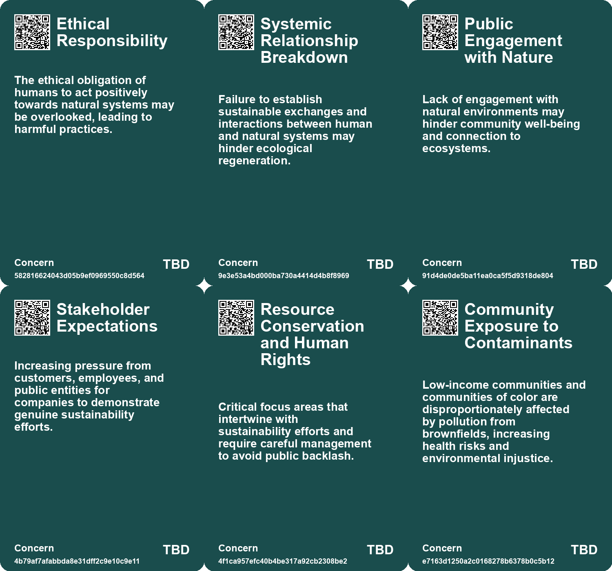
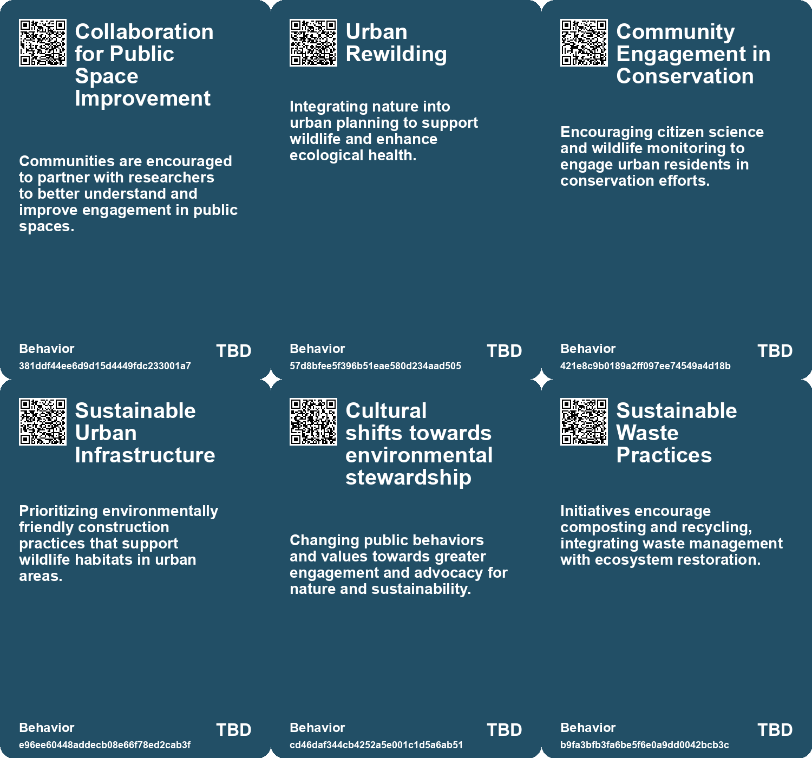
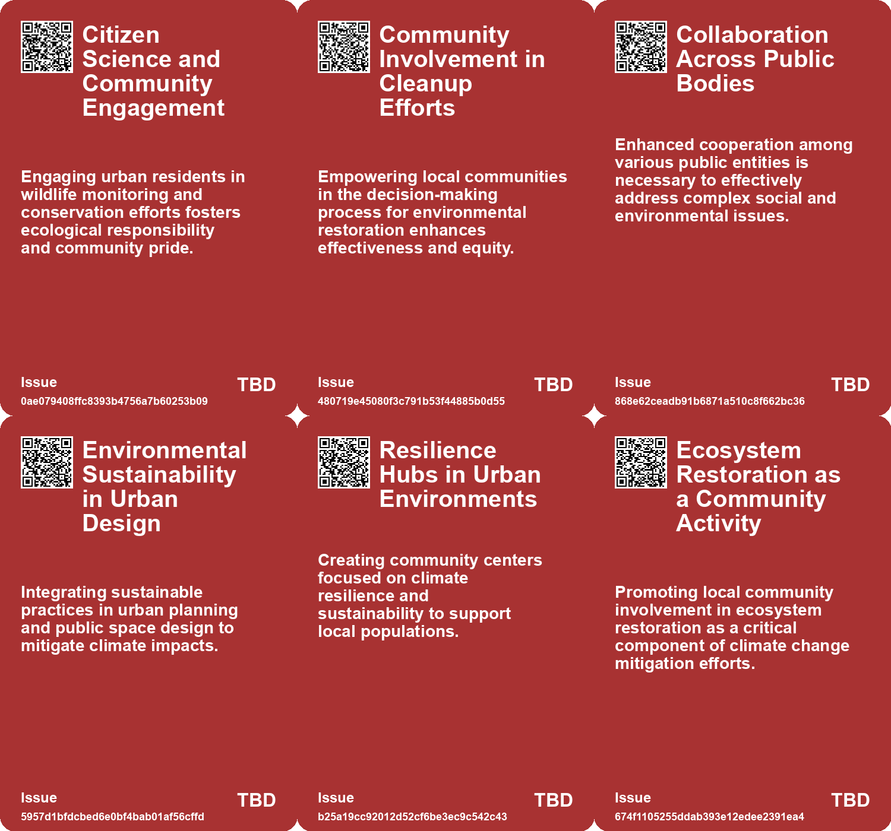
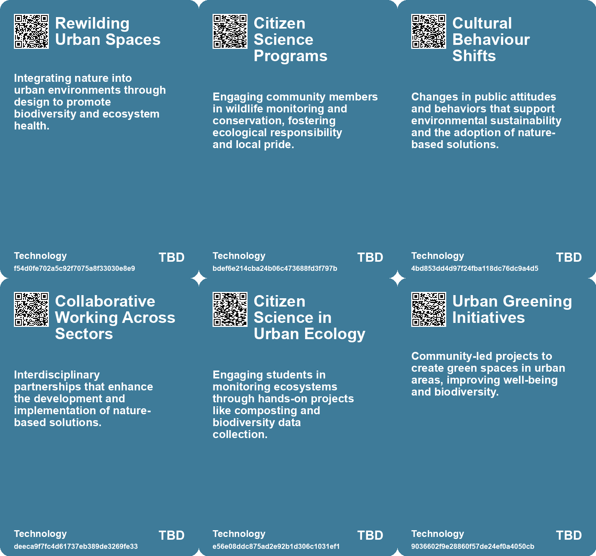

# *Topic*: Community Engagement in Environmental

# Summary

Urban transformation is a key focus in many cities across the United States, where innovative initiatives aim to revitalize public spaces. The Reimagining the Civic Commons model is being implemented in ten cities, with nearly $10 million in funding. These projects emphasize community involvement, socioeconomic mixing, and environmental sustainability, addressing issues like loneliness and economic segregation.

The challenge of brownfields, contaminated sites often found in low-income areas, is being tackled through nature-based solutions. Danielle Stevenson’s research on using fungi and native plants shows promise in bioremediation, offering a sustainable alternative to traditional cleanup methods. This approach not only addresses pollution but also empowers local communities, particularly those historically marginalized.

The tech industry faces scrutiny for its environmental impact, contributing nearly 3% of global carbon emissions. Companies are urged to adopt greener practices and integrate sustainability into their operations. Western Digital’s commitment to renewable energy and net-zero emissions by 2032 exemplifies how businesses can align their goals with environmental responsibility.

Research on public space usage reveals a decline in social interactions over the past three decades. Dr. Arianna Salazar-Miranda’s study indicates that urban design can foster social capital and cohesion. However, concepts like 15-minute cities may inadvertently increase economic segregation, highlighting the need for inclusive urban planning.

Regenerative design principles are gaining traction as a means to restore planetary health. Emphasizing nature-led, systemic, and equitable approaches, these principles advocate for a harmonious coexistence between human and natural systems. The report on regenerative design calls for ethical responsibility in ecological actions, aiming to restore balance in our environments.

Nature-based Solutions (NbS) are crucial in addressing climate change, particularly in Scotland, where urban NbS can improve air quality and reduce emissions. The preservation of peatlands and the development of natural capital markets are essential for achieving net-zero goals. Collaborative efforts are necessary to scale up NbS and stimulate investments in natural assets.

The future of work is evolving, with emerging technologies and cultural shifts shaping job opportunities. Experts predict a promising landscape where skills in sustainability, creativity, and adaptability will be vital. Public and private sectors must collaborate to prepare for this future, emphasizing lifelong learning and problem-solving to support a thriving economy.

The impact of climate change is pervasive, with communities facing increasing challenges. Building social trust and cooperation is essential for resilience, particularly in regions becoming uninhabitable. Effective energy policies and community engagement are critical in navigating the complexities of a warming world, underscoring the need for collective action in addressing climate-related issues. 

Urban wildlife is adapting to city environments, with species thriving amid human development. Rewilding urban spaces through green infrastructure and wildlife corridors can enhance biodiversity and improve residents' well-being. However, challenges such as human-wildlife conflicts must be addressed to create sustainable cities that support diverse life forms. 

The exploration of space is also on the horizon, promising technological innovation and global collaboration. A sustainable space economy is anticipated by 2040, with advancements in eco-friendly satellites and self-sustaining habitats. This vision emphasizes the importance of sustainability and knowledge exploration as humanity looks to the stars.

# Seeds

|    | name                                           | description                                                                                       | change                                                                                                      | 10-year                                                                                                                          | driving-force                                                                                                   |
|---:|:-----------------------------------------------|:--------------------------------------------------------------------------------------------------|:------------------------------------------------------------------------------------------------------------|:---------------------------------------------------------------------------------------------------------------------------------|:----------------------------------------------------------------------------------------------------------------|
|  0 | Community Engagement in Conservation           | Citizen science fosters residents' connection with urban wildlife.                                | Growing participation of locals in wildlife monitoring and conservation efforts.                            | Urban residents may become more actively involved in biodiversity conservation.                                                  | A rising awareness of environmental issues encourages community involvement in conservation.                    |
|  1 | Cultural Shift Toward Nature Engagement        | Increasing citizen and community engagement with natural environments.                            | Shifting from passive consumption of nature to active participation in its stewardship.                     | Communities will play a vital role in maintaining and enhancing local natural assets.                                            | Growing awareness of environmental issues and personal responsibility fosters community engagement.             |
|  2 | Community-Building through Green Spaces        | Community initiatives around micro-forests foster social connections and cultural education.      | Shift from neglected urban areas to vibrant, community-driven green spaces that promote social interaction. | In ten years, community engagement may be centered around urban green spaces, enhancing social cohesion.                         | Desire for community connection and collaboration following social isolation during the pandemic.               |
|  3 | Sustainability as a Competitive Advantage      | Companies are leveraging sustainability for employee engagement and customer satisfaction.        | Transition from viewing sustainability as a cost to recognizing it as a strategic advantage.                | Sustainable practices will be integral to corporate strategies, affecting market competitiveness.                                | The increasing demand from consumers and investors for responsible and sustainable business practices.          |
|  4 | Community empowerment in environmental cleanup | Training local communities to manage their own environmental restoration projects.                | Transition from external remediation efforts to community-led cleanups.                                     | Communities actively involved in local environmental restoration, leading to improved health outcomes.                           | Desire for equitable environmental practices and local agency in pollution management.                          |
|  5 | Civic Commons Collaboration                    | Cities are forming multidisciplinary teams to enhance public spaces and community engagement.     | Shift from individual site management to collaborative, connected public space management.                  | Public spaces will be more integrated and responsive to community needs, fostering inclusivity.                                  | Increased awareness of social issues like loneliness and economic segregation drives collaborative efforts.     |
|  6 | Resident-Led Initiatives                       | Community residents are increasingly participating in the design and management of public spaces. | Transitioning from top-down to grassroots-led public space planning and programming.                        | Public spaces will reflect community needs and identities, leading to enhanced local engagement.                                 | Desire for equitable representation and empowerment in local governance motivates resident involvement.         |
|  7 | Increased Community Engagement                 | Communities are coming together to address local climate issues more proactively.                 | From individualistic responses to climate crises to collective community-led initiatives.                   | Local governance and community engagement in climate action may become the norm globally.                                        | The necessity for collaborative solutions to increasingly complex climate challenges.                           |
|  8 | Corporate Commitment to Sustainability         | EY's commitment to sustainability through educational programs for employees.                     | Transition from profit-centric business models to sustainability-centered approaches.                       | Corporations will prioritize sustainable practices, transforming their operational and strategic frameworks.                     | Growing consumer and regulatory expectations for corporate social responsibility and environmental stewardship. |
|  9 | Hands-on Learning in Sustainability            | Emphasis on real-world challenges in sustainability education programs.                           | Move from theoretical learning to practical, experiential learning in sustainability.                       | Educational institutions will increasingly incorporate real-world challenges into their curricula to enhance student engagement. | The necessity for graduates to be job-ready and capable of addressing real-world sustainability issues.         |

# Concerns

|    | name                                     | description                                                                                                                                                         |
|---:|:-----------------------------------------|:--------------------------------------------------------------------------------------------------------------------------------------------------------------------|
|  0 | Ethical Responsibility                   | The ethical obligation of humans to act positively towards natural systems may be overlooked, leading to harmful practices.                                         |
|  1 | Systemic Relationship Breakdown          | Failure to establish sustainable exchanges and interactions between human and natural systems may hinder ecological regeneration.                                   |
|  2 | Public Engagement with Nature            | Lack of engagement with natural environments may hinder community well-being and connection to ecosystems.                                                          |
|  3 | Stakeholder Expectations                 | Increasing pressure from customers, employees, and public entities for companies to demonstrate genuine sustainability efforts.                                     |
|  4 | Resource Conservation and Human Rights   | Critical focus areas that intertwine with sustainability efforts and require careful management to avoid public backlash.                                           |
|  5 | Community Exposure to Contaminants       | Low-income communities and communities of color are disproportionately affected by pollution from brownfields, increasing health risks and environmental injustice. |
|  6 | Community Empowerment in Cleanup Efforts | Communities need to be actively involved in cleanup processes to ensure their specific needs and knowledge are acknowledged and used.                               |
|  7 | Indigenous Rights and Climate Refugees   | Indigenous communities facing displacement from traditional lands due to climate change impacts, threatening cultural heritage.                                     |
|  8 | Inadequate Stakeholder Engagement        | Failure to effectively engage stakeholders in sustainability efforts may lead to inadequate solutions and backlash.                                                 |
|  9 | Intergenerational Climate Justice        | The need to balance the responsibilities of current generations with the rights of future generations to a healthy environment.                                     |

# Cards

## Concerns

## Behaviors

## Issue

## Technology

# Links

* [Innovative Approaches to Public Space Transformation in U.S. Cities](https://futures.kghosh.me/465b809f2a993c634a1a239ca0cab476)
* [The Impact of Urban Design on Public Space Usage and Social Interaction](https://futures.kghosh.me/2f31d87f3801765f9645d092cadf513a)
* [Exploring Regenerative Design for Harmonious Coexistence with Nature](https://futures.kghosh.me/a1acb04c0f65f709ad6c8ce2f0946a51)
* [Envisioning Humanity's Sustainable Space Future by 2040](https://futures.kghosh.me/10bce1d6a20db285c10362c75da86eec)
* [Empowering EY Professionals Through the Masters in Sustainability Program](https://futures.kghosh.me/fcb03e94b8239b410a79996496599390)
* [Overview of the Well-being of Future Generations (Wales) Act 2015 and Its Implications](https://futures.kghosh.me/3938700a79bbde32972657f9eb7b1b69)
* [Tiny Forests: Revitalizing Urban Spaces and Strengthening Communities in Australia](https://futures.kghosh.me/0d473df79d3acc680e6d9e25e23eaee7)
* [Harnessing Earth Observation for Sustainable Economic Growth and Environmental Benefits](https://futures.kghosh.me/38665df1d14994e25e78d14fd02c8756)
* [Future of Work: Embracing Opportunities and Adapting to Change Over the Next 50 Years](https://futures.kghosh.me/a601d356f6c81dbc065229f13e92c3f8)
* [The Role of Future Generations Commissioners in Climate Action and Policy Making](https://futures.kghosh.me/32228bbf929d81d39a1808dd9b7c4493)
* [The Importance of Sustainability in the Tech Sector: A Call to Action for Companies](https://futures.kghosh.me/763a73de80e3ade3d3a068da6ce48182)
* [The Call for a New, Focused ESG: Prioritizing Employees, Society, and Government](https://futures.kghosh.me/022335f24a4ab2580a4b1fb2dbb53fac)
* [Environment Agency Launches £52.5M Framework to Combat Climate Change and Flooding Risks](https://futures.kghosh.me/25ee4c74a450de58a35fc35c4e808f8f)
* [Reimagining Natural Capital: A Stock Option Approach for Ecological Sustainability](https://futures.kghosh.me/bf06142acab0ca8fd2ed4e9231f0c279)
* [Understanding Externalities: The Need for a Revolutionary Shift in Industrial Practices](https://futures.kghosh.me/364fecbe1c46f164e48d52c279422351)
* [Addressing Urban Forestry Challenges: The Case for Trees as Vital Infrastructure](https://futures.kghosh.me/34fb411b34c997f52f550d855c864865)
* [Innovative Fungal Solutions for Restoring Contaminated Brownfields in the U.S.](https://futures.kghosh.me/666f5297ceb142394ebf30d39f1d9bc3)
* [Scaling Nature-based Solutions in Scotland: A Pathway to Climate Resilience](https://futures.kghosh.me/c7d3021c1b6298e7c47bc455cd7d8391)
* [The Impact of Conservation Areas on Climate Action and Housing Energy Efficiency in England](https://futures.kghosh.me/fc01cd22da2aa0a185a6c1bb2a7e1145)
* [Future of Work: Embracing Opportunities and Adapting to Change Over the Next 50 Years](https://futures.kghosh.me/56ddb45deabcdc8b707c7647270e101d)
* [Navigating Climate Change: The Need for Community Resilience and Social Trust](https://futures.kghosh.me/efa36dc9bd5ddc890866d4ab1e68e71f)
* [Reimagining Urban Spaces: Embracing Wildlife in City Environments](https://futures.kghosh.me/88d958b42141d5ddfae941e43db4eda7)
* [Navigating the Climate Crisis: The Importance of Community and Social Trust in Adapting to Change](https://futures.kghosh.me/d1e5dc8cd0f7c34dede43f5429dded3d)