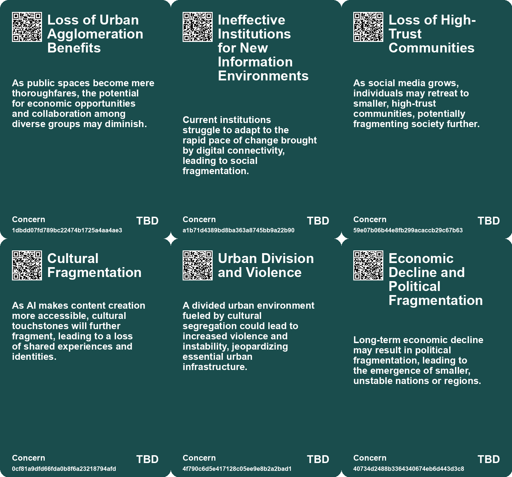
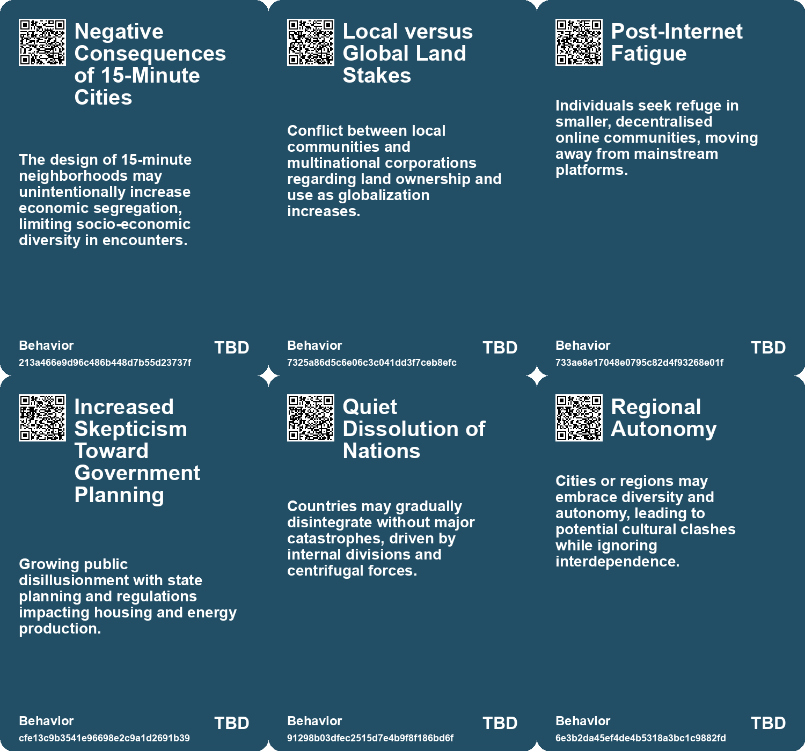
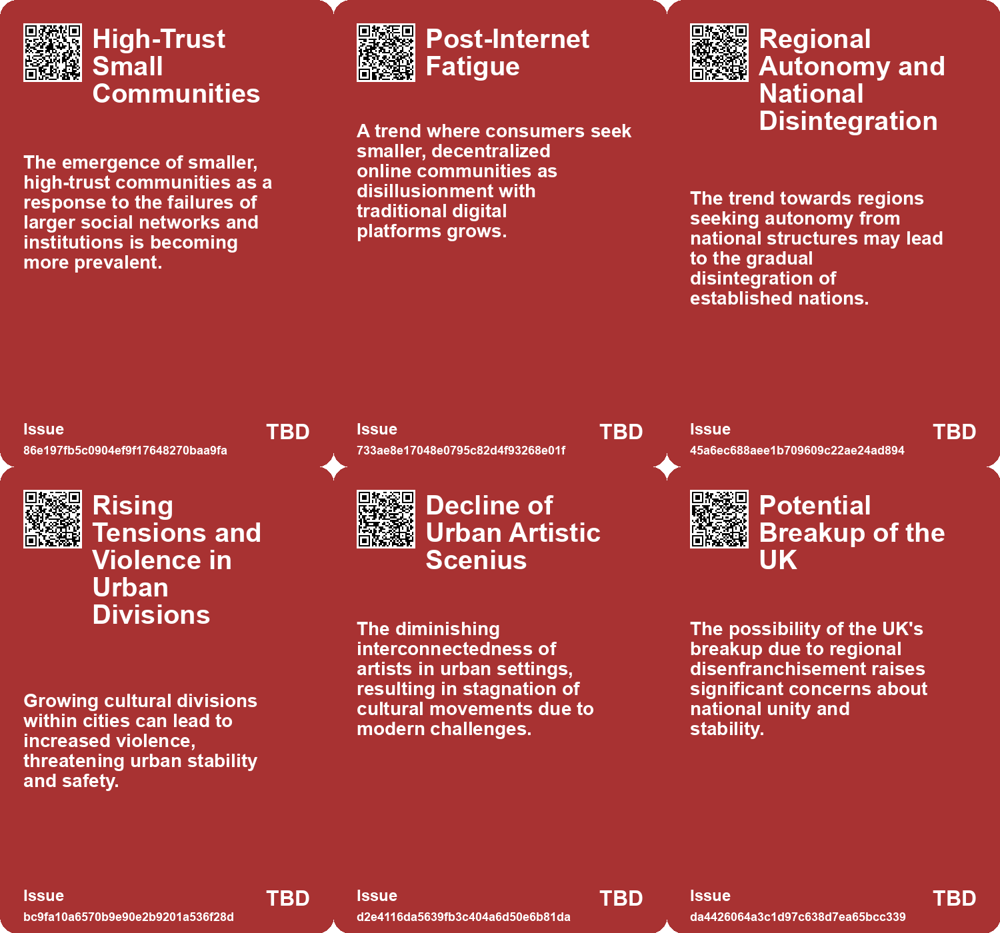
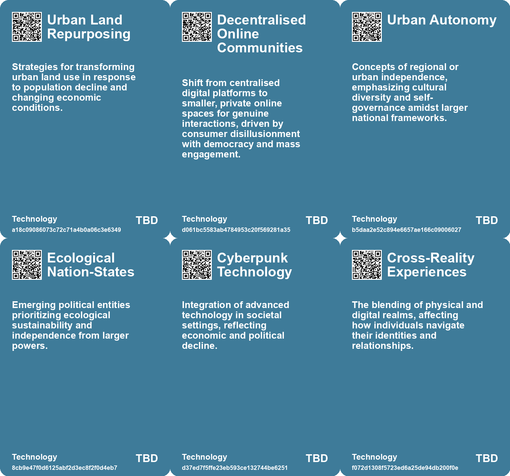

# *Topic*: Community Fragmentation

# Summary

The intersection of technology and culture is reshaping the landscape of content creation and consumption. Artificial intelligence is democratizing the production of both media and software, leading to a fragmentation of culture. Platforms like YouTube are inundated with video content, reflecting a shift where tools like Sekai and Lovable empower individuals to create and innovate. This trend suggests that future companies will thrive by developing supportive networks and tools for creators.

Rural abandonment is a pressing issue, particularly in places like Tyurkmen, Bulgaria, where population decline has left communities struggling. The relationship between human absence and environmental change raises questions about the future of these lands. While some ecological recovery may occur, invasive species threaten biodiversity. This phenomenon mirrors global trends as urban migration continues to empty rural areas, highlighting the need for sustainable solutions.

China's rapid urbanization is leading to the development of massive city clusters, each designed to accommodate millions. This strategy aims to enhance economic collaboration while addressing the challenges of overpopulation and pollution. By 2035, these clusters are expected to generate significant portions of the nation's GDP, supported by infrastructure like high-speed rail and digital services. This approach reflects a broader global trend toward urban consolidation.

The future of the United States is uncertain, with narratives in science fiction exploring themes of political division and national identity. Works like "Ecotopia" and "Friday" illustrate potential scenarios of fragmentation without catastrophic events. These stories serve as cautionary tales about the quiet dissolution of societal cohesion amid internal tensions.

The evolving nature of work is marked by the rise of the "Fractionalized Employee," where traditional full-time roles may decline in favor of flexible arrangements. This shift benefits both employers and employees, allowing for a balance between personal aspirations and market demands. As the workforce adapts, the importance of social connections becomes increasingly evident, particularly in combating loneliness, which has reached crisis levels in the U.S.

Infrastructure plays a critical role in societal outcomes, with degradation leading to significant consequences, as seen in recent disasters. The need for sustainable and equitable infrastructure planning is urgent, especially in the face of climate change. Historical examples illustrate how infrastructure has shaped social inequality, underscoring the importance of addressing these issues in future development.

Land ownership and tenure are undergoing significant changes, influenced by climate dynamics and social upheaval. The complexities of land rights affect societal structures and development trajectories globally. Innovative land reform is necessary to promote equity and address future challenges, particularly as population pressures and environmental changes continue to evolve.

The decline of social media quality, termed "enshittification," highlights the need for regulatory approaches to protect user experiences. As digital spaces become central to social interaction, the loss of platforms can evoke deep emotional responses akin to losing physical spaces. This underscores the importance of fostering authentic connections in an increasingly digital world, where community ties are essential for resilience against the backdrop of climate change and societal fragmentation.

# Seeds

|    | name                                      | description                                                                                                         | change                                                                                                  | 10-year                                                                                                             | driving-force                                                                                                   |
|---:|:------------------------------------------|:--------------------------------------------------------------------------------------------------------------------|:--------------------------------------------------------------------------------------------------------|:--------------------------------------------------------------------------------------------------------------------|:----------------------------------------------------------------------------------------------------------------|
|  0 | Emerging Land Conflicts                   | Climate change is generating new conflicts over land ownership and use.                                             | Rising tensions between landlords, communities, and governments over land access.                       | In 10 years, expect increased land-based conflicts exacerbated by resource scarcity.                                | Competition for dwindling resources and land driven by climate change effects.                                  |
|  1 | Population Reorganization                 | Uncertain population trends are prompting discussions on land distribution.                                         | Revising population growth expectations could lead to a shift in land ownership dynamics.               | In 10 years, population decline could significantly change land use and ownership.                                  | Changing fertility rates driving demographic shifts requiring new land policy frameworks.                       |
|  2 | Post-Internet Fatigue                     | Consumers retreating to smaller, decentralized online communities due to dissatisfaction with mainstream platforms. | Transition from large centralized digital platforms to more intimate, community-oriented online spaces. | By 2034, social interactions could become more personalized, moving away from mass engagement to micro-communities. | A growing desire for authentic connections and privacy in digital interactions drives this change.              |
|  3 | Regional Autonomy Trends                  | Growth in local or regional governance may lead to fragmented political landscapes.                                 | Transition from centralized governance to fragmented regional governance models.                        | Countries may evolve into a patchwork of autonomous regions with varying degrees of independence.                   | Desire for localized governance, cultural identity, and self-determination may compel regions to seek autonomy. |
|  4 | Cultural Fragmentation within Urban Areas | Cities may witness increasing divisions among various cultural enclaves.                                            | From cohesive urban communities to segregated cultural enclaves against a backdrop of tension.          | Urban living may be dominated by cultural silos leading to potential conflict or cooperation efforts.               | Cultural identity and local pride might supersede broader national narratives, leading to fragmentation.        |
|  5 | Decline of Urban Artistic Scenius         | Decrease in interconnected artistic communities due to rising real estate prices and technology.                    | From vibrant, collaborative artistic environments to isolated, commodified cultural experiences.        | Artistic movements may fragment further, leading to a decline in shared cultural breakthroughs.                     | Economic pressures and technological changes affecting the arts and culture landscape.                          |
|  6 | Urbanization Acceleration                 | China's rapid urbanization is shifting from individual cities to large city clusters.                               | From individual city expansion to systematic development of interconnected city clusters.               | City clusters may become the dominant urban model in China, reshaping urban living and governance.                  | The need to accommodate a growing urban population while maintaining sustainability and efficiency.             |
|  7 | Social Fissures from Energy Inequality    | Energy consumption disparities are creating social divides and tensions.                                            | From equitable energy access to significant disparities based on consumption and resources.             | In 10 years, energy policies may prioritize equity and sustainability in access.                                    | Growing awareness of energy equity and its impact on social cohesion.                                           |
|  8 | Resident-Led Initiatives                  | Community residents are increasingly participating in the design and management of public spaces.                   | Transitioning from top-down to grassroots-led public space planning and programming.                    | Public spaces will reflect community needs and identities, leading to enhanced local engagement.                    | Desire for equitable representation and empowerment in local governance motivates resident involvement.         |
|  9 | Creeping Abandonment of Rural Villages    | Villages like Tyurkmen are experiencing slow abandonment, affecting community structures and demographics.          | Shift from thriving rural communities to nearly empty villages due to migration and low birth rates.    | In 10 years, many more villages may become ghost towns, altering rural landscapes.                                  | Economic migration towards cities seeking better opportunities leads to rural decline.                          |

# Concerns

|    | name                                                      | description                                                                                                                                               |
|---:|:----------------------------------------------------------|:----------------------------------------------------------------------------------------------------------------------------------------------------------|
|  0 | Loss of Urban Agglomeration Benefits                      | As public spaces become mere thoroughfares, the potential for economic opportunities and collaboration among diverse groups may diminish.                 |
|  1 | Ineffective Institutions for New Information Environments | Current institutions struggle to adapt to the rapid pace of change brought by digital connectivity, leading to social fragmentation.                      |
|  2 | Loss of High-Trust Communities                            | As social media grows, individuals may retreat to smaller, high-trust communities, potentially fragmenting society further.                               |
|  3 | Cultural Fragmentation                                    | As AI makes content creation more accessible, cultural touchstones will further fragment, leading to a loss of shared experiences and identities.         |
|  4 | Urban Division and Violence                               | A divided urban environment fueled by cultural segregation could lead to increased violence and instability, jeopardizing essential urban infrastructure. |
|  5 | Economic Decline and Political Fragmentation              | Long-term economic decline may result in political fragmentation, leading to the emergence of smaller, unstable nations or regions.                       |
|  6 | Erosion of Cultural Consensus                             | The fragmentation and commodification of subcultures may prevent the emergence of new artistic movements and shared creativity.                           |
|  7 | Fragmented Workforce Challenges                           | The rise of fractionalized employees could lead to fragmented teams, complicating collaboration, continuity, and project deadlines.                       |
|  8 | Demographic Decline in Rural Areas                        | The ongoing depopulation of rural villages leads to abandonment, affecting community sustainability and support systems.                                  |
|  9 | Cultural Loss and Memory                                  | The fading of community memories, traditions, and cultural landmarks as rural populations decrease poses a social concern.                                |

# Cards

## Concerns

## Behaviors

## Issue

## Technology

# Links

* [Future Trends Post-2024: Declining Democracies and Emerging Cultural Shifts](https://futures.kghosh.me/bd1b01636b1360716b5951e1cac42724)
* [Addressing the Social Fitness Crisis: The Need for Connection in Modern Society](https://futures.kghosh.me/9aeeedec876dadd7664c8ac15af0b90e)
* [Exploring Themes of National Decline and Fragmentation in Vintage Science Fiction Works](https://futures.kghosh.me/4c889949fa3b90eb6213bb27363d59ab)
* [Exploring the Historical and Future Transformations of Land Ownership Worldwide](https://futures.kghosh.me/68a769f0b8d15a4efd8f8136482b9660)
* [Navigating Climate Change: The Need for Community Resilience and Social Trust](https://futures.kghosh.me/efa36dc9bd5ddc890866d4ab1e68e71f)
* [Evolving Perspectives on Risk Management in the Context of Modern Disasters](https://futures.kghosh.me/cd4f6f65b2486d56699138cd2270044d)
* [The Impact of Urban Design on Public Space Usage and Social Interaction](https://futures.kghosh.me/2f31d87f3801765f9645d092cadf513a)
* [The Emotional Impact of Losing Access to Virtual Worlds in Gaming](https://futures.kghosh.me/7ce06613470d821b81126a4378a0eb2e)
* [Innovative Approaches to Public Space Transformation in U.S. Cities](https://futures.kghosh.me/465b809f2a993c634a1a239ca0cab476)
* [AI's Role in Fragmenting Culture and Software: A New Era of Creation](https://futures.kghosh.me/c25f207450d56b52443cc95f158d4138)
* [Exploring Enshittification, Futures Thinking in Architecture, and the Decline of Urban Scenius](https://futures.kghosh.me/4c0323220b8e42ef6b79dd4d720ce80a)
* [Exploring the UK’s Economic Crisis Rooted in Housing and Energy Shortages](https://futures.kghosh.me/14c9e2a7976b48f09c3e0cdf3c054c0a)
* [The UK's Declining Geopolitical Relevance and Elite Inaction: A Historical Perspective](https://futures.kghosh.me/ca555520973a0e8519ff854da1de4d88)
* [Embracing the Fractionalized Employee: A Shift in Workforce Dynamics for Future Success](https://futures.kghosh.me/8bf45b931961dd7fa9a7ed4287839b43)
* [The Urgent Need for Adaptive Reuse in Architecture Today](https://futures.kghosh.me/cf7cc3361b8139c51e3e97835a2da4e4)
* [Connecting Local Economies to Global Markets: Insights from Rosabeth Moss Kanter's Analysis](https://futures.kghosh.me/b0f9303688b3f36feafd21625c5d3461)
* [China's Urbanization Strategy: Building Sustainable City Clusters for 100 Million Inhabitants](https://futures.kghosh.me/36cc4bee50644b6ef53de008db24e0c4)
* [The Demo Scene: A Cultural Legacy Facing Decline and Change](https://futures.kghosh.me/d81db4d6acedbfe1945cc1bb5e64d43e)
* [Global Experts' Pessimistic Outlook for the Next Decade: Key Survey Findings](https://futures.kghosh.me/4c1d4c91735e960e46ac534d9a90fc60)
* [China's Urban Future: The Rise of City Clusters and Sustainable Development Strategies](https://futures.kghosh.me/2c6411450b93e8449beffcb00e58b39b)
* [Understanding Dunbar's Number: The Limits of Human Social Relationships and Modern Technology's Impact](https://futures.kghosh.me/a93d70ec87432da167666ebc18542edd)
* [The 2025 Transformation of the AEC Industry: Embracing Innovation and Sustainability](https://futures.kghosh.me/7b28983e661f02dd4b79aa866889d2a4)
* [The Impact of Conservation Areas on Climate Action and Housing Energy Efficiency in England](https://futures.kghosh.me/fc01cd22da2aa0a185a6c1bb2a7e1145)
* [Reimagining Infrastructure: Towards a Redistributive and Ecologically Sound Future](https://futures.kghosh.me/177a0857ffe0d07d48cd99a269f28a02)
* [Navigating the Climate Crisis: The Importance of Community and Social Trust in Adapting to Change](https://futures.kghosh.me/d1e5dc8cd0f7c34dede43f5429dded3d)
* [Exploring the Consequences of Abandonment in Rural Bulgaria and Nature's Response](https://futures.kghosh.me/9ab2903416b01dac618d7f3b93ab6dfa)